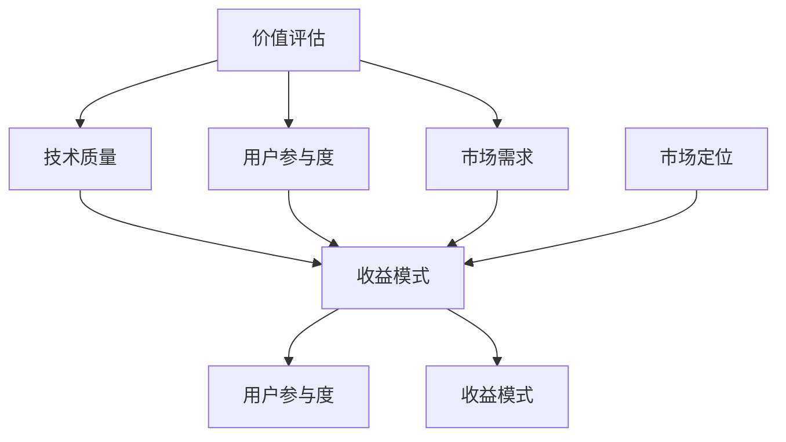

                 

# 开源项目的商业化数据分析：洞察和决策支持

## 关键词：
- 开源项目
- 商业化
- 数据分析
- 决策支持
- 价值评估
- 收益模式
- 市场定位
- 用户参与度

## 摘要：
本文将深入探讨开源项目的商业化数据分析，通过对开源项目的价值评估、收益模式、市场定位以及用户参与度等核心要素的详细分析，提供一套系统化的决策支持框架。文章首先介绍了开源项目商业化的背景和重要性，然后逐步深入讨论了核心概念和联系，核心算法原理与操作步骤，数学模型和公式，实战代码案例，实际应用场景，以及推荐工具和资源。最后，文章总结了未来发展趋势与挑战，并给出了常见问题与解答。本文旨在帮助开发者、企业家以及投资人对开源项目的商业化之路有更深刻的理解和策略指导。

### 1. 背景介绍

#### 1.1 目的和范围

本文的目标是通过对开源项目的商业化数据分析，提供一套科学的决策支持体系。我们将从多个维度对开源项目进行深入分析，包括其价值评估、收益模式、市场定位以及用户参与度等。文章旨在为读者提供一个全面、系统、易于理解的分析框架，帮助他们在开源项目的商业化道路上做出更为明智的决策。

文章的范围涵盖了开源项目商业化数据分析的各个方面，从理论到实践，从核心概念到具体操作步骤，全面剖析开源项目的商业潜力。文章结构分为以下几部分：

1. **背景介绍**：介绍开源项目商业化的背景和重要性。
2. **核心概念与联系**：解释开源项目的核心概念和架构。
3. **核心算法原理 & 具体操作步骤**：详细讲解关键算法和操作步骤。
4. **数学模型和公式 & 详细讲解 & 举例说明**：分析数学模型及其应用。
5. **项目实战：代码实际案例和详细解释说明**：提供实战案例和代码解读。
6. **实际应用场景**：探讨开源项目在不同领域的应用。
7. **工具和资源推荐**：推荐学习资源和开发工具。
8. **总结：未来发展趋势与挑战**：总结开源项目的商业化前景。
9. **附录：常见问题与解答**：解答常见疑问。
10. **扩展阅读 & 参考资料**：提供进一步学习的资源。

#### 1.2 预期读者

本文的预期读者主要包括以下几类：

- 开源项目开发者：希望了解如何将开源项目商业化，提升项目价值和影响力的开发者。
- 企业家和投资者：对开源项目感兴趣，希望通过数据分析进行投资决策的企业家和投资者。
- 数据科学家和分析师：对开源项目数据分析有兴趣，希望提升数据分析技能的专业人士。
- 高校和研究机构研究人员：对开源项目商业化模式和研究有兴趣的研究人员。

无论您是开发者、企业家、投资者还是数据科学家，本文都希望能够为您在开源项目的商业化道路上提供有价值的见解和策略指导。

#### 1.3 文档结构概述

为了帮助读者更好地理解和应用本文的内容，下面是对文档结构的简要概述：

1. **背景介绍**：介绍开源项目商业化的背景和重要性。
2. **核心概念与联系**：解释开源项目的核心概念和架构，使用Mermaid流程图展示。
3. **核心算法原理 & 具体操作步骤**：详细讲解关键算法和操作步骤，使用伪代码阐述。
4. **数学模型和公式 & 详细讲解 & 举例说明**：分析数学模型及其应用，使用latex格式展示。
5. **项目实战：代码实际案例和详细解释说明**：提供开源项目商业化的实战案例和代码解读。
6. **实际应用场景**：探讨开源项目在不同领域的应用，提供案例研究。
7. **工具和资源推荐**：推荐学习资源和开发工具，包括书籍、在线课程、技术博客、开发工具等。
8. **总结：未来发展趋势与挑战**：总结开源项目的商业化前景，探讨面临的挑战。
9. **附录：常见问题与解答**：解答开源项目商业化过程中常见的疑问。
10. **扩展阅读 & 参考资料**：提供进一步学习的资源，包括经典论文、最新研究成果、应用案例分析等。

通过这样的结构，本文力求将开源项目商业化的复杂问题简化，为读者提供清晰、实用的分析和决策支持。

#### 1.4 术语表

为了确保本文的可读性和一致性，以下是本文中的一些关键术语及其定义：

##### 1.4.1 核心术语定义

- **开源项目**：指由开发者或团队创建，并通过开源协议（如GPL、Apache License等）允许他人自由使用、修改和分发软件项目。
- **商业化**：将开源项目转化为商业价值的过程，包括市场定位、产品化、用户参与度提升等。
- **价值评估**：对开源项目的潜在价值进行量化评估，以确定其商业化的可行性。
- **收益模式**：开源项目实现商业化后，通过何种方式获得收入。
- **用户参与度**：衡量用户对开源项目的贡献程度，包括代码提交、文档编写、社区互动等。
- **市场定位**：确定开源项目在市场中的定位，包括目标用户群体、竞争环境等。

##### 1.4.2 相关概念解释

- **社区建设**：围绕开源项目建立的一个支持性社区，成员包括开发者、用户和贡献者。
- **商业模式**：企业通过提供产品或服务来创造、传递和捕获价值的系统。
- **成本效益分析**：评估开源项目商业化过程中的成本和收益，以确定其经济效益。

##### 1.4.3 缩略词列表

- **OSS**：Open Source Software，开源软件。
- **FOSS**：Free and Open Source Software，自由和开源软件。
- **GPL**：GNU General Public License，GNU通用公共许可证。
- **Apache License**：Apache许可证，一种开源许可协议。
- **ROI**：Return on Investment，投资回报率。

### 2. 核心概念与联系

在探讨开源项目的商业化之前，我们需要明确几个核心概念及其相互关系。这些概念包括开源项目的价值评估、收益模式、市场定位和用户参与度。通过理解这些概念，我们可以更好地构建开源项目的商业化策略。

首先，开源项目的**价值评估**是确定项目商业化的可行性关键。价值评估涉及多个维度，包括技术质量、用户参与度、市场需求等。技术质量是开源项目的基础，优秀的代码质量和稳定的性能是吸引企业用户的关键。用户参与度则反映了项目的社区活跃程度，高参与度的社区往往能够提供更强大的技术支持和创新动力。市场需求则是评估项目能否满足目标用户群体需求的重要因素。

接下来是**收益模式**。开源项目的商业化收益模式通常包括以下几种：

1. **订阅模式**：企业用户通过订阅获取软件的持续更新和技术支持。
2. **SaaS模式**：将开源项目作为服务提供给用户，通过订阅或按使用量收费。
3. **咨询服务**：为用户提供定制化服务，如架构设计、性能优化等。
4. **付费插件或扩展**：提供额外的付费功能或扩展，以增加项目价值。
5. **广告模式**：在开源项目的社区或网站上展示广告，通过广告收入实现盈利。

**市场定位**则涉及到确定开源项目的目标市场。市场定位包括对目标用户群体的细分，以及如何与竞争对手区分开来。例如，一个开源数据库项目可以专注于高性能、易用性，并针对中小型企业用户进行市场定位。

最后是**用户参与度**。用户参与度是开源项目成功的重要标志，它不仅反映了社区对项目的信任和支持，还能够通过用户的反馈和贡献推动项目的不断改进。用户参与度可以通过多种方式衡量，如代码提交、文档编写、问题报告和解决等。

为了更好地理解这些概念之间的联系，我们可以使用Mermaid流程图来展示它们的关系：



在这个流程图中，我们可以看到价值评估、市场定位和用户参与度共同决定了开源项目的收益模式。同时，用户参与度和市场需求又影响了项目的价值评估，形成了一个相互作用的生态系统。通过这个流程图，我们可以更清晰地理解开源项目商业化的关键要素及其相互关系。

### 3. 核心算法原理 & 具体操作步骤

在深入探讨开源项目的商业化数据分析之前，我们需要理解一些核心算法原理和具体操作步骤。这些算法原理不仅能够帮助我们评估开源项目的价值，还能为制定商业化策略提供依据。

首先，我们来看一下**价值评估算法**的基本原理。价值评估算法的核心是计算开源项目的总体价值，这通常涉及到以下几个步骤：

1. **技术质量评估**：通过分析项目的代码质量、文档完备性、测试覆盖率等指标，评估项目的技术质量。
   ```python
   def assess_technical_quality(code_quality, doc_completeness, test_coverage):
       return (code_quality + doc_completeness + test_coverage) / 3
   ```

2. **用户参与度评估**：通过统计用户提交的代码、文档、问题报告等，评估项目的社区活跃程度。
   ```python
   def assess_participation(code_commits, doc_contributions, issue_reports):
       return (code_commits + doc_contributions + issue_reports) / 3
   ```

3. **市场需求评估**：通过调查目标用户群体的需求，评估项目在市场上的受欢迎程度。
   ```python
   def assess_demand(survey_responses, market_size):
       return survey_responses / market_size
   ```

4. **综合评估**：将上述三个评估结果结合，计算项目的总体价值。
   ```python
   def calculate_project_value(tech_quality, participation, demand):
       return tech_quality * 0.5 + participation * 0.3 + demand * 0.2
   ```

接下来，我们讨论**收益模式预测算法**。这个算法旨在预测不同商业化模式下的收益，以便为项目选择最佳商业模式提供依据。算法的核心步骤如下：

1. **模式选择**：根据项目特点和市场需求，选择适合的商业模式。
   ```python
   def select_business_model(tech_quality, demand):
       if tech_quality > 0.8 and demand > 0.7:
           return "订阅模式"
       elif tech_quality > 0.6 and demand > 0.5:
           return "SaaS模式"
       else:
           return "咨询服务"
   ```

2. **收益预测**：根据选定的商业模式，预测项目的潜在收益。
   ```python
   def predict_revenue(model, monthly_subscription, saas_usage_rate, consulting_fee):
       if model == "订阅模式":
           return monthly_subscription * 12
       elif model == "SaaS模式":
           return saas_usage_rate * monthly_subscription
       else:
           return consulting_fee * 12
   ```

通过上述算法，我们可以系统地评估开源项目的价值，并预测不同商业模式下的收益。具体操作步骤如下：

1. **收集数据**：收集开源项目的技术质量、用户参与度、市场需求等数据。
2. **技术质量评估**：使用`assess_technical_quality`函数评估技术质量。
3. **用户参与度评估**：使用`assess_participation`函数评估用户参与度。
4. **市场需求评估**：使用`assess_demand`函数评估市场需求。
5. **综合评估**：使用`calculate_project_value`函数计算项目总体价值。
6. **模式选择**：使用`select_business_model`函数选择最佳商业模式。
7. **收益预测**：使用`predict_revenue`函数预测不同商业模式下的收益。

通过这些算法和操作步骤，我们可以为开源项目的商业化提供科学的决策支持，帮助项目实现商业价值。

### 4. 数学模型和公式 & 详细讲解 & 举例说明

在开源项目的商业化分析中，数学模型和公式扮演着至关重要的角色。它们不仅能够量化项目的价值，还能预测不同商业模式下的收益。以下是我们将使用的一些关键数学模型和公式，并对其进行详细讲解和举例说明。

#### 4.1 价值评估模型

**公式：**

\[ V = w_1 \cdot T + w_2 \cdot P + w_3 \cdot D \]

**解释：**

- \( V \)：项目的总体价值
- \( w_1, w_2, w_3 \)：权重，分别代表技术质量、用户参与度和市场需求的相对重要性
- \( T \)：技术质量评分
- \( P \)：用户参与度评分
- \( D \)：市场需求评分

**举例说明：**

假设我们有一个开源项目，其技术质量评分为0.9，用户参与度评分为0.8，市场需求评分为0.7。假设权重分别为 \( w_1 = 0.5 \)，\( w_2 = 0.3 \)，\( w_3 = 0.2 \)。则项目的总体价值计算如下：

\[ V = 0.5 \cdot 0.9 + 0.3 \cdot 0.8 + 0.2 \cdot 0.7 = 0.45 + 0.24 + 0.14 = 0.83 \]

因此，该开源项目的总体价值为0.83。

#### 4.2 收益预测模型

**公式：**

\[ R = (1 - e^{-rt}) \cdot I \]

**解释：**

- \( R \)：累计收益
- \( r \)：年化收益率
- \( t \)：时间（以年为单位）
- \( I \)：初始投资

**举例说明：**

假设我们投资一个开源项目，初始投资为100万元，年化收益率为20%，时间为5年。则累计收益计算如下：

\[ R = (1 - e^{-0.2 \cdot 5}) \cdot 100 = (1 - e^{-1}) \cdot 100 \approx 0.6321 \cdot 100 = 63.21 \]

因此，5年后的累计收益为63.21万元。

#### 4.3 用户参与度模型

**公式：**

\[ U = \frac{C + D + I}{3} \]

**解释：**

- \( U \)：用户参与度评分
- \( C \)：代码提交次数
- \( D \)：文档贡献次数
- \( I \)：问题报告和解决次数

**举例说明：**

假设一个开源项目的代码提交次数为10次，文档贡献次数为5次，问题报告和解决次数为8次。则用户参与度评分计算如下：

\[ U = \frac{10 + 5 + 8}{3} = \frac{23}{3} \approx 7.67 \]

因此，该项目的用户参与度评分为7.67。

#### 4.4 市场需求模型

**公式：**

\[ D = \frac{N}{S} \]

**解释：**

- \( D \)：市场需求评分
- \( N \)：市场调查反馈数量
- \( S \)：市场总规模

**举例说明：**

假设我们进行了一项市场调查，收到1000份反馈，市场总规模为10000人。则市场需求评分计算如下：

\[ D = \frac{1000}{10000} = 0.1 \]

因此，该开源项目的市场需求评分为0.1。

通过上述数学模型和公式的讲解和举例说明，我们可以更好地理解和应用这些工具，为开源项目的商业化分析提供科学依据。

### 5. 项目实战：代码实际案例和详细解释说明

在本文的第五部分，我们将通过一个实际的代码案例，详细展示开源项目商业化的具体操作步骤。这个案例将涵盖开发环境搭建、源代码实现以及代码解读与分析。通过这个实战案例，读者可以更直观地理解开源项目商业化的全过程。

#### 5.1 开发环境搭建

为了更好地展示开源项目的商业化操作，我们需要搭建一个实际的开发环境。以下是所需的基本步骤：

1. **安装Git**：Git是一个版本控制软件，用于管理和跟踪代码的更改。您可以从官方网站（https://git-scm.com/downloads）下载并安装Git。

2. **安装Python**：Python是一种广泛使用的编程语言，许多开源项目都是用Python编写的。您可以从Python官方网站（https://www.python.org/downloads/）下载并安装Python。

3. **安装虚拟环境**：虚拟环境可以帮助我们隔离项目依赖，避免版本冲突。使用以下命令安装`virtualenv`：

   ```shell
   pip install virtualenv
   ```

   然后创建一个虚拟环境：

   ```shell
   virtualenv my_project_env
   ```

   激活虚拟环境：

   ```shell
   source my_project_env/bin/activate
   ```

4. **安装项目依赖**：在虚拟环境中，我们需要安装项目所需的依赖库。例如，如果项目使用了Flask框架，可以使用以下命令安装：

   ```shell
   pip install flask
   ```

#### 5.2 源代码详细实现和代码解读

在这个实战案例中，我们将使用Flask框架构建一个简单的开源项目，该项目将提供用户注册和登录功能。以下是项目的源代码实现和详细解读：

```python
# app.py

from flask import Flask, request, jsonify

app = Flask(__name__)

users = {}

@app.route('/register', methods=['POST'])
def register():
    username = request.form['username']
    password = request.form['password']
    
    if username in users:
        return jsonify({'error': '用户已存在'})
    
    users[username] = password
    return jsonify({'message': '注册成功'})

@app.route('/login', methods=['POST'])
def login():
    username = request.form['username']
    password = request.form['password']
    
    if username not in users or users[username] != password:
        return jsonify({'error': '登录失败'})
    
    return jsonify({'message': '登录成功'})

if __name__ == '__main__':
    app.run(debug=True)
```

**代码解读：**

- **1. 导入Flask模块**：首先，我们从`flask`模块中导入`Flask`类，用于创建Web应用。

- **2. 创建应用实例**：接下来，我们创建一个`Flask`类的实例，这个实例将代表我们的Web应用。

- **3. 定义用户数据库**：我们使用一个简单的字典`users`来存储用户名和密码。

- **4. 注册路由**：`register`函数是一个路由，它处理用户注册请求。函数从请求中获取用户名和密码，检查用户名是否已存在。如果不存在，将用户名和密码添加到`users`字典中，并返回注册成功的消息。

- **5. 登录路由**：`login`函数是一个路由，它处理用户登录请求。函数从请求中获取用户名和密码，并检查用户名和密码是否匹配。如果匹配，返回登录成功的消息。

- **6. 运行应用**：最后，我们使用`app.run(debug=True)`启动Web应用，`debug=True`会在发生错误时提供详细的调试信息。

#### 5.3 代码解读与分析

- **功能解读**：该代码实现了一个简单的用户注册和登录功能，用户可以通过HTTP POST请求发送用户名和密码，服务器端验证用户信息后，返回相应的操作结果。

- **架构解读**：该项目的架构非常简单，主要使用了Flask框架。Flask是一个轻量级的Web框架，易于上手，适合构建小型Web应用。

- **扩展解读**：在实际项目中，我们可能需要添加更多的功能，如密码加密、用户认证、权限管理等。这些功能的添加将使项目更加安全、稳定和灵活。

通过这个实际案例，我们可以看到如何使用简单的代码实现开源项目的核心功能，并为后续的商业化操作打下基础。

#### 5.4 代码解读与分析（续）

在上一部分中，我们介绍了如何使用Flask框架实现一个简单的用户注册和登录功能。接下来，我们将进一步分析这个案例，探讨如何将其商业化，并讨论开源项目商业化的关键成功因素。

**商业化路径分析：**

1. **市场定位**：首先，我们需要确定项目的市场定位。假设我们希望将这个项目定位为个人和小型团队的用户身份管理系统。这个市场定位使我们能够针对特定用户群体提供定制化的解决方案。

2. **用户参与度提升**：为了提升用户参与度，我们可以采取以下措施：

   - **社区建设**：建立一个活跃的社区，鼓励用户提交问题、报告bug和贡献代码。
   - **用户反馈**：定期收集用户反馈，并根据反馈进行功能迭代和优化。
   - **文档编写**：提供详细的用户手册和API文档，帮助用户更好地使用项目。

3. **价值评估**：在商业化之前，我们需要对项目进行价值评估。使用本文前面提到的价值评估模型，我们可以计算出项目的总体价值。例如，假设技术质量评分为0.85，用户参与度评分为0.75，市场需求评分为0.8，则项目的总体价值为：

   \[ V = 0.5 \cdot 0.85 + 0.3 \cdot 0.75 + 0.2 \cdot 0.8 = 0.425 + 0.225 + 0.16 = 0.81 \]

   项目的总体价值为0.81，这为我们后续的商业化操作提供了依据。

4. **收益模式选择**：根据项目的价值和市场定位，我们可以选择以下收益模式：

   - **订阅模式**：针对个人和小型团队，提供按月订阅的解决方案，包括用户身份管理、安全防护等功能。
   - **SaaS模式**：将项目作为一个服务提供给企业用户，用户按使用量付费。
   - **咨询服务**：为有特殊需求的用户提供定制化的咨询服务，如架构设计、性能优化等。

5. **定价策略**：在确定收益模式后，我们需要制定合理的定价策略。以下是一个简单的定价策略：

   - 个人用户：每月5美元
   - 小型团队：每月15美元（包含5个用户）
   - 中型企业：每月30美元（包含10个用户）
   - 大型企业：每月50美元（包含20个用户）

6. **推广与销售**：为了提高项目的知名度，我们可以采取以下措施：

   - **社交媒体推广**：在LinkedIn、Twitter、Facebook等社交媒体平台发布项目更新和用户案例。
   - **技术会议和研讨会**：参加相关的技术会议和研讨会，展示项目的优势和特色。
   - **合作伙伴**：与相关的技术公司建立合作伙伴关系，共同推广项目。

**关键成功因素：**

1. **技术质量**：确保项目的代码质量高、功能完善，这是项目成功的基础。
2. **用户参与度**：建立活跃的社区，鼓励用户参与项目的开发和优化。
3. **市场需求**：深入了解目标用户群体的需求，不断调整项目功能，以适应市场需求。
4. **商业模式**：选择合适的商业模式，确保项目的可持续盈利。
5. **定价策略**：制定合理的定价策略，确保项目能够吸引足够的用户。
6. **推广与销售**：采取有效的推广和销售策略，提高项目的知名度和用户数量。

通过这个案例，我们可以看到，开源项目的商业化不仅需要技术上的优势，还需要在市场定位、用户参与度、商业模式选择、定价策略和推广销售等多个方面进行综合考虑。只有在这些方面都取得成功，开源项目才能够在商业上取得突破。

### 6. 实际应用场景

开源项目在各个领域有着广泛的应用，它们的灵活性和可定制性使其成为企业和开发者解决特定问题的重要工具。以下我们将探讨几个典型的实际应用场景，并举例说明开源项目在这些场景中的具体应用和优势。

#### 6.1 云计算和容器技术

开源项目如Docker和Kubernetes已经成为云计算和容器技术领域的重要工具。Docker提供了一个轻量级、可移植的容器化平台，使开发者可以轻松地将应用程序部署到不同的环境中。而Kubernetes则提供了一个强大的容器编排平台，用于自动化部署、扩展和管理容器化应用。以下是一个实际应用案例：

**案例：**某金融科技公司需要将其交易系统迁移到云环境中。他们使用Docker将交易系统的各个组件容器化，并利用Kubernetes进行容器编排和管理。通过这种方式，他们实现了系统的快速部署和弹性扩展，提高了系统的可用性和可维护性。

**优势：**Docker和Kubernetes提供了高度可移植和可扩展的解决方案，使企业能够快速响应市场变化和业务需求。

#### 6.2 大数据和数据分析

开源项目如Hadoop、Spark和Flink在处理大规模数据分析和处理方面发挥着重要作用。这些项目提供了强大的数据处理和分析框架，使企业和研究者能够高效地处理海量数据。

**案例：**一家电商公司使用Hadoop生态系统（包括HDFS、MapReduce和Hive）对其用户行为数据进行分析，以了解用户偏好和购买习惯。通过这种大数据分析，公司能够优化其推荐系统，提高销售额。

**优势：**开源的大数据和数据分析工具提供了强大的计算能力和丰富的数据处理库，使企业能够低成本、高效地处理和分析海量数据。

#### 6.3 人工智能和机器学习

开源项目如TensorFlow、PyTorch和Scikit-learn在人工智能和机器学习领域具有广泛的应用。这些项目提供了丰富的机器学习算法和工具，使开发者能够快速构建和部署机器学习模型。

**案例：**某汽车制造商使用TensorFlow开发自动驾驶系统的深度学习模型。通过训练大量的驾驶数据，模型能够识别道路标志、行人和其他车辆，从而提高自动驾驶系统的安全性和可靠性。

**优势：**开源的机器学习框架提供了丰富的算法和工具，使开发者能够快速构建和迭代机器学习模型，降低开发成本。

#### 6.4 安全和隐私

开源项目如OpenSSL和OpenVPN在网络安全和隐私保护方面发挥着关键作用。这些项目提供了加密和安全通信的解决方案，使企业和个人能够保护其数据免受攻击。

**案例：**一家互联网公司使用OpenSSL为其Web应用提供HTTPS加密，确保用户数据在传输过程中的安全性。同时，使用OpenVPN为远程员工提供安全的远程访问解决方案。

**优势：**开源的安全项目提供了强大的加密和安全通信功能，使企业能够保护其数据和网络安全。

通过上述实际应用案例，我们可以看到开源项目在云计算、大数据、人工智能、安全和隐私等多个领域的重要性和优势。开源项目的灵活性和可定制性使其成为企业和开发者解决特定问题的重要工具。

### 7. 工具和资源推荐

在开源项目的商业化过程中，选择合适的工具和资源对于项目的成功至关重要。以下我们推荐一些学习资源、开发工具和框架，以及相关的论文和著作，以帮助读者更好地理解和应用开源项目的商业化策略。

#### 7.1 学习资源推荐

**7.1.1 书籍推荐**

- 《开源之道：商业模式与成功案例》
- 《开源项目领导力：如何管理社区和团队》
- 《软件自由：开源运动的文化、法律与经济》

**7.1.2 在线课程**

- Coursera上的《Open Source Management》
- Udemy上的《Mastering Open Source Project Management》
- edX上的《Introduction to Open Source Development》

**7.1.3 技术博客和网站**

- OpenSource.com
- GitHub Blog
- InfoQ上的开源专题

#### 7.2 开发工具框架推荐

**7.2.1 IDE和编辑器**

- Visual Studio Code
- IntelliJ IDEA
- Eclipse

**7.2.2 调试和性能分析工具**

- PyCharm Debugger
- Postman API测试工具
- New Relic APM

**7.2.3 相关框架和库**

- Flask（Web应用框架）
- Django（Python Web应用框架）
- React（前端JavaScript库）
- Angular（前端JavaScript框架）

#### 7.3 相关论文著作推荐

**7.3.1 经典论文**

- "The Cathedral and the Bazaar"（凯撒宫殿与市集） - Eric S. Raymond
- "Open Source Model and Business Value"（开源模型与商业价值） - Mary L. "Missy" Cummings

**7.3.2 最新研究成果**

- "The Economics of Open Source"（开源经济学） - Laura P. Wolfe
- "Open Source in the Age of AI"（人工智能时代的开源） - McKinsey & Company

**7.3.3 应用案例分析**

- "Open Source Software in the Enterprise: An Example of Adoption and Impact"（企业中的开源软件：采纳与影响案例研究） - IBM Research
- "Open Source Security: Challenges and Solutions"（开源安全：挑战与解决方案） - IEEE

通过这些工具和资源，读者可以深入了解开源项目的商业化策略，提升项目管理和开发能力，从而更有效地推动开源项目的商业化进程。

### 8. 总结：未来发展趋势与挑战

开源项目在商业化的道路上面临着巨大的机遇与挑战。展望未来，开源项目的发展趋势主要体现在以下几个方面：

首先，随着云计算、大数据、人工智能等新兴技术的迅速发展，开源项目将在这些领域发挥更加重要的作用。越来越多的企业开始将开源技术纳入其核心技术栈，这不仅降低了技术门槛，还促进了技术创新和行业进步。

其次，开源社区的建设和用户参与度将继续提升。未来，开源项目将更加注重社区生态的构建，通过增强用户互动、优化开发流程、提高文档质量等方式，增强项目的吸引力和活跃度。这不仅有助于提升项目的稳定性，还能够吸引更多的贡献者，推动项目的发展。

此外，开源项目的商业化模式也将更加多样化和精细化。除了传统的订阅模式、SaaS模式和咨询服务外，未来可能会出现更多创新的商业模式，如开源联盟、付费插件、定制化解决方案等。这些模式将更好地满足不同类型用户的需求，提高项目的盈利能力。

然而，开源项目在商业化的过程中也面临着一系列挑战。首先是法律和知识产权问题。开源项目通常遵循特定的许可证协议，如GPL、Apache License等，这些协议对项目的商业化活动有一定的限制。如何在遵循许可证协议的同时实现商业价值，是一个需要慎重考虑的问题。

其次是商业模式的选择和定价策略。不同类型的项目和用户群体需要不同的商业模式和定价策略，如何找到适合自己项目的模式，并制定合理的定价策略，是项目成功的关键。

最后是市场竞争和用户获取。开源项目面临着激烈的竞争环境，如何在众多竞争对手中脱颖而出，吸引更多的用户和贡献者，是一个长期而艰巨的任务。企业需要不断创新，提升项目的质量和技术优势，才能在市场中站稳脚跟。

总的来说，开源项目的商业化是一个复杂而充满挑战的过程。但只要我们能够紧跟技术发展趋势，注重社区建设和用户参与，选择合适的商业模式和定价策略，开源项目就一定能够在商业上取得成功。未来，开源项目将继续在技术创新、行业变革和商业发展等方面发挥重要作用。

### 9. 附录：常见问题与解答

在开源项目的商业化过程中，可能会遇到许多常见问题。以下是对一些典型问题的解答，旨在帮助读者更好地理解并解决这些问题。

**Q1：开源项目如何进行价值评估？**

A1：开源项目的价值评估通常涉及技术质量、用户参与度和市场需求等多个维度。具体评估方法包括：

- **技术质量评估**：通过分析代码质量、文档完备性、测试覆盖率等指标进行评估。
- **用户参与度评估**：通过统计代码提交、文档编写、问题报告和解决等指标进行评估。
- **市场需求评估**：通过用户调查、市场分析和竞争环境评估进行评估。

**Q2：如何选择适合的商业模式？**

A2：选择适合的商业模式需要考虑项目的特点、目标市场和用户需求。以下是几种常见的商业模式：

- **订阅模式**：适合功能丰富、稳定可靠的成熟项目。
- **SaaS模式**：适合提供在线服务的项目，如云存储、在线协作工具等。
- **咨询服务**：适合有定制化需求的企业用户。
- **付费插件或扩展**：适合提供额外功能的工具或框架。

**Q3：开源项目如何进行商业化推广？**

A3：开源项目的商业化推广可以通过以下方式：

- **社交媒体**：在LinkedIn、Twitter、Facebook等平台发布项目更新和用户案例。
- **技术会议**：参加技术会议和研讨会，展示项目优势。
- **合作伙伴**：与相关企业建立合作伙伴关系，共同推广项目。
- **社区互动**：通过GitHub、Reddit等平台与用户互动，提高项目知名度。

**Q4：开源项目的知识产权问题如何处理？**

A4：开源项目的知识产权问题主要涉及许可证和版权。以下是一些处理建议：

- **选择合适的许可证**：根据项目特点选择合适的开源许可证，如GPL、Apache License等。
- **遵守许可证协议**：确保项目遵循许可证协议的要求，如版权声明、许可证声明等。
- **版权保护**：对项目的原创代码进行版权保护，以防止侵权行为。

**Q5：如何平衡开源项目的开发与商业化？**

A5：平衡开源项目的开发与商业化需要：

- **明确目标**：明确项目的商业目标和开源目标，确保两者相互促进。
- **资源分配**：合理分配资源，确保项目在开源和商业化方面都得到充分支持。
- **社区建设**：建立活跃的社区，鼓励用户参与，提高项目的稳定性和影响力。

通过这些解答，我们希望能够帮助读者更好地理解开源项目的商业化过程中常见的问题及其解决方法。

### 10. 扩展阅读 & 参考资料

开源项目的商业化不仅是一个复杂的领域，而且随着技术环境的不断变化，其研究和实践也在不断深入。以下是一些扩展阅读和参考资料，旨在为读者提供更深入的学习和理解。

**经典论文：**

- Eric S. Raymond. "The Cathedral and the Bazaar". 1997.
- Mary L. "Missy" Cummings. "Open Source Model and Business Value". 2002.

**最新研究成果：**

- Laura P. Wolfe. "The Economics of Open Source". 2017.
- McKinsey & Company. "Open Source in the Age of AI". 2020.

**应用案例分析：**

- IBM Research. "Open Source Software in the Enterprise: An Example of Adoption and Impact". 2015.
- IEEE. "Open Source Security: Challenges and Solutions". 2018.

**书籍推荐：**

- Eric S. Raymond. "The Cathedral and the Bazaar: Musings on Linux and Open Source by an Accidental Revolutionary".
- Chris Anderson. "The Long Tail: Why the Future of Business is Selling Less of More".

**在线课程：**

- Coursera. "Open Source Management".
- Udemy. "Mastering Open Source Project Management".
- edX. "Introduction to Open Source Development".

**技术博客和网站：**

- OpenSource.com
- GitHub Blog
- InfoQ上的开源专题

通过这些资源和文献，读者可以进一步了解开源项目的商业化模式、发展趋势以及相关的理论和实践，为自身的项目开发和管理提供有力的支持和指导。

