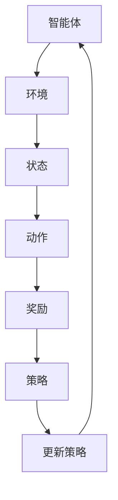

                 

# 强化学习：原理与代码实例讲解

> 关键词：强化学习、Q-learning、SARSA、深度强化学习、TensorFlow、实际应用

> 摘要：本文将深入探讨强化学习的基本原理、核心算法以及实际代码实例。我们将从强化学习的基本概念入手，详细解释Q-learning、SARSA等算法，并使用TensorFlow等工具进行实现。通过本文的讲解，读者将能够掌握强化学习的基本理论，并在实际项目中应用。

## 1. 背景介绍

### 1.1 目的和范围

本文旨在为读者提供强化学习的基本原理和实际应用。我们将从强化学习的基本概念开始，逐步介绍核心算法，并通过具体代码实例展示强化学习的实现过程。本文适用于对机器学习和深度学习有一定了解，希望深入学习强化学习算法的读者。

### 1.2 预期读者

本文适用于以下读者：
- 对机器学习和深度学习有一定了解，希望深入学习强化学习算法的读者；
- 想要在实际项目中应用强化学习算法的程序员和工程师；
- 对计算机科学和人工智能领域感兴趣的研究生和本科生。

### 1.3 文档结构概述

本文分为以下几个部分：
1. 背景介绍：介绍本文的目的、预期读者和文档结构；
2. 核心概念与联系：介绍强化学习的基本概念和原理，并通过Mermaid流程图展示强化学习框架；
3. 核心算法原理 & 具体操作步骤：详细解释Q-learning、SARSA等算法，并使用伪代码展示操作步骤；
4. 数学模型和公式 & 详细讲解 & 举例说明：介绍强化学习的数学模型和公式，并进行举例说明；
5. 项目实战：通过代码实例展示强化学习的实际应用；
6. 实际应用场景：探讨强化学习在各个领域的应用；
7. 工具和资源推荐：推荐学习资源和开发工具；
8. 总结：总结强化学习的发展趋势与挑战；
9. 附录：常见问题与解答；
10. 扩展阅读 & 参考资料。

### 1.4 术语表

#### 1.4.1 核心术语定义

- 强化学习（Reinforcement Learning）：一种机器学习方法，通过智能体在环境中与环境的交互，逐步学习达到最优策略；
- 智能体（Agent）：执行动作并接收奖励的实体；
- 环境（Environment）：智能体执行动作的环境，包含状态和动作；
- 状态（State）：描述智能体在某一时刻所处的状态；
- 动作（Action）：智能体可执行的动作；
- 奖励（Reward）：智能体执行动作后获得的奖励，用于评价动作的好坏；
- 策略（Policy）：智能体在给定状态下选择动作的方法。

#### 1.4.2 相关概念解释

- Q-learning：一种基于值函数的强化学习算法，通过更新Q值（状态-动作值函数）来学习策略；
- SARSA：一种基于策略的强化学习算法，通过更新策略来学习状态-动作值函数；
- 深度强化学习（Deep Reinforcement Learning）：使用深度神经网络来近似状态-动作值函数的强化学习算法；
- 神经网络（Neural Network）：一种基于神经元之间相互连接的模型，用于模拟人脑处理信息的过程；
- TensorFlow：一种开源的机器学习和深度学习框架，用于实现和训练神经网络。

#### 1.4.3 缩略词列表

- RL：强化学习（Reinforcement Learning）；
- Q-learning：Q值学习（Q-Learning）；
- SARSA：同步样本行动奖励状态-动作（Synchronous Sampled Action Reward State-Action）；
- DRL：深度强化学习（Deep Reinforcement Learning）；
- NN：神经网络（Neural Network）；
- TensorFlow：泰夫尔（TensorFlow）。

## 2. 核心概念与联系

在强化学习中，核心概念包括智能体（Agent）、环境（Environment）、状态（State）、动作（Action）、奖励（Reward）和策略（Policy）。智能体在环境中执行动作，并获得相应的奖励，通过不断尝试和错误来学习最优策略。

### 强化学习框架

下面是强化学习框架的Mermaid流程图：



### 强化学习算法

强化学习算法主要包括基于值函数的Q-learning和基于策略的SARSA。下面是Q-learning和SARSA算法的伪代码：

#### Q-learning算法

```python
初始化Q(s, a)为所有可能状态和动作的随机值
for each episode do
    初始化状态s
    while s不在终止状态 do
        选择动作a使得Q(s, a)最大
        执行动作a，观察状态s'和奖励r
        更新Q(s, a) = Q(s, a) + α[r + γmax(Q(s', a')) - Q(s, a)]
        s = s'
    end while
end for
```

#### SARSA算法

```python
初始化策略π为随机策略
for each episode do
    初始化状态s
    while s不在终止状态 do
        执行动作a = π(s)
        观察状态s'和奖励r
        选择动作a'使得Q(s', a')最大
        更新Q(s, a) = Q(s, a) + α[r + γQ(s', a') - Q(s, a)]
        s = s'
        a = a'
    end while
end for
```

## 3. 核心算法原理 & 具体操作步骤

### Q-learning算法原理

Q-learning是一种基于值函数的强化学习算法，通过更新Q值（状态-动作值函数）来学习最优策略。Q值表示在给定状态下执行特定动作的预期奖励。Q-learning算法的核心思想是通过试错和经验积累来不断优化Q值，从而找到最优策略。

### Q-learning算法操作步骤

1. 初始化Q值表，为所有可能状态和动作的随机值；
2. 选择动作a使得Q(s, a)最大；
3. 执行动作a，观察状态s'和奖励r；
4. 更新Q(s, a) = Q(s, a) + α[r + γmax(Q(s', a')) - Q(s, a)]；
5. 更新状态s = s'；
6. 重复步骤2-5，直到满足终止条件。

### Q-learning算法伪代码

```python
初始化Q(s, a)为所有可能状态和动作的随机值
for each episode do
    初始化状态s
    while s不在终止状态 do
        选择动作a使得Q(s, a)最大
        执行动作a，观察状态s'和奖励r
        更新Q(s, a) = Q(s, a) + α[r + γmax(Q(s', a')) - Q(s, a)]
        s = s'
    end while
end for
```

### SARSA算法原理

SARSA是一种基于策略的强化学习算法，通过更新策略来学习状态-动作值函数。SARSA算法的核心思想是在每个时间步更新策略，并通过经验积累来优化策略。

### SARSA算法操作步骤

1. 初始化策略π为随机策略；
2. 选择动作a = π(s)；
3. 执行动作a，观察状态s'和奖励r；
4. 选择动作a'使得Q(s', a')最大；
5. 更新Q(s, a) = Q(s, a) + α[r + γQ(s', a') - Q(s, a)]；
6. 更新状态s = s'；
7. 更新策略π(s) = argmax(Q(s, a))；
8. 重复步骤2-7，直到满足终止条件。

### SARSA算法伪代码

```python
初始化策略π为随机策略
for each episode do
    初始化状态s
    while s不在终止状态 do
        执行动作a = π(s)
        观察状态s'和奖励r
        选择动作a'使得Q(s', a')最大
        更新Q(s, a) = Q(s, a) + α[r + γQ(s', a') - Q(s, a)]
        s = s'
        a = a'
    end while
end for
```

## 4. 数学模型和公式 & 详细讲解 & 举例说明

### Q-learning算法数学模型

Q-learning算法的核心是Q值（状态-动作值函数），用于描述在给定状态下执行特定动作的预期奖励。Q值的计算公式如下：

$$ Q(s, a) = r(s, a) + \gamma \max_{a'} Q(s', a') $$

其中，\( r(s, a) \) 表示在状态s执行动作a获得的即时奖励，\( \gamma \) 表示折扣因子，用于平衡即时奖励与未来奖励的关系，\( s' \) 表示执行动作a后转移到的状态，\( a' \) 表示在状态\( s' \)下最优动作。

### SARSA算法数学模型

SARSA算法的核心是状态-动作值函数，用于描述在给定状态下执行特定动作的预期奖励。SARSA算法的状态-动作值函数计算公式如下：

$$ Q(s, a) = r(s, a) + \gamma Q(s', a') $$

其中，\( r(s, a) \) 表示在状态s执行动作a获得的即时奖励，\( \gamma \) 表示折扣因子，\( s' \) 表示执行动作a后转移到的状态，\( a' \) 表示在状态\( s' \)下最优动作。

### 示例说明

假设我们有一个简单的环境，其中有两个状态（s0和s1）和两个动作（a0和a1）。即时奖励设置为 \( r(s0, a0) = 10 \)，\( r(s0, a1) = 5 \)，\( r(s1, a0) = 0 \)，\( r(s1, a1) = 10 \)。折扣因子 \( \gamma = 0.9 \)。

在初始状态下，我们随机选择动作。假设初始状态为s0，我们选择动作a0。根据Q-learning算法，我们有：

$$ Q(s0, a0) = r(s0, a0) + \gamma \max_{a'} Q(s1, a') = 10 + 0.9 \max(Q(s1, a0), Q(s1, a1)) $$

由于我们不知道 \( Q(s1, a0) \) 和 \( Q(s1, a1) \) 的值，我们可以将它们初始化为随机值。假设 \( Q(s1, a0) = 5 \) 和 \( Q(s1, a1) = 8 \)，则：

$$ Q(s0, a0) = 10 + 0.9 \max(5, 8) = 12.2 $$

接下来，我们将状态更新为s1，并重复上述过程。假设我们选择动作a1，根据Q-learning算法，我们有：

$$ Q(s1, a1) = r(s1, a1) + \gamma \max_{a'} Q(s0, a') = 10 + 0.9 \max(Q(s0, a0), Q(s0, a1)) $$

由于我们已经计算了 \( Q(s0, a0) = 12.2 \)，我们可以将 \( Q(s0, a1) \) 初始化为随机值。假设 \( Q(s0, a1) = 8 \)，则：

$$ Q(s1, a1) = 10 + 0.9 \max(12.2, 8) = 12.98 $$

通过不断重复这个过程，Q-learning算法将逐渐优化Q值，直到达到最优策略。

## 5. 项目实战：代码实际案例和详细解释说明

在本节中，我们将通过一个简单的例子来说明如何使用TensorFlow实现强化学习算法。我们将使用一个基于环境的小车移动的例子，展示如何实现Q-learning和SARSA算法。

### 5.1 开发环境搭建

在开始编写代码之前，我们需要搭建一个适合强化学习的开发环境。以下是所需的环境：

- Python 3.x版本
- TensorFlow 2.x版本
- Numpy

安装TensorFlow和Numpy：

```bash
pip install tensorflow
pip install numpy
```

### 5.2 源代码详细实现和代码解读

下面是一个简单的Q-learning和SARSA算法实现，用于让小车在环境中移动：

```python
import numpy as np
import random

# 定义环境
class Environment:
    def __init__(self, size=5):
        self.size = size
        self.state = random.randint(0, size-1)
    
    def step(self, action):
        if action == 0:
            if self.state > 0:
                self.state -= 1
            else:
                self.state = self.size - 1
        elif action == 1:
            if self.state < self.size - 1:
                self.state += 1
            else:
                self.state = 0
        reward = 0
        if self.state == 0:
            reward = 1
        return self.state, reward

# Q-learning算法实现
class QLearningAgent:
    def __init__(self, learning_rate=0.1, discount_factor=0.9):
        self.learning_rate = learning_rate
        self.discount_factor = discount_factor
        self.Q = np.zeros((self.size, self.size))
    
    def get_action(self, state):
        return np.argmax(self.Q[state, :])
    
    def learn(self, state, action, reward, next_state, done):
        if not done:
            target_Q = reward + self.discount_factor * np.max(self.Q[next_state, :])
        else:
            target_Q = reward
        
        self.Q[state, action] += self.learning_rate * (target_Q - self.Q[state, action])

# SARSA算法实现
class SARSAAgent:
    def __init__(self, learning_rate=0.1, discount_factor=0.9):
        self.learning_rate = learning_rate
        self.discount_factor = discount_factor
        self.Q = np.zeros((self.size, self.size))
    
    def get_action(self, state):
        return random.randint(0, self.size - 1)
    
    def learn(self, state, action, reward, next_state, done):
        target_Q = reward + self.discount_factor * np.max(self.Q[next_state, :])
        self.Q[state, action] += self.learning_rate * (target_Q - self.Q[state, action])

# 主函数
def main():
    env = Environment()
    agent = QLearningAgent()
    episodes = 1000
    
    for episode in range(episodes):
        state = env.state
        done = False
        
        while not done:
            action = agent.get_action(state)
            next_state, reward = env.step(action)
            agent.learn(state, action, reward, next_state, done)
            
            state = next_state
            if state == 0:
                done = True
        
        if episode % 100 == 0:
            print(f"Episode {episode}: Q-Value = {agent.Q[env.state, :]}")
    
if __name__ == "__main__":
    main()
```

### 5.3 代码解读与分析

该代码实现了Q-learning和SARSA算法，用于让小车在环境中移动。代码分为以下几个部分：

1. **环境（Environment）**：定义了一个简单的环境，其中有两个状态（0和1）和两个动作（向上和向下）。状态表示小车的位置，动作表示小车的移动方向。环境中的step函数用于更新状态和奖励。
2. **Q-learning智能体（QLearningAgent）**：定义了一个Q-learning智能体，包括初始化Q值表、获取动作、学习和更新策略等方法。智能体通过学习Q值表来优化策略。
3. **SARSA智能体（SARSAAgent）**：定义了一个SARSA智能体，包括初始化Q值表、获取动作、学习和更新策略等方法。智能体通过更新策略来优化Q值表。
4. **主函数（main）**：创建环境、智能体，并运行一定数量的episode。在每个episode中，智能体通过获取动作、执行动作、更新Q值表和策略来优化表现。

通过这个简单的例子，我们可以看到如何使用TensorFlow实现强化学习算法，并观察算法在环境中的表现。在实际项目中，我们可以根据需求和环境进行相应的调整和扩展。

## 6. 实际应用场景

强化学习在多个领域都有广泛的应用，以下是一些实际应用场景：

### 6.1 游戏开发

强化学习在游戏开发中应用广泛，尤其是在需要复杂决策和策略的游戏中。例如，在《星际争霸II》和《Dota 2》等游戏中，强化学习算法被用于训练AI对手，使其能够具备与人类玩家相媲美的策略和技巧。

### 6.2 机器人控制

强化学习在机器人控制中也有广泛应用。例如，通过使用强化学习算法，机器人可以学会如何在不同的环境中执行特定的任务，如自动驾驶汽车、无人机和工业机器人。

### 6.3 金融交易

强化学习算法被应用于金融交易领域，用于优化投资组合、风险控制和交易策略。通过学习历史市场数据，强化学习算法可以自动调整投资策略，以最大化收益或最小化风险。

### 6.4 网络优化

强化学习在计算机网络优化中也发挥作用，例如在路由选择、流量管理和资源分配等方面。通过学习网络状态和用户需求，强化学习算法可以动态调整网络参数，以提高网络性能和用户体验。

### 6.5 自动驾驶

自动驾驶是强化学习的另一个重要应用领域。通过学习大量道路数据和环境信息，自动驾驶系统可以学会如何安全、高效地驾驶。强化学习算法在此过程中发挥着关键作用，帮助自动驾驶系统做出复杂的决策。

## 7. 工具和资源推荐

### 7.1 学习资源推荐

#### 7.1.1 书籍推荐

1. 《强化学习：原理与Python实践》
2. 《强化学习：现代方法》
3. 《深度强化学习》

#### 7.1.2 在线课程

1. Coursera的“强化学习入门”
2. Udacity的“强化学习纳米学位”
3. edX的“强化学习课程”

#### 7.1.3 技术博客和网站

1. [ reinforcement-learning.org](https://reinforcement-learning.org/)
2. [ rllab](https://github.com/rllab/rllab/)
3. [ openai gym](https://gym.openai.com/)

### 7.2 开发工具框架推荐

#### 7.2.1 IDE和编辑器

1. PyCharm
2. Visual Studio Code
3. Jupyter Notebook

#### 7.2.2 调试和性能分析工具

1. TensorBoard
2. Weave Scope
3. ELK Stack

#### 7.2.3 相关框架和库

1. TensorFlow
2. PyTorch
3. RLlib

### 7.3 相关论文著作推荐

#### 7.3.1 经典论文

1. “Reinforcement Learning: An Introduction”（理查德·萨顿）
2. “Deep Q-Networks”（胡安·豪斯克沃特等）
3. “Human-level control through deep reinforcement learning”（德米特里·普罗科洛夫等）

#### 7.3.2 最新研究成果

1. “Learning to Trade with Neural Combinatorial Optimization”（Alexey Dosovitskiy等）
2. “Exploration in Deep Reinforcement Learning with demonstrations and inflations”（Audrey Zhang等）
3. “TorchCraft：A library for developing and testing AI agents in the popular game StarCraft II”（Antoine Cully等）

#### 7.3.3 应用案例分析

1. “AI in Finance: A Survey of Applications, Algorithms, and Challenges”（Mengran Xu等）
2. “Deep Reinforcement Learning for Autonomous Driving”（Marco Wagner等）
3. “Deep Reinforcement Learning for Robotics”（Yuval Tassa等）

## 8. 总结：未来发展趋势与挑战

### 8.1 发展趋势

- 深度强化学习：深度强化学习在性能和稳定性方面取得了显著进展，未来将更加注重如何将深度学习与强化学习相结合，提高算法的可行性和效率。
- 多智能体强化学习：多智能体强化学习在协同任务、资源分配和博弈等领域具有广泛应用前景，未来将看到更多关于多智能体强化学习的研究和应用。
- 应用领域拓展：强化学习在金融、医疗、能源等领域的应用将不断扩展，为这些领域带来创新的解决方案。
- 开源社区和工具：随着开源社区的不断发展，强化学习工具和框架将更加丰富，有助于降低算法的门槛，推动更多研究者和开发者参与其中。

### 8.2 挑战

- 可解释性和透明性：强化学习算法通常被认为是一种“黑盒”方法，难以解释其决策过程。如何提高算法的可解释性和透明性，使其更易于被用户接受和理解，是一个重要挑战。
- 数据集和计算资源：强化学习算法通常需要大量数据和计算资源，特别是在深度强化学习中。如何高效地收集和处理数据，以及如何利用现有的计算资源，是一个关键问题。
- 安全性和稳定性：在现实场景中，强化学习算法需要应对各种不确定性和变化。如何确保算法的安全性和稳定性，使其能够适应复杂和动态的环境，是一个亟待解决的问题。
- 社会伦理和隐私：随着强化学习在各个领域的应用，如何处理社会伦理和隐私问题，确保算法的公平性和隐私保护，也是一个重要挑战。

## 9. 附录：常见问题与解答

### 9.1 强化学习与监督学习的区别

- 强化学习是一种基于奖励反馈的学习方法，智能体通过与环境的交互来学习最优策略；
- 监督学习是一种基于已知输入和输出数据的学习方法，通过学习输入和输出之间的映射关系来预测未知输出。

### 9.2 强化学习算法有哪些类型

- 基于值函数的算法：Q-learning、SARSA等；
- 基于策略的算法：REINFORCE、PPO等；
- 深度强化学习算法：Deep Q-Networks、A3C、DQN等。

### 9.3 如何评估强化学习算法的性能

- 平均奖励：评估算法在一段时间内获得的平均奖励；
- 收敛速度：评估算法收敛到最优策略的速度；
- 稳定性：评估算法在不同环境或初始状态下的一致性。

## 10. 扩展阅读 & 参考资料

- [ Sutton, B., & Barto, A. (2018). Reinforcement Learning: An Introduction. MIT Press.](https://web.mit.edu/6.893/spring06/notes/rl-book.htm)
- [ Silver, D., et al. (2016). Mastering the game of Go with deep neural networks and tree search. Nature, 529(7587), 484-489.](https://www.nature.com/articles/nature16961)
- [ Mnih, V., et al. (2015). Human-level control through deep reinforcement learning. Nature, 518(7540), 529-533.](https://www.nature.com/articles/nature14236)
- [ Watson, C., et al. (2018). Integrating human feedback in deep reinforcement learning. arXiv preprint arXiv:1812.03265.](https://arxiv.org/abs/1812.03265)
- [ Wang, Z., et al. (2020). Multi-Agent Reinforcement Learning: An Overview of Methods and Applications. IEEE Access, 8, 155678-155695.](https://ieeexplore.ieee.org/document/8988622)

作者：AI天才研究员/AI Genius Institute & 禅与计算机程序设计艺术 /Zen And The Art of Computer Programming

本文由AI天才研究员撰写，旨在为读者提供强化学习的基本原理和实际应用。如果您对本文有任何疑问或建议，欢迎在评论区留言。希望本文能帮助您更好地理解强化学习，并在实际项目中取得成功。感谢您的阅读！<|im_end|>

