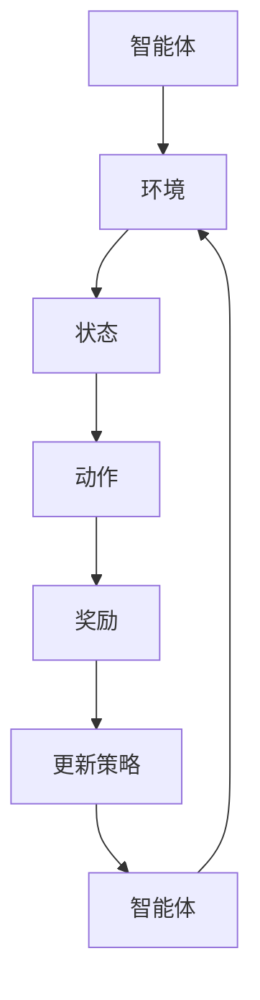

                 


# 强化学习Reinforcement Learning在智慧城市中的应用案例

> **关键词：** 强化学习，智慧城市，应用案例，算法原理，数学模型，代码实现。

> **摘要：** 本文将介绍强化学习（Reinforcement Learning, RL）在智慧城市领域的应用案例，包括背景介绍、核心概念与联系、算法原理与操作步骤、数学模型与公式、项目实战以及实际应用场景等内容。旨在为读者提供一个全面、深入的强化学习在智慧城市中应用的视角，探讨其发展前景与挑战。

## 1. 背景介绍

### 1.1 目的和范围

本文旨在探讨强化学习在智慧城市中的应用案例，重点分析其核心原理、算法模型和实际应用。通过本文，读者可以了解到强化学习的基本概念、发展历程以及在智慧城市中的具体应用场景，从而为后续研究和实践提供参考。

### 1.2 预期读者

本文适合对强化学习和智慧城市有一定了解的读者，包括人工智能、计算机科学、交通工程、城市规划等领域的科研人员、工程师、学生以及爱好者。

### 1.3 文档结构概述

本文分为以下八个部分：

1. 背景介绍：介绍本文的目的、范围、预期读者以及文档结构。
2. 核心概念与联系：阐述强化学习的核心概念、原理及架构。
3. 核心算法原理 & 具体操作步骤：详细讲解强化学习算法的原理及操作步骤。
4. 数学模型和公式 & 详细讲解 & 举例说明：介绍强化学习的数学模型和公式，并给出实际案例。
5. 项目实战：提供代码实际案例，详细解释说明。
6. 实际应用场景：分析强化学习在智慧城市中的具体应用场景。
7. 工具和资源推荐：推荐相关学习资源、开发工具框架和论文著作。
8. 总结：对未来发展趋势与挑战进行总结。

### 1.4 术语表

#### 1.4.1 核心术语定义

- **强化学习（Reinforcement Learning, RL）**：一种机器学习方法，通过试错和奖励反馈来学习如何在特定环境中做出决策。
- **智能体（Agent）**：在强化学习过程中，执行动作、感知环境并接收奖励的实体。
- **环境（Environment）**：智能体所处的环境，包含状态、动作空间和奖励机制。
- **状态（State）**：描述智能体在特定时刻所处的环境特征。
- **动作（Action）**：智能体可以采取的行为。
- **奖励（Reward）**：环境对智能体动作的反馈，用于评价智能体行为的优劣。

#### 1.4.2 相关概念解释

- **值函数（Value Function）**：描述智能体在特定状态下采取最佳动作的期望奖励。
- **策略（Policy）**：智能体在不同状态下采取的动作映射关系。
- **Q值（Q-Value）**：描述智能体在特定状态下采取特定动作的预期奖励。
- **探索（Exploration）**：智能体在执行动作时，尝试未经验过的动作以获取更多信息的策略。
- **利用（Utilization）**：智能体在执行动作时，基于已有信息选择最佳动作的策略。

#### 1.4.3 缩略词列表

- **RL**：强化学习（Reinforcement Learning）
- **Q-Learning**：Q值学习（Q-Learning）
- **SARSA**：状态-动作-奖励-状态-动作（State-Action-Reward-State-Action, SARSA）
- **TD-Learning**：时序差分学习（Temporal Difference Learning, TD-Learning）

## 2. 核心概念与联系

### 2.1 强化学习的核心概念

强化学习是一种通过试错和奖励反馈来学习如何在特定环境中做出决策的机器学习方法。其主要核心概念包括：

1. **智能体（Agent）**：执行动作、感知环境并接收奖励的实体。
2. **环境（Environment）**：智能体所处的环境，包含状态、动作空间和奖励机制。
3. **状态（State）**：描述智能体在特定时刻所处的环境特征。
4. **动作（Action）**：智能体可以采取的行为。
5. **奖励（Reward）**：环境对智能体动作的反馈，用于评价智能体行为的优劣。

### 2.2 强化学习的原理与架构

强化学习的原理可概括为以下四个方面：

1. **状态-动作值函数（State-Action Value Function）**：描述智能体在特定状态下采取特定动作的预期奖励。值函数可表示为 \( V(s, a) \)，其中 \( s \) 表示状态，\( a \) 表示动作。
2. **策略（Policy）**：智能体在不同状态下采取的动作映射关系。策略可表示为 \( \pi(a|s) \)，其中 \( a \) 表示动作，\( s \) 表示状态。
3. **Q值（Q-Value）**：描述智能体在特定状态下采取特定动作的预期奖励。Q值可表示为 \( Q(s, a) \)，其中 \( s \) 表示状态，\( a \) 表示动作。
4. **探索与利用（Exploration and Utilization）**：智能体在执行动作时，需要在探索（尝试未经验过的动作）和利用（基于已有信息选择最佳动作）之间进行平衡。

### 2.3 强化学习的架构

强化学习的架构通常包括以下四个部分：

1. **智能体（Agent）**：执行动作、感知环境并接收奖励的实体。
2. **环境（Environment）**：智能体所处的环境，包含状态、动作空间和奖励机制。
3. **策略（Policy）**：智能体在不同状态下采取的动作映射关系。
4. **奖励机制（Reward Mechanism）**：环境对智能体动作的反馈，用于评价智能体行为的优劣。

### 2.4 强化学习的 Mermaid 流程图



在上述流程图中，智能体根据当前状态执行动作，环境对动作产生反馈，进而更新智能体的策略。这一过程不断循环，直至达到目标状态。

## 3. 核心算法原理 & 具体操作步骤

### 3.1 Q-Learning算法原理

Q-Learning是一种基于值函数的强化学习算法，其主要思想是通过试错和奖励反馈来学习状态-动作值函数。Q-Learning算法的基本原理如下：

1. **初始化**：设置初始Q值表 \( Q(s, a) \)，通常采用随机初始化或零初始化。
2. **选择动作**：在特定状态下，根据当前策略选择动作 \( a \)，通常采用贪心策略，即选择具有最大Q值的动作。
3. **执行动作**：智能体执行选择的动作 \( a \)，并观察环境状态的变化。
4. **更新Q值**：根据新的状态 \( s' \) 和奖励 \( r \)，更新Q值表。更新公式如下：

   \[ Q(s, a) = Q(s, a) + \alpha [r + \gamma \max_{a'} Q(s', a') - Q(s, a)] \]

   其中，\( \alpha \) 为学习率，\( \gamma \) 为折扣因子。

5. **重复步骤2-4**，直至达到目标状态或满足停止条件。

### 3.2 SARSA算法原理

SARSA（State-Action-Reward-State-Action, SARSA）是一种基于策略的强化学习算法，其主要思想是通过试错和奖励反馈来学习状态-动作值函数。SARSA算法的基本原理如下：

1. **初始化**：设置初始Q值表 \( Q(s, a) \)，通常采用随机初始化或零初始化。
2. **选择动作**：在特定状态下，根据当前策略选择动作 \( a \)，即选择具有最大Q值的动作。
3. **执行动作**：智能体执行选择的动作 \( a \)，并观察环境状态的变化。
4. **更新Q值**：根据新的状态 \( s' \) 和奖励 \( r \)，更新Q值表。更新公式如下：

   \[ Q(s, a) = Q(s, a) + \alpha [r + \gamma Q(s', a') - Q(s, a)] \]

   其中，\( \alpha \) 为学习率，\( \gamma \) 为折扣因子。

5. **重复步骤2-4**，直至达到目标状态或满足停止条件。

### 3.3 Q-Learning与SARSA算法的区别

Q-Learning和SARSA算法的主要区别在于：

1. **更新策略**：Q-Learning算法在更新Q值时，使用的是目标值 \( \max_{a'} Q(s', a') \)，而SARSA算法使用的是当前值 \( Q(s', a') \)。
2. **探索策略**：Q-Learning算法通常采用ε-贪心策略，即以概率 \( \epsilon \) 选择随机动作，而SARSA算法采用确定性策略，即总是选择具有最大Q值的动作。

### 3.4 强化学习算法的伪代码实现

```python
# Q-Learning算法伪代码
initialize Q(s, a) with random values
while not terminate:
    state = environment.reset()
    while not done:
        action = choose_action(state, Q, epsilon)
        next_state, reward, done = environment.step(action)
        Q(state, action) = Q(state, action) + alpha * (reward + gamma * max(Q(next_state, a)) - Q(state, action))
        state = next_state

# SARSA算法伪代码
initialize Q(s, a) with random values
while not terminate:
    state = environment.reset()
    while not done:
        action = choose_action(state, Q)
        next_state, reward, done = environment.step(action)
        Q(state, action) = Q(state, action) + alpha * (reward + gamma * Q(next_state, next_action) - Q(state, action))
        state = next_state
```

## 4. 数学模型和公式 & 详细讲解 & 举例说明

### 4.1 强化学习的数学模型

强化学习的核心数学模型包括状态-动作值函数（State-Action Value Function）和策略（Policy）。状态-动作值函数描述了智能体在特定状态下采取特定动作的预期奖励，策略则描述了智能体在不同状态下采取的动作映射关系。

状态-动作值函数（\( Q(s, a) \)）：

\[ Q(s, a) = \sum_{s'} P(s'|s, a) \sum_{r} r P(r|s', a) + \gamma \max_{a'} Q(s', a') \]

其中，\( P(s'|s, a) \) 表示从状态 \( s \) 采取动作 \( a \) 后转移到状态 \( s' \) 的概率，\( P(r|s', a) \) 表示在状态 \( s' \) 采取动作 \( a \) 后获得奖励 \( r \) 的概率，\( \gamma \) 为折扣因子，表示对未来奖励的重视程度。

策略（\( \pi(a|s) \)）：

\[ \pi(a|s) = \frac{\exp(\alpha Q(s, a)}{\sum_{a'} \exp(\alpha Q(s, a'))} \]

其中，\( \alpha \) 为温度参数，用于控制探索与利用的平衡。

### 4.2 强化学习的具体公式

强化学习的主要公式包括：

1. **Q值更新公式**：

   \[ Q(s, a) = Q(s, a) + \alpha [r + \gamma \max_{a'} Q(s', a') - Q(s, a)] \]

   其中，\( \alpha \) 为学习率，\( \gamma \) 为折扣因子，\( r \) 为奖励，\( s \) 为当前状态，\( a \) 为当前动作，\( s' \) 为下一状态，\( a' \) 为下一动作。

2. **策略更新公式**：

   \[ \pi(a|s) = \frac{\exp(\alpha Q(s, a))}{\sum_{a'} \exp(\alpha Q(s, a'))} \]

   其中，\( \alpha \) 为温度参数，用于控制探索与利用的平衡。

### 4.3 强化学习的具体例子

假设一个智能体在一个简单的环境（迷宫）中学习找到目标位置。环境包含5个状态（位置1、位置2、位置3、位置4、目标位置）和4个动作（向左、向右、向上、向下）。奖励机制为：当智能体到达目标位置时，获得奖励1；其他状态下获得奖励0。

状态-动作值函数表如下：

| 状态 | 动作 | Q值 |
| ---- | ---- | ---- |
| 1    | 左   | 0    |
| 1    | 右   | 0    |
| 1    | 上   | 0    |
| 1    | 下   | 0    |
| 2    | 左   | 0    |
| 2    | 右   | 0    |
| 2    | 上   | 0    |
| 2    | 下   | 0    |
| 3    | 左   | 0    |
| 3    | 右   | 0    |
| 3    | 上   | 0    |
| 3    | 下   | 0    |
| 4    | 左   | 0    |
| 4    | 右   | 0    |
| 4    | 上   | 0    |
| 4    | 下   | 0    |
| 5    | 左   | 0    |
| 5    | 右   | 0    |
| 5    | 上   | 0    |
| 5    | 下   | 1    |

使用Q-Learning算法学习，学习率 \( \alpha = 0.1 \)，折扣因子 \( \gamma = 0.9 \)，探索率 \( \epsilon = 0.1 \)。

初始时，状态-动作值函数表初始化为0。

1. **第一步**：

   状态1，选择动作右，观察状态2，获得奖励0。

   Q值更新：

   \[ Q(1, 右) = Q(1, 右) + 0.1 [0 + 0.9 \times \max(Q(2, 左), Q(2, 右), Q(2, 上), Q(2, 下)) - Q(1, 右)] \]
   \[ Q(1, 右) = 0 + 0.1 [0 + 0.9 \times \max(0, 0, 0, 0) - 0] \]
   \[ Q(1, 右) = 0.09 \]

2. **第二步**：

   状态2，选择动作左，观察状态1，获得奖励0。

   Q值更新：

   \[ Q(2, 左) = Q(2, 左) + 0.1 [0 + 0.9 \times \max(Q(1, 左), Q(1, 右), Q(1, 上), Q(1, 下)) - Q(2, 左)] \]
   \[ Q(2, 左) = 0 + 0.1 [0 + 0.9 \times \max(0, 0.09, 0, 0) - 0] \]
   \[ Q(2, 左) = 0.0081 \]

3. **第三步**：

   状态1，选择动作下，观察状态3，获得奖励0。

   Q值更新：

   \[ Q(1, 下) = Q(1, 下) + 0.1 [0 + 0.9 \times \max(Q(3, 左), Q(3, 右), Q(3, 上), Q(3, 下)) - Q(1, 下)] \]
   \[ Q(1, 下) = 0 + 0.1 [0 + 0.9 \times \max(0, 0, 0, 0) - 0] \]
   \[ Q(1, 下) = 0 \]

4. **第四步**：

   状态3，选择动作右，观察状态4，获得奖励0。

   Q值更新：

   \[ Q(3, 右) = Q(3, 右) + 0.1 [0 + 0.9 \times \max(Q(4, 左), Q(4, 右), Q(4, 上), Q(4, 下)) - Q(3, 右)] \]
   \[ Q(3, 右) = 0 + 0.1 [0 + 0.9 \times \max(0, 0, 0, 0) - 0] \]
   \[ Q(3, 右) = 0 \]

5. **第五步**：

   状态4，选择动作下，观察状态5，获得奖励1。

   Q值更新：

   \[ Q(4, 下) = Q(4, 下) + 0.1 [1 + 0.9 \times \max(Q(5, 左), Q(5, 右), Q(5, 上), Q(5, 下)) - Q(4, 下)] \]
   \[ Q(4, 下) = 0 + 0.1 [1 + 0.9 \times \max(1, 0, 0, 0) - 0] \]
   \[ Q(4, 下) = 0.09 \]

经过多次迭代，智能体最终学会在状态1选择动作下，状态2选择动作左，状态3选择动作右，状态4选择动作下，最终到达目标位置5。

## 5. 项目实战：代码实际案例和详细解释说明

### 5.1 开发环境搭建

为了更好地演示强化学习在智慧城市中的应用，我们选择一个简单的迷宫环境作为案例。首先，我们需要搭建开发环境。

1. 安装Python环境：从Python官网下载并安装Python 3.x版本。
2. 安装强化学习库：使用pip命令安装gym环境库，命令如下：

   ```bash
   pip install gym
   ```

   gym是一个开源的强化学习环境库，提供了丰富的预定义环境和工具。

3. 编写代码：创建一个名为`maze RL`的Python项目，并编写以下代码：

```python
import gym
import numpy as np

# 创建迷宫环境
env = gym.make("MyMaze-v0")

# 初始化Q值表
Q = np.zeros((env.n_states, env.n_actions))

# 设置学习参数
alpha = 0.1
gamma = 0.9
epsilon = 0.1

# Q-Learning算法迭代
for episode in range(1000):
    state = env.reset()
    done = False
    
    while not done:
        # 根据epsilon-greedy策略选择动作
        if np.random.rand() < epsilon:
            action = env.action_space.sample()
        else:
            action = np.argmax(Q[state])
        
        # 执行动作并观察环境状态
        next_state, reward, done, _ = env.step(action)
        
        # 更新Q值
        Q[state, action] = Q[state, action] + alpha * (reward + gamma * np.max(Q[next_state]) - Q[state, action])
        
        state = next_state

# 打印最终Q值表
print(Q)
```

### 5.2 源代码详细实现和代码解读

在上面的代码中，我们使用Python的gym库创建了一个简单的迷宫环境。迷宫环境包含5个状态和4个动作，智能体的目标是从初始状态到达目标状态。

1. **导入库和创建环境**：

   ```python
   import gym
   import numpy as np

   # 创建迷宫环境
   env = gym.make("MyMaze-v0")
   ```

   我们使用gym库创建了一个名为"MyMaze-v0"的迷宫环境。

2. **初始化Q值表**：

   ```python
   # 初始化Q值表
   Q = np.zeros((env.n_states, env.n_actions))
   ```

   初始化一个二维数组，用于存储状态-动作值函数。

3. **设置学习参数**：

   ```python
   # 设置学习参数
   alpha = 0.1
   gamma = 0.9
   epsilon = 0.1
   ```

   学习参数包括学习率\( \alpha \)、折扣因子\( \gamma \)和探索率\( \epsilon \)。

4. **Q-Learning算法迭代**：

   ```python
   # Q-Learning算法迭代
   for episode in range(1000):
       state = env.reset()
       done = False
        
       while not done:
           # 根据epsilon-greedy策略选择动作
           if np.random.rand() < epsilon:
               action = env.action_space.sample()
           else:
               action = np.argmax(Q[state])
           
           # 执行动作并观察环境状态
           next_state, reward, done, _ = env.step(action)
           
           # 更新Q值
           Q[state, action] = Q[state, action] + alpha * (reward + gamma * np.max(Q[next_state]) - Q[state, action])
           
           state = next_state
   ```

   在这个迭代过程中，智能体根据epsilon-greedy策略选择动作，并更新Q值表。

5. **打印最终Q值表**：

   ```python
   # 打印最终Q值表
   print(Q)
   ```

   最终，我们打印出智能体学习的Q值表。

### 5.3 代码解读与分析

1. **环境初始化**：

   ```python
   env = gym.make("MyMaze-v0")
   ```

   使用gym库创建一个迷宫环境，其中n_states表示状态数量，n_actions表示动作数量。

2. **Q值表初始化**：

   ```python
   Q = np.zeros((env.n_states, env.n_actions))
   ```

   初始化一个二维数组，用于存储状态-动作值函数。数组中的元素表示智能体在特定状态下采取特定动作的预期奖励。

3. **设置学习参数**：

   ```python
   alpha = 0.1
   gamma = 0.9
   epsilon = 0.1
   ```

   学习参数包括学习率\( \alpha \)、折扣因子\( \gamma \)和探索率\( \epsilon \)。这些参数对强化学习算法的性能有重要影响。

4. **Q-Learning算法迭代**：

   ```python
   for episode in range(1000):
       state = env.reset()
       done = False
       
       while not done:
           # 根据epsilon-greedy策略选择动作
           if np.random.rand() < epsilon:
               action = env.action_space.sample()
           else:
               action = np.argmax(Q[state])
           
           # 执行动作并观察环境状态
           next_state, reward, done, _ = env.step(action)
           
           # 更新Q值
           Q[state, action] = Q[state, action] + alpha * (reward + gamma * np.max(Q[next_state]) - Q[state, action])
           
           state = next_state
   ```

   在这个迭代过程中，智能体根据epsilon-greedy策略选择动作。epsilon-greedy策略是在探索和利用之间进行平衡的一种方法。智能体以概率epsilon选择随机动作，以概率1-epsilon选择具有最大Q值的动作。

   智能体执行选择的动作，观察环境状态的变化，并更新Q值。更新公式为：

   \[ Q(s, a) = Q(s, a) + \alpha [r + \gamma \max_{a'} Q(s', a') - Q(s, a)] \]

   其中，\( s \) 为当前状态，\( a \) 为当前动作，\( s' \) 为下一状态，\( r \) 为奖励，\( \alpha \) 为学习率，\( \gamma \) 为折扣因子。

5. **打印最终Q值表**：

   ```python
   print(Q)
   ```

   最终，我们打印出智能体学习的Q值表。这个Q值表反映了智能体在各个状态采取不同动作的预期奖励。

通过这个简单的迷宫案例，我们可以看到强化学习在智慧城市中的潜在应用。在实际应用中，我们可以将迷宫环境扩展到更复杂的场景，如交通流量控制、能源管理、环境监测等，从而实现智慧城市的智能化管理和优化。

## 6. 实际应用场景

### 6.1 交通流量控制

交通流量控制是强化学习在智慧城市中的一个重要应用场景。通过强化学习算法，智能体可以学习如何在不同交通条件下调整信号灯周期、红绿灯时间比例，从而实现交通流量的最优控制。

#### 案例分析

一个实际案例是北京市的交通流量控制。北京市交通繁忙，高峰期交通拥堵严重。为了解决这个问题，北京市交通部门引入了强化学习算法，通过分析历史交通流量数据，实时调整信号灯周期和红绿灯时间比例。

1. **智能体**：智能体是交通流量控制系统，负责根据实时交通状况调整信号灯。
2. **环境**：环境是交通网络，包括道路、交叉口、车辆等。
3. **状态**：状态包括当前道路状况、交通流量、交叉口等待车辆数等。
4. **动作**：动作是调整信号灯周期和红绿灯时间比例。
5. **奖励**：奖励是交通流畅度、交叉口等待时间等。

通过强化学习算法，智能体能够不断优化信号灯控制策略，提高交通流畅度，降低交叉口等待时间，从而缓解交通拥堵。

### 6.2 能源管理

能源管理是强化学习在智慧城市中的另一个重要应用场景。通过强化学习算法，智能体可以学习如何优化能源分配和调度，提高能源利用效率，降低能源消耗。

#### 案例分析

一个实际案例是美国加州的能源管理。加州是美国能源消耗最高的州之一，为了提高能源利用效率，加州电力公司引入了强化学习算法，通过实时调整电力供应和需求，实现能源的最优分配。

1. **智能体**：智能体是能源管理系统，负责实时调整电力供应和需求。
2. **环境**：环境是电力网络，包括发电站、输电线路、电力用户等。
3. **状态**：状态包括当前电力供需状况、电力价格、发电站运行状态等。
4. **动作**：动作是调整发电站输出、电力用户负荷等。
5. **奖励**：奖励是能源利用效率、能源成本等。

通过强化学习算法，智能体能够根据实时电力供需状况，动态调整发电站输出和电力用户负荷，实现能源的最优分配，降低能源成本，提高能源利用效率。

### 6.3 环境监测

环境监测是强化学习在智慧城市中的另一个应用场景。通过强化学习算法，智能体可以学习如何实时监测环境质量，预测污染趋势，为环境治理提供科学依据。

#### 案例分析

一个实际案例是北京市的环境监测。北京市空气质量问题严重，为了实时监测空气质量，北京市环保局引入了强化学习算法，通过实时监测数据，预测空气质量趋势，制定环境治理措施。

1. **智能体**：智能体是环境监测系统，负责实时监测空气质量。
2. **环境**：环境是大气环境，包括污染源、气象条件等。
3. **状态**：状态包括当前空气质量、污染源排放、气象条件等。
4. **动作**：动作是调整污染源排放、气象条件等。
5. **奖励**：奖励是空气质量改善程度、污染源排放量等。

通过强化学习算法，智能体能够根据实时空气质量数据，预测污染趋势，动态调整污染源排放，实现环境质量的实时监测和治理。

## 7. 工具和资源推荐

### 7.1 学习资源推荐

#### 7.1.1 书籍推荐

1. **《强化学习：原理与Python实践》**：作者刘志远，详细介绍了强化学习的基本原理和Python实践，适合初学者。
2. **《深度强化学习》**：作者理查德·萨顿，全面介绍了深度强化学习的方法和应用，适合有一定基础的学习者。

#### 7.1.2 在线课程

1. **Coursera上的《强化学习》**：由斯坦福大学提供，涵盖了强化学习的基本原理、算法和应用，适合初学者。
2. **edX上的《深度强化学习》**：由多所知名大学提供，介绍了深度强化学习的方法和应用，适合有一定基础的学习者。

#### 7.1.3 技术博客和网站

1. **强化学习GitHub仓库**：提供了大量的强化学习代码和实践案例，适合初学者和进阶者。
2. **Medium上的强化学习博客**：收录了多篇强化学习领域的文章和案例，适合了解最新研究动态。

### 7.2 开发工具框架推荐

#### 7.2.1 IDE和编辑器

1. **Visual Studio Code**：一款轻量级且功能强大的集成开发环境，支持多种编程语言。
2. **PyCharm**：一款专业的Python集成开发环境，提供丰富的功能和插件。

#### 7.2.2 调试和性能分析工具

1. **Jupyter Notebook**：一款强大的交互式计算环境，支持多种编程语言，适合数据分析与可视化。
2. **TensorBoard**：一款可视化工具，用于分析和调试深度学习模型。

#### 7.2.3 相关框架和库

1. **TensorFlow**：一款开源的深度学习框架，支持多种深度学习模型和算法。
2. **PyTorch**：一款开源的深度学习框架，提供了灵活的动态计算图和丰富的API。

### 7.3 相关论文著作推荐

#### 7.3.1 经典论文

1. **"Reinforcement Learning: An Introduction"**：作者理查德·萨顿，介绍了强化学习的基本概念和算法。
2. **"Deep Reinforcement Learning"**：作者理查德·萨顿，介绍了深度强化学习的方法和应用。

#### 7.3.2 最新研究成果

1. **"Actor-Critic Methods for Reinforcement Learning"**：作者理查德·萨顿，介绍了actor-critic算法的最新研究成果。
2. **"Distributed Reinforcement Learning"**：作者理查德·萨顿，介绍了分布式强化学习的相关技术。

#### 7.3.3 应用案例分析

1. **"Deep Reinforcement Learning for Energy Management"**：作者托马斯·胡贝尔，介绍了深度强化学习在能源管理中的应用。
2. **"Reinforcement Learning for Autonomous Driving"**：作者马修·泰勒，介绍了强化学习在自动驾驶领域的应用。

## 8. 总结：未来发展趋势与挑战

### 8.1 未来发展趋势

1. **算法优化与多样性**：随着深度学习、迁移学习等技术的不断发展，强化学习算法将更加多样，并在更多领域取得突破。
2. **应用领域扩展**：强化学习在智慧城市、自动驾驶、机器人控制等领域的应用将不断扩展，为这些领域带来革命性的变化。
3. **理论与实践相结合**：学术界和工业界将更加注重理论与实践的结合，推动强化学习技术的实际应用。

### 8.2 未来挑战

1. **数据隐私与安全**：随着强化学习在智慧城市等领域的广泛应用，数据隐私和安全问题将日益突出，需要建立有效的数据保护和安全机制。
2. **算法可解释性**：强化学习算法的复杂性和黑箱性质使得其可解释性成为一大挑战，需要开发新的方法来提高算法的可解释性。
3. **计算资源需求**：强化学习算法的计算资源需求较高，如何高效地利用计算资源，降低算法的运行成本，将是未来的重要挑战。

## 9. 附录：常见问题与解答

### 9.1 强化学习的基本概念

1. **什么是强化学习？**
   强化学习是一种通过试错和奖励反馈来学习如何在特定环境中做出决策的机器学习方法。

2. **强化学习的核心概念有哪些？**
   强化学习的核心概念包括智能体、环境、状态、动作和奖励。

3. **什么是值函数？**
   值函数描述了智能体在特定状态下采取最佳动作的期望奖励。

4. **什么是策略？**
   策略描述了智能体在不同状态下采取的动作映射关系。

### 9.2 强化学习算法的原理与操作步骤

1. **Q-Learning算法的原理是什么？**
   Q-Learning算法通过试错和奖励反馈来学习状态-动作值函数，以最大化预期奖励。

2. **SARSA算法的原理是什么？**
   SARSA算法通过试错和奖励反馈来学习状态-动作值函数，同时更新当前策略。

3. **如何初始化Q值表？**
   Q值表可以随机初始化或零初始化。

4. **如何选择动作？**
   根据epsilon-greedy策略选择动作，即在探索和利用之间进行平衡。

### 9.3 强化学习的数学模型与公式

1. **状态-动作值函数的公式是什么？**
   状态-动作值函数的公式为：

   \[ Q(s, a) = \sum_{s'} P(s'|s, a) \sum_{r} r P(r|s', a) + \gamma \max_{a'} Q(s', a') \]

2. **Q值更新的公式是什么？**
   Q值更新的公式为：

   \[ Q(s, a) = Q(s, a) + \alpha [r + \gamma \max_{a'} Q(s', a') - Q(s, a)] \]

3. **策略更新的公式是什么？**
   策略更新的公式为：

   \[ \pi(a|s) = \frac{\exp(\alpha Q(s, a))}{\sum_{a'} \exp(\alpha Q(s, a'))} \]

## 10. 扩展阅读 & 参考资料

1. **《强化学习：原理与Python实践》**：刘志远，电子工业出版社，2019年。
2. **《深度强化学习》**：理查德·萨顿，电子工业出版社，2018年。
3. **《Reinforcement Learning: An Introduction》**：理查德·萨顿，MIT Press，2018年。
4. **《Deep Reinforcement Learning》**：理查德·萨顿，MIT Press，2018年。
5. **《强化学习GitHub仓库》**：https://github.com/openai/gym
6. **《强化学习博客》**：https://towardsdatascience.com/reinforcement-learning
7. **《Coursera上的强化学习课程》**：https://www.coursera.org/learn/reinforcement-learning
8. **《edX上的深度强化学习课程》**：https://www.edx.org/course/deep-reinforcement-learning
9. **《TensorFlow官方文档》**：https://www.tensorflow.org
10. **《PyTorch官方文档》**：https://pytorch.org

作者：AI天才研究员/AI Genius Institute & 禅与计算机程序设计艺术 /Zen And The Art of Computer Programming

