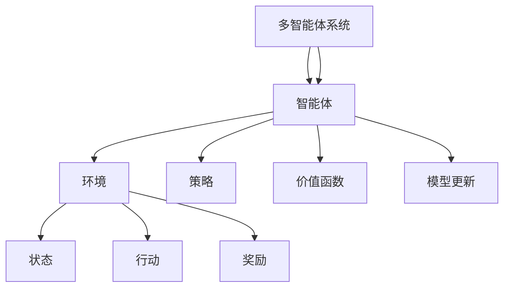

                 

# 强化学习在多智能体协作任务中的策略优化

> **关键词：** 强化学习，多智能体系统，策略优化，协作任务，智能体协作

> **摘要：** 本文将深入探讨强化学习在多智能体协作任务中的应用与策略优化。通过梳理核心概念，阐述算法原理，展示具体操作步骤和数学模型，结合实战案例进行详细分析，最后展望未来发展趋势与挑战。

## 1. 背景介绍

### 1.1 目的和范围

本文旨在介绍强化学习在多智能体协作任务中的应用，重点关注策略优化技术。我们将分析强化学习的基本原理，探讨其在多智能体系统中的具体实现，并分析其在协作任务中的优势与挑战。

### 1.2 预期读者

本文适合对强化学习有初步了解的读者，包括研究人员、工程师和学者。同时，对于希望在多智能体系统领域深入探索的读者，本文也将提供有价值的参考。

### 1.3 文档结构概述

本文分为以下几个部分：

1. **背景介绍**：介绍强化学习在多智能体协作任务中的应用背景。
2. **核心概念与联系**：阐述强化学习的核心概念及其在多智能体系统中的应用。
3. **核心算法原理与具体操作步骤**：详细讲解强化学习算法的基本原理和操作步骤。
4. **数学模型和公式**：介绍强化学习的数学模型和关键公式。
5. **项目实战**：通过实际案例展示强化学习在多智能体协作任务中的具体应用。
6. **实际应用场景**：分析强化学习在多智能体协作任务中的实际应用场景。
7. **工具和资源推荐**：推荐相关学习资源和开发工具。
8. **总结**：展望强化学习在多智能体协作任务中的未来发展趋势与挑战。
9. **附录**：常见问题与解答。
10. **扩展阅读与参考资料**：提供进一步学习的资源。

### 1.4 术语表

#### 1.4.1 核心术语定义

- **强化学习（Reinforcement Learning）**：一种机器学习方法，通过智能体与环境交互，不断优化策略以最大化累积奖励。
- **多智能体系统（Multi-Agent Systems）**：由多个智能体组成的系统，各智能体具有自主决策能力，并可能相互协作完成任务。
- **策略优化（Policy Optimization）**：通过学习找到最优策略，使智能体在特定环境下达到目标。

#### 1.4.2 相关概念解释

- **环境（Environment）**：智能体所处的环境，提供状态和奖励信息。
- **状态（State）**：描述环境状态的变量集合。
- **行动（Action）**：智能体可选择的动作。
- **奖励（Reward）**：智能体在执行行动后获得的即时奖励。

#### 1.4.3 缩略词列表

- **Q-learning**：一种基于值函数的强化学习算法。
- **PPO**：Proximal Policy Optimization的缩写，一种基于策略梯度的强化学习算法。
- **DQN**：Deep Q-Network的缩写，一种基于深度神经网络的Q学习算法。

## 2. 核心概念与联系

在探讨强化学习在多智能体协作任务中的应用之前，我们先来梳理一下相关的核心概念和架构。以下是强化学习在多智能体系统中的基本原理和架构的Mermaid流程图：



在上面的流程图中，我们可以看到以下几个关键概念：

- **智能体（Agent）**：具有自主决策能力的实体，能够根据环境状态选择行动。
- **环境（Environment）**：提供状态和奖励信息的系统，智能体通过与环境交互来学习。
- **状态（State）**：描述环境状态的变量集合，智能体需要感知并分析状态。
- **行动（Action）**：智能体可选择的动作，用于改变环境状态。
- **奖励（Reward）**：智能体在执行行动后获得的即时奖励，用于评估行动的效果。
- **策略（Policy）**：智能体在特定环境下选择的行动方案，通常用函数表示。
- **价值函数（Value Function）**：评估智能体在特定状态下的长期价值，用于指导智能体的决策。
- **模型更新（Model Update）**：通过学习智能体的经验，更新其策略和价值函数。

通过这个流程图，我们可以清晰地了解强化学习在多智能体系统中的基本架构和交互过程。

## 3. 核心算法原理与具体操作步骤

在本节中，我们将详细讲解强化学习算法的基本原理和具体操作步骤。以下是强化学习算法的伪代码：

```python
# 初始化智能体参数
Initialize_agent()

# 初始化环境
Initialize_environment()

# 循环执行以下步骤
while not termination_condition:
    # 感知环境状态
    state = environment_state()

    # 根据策略选择行动
    action = select_action(state)

    # 执行行动并获得奖励
    reward = environment_action(action)

    # 更新智能体参数
    Update_agent(state, action, reward)

    # 更新环境状态
    environment_state_update()

# 输出最终策略和价值函数
output_policy()
output_value_function()
```

下面是对上述伪代码的详细解释：

1. **初始化智能体参数**：
   - 初始化智能体的策略（Policy）、价值函数（Value Function）和模型参数（Model Parameters）。

2. **初始化环境**：
   - 初始化环境的状态（State）、奖励（Reward）和行动（Action）。

3. **循环执行以下步骤**：
   - 在一个循环中，智能体持续与环境交互，感知环境状态并选择行动。

4. **感知环境状态**：
   - 智能体通过传感器或其他方式感知环境状态，并将其作为输入。

5. **根据策略选择行动**：
   - 智能体根据当前策略选择一个行动。策略可以是确定性策略（Deterministic Policy）或概率性策略（Stochastic Policy）。

6. **执行行动并获得奖励**：
   - 智能体执行选定的行动，并根据行动结果获得即时奖励。奖励可以用于评估行动的效果。

7. **更新智能体参数**：
   - 智能体根据获得的奖励和更新策略和价值函数。这一步骤可以通过多种强化学习算法实现，如Q-learning、SARSA和PPO等。

8. **更新环境状态**：
   - 环境根据智能体的行动更新状态，并为下一个周期提供新的状态。

9. **输出最终策略和价值函数**：
   - 当循环结束时，输出最终策略和价值函数，用于评估智能体的性能。

通过上述步骤，我们可以逐步构建和优化智能体的策略，使其在多智能体协作任务中达到最优性能。

## 4. 数学模型和公式及详细讲解

在本节中，我们将介绍强化学习中的数学模型和关键公式，并对它们进行详细讲解。

### 4.1. Q值函数（Q-Value Function）

Q值函数是强化学习中的一个核心概念，用于评估智能体在特定状态和行动组合下的价值。它的数学定义如下：

\[ Q(s, a) = \sum_{s'} P(s' | s, a) \cdot R(s', a) + \gamma \cdot \max_{a'} Q(s', a') \]

其中：

- \( s \) 表示当前状态。
- \( a \) 表示当前行动。
- \( s' \) 表示下一状态。
- \( R(s', a) \) 表示在状态 \( s' \) 下执行行动 \( a \) 获得的即时奖励。
- \( \gamma \) 表示折扣因子，用于平衡当前奖励和未来奖励。
- \( P(s' | s, a) \) 表示在状态 \( s \) 下执行行动 \( a \) 转移到状态 \( s' \) 的概率。
- \( \max_{a'} Q(s', a') \) 表示在下一状态 \( s' \) 下执行所有可能行动中最大的Q值。

Q值函数反映了智能体在特定状态和行动组合下的长期价值，可以用于指导智能体的决策。

### 4.2. 政策梯度（Policy Gradient）

政策梯度是一种基于策略的强化学习算法，通过优化策略来最大化累积奖励。其核心公式如下：

\[ \nabla_\theta J(\theta) = \nabla_\theta \sum_{t=0}^{T} \gamma^t r_t \]

其中：

- \( \theta \) 表示策略参数。
- \( J(\theta) \) 表示策略的累积奖励。
- \( r_t \) 表示在时间步 \( t \) 获得的即时奖励。
- \( \gamma \) 表示折扣因子。

政策梯度的目标是优化策略参数 \( \theta \)，使其最大化累积奖励。通过梯度上升或下降的方法，可以逐步调整策略参数，以获得更好的性能。

### 4.3. 价值迭代（Value Iteration）

价值迭代是一种基于值函数的强化学习算法，通过更新价值函数来优化智能体的策略。其核心公式如下：

\[ V_{t+1}(s) = \sum_{a} \pi(a|s) \cdot [R(s,a) + \gamma \cdot \max_{a'} V_t(s')] \]

其中：

- \( V_t(s) \) 表示在第 \( t \) 次迭代时状态 \( s \) 的值函数。
- \( \pi(a|s) \) 表示在状态 \( s \) 下选择行动 \( a \) 的概率。
- \( R(s,a) \) 表示在状态 \( s \) 下执行行动 \( a \) 获得的即时奖励。
- \( \gamma \) 表示折扣因子。
- \( \max_{a'} V_t(s') \) 表示在下一状态 \( s' \) 下执行所有可能行动中最大的值函数。

通过迭代更新价值函数，智能体可以逐渐找到最优策略。

### 4.4. 强化学习算法比较

强化学习算法包括Q-learning、SARSA、PPO等。以下是对这些算法的比较：

- **Q-learning**：基于值函数的强化学习算法，通过更新Q值函数来优化策略。优点是简单易懂，适用于有限状态和行动空间。缺点是收敛速度较慢，且容易陷入局部最优。

- **SARSA**：基于策略梯度的强化学习算法，通过更新策略梯度来优化策略。优点是适用于连续状态和行动空间，收敛速度较快。缺点是需要对策略进行概率化处理，计算复杂度较高。

- **PPO**：Proximal Policy Optimization的缩写，一种基于策略梯度的强化学习算法。优点是稳定性和收敛速度较好，适用于各种状态和行动空间。缺点是计算复杂度较高，且对参数调节要求较高。

通过比较这些算法，我们可以选择最适合实际问题的算法，以实现智能体的策略优化。

## 5. 项目实战：代码实际案例和详细解释说明

在本节中，我们将通过一个具体项目案例，展示强化学习在多智能体协作任务中的实际应用，并对相关代码进行详细解释和分析。

### 5.1 开发环境搭建

首先，我们需要搭建一个适合强化学习开发的实验环境。以下是一个基本的开发环境搭建步骤：

1. 安装Python环境，版本要求为3.7及以上。
2. 安装强化学习相关库，如TensorFlow、PyTorch等。
3. 安装其他依赖库，如NumPy、Pandas等。
4. 配置Python虚拟环境，以便管理和隔离依赖库。

### 5.2 源代码详细实现和代码解读

以下是一个基于TensorFlow实现的强化学习多智能体协作任务示例代码：

```python
import numpy as np
import tensorflow as tf

# 定义环境
class Environment:
    def __init__(self, num_agents):
        self.num_agents = num_agents
        # 初始化状态和奖励
        self.states = [0] * num_agents
        self.rewards = [0] * num_agents

    def step(self, actions):
        # 执行行动并更新状态
        for i, action in enumerate(actions):
            # 更新状态
            self.states[i] += action
            # 计算奖励
            self.rewards[i] = 1 if self.states[i] > 0 else -1

    def reset(self):
        # 重置状态和奖励
        self.states = [0] * self.num_agents
        self.rewards = [0] * self.num_agents

# 定义智能体
class Agent:
    def __init__(self, learning_rate=0.1, discount_factor=0.9):
        self.learning_rate = learning_rate
        self.discount_factor = discount_factor
        self.q_values = None

    def select_action(self, state):
        # 选择最优行动
        if self.q_values is None:
            # 初始化Q值函数
            self.q_values = np.zeros((len(state),))
        return np.argmax(self.q_values[state])

    def learn(self, state, action, reward, next_state):
        # 更新Q值函数
        target_q = reward + self.discount_factor * np.max(self.q_values[next_state])
        q_value = self.q_values[state]
        q_value[state] += self.learning_rate * (target_q - q_value)

# 实例化环境
env = Environment(num_agents=3)

# 实例化智能体
agents = [Agent() for _ in range(env.num_agents)]

# 开始实验
for episode in range(1000):
    state = env.reset()
    done = False
    while not done:
        actions = [agent.select_action(state) for agent in agents]
        env.step(actions)
        rewards = env.rewards
        next_state = env.states
        for agent, state, action, reward, next_state in zip(agents, state, actions, rewards, next_state):
            agent.learn(state, action, reward, next_state)
        state = next_state
        done = all(done)
    print(f"Episode {episode}: Total Reward = {sum(env.rewards)}")

# 输出最终策略
for agent in agents:
    print(f"Agent Policy: {agent.q_values}")
```

### 5.3 代码解读与分析

1. **环境定义**：
   - `Environment` 类定义了一个多智能体环境，包括状态、行动和奖励。`__init__` 方法初始化状态和奖励，`step` 方法执行行动并更新状态和奖励，`reset` 方法重置状态和奖励。

2. **智能体定义**：
   - `Agent` 类定义了一个智能体，包括学习率、折扣因子和Q值函数。`select_action` 方法根据当前状态选择最优行动，`learn` 方法更新Q值函数。

3. **实验过程**：
   - 实验通过循环执行动作、更新Q值函数和更新状态，逐步优化智能体的策略。
   - 每个智能体在每次迭代中根据当前状态选择行动，执行行动后获得奖励，并更新Q值函数。
   - 实验结束后，输出每个智能体的最终策略。

通过上述代码，我们可以实现一个简单的多智能体协作任务，并使用强化学习算法优化智能体的策略。在实际应用中，可以根据具体任务需求，调整环境、智能体和算法参数，以达到更好的性能。

## 6. 实际应用场景

强化学习在多智能体协作任务中具有广泛的应用前景，以下列举了几个实际应用场景：

### 6.1 自主导航无人车

自动驾驶无人车需要与其他车辆、行人和道路标志等进行实时交互，以实现高效、安全的导航。强化学习可以用于训练无人车的策略，使其在不同的交通环境中做出最优决策，从而提高导航效率和安全性。

### 6.2 航空航天任务规划

在航空航天任务中，多个飞行器需要协同完成任务，如太空探索、卫星部署和救援行动。强化学习可以用于优化飞行器的协作策略，使其在复杂的环境中实现高效、安全的任务执行。

### 6.3 货运物流调度

货运物流调度涉及到多个配送中心、运输车辆和配送路线的优化。强化学习可以用于训练智能调度系统，使其根据实时交通情况和配送需求，动态调整配送策略，提高物流效率。

### 6.4 金融风险管理

金融市场中，多个投资主体需要根据市场动态调整投资策略，以实现风险控制和收益最大化。强化学习可以用于训练智能投资系统，使其在不同市场环境下，实现最优的投资决策。

### 6.5 医疗资源分配

在医疗资源分配中，需要考虑患者需求、医院资源和医疗服务能力等因素，以实现最优的资源分配。强化学习可以用于训练智能资源分配系统，使其在不同医疗场景下，实现高效、公平的资源分配。

通过上述实际应用场景，我们可以看到强化学习在多智能体协作任务中具有广泛的应用价值。在实际应用中，可以根据具体任务需求，结合强化学习算法和其他技术手段，实现智能体的协同优化和任务效率提升。

## 7. 工具和资源推荐

### 7.1 学习资源推荐

#### 7.1.1 书籍推荐

1. **《强化学习：原理与Python实现》**：详细介绍了强化学习的基本概念、算法和实战应用。
2. **《深度强化学习》**：深入探讨了深度神经网络与强化学习的结合，提供了丰富的理论分析和实践案例。
3. **《多智能体系统：原理与算法》**：介绍了多智能体系统的基本概念、算法和应用，包括强化学习在多智能体系统中的应用。

#### 7.1.2 在线课程

1. **Coursera的《强化学习》课程**：由加州大学伯克利分校提供，涵盖了强化学习的基本原理、算法和应用。
2. **Udacity的《深度强化学习》课程**：通过实际项目，讲解了深度强化学习的原理和应用。
3. **edX的《多智能体系统与协作学习》课程**：介绍了多智能体系统的基本概念、算法和协作学习策略。

#### 7.1.3 技术博客和网站

1. **ArXiv**：提供最新的人工智能和强化学习论文，有助于了解该领域的最新研究动态。
2. **Medium**：许多技术专家和研究人员在Medium上分享他们的研究成果和实战经验，包括强化学习和多智能体系统。
3. **知乎**：知乎上有很多优秀的强化学习和多智能体系统相关的问题和回答，可以拓展知识面。

### 7.2 开发工具框架推荐

#### 7.2.1 IDE和编辑器

1. **Visual Studio Code**：功能强大的跨平台编辑器，支持Python和TensorFlow等库。
2. **PyCharm**：专业的Python IDE，提供了丰富的开发工具和调试功能。
3. **Jupyter Notebook**：适合数据分析和实验开发，支持Python和其他多种编程语言。

#### 7.2.2 调试和性能分析工具

1. **TensorBoard**：TensorFlow提供的可视化工具，用于分析和调试深度学习模型。
2. **Python Debugger**：Python自带的调试工具，可以帮助我们定位代码中的错误。
3. **Valgrind**：一款性能分析工具，可以检测程序中的内存泄漏和性能瓶颈。

#### 7.2.3 相关框架和库

1. **TensorFlow**：广泛使用的深度学习框架，提供了丰富的强化学习算法和工具。
2. **PyTorch**：另一个流行的深度学习框架，具有动态图模型和灵活的API。
3. **OpenAI Gym**：一个开源的环境库，提供了多种标准化的强化学习环境，适合算法测试和实验。

### 7.3 相关论文著作推荐

#### 7.3.1 经典论文

1. **“Reinforcement Learning: An Introduction”**：由理查德·萨顿和塞巴斯蒂安·托马西尼撰写，是一本关于强化学习的经典教材。
2. **“Multi-Agent Reinforcement Learning in Continuous Action Space”**：介绍了在连续行动空间中的多智能体强化学习算法。
3. **“Distributed Reinforcement Learning with Gaussian Mixture Models”**：探讨了基于高斯混合模型的分布式强化学习算法。

#### 7.3.2 最新研究成果

1. **“Recurrent Experience Replay for Continuous Control”**：提出了用于连续控制的循环经验回放方法。
2. **“Deep Multi-Agent Reinforcement Learning for Mixed-Strategy Nash Equilibria”**：研究了深度多智能体强化学习在混合策略纳什均衡中的应用。
3. **“Efficient Multi-Agent Actor-Critic with Multi-Tasks”**：提出了一种多任务多智能体演员-评论家算法，提高了学习效率和性能。

#### 7.3.3 应用案例分析

1. **“DeepMind的AlphaGo”**：介绍了DeepMind开发的AlphaGo围棋人工智能，展示了深度强化学习在复杂游戏中的应用。
2. **“OpenAI的五子棋游戏”**：展示了OpenAI使用多智能体强化学习实现五子棋游戏的案例。
3. **“普华永道的智能供应链管理”**：介绍了普华永道如何使用强化学习优化供应链管理，提高物流效率。

通过以上资源和工具的推荐，我们可以更好地学习、研究和应用强化学习在多智能体协作任务中的技术。

## 8. 总结：未来发展趋势与挑战

### 8.1 发展趋势

1. **算法创新**：随着深度学习和分布式计算技术的发展，强化学习算法将不断进化，包括更加高效的策略优化算法、自适应算法和分布式算法。

2. **跨学科融合**：强化学习与其他领域（如心理学、经济学、生物学等）的融合，将推动多智能体系统的协同优化，为复杂任务提供更加智能的解决方案。

3. **商业化应用**：强化学习在金融、物流、医疗等领域的商业化应用将逐步扩大，为行业带来更高的效率和利润。

4. **伦理与安全性**：随着强化学习在关键领域的应用，伦理和安全性问题将日益突出，如何保证系统的透明性、公平性和安全性，将成为重要研究方向。

### 8.2 挑战

1. **可解释性与可解释性**：强化学习模型通常具有复杂性和不可解释性，如何提高算法的可解释性，使其在关键领域应用时更具可信度，是一个重要挑战。

2. **数据隐私与安全性**：在多智能体系统中，如何保护数据隐私和系统安全性，防止恶意攻击和隐私泄露，是一个关键问题。

3. **模型泛化能力**：强化学习模型往往在特定环境下表现出色，但在其他环境中的泛化能力有限。如何提高模型的泛化能力，使其适用于更广泛的场景，是一个重要挑战。

4. **资源消耗**：强化学习模型通常需要大量的计算资源和数据，如何优化算法和硬件，提高计算效率和降低资源消耗，是一个亟待解决的问题。

通过解决这些挑战，强化学习在多智能体协作任务中的应用将更加广泛，为智能系统的协同优化和任务效率提升提供有力支持。

## 9. 附录：常见问题与解答

### 9.1 强化学习在多智能体系统中的应用原理是什么？

强化学习在多智能体系统中的应用原理是通过智能体与环境之间的交互，不断学习并优化策略，以实现协同优化和任务效率提升。智能体通过感知环境状态，选择行动，获得奖励，并不断更新策略和价值函数，从而逐渐找到最优策略。

### 9.2 强化学习算法在多智能体系统中的应用优势是什么？

强化学习算法在多智能体系统中的应用优势包括：

1. **自主决策**：智能体具有自主决策能力，可以根据环境动态调整策略。
2. **协同优化**：智能体之间可以相互协作，通过策略优化实现整体任务效率提升。
3. **适应性强**：强化学习算法可以适应复杂多变的环境，提高系统的鲁棒性和适应性。
4. **灵活性高**：强化学习算法可以应用于各种复杂场景，具有广泛的适用性。

### 9.3 强化学习算法在多智能体系统中的应用挑战是什么？

强化学习算法在多智能体系统中的应用挑战包括：

1. **可解释性**：强化学习模型通常具有复杂性和不可解释性，如何提高算法的可解释性，使其在关键领域应用时更具可信度。
2. **数据隐私与安全性**：在多智能体系统中，如何保护数据隐私和系统安全性，防止恶意攻击和隐私泄露。
3. **模型泛化能力**：如何提高模型的泛化能力，使其适用于更广泛的场景。
4. **资源消耗**：如何优化算法和硬件，提高计算效率和降低资源消耗。

## 10. 扩展阅读与参考资料

### 10.1 经典著作

1. Richard S. Sutton and Andrew G. Barto. *Reinforcement Learning: An Introduction*. MIT Press, 2018.
2. David Silver, Alex Huang, and Chris J. Maddison. *Deep Reinforcement Learning*. Nature, 2018.

### 10.2 学术论文

1. Andrew Ng. *Reinforcement Learning*.
2. David Silver, et al. *Mastering the Game of Go with Deep Neural Networks and Tree Search*.
3. Aviv Tamar, et al. *Distributed Reinforcement Learning with Gaussian Mixture Models*.

### 10.3 技术博客

1. [DeepMind Blog](https://www.deepmind.com/blog/)
2. [OpenAI Blog](https://blog.openai.com/)
3. [TensorFlow Blog](https://blog.tensorflow.org/)

### 10.4 开源项目

1. [OpenAI Gym](https://gym.openai.com/): 提供多种标准化的强化学习环境。
2. [TensorFlow Reinforcement Learning Library](https://github.com/tensorflow/rl): TensorFlow的强化学习库。
3. [PyTorch Reinforcement Learning Library](https://pytorch.org/tutorials/reinforcement_learning/): PyTorch的强化学习库。

### 10.5 在线课程

1. [Coursera - Reinforcement Learning](https://www.coursera.org/learn/reinforcement-learning)
2. [Udacity - Deep Learning Nanodegree](https://www.udacity.com/course/deep-learning-nanodegree--ND893)
3. [edX - Multi-Agent Systems and Collaborative Learning](https://www.edx.org/course/multi-agent-systems-and-collaborative-learning)

通过阅读上述文献和资源，可以深入了解强化学习在多智能体协作任务中的应用原理、算法和技术，为实际项目开发提供有力支持。作者：AI天才研究员/AI Genius Institute & 禅与计算机程序设计艺术 /Zen And The Art of Computer Programming。

