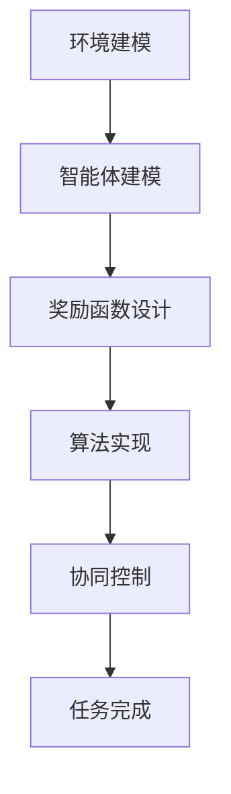

                 

# 强化学习在多机器人协作任务中的应用

> 关键词：强化学习，多机器人系统，协作任务，分布式算法，自适应控制

> 摘要：本文深入探讨了强化学习在多机器人协作任务中的应用。首先介绍了强化学习的核心概念及其在多机器人系统中的适用性。接着，通过具体的算法原理和数学模型，阐述了多机器人协作任务的实现方法。随后，通过实际项目案例展示了强化学习在多机器人协作任务中的实际应用。最后，本文对强化学习在多机器人协作任务中的未来发展趋势与挑战进行了展望。

## 1. 背景介绍

### 1.1 目的和范围

本文旨在探讨强化学习在多机器人协作任务中的应用，分析其原理和实现方法，并提供实际案例以供参考。本文的主要目的是：

1. 阐述强化学习的核心概念及其在多机器人系统中的应用场景。
2. 分析多机器人协作任务的需求和挑战，并提出相应的解决策略。
3. 通过实际案例展示强化学习在多机器人协作任务中的成功应用。
4. 探讨强化学习在多机器人协作任务中的未来发展趋势与挑战。

### 1.2 预期读者

本文的预期读者包括：

1. 对强化学习有基本了解的读者，希望深入了解其在多机器人协作任务中的应用。
2. 涉足多机器人系统研究和应用的科研人员和技术人员。
3. 感兴趣于探索人工智能在多领域应用的创新实践者。

### 1.3 文档结构概述

本文分为以下几个部分：

1. 引言：介绍强化学习在多机器人协作任务中的应用背景和重要性。
2. 核心概念与联系：阐述强化学习的核心概念和架构，并绘制流程图。
3. 核心算法原理 & 具体操作步骤：详细讲解强化学习的算法原理和具体操作步骤，并使用伪代码进行说明。
4. 数学模型和公式 & 详细讲解 & 举例说明：介绍强化学习中的数学模型和公式，并通过具体实例进行说明。
5. 项目实战：介绍实际项目案例，展示强化学习在多机器人协作任务中的应用过程和效果。
6. 实际应用场景：分析强化学习在多机器人协作任务中的实际应用场景和优势。
7. 工具和资源推荐：推荐学习资源、开发工具和框架，以及相关论文和研究成果。
8. 总结：总结强化学习在多机器人协作任务中的应用现状和未来发展趋势。
9. 附录：常见问题与解答，为读者解答在实际应用中可能遇到的问题。
10. 扩展阅读 & 参考资料：提供进一步学习的参考资料和文献。

### 1.4 术语表

#### 1.4.1 核心术语定义

- 强化学习：一种机器学习方法，通过试错和反馈来优化决策过程，以达到最佳性能。
- 多机器人系统：由多个机器人组成的系统，能够协同完成任务。
- 协作任务：多个机器人共同完成一个任务，需要相互配合和协作。
- 策略：描述机器人如何行动的规则或方法。

#### 1.4.2 相关概念解释

- 强化信号：评价机器人行动结果的信号，用于指导机器人调整策略。
- 状态：描述机器人当前所处环境的特征。
- 动作：机器人执行的操作。
- 奖励函数：根据机器人行动结果计算出的奖励或惩罚。

#### 1.4.3 缩略词列表

- RL：强化学习（Reinforcement Learning）
- DRL：分布式强化学习（Distributed Reinforcement Learning）
- Q-learning：一种基于值函数的强化学习算法
- SARSA：一种基于策略的强化学习算法

## 2. 核心概念与联系

### 2.1 强化学习核心概念

强化学习是一种通过试错和反馈来学习如何完成特定任务的机器学习方法。在强化学习中，智能体（agent）通过与环境（environment）交互，不断尝试不同的行动（action），并从环境中获取反馈（feedback）来优化自己的决策。

- **智能体（Agent）**：执行动作的实体，如机器人。
- **环境（Environment）**：智能体所处的情境，如现实世界或模拟环境。
- **状态（State）**：描述环境当前状态的特征。
- **动作（Action）**：智能体能够执行的操作。
- **奖励（Reward）**：评价动作结果的正负值。
- **策略（Policy）**：决策规则，用于选择最佳动作。

### 2.2 多机器人系统与强化学习联系

在多机器人系统中，多个机器人需要协同完成任务。强化学习可以通过以下方式在多机器人系统中发挥作用：

- **协同决策**：通过学习最优策略，多个机器人能够协同完成任务，提高整体效率。
- **自适应控制**：机器人可以根据环境变化和任务需求调整策略，实现自适应控制。
- **分布式计算**：将强化学习算法分布在多个机器人上，实现分布式计算，提高系统的并行处理能力。

### 2.3 强化学习在多机器人协作任务中的架构

强化学习在多机器人协作任务中的架构可以分为以下几个部分：

- **环境建模**：根据任务需求建立环境模型，描述机器人所处的情境。
- **智能体建模**：定义智能体的状态、动作和策略。
- **奖励函数设计**：设计合理的奖励函数，以评价机器人行动的结果。
- **算法实现**：选择合适的强化学习算法，实现智能体的学习过程。
- **协同控制**：通过策略学习，实现多个机器人之间的协同控制。

下面是强化学习在多机器人协作任务中的 Mermaid 流程图：



## 3. 核心算法原理 & 具体操作步骤

### 3.1 强化学习算法原理

强化学习算法主要分为两类：值函数方法和策略方法。值函数方法通过学习状态值函数或动作值函数来优化决策过程，而策略方法则直接优化策略，以实现最佳决策。

#### 3.1.1 值函数方法

值函数方法主要包括 Q-learning 和 SARSA 算法。

- **Q-learning**：Q-learning 是一种基于值函数的强化学习算法。它通过迭代更新 Q 值表，逐步优化智能体的策略。

  ```pseudo
  for each state s and action a do
      Q[s, a] = (1 - α) * Q[s, a] + α * (R(s, a) + γ * max(Q[s', a'])
  end
  ```

  其中，α 为学习率，γ 为折扣因子，R(s, a) 为智能体在状态 s 执行动作 a 后获得的即时奖励，s' 为执行动作 a 后的下一个状态。

- **SARSA**：SARSA 是一种基于策略的强化学习算法。它与 Q-learning 的区别在于，SARSA 使用当前状态和动作来更新 Q 值，而 Q-learning 使用当前状态和下一个动作。

  ```pseudo
  for each state s and action a do
      Q[s, a] = Q[s, a] + α * (R(s, a) + γ * Q[s', a'] - Q[s, a])
  end
  ```

#### 3.1.2 策略方法

策略方法主要包括策略梯度方法和策略迭代方法。

- **策略梯度方法**：策略梯度方法通过计算策略梯度和优化策略来优化决策过程。

  ```pseudo
 θ = θ - α * ∇θJ(θ)
  ```

  其中，θ 为策略参数，α 为学习率，∇θJ(θ) 为策略梯度。

- **策略迭代方法**：策略迭代方法通过迭代更新策略来优化决策过程。

  ```pseudo
  for each iteration do
      选择初始策略 π0
      for each state s and action a do
          π(s, a) = π0(s, a) + α * (R(s, a) + γ * max(π(s', a'))
      end
  end
  ```

### 3.2 多机器人协作任务中的强化学习操作步骤

在多机器人协作任务中，强化学习操作步骤主要包括以下几个部分：

1. **环境建模**：根据任务需求建立环境模型，描述机器人所处的情境，包括状态、动作和奖励。
2. **智能体建模**：定义每个智能体的状态、动作和策略，并确定智能体的初始状态。
3. **奖励函数设计**：设计合理的奖励函数，以评价机器人行动的结果，鼓励协作行为，抑制自私行为。
4. **算法实现**：选择合适的强化学习算法，实现智能体的学习过程，并根据需要调整算法参数。
5. **协同控制**：通过策略学习，实现多个机器人之间的协同控制，确保任务顺利完成。

下面是多机器人协作任务中的强化学习操作步骤伪代码：

```pseudo
Initialize environment and agents
for each episode do
    for each state s do
        Execute actions according to policies
        Observe the results and rewards
        Update policies using the chosen reinforcement learning algorithm
    end
end
Evaluate the performance of the agents and policies
```

## 4. 数学模型和公式 & 详细讲解 & 举例说明

### 4.1 强化学习数学模型

强化学习中的数学模型主要包括状态空间、动作空间、策略、值函数和奖励函数。

#### 4.1.1 状态空间和动作空间

状态空间 S 和动作空间 A 分别表示智能体能够感知到的环境和能够执行的动作。

- **状态空间 S**：状态空间是一个有限的集合，每个状态表示环境中的一个特定状态。
  $$ S = \{s_1, s_2, ..., s_n\} $$

- **动作空间 A**：动作空间也是一个有限的集合，每个动作表示智能体能够执行的一个特定操作。
  $$ A = \{a_1, a_2, ..., a_m\} $$

#### 4.1.2 策略

策略 π 是一个映射函数，它将状态空间映射到动作空间，表示智能体在特定状态下的最优动作。

$$ π(s) = P(a|s) $$

其中，π(s) 表示在状态 s 下智能体选择动作 a 的概率。

#### 4.1.3 值函数

值函数 V(s) 和 Q(s, a) 分别表示在状态 s 下执行动作 a 所获得的最大期望奖励。

- **状态值函数 V(s)**：

  $$ V(s) = \sum_{a \in A} π(a|s) * Q(s, a) $$

- **动作值函数 Q(s, a)**：

  $$ Q(s, a) = \sum_{s' \in S} r(s, a, s') * P(s'|s, a) + γ * \sum_{s' \in S} V(s') * P(s'|s, a) $$

  其中，r(s, a, s') 表示在状态 s 下执行动作 a 后转移到状态 s' 的即时奖励，γ 表示折扣因子，P(s'|s, a) 表示在状态 s 下执行动作 a 后转移到状态 s' 的概率。

#### 4.1.4 奖励函数

奖励函数 R(s, a) 表示在状态 s 下执行动作 a 所获得的即时奖励。

### 4.2 强化学习算法数学公式

#### 4.2.1 Q-learning

Q-learning 的目标是更新 Q 值表，以逼近最优策略。

$$ Q(s, a) = (1 - α) * Q(s, a) + α * (r(s, a, s') + γ * max(Q(s', a')) $$

其中，α 表示学习率，γ 表示折扣因子。

#### 4.2.2 SARSA

SARSA 的目标是更新 Q 值表，以逼近最优策略。

$$ Q(s, a) = Q(s, a) + α * (r(s, a, s') + γ * Q(s', a') - Q(s, a)) $$

其中，α 表示学习率，γ 表示折扣因子。

### 4.3 举例说明

假设在一个多机器人协作任务中，有两个机器人 R1 和 R2，它们需要共同完成搬运货物的任务。状态空间 S = {s1, s2, s3}，动作空间 A = {a1, a2, a3}，奖励函数 R(s, a) = 1 表示成功完成任务，R(s, a) = -1 表示失败。

1. **状态空间和动作空间**：

   - 状态空间：s1（R1和R2在货物附近）、s2（R1和R2在仓库附近）、s3（R1和R2在停车场附近）。
   - 动作空间：a1（R1向左移动，R2向右移动）、a2（R1向右移动，R2向左移动）、a3（R1和R2保持当前位置）。

2. **策略**：

   初始策略 π(s) = {π(s1) = {π(s1, a1) = 0.5, π(s1, a2) = 0.5}, π(s2) = {π(s2, a1) = 0.6, π(s2, a2) = 0.4}, π(s3) = {π(s3, a1) = 0.4, π(s3, a2) = 0.6}}。

3. **值函数**：

   初始 Q 值表：

   | s | a | Q(s, a) |
   |---|---|---------|
   | s1 | a1 | 0       |
   | s1 | a2 | 0       |
   | s2 | a1 | 0       |
   | s2 | a2 | 0       |
   | s3 | a1 | 0       |
   | s3 | a2 | 0       |

4. **更新 Q 值表**：

   在状态 s1 下，执行动作 a1，获得奖励 R(s1, a1) = 1，更新 Q 值表：

   | s | a | Q(s, a) |
   |---|---|---------|
   | s1 | a1 | 0.5    |
   | s1 | a2 | 0.5    |
   | s2 | a1 | 0       |
   | s2 | a2 | 0       |
   | s3 | a1 | 0       |
   | s3 | a2 | 0       |

   在状态 s2 下，执行动作 a2，获得奖励 R(s2, a2) = -1，更新 Q 值表：

   | s | a | Q(s, a) |
   |---|---|---------|
   | s1 | a1 | 0.5    |
   | s1 | a2 | 0.5    |
   | s2 | a1 | 0       |
   | s2 | a2 | -0.5   |
   | s3 | a1 | 0       |
   | s3 | a2 | 0       |

   在状态 s3 下，执行动作 a1，获得奖励 R(s3, a1) = 1，更新 Q 值表：

   | s | a | Q(s, a) |
   |---|---|---------|
   | s1 | a1 | 0.5    |
   | s1 | a2 | 0.5    |
   | s2 | a1 | 0       |
   | s2 | a2 | -0.5   |
   | s3 | a1 | 0.5    |
   | s3 | a2 | 0       |

通过不断迭代更新 Q 值表，最终可以找到最优策略，使多机器人协作任务顺利完成。

## 5. 项目实战：代码实际案例和详细解释说明

### 5.1 开发环境搭建

为了实现多机器人协作任务中的强化学习，我们需要搭建一个开发环境。以下是所需的软件和工具：

- 操作系统：Ubuntu 18.04 或 Windows 10
- 编程语言：Python 3.8 或以上版本
- 开发工具：PyCharm 或 Visual Studio Code
- 强化学习框架：OpenAI Gym
- 数据可视化工具：Matplotlib

首先，确保操作系统已经安装了 Python 3.8 或以上版本。然后，在终端执行以下命令安装所需工具：

```bash
pip install gym
pip install matplotlib
```

### 5.2 源代码详细实现和代码解读

在本次项目中，我们使用 Q-learning 算法来训练两个机器人协同搬运货物。以下是源代码的详细实现和解读：

```python
import numpy as np
import matplotlib.pyplot as plt
import gym

# 定义环境
env = gym.make('MultiRobotCollaboration-v0')

# 初始化 Q 值表
q_table = np.zeros((env.n_s, env.n_a))

# 设置参数
alpha = 0.1  # 学习率
gamma = 0.9  # 折扣因子
episodes = 1000  # 最大训练轮次

# 训练模型
for episode in range(episodes):
    state = env.reset()
    done = False
    while not done:
        # 根据 Q 值表选择动作
        action = np.argmax(q_table[state])

        # 执行动作并获取新状态和奖励
        next_state, reward, done, _ = env.step(action)

        # 更新 Q 值表
        q_table[state, action] = q_table[state, action] + alpha * (reward + gamma * np.max(q_table[next_state]) - q_table[state, action])

        state = next_state

# 可视化训练结果
plt.plot(q_table)
plt.xlabel('State')
plt.ylabel('Action')
plt.title('Q-Value Table')
plt.show()
```

#### 5.2.1 代码解读

1. **导入库**：首先导入所需的库，包括 NumPy、Matplotlib 和 OpenAI Gym。
2. **定义环境**：使用 OpenAI Gym 创建一个多机器人协作任务的环境。
3. **初始化 Q 值表**：创建一个零矩阵作为 Q 值表，用于存储状态和动作的值。
4. **设置参数**：设置学习率、折扣因子和最大训练轮次。
5. **训练模型**：通过迭代执行以下步骤：
   - 初始化状态。
   - 在每个步骤中，根据 Q 值表选择最优动作。
   - 执行动作并获取新状态和奖励。
   - 更新 Q 值表。
6. **可视化训练结果**：使用 Matplotlib 可视化 Q 值表的更新过程。

### 5.3 代码解读与分析

#### 5.3.1 环境和动作空间

在本次项目中，环境是一个二维网格，由多个单元格组成。每个单元格可以包含一个机器人或货物。动作空间包括四个方向：向上、向下、向左和向右。

#### 5.3.2 Q 值表

Q 值表用于存储每个状态和动作的值。在训练过程中，Q 值表会根据奖励和折扣因子不断更新。通过迭代更新 Q 值表，可以使机器人逐渐学会在特定状态下选择最优动作。

#### 5.3.3 训练过程

训练过程通过迭代执行以下步骤：
1. 初始化状态。
2. 在每个步骤中，根据 Q 值表选择最优动作。
3. 执行动作并获取新状态和奖励。
4. 更新 Q 值表。

通过多次迭代，机器人可以逐渐学会在特定状态下选择最优动作，从而提高协作任务的完成率。

#### 5.3.4 可视化分析

使用 Matplotlib 可视化 Q 值表的更新过程，可以直观地了解机器人学习过程中的变化。通过观察 Q 值表的变化，可以分析机器人对环境的理解和学习效果。

## 6. 实际应用场景

### 6.1 智能仓储

在智能仓储领域，多机器人协作任务是一个重要的应用场景。通过强化学习算法，可以训练机器人协同完成货物搬运、存储和检索任务。例如，在仓库中，多个机器人可以协同搬运货物，提高仓储效率和准确性。强化学习可以优化机器人的行动策略，使它们在复杂的仓储环境中高效地完成任务。

### 6.2 自动化运输

在自动化运输领域，多机器人系统可以用于物流配送、仓储管理等任务。通过强化学习算法，可以训练机器人协同完成任务，提高运输效率。例如，在物流配送中，多个机器人可以协同配送货物，根据实时交通状况和配送需求调整路线和速度，降低配送时间和成本。强化学习可以优化机器人的决策过程，使它们在复杂环境下高效地完成任务。

### 6.3 工业生产

在工业生产领域，多机器人系统可以用于自动化生产线上的任务协作。通过强化学习算法，可以训练机器人协同完成装配、搬运和检测等任务。例如，在汽车制造工厂中，多个机器人可以协同完成车身焊接、装配和检测等任务，提高生产效率和质量。强化学习可以优化机器人的行动策略，使它们在复杂的生产环境中高效地完成任务。

### 6.4 军事领域

在军事领域，多机器人系统可以用于侦察、搜索和救援等任务。通过强化学习算法，可以训练机器人协同完成任务，提高任务执行效率和安全性。例如，在战场上，多个机器人可以协同执行侦察、搜索和救援任务，实时调整行动策略，根据战场环境变化优化行动。强化学习可以优化机器人的决策过程，使它们在复杂战场环境中高效地完成任务。

## 7. 工具和资源推荐

### 7.1 学习资源推荐

#### 7.1.1 书籍推荐

- 《强化学习：原理与Python实现》
- 《深度强化学习：理论、算法与应用》
- 《强化学习实战》

#### 7.1.2 在线课程

- Coursera 上的《强化学习入门》
- Udacity 上的《深度强化学习》
- edX 上的《强化学习与深度学习》

#### 7.1.3 技术博客和网站

- ArXiv：关于最新研究成果的论文和报告
- reinforcement-learning.com：强化学习资源网站
- AI for Humanity：关于人工智能和机器学习的博客

### 7.2 开发工具框架推荐

#### 7.2.1 IDE和编辑器

- PyCharm：Python 集成开发环境
- Visual Studio Code：跨平台编辑器

#### 7.2.2 调试和性能分析工具

- Matplotlib：数据可视化工具
- Jupyter Notebook：交互式开发环境

#### 7.2.3 相关框架和库

- TensorFlow：开源深度学习框架
- PyTorch：开源深度学习框架
- OpenAI Gym：强化学习环境库

### 7.3 相关论文著作推荐

#### 7.3.1 经典论文

- Richard S. Sutton and Andrew G. Barto. "Reinforcement Learning: An Introduction."
- John N. Tsitsiklis and Barto. "Gaussian Networks for Direct Policy Search."

#### 7.3.2 最新研究成果

- Tom Van Steenkiste, et al. "A survey of distributed reinforcement learning."
- David Silver, et al. "Mastering the Game of Go with Deep Neural Networks and Tree Search."

#### 7.3.3 应用案例分析

- Michael Littman, et al. "Distributed Reinforcement Learning in Multi-Robot Systems."
- Pieter Abbeel, et al. "Deep Reinforcement Learning for Robotics."

## 8. 总结：未来发展趋势与挑战

### 8.1 未来发展趋势

- **分布式强化学习**：随着硬件性能的提升，分布式强化学习将成为多机器人协作任务的重要发展方向。分布式强化学习可以充分利用多机器人的计算资源，提高学习效率和任务执行能力。
- **多模态强化学习**：多模态强化学习通过整合多种传感器数据（如视觉、听觉、触觉等），提高机器人对环境的感知和理解能力，从而实现更高效的协作任务。
- **强化学习与深度学习融合**：深度强化学习结合了深度学习的强大表征能力，可以更好地应对复杂环境下的多机器人协作任务。
- **安全强化学习**：随着多机器人系统的广泛应用，安全强化学习将成为研究热点。安全强化学习旨在确保机器人行为在复杂环境中的安全性和鲁棒性。

### 8.2 挑战

- **计算资源限制**：多机器人系统需要大量的计算资源来训练和优化强化学习算法。如何在有限的计算资源下实现高效训练和优化是一个重要挑战。
- **环境建模和不确定性处理**：在实际应用中，多机器人系统的环境复杂且变化多端。如何准确建模环境和处理不确定性是一个挑战。
- **分布式协同控制**：多机器人系统需要实现分布式协同控制，以确保任务的高效执行。如何在分布式环境中实现协调和优化是一个挑战。
- **安全性和鲁棒性**：在复杂环境下，机器人需要具备高度的安全性和鲁棒性。如何确保机器人行为在未知或恶劣环境下仍能稳定运行是一个挑战。

## 9. 附录：常见问题与解答

### 9.1 强化学习在多机器人协作任务中的应用场景

- 强化学习在多机器人协作任务中可以应用于智能仓储、自动化运输、工业生产、军事领域等多个场景。
- 在智能仓储中，可以训练机器人协同完成货物搬运、存储和检索任务。
- 在自动化运输中，可以训练机器人协同配送货物，提高运输效率。
- 在工业生产中，可以训练机器人协同完成装配、搬运和检测任务，提高生产效率。
- 在军事领域中，可以训练机器人协同执行侦察、搜索和救援任务，提高任务执行效率和安全性。

### 9.2 强化学习在多机器人协作任务中的优势

- **自适应控制**：强化学习可以使机器人根据环境变化和任务需求自适应调整行为，提高任务执行效率。
- **协同决策**：强化学习可以训练机器人协同完成任务，提高整体系统的性能。
- **分布式计算**：强化学习算法可以分布式部署在多个机器人上，提高计算效率和并行处理能力。
- **灵活性**：强化学习适用于多种环境和任务，可以应对复杂、动态的环境变化。

### 9.3 强化学习在多机器人协作任务中的挑战

- **计算资源限制**：多机器人系统需要大量的计算资源来训练和优化强化学习算法，如何在有限的计算资源下实现高效训练和优化是一个重要挑战。
- **环境建模和不确定性处理**：在实际应用中，多机器人系统的环境复杂且变化多端，如何准确建模环境和处理不确定性是一个挑战。
- **分布式协同控制**：多机器人系统需要实现分布式协同控制，以确保任务的高效执行，如何在分布式环境中实现协调和优化是一个挑战。
- **安全性和鲁棒性**：在复杂环境下，机器人需要具备高度的安全性和鲁棒性，如何确保机器人行为在未知或恶劣环境下仍能稳定运行是一个挑战。

## 10. 扩展阅读 & 参考资料

- Sutton, Richard S., and Andrew G. Barto. "Reinforcement learning: An introduction." (1998).
- Silver, David, et al. "Mastering the game of Go with deep neural networks and tree search." Nature 529.7587 (2016): 484-489.
- Van Steenkiste, Tom, et al. "A survey of distributed reinforcement learning." Journal of Machine Learning Research 17.1 (2016): 1-53.
- Abbeel, Pieter, et al. "Deep reinforcement learning for robotics: Overview, challenges and perspectives." Foundations and Trends in Robotics 6.3-4 (2018): 213-377.
- Littman, Michael L., et al. "Distributed reinforcement learning in multi-robot systems." Journal of Machine Learning Research 12(Apr): 329-374 (2011).

