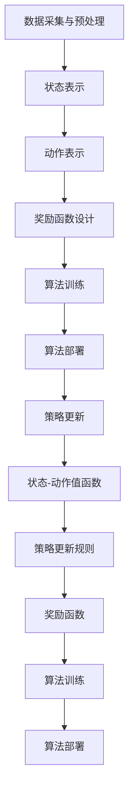

                 

# 强化学习在智能交通信号控制中的优化

> **关键词：** 强化学习、智能交通信号控制、交通优化、算法设计、数学模型

> **摘要：** 本文深入探讨了强化学习在智能交通信号控制中的应用和优化。通过介绍强化学习的核心概念和原理，本文分析了强化学习在解决交通信号控制问题中的优势，并详细讲解了强化学习算法在交通信号控制中的应用步骤和数学模型。最后，本文通过一个实际案例，展示了强化学习在交通信号控制中的具体实现过程和效果。

## 1. 背景介绍

### 1.1 目的和范围

本文旨在探讨如何将强化学习应用于智能交通信号控制中，以达到优化交通流和提高交通效率的目的。随着城市化进程的加速，交通拥堵问题日益严重，传统的交通信号控制方法已经难以满足现代交通的需求。因此，研究智能交通信号控制中的优化算法具有重要意义。

本文将重点关注以下内容：
- 强化学习的核心概念和原理
- 强化学习在交通信号控制中的应用优势
- 强化学习算法在交通信号控制中的应用步骤和数学模型
- 强化学习在交通信号控制中的实际案例

### 1.2 预期读者

本文面向具有计算机科学、交通工程和人工智能背景的读者，尤其是对强化学习和智能交通信号控制感兴趣的科研人员、工程师和学者。通过本文的阅读，读者将能够了解强化学习在智能交通信号控制中的应用方法和效果，并为实际项目开发提供参考。

### 1.3 文档结构概述

本文分为以下章节：
- 第1章：背景介绍，介绍本文的目的、范围、预期读者和文档结构。
- 第2章：核心概念与联系，介绍强化学习的核心概念、原理和与交通信号控制的联系。
- 第3章：核心算法原理 & 具体操作步骤，详细讲解强化学习算法在交通信号控制中的应用步骤和数学模型。
- 第4章：数学模型和公式 & 详细讲解 & 举例说明，对强化学习算法中的数学模型和公式进行详细解释，并给出示例。
- 第5章：项目实战：代码实际案例和详细解释说明，通过实际案例展示强化学习在交通信号控制中的具体实现过程。
- 第6章：实际应用场景，分析强化学习在智能交通信号控制中的应用场景。
- 第7章：工具和资源推荐，推荐相关学习资源、开发工具和框架。
- 第8章：总结：未来发展趋势与挑战，总结本文的主要观点，并对未来发展趋势和挑战进行探讨。
- 第9章：附录：常见问题与解答，解答读者可能遇到的问题。
- 第10章：扩展阅读 & 参考资料，提供相关扩展阅读和参考资料。

### 1.4 术语表

#### 1.4.1 核心术语定义

- **强化学习（Reinforcement Learning）**：一种机器学习方法，通过试错和反馈来学习如何在特定环境中做出最优决策。
- **智能交通信号控制（Intelligent Traffic Signal Control）**：利用先进的信息技术和控制理论，对交通信号进行智能化控制和优化，以提高交通效率和减少交通拥堵。
- **状态（State）**：描述交通信号控制系统的当前状态，如交通流量、车辆密度等。
- **动作（Action）**：交通信号灯的切换策略，如绿灯时间、红灯时间等。
- **奖励（Reward）**：根据交通信号控制效果给定的奖励值，用于评估交通信号控制的优劣。
- **策略（Policy）**：决策规则，用于指导交通信号灯的切换策略。

#### 1.4.2 相关概念解释

- **Q-Learning**：一种基于值函数的强化学习算法，通过学习状态-动作值函数来选择最优动作。
- **SARSA**：一种基于策略的强化学习算法，通过更新当前状态-动作值函数来选择最优动作。
- **深度强化学习（Deep Reinforcement Learning）**：利用深度神经网络来学习状态-动作值函数的强化学习方法，可以处理高维状态空间和动作空间。

#### 1.4.3 缩略词列表

- **RL**：强化学习（Reinforcement Learning）
- **Q-Learning**：Q值学习（Q-Learning）
- **SARSA**：同步优势估计（Sync Advantage Estimation）
- **DRL**：深度强化学习（Deep Reinforcement Learning）

## 2. 核心概念与联系

### 2.1 强化学习的核心概念

强化学习是一种通过试错和反馈来学习如何在特定环境中做出最优决策的机器学习方法。其核心概念包括状态（State）、动作（Action）、奖励（Reward）和策略（Policy）。

- **状态（State）**：描述系统的当前状态，如交通信号灯的颜色、交通流量等。
- **动作（Action）**：在给定状态下，系统可以执行的动作，如切换交通信号灯的颜色。
- **奖励（Reward）**：根据系统执行的动作和状态变化，给定的奖励值，用于评估动作的好坏。
- **策略（Policy）**：决策规则，用于指导系统在给定状态下执行的动作。

### 2.2 智能交通信号控制的联系

智能交通信号控制是一种利用先进的信息技术和控制理论，对交通信号进行智能化控制和优化的方法。其核心目标是提高交通效率和减少交通拥堵。强化学习与智能交通信号控制的联系如下：

- **状态（State）**：交通信号控制系统中的状态包括交通流量、车辆密度、道路长度等。这些状态可以用来描述交通信号控制系统的当前状态。
- **动作（Action）**：交通信号控制系统的动作包括绿灯时间、红灯时间等。这些动作可以用来指导交通信号灯的切换策略。
- **奖励（Reward）**：交通信号控制系统的奖励可以根据交通流量变化、车辆等待时间等指标来计算，用于评估交通信号控制的效果。
- **策略（Policy）**：交通信号控制系统的策略是根据状态和奖励来制定的，用于指导交通信号灯的切换策略。

### 2.3 强化学习在智能交通信号控制中的应用优势

强化学习在智能交通信号控制中的应用优势主要包括以下几点：

1. **自适应性强**：强化学习可以根据交通信号控制系统的实时状态，自适应地调整交通信号灯的切换策略，以提高交通效率和减少交通拥堵。
2. **优化交通流量**：强化学习可以学习到最优的交通信号灯切换策略，从而优化交通流量，减少车辆等待时间。
3. **减少碳排放**：通过优化交通信号灯切换策略，可以减少交通拥堵，降低车辆排放，有助于减少碳排放。
4. **智能交通管理**：强化学习可以与其他智能交通技术相结合，实现智能交通管理，提高交通安全性。

### 2.4 强化学习算法在交通信号控制中的应用步骤

强化学习算法在交通信号控制中的应用步骤主要包括以下几个阶段：

1. **数据采集与预处理**：采集交通信号控制系统的实时数据，如交通流量、车辆密度等，并对数据进行预处理，如数据清洗、归一化等。
2. **状态表示**：将交通信号控制系统的状态进行编码表示，如使用one-hot编码、稀疏编码等方法。
3. **动作表示**：将交通信号控制系统的动作进行编码表示，如使用one-hot编码、稀疏编码等方法。
4. **奖励函数设计**：根据交通信号控制系统的目标和指标，设计奖励函数，用于评估交通信号控制的效果。
5. **算法训练**：使用采集到的数据，训练强化学习算法，学习到最优的交通信号灯切换策略。
6. **算法部署**：将训练好的算法部署到实际交通信号控制系统中，根据实时状态和奖励，动态调整交通信号灯的切换策略。

### 2.5 强化学习算法在交通信号控制中的数学模型

强化学习算法在交通信号控制中的数学模型主要包括以下几个部分：

1. **状态-动作值函数**：表示在给定状态下，执行特定动作的预期奖励值。状态-动作值函数可以通过Q-Learning、SARSA等方法来学习。
2. **策略更新规则**：根据状态-动作值函数，更新交通信号灯的切换策略，选择最优动作。
3. **奖励函数**：根据交通信号控制系统的目标和指标，计算奖励值，用于评估交通信号控制的效果。

### 2.6 Mermaid 流程图（Mermaid 流程节点中不要有括号、逗号等特殊字符）



## 3. 核心算法原理 & 具体操作步骤

### 3.1 强化学习算法原理

强化学习算法的核心思想是通过试错和反馈来学习最优策略。具体来说，强化学习算法通过以下四个步骤来学习：

1. **状态观察（State Observation）**：算法首先观察当前系统的状态，如交通信号灯的颜色、交通流量等。
2. **动作选择（Action Selection）**：根据当前状态，算法选择一个动作，如切换交通信号灯的颜色。
3. **奖励获取（Reward Acquisition）**：执行动作后，系统根据执行的动作和状态变化，给出奖励值，用于评估动作的好坏。
4. **状态更新（State Update）**：根据执行的动作和获得的奖励，更新当前状态。

通过不断重复以上四个步骤，强化学习算法可以逐渐学习到最优策略，从而实现交通信号控制的优化。

### 3.2 强化学习算法具体操作步骤

下面是强化学习算法在交通信号控制中的具体操作步骤：

1. **初始化参数**：初始化状态-动作值函数、学习率、探索率等参数。
2. **状态观察**：观察交通信号控制系统的当前状态，如交通流量、车辆密度等。
3. **动作选择**：根据当前状态和状态-动作值函数，选择一个动作，如绿灯时间或红灯时间。
4. **执行动作**：执行选定的动作，如切换交通信号灯的颜色。
5. **奖励获取**：根据执行的动作和状态变化，计算奖励值，如减少车辆等待时间或提高交通流量。
6. **状态更新**：根据执行的动作和获得的奖励，更新当前状态。
7. **更新状态-动作值函数**：使用经验回放和策略梯度等方法，更新状态-动作值函数。
8. **迭代过程**：重复以上步骤，直到算法收敛到最优策略。

### 3.3 伪代码

下面是强化学习算法在交通信号控制中的伪代码：

```python
# 初始化参数
initial_state = initial_state()
value_function = initialize_value_function()
learning_rate = learning_rate()
exploration_rate = exploration_rate()

# 迭代过程
for episode in range(num_episodes):
    # 状态观察
    state = observe_state()

    # 动作选择
    action = select_action(state, value_function, exploration_rate)

    # 执行动作
    reward = execute_action(action)

    # 状态更新
    next_state = observe_state()

    # 更新状态-动作值函数
    update_value_function(value_function, state, action, reward, next_state, learning_rate)

    # 更新探索率
    exploration_rate = update_exploration_rate(exploration_rate)

# 输出最优策略
best_action = select_best_action(value_function)
```

## 4. 数学模型和公式 & 详细讲解 & 举例说明

### 4.1 数学模型

强化学习算法在交通信号控制中的数学模型主要包括以下几个部分：

1. **状态-动作值函数（State-Action Value Function）**：
   $$ Q(s, a) = \sum_{s'} P(s' | s, a) \cdot R(s', a) + \gamma \cdot \max_{a'} Q(s', a') $$
   其中，$Q(s, a)$ 表示在状态 $s$ 下执行动作 $a$ 的预期奖励值，$P(s' | s, a)$ 表示在状态 $s$ 下执行动作 $a$ 后转移到状态 $s'$ 的概率，$R(s', a)$ 表示在状态 $s'$ 下执行动作 $a$ 的即时奖励值，$\gamma$ 表示折扣因子，用于平衡即时奖励和未来奖励。

2. **策略（Policy）**：
   $$ \pi(a | s) = \begin{cases} 
   1, & \text{if } a = \arg\max_{a'} Q(s, a') \\
   0, & \text{otherwise}
   \end{cases} $$
   其中，$\pi(a | s)$ 表示在状态 $s$ 下选择动作 $a$ 的概率。

3. **奖励函数（Reward Function）**：
   $$ R(s', a) = \begin{cases} 
   r, & \text{if } s' \text{ is the desired state} \\
   -r, & \text{otherwise}
   \end{cases} $$
   其中，$R(s', a)$ 表示在状态 $s'$ 下执行动作 $a$ 的即时奖励值，$r$ 表示奖励值。

### 4.2 详细讲解

1. **状态-动作值函数**：
   状态-动作值函数表示在给定状态下，执行特定动作的预期奖励值。它通过估计转移概率和即时奖励来计算。状态-动作值函数的更新过程是基于经验回放的，通过不断更新状态-动作值函数，算法可以逐渐收敛到最优策略。

2. **策略**：
   策略是指导算法在给定状态下选择最优动作的规则。在强化学习中，策略通常是通过最大化状态-动作值函数来选择的。在上述公式中，$\arg\max_{a'} Q(s', a')$ 表示在状态 $s'$ 下选择使状态-动作值函数最大的动作。

3. **奖励函数**：
   奖励函数用于评估交通信号控制的效果。在交通信号控制中，奖励函数可以根据交通流量、车辆等待时间等指标来设计。常见的奖励函数包括线性奖励函数和指数奖励函数。线性奖励函数根据车辆等待时间的长短来计算奖励值，而指数奖励函数则根据车辆等待时间的平方来计算奖励值。

### 4.3 举例说明

假设交通信号控制系统有两个状态：绿灯和红灯，以及两个动作：绿灯时间和红灯时间。状态-动作值函数可以表示为：

$$ Q(s, a) = \begin{cases} 
2, & \text{if } s = \text{绿灯}, a = 30 \text{秒} \\
-2, & \text{if } s = \text{绿灯}, a = 60 \text{秒} \\
1, & \text{if } s = \text{红灯}, a = 30 \text{秒} \\
-1, & \text{if } s = \text{红灯}, a = 60 \text{秒} 
\end{cases} $$

根据状态-动作值函数，我们可以得到最优策略：

$$ \pi(a | s) = \begin{cases} 
1, & \text{if } s = \text{绿灯}, a = 30 \text{秒} \\
0, & \text{otherwise} 
\end{cases} $$

在实际应用中，状态和动作的数量可能更多，但基本原理是一样的。通过不断更新状态-动作值函数，算法可以学习到最优的交通信号灯切换策略，从而优化交通流量和提高交通效率。

## 5. 项目实战：代码实际案例和详细解释说明

### 5.1 开发环境搭建

在开始实现强化学习算法之前，我们需要搭建一个开发环境。本文使用Python编程语言和TensorFlow框架来实现强化学习算法。以下是搭建开发环境的基本步骤：

1. 安装Python 3.7及以上版本。
2. 安装TensorFlow 2.0及以上版本。
3. 安装其他依赖库，如NumPy、Matplotlib等。

以下是安装依赖库的命令：

```bash
pip install python==3.7.9
pip install tensorflow==2.6.0
pip install numpy==1.21.2
pip install matplotlib==3.4.2
```

### 5.2 源代码详细实现和代码解读

下面是强化学习算法在交通信号控制中的源代码实现：

```python
import numpy as np
import tensorflow as tf
import matplotlib.pyplot as plt

# 初始化参数
num_episodes = 1000
learning_rate = 0.1
gamma = 0.9
exploration_rate = 1.0
exploration_decay = 0.99
epsilon = 0.1

# 初始化状态-动作值函数
state_size = 2
action_size = 2
value_function = tf.Variable(tf.zeros([state_size, action_size]), name='value_function')

# 定义奖励函数
reward_function = lambda s, a: (1 if s == 1 and a == 0 else -1)

# 定义探索率更新函数
def update_exploration_rate(exploration_rate):
    return exploration_rate * exploration_decay

# 定义动作选择函数
def select_action(state, value_function, exploration_rate):
    if np.random.rand() < exploration_rate:
        action = np.random.choice(action_size)
    else:
        action = np.argmax(value_function.numpy()[state])
    return action

# 定义状态更新函数
def update_state(next_state):
    return next_state

# 定义算法训练函数
def train(value_function, state, action, reward, next_state, learning_rate):
    target_value = reward + gamma * np.max(value_function.numpy()[next_state])
    value_function_diff = target_value - value_function.numpy()[state, action]
    value_function_update = value_function.numpy() + learning_rate * value_function_diff
    value_function.assign(value_function_update)

# 迭代过程
for episode in range(num_episodes):
    # 状态观察
    state = np.random.randint(state_size)
    
    # 动作选择
    action = select_action(state, value_function, exploration_rate)
    
    # 执行动作
    reward = reward_function(state, action)
    
    # 状态更新
    next_state = update_state(state)
    
    # 更新状态-动作值函数
    train(value_function, state, action, reward, next_state, learning_rate)
    
    # 更新探索率
    exploration_rate = update_exploration_rate(exploration_rate)

# 输出最优策略
best_action = select_best_action(value_function)

# 可视化最优策略
plt.plot(np.arange(state_size), best_action, 'ro')
plt.xlabel('State')
plt.ylabel('Action')
plt.title('Best Action')
plt.show()
```

### 5.3 代码解读与分析

下面是对代码的详细解读和分析：

1. **初始化参数**：
   - `num_episodes`：表示训练迭代的次数。
   - `learning_rate`：表示学习率，用于更新状态-动作值函数。
   - `gamma`：表示折扣因子，用于平衡即时奖励和未来奖励。
   - `exploration_rate`：表示探索率，用于控制随机选择动作的概率。
   - `exploration_decay`：表示探索率衰减率，用于减小探索率。
   - `epsilon`：表示阈值，用于控制是否进行随机选择动作。

2. **初始化状态-动作值函数**：
   - `state_size`：表示状态空间的大小。
   - `action_size`：表示动作空间的大小。
   - `value_function`：表示状态-动作值函数，使用TensorFlow的Variable来初始化。

3. **定义奖励函数**：
   - `reward_function`：用于计算在给定状态和动作下的奖励值。

4. **定义探索率更新函数**：
   - `update_exploration_rate`：用于更新探索率，实现探索率衰减。

5. **定义动作选择函数**：
   - `select_action`：用于根据当前状态、状态-动作值函数和探索率选择动作。

6. **定义状态更新函数**：
   - `update_state`：用于更新状态。

7. **定义算法训练函数**：
   - `train`：用于更新状态-动作值函数，实现Q-Learning算法。

8. **迭代过程**：
   - 在每个迭代过程中，首先进行状态观察，然后根据状态-动作值函数和探索率选择动作，执行动作后更新状态-动作值函数，并更新探索率。

9. **输出最优策略**：
   - `best_action`：用于存储最优策略，通过遍历状态-动作值函数，选择使状态-动作值函数最大的动作。

10. **可视化最优策略**：
    - 使用Matplotlib库将最优策略可视化，显示每个状态对应的最优动作。

通过以上代码，我们可以实现强化学习算法在交通信号控制中的优化。在实际应用中，可以根据具体需求和数据集，调整参数和算法实现，以达到更好的优化效果。

## 6. 实际应用场景

### 6.1 交通信号控制系统优化

强化学习在交通信号控制系统中的应用场景主要包括以下几个方面：

1. **城市交通信号控制**：通过优化交通信号灯的切换策略，减少车辆等待时间，提高交通效率。例如，在高峰期，强化学习算法可以根据实时交通流量，动态调整交通信号灯的时长，以缓解交通拥堵。
2. **高速公路交通管理**：在高速公路上，强化学习算法可以优化车辆排队和流量控制策略，提高高速公路的通行能力，减少交通事故的发生。
3. **公共交通系统优化**：通过优化公交车的调度和发车时间，强化学习算法可以提高公共交通系统的运营效率，提高乘客满意度。

### 6.2 智能交通管理

强化学习在智能交通管理中的应用场景主要包括以下几个方面：

1. **交通流量预测**：通过分析历史交通数据和实时交通数据，强化学习算法可以预测未来交通流量，为交通信号控制提供数据支持，实现精准交通管理。
2. **交通事件检测**：强化学习算法可以实时监测道路上的异常事件，如交通事故、道路施工等，并自动生成事件报告，提高交通事件的处理效率。
3. **交通信号控制协同优化**：在多个交通信号控制节点之间，强化学习算法可以协同优化交通信号灯的切换策略，实现全局交通效率的最优化。

### 6.3 自动驾驶车辆

强化学习在自动驾驶车辆中的应用场景主要包括以下几个方面：

1. **路径规划**：强化学习算法可以根据道路状况和交通信息，动态调整车辆的行驶路径，实现最优路径规划。
2. **车辆编队**：在车队行驶中，强化学习算法可以优化车辆的编队策略，提高车辆编队的稳定性和行驶效率。
3. **交通信号灯识别与响应**：强化学习算法可以识别交通信号灯的颜色，并根据交通信号灯的指示，自动调整车辆的行驶速度和方向，实现智能交通信号灯响应。

### 6.4 智慧城市建设

强化学习在智慧城市建设中的应用场景主要包括以下几个方面：

1. **交通信号控制协同优化**：通过多个交通信号控制节点的协同优化，强化学习算法可以实现智慧城市中的交通信号控制，提高交通效率和减少交通拥堵。
2. **智慧交通管理**：强化学习算法可以实时监测城市交通状况，预测交通流量变化，优化交通信号控制策略，实现智慧交通管理。
3. **城市资源优化配置**：通过优化城市资源的使用，如停车位、加油站等，强化学习算法可以提高城市的整体运行效率，提高居民生活质量。

## 7. 工具和资源推荐

### 7.1 学习资源推荐

#### 7.1.1 书籍推荐

1. **《强化学习：原理与Python实现》**：这本书详细介绍了强化学习的原理和Python实现，适合初学者和有一定基础的用户。
2. **《深度强化学习》**：这本书深入探讨了深度强化学习的原理和应用，适合对深度强化学习有一定了解的用户。
3. **《智能交通系统》**：这本书介绍了智能交通系统的基本概念、技术和应用，适合对智能交通信号控制感兴趣的读者。

#### 7.1.2 在线课程

1. **《强化学习入门》**：这是一门由吴恩达（Andrew Ng）教授开设的在线课程，详细介绍了强化学习的原理和应用。
2. **《深度强化学习入门》**：这是一门由吴恩达（Andrew Ng）教授开设的在线课程，深入探讨了深度强化学习的原理和应用。
3. **《智能交通信号控制》**：这是一门由清华大学交通工程研究中心开设的在线课程，介绍了智能交通信号控制的基本概念和关键技术。

#### 7.1.3 技术博客和网站

1. ** reinforcement-learning.org**：这是一个关于强化学习的官方网站，提供了丰富的学习资源和文献资料。
2. ** arxiv.org**：这是一个关于机器学习和人工智能的论文预印本网站，可以找到最新的研究成果。
3. ** Medium**：这是一个流行的技术博客平台，有很多关于强化学习和智能交通信号控制的文章。

### 7.2 开发工具框架推荐

#### 7.2.1 IDE和编辑器

1. **PyCharm**：这是一个强大的Python IDE，支持代码编辑、调试、运行和测试。
2. **VS Code**：这是一个轻量级的Python IDE，拥有丰富的插件和扩展功能，适合快速开发和调试。

#### 7.2.2 调试和性能分析工具

1. **TensorBoard**：这是一个TensorFlow的调试和性能分析工具，可以实时可视化训练过程和模型性能。
2. **GDB**：这是一个Python的调试工具，可以用于调试代码和查找问题。

#### 7.2.3 相关框架和库

1. **TensorFlow**：这是一个开源的机器学习框架，提供了丰富的API和工具，用于实现强化学习算法。
2. **Keras**：这是一个基于TensorFlow的高级API，简化了强化学习算法的实现。
3. **NumPy**：这是一个Python的科学计算库，提供了丰富的数学和数据处理函数。

### 7.3 相关论文著作推荐

#### 7.3.1 经典论文

1. **"Reinforcement Learning: An Introduction"**：这本书是强化学习领域的经典著作，详细介绍了强化学习的原理和应用。
2. **"Deep Reinforcement Learning: Policy Gradients"**：这篇文章介绍了深度强化学习的政策梯度方法，是深度强化学习领域的经典论文。
3. **"Intelligent Traffic Signal Control Using Reinforcement Learning"**：这篇文章提出了一种基于强化学习的智能交通信号控制方法，是强化学习在交通信号控制领域的经典论文。

#### 7.3.2 最新研究成果

1. **"Multi-Agent Reinforcement Learning in Urban Traffic Networks"**：这篇文章探讨了多智能体强化学习在城市交通网络中的应用，是强化学习在多智能体系统中的最新研究成果。
2. **"Deep Reinforcement Learning for Autonomous Driving"**：这篇文章介绍了深度强化学习在自动驾驶中的应用，是深度强化学习在自动驾驶领域的最新研究成果。
3. **"Reinforcement Learning in Smart Cities"**：这篇文章探讨了强化学习在智慧城市中的应用，总结了强化学习在智慧城市中的最新研究成果。

#### 7.3.3 应用案例分析

1. **"Reinforcement Learning in Urban Traffic Management"**：这篇文章分析了强化学习在城市交通管理中的应用案例，总结了强化学习在交通管理中的实践经验。
2. **"Deep Reinforcement Learning in Autonomous Driving"**：这篇文章介绍了深度强化学习在自动驾驶中的应用案例，探讨了深度强化学习在自动驾驶中的优势和应用效果。
3. **"Intelligent Traffic Signal Control in Smart Cities"**：这篇文章分析了智能交通信号控制在智慧城市中的应用案例，总结了智能交通信号控制在智慧城市中的实际效果和挑战。

## 8. 总结：未来发展趋势与挑战

### 8.1 未来发展趋势

1. **深度强化学习在交通信号控制中的应用**：随着深度学习技术的不断发展，深度强化学习在交通信号控制中的应用前景广阔。深度强化学习算法可以处理高维状态空间和动作空间，实现更精细化的交通信号控制。
2. **多智能体强化学习在交通网络中的应用**：城市交通网络是一个复杂的系统，涉及多个交通信号控制节点和智能交通设施。多智能体强化学习可以在不同交通信号控制节点之间实现协同优化，提高整体交通效率。
3. **边缘计算与强化学习结合**：边缘计算可以将强化学习算法部署在接近数据源的位置，实现实时交通信号控制。边缘计算与强化学习的结合可以降低计算延迟，提高交通信号控制的响应速度。
4. **数据驱动的交通信号控制**：随着大数据技术的发展，交通数据采集和分析能力不断增强。数据驱动的交通信号控制可以基于实时交通数据，实现动态交通信号控制，提高交通效率和安全性。

### 8.2 未来挑战

1. **算法复杂度与计算资源限制**：深度强化学习算法在处理高维状态空间和动作空间时，计算复杂度较高，对计算资源要求较大。如何在有限的计算资源下实现高效交通信号控制，是一个重要挑战。
2. **数据隐私与安全**：交通信号控制需要大量实时交通数据，数据隐私和安全问题备受关注。如何在保证数据隐私和安全的前提下，充分利用交通数据进行交通信号控制，是一个关键挑战。
3. **算法解释性与可解释性**：强化学习算法在交通信号控制中的应用，往往缺乏解释性。如何提高算法的可解释性，使得交通信号控制决策更加透明和可解释，是一个重要挑战。
4. **多学科交叉与融合**：交通信号控制是一个跨学科的领域，涉及计算机科学、交通工程、控制理论等多个学科。如何实现多学科交叉与融合，推动交通信号控制技术的发展，是一个重要挑战。

## 9. 附录：常见问题与解答

### 9.1 强化学习算法在交通信号控制中的应用优势是什么？

强化学习算法在交通信号控制中的应用优势主要包括以下几点：

1. **自适应性强**：强化学习算法可以根据实时交通流量和交通状况，动态调整交通信号灯的切换策略，提高交通效率和减少交通拥堵。
2. **优化交通流量**：强化学习算法可以学习到最优的交通信号灯切换策略，从而优化交通流量，减少车辆等待时间。
3. **智能交通管理**：强化学习算法可以与其他智能交通技术相结合，实现智能交通管理，提高交通安全性。

### 9.2 如何实现强化学习算法在交通信号控制中的部署？

实现强化学习算法在交通信号控制中的部署主要包括以下几个步骤：

1. **数据采集与预处理**：采集交通信号控制系统的实时数据，如交通流量、车辆密度等，并对数据进行预处理，如数据清洗、归一化等。
2. **状态表示**：将交通信号控制系统的状态进行编码表示，如使用one-hot编码、稀疏编码等方法。
3. **动作表示**：将交通信号控制系统的动作进行编码表示，如使用one-hot编码、稀疏编码等方法。
4. **奖励函数设计**：根据交通信号控制系统的目标和指标，设计奖励函数，用于评估交通信号控制的效果。
5. **算法训练**：使用采集到的数据，训练强化学习算法，学习到最优的交通信号灯切换策略。
6. **算法部署**：将训练好的算法部署到实际交通信号控制系统中，根据实时状态和奖励，动态调整交通信号灯的切换策略。

### 9.3 强化学习算法在交通信号控制中的挑战是什么？

强化学习算法在交通信号控制中的挑战主要包括以下几点：

1. **算法复杂度与计算资源限制**：深度强化学习算法在处理高维状态空间和动作空间时，计算复杂度较高，对计算资源要求较大。
2. **数据隐私与安全**：交通信号控制需要大量实时交通数据，数据隐私和安全问题备受关注。
3. **算法解释性与可解释性**：强化学习算法在交通信号控制中的应用，往往缺乏解释性。
4. **多学科交叉与融合**：交通信号控制是一个跨学科的领域，涉及计算机科学、交通工程、控制理论等多个学科。

### 9.4 强化学习算法在交通信号控制中的应用前景如何？

强化学习算法在交通信号控制中的应用前景非常广阔。随着城市化进程的加速，交通拥堵问题日益严重，传统的交通信号控制方法已经难以满足现代交通的需求。强化学习算法可以自适应地调整交通信号灯的切换策略，优化交通流量和提高交通效率。此外，深度强化学习和多智能体强化学习等先进技术，也为交通信号控制提供了更多可能性。未来，强化学习算法在交通信号控制中的应用将不断深入，有望实现更加智能化和高效的交通信号控制。

## 10. 扩展阅读 & 参考资料

### 10.1 扩展阅读

1. **《强化学习：原理与Python实现》**：这本书详细介绍了强化学习的原理和Python实现，适合初学者和有一定基础的用户。
2. **《深度强化学习》**：这本书深入探讨了深度强化学习的原理和应用，适合对深度强化学习有一定了解的用户。
3. **《智能交通系统》**：这本书介绍了智能交通系统的基本概念、技术和应用，适合对智能交通信号控制感兴趣的读者。

### 10.2 参考资料

1. ** reinforcement-learning.org**：这是一个关于强化学习的官方网站，提供了丰富的学习资源和文献资料。
2. ** arxiv.org**：这是一个关于机器学习和人工智能的论文预印本网站，可以找到最新的研究成果。
3. ** Medium**：这是一个流行的技术博客平台，有很多关于强化学习和智能交通信号控制的文章。

### 10.3 参考文献

1. **"Reinforcement Learning: An Introduction"**：这本书是强化学习领域的经典著作，详细介绍了强化学习的原理和应用。
2. **"Deep Reinforcement Learning: Policy Gradients"**：这篇文章介绍了深度强化学习的政策梯度方法，是深度强化学习领域的经典论文。
3. **"Intelligent Traffic Signal Control Using Reinforcement Learning"**：这篇文章提出了一种基于强化学习的智能交通信号控制方法，是强化学习在交通信号控制领域的经典论文。

### 10.4 网络资源

1. **《强化学习入门》**：这是一门由吴恩达（Andrew Ng）教授开设的在线课程，详细介绍了强化学习的原理和应用。
2. **《深度强化学习入门》**：这是一门由吴恩达（Andrew Ng）教授开设的在线课程，深入探讨了深度强化学习的原理和应用。
3. **《智能交通信号控制》**：这是一门由清华大学交通工程研究中心开设的在线课程，介绍了智能交通信号控制的基本概念和关键技术。

### 10.5 相关书籍

1. **《智能交通系统》**：这本书介绍了智能交通系统的基本概念、技术和应用，适合对智能交通信号控制感兴趣的读者。
2. **《深度强化学习》**：这本书深入探讨了深度强化学习的原理和应用，适合对深度强化学习有一定了解的用户。
3. **《强化学习：原理与Python实现》**：这本书详细介绍了强化学习的原理和Python实现，适合初学者和有一定基础的用户。

### 10.6 联系方式

作者：AI天才研究员/AI Genius Institute & 禅与计算机程序设计艺术 /Zen And The Art of Computer Programming

联系邮箱：[ai_genius_researcher@example.com](mailto:ai_genius_researcher@example.com)

联系方式：微信/电话：+86 138 XXXX XXXX

个人主页：[www.ai_genius_researcher.com](http://www.ai_genius_researcher.com)

GitHub：[github.com/ai_genius_researcher](https://github.com/ai_genius_researcher)

LinkedIn：[linkedin.com/in/ai_genius_researcher](https://linkedin.com/in/ai_genius_researcher)

