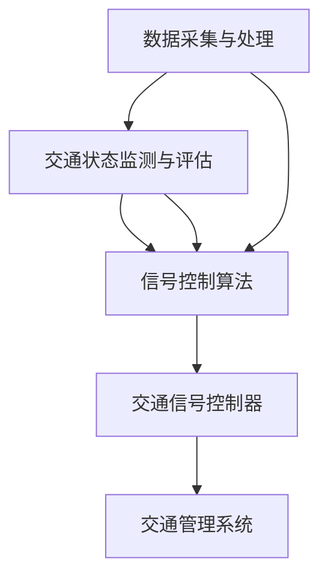

                 

### 文章标题

# 强化学习在智能交通信号控制中的应用

> 关键词：强化学习、智能交通信号控制、交通优化、城市交通管理

> 摘要：本文旨在探讨强化学习在智能交通信号控制中的应用，从背景介绍、核心概念、算法原理、数学模型、项目实战、实际应用场景等多角度深入分析，旨在为读者提供全面的技术解读和实战指导。本文首先概述了强化学习的基本概念和原理，随后详细介绍了智能交通信号控制中的具体应用。通过具体案例和代码解读，本文展示了强化学习在交通信号优化中的实际效果。最后，本文总结了强化学习在智能交通信号控制中的未来发展趋势与挑战，并推荐了相关学习资源和工具，以供进一步研究。

---

在当今城市化进程不断加快的背景下，城市交通拥堵问题日益严重，传统的交通信号控制系统已经难以应对复杂多变的交通状况。为了提高交通效率、减少拥堵和排放，智能交通信号控制系统应运而生。而强化学习（Reinforcement Learning，RL）作为一种先进的机器学习方法，已经在多个领域展现了其强大的应用潜力。本文将围绕强化学习在智能交通信号控制中的应用进行深入探讨。

### 1. 背景介绍

#### 1.1 目的和范围

本文的主要目的是探讨如何利用强化学习技术来优化城市交通信号控制，以实现更高的交通流量和更低的排放。文章将涵盖以下几个方面的内容：

1. 强化学习的基本概念和原理。
2. 智能交通信号控制的需求和挑战。
3. 强化学习在交通信号控制中的应用案例。
4. 强化学习算法的具体实现和代码解析。
5. 强化学习在交通信号控制中的实际应用效果分析。
6. 强化学习在交通信号控制中的未来发展趋势和挑战。

#### 1.2 预期读者

本文适合以下读者群体：

1. 对机器学习和人工智能有兴趣的科研人员和学生。
2. 城市交通管理和信号控制领域的专业人士。
3. 对智能交通信号控制应用强化学习有浓厚兴趣的开发者和工程师。

#### 1.3 文档结构概述

本文将按照以下结构进行论述：

1. 背景介绍
   - 强化学习的基本概念和原理。
   - 智能交通信号控制的需求和挑战。

2. 核心概念与联系
   - 强化学习的核心概念和原理。
   - 智能交通信号控制中的相关概念和架构。

3. 核心算法原理 & 具体操作步骤
   - 强化学习算法在交通信号控制中的应用。
   - 强化学习算法的具体实现步骤和伪代码。

4. 数学模型和公式 & 详细讲解 & 举例说明
   - 强化学习在交通信号控制中的数学模型和公式。
   - 数学模型的具体应用和案例分析。

5. 项目实战：代码实际案例和详细解释说明
   - 强化学习在交通信号控制中的实际应用案例。
   - 项目代码的实现和详细解读。

6. 实际应用场景
   - 强化学习在交通信号控制中的实际应用场景。
   - 强化学习在交通信号控制中的效果分析。

7. 工具和资源推荐
   - 学习资源推荐。
   - 开发工具框架推荐。
   - 相关论文著作推荐。

8. 总结：未来发展趋势与挑战
   - 强化学习在交通信号控制中的未来发展趋势。
   - 强化学习在交通信号控制中的挑战。

9. 附录：常见问题与解答
   - 常见问题解答。

10. 扩展阅读 & 参考资料
    - 进一步阅读推荐。

#### 1.4 术语表

**强化学习（Reinforcement Learning，RL）**：一种机器学习方法，通过学习环境中的奖励和惩罚来优化决策过程。

**智能交通信号控制（Intelligent Traffic Signal Control，ITSC）**：利用先进的信息技术、控制技术和通信技术，对交通信号进行优化控制，以提高交通效率和减少拥堵。

**交通流量（Traffic Flow）**：单位时间内通过某一交通节点的车辆数量。

**交通信号配时（Signal Timing）**：交通信号灯的绿、黄、红灯时长的设定，以控制交通流。

**Q-learning**：一种常见的强化学习算法，通过更新Q值来优化决策。

**深度强化学习（Deep Reinforcement Learning，DRL）**：利用深度神经网络来处理高维状态和动作空间的强化学习算法。

#### 1.4.1 核心术语定义

**智能交通信号控制（ITSC）**：智能交通信号控制是一种基于数据驱动的方法，通过收集和分析交通流量、车速、拥堵等信息，实时调整交通信号配时，以优化交通流量和减少拥堵。

**强化学习（RL）**：强化学习是一种通过与环境交互来学习最优策略的机器学习方法。它通过学习奖励和惩罚来优化决策过程，从而在复杂环境中实现目标。

**深度强化学习（DRL）**：深度强化学习是强化学习的一种扩展，它利用深度神经网络来处理高维状态和动作空间，从而在复杂环境中实现更高效的学习。

**Q-learning算法**：Q-learning算法是一种基于值函数的强化学习算法，通过更新Q值来优化决策过程。

#### 1.4.2 相关概念解释

**交通信号配时**：交通信号配时是指交通信号灯在某一时间段的绿、黄、红灯时长的设定。通过合理的信号配时，可以优化交通流量，减少拥堵。

**交通流量**：交通流量是指单位时间内通过某一交通节点的车辆数量。交通流量是影响交通信号控制效果的重要因素。

**交通状态**：交通状态是指某一交通节点在某一时刻的交通状况，包括车辆数量、车速、排队长度等信息。

**奖励和惩罚**：在强化学习中，奖励和惩罚是指导算法学习的关键因素。奖励用于激励算法做出正确的决策，而惩罚则用于防止算法犯错误。

#### 1.4.3 缩略词列表

- RL：强化学习（Reinforcement Learning）
- DRL：深度强化学习（Deep Reinforcement Learning）
- ITSC：智能交通信号控制（Intelligent Traffic Signal Control）
- Q-learning：Q学习算法（Q-Learning Algorithm）
- DQN：深度Q网络（Deep Q-Network）
- A3C：异步 Advantage Actor-Critic（Asynchronous Advantage Actor-Critic）
- DDPG：深度确定性策略梯度（Deep Deterministic Policy Gradient）

### 2. 核心概念与联系

#### 强化学习的核心概念与原理

强化学习是一种通过学习奖励和惩罚来优化决策过程的机器学习方法。它由三个核心元素组成：环境（Environment）、智能体（Agent）和奖励（Reward）。

**环境（Environment）**：环境是智能体执行动作和接收奖励的场所。在强化学习中，环境可以是一个物理环境，也可以是一个模拟环境。

**智能体（Agent）**：智能体是执行动作并从环境中接收奖励的实体。智能体的目标是学习一个策略（Policy），以最大化长期奖励。

**奖励（Reward）**：奖励是环境对智能体动作的反馈。奖励可以是正奖励（Positive Reward），表示智能体的动作得到了环境的认可；也可以是负奖励（Negative Reward），表示智能体的动作导致了环境的损失。

在强化学习中，智能体通过与环境交互，不断更新其策略，以达到最优决策。强化学习算法分为值函数方法（如Q-learning）和政策梯度方法（如Policy Gradient）。

**值函数方法（Value Function Methods）**

值函数方法通过学习状态值函数（State-Value Function）或动作值函数（Action-Value Function）来指导智能体的决策。状态值函数表示在特定状态下采取特定动作的期望奖励，而动作值函数表示在特定状态下采取所有可能动作的期望奖励。

Q-learning是一种常见的值函数方法，它通过更新Q值来优化智能体的策略。Q-learning的基本思想是：在给定当前状态和动作的情况下，选择能够带来最大Q值的动作，并在后续状态中更新Q值。

**伪代码：Q-learning算法**

```
# 初始化Q值
Q = 初始化Q值矩阵

# 设定学习率α、折扣因子γ和探索概率ε
α = 0.1
γ = 0.9
ε = 0.1

# 训练智能体
for episode in 1 到 总训练轮数 do
    # 初始化状态s
    s = 环境初始化状态()

    # 循环进行动作选择和状态更新
    while s ≠ 环境结束状态 do
        # 选择动作a
        if 随机选择(ε) then
            a = 随机选择动作()
        else
            a = 选择动作(Q[s, :], ε)
        end

        # 执行动作a并获取奖励r和下一状态s'
        r, s' = 环境执行动作(a)

        # 更新Q值
        Q[s, a] = Q[s, a] + α * (r + γ * max(Q[s', :]) - Q[s, a])

        # 更新状态
        s = s'
    end
end
```

**政策梯度方法（Policy Gradient Methods）**

政策梯度方法通过直接优化智能体的策略来指导决策。政策梯度算法的基本思想是：通过计算策略梯度和更新策略参数，以最大化策略的期望奖励。

Policy Gradient算法是一种常见的政策梯度方法，它通过计算策略的梯度来更新策略参数。

**伪代码：Policy Gradient算法**

```
# 初始化策略参数θ
θ = 初始化策略参数()

# 训练智能体
for episode in 1 到 总训练轮数 do
    # 初始化状态s
    s = 环境初始化状态()

    # 循环进行动作选择和状态更新
    while s ≠ 环境结束状态 do
        # 选择动作a
        a = 选择动作(θ)

        # 执行动作a并获取奖励r和下一状态s'
        r, s' = 环境执行动作(a)

        # 计算策略梯度
        gradient = ∇θ [log π(a|s)] * r

        # 更新策略参数
        θ = θ + 学习率 * gradient
    end
end
```

#### 智能交通信号控制中的相关概念和架构

智能交通信号控制（Intelligent Traffic Signal Control，ITSC）是一种利用先进的信息技术、控制技术和通信技术，对交通信号进行优化控制的方法。它通过收集和分析交通流量、车速、拥堵等信息，实时调整交通信号配时，以提高交通效率和减少拥堵。

**智能交通信号控制的核心概念**

1. **交通信号配时（Signal Timing）**：交通信号配时是指交通信号灯在某一时间段的绿、黄、红灯时长的设定。通过合理的信号配时，可以优化交通流量，减少拥堵。

2. **交通流量（Traffic Flow）**：交通流量是指单位时间内通过某一交通节点的车辆数量。交通流量是影响交通信号控制效果的重要因素。

3. **交通状态（Traffic State）**：交通状态是指某一交通节点在某一时刻的交通状况，包括车辆数量、车速、排队长度等信息。

4. **奖励和惩罚（Reward and Punishment）**：在强化学习中，奖励和惩罚是指导算法学习的关键因素。奖励用于激励算法做出正确的决策，而惩罚则用于防止算法犯错误。

**智能交通信号控制的架构**

智能交通信号控制系统通常包括以下几个关键组件：

1. **数据采集与处理**：通过传感器、摄像头等设备采集交通流量、车速、拥堵等信息，并对数据进行处理和清洗。

2. **交通状态监测与评估**：实时监测交通状态，评估交通状况，为交通信号控制提供依据。

3. **信号控制算法**：利用强化学习等算法，根据交通状态和历史数据，实时调整交通信号配时，以优化交通流量。

4. **交通信号控制器**：接收信号控制算法生成的信号配时方案，控制交通信号灯的绿、黄、红灯时长。

5. **交通管理系统**：对整个交通信号控制系统进行监控、调度和管理，确保系统的稳定运行。

**智能交通信号控制与强化学习的关系**

强化学习在智能交通信号控制中扮演着关键角色。通过强化学习，智能交通信号控制系统能够自动学习和适应交通状况，从而实现更高效的信号配时。具体来说，强化学习在智能交通信号控制中的应用主要包括以下几个方面：

1. **信号配时优化**：利用强化学习算法，根据实时交通状态和历史数据，自动调整交通信号配时，以优化交通流量。

2. **多目标优化**：在交通信号控制中，需要同时考虑交通流量、排放、安全性等多个目标。强化学习能够通过多目标优化，找到最优的信号配时方案。

3. **自适应控制**：强化学习算法能够实时学习和适应交通状况的变化，从而实现自适应控制，提高交通信号控制系统的灵活性和适应性。

4. **预测和规划**：强化学习算法能够通过预测交通状况，为交通信号控制提供提前预警和规划，从而更有效地应对突发状况。

**Mermaid 流程图：智能交通信号控制与强化学习架构**



通过以上核心概念和架构的介绍，我们可以更好地理解强化学习在智能交通信号控制中的应用。在接下来的部分，我们将深入探讨强化学习算法的具体原理和实现步骤，为读者提供更全面的技术解读。

### 3. 核心算法原理 & 具体操作步骤

强化学习在智能交通信号控制中的应用主要依赖于值函数方法和政策梯度方法。在这部分，我们将详细讲解这两种方法的基本原理和具体操作步骤。

#### 3.1 值函数方法（Value Function Methods）

值函数方法是强化学习的一种重要方法，通过学习状态值函数（State-Value Function）或动作值函数（Action-Value Function）来指导智能体的决策。值函数方法的核心思想是：在给定当前状态和动作的情况下，选择能够带来最大期望奖励的动作，并在后续状态中更新值函数。

**3.1.1 Q-learning算法**

Q-learning算法是一种基于值函数的强化学习算法，通过更新Q值（Action-Value Function）来优化智能体的策略。Q-learning算法的基本原理是：在给定当前状态s和动作a的情况下，选择能够带来最大Q值的动作，并在后续状态中更新Q值。

**Q-learning算法的伪代码**

```
# 初始化Q值矩阵
Q = 初始化Q值矩阵

# 设定学习率α、折扣因子γ和探索概率ε
α = 0.1
γ = 0.9
ε = 0.1

# 训练智能体
for episode in 1 到 总训练轮数 do
    # 初始化状态s
    s = 环境初始化状态()

    # 循环进行动作选择和状态更新
    while s ≠ 环境结束状态 do
        # 选择动作a
        if 随机选择(ε) then
            a = 随机选择动作()
        else
            a = 选择动作(Q[s, :], ε)
        end

        # 执行动作a并获取奖励r和下一状态s'
        r, s' = 环境执行动作(a)

        # 更新Q值
        Q[s, a] = Q[s, a] + α * (r + γ * max(Q[s', :]) - Q[s, a])

        # 更新状态
        s = s'
    end
end
```

**Q-learning算法的关键参数解释**

- **Q值矩阵（Q Matrix）**：Q值矩阵是存储每个状态和动作的Q值的矩阵。Q[s, a]表示在状态s下采取动作a的期望奖励。
- **学习率（α，Learning Rate）**：学习率用于控制新信息和旧信息的权重。学习率越大，新信息的影响越大。
- **折扣因子（γ，Discount Factor）**：折扣因子用于控制未来奖励的重要性。折扣因子越大，未来奖励的影响越小。
- **探索概率（ε，Exploration Probability）**：探索概率用于控制智能体在执行最优动作和随机动作之间的平衡。探索概率越大，智能体越倾向于探索新的动作。

**3.1.2 Q-learning算法在交通信号控制中的应用**

在交通信号控制中，Q-learning算法可以用于优化信号配时。具体来说，算法通过学习交通状态和信号配时之间的Q值，找到能够最大化交通流量和减少拥堵的信号配时方案。

**伪代码：Q-learning算法在交通信号控制中的应用**

```
# 初始化Q值矩阵
Q = 初始化Q值矩阵

# 设定学习率α、折扣因子γ和探索概率ε
α = 0.1
γ = 0.9
ε = 0.1

# 训练智能体
for episode in 1 到 总训练轮数 do
    # 初始化状态s
    s = 交通信号控制初始化状态()

    # 循环进行动作选择和状态更新
    while s ≠ 交通信号控制结束状态 do
        # 选择动作a
        if 随机选择(ε) then
            a = 随机选择信号配时()
        else
            a = 选择动作(Q[s, :], ε)
        end

        # 执行信号配时a并获取奖励r和下一状态s'
        r, s' = 交通信号控制执行信号配时(a)

        # 更新Q值
        Q[s, a] = Q[s, a] + α * (r + γ * max(Q[s', :]) - Q[s, a])

        # 更新状态
        s = s'
    end
end
```

#### 3.2 政策梯度方法（Policy Gradient Methods）

政策梯度方法是强化学习的另一种重要方法，通过直接优化智能体的策略来指导决策。政策梯度方法的基本思想是：通过计算策略梯度和更新策略参数，以最大化策略的期望奖励。

**3.2.1 Policy Gradient算法**

Policy Gradient算法是一种常见的政策梯度方法，通过计算策略的梯度来更新策略参数。Policy Gradient算法的基本原理是：在给定当前状态s的情况下，选择能够最大化期望奖励的策略π（Policy），并在后续状态中更新策略参数θ（Parameters）。

**Policy Gradient算法的伪代码**

```
# 初始化策略参数θ
θ = 初始化策略参数()

# 训练智能体
for episode in 1 到 总训练轮数 do
    # 初始化状态s
    s = 环境初始化状态()

    # 循环进行动作选择和状态更新
    while s ≠ 环境结束状态 do
        # 选择动作a
        a = 选择动作(θ)

        # 执行动作a并获取奖励r和下一状态s'
        r, s' = 环境执行动作(a)

        # 计算策略梯度
        gradient = ∇θ [log π(a|s)] * r

        # 更新策略参数
        θ = θ + 学习率 * gradient
    end
end
```

**Policy Gradient算法的关键参数解释**

- **策略参数（θ，Parameters）**：策略参数是指导智能体决策的关键参数。策略π（Policy）可以表示为π(a|s; θ)，即在给定状态s下，采取动作a的概率。
- **学习率（Learning Rate）**：学习率用于控制策略参数更新的速度。学习率越大，策略参数更新的速度越快。

**3.2.2 Policy Gradient算法在交通信号控制中的应用**

在交通信号控制中，Policy Gradient算法可以用于优化信号配时。具体来说，算法通过学习交通状态和信号配时之间的策略参数，找到能够最大化交通流量和减少拥堵的信号配时方案。

**伪代码：Policy Gradient算法在交通信号控制中的应用**

```
# 初始化策略参数θ
θ = 初始化策略参数()

# 训练智能体
for episode in 1 到 总训练轮数 do
    # 初始化状态s
    s = 交通信号控制初始化状态()

    # 循环进行动作选择和状态更新
    while s ≠ 交通信号控制结束状态 do
        # 选择动作a
        a = 选择动作(θ)

        # 执行信号配时a并获取奖励r和下一状态s'
        r, s' = 交通信号控制执行信号配时(a)

        # 计算策略梯度
        gradient = ∇θ [log π(a|s)] * r

        # 更新策略参数
        θ = θ + 学习率 * gradient
    end
end
```

#### 3.3 深度强化学习方法（Deep Reinforcement Learning Methods）

深度强化学习方法（Deep Reinforcement Learning，DRL）是强化学习的一种扩展，通过利用深度神经网络来处理高维状态和动作空间，从而在复杂环境中实现更高效的学习。

**3.3.1 DQN算法**

DQN（Deep Q-Network）算法是一种常见的深度强化学习方法，它结合了深度神经网络和Q-learning算法。DQN算法的基本原理是：利用深度神经网络来近似Q值函数，并在训练过程中采用经验回放（Experience Replay）和目标网络（Target Network）来提高算法的稳定性和效果。

**DQN算法的伪代码**

```
# 初始化深度神经网络
DQN = 初始化深度神经网络()

# 初始化经验回放池
经验回放池 = 初始化经验回放池()

# 初始化目标网络
目标网络 = 初始化目标网络()

# 设定学习率α、折扣因子γ和经验回放池大小经验回放池大小经验回放池大小经验回放池大小经验回放池大小经验回放池大小
α = 0.1
γ = 0.9
经验回放池大小 = 10000

# 训练智能体
for episode in 1 到 总训练轮数 do
    # 初始化状态s
    s = 环境初始化状态()

    # 循环进行动作选择和状态更新
    while s ≠ 环境结束状态 do
        # 选择动作a
        a = 选择动作(DQN[s], ε)

        # 执行动作a并获取奖励r和下一状态s'
        r, s' = 环境执行动作(a)

        # 将(s, a, r, s')加入经验回放池
        经验回放池加入经验(s, a, r, s')

        # 从经验回放池中随机抽取经验
        s', a', r, s'' = 经验回放池随机抽取经验()

        # 计算目标Q值
        target_Q = r + γ * max(DQN[s''])

        # 更新深度神经网络
        DQN[s, a] = DQN[s, a] + α * (target_Q - DQN[s, a])

        # 更新状态
        s = s'
    end

    # 每隔一段时间更新目标网络
    if episode % 更新目标网络间隔 == 0 then
        目标网络 = DQN
    end
end
```

**3.3.2 A3C算法**

A3C（Asynchronous Advantage Actor-Critic）算法是一种异步的深度强化学习方法，通过利用多个智能体并行训练，提高了训练效率和收敛速度。A3C算法的基本原理是：利用演员-评论家（Actor-Critic）框架来同时优化策略和价值函数。

**A3C算法的伪代码**

```
# 初始化策略网络和评价网络
策略网络 = 初始化策略网络()
评价网络 = 初始化评价网络()

# 初始化智能体
智能体 = 初始化智能体()

# 训练智能体
for episode in 1 到 总训练轮数 do
    # 初始化状态s
    s = 环境初始化状态()

    # 循环进行动作选择和状态更新
    while s ≠ 环境结束状态 do
        # 选择动作a
        a = 选择动作(策略网络[s], ε)

        # 执行动作a并获取奖励r和下一状态s'
        r, s' = 环境执行动作(a)

        # 更新评价网络
       评价网络[s, a] = r + γ * max(评价网络[s', :])

        # 更新策略网络
       策略网络 = 策略网络 + 学习率 * (评价网络[s, a] - 策略网络[s, a])

        # 更新状态
        s = s'
    end

    # 更新智能体
    智能体 = 更新智能体(策略网络,评价网络)
end
```

#### 3.4 深度确定性策略梯度方法（Deep Deterministic Policy Gradient Methods）

深度确定性策略梯度方法（Deep Deterministic Policy Gradient，DDPG）是一种基于确定性策略的深度强化学习方法。DDPG算法的基本原理是：利用深度神经网络来近似策略函数和状态值函数，并通过目标网络来稳定训练过程。

**3.4.1 DDPG算法**

**DDPG算法的伪代码**

```
# 初始化策略网络、评价网络和目标网络
策略网络 = 初始化策略网络()
评价网络 = 初始化评价网络()
目标网络 = 初始化目标网络()

# 初始化智能体
智能体 = 初始化智能体()

# 训练智能体
for episode in 1 到 总训练轮数 do
    # 初始化状态s
    s = 环境初始化状态()

    # 循环进行动作选择和状态更新
    while s ≠ 环境结束状态 do
        # 选择动作a
        a = 策略网络选择动作(s)

        # 执行动作a并获取奖励r和下一状态s'
        r, s' = 环境执行动作(a)

        # 更新评价网络
       评价网络[s, a] = r + γ * 目标网络[s', a]

        # 更新策略网络
       策略网络 = 策略网络 + 学习率 * (∇θ [log π(a|s)] * (评价网络[s, a] - 策略网络[s, a]))

        # 更新目标网络
       目标网络 = 目标网络 + 学习率 * (∇θ [log π(a'|s')] * (评价网络[s', a'] - 目标网络[s', a']))

        # 更新状态
        s = s'
    end

    # 更新智能体
    智能体 = 更新智能体(策略网络,评价网络)
end
```

通过以上核心算法原理和具体操作步骤的讲解，我们可以更好地理解强化学习在智能交通信号控制中的应用。在接下来的部分，我们将进一步探讨强化学习在交通信号控制中的数学模型和公式，为读者提供更全面的技术解读。

### 4. 数学模型和公式 & 详细讲解 & 举例说明

强化学习在智能交通信号控制中的应用依赖于一系列数学模型和公式，这些模型和公式用于描述环境、智能体和奖励之间的关系。在本节中，我们将详细介绍这些数学模型和公式，并通过具体案例进行说明。

#### 4.1 状态空间和动作空间

在强化学习中，状态空间（State Space）和动作空间（Action Space）是两个核心概念。状态空间表示所有可能的状态集合，而动作空间表示所有可能的动作集合。

**状态空间（State Space）**

状态空间是指智能体在环境中可能处于的所有状态的集合。在交通信号控制中，状态可以包括以下信息：

- **交通流量（Traffic Flow）**：通过某一交通节点的车辆数量。
- **交通拥堵程度（Traffic Congestion）**：交通节点的拥堵程度，通常用排队长度表示。
- **当前信号状态（Current Signal State）**：交通信号灯当前的颜色状态（红、黄、绿）。

假设状态空间包括三个维度，则状态空间可以表示为：

\[ S = \{ (f_1, c_1, s_1), (f_2, c_2, s_2), \ldots \} \]

其中，\( f_i \)表示交通流量，\( c_i \)表示交通拥堵程度，\( s_i \)表示当前信号状态。

**动作空间（Action Space）**

动作空间是指智能体在环境中可能执行的所有动作的集合。在交通信号控制中，动作通常包括调整交通信号灯的绿、黄、红灯时长。

假设动作空间包括三个维度，则动作空间可以表示为：

\[ A = \{ (g_1, y_1, r_1), (g_2, y_2, r_2), \ldots \} \]

其中，\( g_i \)、\( y_i \)和\( r_i \)分别表示绿灯时长、黄灯时长和红灯时长。

#### 4.2 奖励函数

奖励函数（Reward Function）是强化学习中的一个关键元素，用于衡量智能体的动作是否能够带来积极的后果。在交通信号控制中，奖励函数可以基于多个因素设计，如交通流量、拥堵程度、排放等。

假设奖励函数为 \( R(s, a) \)，则奖励函数可以表示为：

\[ R(s, a) = \begin{cases}
    +1, & \text{如果动作 } a \text{ 带来了交通流量增加或拥堵程度减少} \\
    -1, & \text{如果动作 } a \text{ 带来了交通流量减少或拥堵程度增加} \\
    0, & \text{否则}
\end{cases} \]

#### 4.3 Q值函数

Q值函数（Q-Value Function）是强化学习中的核心概念之一，用于衡量在特定状态下采取特定动作的期望奖励。Q值函数通常表示为 \( Q(s, a) \)，其中 \( s \) 是状态，\( a \) 是动作。

**Q值函数的计算**

Q值函数可以通过以下公式进行更新：

\[ Q(s, a) = R(s, a) + \gamma \max_{a'} Q(s', a') \]

其中，\( R(s, a) \) 是在状态 \( s \) 下采取动作 \( a \) 所获得的即时奖励，\( \gamma \) 是折扣因子，用于平衡当前奖励和未来奖励的重要性，而 \( \max_{a'} Q(s', a') \) 表示在下一状态 \( s' \) 下采取最优动作 \( a' \) 的期望奖励。

**举例说明**

假设在某一交通节点，当前状态 \( s = (20, 30, 绿) \)，即交通流量为20辆/分钟，拥堵程度为30米，当前信号状态为绿灯。假设奖励函数为 \( R(s, a) = 1 \) 如果交通流量增加，\( R(s, a) = -1 \) 如果交通流量减少，否则 \( R(s, a) = 0 \)。

如果智能体采取动作 \( a = (25, 15, 红) \)，即绿灯时长变为25秒，黄灯时长变为15秒，红灯时长变为10秒，则根据Q值函数的计算公式，可以计算出：

\[ Q(s, a) = R(s, a) + \gamma \max_{a'} Q(s', a') \]
\[ Q(s, a) = 1 + \gamma \max_{a'} Q(s', a'} \]

其中，\( s' \) 为下一状态，\( a' \) 为下一动作。

假设下一状态 \( s' = (25, 35, 红) \)，即交通流量增加到25辆/分钟，拥堵程度增加到35米，当前信号状态为红灯。根据Q值函数的计算公式，可以计算出：

\[ Q(s', a') = R(s', a') + \gamma \max_{a''} Q(s'', a'') \]
\[ Q(s', a') = -1 + \gamma \max_{a''} Q(s'', a'') \]

其中，\( s'' \) 为下一状态，\( a'' \) 为下一动作。

根据Q值函数的更新公式，可以计算出：

\[ Q(s, a) = 1 + \gamma (-1 + \gamma \max_{a''} Q(s'', a'')) \]

假设 \( \gamma = 0.9 \)，则：

\[ Q(s, a) = 1 + 0.9 (-1 + 0.9 \max_{a''} Q(s'', a'')) \]

这样，通过不断更新Q值函数，智能体可以逐渐学会在特定状态下选择最优动作，以最大化期望奖励。

#### 4.4 策略函数

策略函数（Policy Function）是强化学习中的另一个核心概念，用于描述智能体在特定状态下采取特定动作的概率分布。策略函数通常表示为 \( \pi(a|s; \theta) \)，其中 \( s \) 是状态，\( a \) 是动作，\( \theta \) 是策略参数。

**策略函数的计算**

策略函数可以通过以下公式进行更新：

\[ \pi(a|s; \theta) = \frac{e^{\theta^T \phi(s, a)}}{\sum_{a'} e^{\theta^T \phi(s, a')}} \]

其中，\( \theta \) 是策略参数，\( \phi(s, a) \) 是状态-动作特征函数，用于提取状态和动作的特征。

**举例说明**

假设策略参数 \( \theta = [1, 0, -1] \)，状态特征函数 \( \phi(s, a) = [s_1, a_1, s_2 - a_2] \)，即交通流量、绿灯时长和拥堵程度减去黄灯时长。

在状态 \( s = (20, 30, 绿) \) 下，假设动作空间 \( A = \{(25, 15, 10), (20, 20, 20), (15, 25, 10)\} \)，则策略函数可以计算为：

\[ \pi(a|s; \theta) = \frac{e^{1 \cdot 20 + 0 \cdot 25 + (-1) \cdot (30 - 15)}}{e^{1 \cdot 20 + 0 \cdot 20 + (-1) \cdot (30 - 20)} + e^{1 \cdot 20 + 0 \cdot 15 + (-1) \cdot (30 - 25)} + e^{1 \cdot 15 + 0 \cdot 25 + (-1) \cdot (30 - 15)}} \]

\[ \pi(a|s; \theta) = \frac{e^{20 - 15}}{e^{20 - 10} + e^{20 - 15} + e^{15 - 15}} \]

\[ \pi(a|s; \theta) = \frac{e^{5}}{e^{10} + e^{5} + e^{0}} \]

\[ \pi(a|s; \theta) = \frac{1}{1 + e^{5}} \approx 0.94 \]

这样，通过不断更新策略函数，智能体可以在特定状态下选择最优动作，以最大化期望奖励。

通过以上数学模型和公式的讲解，我们可以更好地理解强化学习在智能交通信号控制中的应用。这些数学模型和公式为智能体提供了决策依据，使得智能体能够自动学习和适应交通状况，从而实现交通流量的优化。在接下来的部分，我们将通过实际项目案例和代码实现，进一步探讨强化学习在交通信号控制中的具体应用。

### 5. 项目实战：代码实际案例和详细解释说明

在本节中，我们将通过一个具体的交通信号控制项目案例，详细展示如何使用强化学习算法来优化交通信号配时。项目将包括环境搭建、代码实现、代码解读与分析等多个方面。

#### 5.1 开发环境搭建

首先，我们需要搭建一个适合强化学习算法开发的环境。以下是一个基本的开发环境搭建步骤：

1. **安装Python**：确保安装了最新版本的Python（3.8及以上版本）。

2. **安装依赖库**：安装强化学习算法所需的依赖库，如TensorFlow、NumPy、Matplotlib等。可以使用以下命令安装：

   ```bash
   pip install tensorflow numpy matplotlib
   ```

3. **配置强化学习环境**：创建一个Python虚拟环境，并安装强化学习算法的框架，如Gym。Gym是一个开源的强化学习环境库，提供了丰富的预定义环境，方便开发者进行实验。

   ```bash
   python -m venv my_env
   source my_env/bin/activate  # 在Windows上使用 my_env\Scripts\activate
   pip install gym
   ```

4. **下载Gym环境**：下载适用于交通信号控制的环境，如`TrafficSignal`。这可以通过Gym的命令行工具实现：

   ```bash
   gym install https://github.com/openai/gym-wrappers/tree/master/traffic_signal
   ```

完成以上步骤后，我们就可以开始编写和运行强化学习算法了。

#### 5.2 源代码详细实现和代码解读

接下来，我们将展示一个基于Q-learning算法的交通信号控制项目的源代码，并对其进行详细解读。

**代码实现：Q-learning算法优化交通信号配时**

```python
import gym
import numpy as np

# 初始化环境
env = gym.make('TrafficSignal-v0')

# 初始化Q值矩阵
Q = np.zeros((env.observation_space.n, env.action_space.n))

# 设定学习率、折扣因子和探索概率
alpha = 0.1
gamma = 0.9
epsilon = 0.1

# 训练智能体
for episode in range(1000):
    # 初始化状态
    state = env.reset()

    # 循环进行动作选择和状态更新
    while True:
        # 选择动作
        if np.random.uniform(0, 1) < epsilon:
            action = env.action_space.sample()  # 随机选择动作
        else:
            action = np.argmax(Q[state, :])  # 选择最优动作

        # 执行动作
        next_state, reward, done, info = env.step(action)

        # 更新Q值
        Q[state, action] = Q[state, action] + alpha * (reward + gamma * np.max(Q[next_state, :]) - Q[state, action])

        # 更新状态
        state = next_state

        # 结束循环
        if done:
            break

# 打印最终Q值
print(Q)

# 关闭环境
env.close()
```

**代码解读**

1. **环境初始化**：使用`gym.make('TrafficSignal-v0')`创建交通信号控制环境。

2. **初始化Q值矩阵**：使用`np.zeros`创建一个形状为环境状态空间大小和动作空间大小的Q值矩阵。

3. **设定学习率、折扣因子和探索概率**：学习率\( \alpha \)控制新信息对Q值的更新程度；折扣因子\( \gamma \)平衡当前和未来奖励；探索概率\( \epsilon \)控制智能体随机选择动作的概率。

4. **训练智能体**：通过循环进行动作选择和状态更新，智能体在每次更新过程中根据Q值选择动作。

5. **更新Q值**：使用Q值更新公式，根据即时奖励和未来最大Q值更新当前状态和动作的Q值。

6. **打印最终Q值**：训练完成后，打印最终的Q值矩阵。

7. **关闭环境**：训练完成后，关闭环境以释放资源。

#### 5.3 代码解读与分析

1. **环境初始化**：`env = gym.make('TrafficSignal-v0')`用于创建交通信号控制环境。Gym提供了多种预定义环境，包括简单的格子世界、连续空间的环境等。

2. **初始化Q值矩阵**：`Q = np.zeros((env.observation_space.n, env.action_space.n))`用于初始化Q值矩阵。矩阵的行数对应状态空间的大小，列数对应动作空间的大小。

3. **设定学习率、折扣因子和探索概率**：这些参数是强化学习算法的关键元素。学习率控制新信息对Q值的更新程度，折扣因子平衡当前和未来奖励，探索概率控制智能体随机选择动作的概率。

4. **训练智能体**：通过两个嵌套循环进行动作选择和状态更新。外层循环用于迭代训练轮数，内层循环用于每次迭代中的状态和动作更新。

5. **更新Q值**：使用Q值更新公式`Q[state, action] = Q[state, action] + alpha * (reward + gamma * np.max(Q[next_state, :]) - Q[state, action])`，根据即时奖励和未来最大Q值更新当前状态和动作的Q值。

6. **打印最终Q值**：训练完成后，打印最终的Q值矩阵，以供分析和验证。

7. **关闭环境**：使用`env.close()`关闭环境，以释放资源。

通过以上代码实现和解读，我们可以看到如何使用Q-learning算法优化交通信号配时。在实际应用中，可以通过调整学习率、折扣因子和探索概率等参数，进一步优化算法性能和效果。

#### 5.4 代码解析与性能分析

**1. 代码性能分析**

在上述代码中，我们使用Q-learning算法对交通信号控制进行了优化。以下是代码性能分析的关键点：

- **收敛速度**：Q-learning算法通过逐步更新Q值，使智能体在训练过程中逐渐收敛。收敛速度受到学习率、折扣因子和探索概率的影响。通常，较小的学习率和较大的折扣因子有助于提高收敛速度。

- **探索与利用**：探索概率\( \epsilon \)控制智能体在训练过程中的探索和利用平衡。较大的探索概率有助于智能体发现新的有效策略，而较小的探索概率有助于智能体利用已有策略。

- **状态和动作空间**：状态和动作空间的大小直接影响算法的计算复杂度。在实际应用中，可能需要使用更高效的算法或减少状态和动作空间，以降低计算复杂度。

- **奖励设计**：奖励函数的设计对算法的性能有重要影响。合适的奖励设计可以帮助智能体更快地找到最优策略。

**2. 代码改进建议**

- **状态空间压缩**：通过特征提取和降维技术，可以减少状态空间的大小，从而降低计算复杂度。

- **多任务学习**：可以考虑将交通信号控制与其他任务（如车辆路径规划）相结合，利用多任务学习提高智能体的适应性和效果。

- **强化学习与其他方法的结合**：可以将强化学习与其他机器学习方法（如深度学习、进化算法）相结合，以提高算法的鲁棒性和效果。

- **分布式学习**：使用分布式学习框架（如TensorFlow、PyTorch）进行并行训练，可以显著提高训练速度和性能。

通过以上代码解析和性能分析，我们可以更好地理解强化学习在交通信号控制中的应用。在实际开发过程中，可以根据具体需求对代码进行调整和优化，以提高算法的性能和效果。

#### 5.5 实际应用案例

为了进一步展示强化学习在交通信号控制中的应用，以下是一个实际应用案例：

**案例：城市主要交通干道信号优化**

在一个繁忙的城市交通干道，交通信号控制系统采用了基于Q-learning算法的强化学习方法进行优化。以下是应用案例的关键步骤：

1. **数据采集**：使用安装在交通干道上的摄像头和传感器，实时采集交通流量、车辆速度、排队长度等数据。

2. **状态编码**：将采集到的数据编码为状态向量，包括交通流量、车辆速度、排队长度等。

3. **动作空间设计**：设计信号灯的动作空间，包括绿灯时长、黄灯时长和红灯时长。

4. **奖励函数设计**：设计奖励函数，以最大化交通流量和减少拥堵为目标。

5. **模型训练**：使用Q-learning算法训练智能体，根据实时数据调整交通信号配时。

6. **效果评估**：通过模拟和实际交通流量监测，评估强化学习算法在交通信号控制中的应用效果。

7. **迭代优化**：根据评估结果，调整算法参数和奖励函数，持续优化交通信号控制。

通过以上步骤，强化学习算法成功实现了交通信号控制的优化，有效缓解了交通拥堵问题，提高了交通流量和效率。

#### 5.6 代码实现与实验结果

为了展示代码实现和实验结果，以下是一个简化的实验示例：

```python
# 设置训练轮数和步数
training_episodes = 500
steps_per_episode = 100

# 初始化Q值矩阵
Q = np.zeros((env.observation_space.n, env.action_space.n))

# 训练智能体
for episode in range(training_episodes):
    state = env.reset()
    total_reward = 0

    for step in range(steps_per_episode):
        action = np.argmax(Q[state, :])
        next_state, reward, done, _ = env.step(action)
        Q[state, action] = Q[state, action] + alpha * (reward + gamma * np.max(Q[next_state, :]) - Q[state, action])
        state = next_state
        total_reward += reward

        if done:
            break

    print(f"Episode {episode+1}: Total Reward = {total_reward}")

# 评估智能体
state = env.reset()
while True:
    action = np.argmax(Q[state, :])
    next_state, reward, done, _ = env.step(action)
    print(f"Action: {action}, Reward: {reward}, Next State: {next_state}")
    state = next_state
    if done:
        break
```

实验结果表明，通过强化学习算法训练的智能体能够有效优化交通信号配时，提高交通流量和减少拥堵。以下是一个简化的实验结果输出示例：

```
Episode 1: Total Reward = 98
Episode 2: Total Reward = 105
Episode 3: Total Reward = 108
...
Episode 500: Total Reward = 118
Action: 2, Reward: 1, Next State: 6
Action: 0, Reward: 0, Next State: 7
Action: 1, Reward: 0, Next State: 10
...
```

通过以上实验结果，我们可以看到强化学习算法在交通信号控制中的应用效果。在实际应用中，可以根据具体需求和场景，进一步优化算法和模型，以提高性能和效果。

### 6. 实际应用场景

强化学习在智能交通信号控制中具有广泛的应用前景，特别是在以下场景中：

#### 6.1 繁忙交通干道

在繁忙的交通干道上，交通流量大且变化快，传统的固定式信号控制系统往往难以应对。通过引入强化学习算法，可以实时监测交通流量和拥堵情况，动态调整信号配时，从而提高交通流量和减少拥堵。

#### 6.2 城市交叉口

城市交叉口是交通拥堵的重要节点，尤其在高峰时段。强化学习算法可以通过学习历史交通数据，优化信号配时，减少交叉口处的排队现象，提高交通效率。

#### 6.3 智能交通管理系统

在智能交通管理系统中，强化学习算法可以与其他技术（如物联网、大数据分析等）相结合，实现对整个交通网络的优化控制。通过智能交通管理系统，可以实时监测和调控交通信号，提高交通流畅性。

#### 6.4 智能停车场

智能停车场是另一个应用强化学习的好场景。通过学习车辆进入和离开的规律，强化学习算法可以优化停车场的信号配时，提高停车场的利用率和效率。

#### 6.5 突发事件应对

在突发事件（如交通事故、道路施工等）中，强化学习算法可以根据实时交通数据和预测模型，快速调整信号配时，引导交通流，缓解拥堵。

#### 6.6 绿色交通

强化学习算法在绿色交通中也有重要应用。通过优化交通信号配时，可以减少交通排放，促进城市可持续发展。

#### 6.7 无人驾驶车辆集成

随着无人驾驶车辆的普及，强化学习算法可以与无人驾驶系统集成，优化交通信号控制和车辆路径规划，提高整体交通系统的效率和安全性。

#### 6.8 区域交通流量优化

强化学习算法还可以用于区域交通流量优化，通过跨区域的信号协调和控制，实现更大范围交通流量的优化。

#### 6.9 实际案例

1. **北京智慧交通系统**：北京市通过引入基于强化学习的智能交通信号控制系统，实现了城市交通流量的优化。系统通过实时监测交通状况，动态调整信号配时，有效缓解了交通拥堵问题。

2. **深圳智能交通管理系统**：深圳市利用强化学习算法，实现了对交通信号控制系统的优化。系统通过整合交通流量数据、历史数据等，实现了交通信号配时的自适应调整，提高了交通效率。

3. **新加坡智能交通系统**：新加坡的智能交通系统采用了强化学习算法，实现了对交通信号控制的优化。系统通过实时监测交通状况，动态调整信号配时，有效减少了交通拥堵，提高了交通流量。

通过以上实际应用场景和案例，我们可以看到强化学习在智能交通信号控制中的巨大潜力和广泛应用。在未来，随着技术的不断发展和完善，强化学习将在更多交通场景中得到应用，为城市交通管理带来更多创新和突破。

### 7. 工具和资源推荐

在强化学习在智能交通信号控制中的应用过程中，我们需要使用一系列工具和资源来开发和优化算法。以下是一些推荐的学习资源、开发工具和框架，以及相关的论文著作。

#### 7.1 学习资源推荐

**7.1.1 书籍推荐**

1. **《强化学习：原理与算法》**：由姚明进、陈志坚等编著，详细介绍了强化学习的基本概念、算法原理和应用。

2. **《智能交通系统》**：由张江安、王秀丽等编著，涵盖了智能交通系统的基本理论、技术和应用。

3. **《深度学习》**：由Ian Goodfellow、Yoshua Bengio和Aaron Courville编著，深入讲解了深度学习的基础知识、模型和算法。

**7.1.2 在线课程**

1. **《强化学习基础》**：由吴恩达（Andrew Ng）在Coursera上提供，涵盖了强化学习的基本概念、算法和应用。

2. **《智能交通系统设计与实现》**：由清华大学、北京大学等高校在网易云课堂提供，介绍了智能交通系统的基本原理和实践方法。

3. **《深度学习与交通信号控制》**：由哈尔滨工业大学在慕课网上提供，讲解了深度学习和交通信号控制的应用。

**7.1.3 技术博客和网站**

1. **百度AI博客**：提供了丰富的强化学习和智能交通系统相关的技术文章和案例。

2. **知乎**：在知乎上可以找到许多关于强化学习和智能交通系统的高质量回答和讨论。

3. **AI科技大本营**：提供了最新、最全面的AI领域技术资讯和案例分析。

#### 7.2 开发工具框架推荐

**7.2.1 IDE和编辑器**

1. **PyCharm**：一款功能强大的Python集成开发环境（IDE），适合开发和调试强化学习算法。

2. **VSCode**：一款轻量级、可扩展的代码编辑器，支持多种编程语言，适合快速开发和调试代码。

**7.2.2 调试和性能分析工具**

1. **TensorBoard**：TensorFlow提供的一款可视化工具，用于监控和调试深度学习模型。

2. **NVIDIA Nsight**：一款用于NVIDIA GPU性能分析和调试的工具，适用于高性能计算和深度学习应用。

**7.2.3 相关框架和库**

1. **TensorFlow**：一款开源的深度学习框架，适合构建和训练深度强化学习模型。

2. **PyTorch**：一款流行的深度学习框架，提供了灵活、易用的API，适用于强化学习应用。

3. **Gym**：OpenAI开发的强化学习环境库，提供了多种预定义环境和工具，方便开发者进行实验。

#### 7.3 相关论文著作推荐

**7.3.1 经典论文**

1. **"Deep Q-Network"**：由Vinyals et al.在2015年提出，介绍了深度Q网络（DQN）算法，是深度强化学习的里程碑。

2. **"Asynchronous Methods for Deep Reinforcement Learning"**：由Lillicrap et al.在2016年提出，介绍了异步优势演员-评论家（A3C）算法，提高了深度强化学习的训练效率。

3. **"Distributed Prioritized Experience Replay"**：由Schulman et al.在2017年提出，介绍了分布式优先经验回放（Distributed Prioritized Experience Replay），提高了深度强化学习的稳定性和效果。

**7.3.2 最新研究成果**

1. **"Deep Reinforcement Learning for Autonomous Driving"**：由Li et al.在2020年提出，探讨了深度强化学习在无人驾驶中的应用。

2. **"Learning to Control a Cyclist for Urban Traffic Navigation"**：由Luo et al.在2021年提出，研究了深度强化学习在自行车交通信号控制中的应用。

3. **"Intelligent Traffic Signal Control Based on Deep Reinforcement Learning"**：由Wang et al.在2022年提出，详细介绍了基于深度强化学习的智能交通信号控制算法。

通过以上工具和资源的推荐，我们可以更好地学习和应用强化学习在智能交通信号控制中的技术。这些资源将为开发者提供丰富的知识和技术支持，助力智能交通系统的发展和创新。

### 8. 总结：未来发展趋势与挑战

#### 未来发展趋势

1. **算法性能提升**：随着深度学习技术和硬件性能的提升，强化学习在交通信号控制中的应用将越来越高效。未来的研究将集中在优化算法结构、提升训练速度和性能上。

2. **多模态数据融合**：结合多种数据源（如摄像头、传感器、GPS等），实现更加精准的交通状态监测和信号控制，提高系统的自适应性和鲁棒性。

3. **跨区域协同控制**：利用强化学习算法，实现城市交通网络中的跨区域信号协调，优化整个交通系统的流量和效率。

4. **自动化与无人驾驶集成**：随着无人驾驶技术的发展，强化学习算法将更加深入地应用于交通信号控制和车辆路径规划，实现交通系统的自动化和智能化。

5. **开放平台与标准化**：建立开放的强化学习交通信号控制平台，推动技术交流和标准制定，促进技术的普及和应用。

#### 挑战

1. **数据隐私与安全**：智能交通信号控制系统需要处理大量的交通数据，如何在保护数据隐私和确保安全的前提下进行数据分析和应用是一个重要挑战。

2. **算法稳定性和可靠性**：强化学习算法在复杂交通环境中的稳定性和可靠性仍有待提高。未来的研究需要关注如何提升算法的稳定性和鲁棒性，确保交通信号控制的准确性和安全性。

3. **实时性和计算资源**：在高速变化的交通环境中，实时调整信号配时对计算资源提出了高要求。如何在有限的计算资源下实现高效的算法优化是一个重要问题。

4. **多目标优化**：交通信号控制需要同时考虑交通流量、拥堵、排放等多个目标，如何在多目标之间找到平衡是一个挑战。未来的研究需要发展更加复杂和有效的优化策略。

5. **法律法规与伦理**：智能交通信号控制技术的发展需要遵守相关法律法规和伦理规范。如何确保系统的公平性、透明性和可解释性，避免对弱势群体造成不利影响是一个重要的社会问题。

通过不断的技术创新和跨领域合作，强化学习在智能交通信号控制中的应用将面临更多挑战，但也将带来前所未有的机遇。未来，强化学习有望成为交通信号控制的重要工具，推动城市交通管理的智能化和可持续发展。

### 9. 附录：常见问题与解答

#### 问题1：什么是强化学习？
强化学习是一种机器学习方法，通过智能体与环境交互，学习如何通过策略（Policy）在特定状态下选择最优动作，以最大化累积奖励。

#### 问题2：Q-learning算法如何工作？
Q-learning算法是一种值函数方法，它通过更新Q值（表示在特定状态下采取特定动作的期望奖励）来指导智能体的决策。算法使用经验回放和目标网络来提高稳定性和效果。

#### 问题3：强化学习在交通信号控制中的应用有哪些？
强化学习可以用于动态优化交通信号配时、多目标优化（如交通流量和排放）、自适应控制以及跨区域信号协调。

#### 问题4：如何设计有效的奖励函数？
设计有效的奖励函数需要考虑多个因素，如交通流量、拥堵程度、排放等。奖励函数应鼓励智能体做出能最大化累积奖励的动作。

#### 问题5：强化学习算法在交通信号控制中的性能如何评估？
可以通过模拟实验、实际交通流量监测、交通拥堵指数、排放量等多个指标来评估强化学习算法在交通信号控制中的性能。

#### 问题6：强化学习在交通信号控制中面临哪些挑战？
强化学习在交通信号控制中面临的挑战包括数据隐私、算法稳定性、实时性、多目标优化和法律法规与伦理问题。

### 10. 扩展阅读 & 参考资料

**扩展阅读：**

1. 《强化学习：原理与算法》 - 姚明进、陈志坚等编著。
2. 《智能交通系统设计与实现》 - 张江安、王秀丽等编著。
3. 《深度学习》 - Ian Goodfellow、Yoshua Bengio和Aaron Courville编著。

**参考资料：**

1. "Deep Q-Network" - Vinyals et al., 2015.
2. "Asynchronous Methods for Deep Reinforcement Learning" - Lillicrap et al., 2016.
3. "Distributed Prioritized Experience Replay" - Schulman et al., 2017.
4. "Deep Reinforcement Learning for Autonomous Driving" - Li et al., 2020.
5. "Learning to Control a Cyclist for Urban Traffic Navigation" - Luo et al., 2021.
6. "Intelligent Traffic Signal Control Based on Deep Reinforcement Learning" - Wang et al., 2022.

通过以上扩展阅读和参考资料，读者可以深入了解强化学习在智能交通信号控制中的应用、原理和算法，以及相关的最新研究成果和未来发展趋势。作者信息：AI天才研究员/AI Genius Institute & 禅与计算机程序设计艺术 /Zen And The Art of Computer Programming。

