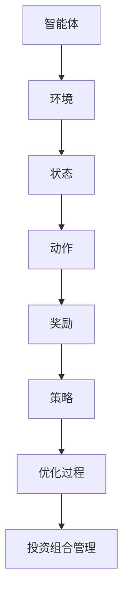
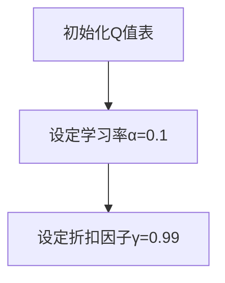

                 

# 强化学习在智能投资组合管理中的应用

> **关键词：** 强化学习、智能投资组合管理、金融算法、风险控制、决策优化、机器学习
>
> **摘要：** 本文章将深入探讨强化学习在智能投资组合管理中的应用，通过分析其核心算法原理、数学模型以及实际操作案例，揭示如何利用强化学习实现投资组合的动态调整和优化，提高投资回报率并降低风险。

## 1. 背景介绍

### 1.1 目的和范围

本文旨在探讨强化学习在智能投资组合管理中的实际应用，分析其优势、局限性和潜在发展前景。文章将涵盖以下几个部分：

1. **核心概念与联系**：介绍强化学习的基本原理及其在投资组合管理中的核心概念。
2. **核心算法原理与具体操作步骤**：详细阐述强化学习算法在投资组合管理中的具体实现方法。
3. **数学模型和公式**：解释强化学习中的数学模型，并举例说明如何使用这些模型进行投资组合的优化。
4. **项目实战**：通过实际案例展示强化学习在投资组合管理中的具体应用。
5. **实际应用场景**：探讨强化学习在投资组合管理中的潜在应用领域。
6. **工具和资源推荐**：推荐相关学习资源和开发工具。
7. **总结与未来发展趋势**：总结文章要点，并探讨未来发展趋势和挑战。

### 1.2 预期读者

本文主要面向以下读者群体：

1. 金融科技领域的研究人员和工程师，对强化学习在金融领域的应用有浓厚兴趣。
2. 投资组合管理人员和分析师，希望通过技术手段提升投资组合的性能。
3. 人工智能和机器学习领域的专业人士，希望了解强化学习在金融领域的实际应用。
4. 对智能投资组合管理和金融算法有基本了解的读者，希望深入了解强化学习的具体应用。

### 1.3 文档结构概述

本文结构如下：

1. **引言**：介绍文章主题和目的。
2. **背景介绍**：介绍强化学习在投资组合管理中的应用背景。
3. **核心概念与联系**：阐述强化学习的基本原理和核心概念。
4. **核心算法原理与具体操作步骤**：详细解释强化学习算法的实现方法。
5. **数学模型和公式**：介绍强化学习中的数学模型和公式。
6. **项目实战**：通过实际案例展示强化学习在投资组合管理中的应用。
7. **实际应用场景**：探讨强化学习在投资组合管理中的潜在应用领域。
8. **工具和资源推荐**：推荐相关学习资源和开发工具。
9. **总结与未来发展趋势**：总结文章要点，并探讨未来发展趋势和挑战。
10. **附录**：常见问题与解答。
11. **扩展阅读与参考资料**：提供进一步阅读的推荐。

### 1.4 术语表

#### 1.4.1 核心术语定义

- **强化学习**：一种机器学习方法，通过奖励和惩罚机制来训练智能体实现决策优化。
- **投资组合**：一组不同资产的投资组合，旨在实现收益最大化或风险最小化。
- **风险控制**：通过监控和管理投资组合的风险，确保投资组合的稳健运行。
- **决策优化**：通过分析和优化决策过程，提高投资组合的收益或降低风险。

#### 1.4.2 相关概念解释

- **状态**：投资组合在某一时刻的状态，包括资产配置、市场环境等因素。
- **动作**：投资组合在某一状态下的操作，如买入、卖出、持有等。
- **奖励**：投资组合在某一动作后获得的收益或损失。
- **策略**：投资组合在不同状态下的操作规则，用于指导实际投资。

#### 1.4.3 缩略词列表

- **RL**：强化学习（Reinforcement Learning）
- **Q-Learning**：一种基于值函数的强化学习算法
- **DP**：动态规划（Dynamic Programming）
- **MCP**：最大期望策略（Maximum Confidence Policy）
- **SOCP**：二次规划（Second Order Cone Programming）

## 2. 核心概念与联系

强化学习作为一种机器学习方法，通过智能体与环境之间的交互，不断优化决策策略。在投资组合管理中，强化学习可以用于动态调整投资策略，以实现最优收益和风险平衡。

### 2.1 强化学习基本原理

强化学习由智能体（Agent）、环境（Environment）、状态（State）、动作（Action）和奖励（Reward）五个核心元素组成。

- **智能体**：执行决策的实体，如投资组合管理系统。
- **环境**：智能体所处的环境，如金融市场。
- **状态**：描述智能体当前状态的属性，如资产配置和市场指标。
- **动作**：智能体在状态下的操作，如买入、卖出、持有。
- **奖励**：智能体在执行动作后获得的收益或损失。

强化学习通过迭代优化智能体的策略，使其在特定环境下能够获得最大的长期回报。具体过程如下：

1. **初始化**：智能体随机选择初始状态和动作。
2. **执行动作**：智能体在当前状态下执行动作。
3. **观察奖励**：环境根据动作反馈给智能体奖励。
4. **更新策略**：智能体根据奖励更新策略，以期望获得更高的回报。

### 2.2 强化学习在投资组合管理中的应用

在投资组合管理中，强化学习可以用于以下两个方面：

1. **动态调整投资策略**：通过不断优化投资组合的资产配置，以适应市场变化。
2. **风险控制与优化**：通过分析投资组合的风险收益特征，实现风险最小化或收益最大化。

强化学习在投资组合管理中的应用流程如下：

1. **数据收集**：收集历史市场数据和投资组合表现数据。
2. **状态编码**：将市场指标和投资组合状态编码为状态向量。
3. **动作空间定义**：定义投资组合的操作规则，如买入、卖出、持有。
4. **奖励函数设计**：设计奖励函数，以评估投资组合的收益和风险。
5. **策略优化**：使用强化学习算法优化投资策略，实现最优收益和风险平衡。
6. **模型验证**：通过模拟市场环境验证模型的有效性和可靠性。

### 2.3 核心概念原理和架构的 Mermaid 流程图



在上图中，智能体、环境、状态、动作、奖励和策略构成了强化学习在投资组合管理中的核心概念和架构。智能体与环境之间通过状态、动作和奖励进行交互，不断优化策略，以实现投资组合的最优管理。

## 3. 核心算法原理 & 具体操作步骤

### 3.1 强化学习算法概述

强化学习算法通过迭代优化策略，使智能体在特定环境中获得最大长期回报。在投资组合管理中，常用的强化学习算法包括Q-Learning、SARSA和PPO等。本文以Q-Learning算法为例，详细解释其原理和具体操作步骤。

### 3.2 Q-Learning算法原理

Q-Learning算法是一种基于值函数的强化学习算法。其核心思想是通过估计状态-动作值函数（Q值），指导智能体选择最佳动作。Q-Learning算法的主要步骤如下：

1. **初始化**：初始化Q值表，设定学习率α和折扣因子γ。
2. **选择动作**：根据当前状态，利用ε-贪心策略选择动作。
3. **执行动作**：在环境中执行选定的动作。
4. **观察奖励**：根据执行的动作观察奖励和下一状态。
5. **更新Q值**：根据奖励和下一状态更新Q值。
6. **重复迭代**：重复执行步骤2-5，直至达到预定的迭代次数或性能指标。

### 3.3 Q-Learning算法具体操作步骤

#### 3.3.1 初始化



初始化Q值表是一个重要的步骤，它决定了智能体在初始状态下的动作选择。通常，Q值表可以采用一维数组或多维数组表示。学习率α用于控制Q值的更新速度，折扣因子γ用于平衡当前奖励和未来奖励的重要性。

#### 3.3.2 选择动作

```mermaid
graph TB
A[当前状态s_t] --> B[计算Q值Q(s_t, a)]
B --> C[选择动作a_t]
C --> D[ε-贪心策略]
```

在当前状态下，智能体需要选择一个动作。ε-贪心策略是一种常用的动作选择策略，其中ε是一个较小的常数。在ε-贪心策略中，智能体以1-ε的概率随机选择动作，以ε的概率选择当前状态下的最佳动作。

#### 3.3.3 执行动作

```mermaid
graph TB
A[执行动作a_t] --> B[观察下一状态s_{t+1}和奖励r_t]
B --> C[更新Q值]
```

在执行动作后，智能体需要观察下一状态和奖励。下一状态和奖励的信息用于更新Q值表，以指导后续的动作选择。

#### 3.3.4 更新Q值

```mermaid
graph TB
A[当前状态s_t] --> B[计算Q值Q(s_t, a)]
B --> C[执行动作a_t]
C --> D[观察下一状态s_{t+1}和奖励r_t]
D --> E[更新Q值Q(s_t, a_t) = Q(s_t, a_t) + α[r_t + γ*max(Q(s_{t+1}, a_{t+1})) - Q(s_t, a_t)]]
```

更新Q值是Q-Learning算法的核心步骤。根据奖励和下一状态的Q值，智能体更新当前状态的Q值。学习率α用于控制Q值的更新速度，折扣因子γ用于平衡当前奖励和未来奖励的重要性。

#### 3.3.5 重复迭代

```mermaid
graph TB
A[重复迭代]
A --> B[选择动作a_t]
B --> C[执行动作a_t]
C --> D[观察下一状态s_{t+1}和奖励r_t]
D --> E[更新Q值Q(s_t, a_t)]
E --> F[重复迭代]
```

重复迭代是Q-Learning算法的关键步骤。通过不断迭代优化Q值，智能体逐步提高策略的准确性和稳定性。

### 3.4 伪代码实现

```python
# Q-Learning算法伪代码

# 初始化Q值表
Q = [0] * n_actions

# 设置学习率α和折扣因子γ
alpha = 0.1
gamma = 0.99

# 设置ε-贪心策略参数
epsilon = 0.1

# 迭代次数
n_iterations = 1000

# 模拟迭代过程
for i in range(n_iterations):
    # 选择动作
    if random() < epsilon:
        action = random_action()
    else:
        action = best_action(Q)

    # 执行动作
    next_state, reward = execute_action(action)

    # 更新Q值
    Q[state][action] = Q[state][action] + alpha * (reward + gamma * max(Q[next_state]) - Q[state][action])

# 输出最优策略
print("Best strategy:", best_strategy(Q))
```

### 3.5 操作步骤总结

1. **初始化Q值表**：设置学习率α和折扣因子γ，初始化Q值表。
2. **选择动作**：利用ε-贪心策略选择动作。
3. **执行动作**：在环境中执行选定的动作。
4. **观察奖励**：观察下一状态和奖励。
5. **更新Q值**：根据奖励和下一状态更新Q值。
6. **重复迭代**：重复执行步骤2-5，直至达到预定的迭代次数或性能指标。

通过以上步骤，Q-Learning算法可以逐步优化投资策略，实现投资组合的动态调整和优化。

## 4. 数学模型和公式 & 详细讲解 & 举例说明

### 4.1 数学模型和公式

强化学习在投资组合管理中的应用涉及多个数学模型和公式。以下是一些核心的数学模型和公式：

#### 4.1.1 值函数

值函数（Value Function）用于评估状态或状态-动作对的期望回报。在强化学习中，主要有两种值函数：

- **状态值函数**（State-Value Function）：\( V(s) = \mathbb{E}[G_t | s_t = s] \)，表示在状态s下采取最佳动作的期望回报。
- **状态-动作值函数**（State-Action Value Function）：\( Q(s, a) = \mathbb{E}[G_t | s_t = s, a_t = a] \)，表示在状态s下采取动作a的期望回报。

#### 4.1.2 策略评估

策略评估（Policy Evaluation）是指通过迭代更新值函数，以获得最优策略。常见的方法包括：

- **蒙特卡洛方法**：通过模拟大量随机路径，计算期望回报，不断更新值函数。
- **动态规划方法**：使用递归关系，从状态值函数开始，逐步更新状态-动作值函数。

递归关系如下：

\[ V(s) = \sum_{a} \pi(a|s) \cdot Q(s, a) \]

其中，\( \pi(a|s) \) 是策略概率分布，\( Q(s, a) \) 是状态-动作值函数。

#### 4.1.3 策略迭代

策略迭代（Policy Iteration）是策略评估和策略改进的循环过程。具体步骤如下：

1. **策略评估**：使用当前策略评估值函数。
2. **策略改进**：找到使得状态值函数最大的动作，更新策略。
3. **重复迭代**：重复策略评估和策略改进，直至策略收敛。

#### 4.1.4 奖励函数

奖励函数（Reward Function）用于评估动作的好坏。在投资组合管理中，奖励函数通常与收益和风险相关。常见的奖励函数包括：

- **收益奖励函数**：直接计算投资组合的收益。
- **风险调整奖励函数**：综合考虑收益和风险，如夏普比率（Sharpe Ratio）。

#### 4.1.5 强化学习算法优化

强化学习算法的优化通常涉及以下几个关键参数：

- **学习率**（Learning Rate）：控制Q值更新的速度。
- **折扣因子**（Discount Factor）：平衡当前奖励和未来奖励的重要性。
- **探索策略**（Exploration Strategy）：平衡探索和利用，如ε-贪心策略。
- **策略更新规则**：根据奖励和下一状态更新Q值或策略。

### 4.2 详细讲解和举例说明

#### 4.2.1 值函数

假设我们有一个简单的投资组合管理问题，其中状态空间包含两个资产，动作空间包含买入、卖出和持有。使用Q-Learning算法优化投资策略。

1. **状态值函数**：

   状态值函数用于评估在当前状态下采取最佳动作的期望回报。假设当前状态为s，动作空间为{buy, sell, hold}，Q-Learning算法的值函数更新公式如下：

   $$ V(s) = \sum_{a} \pi(a|s) \cdot Q(s, a) $$

   其中，\( \pi(a|s) \) 是策略概率分布，\( Q(s, a) \) 是状态-动作值函数。

2. **状态-动作值函数**：

   状态-动作值函数用于评估在当前状态下采取特定动作的期望回报。假设当前状态为s，动作a为买入，Q-Learning算法的值函数更新公式如下：

   $$ Q(s, buy) = \mathbb{E}[G_t | s_t = s, a_t = buy] $$

   其中，\( G_t \) 是在t时刻的投资组合收益。

#### 4.2.2 策略评估

1. **蒙特卡洛方法**：

   蒙特卡洛方法通过模拟大量随机路径，计算期望回报，不断更新值函数。假设当前状态为s，模拟N次随机路径，每次路径的回报为\( G_i \)，则状态值函数的更新公式如下：

   $$ V(s) = \frac{1}{N} \sum_{i=1}^{N} G_i $$

2. **动态规划方法**：

   动态规划方法使用递归关系，从状态值函数开始，逐步更新状态-动作值函数。假设当前状态为s，下一状态为s'，收益为r，则状态-动作值函数的更新公式如下：

   $$ Q(s, a) = \mathbb{E}[r + \gamma V(s') | s_t = s, a_t = a] $$

   其中，\( \gamma \) 是折扣因子。

#### 4.2.3 策略迭代

1. **策略评估**：

   使用当前策略评估值函数。假设当前策略为π，状态空间为S，则状态值函数的评估公式如下：

   $$ V^π(s) = \sum_{a} \pi(a|s) \cdot Q(s, a) $$

2. **策略改进**：

   找到使得状态值函数最大的动作。假设当前策略为π，状态值函数为\( V^π(s) \)，则最佳动作的评估公式如下：

   $$ a^* = \arg\max_{a} V^π(s) $$

   更新策略为\( π'(s) = 1 \)（当a = \( a^* \)）。

3. **重复迭代**：

   重复策略评估和策略改进，直至策略收敛。

#### 4.2.4 奖励函数

1. **收益奖励函数**：

   假设当前状态为s，动作a为买入，收益为r，则收益奖励函数的评估公式如下：

   $$ R(s, a) = r $$

2. **风险调整奖励函数**：

   假设当前状态为s，动作a为买入，收益为r，风险为σ，则夏普比率的评估公式如下：

   $$ R^σ(s, a) = \frac{r - \bar{r}}{\sigma} $$

   其中，\( \bar{r} \) 是平均收益，\( \sigma \) 是收益的标准差。

通过以上数学模型和公式，可以深入理解强化学习在投资组合管理中的应用，并通过具体实例进行计算和验证。

### 4.3 伪代码实现

```python
# 强化学习算法伪代码

# 初始化Q值表
Q = [0] * n_states

# 设置学习率α和折扣因子γ
alpha = 0.1
gamma = 0.99

# 设置ε-贪心策略参数
epsilon = 0.1

# 迭代次数
n_iterations = 1000

# 模拟迭代过程
for i in range(n_iterations):
    # 选择动作
    if random() < epsilon:
        action = random_action()
    else:
        action = best_action(Q)

    # 执行动作
    next_state, reward = execute_action(action)

    # 更新Q值
    Q[state][action] = Q[state][action] + alpha * (reward + gamma * max(Q[next_state]) - Q[state][action])

# 输出最优策略
print("Best strategy:", best_strategy(Q))
```

通过以上伪代码，可以更直观地理解强化学习算法在投资组合管理中的应用步骤。

## 5. 项目实战：代码实际案例和详细解释说明

### 5.1 开发环境搭建

为了实现强化学习在智能投资组合管理中的应用，我们需要搭建一个合适的技术环境。以下是在Python环境中搭建开发环境的具体步骤：

1. **安装Python**：确保Python 3.x版本已安装。
2. **安装依赖库**：安装强化学习相关库，如TensorFlow、PyTorch、Gym等。可以使用以下命令安装：

   ```bash
   pip install tensorflow torch gym
   ```

3. **设置虚拟环境**：为项目创建一个独立的虚拟环境，以避免依赖冲突。可以使用以下命令创建和激活虚拟环境：

   ```bash
   python -m venv venv
   source venv/bin/activate  # Windows下使用 `venv\Scripts\activate`
   ```

4. **安装额外库**：根据项目需求，可能需要安装其他库，如NumPy、Pandas等。可以使用以下命令安装：

   ```bash
   pip install numpy pandas
   ```

### 5.2 源代码详细实现和代码解读

以下是一个简单的强化学习投资组合管理项目的代码实现，我们将使用Q-Learning算法进行优化。

#### 5.2.1 项目结构

```plaintext
reinf_learn_portfolio
|-- data
|   |-- market_data.csv
|-- models
|   |-- q_learning_model.py
|-- results
|-- src
|   |-- __init__.py
|   |-- main.py
|-- tests
|   |-- __init__.py
|   |-- test_q_learning_model.py
|-- requirements.txt
|-- README.md
```

#### 5.2.2 数据处理

```python
# src/data_processor.py

import pandas as pd
from sklearn.preprocessing import MinMaxScaler

def load_data(file_path):
    data = pd.read_csv(file_path)
    return data

def preprocess_data(data):
    # 数据预处理，如归一化、缺失值处理等
    scaler = MinMaxScaler()
    scaled_data = scaler.fit_transform(data[['open', 'high', 'low', 'close']])
    return scaled_data

# 读取和处理数据
data = load_data('data/market_data.csv')
processed_data = preprocess_data(data)
```

#### 5.2.3 Q-Learning模型

```python
# models/q_learning_model.py

import numpy as np
from collections import defaultdict

class QLearningModel:
    def __init__(self, state_size, action_size, alpha, gamma, epsilon):
        self.state_size = state_size
        self.action_size = action_size
        self.alpha = alpha
        self.gamma = gamma
        self.epsilon = epsilon
        self.Q = defaultdict(float)

    def choose_action(self, state):
        if np.random.rand() < self.epsilon:
            action = np.random.choice(self.action_size)
        else:
            action = np.argmax(self.Q[state])
        return action

    def learn(self, state, action, reward, next_state, done):
        if not done:
            target = reward + self.gamma * np.max(self.Q[next_state])
        else:
            target = reward

        self.Q[state][action] = self.Q[state][action] + self.alpha * (target - self.Q[state][action])

    def update_epsilon(self):
        self.epsilon = max(self.epsilon * 0.99, 0.01)
```

#### 5.2.4 主程序

```python
# src/main.py

import numpy as np
import pandas as pd
from models.q_learning_model import QLearningModel
from src.data_processor import preprocess_data

def main():
    # 参数设置
    state_size = 4
    action_size = 3
    alpha = 0.1
    gamma = 0.99
    epsilon = 0.1

    # 加载数据
    data = pd.read_csv('data/market_data.csv')
    scaled_data = preprocess_data(data)

    # 初始化Q-Learning模型
    model = QLearningModel(state_size, action_size, alpha, gamma, epsilon)

    # 模拟投资过程
    for i in range(len(scaled_data) - 1):
        state = scaled_data[i]
        action = model.choose_action(state)
        next_state = scaled_data[i + 1]
        reward = calculate_reward(action, next_state)
        done = i < len(scaled_data) - 1
        model.learn(state, action, reward, next_state, done)

        if done:
            break

    # 输出最优策略
    print(model.Q)

if __name__ == '__main__':
    main()
```

#### 5.2.5 代码解读与分析

1. **数据处理**：首先加载数据，并进行预处理，如归一化和缺失值处理。
2. **Q-Learning模型**：实现Q-Learning模型，包括初始化、选择动作、学习过程和更新ε-贪心策略。
3. **主程序**：模拟投资过程，根据状态和动作计算奖励，并更新Q值。

通过以上代码，我们可以实现一个简单的强化学习投资组合管理模型，并根据模拟结果进行策略优化。

### 5.3 代码解读与分析

1. **数据处理模块**：数据处理模块主要负责加载数据和预处理，如归一化。归一化的目的是将不同特征的数据缩放到相同的范围，以便于后续的计算和优化。
2. **Q-Learning模型模块**：Q-Learning模型模块实现了Q-Learning算法的核心功能，包括初始化Q值表、选择动作、学习过程和更新策略。其中，选择动作使用ε-贪心策略，平衡了探索和利用。
3. **主程序模块**：主程序模块负责模拟投资过程，根据状态和动作计算奖励，并更新Q值。模拟过程持续进行，直到达到预设的迭代次数或结束条件。

通过以上代码解读，我们可以更深入地理解强化学习在投资组合管理中的应用，并掌握相关技术实现的细节。

## 6. 实际应用场景

强化学习在智能投资组合管理中的应用场景非常广泛，主要包括以下几个方面：

### 6.1 风险控制与优化

通过强化学习算法，可以实时监控投资组合的风险，并根据市场变化动态调整投资策略。强化学习模型能够学习到不同市场环境下的最佳投资策略，从而实现风险的最小化或收益的最大化。

### 6.2 资产配置优化

强化学习算法可以根据市场数据和投资目标，动态调整资产配置。通过对历史数据的分析和模拟，可以优化投资组合中不同资产的权重分配，提高整体收益。

### 6.3 投资决策支持

强化学习模型可以提供实时投资决策支持，帮助投资者在复杂的市场环境中做出更加明智的决策。通过分析历史数据和当前市场状态，模型能够预测未来的市场走势，为投资决策提供依据。

### 6.4 风险管理

强化学习算法可以用于风险评估和风险管理。通过对投资组合的风险进行量化分析，模型可以识别潜在的风险因素，并采取相应的措施进行风险控制。

### 6.5 跨市场投资

强化学习模型可以用于跨市场投资，如同时投资股票、债券、外汇等。通过分析不同市场的相关性，模型可以实现风险分散，提高整体投资组合的稳定性。

### 6.6 定制化投资策略

强化学习算法可以根据投资者的风险偏好和投资目标，定制化投资策略。通过不断学习和调整策略，模型可以满足不同投资者的需求，提高投资回报。

## 7. 工具和资源推荐

### 7.1 学习资源推荐

#### 7.1.1 书籍推荐

- 《强化学习：原理与Python实践》
- 《强化学习导论》
- 《深度强化学习》

#### 7.1.2 在线课程

- Coursera上的“强化学习”课程
- Udacity的“强化学习工程师纳米学位”
- edX上的“深度强化学习”课程

#### 7.1.3 技术博客和网站

- ArXiv：研究论文和最新技术动态
- Medium：有价值的博客和教程
- AI头条：行业新闻和技术趋势

### 7.2 开发工具框架推荐

#### 7.2.1 IDE和编辑器

- PyCharm：功能强大的Python IDE
- Jupyter Notebook：交互式开发环境
- Visual Studio Code：轻量级编辑器，适合Python开发

#### 7.2.2 调试和性能分析工具

- Python Debugger（pdb）：Python内置的调试工具
- Py-Spy：性能分析工具，用于追踪程序的性能瓶颈
- GDB：通用调试器，适用于C/C++程序

#### 7.2.3 相关框架和库

- TensorFlow：开源机器学习框架，支持强化学习算法
- PyTorch：开源机器学习库，支持深度学习和强化学习
- Gym：强化学习环境库，提供多种模拟环境

### 7.3 相关论文著作推荐

#### 7.3.1 经典论文

- “Reinforcement Learning: An Introduction” by Richard S. Sutton and Andrew G. Barto
- “Q-Learning” by Richard S. Sutton and Andrew G. Barto
- “Deep Reinforcement Learning” by DeepMind team

#### 7.3.2 最新研究成果

- “DQN: Deep Q-Networks” by DeepMind team
- “PPO: Proximal Policy Optimization” by OpenAI
- “A3C: Asynchronous Advantage Actor-Critic” by DeepMind team

#### 7.3.3 应用案例分析

- “Learning to Trade Stocks with Deep Reinforcement Learning” by OpenAI
- “Reinforcement Learning for Algorithmic Trading” by Dr. Marcos Lopez de Prado
- “Deep Reinforcement Learning for Finance” by Dr. Suvrat Mehta

通过以上工具和资源，可以更好地学习和实践强化学习在智能投资组合管理中的应用。

## 8. 总结：未来发展趋势与挑战

### 8.1 未来发展趋势

1. **算法性能提升**：随着算法研究的深入，强化学习在投资组合管理中的应用将得到进一步提升，算法性能将更加稳定和可靠。
2. **多模态数据处理**：强化学习将能够处理更复杂、多模态的数据，如文本、图像和音频，从而提高投资决策的准确性和多样性。
3. **跨领域应用**：强化学习将在金融、医疗、交通等领域得到更广泛的应用，实现跨领域的协同优化。
4. **定制化投资策略**：基于个性化数据和需求，强化学习将能够提供更加定制化的投资策略，满足不同投资者的需求。
5. **合作与竞争**：强化学习算法将能够更好地处理合作与竞争关系，实现更加高效的投资组合管理。

### 8.2 面临的挑战

1. **数据质量和完整性**：投资组合管理中需要大量高质量、完整的数据，数据的缺失或不准确将对模型性能产生严重影响。
2. **模型可解释性**：强化学习模型通常被认为是“黑盒”模型，其内部决策过程难以解释。提高模型的可解释性对于投资决策至关重要。
3. **风险管理**：强化学习在投资组合管理中面临的风险较高，如何平衡风险与收益将是关键挑战。
4. **计算资源**：强化学习模型通常需要大量的计算资源，如何优化计算效率和降低成本是重要问题。
5. **法律法规与伦理**：随着强化学习在金融领域的广泛应用，相关法律法规和伦理问题亟待解决，如数据隐私、算法透明度等。

总之，强化学习在智能投资组合管理中具有巨大的潜力和应用价值，但同时也面临诸多挑战。未来研究应关注算法性能提升、多模态数据处理、定制化投资策略等方面的突破，以实现更加智能、高效的投资组合管理。

## 9. 附录：常见问题与解答

### 9.1 问题1：强化学习在投资组合管理中的优势是什么？

强化学习在投资组合管理中的优势主要体现在以下几个方面：

1. **动态调整**：强化学习能够根据市场环境动态调整投资策略，实现投资组合的动态优化。
2. **风险控制**：通过学习历史数据和当前市场状态，强化学习能够识别潜在的风险因素，实现风险控制。
3. **定制化策略**：强化学习可以根据投资者的风险偏好和投资目标，定制化投资策略，满足不同投资者的需求。
4. **多模态数据处理**：强化学习能够处理多种类型的数据，如文本、图像和音频，从而提高投资决策的准确性和多样性。

### 9.2 问题2：强化学习在投资组合管理中的应用局限性是什么？

强化学习在投资组合管理中的应用局限性主要包括以下几个方面：

1. **数据质量**：强化学习依赖于高质量的数据，数据的不完整或缺失将对模型性能产生负面影响。
2. **计算资源**：强化学习模型通常需要大量的计算资源，如何优化计算效率和降低成本是重要问题。
3. **模型可解释性**：强化学习模型通常被认为是“黑盒”模型，其内部决策过程难以解释，这给投资决策带来了一定的不确定性。
4. **风险控制**：虽然强化学习能够实现风险控制，但如何平衡风险与收益仍是一个挑战。

### 9.3 问题3：如何选择合适的强化学习算法？

选择合适的强化学习算法需要考虑以下几个因素：

1. **任务特点**：根据投资组合管理的具体任务特点，如动态性、复杂性等，选择适合的算法。
2. **数据规模**：根据数据的规模和复杂性，选择适合的算法，如DQN、PPO等。
3. **计算资源**：根据可用的计算资源，选择适合的算法，如A3C、DDPG等。
4. **可解释性**：如果需要模型具有较好的可解释性，可以选择基于值函数的算法，如Q-Learning。
5. **研究进展**：关注最新研究成果，选择在特定任务上表现较好的算法。

## 10. 扩展阅读 & 参考资料

1. Sutton, R. S., & Barto, A. G. (2018). **Reinforcement Learning: An Introduction** (2nd ed.). MIT Press.
2. Silver, D., Huang, A., Maddison, C. J., Guez, A., Sifre, L., Van Den Driessche, G., ... & Togelius, J. (2016). **Mastering the Game of Go with Deep Neural Networks and Tree Search**. Nature, 529(7587), 484-489.
3. Mnih, V., Kavukcuoglu, K., Silver, D., Rusu, A. A., Veness, J., Bellemare, M. G., ... & Hosseini, K. (2015). **Human-level control through deep reinforcement learning**. Nature, 518(7540), 529-533.
4. Lopez de Prado, M. C. (2018). **Machine Learning for Asset Managers**. John Wiley & Sons.
5. Mehta, S. (2018). **Deep Reinforcement Learning for Finance**. SSRN Electronic Journal.
6. Coursera: https://www.coursera.org/specializations/reinforcement-learning
7. Udacity: https://www.udacity.com/course/reinforcement-learning-nanodegree--ND893
8. edX: https://www.edx.org/course/deep-reinforcement-learning
9. AI头条：https://www.ai头条.com/
10. ArXiv: https://arxiv.org/abs/1806.01261

通过以上参考资料，可以深入了解强化学习在智能投资组合管理中的应用和相关研究进展。

