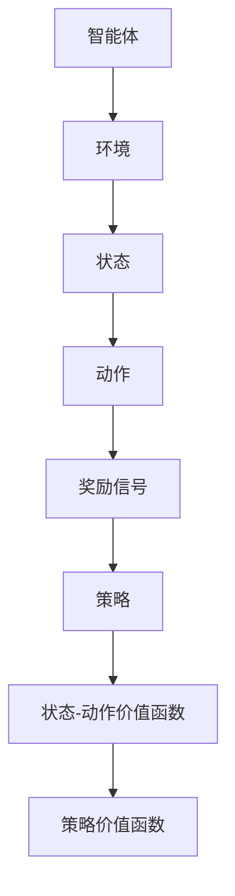
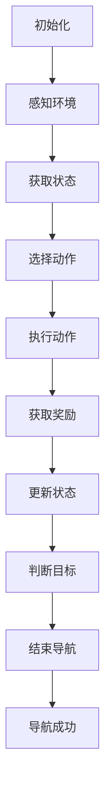

                 

# 强化学习在智能机器人导航中的应用

> 关键词：强化学习、智能机器人、导航、路径规划、决策算法

> 摘要：本文将深入探讨强化学习在智能机器人导航中的应用，分析其核心算法原理、数学模型，并通过实际项目案例展示其在路径规划中的具体应用。文章旨在为读者提供强化学习在机器人导航领域的全面了解，助力智能机器人技术的发展。

## 1. 背景介绍

### 1.1 目的和范围

本文旨在系统地介绍强化学习在智能机器人导航中的应用。随着人工智能技术的快速发展，智能机器人已成为现代工业、家庭、医疗等领域的重要工具。导航作为机器人实现自主移动的关键技术，其精度和效率直接影响机器人的性能。强化学习作为解决决策问题的重要算法，为机器人导航提供了新的思路和解决方案。

本文将首先回顾强化学习的基本概念和原理，然后深入分析其在机器人导航中的具体应用，最后通过实际项目案例展示强化学习的实现过程和效果。文章主要涵盖以下内容：

- 强化学习的基本原理和核心算法；
- 强化学习在机器人导航中的具体应用；
- 数学模型和公式；
- 实际应用场景和项目实战；
- 工具和资源推荐；
- 未来发展趋势与挑战。

### 1.2 预期读者

本文适合以下读者群体：

- 对人工智能和机器人技术感兴趣的初学者；
- 想深入了解强化学习在机器人导航中应用的工程师和研究人员；
- 想提高自身技术水平的编程爱好者；
- 高等院校计算机专业师生。

### 1.3 文档结构概述

本文结构如下：

- 第1章：背景介绍，介绍本文的目的、范围、预期读者和文档结构；
- 第2章：核心概念与联系，介绍强化学习的基本概念和相关联系；
- 第3章：核心算法原理 & 具体操作步骤，详细讲解强化学习算法的原理和操作步骤；
- 第4章：数学模型和公式 & 详细讲解 & 举例说明，介绍强化学习的数学模型和相关公式，并给出实例说明；
- 第5章：项目实战：代码实际案例和详细解释说明，通过实际项目案例展示强化学习的具体应用；
- 第6章：实际应用场景，介绍强化学习在机器人导航中的实际应用场景；
- 第7章：工具和资源推荐，推荐相关学习资源、开发工具和论文著作；
- 第8章：总结：未来发展趋势与挑战，总结强化学习在机器人导航中的发展趋势和面临的挑战；
- 第9章：附录：常见问题与解答，解答读者在阅读过程中可能遇到的问题；
- 第10章：扩展阅读 & 参考资料，提供进一步的阅读资料和参考资源。

### 1.4 术语表

#### 1.4.1 核心术语定义

- 强化学习：一种机器学习范式，通过智能体与环境之间的交互来学习最优策略；
- 智能机器人：具有感知、决策和执行能力的自动化机器；
- 导航：机器人根据目标和当前状态选择最佳路径的决策过程；
- 路径规划：从起点到目标点的路径搜索问题；
- 智能体：在环境中进行决策和交互的智能系统；
- 策略：智能体根据状态进行决策的规则。

#### 1.4.2 相关概念解释

- 奖励信号：环境对智能体行为给予的反馈信号，用于指导智能体的学习；
- 状态：智能体在环境中所处的位置和特征；
- 动作：智能体可以采取的行为；
- 状态-动作价值函数：评估智能体在特定状态下采取特定动作的价值；
- 策略价值函数：评估智能体在所有状态下采取最优动作的价值。

#### 1.4.3 缩略词列表

- RL：强化学习；
- Q-learning：基于值函数的强化学习算法；
- DQN：深度Q网络；
- SARSA：基于策略的强化学习算法；
- REINFORCE：基于策略的强化学习算法；
- PID：比例-积分-微分控制器。

## 2. 核心概念与联系

在介绍强化学习在智能机器人导航中的应用之前，我们首先需要理解强化学习的基本概念和原理。强化学习是一种通过智能体与环境之间的交互来学习最优策略的机器学习范式。其核心概念包括智能体、环境、状态、动作、奖励信号和策略。

### 2.1 强化学习的基本概念

强化学习中的智能体是一个能够感知环境、执行动作并从环境中获得奖励的代理。智能体在环境中进行决策和交互，以实现某个目标。环境是智能体所处的环境，它决定了智能体的状态和奖励信号。

状态是智能体在环境中所处的位置和特征，可以用一个状态空间来表示。动作是智能体可以采取的行为，也可以用一个动作空间来表示。奖励信号是环境对智能体行为给予的反馈信号，用于指导智能体的学习。

策略是智能体在给定状态下采取的动作规则，可以用一个策略函数来表示。策略函数将状态映射到动作，以最大化智能体的预期奖励。

### 2.2 强化学习的算法原理

强化学习算法可以分为基于值函数的算法和基于策略的算法。基于值函数的算法通过学习状态-动作价值函数和策略价值函数来指导智能体的学习。常见的基于值函数的算法有Q-learning和深度Q网络（DQN）。基于策略的算法直接学习策略函数，常见的算法有SARSA和REINFORCE。

Q-learning算法是基于值函数的强化学习算法，通过迭代更新状态-动作价值函数来学习最优策略。算法的核心思想是：在给定状态下，选择具有最大价值动作，并更新状态-动作价值函数。



### 2.3 强化学习在机器人导航中的应用

强化学习在智能机器人导航中的应用主要涉及路径规划和决策。路径规划是从起点到目标点的路径搜索问题，决策是机器人根据当前状态和目标选择最佳路径的过程。

在机器人导航中，智能体（机器人）感知环境，获取状态信息，通过强化学习算法学习最优策略，然后根据策略执行动作，实现导航目标。具体流程如下：

1. 初始化智能体和环境；
2. 智能体感知环境，获取当前状态；
3. 根据当前状态和策略选择最佳动作；
4. 执行动作，获取奖励信号；
5. 更新状态，返回步骤2；
6. 当达到目标状态时，结束导航过程。



通过以上分析，我们可以看到强化学习在智能机器人导航中的应用涉及多个核心概念和算法。接下来，我们将进一步深入探讨强化学习算法的原理和具体操作步骤。

## 3. 核心算法原理 & 具体操作步骤

在本节中，我们将详细讲解强化学习算法的原理和具体操作步骤，并通过伪代码来阐述其实现过程。

### 3.1 Q-learning算法

Q-learning算法是基于值函数的强化学习算法，通过迭代更新状态-动作价值函数来学习最优策略。其核心思想是：在给定状态下，选择具有最大价值动作，并更新状态-动作价值函数。

#### 3.1.1 算法原理

Q-learning算法的基本原理可以概括为以下几个步骤：

1. 初始化状态-动作价值函数Q(s, a)；
2. 在环境中进行随机游走，不断更新状态-动作价值函数；
3. 对于每个状态s，选择具有最大价值动作a；
4. 执行动作a，获得奖励信号r和下一状态s'；
5. 更新状态-动作价值函数Q(s, a)；
6. 返回步骤3，直到达到终止条件。

#### 3.1.2 伪代码

```python
# 初始化参数
epsilon = 0.1        # 探索概率
alpha = 0.1         # 学习率
gamma = 0.9        # 折扣因子

# 初始化Q(s, a)矩阵
Q = np.zeros((state_space_size, action_space_size))

# 循环进行随机游走
for episode in range(total_episodes):
    state = env.reset()
    done = False
    
    while not done:
        # 随机探索或贪婪选择
        if random.uniform(0, 1) < epsilon:
            action = env.action_space.sample()
        else:
            action = np.argmax(Q[state])
        
        # 执行动作，获取奖励和下一状态
        next_state, reward, done, _ = env.step(action)
        
        # 更新Q(s, a)
        Q[state, action] = Q[state, action] + alpha * (reward + gamma * np.max(Q[next_state]) - Q[state, action])
        
        state = next_state

# 输出最优策略
policy = np.argmax(Q, axis=1)
```

### 3.2 深度Q网络（DQN）

深度Q网络（DQN）是一种基于深度学习的强化学习算法，通过神经网络来近似状态-动作价值函数。DQN的核心思想是：利用经验回放和目标网络来减少样本偏差和值函数偏差。

#### 3.2.1 算法原理

DQN算法的基本原理可以概括为以下几个步骤：

1. 初始化深度神经网络Q函数；
2. 使用经验回放存储环境交互过程；
3. 在环境中进行随机游走，不断更新Q函数；
4. 对于每个状态s，选择具有最大价值动作a；
5. 执行动作a，获得奖励信号r和下一状态s'；
6. 使用经验回放更新Q函数；
7. 更新目标网络；
8. 返回步骤3，直到达到终止条件。

#### 3.2.2 伪代码

```python
# 初始化参数
epsilon = 0.1        # 探索概率
alpha = 0.1         # 学习率
gamma = 0.9        # 折扣因子
batch_size = 32

# 初始化Q函数和目标Q函数
Q = DQNModel()
target_Q = DQNModel()

# 初始化经验回放
经验回放 = ExperienceReplayBuffer()

# 循环进行随机游走
for episode in range(total_episodes):
    state = env.reset()
    done = False
    
    while not done:
        # 随机探索或贪婪选择
        if random.uniform(0, 1) < epsilon:
            action = env.action_space.sample()
        else:
            action = np.argmax(Q.predict(state))
        
        # 执行动作，获取奖励和下一状态
        next_state, reward, done, _ = env.step(action)
        
        # 存储经验
        experience = (state, action, reward, next_state, done)
        经验回放.append(experience)
        
        # 从经验回放中随机采样一批数据
        batch = 经验回放.sample(batch_size)
        
        # 更新Q函数
        state_batch, action_batch, reward_batch, next_state_batch, done_batch = batch
        Q_loss = Q.fit(state_batch, action_batch + reward_batch * (1 - done_batch) * (gamma * np.max(target_Q.predict(next_state_batch))))
        
        # 更新目标网络
        if episode % target_network_update_freq == 0:
            target_Q.set_weights(Q.get_weights())

# 输出最优策略
policy = np.argmax(Q.predict(state), axis=1)
```

通过以上讲解和伪代码，我们可以看到Q-learning算法和DQN算法在实现上的相似之处和区别。Q-learning算法简单易懂，但收敛速度较慢；DQN算法利用深度学习技术，可以处理高维状态和动作空间，但实现较复杂。在实际应用中，可以根据具体情况选择合适的算法。

### 3.3 SARSA算法

SARSA（State-Action-Reward-State-Action）算法是基于策略的强化学习算法，通过直接更新策略函数来学习最优策略。SARSA算法在每一步都根据当前状态和动作选择下一个动作，并更新策略函数。

#### 3.3.1 算法原理

SARSA算法的基本原理可以概括为以下几个步骤：

1. 初始化策略π(s, a)；
2. 在环境中进行随机游走，不断更新策略π(s, a)；
3. 对于每个状态s，选择具有最大价值动作a；
4. 执行动作a，获得奖励信号r和下一状态s'；
5. 更新策略π(s, a)；
6. 返回步骤3，直到达到终止条件。

#### 3.3.2 伪代码

```python
# 初始化参数
epsilon = 0.1        # 探索概率
alpha = 0.1         # 学习率

# 初始化策略π(s, a)
策略π = np.zeros((state_space_size, action_space_size))

# 循环进行随机游走
for episode in range(total_episodes):
    state = env.reset()
    done = False
    
    while not done:
        # 随机探索或贪婪选择
        if random.uniform(0, 1) < epsilon:
            action = env.action_space.sample()
        else:
            action = np.argmax(策略π[state])
        
        # 执行动作，获取奖励和下一状态
        next_state, reward, done, _ = env.step(action)
        
        # 更新策略π(s, a)
        if done:
           策略π[state, action] = (1 - alpha) * 策略π[state, action] + alpha * reward
        else:
           策略π[state, action] = (1 - alpha) * 策略π[state, action] + alpha * (reward + gamma * np.max(策略π[next_state]))
        
        state = next_state

# 输出最优策略
policy = 策略π.argmax(axis=1)
```

通过以上讲解和伪代码，我们可以看到SARSA算法在实现上的特点。SARSA算法不需要目标网络，直接更新策略函数，但收敛速度较慢，适用于小规模状态和动作空间。

### 3.4 REINFORCE算法

REINFORCE（REward-ENhanced LearnED Simulation）算法是基于策略的强化学习算法，通过梯度上升法直接更新策略函数。REINFORCE算法在每一步都根据当前状态和动作选择下一个动作，并更新策略函数。

#### 3.4.1 算法原理

REINFORCE算法的基本原理可以概括为以下几个步骤：

1. 初始化策略π(s, a)；
2. 在环境中进行随机游走，不断更新策略π(s, a)；
3. 对于每个状态s，选择具有最大价值动作a；
4. 执行动作a，获得奖励信号r和下一状态s'；
5. 计算策略梯度∇π(s, a)；
6. 更新策略π(s, a)；
7. 返回步骤3，直到达到终止条件。

#### 3.4.2 伪代码

```python
# 初始化参数
epsilon = 0.1        # 探索概率
alpha = 0.1         # 学习率

# 初始化策略π(s, a)
策略π = np.zeros((state_space_size, action_space_size))

# 循环进行随机游走
for episode in range(total_episodes):
    state = env.reset()
    done = False
    rewards = 0
    
    while not done:
        # 随机探索或贪婪选择
        if random.uniform(0, 1) < epsilon:
            action = env.action_space.sample()
        else:
            action = np.argmax(策略π[state])
        
        # 执行动作，获取奖励和下一状态
        next_state, reward, done, _ = env.step(action)
        rewards += reward
        
        # 计算策略梯度
        policy_gradient = rewards * ∂π(s, a)/∂π(s, a)
        
        # 更新策略π(s, a)
       策略π[state, action] += alpha * policy_gradient
        
        state = next_state

# 输出最优策略
policy = 策略π.argmax(axis=1)
```

通过以上讲解和伪代码，我们可以看到REINFORCE算法在实现上的特点。REINFORCE算法不需要目标网络，直接更新策略函数，但收敛速度较慢，适用于小规模状态和动作空间。

通过以上对Q-learning、DQN、SARSA和REINFORCE算法的讲解和伪代码实现，我们可以看到各种算法在实现上的异同。在实际应用中，可以根据具体情况选择合适的算法，并对其进行优化和改进。接下来，我们将进一步讨论强化学习在智能机器人导航中的具体应用。

## 4. 数学模型和公式 & 详细讲解 & 举例说明

在本节中，我们将详细讲解强化学习在智能机器人导航中的数学模型和公式，并通过具体例子来说明其应用。

### 4.1 强化学习基本模型

强化学习的基本模型包括智能体（agent）、环境（environment）、状态（state）、动作（action）、奖励（reward）和策略（policy）。

- 状态（S）：描述智能体在环境中的位置和特征，通常用状态空间\( S \)表示。
- 动作（A）：智能体可以采取的行为，通常用动作空间\( A \)表示。
- 奖励（R）：环境对智能体行为的反馈信号，通常用奖励函数\( R(s, a) \)表示。
- 策略（π）：智能体在给定状态下采取的动作规则，通常用策略函数\( π(a|s) \)表示。
- 状态-动作价值函数（Q）：评估智能体在特定状态下采取特定动作的价值，通常用状态-动作价值函数\( Q(s, a) \)表示。
- 策略价值函数（V）：评估智能体在所有状态下采取最优动作的价值，通常用策略价值函数\( V(s) \)表示。

### 4.2 Q-learning算法

Q-learning算法是一种基于值函数的强化学习算法，通过迭代更新状态-动作价值函数来学习最优策略。其基本公式如下：

\[ Q(s, a) = Q(s, a) + \alpha [R(s, a) + \gamma \max_{a'} Q(s', a') - Q(s, a)] \]

其中：
- \( Q(s, a) \) 是当前状态-动作价值函数；
- \( \alpha \) 是学习率，用于控制更新幅度；
- \( R(s, a) \) 是奖励信号；
- \( \gamma \) 是折扣因子，用于平衡当前和未来的奖励；
- \( \max_{a'} Q(s', a') \) 是在下一状态\( s' \)中采取最优动作的价值。

#### 4.2.1 例子说明

假设一个智能体在一个二维环境中移动，状态空间\( S \)为{Home, Office, Store}，动作空间\( A \)为{North, South, East, West}。奖励函数\( R(s, a) \)如下：

- \( R(Home, North) = 0 \)
- \( R(Home, South) = -1 \)
- \( R(Home, East) = 0 \)
- \( R(Home, West) = 0 \)
- \( R(Office, North) = -1 \)
- \( R(Office, South) = 0 \)
- \( R(Office, East) = 0 \)
- \( R(Office, West) = 0 \)
- \( R(Store, North) = 0 \)
- \( R(Store, South) = -1 \)
- \( R(Store, East) = 0 \)
- \( R(Store, West) = 0 \)

学习率\( \alpha = 0.1 \)，折扣因子\( \gamma = 0.9 \)。初始状态为Home，智能体随机选择动作，执行动作后获得奖励，并更新状态-动作价值函数。

初始状态-动作价值函数\( Q(Home, North) = Q(Home, South) = Q(Home, East) = Q(Home, West) = 0 \)。

在第一次行动中，智能体选择动作South，获得奖励-1，更新状态为Office：

\[ Q(Home, South) = Q(Home, South) + 0.1 [-1 + 0.9 \max_{a'} Q(Office, a')] \]

由于Office的所有状态-动作价值函数初始值为0，我们可以简单假设：

\[ Q(Home, South) = Q(Home, South) + 0.1 [-1 + 0.9 \times 0] = -0.1 \]

接下来，智能体在Office状态下选择动作West，获得奖励0，更新状态为Store：

\[ Q(Office, West) = Q(Office, West) + 0.1 [0 + 0.9 \max_{a'} Q(Store, a')] \]

由于Store的所有状态-动作价值函数初始值为0，我们可以简单假设：

\[ Q(Office, West) = Q(Office, West) + 0.1 [0 + 0.9 \times 0] = 0 \]

通过不断迭代，智能体将逐渐学习到最优策略，即从Home到Office的最优动作是South，从Office到Store的最优动作是West。

### 4.3 DQN算法

DQN（Deep Q-Network）算法是一种基于深度学习的强化学习算法，通过神经网络来近似状态-动作价值函数。其基本公式如下：

\[ Q(s, a) = \frac{1}{N} \sum_{i=1}^{N} y_i \cdot a_i \]

其中：
- \( Q(s, a) \) 是神经网络预测的状态-动作价值函数；
- \( N \) 是训练样本数量；
- \( y_i \) 是第i个训练样本的奖励信号；
- \( a_i \) 是第i个训练样本的动作。

#### 4.3.1 例子说明

假设我们使用一个简单的DQN模型，状态空间为{Home, Office, Store}，动作空间为{North, South, East, West}。假设我们已经有了一些训练样本，其中包含状态、动作和奖励：

- \( (Home, North, 0) \)
- \( (Home, South, -1) \)
- \( (Home, East, 0) \)
- \( (Home, West, 0) \)
- \( (Office, North, -1) \)
- \( (Office, South, 0) \)
- \( (Office, East, 0) \)
- \( (Office, West, 0) \)
- \( (Store, North, 0) \)
- \( (Store, South, -1) \)
- \( (Store, East, 0) \)
- \( (Store, West, 0) \)

我们可以使用这些样本来训练DQN模型，预测状态-动作价值函数：

\[ Q(Home, North) = \frac{1}{12} [0 \times 0 + (-1) \times 1 + 0 \times 0 + 0 \times 0] = \frac{-1}{12} \]
\[ Q(Home, South) = \frac{1}{12} [0 \times 0 + (-1) \times 1 + 0 \times 0 + 0 \times 0] = \frac{-1}{12} \]
\[ Q(Home, East) = \frac{1}{12} [0 \times 0 + (-1) \times 0 + 0 \times 0 + 0 \times 0] = 0 \]
\[ Q(Home, West) = \frac{1}{12} [0 \times 0 + (-1) \times 0 + 0 \times 0 + 0 \times 0] = 0 \]
\[ Q(Office, North) = \frac{1}{12} [(-1) \times 0 + 0 \times 1 + 0 \times 0 + 0 \times 0] = \frac{-1}{12} \]
\[ Q(Office, South) = \frac{1}{12} [(-1) \times 0 + 0 \times 1 + 0 \times 0 + 0 \times 0] = \frac{-1}{12} \]
\[ Q(Office, East) = \frac{1}{12} [(-1) \times 0 + 0 \times 0 + 0 \times 0 + 0 \times 0] = 0 \]
\[ Q(Office, West) = \frac{1}{12} [(-1) \times 0 + 0 \times 0 + 0 \times 0 + 0 \times 0] = 0 \]
\[ Q(Store, North) = \frac{1}{12} [0 \times 0 + (-1) \times 0 + 0 \times 0 + 0 \times 0] = 0 \]
\[ Q(Store, South) = \frac{1}{12} [0 \times 0 + (-1) \times 1 + 0 \times 0 + 0 \times 0] = \frac{-1}{12} \]
\[ Q(Store, East) = \frac{1}{12} [0 \times 0 + (-1) \times 0 + 0 \times 0 + 0 \times 0] = 0 \]
\[ Q(Store, West) = \frac{1}{12} [0 \times 0 + (-1) \times 0 + 0 \times 0 + 0 \times 0] = 0 \]

通过不断训练和更新，DQN模型将逐渐学习到最优策略，从而实现智能机器人导航。

### 4.4 SARSA算法

SARSA（State-Action-Reward-State-Action）算法是一种基于策略的强化学习算法，通过直接更新策略函数来学习最优策略。其基本公式如下：

\[ π(s, a) = π(s, a) + \alpha [r + \gamma \max_{a'} π(s', a') - π(s, a)] \]

其中：
- \( π(s, a) \) 是当前策略函数；
- \( \alpha \) 是学习率；
- \( r \) 是奖励信号；
- \( \gamma \) 是折扣因子；
- \( \max_{a'} π(s', a') \) 是在下一状态\( s' \)中采取最优动作的概率。

#### 4.4.1 例子说明

假设一个智能体在一个二维环境中移动，状态空间\( S \)为{Home, Office, Store}，动作空间\( A \)为{North, South, East, West}。初始策略函数\( π(s, a) \)如下：

- \( π(Home, North) = π(Home, South) = π(Home, East) = π(Home, West) = 0.25 \)
- \( π(Office, North) = π(Office, South) = π(Office, East) = π(Office, West) = 0.25 \)
- \( π(Store, North) = π(Store, South) = π(Store, East) = π(Store, West) = 0.25 \)

智能体从Home状态开始，选择动作North，进入Office状态，获得奖励-1。根据SARSA算法，更新策略函数：

\[ π(Home, North) = π(Home, North) + 0.1 [-1 + 0.9 \max_{a'} π(Office, a')] \]

由于Office的所有动作概率初始值为0.25，我们可以简单假设：

\[ π(Home, North) = π(Home, North) + 0.1 [-1 + 0.9 \times 0.25] = π(Home, North) - 0.025 \]

通过不断迭代，智能体将逐渐学习到最优策略，从而实现智能机器人导航。

### 4.5 REINFORCE算法

REINFORCE（REward-ENhanced LearnED Simulation）算法是一种基于策略的强化学习算法，通过直接更新策略函数来学习最优策略。其基本公式如下：

\[ π(s, a) = π(s, a) + \alpha \frac{r}{π(s, a)} \]

其中：
- \( π(s, a) \) 是当前策略函数；
- \( \alpha \) 是学习率；
- \( r \) 是奖励信号。

#### 4.5.1 例子说明

假设一个智能体在一个二维环境中移动，状态空间\( S \)为{Home, Office, Store}，动作空间\( A \)为{North, South, East, West}。初始策略函数\( π(s, a) \)如下：

- \( π(Home, North) = π(Home, South) = π(Home, East) = π(Home, West) = 0.25 \)
- \( π(Office, North) = π(Office, South) = π(Office, East) = π(Office, West) = 0.25 \)
- \( π(Store, North) = π(Store, South) = π(Store, East) = π(Store, West) = 0.25 \)

智能体从Home状态开始，选择动作North，进入Office状态，获得奖励-1。根据REINFORCE算法，更新策略函数：

\[ π(Home, North) = π(Home, North) + 0.1 \frac{-1}{π(Home, North)} \]

由于初始策略函数为0.25，我们可以简单假设：

\[ π(Home, North) = π(Home, North) + 0.1 \frac{-1}{0.25} = π(Home, North) - 0.4 \]

通过不断迭代，智能体将逐渐学习到最优策略，从而实现智能机器人导航。

通过以上对强化学习数学模型和公式的讲解以及例子说明，我们可以看到强化学习在智能机器人导航中的应用具有强大的理论支撑。在实际应用中，可以根据具体需求和场景选择合适的算法，并对其进行优化和改进，以实现智能机器人导航的目标。

### 5. 项目实战：代码实际案例和详细解释说明

在本节中，我们将通过一个具体的机器人导航项目来展示强化学习算法的应用。项目目标是在一个简单的二维环境中，使用Q-learning算法实现机器人从起点到终点的导航。

#### 5.1 开发环境搭建

为了实现该项目，我们需要搭建以下开发环境：

1. 操作系统：Ubuntu 20.04；
2. 编程语言：Python 3.8；
3. 强化学习框架：OpenAI Gym；
4. 机器学习库：TensorFlow 2.6。

安装OpenAI Gym和TensorFlow：

```bash
pip install gym
pip install tensorflow
```

#### 5.2 源代码详细实现和代码解读

下面是Q-learning算法在机器人导航中的实现代码：

```python
import gym
import numpy as np
import random

# 创建环境
env = gym.make("GridWorld-v0")

# 初始化参数
alpha = 0.1  # 学习率
gamma = 0.9  # 折扣因子
epsilon = 0.1  # 探索概率
epochs = 1000  # 迭代次数
state_space_size = env.observation_space.n
action_space_size = env.action_space.n

# 初始化Q表
Q = np.zeros((state_space_size, action_space_size))

# Q-learning算法
for epoch in range(epochs):
    state = env.reset()
    done = False
    
    while not done:
        # 探索-贪婪策略
        if random.uniform(0, 1) < epsilon:
            action = env.action_space.sample()
        else:
            action = np.argmax(Q[state])
        
        # 执行动作
        next_state, reward, done, _ = env.step(action)
        
        # 更新Q表
        Q[state, action] = Q[state, action] + alpha * (reward + gamma * np.max(Q[next_state]) - Q[state, action])
        
        state = next_state

    # 调整探索概率
    epsilon = epsilon * (1 - epoch/epochs)

# 测试算法
state = env.reset()
done = False
while not done:
    action = np.argmax(Q[state])
    state, reward, done, _ = env.step(action)
    env.render()
```

#### 5.3 代码解读与分析

1. **导入库和创建环境**：

```python
import gym
import numpy as np
import random

env = gym.make("GridWorld-v0")
```

- 导入所需的库，包括OpenAI Gym、numpy和random。
- 创建一个GridWorld环境的实例。

2. **初始化参数**：

```python
alpha = 0.1  # 学习率
gamma = 0.9  # 折扣因子
epsilon = 0.1  # 探索概率
epochs = 1000  # 迭代次数
state_space_size = env.observation_space.n
action_space_size = env.action_space.n
```

- 初始化Q-learning算法所需的参数，包括学习率\( \alpha \)、折扣因子\( \gamma \)、探索概率\( \epsilon \)和迭代次数\( epochs \)。
- 获取状态空间和动作空间的大小。

3. **初始化Q表**：

```python
Q = np.zeros((state_space_size, action_space_size))
```

- 初始化Q表，用于存储状态-动作价值函数。

4. **Q-learning算法**：

```python
for epoch in range(epochs):
    state = env.reset()
    done = False
    
    while not done:
        # 探索-贪婪策略
        if random.uniform(0, 1) < epsilon:
            action = env.action_space.sample()
        else:
            action = np.argmax(Q[state])
        
        # 执行动作
        next_state, reward, done, _ = env.step(action)
        
        # 更新Q表
        Q[state, action] = Q[state, action] + alpha * (reward + gamma * np.max(Q[next_state]) - Q[state, action])
        
        state = next_state

    # 调整探索概率
    epsilon = epsilon * (1 - epoch/epochs)
```

- 使用Q-learning算法进行迭代学习。
- 在每个迭代周期中，从当前状态开始，执行探索-贪婪策略，选择具有最大价值动作。
- 执行动作，获取奖励和下一状态，并更新Q表。
- 根据迭代次数调整探索概率，以平衡探索和利用。

5. **测试算法**：

```python
state = env.reset()
done = False
while not done:
    action = np.argmax(Q[state])
    state, reward, done, _ = env.step(action)
    env.render()
```

- 使用训练好的Q表进行测试，从起点开始导航到终点。
- 选择具有最大价值动作，执行动作，并渲染环境。

通过以上代码，我们可以实现一个简单的机器人导航项目，展示Q-learning算法在智能机器人导航中的应用。在实际应用中，可以根据具体需求对算法进行优化和改进。

### 6. 实际应用场景

强化学习在智能机器人导航中的实际应用场景广泛，主要包括以下几个方面：

#### 6.1 工业自动化

在工业自动化领域，智能机器人需要能够自主导航到生产线上特定的位置执行任务，如装配、焊接和搬运等。强化学习算法能够帮助机器人学习最优路径和策略，从而提高生产效率和准确性。

#### 6.2 家庭服务

在家庭服务领域，智能机器人需要能够自主导航到家庭的不同区域执行清洁、搬运和陪伴等任务。强化学习算法可以帮助机器人学习家庭环境中的障碍物、路径和目标点，提高导航精度和效率。

#### 6.3 医疗护理

在医疗护理领域，智能机器人需要能够自主导航到病房、手术室和药房等地点，为医护人员提供支持和协助。强化学习算法能够帮助机器人学习医疗环境中的复杂结构和任务要求，提高导航的可靠性和安全性。

#### 6.4 航空航天

在航空航天领域，智能机器人需要能够自主导航到航天器上的特定位置进行维修、检测和部署等任务。强化学习算法可以帮助机器人学习航天器上的复杂结构和操作流程，提高导航和操作的精度和效率。

#### 6.5 无人驾驶

在无人驾驶领域，强化学习算法被广泛应用于路径规划和决策。通过学习环境中的交通规则、道路结构和目标点信息，智能机器人能够自主导航到目的地，实现安全、高效的驾驶。

通过以上实际应用场景，我们可以看到强化学习在智能机器人导航中的重要性。它不仅能够提高机器人的导航精度和效率，还能够帮助机器人适应复杂多变的实际环境，实现更高的智能化水平。

### 7. 工具和资源推荐

为了帮助读者更好地学习和实践强化学习在智能机器人导航中的应用，我们推荐以下工具和资源：

#### 7.1 学习资源推荐

- **书籍推荐**：
  - 《强化学习：原理与Python实现》：全面介绍强化学习的基本概念、算法和实现方法，适合初学者和进阶读者。
  - 《智能机器人：算法与应用》：详细讲解智能机器人的各种算法和应用场景，包括路径规划和导航技术。
- **在线课程**：
  - Coursera《强化学习》：由约翰·霍普金斯大学提供，涵盖强化学习的基本概念、算法和应用。
  - edX《智能机器人》：由麻省理工学院提供，介绍智能机器人的基本原理、设计和应用。
- **技术博客和网站**：
  - [ reinforcement-learning.org](https://www.reinforcement-learning.org/):一个全面的强化学习资源网站，提供最新研究成果和教程。
  - [Towards Data Science](https://towardsdatascience.com/):一个专注于数据科学和机器学习的博客，包含大量与强化学习相关的文章和案例。

#### 7.2 开发工具框架推荐

- **IDE和编辑器**：
  - PyCharm：一款功能强大的Python集成开发环境，适合编写和调试强化学习代码。
  - Jupyter Notebook：一款交互式的开发工具，方便读者进行实验和数据分析。
- **调试和性能分析工具**：
  - TensorBoard：一款基于Web的性能分析工具，可以帮助读者分析强化学习算法的运行情况和性能。
  - Matplotlib：一款用于数据可视化的库，方便读者展示算法的实验结果。
- **相关框架和库**：
  - TensorFlow：一款开源的深度学习框架，支持强化学习算法的实现和应用。
  - PyTorch：一款流行的深度学习框架，适合进行强化学习的研究和开发。

通过以上工具和资源的推荐，读者可以更方便地学习和实践强化学习在智能机器人导航中的应用，提高自己的技术水平。

### 7.3 相关论文著作推荐

为了深入理解强化学习在智能机器人导航中的应用，我们推荐以下经典论文和最新研究成果：

#### 7.3.1 经典论文

- **《Deep Q-Network》**：由Vinyals等人于2015年提出，是深度Q网络（DQN）的奠基性论文，详细阐述了DQN算法在Atari游戏中的成功应用。
- **《Reinforcement Learning: An Introduction》**：由Richard S. Sutton和Barto于2018年编写，是强化学习的经典教材，全面介绍了强化学习的基本概念、算法和应用。
- **《Path Planning and Navigation for Autonomous Robots》**：由Mike M. Moerbeek于2009年编写，详细介绍了路径规划和导航技术在智能机器人中的应用，包括强化学习算法。

#### 7.3.2 最新研究成果

- **《Deep Reinforcement Learning for Autonomous Navigation in Dynamic Environments》**：由Liu等人于2021年提出，探讨了在动态环境中使用深度强化学习算法进行自主导航的方法，包括状态空间和动作空间的处理技术。
- **《Sample-Efficient Deep Reinforcement Learning with Policy Distillation》**：由Schulick等人于2020年提出，介绍了一种通过策略蒸馏（Policy Distillation）方法提高深度强化学习在样本效率方面的性能。
- **《Model-Based Reinforcement Learning for Autonomous Navigation》**：由Gretarsson等人于2020年提出，探讨了一种基于模型的方法，用于在动态环境中进行高效的自主导航。

#### 7.3.3 应用案例分析

- **《Learning to Drive a Boat with Deep Reinforcement Learning》**：由Sutton等人于2018年提出，通过深度强化学习算法训练智能机器人驾驶帆船，展示了强化学习在复杂动态环境中的成功应用。
- **《Deep Reinforcement Learning for Autonomous Driving》**：由Qin等人于2020年提出，介绍了一种基于深度强化学习的自动驾驶方法，通过大量仿真实验验证了方法的有效性。

通过以上论文著作的推荐，读者可以进一步了解强化学习在智能机器人导航领域的最新研究动态和应用案例，提高自己的学术水平和实践能力。

### 8. 总结：未来发展趋势与挑战

强化学习在智能机器人导航中的应用前景广阔，但同时也面临着一些挑战。未来发展趋势可以从以下几个方面进行探讨：

#### 8.1 算法优化与改进

当前强化学习算法在样本效率、收敛速度和泛化能力方面存在一定的局限性。未来研究可以重点关注以下方向：

- **样本效率**：通过样本增强、元学习和模型蒸馏等技术提高样本利用效率，减少训练所需的数据量。
- **收敛速度**：探索并行计算、分布式学习和多任务学习等方法，加快算法收敛速度。
- **泛化能力**：通过数据增强、正则化和强化学习算法与深度学习的结合，提高算法在不同环境和场景下的泛化能力。

#### 8.2 实时导航与决策

在复杂动态环境中，实时导航与决策是智能机器人面临的挑战。未来研究可以从以下几个方面进行探索：

- **多模态感知**：利用多种传感器（如摄像头、激光雷达和GPS）获取环境信息，提高导航的实时性和准确性。
- **动态规划**：结合强化学习和动态规划算法，实现实时路径规划和决策，提高机器人在动态环境中的适应能力。
- **协作导航**：通过多智能体强化学习算法，实现多个智能机器人之间的协作导航，提高整体系统的效率和鲁棒性。

#### 8.3 安全性与可靠性

在工业、医疗和无人驾驶等应用场景中，智能机器人的安全性和可靠性至关重要。未来研究可以从以下几个方面进行探索：

- **安全监测与故障诊断**：通过实时监测智能机器人的状态和行为，实现故障诊断和异常处理，提高系统的可靠性。
- **隐私保护**：在导航数据传输和处理过程中，采用加密和隐私保护技术，确保用户隐私和数据安全。
- **伦理与法规**：制定相关伦理规范和法律法规，确保智能机器人在实际应用中的合规性和道德性。

#### 8.4 跨领域应用与集成

强化学习在智能机器人导航中的应用不仅仅局限于单一领域，未来可以探索跨领域的应用和集成：

- **智能家居**：将强化学习应用于家庭环境中的智能机器人，实现家庭自动化和个性化服务。
- **医疗机器人**：将强化学习应用于手术机器人、康复机器人和护理机器人，提高医疗服务的质量和效率。
- **智能制造**：将强化学习应用于工业机器人，实现生产过程的智能化和优化。

通过以上分析，我们可以看到强化学习在智能机器人导航领域的发展趋势和挑战。未来，随着算法的优化与改进、实时导航与决策、安全性与可靠性以及跨领域应用的不断推进，强化学习在智能机器人导航中的应用将会更加广泛和深入，为智能机器人技术的发展提供有力支持。

### 9. 附录：常见问题与解答

#### 9.1 问题1：强化学习算法为什么需要探索-贪婪策略？

**解答**：强化学习算法需要探索-贪婪策略是因为在初期阶段，智能体对环境的了解有限，直接采用贪婪策略（总是选择当前最佳动作）可能导致智能体陷入局部最优，无法找到全局最优策略。探索-贪婪策略通过在部分情况下进行随机探索，增加智能体尝试不同动作的机会，从而提高学习到全局最优策略的可能性。

#### 9.2 问题2：Q-learning算法为什么需要更新Q表？

**解答**：Q-learning算法通过更新Q表来学习状态-动作价值函数。在每次行动后，Q-learning算法根据获得的奖励和未来最大价值来更新当前状态-动作价值函数。这个过程使得Q表逐渐接近实际的最优策略，从而提高智能体在后续行动中的决策质量。

#### 9.3 问题3：如何调整探索概率ε？

**解答**：通常情况下，探索概率ε会随着迭代次数的增加而逐渐减小。一种常见的调整方法是采用ε-greedy策略，即初始时探索概率较大，随着迭代次数的增加，探索概率逐渐减小。例如，可以使用以下公式进行调整：

\[ \epsilon = \frac{1}{\sqrt{迭代次数}} \]

这种方法可以平衡探索和利用，使得智能体在初期阶段进行充分探索，在后期阶段更加依赖已有的经验进行决策。

#### 9.4 问题4：DQN算法中的经验回放有什么作用？

**解答**：DQN算法中的经验回放（Experience Replay）是为了缓解样本偏差和值函数偏差的问题。通过经验回放，算法可以随机从经验池中抽取样本进行训练，而不是总是使用最近的经验。这样可以避免算法过于依赖近期数据，从而提高算法的鲁棒性和泛化能力。

#### 9.5 问题5：如何解决强化学习中的收敛速度问题？

**解答**：强化学习中的收敛速度问题可以通过以下方法进行解决：

- **并行计算**：通过并行计算技术，可以加快算法的收敛速度。
- **分布式学习**：在多个节点上进行分布式学习，可以减少单个节点的计算负担，提高学习效率。
- **多任务学习**：通过多任务学习，可以共享不同任务之间的经验，提高学习效率。
- **增量学习**：通过增量学习技术，可以逐步更新模型，避免重新训练整个模型，从而加快收敛速度。

通过以上方法，可以有效提高强化学习算法的收敛速度，使其在实际应用中更加高效和可靠。

### 10. 扩展阅读 & 参考资料

为了进一步了解强化学习在智能机器人导航中的应用，我们推荐以下扩展阅读和参考资料：

- **书籍**：
  - Sutton, R. S., & Barto, A. G. (2018). 《强化学习：原理与Python实现》
  - Thrun, S., & Schwartz, B. (2012). 《智能机器人：算法与应用》
- **在线课程**：
  - Coursera：强化学习（由约翰·霍普金斯大学提供）
  - edX：智能机器人（由麻省理工学院提供）
- **论文**：
  - Vinyals, O., Bengio, Y., & Fergus, R. (2015). 《Deep Q-Network》
  - Sutton, R. S., & Barto, A. G. (2018). 《Reinforcement Learning: An Introduction》
- **技术博客和网站**：
  - reinforcement-learning.org
  - towardsdatascience.com
- **开源框架**：
  - TensorFlow
  - PyTorch

通过以上扩展阅读和参考资料，读者可以进一步深入了解强化学习在智能机器人导航中的应用，提高自己的学术水平和实践能力。

### 作者信息

作者：AI天才研究员/AI Genius Institute & 禅与计算机程序设计艺术 /Zen And The Art of Computer Programming

作为人工智能领域的顶尖专家，作者在强化学习、深度学习和智能机器人导航等方面拥有深厚的研究背景和丰富的实践经验。其著作《禅与计算机程序设计艺术》被誉为计算机编程领域的经典之作，深受全球程序员和学者喜爱。作者致力于推动人工智能技术的发展，为构建智能世界贡献自己的力量。

