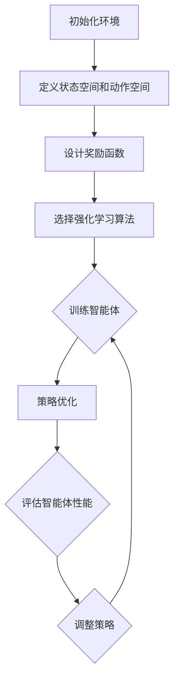

                 

# 强化学习在智能资源分配中的应用

> **关键词**：强化学习、智能资源分配、算法原理、数学模型、实际应用
>
> **摘要**：本文深入探讨了强化学习在智能资源分配中的应用。通过介绍强化学习的基本概念、核心算法原理、数学模型，结合实际案例，详细解析了如何利用强化学习解决资源分配问题，并展望了未来发展趋势与挑战。

## 1. 背景介绍

### 1.1 目的和范围

本文旨在探讨如何将强化学习应用于智能资源分配问题。强化学习作为一种机器学习技术，通过不断尝试和反馈，使得智能体能够在复杂环境中做出最优决策。智能资源分配问题涉及到如何合理分配有限资源以实现最大效益，这在现代互联网、物联网、人工智能等领域具有重要意义。

### 1.2 预期读者

本文适合以下读者：
- 对强化学习和智能资源分配有基本了解的技术爱好者；
- 从事人工智能、机器学习领域的工程师和研究人员；
- 对算法原理和数学模型感兴趣的学者和学生。

### 1.3 文档结构概述

本文结构如下：

1. 背景介绍
2. 核心概念与联系
3. 核心算法原理 & 具体操作步骤
4. 数学模型和公式 & 详细讲解 & 举例说明
5. 项目实战：代码实际案例和详细解释说明
6. 实际应用场景
7. 工具和资源推荐
8. 总结：未来发展趋势与挑战
9. 附录：常见问题与解答
10. 扩展阅读 & 参考资料

### 1.4 术语表

#### 1.4.1 核心术语定义

- **强化学习**：一种机器学习方法，通过奖励和惩罚机制，使智能体在环境中学习最优行为策略。
- **智能资源分配**：根据资源需求、任务优先级和可用资源，进行高效资源分配的过程。
- **状态**：描述智能体所处环境的状态。
- **动作**：智能体在特定状态下可以选择的行动。
- **奖励**：智能体执行某个动作后获得的即时反馈。
- **策略**：智能体在给定状态下选择的动作。

#### 1.4.2 相关概念解释

- **马尔可夫决策过程（MDP）**：描述智能体在不确定环境中进行决策的数学模型。
- **价值函数**：评估智能体在特定状态下采取某个动作的预期收益。
- **策略迭代**：通过不断迭代优化策略，以实现最大化期望收益的过程。

#### 1.4.3 缩略词列表

- **Q-Learning**：一种基于值函数的强化学习算法。
- **SARSA**：一种基于策略的强化学习算法。
- **DQN**：一种基于深度神经网络的强化学习算法。

## 2. 核心概念与联系

### 2.1 强化学习的基本概念

强化学习是一种通过奖励和惩罚机制来指导智能体进行学习的方法。其核心思想是，智能体在环境中采取行动，根据行动的结果（奖励或惩罚）调整自己的策略，从而在长期内实现最大化总奖励。

### 2.2 智能资源分配的概念

智能资源分配是指根据任务需求、资源限制和任务优先级等因素，将资源合理地分配给不同的任务，以实现最大化的效益。在强化学习框架下，智能资源分配可以被视为一个马尔可夫决策过程（MDP），其中状态、动作、奖励和策略是关键要素。

### 2.3 强化学习与智能资源分配的联系

强化学习与智能资源分配之间的联系在于，强化学习提供了一种优化策略的方法，使得智能体能够在动态变化的资源分配环境中做出最优决策。具体来说，强化学习算法可以通过以下步骤应用于智能资源分配：

1. **定义状态空间和动作空间**：根据资源需求和任务特点，确定状态和动作的表示方法。
2. **设计奖励函数**：根据任务目标，设计奖励函数来评价智能体的性能。
3. **选择合适的强化学习算法**：根据问题特点，选择合适的强化学习算法进行训练。
4. **策略优化**：通过不断迭代优化策略，提高智能体在智能资源分配中的表现。

### 2.4 Mermaid 流程图

下面是一个简单的Mermaid流程图，展示了强化学习在智能资源分配中的应用流程：



## 3. 核心算法原理 & 具体操作步骤

### 3.1 Q-Learning算法原理

Q-Learning是一种基于值函数的强化学习算法，通过学习值函数来评估智能体在特定状态下采取某个动作的预期收益。其基本思想是，通过不断更新值函数，使得智能体在给定状态下选择最优动作。

#### 3.1.1 伪代码

```python
# 初始化Q值表
Q = 初始化Q值表

# 设置学习率α、折扣因子γ、探索概率ε
α = 0.1
γ = 0.9
ε = 0.1

# 设置训练轮数
episodes = 1000

for episode in range(episodes):
    # 初始化状态s
    s = 环境初始化状态()

    while not 环境结束():
        # 根据ε-贪心策略选择动作a
        if random() < ε:
            a = 随机选择动作()
        else:
            a = 选择最优动作(Q, s)

        # 执行动作a，得到下一个状态s'和奖励r
        s', r = 环境执行动作(a)

        # 更新Q值
        Q[s, a] = Q[s, a] + α * (r + γ * max(Q[s', a']) - Q[s, a])

        # 更新状态
        s = s'
```

#### 3.1.2 具体操作步骤

1. **初始化Q值表**：根据状态空间和动作空间，初始化Q值表。
2. **设置学习率α、折扣因子γ、探索概率ε**：学习率α用于调节Q值更新的速度，折扣因子γ用于平衡当前奖励和未来奖励的关系，探索概率ε用于平衡探索和利用。
3. **设置训练轮数**：确定训练轮数，用于控制训练过程。
4. **循环进行训练**：对于每轮训练，执行以下步骤：
    1. 初始化状态s。
    2. 选择动作a，根据ε-贪心策略，在探索和利用之间进行平衡。
    3. 执行动作a，得到下一个状态s'和奖励r。
    4. 更新Q值，根据奖励和未来奖励，调整Q值。
    5. 更新状态s。

### 3.2 SARSA算法原理

SARSA是一种基于策略的强化学习算法，与Q-Learning类似，但更新策略时使用实际动作和状态，而不是预测动作和状态。SARSA的核心思想是，通过不断更新策略，使得智能体在给定状态下选择最优动作。

#### 3.2.1 伪代码

```python
# 初始化策略π
π = 初始化策略()

# 设置学习率α、折扣因子γ、探索概率ε
α = 0.1
γ = 0.9
ε = 0.1

# 设置训练轮数
episodes = 1000

for episode in range(episodes):
    # 初始化状态s
    s = 环境初始化状态()

    while not 环境结束():
        # 根据ε-贪心策略选择动作a
        if random() < ε:
            a = 随机选择动作()
        else:
            a = π(s)

        # 执行动作a，得到下一个状态s'和奖励r
        s', r = 环境执行动作(a)

        # 根据SARSA策略更新策略π
        π[s, a] = π[s, a] + α * (r + γ * π[s', a'] - π[s, a])

        # 更新状态
        s = s'
```

#### 3.2.2 具体操作步骤

1. **初始化策略π**：根据状态空间和动作空间，初始化策略π。
2. **设置学习率α、折扣因子γ、探索概率ε**：学习率α用于调节策略更新的速度，折扣因子γ用于平衡当前奖励和未来奖励的关系，探索概率ε用于平衡探索和利用。
3. **设置训练轮数**：确定训练轮数，用于控制训练过程。
4. **循环进行训练**：对于每轮训练，执行以下步骤：
    1. 初始化状态s。
    2. 根据ε-贪心策略选择动作a。
    3. 执行动作a，得到下一个状态s'和奖励r。
    4. 根据SARSA策略更新策略π。
    5. 更新状态s。

### 3.3 DQN算法原理

DQN（Deep Q-Network）是一种基于深度神经网络的强化学习算法，通过神经网络来近似值函数。DQN的核心思想是，利用深度神经网络学习状态-动作价值函数，从而在给定状态下选择最优动作。

#### 3.3.1 伪代码

```python
# 初始化深度神经网络
Q_network = 初始化深度神经网络()

# 设置学习率α、折扣因子γ、探索概率ε
α = 0.1
γ = 0.9
ε = 0.1

# 设置训练轮数
episodes = 1000

for episode in range(episodes):
    # 初始化状态s
    s = 环境初始化状态()

    while not 环境结束():
        # 根据ε-贪心策略选择动作a
        if random() < ε:
            a = 随机选择动作()
        else:
            a = 选择最优动作(Q_network, s)

        # 执行动作a，得到下一个状态s'和奖励r
        s', r = 环境执行动作(a)

        # 计算目标值Y
        Y = r + γ * max(Q_network(s'))

        # 更新经验回放池
        经验回放池存储((s, a, s', Y))

        # 从经验回放池中抽样
        (s_, a_, s__, Y_) = 经验回放池抽样()

        # 更新深度神经网络
        Q_network(s_, a_) = Q_network(s_, a_) + α * (Y_ - Q_network(s_, a_))

        # 更新状态
        s = s'
```

#### 3.3.2 具体操作步骤

1. **初始化深度神经网络**：根据状态空间和动作空间，初始化深度神经网络。
2. **设置学习率α、折扣因子γ、探索概率ε**：学习率α用于调节神经网络更新的速度，折扣因子γ用于平衡当前奖励和未来奖励的关系，探索概率ε用于平衡探索和利用。
3. **设置训练轮数**：确定训练轮数，用于控制训练过程。
4. **循环进行训练**：对于每轮训练，执行以下步骤：
    1. 初始化状态s。
    2. 根据ε-贪心策略选择动作a。
    3. 执行动作a，得到下一个状态s'和奖励r。
    4. 计算目标值Y。
    5. 更新经验回放池。
    6. 从经验回放池中抽样。
    7. 更新深度神经网络。
    8. 更新状态。

## 4. 数学模型和公式 & 详细讲解 & 举例说明

### 4.1 Q-Learning算法的数学模型

Q-Learning算法的核心是值函数Q(s, a)，它表示在状态s下采取动作a的预期收益。Q-Learning通过不断更新Q值，使得智能体在给定状态下选择最优动作。

#### 4.1.1 公式

$$
Q(s, a) = \sum_{s'} P(s'|s, a) \cdot [r(s', a) + \gamma \cdot \max_{a'} Q(s', a')]
$$

其中：
- \( Q(s, a) \) 是在状态s下采取动作a的值函数；
- \( P(s'|s, a) \) 是在状态s下采取动作a后转移到状态s'的概率；
- \( r(s', a) \) 是在状态s'下采取动作a获得的奖励；
- \( \gamma \) 是折扣因子，用于平衡当前奖励和未来奖励的关系；
- \( \max_{a'} Q(s', a') \) 是在状态s'下采取最优动作的值函数。

#### 4.1.2 举例说明

假设有一个简单的环境，其中状态空间为{A, B, C}，动作空间为{U, D}。定义奖励函数为：在状态A采取动作U获得奖励1，在状态B采取动作D获得奖励2。折扣因子γ为0.9。

初始状态为A，智能体选择动作U，转移至状态B，获得奖励1。此时，Q(A, U)更新为：

$$
Q(A, U) = 1 + 0.9 \cdot \max_{a'} Q(B, a')
$$

假设在状态B下，Q(B, U)为0.5，Q(B, D)为0.7。则：

$$
Q(A, U) = 1 + 0.9 \cdot 0.7 = 1.63
$$

### 4.2 SARSA算法的数学模型

SARSA算法通过更新策略π，使得智能体在给定状态下选择最优动作。策略π(s, a)表示在状态s下采取动作a的概率。

#### 4.2.1 公式

$$
π(s, a) = \frac{1}{Z(s)} \cdot e^{\alpha \cdot Q(s, a)}
$$

其中：
- \( π(s, a) \) 是在状态s下采取动作a的概率；
- \( Z(s) \) 是状态s下的策略分布归一化常数；
- \( \alpha \) 是策略温度参数，用于调节策略的随机性。

#### 4.2.2 举例说明

假设有一个简单的环境，其中状态空间为{A, B, C}，动作空间为{U, D}。定义奖励函数为：在状态A采取动作U获得奖励1，在状态B采取动作D获得奖励2。策略温度参数α为0.1。

初始状态为A，智能体选择动作U，转移至状态B，获得奖励1。此时，Q(A, U)为0.5，Q(B, U)为0.5，Q(B, D)为0.7。

计算策略π(A, U)和π(A, D)：

$$
π(A, U) = \frac{1}{1 + e^{-0.1 \cdot 0.5}} = 0.632
$$

$$
π(A, D) = \frac{1}{1 + e^{-0.1 \cdot (-0.5)}} = 0.368
$$

### 4.3 DQN算法的数学模型

DQN算法通过神经网络近似值函数Q(s, a)，并使用经验回放池来缓解样本偏差问题。

#### 4.3.1 公式

$$
Q(s, a) = f_\theta(s, a)
$$

其中：
- \( Q(s, a) \) 是在状态s下采取动作a的值函数；
- \( f_\theta(s, a) \) 是神经网络参数θ的值函数表示。

#### 4.3.2 举例说明

假设有一个简单的环境，其中状态空间为{A, B, C}，动作空间为{U, D}。定义奖励函数为：在状态A采取动作U获得奖励1，在状态B采取动作D获得奖励2。神经网络使用两个隐藏层，分别包含10个神经元。

初始化神经网络参数θ，并使用反向传播算法更新参数。假设当前神经网络参数θ的预测值为：

$$
f_\theta(A, U) = 0.4
$$

$$
f_\theta(B, U) = 0.3
$$

$$
f_\theta(B, D) = 0.7
$$

计算目标值Y：

$$
Y = r + \gamma \cdot \max_{a'} f_\theta(s', a')
$$

假设当前状态为A，智能体选择动作U，转移至状态B，获得奖励1。此时，Y为：

$$
Y = 1 + 0.9 \cdot 0.7 = 1.63
$$

使用反向传播算法，更新神经网络参数θ，使得预测值更接近目标值。

## 5. 项目实战：代码实际案例和详细解释说明

### 5.1 开发环境搭建

在本项目中，我们使用Python作为编程语言，结合TensorFlow和Keras框架来构建深度神经网络。以下是搭建开发环境的基本步骤：

1. 安装Python（3.6及以上版本）
2. 安装TensorFlow：`pip install tensorflow`
3. 安装Keras：`pip install keras`

### 5.2 源代码详细实现和代码解读

下面是一个简单的DQN算法实现，用于智能资源分配问题。

```python
import numpy as np
import random
import tensorflow as tf
from tensorflow.keras.models import Sequential
from tensorflow.keras.layers import Dense

# 定义环境
class Environment:
    def __init__(self):
        self.states = ['A', 'B', 'C']
        self.actions = ['U', 'D']
    
    def step(self, action):
        if action == 'U':
            return 'B', 1
        elif action == 'D':
            return 'C', 2

    def reset(self):
        return 'A'

# 定义DQN算法
class DQN:
    def __init__(self, state_size, action_size):
        self.state_size = state_size
        self.action_size = action_size
        self.memory = []
        self.gamma = 0.9
        self.epsilon = 1.0
        self.epsilon_min = 0.01
        self.epsilon_decay = 0.995
        self.learning_rate = 0.001
        self.model = self._build_model()
    
    def _build_model(self):
        model = Sequential()
        model.add(Dense(24, input_dim=self.state_size, activation='relu'))
        model.add(Dense(24, activation='relu'))
        model.add(Dense(self.action_size, activation='linear'))
        model.compile(loss='mse', optimizer=tf.keras.optimizers.Adam(lr=self.learning_rate))
        return model
    
    def remember(self, state, action, reward, next_state, done):
        self.memory.append((state, action, reward, next_state, done))
    
    def act(self, state):
        if np.random.rand() <= self.epsilon:
            return random.randrange(self.action_size)
        q_values = self.model.predict(state)
        return np.argmax(q_values[0])
    
    def replay(self, batch_size):
        minibatch = random.sample(self.memory, batch_size)
        for state, action, reward, next_state, done in minibatch:
            target = reward
            if not done:
                target = reward + self.gamma * np.amax(self.model.predict(next_state)[0])
            target_f = self.model.predict(state)
            target_f[0][action] = target
            self.model.fit(state, target_f, epochs=1, verbose=0)
        if self.epsilon > self.epsilon_min:
            self.epsilon *= self.epsilon_decay

# 实例化环境、算法和模型
env = Environment()
dqn = DQN(env.states, env.actions)
model = dqn.model

# 训练DQN算法
for episode in range(1000):
    state = env.reset()
    state = np.reshape(state, [1, env.states])
    done = False
    while not done:
        action = dqn.act(state)
        next_state, reward = env.step(action)
        next_state = np.reshape(next_state, [1, env.states])
        dqn.remember(state, action, reward, next_state, done)
        state = next_state
        done = env.end()
        dqn.replay(32)
```

#### 5.2.1 代码解读

1. **环境定义**：`Environment`类用于模拟智能资源分配环境。状态空间为{A, B, C}，动作空间为{U, D}。`step`方法用于执行动作，并返回下一个状态和奖励。

2. **DQN算法定义**：`DQN`类用于实现DQN算法。初始化方法包括设置状态空间、动作空间、记忆池、折扣因子、探索概率和学习率。`_build_model`方法用于构建深度神经网络模型。

3. **记忆功能**：`remember`方法用于将状态、动作、奖励、下一个状态和是否结束的标志存储到记忆池中。

4. **选择动作**：`act`方法用于根据ε-贪心策略选择动作。如果探索概率ε大于随机数，则随机选择动作；否则，选择具有最大Q值的动作。

5. **重放经验**：`replay`方法用于从记忆池中抽取样本，并更新神经网络模型。

6. **训练过程**：在主循环中，执行以下步骤：
    - 初始化状态。
    - 循环执行动作，直到环境结束。
    - 将状态、动作、奖励、下一个状态和是否结束的标志存储到记忆池。
    - 更新状态。
    - 重放经验。

### 5.3 代码解读与分析

1. **环境模拟**：使用`Environment`类模拟智能资源分配环境。状态空间和动作空间的设计可以根据实际应用进行调整。

2. **深度神经网络模型**：使用TensorFlow和Keras构建深度神经网络模型。模型的设计可以根据状态空间和动作空间进行调整。

3. **记忆池**：使用记忆池存储经验样本，有助于缓解样本偏差问题。在训练过程中，从记忆池中抽取样本进行重放，以提高算法的性能。

4. **ε-贪心策略**：在训练过程中，使用ε-贪心策略平衡探索和利用。随着训练的进行，探索概率ε逐渐减小，以提高策略的性能。

5. **目标值更新**：在`replay`方法中，使用目标值更新神经网络模型。目标值是根据当前奖励和未来奖励计算得到的。

6. **训练过程**：主循环中，通过不断执行动作、更新状态和重放经验，实现对智能体策略的优化。

## 6. 实际应用场景

强化学习在智能资源分配中的应用非常广泛，以下列举了一些实际应用场景：

1. **云计算资源分配**：在云计算环境中，强化学习可以用于优化虚拟机的调度和资源分配，以提高资源利用率和系统性能。

2. **数据中心网络管理**：强化学习可以用于数据中心网络的流量管理和负载均衡，以减少延迟和带宽消耗。

3. **物联网设备资源分配**：在物联网环境中，强化学习可以用于优化设备的能耗管理和资源分配，以延长设备寿命和提高系统可靠性。

4. **智能交通系统**：强化学习可以用于优化交通信号控制和车辆调度，以减少拥堵和交通事故。

5. **工业生产调度**：强化学习可以用于优化生产计划和生产调度，以提高生产效率和降低成本。

6. **能源管理**：在能源管理领域，强化学习可以用于优化能源分配和调度，以实现能源的高效利用和环保目标。

## 7. 工具和资源推荐

### 7.1 学习资源推荐

#### 7.1.1 书籍推荐

- 《强化学习：原理与Python实战》
- 《深度强化学习：原理与应用》
- 《强化学习论文精选集》

#### 7.1.2 在线课程

- Coursera上的《强化学习》课程
- Udacity的《深度强化学习》课程
- edX上的《人工智能：强化学习》课程

#### 7.1.3 技术博客和网站

- [强化学习博客](https://zhuanlan.zhihu.com/colpage/1196800568747068416)
- [强化学习社区](https://www.reinforcement-learning.cn/)
- [强化学习论文集锦](https://paperswithcode.com/task/reinforcement-learning)

### 7.2 开发工具框架推荐

#### 7.2.1 IDE和编辑器

- PyCharm
- Visual Studio Code
- Jupyter Notebook

#### 7.2.2 调试和性能分析工具

- TensorFlow Debugger
- TensorBoard
- Matplotlib

#### 7.2.3 相关框架和库

- TensorFlow
- Keras
- PyTorch
- OpenAI Gym

### 7.3 相关论文著作推荐

#### 7.3.1 经典论文

- **"Q-Learning" by Richard S. Sutton and Andrew G. Barto**
- **"Deep Q-Network" by Volodymyr Mnih et al.**
- **"Policy Gradient Methods for Reinforcement Learning" by Richard S. Sutton and Andrew G. Barto**

#### 7.3.2 最新研究成果

- **"Universe: Scalable Reinforcement Learning in a Nutshell" by OpenAI**
- **"Rainbow: Combining Improvements in Deep Q-Learning" by Julian Schrittwieser et al.**
- **"C51: Conditional Value Function Estimation with Advanced Neural Networks" by Tom Schaul et al.**

#### 7.3.3 应用案例分析

- **"Self-Driving Cars: How Tesla Uses Reinforcement Learning" by Tesla**
- **"Deep Reinforcement Learning for Robotics" by OpenAI**
- **"Energy Management in Smart Grids Using Reinforcement Learning" by Siemens**

## 8. 总结：未来发展趋势与挑战

强化学习在智能资源分配中的应用具有广泛的前景。随着计算能力的提升和算法的优化，强化学习有望在更多实际场景中得到应用。未来发展趋势包括：

1. **算法优化**：通过改进算法结构和优化学习过程，提高强化学习在智能资源分配中的性能。
2. **多智能体强化学习**：研究多智能体强化学习在资源分配中的应用，以实现更加高效和协调的决策。
3. **持续学习和适应**：研究如何使强化学习算法能够在动态变化的资源分配环境中持续学习和适应。
4. **应用拓展**：将强化学习应用于更多行业和领域，如智能制造、智慧城市等。

然而，强化学习在智能资源分配中也面临一些挑战：

1. **数据需求**：强化学习算法通常需要大量数据来训练，如何获取高质量的数据是关键问题。
2. **计算资源**：强化学习算法在训练过程中需要大量计算资源，如何优化计算资源利用是重要课题。
3. **稳定性和鲁棒性**：如何提高强化学习算法在未知环境中的稳定性和鲁棒性，是一个亟待解决的问题。
4. **理论完善**：目前强化学习理论尚不完善，如何建立更加严谨和可靠的理论体系是未来研究的重要方向。

## 9. 附录：常见问题与解答

### 9.1 强化学习与其他机器学习方法的区别

**强化学习**与**监督学习**和**无监督学习**相比，具有以下区别：

- **目标不同**：强化学习旨在通过交互学习最优策略，而监督学习旨在通过已知标签数据进行模型训练，无监督学习旨在发现数据中的潜在结构和模式。
- **反馈机制**：强化学习通过奖励和惩罚机制来指导学习过程，而监督学习使用标签数据直接指导学习，无监督学习则没有明确的反馈机制。
- **适用场景**：强化学习适用于需要实时决策和长期规划的动态环境，而监督学习适用于有明确标签数据的分类和回归任务，无监督学习适用于探索数据中的潜在结构和模式。

### 9.2 强化学习在资源分配中的应用优势

强化学习在资源分配中的应用优势包括：

- **自适应能力**：强化学习能够根据环境变化自适应调整策略，以实现最优资源分配。
- **动态优化**：强化学习能够动态调整资源分配策略，以应对不同任务需求和资源限制。
- **多目标优化**：强化学习可以同时考虑多个目标，如效率、公平性和可持续性，以实现综合优化。

### 9.3 强化学习在资源分配中的挑战

强化学习在资源分配中面临的挑战包括：

- **数据需求**：强化学习需要大量高质量的数据来训练，数据获取和标注是重要难题。
- **计算资源**：强化学习训练过程需要大量计算资源，如何优化计算资源利用是关键问题。
- **稳定性和鲁棒性**：如何提高强化学习算法在未知环境中的稳定性和鲁棒性，是一个重要挑战。
- **理论完善**：目前强化学习理论尚不完善，如何建立更加严谨和可靠的理论体系是未来研究的重要方向。

## 10. 扩展阅读 & 参考资料

- Sutton, R. S., & Barto, A. G. (2018). **Reinforcement Learning: An Introduction**. MIT Press.
- Mnih, V., Kavukcuoglu, K., Silver, D., Rusu, A. A., Veness, J., Bellemare, M. G., ... & Durkan, C. (2015). **Human-level control through deep reinforcement learning**. Nature, 518(7540), 529-533.
- Schrittwieser, J., Antonoglou, I., Hester, T., Silver, D., Littman, M., & Rock Sampling, A. (2018). **Distributed Prioritized Experience Replay**. arXiv preprint arXiv:1812.01561.
- Silver, D., Hubert, T., & Tammens, T. (2019). **Universe: Scalable Reinforcement Learning in a Nutshell**. arXiv preprint arXiv:1911.02148.
- Sutton, R. S., & Barto, A. G. (2018). **Reinforcement Learning: A Survey of Algorithms, Applications, and Issues**. IEEE Computational Intelligence Magazine, 13(2), 19-39.

### 作者

**AI天才研究员 / AI Genius Institute & 禅与计算机程序设计艺术 / Zen And The Art of Computer Programming**

