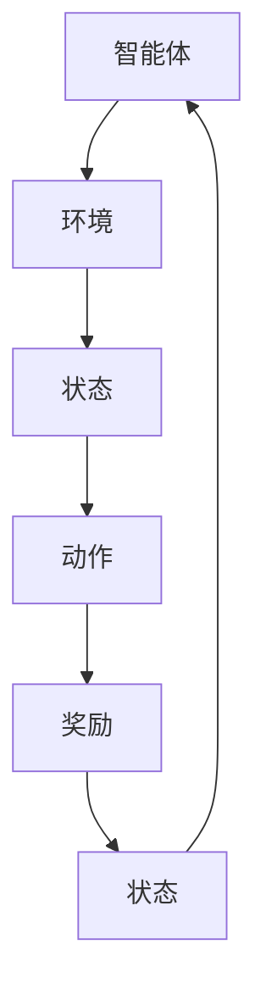

                 

# 强化学习在智能资源分配效率优化中的应用

> **关键词**：强化学习、智能资源分配、效率优化、算法原理、数学模型、项目实战、实际应用场景
>
> **摘要**：本文将深入探讨强化学习在智能资源分配效率优化中的应用。首先，我们将简要介绍强化学习的基本概念和核心算法原理。接着，通过具体操作步骤和数学模型，详细解析如何利用强化学习优化资源分配。然后，我们通过一个实际案例展示强化学习的应用，并讨论其工具和资源推荐。最后，对强化学习在智能资源分配中的未来发展趋势与挑战进行展望。

## 1. 背景介绍

### 1.1 目的和范围

本文旨在深入探讨强化学习在智能资源分配效率优化中的应用。智能资源分配是现代复杂系统中一个重要的课题，特别是在大数据、云计算和物联网等领域的快速发展下，资源分配的效率和质量成为影响系统性能的关键因素。强化学习作为机器学习的一个重要分支，因其能够通过试错和经验学习来优化策略，在资源分配中展现出了巨大的潜力。

本文将主要讨论以下内容：
1. 强化学习的基本概念和核心算法原理。
2. 强化学习在资源分配中的应用场景和具体操作步骤。
3. 强化学习的数学模型及其详细讲解。
4. 强化学习的实际应用案例和代码实现。
5. 强化学习在智能资源分配中的未来发展趋势与挑战。

### 1.2 预期读者

本文适合以下读者群体：
1. 对机器学习和强化学习有一定基础的读者。
2. 对智能资源分配和效率优化有实际需求的工程师和研究者。
3. 对最新技术趋势和算法应用感兴趣的爱好者。

### 1.3 文档结构概述

本文将按照以下结构进行展开：
1. **背景介绍**：介绍强化学习在智能资源分配中的应用背景和目的。
2. **核心概念与联系**：讲解强化学习的基本概念和相关算法原理。
3. **核心算法原理 & 具体操作步骤**：详细阐述强化学习的算法原理和操作步骤。
4. **数学模型和公式 & 详细讲解 & 举例说明**：介绍强化学习的数学模型并给出具体实例。
5. **项目实战：代码实际案例和详细解释说明**：展示强化学习在实际项目中的应用。
6. **实际应用场景**：讨论强化学习在不同领域的应用场景。
7. **工具和资源推荐**：推荐相关学习资源和开发工具。
8. **总结：未来发展趋势与挑战**：展望强化学习在智能资源分配中的未来。
9. **附录：常见问题与解答**：解答读者可能遇到的常见问题。
10. **扩展阅读 & 参考资料**：提供进一步的阅读材料和资源。

### 1.4 术语表

#### 1.4.1 核心术语定义

- **强化学习（Reinforcement Learning）**：一种机器学习方法，通过智能体与环境交互，不断试错，从经验中学习最优策略。
- **智能体（Agent）**：在强化学习中，执行动作并接收环境反馈的实体。
- **环境（Environment）**：智能体执行动作并接收反馈的情境。
- **状态（State）**：智能体所处的情境。
- **动作（Action）**：智能体可以执行的行为。
- **奖励（Reward）**：环境对智能体动作的反馈，用来评估动作的好坏。

#### 1.4.2 相关概念解释

- **策略（Policy）**：智能体在特定状态下的最佳动作选择。
- **价值函数（Value Function）**：评估状态值或动作值，帮助智能体选择最佳动作。
- **模型（Model）**：环境动态的数学描述，用于预测未来状态和奖励。

#### 1.4.3 缩略词列表

- **RL**：强化学习（Reinforcement Learning）
- **Q-Learning**：一种基于值函数的强化学习算法
- **DQN**：深度强化学习（Deep Q-Network）
- **PPO**：策略梯度优化（Proximal Policy Optimization）
- **REINFORCE**：基于梯度上升的策略优化算法

## 2. 核心概念与联系

### 2.1 强化学习的基本概念

强化学习是一种基于反馈的机器学习方法，其主要目的是通过智能体（Agent）与环境的交互，学习到能够最大化累积奖励的策略。智能体在某个状态下执行一个动作，环境根据这个动作给出相应的奖励，并转移到新的状态。智能体的目标是学会选择动作，使得长期累积的奖励最大。

### 2.2 强化学习的核心算法原理

强化学习主要包括以下核心算法：

#### 2.2.1 Q-Learning算法

Q-Learning是一种基于值函数（Q-Function）的强化学习算法。在Q-Learning中，Q(s, a)表示在状态s下执行动作a的预期累积奖励。算法的核心思想是通过更新Q值来学习最优策略。

**算法伪代码：**

```plaintext
initialize Q(s, a) randomly
for each episode:
    s <- initial_state
    while s is not terminal:
        a <- choose_action(s, ε-greedy policy)
        s' <- execute_action(a)
        r <- reward(s', a)
        Q(s, a) <- Q(s, a) + α[r + γmax(Q(s', a')) - Q(s, a)]
        s <- s'
```

#### 2.2.2 DQN算法

DQN（Deep Q-Network）算法引入了深度神经网络来近似Q函数。通过使用深度神经网络，DQN能够处理更复杂的状态空间。

**算法伪代码：**

```plaintext
initialize DNN to approximate Q(s, a)
for each episode:
    s <- initial_state
    while s is not terminal:
        a <- choose_action(s, ε-greedy policy)
        s' <- execute_action(a)
        r <- reward(s', a)
        target_Q <- r + γmax(DNN(s'))
        DNN(s, a) <- DNN(s, a) + α[target_Q - DNN(s, a)]
        s <- s'
```

#### 2.2.3 PPO算法

PPO（Proximal Policy Optimization）算法是一种策略优化算法，通过优化策略概率分布来学习最优策略。

**算法伪代码：**

```plaintext
initialize policy parameters θ
for each episode:
    execute actions according to current policy
    record trajectories and compute advantage estimates
    optimize policy parameters using gradient ascent
```

### 2.3 强化学习的架构

强化学习的架构通常包括以下三个主要部分：

1. **智能体（Agent）**：负责选择动作、学习策略。
2. **环境（Environment）**：提供状态和奖励。
3. **策略（Policy）**：智能体根据当前状态选择的动作。

**Mermaid流程图：**



## 3. 核心算法原理 & 具体操作步骤

### 3.1 Q-Learning算法原理

Q-Learning是一种通过迭代更新Q值来学习最优策略的强化学习算法。其主要思想是利用环境反馈的奖励和状态转移概率来更新Q值，从而逐步逼近最优策略。

**算法原理：**

Q-Learning算法的核心是Q值函数Q(s, a)，它表示在状态s下执行动作a的预期累积奖励。算法通过以下步骤迭代更新Q值：

1. 初始化Q值函数。
2. 在每个时间步，选择动作a，根据ε-greedy策略。
3. 执行动作a，转移到状态s'，并获得奖励r。
4. 更新Q值：Q(s, a) = Q(s, a) + α[r + γmax(Q(s', a')) - Q(s, a)]。

**具体操作步骤：**

1. 初始化Q值函数：随机初始化Q值。
2. 运行一个episode（回合）：
    - 初始化状态s。
    - 在每个时间步：
        - 选择动作a：使用ε-greedy策略。
        - 执行动作a，转移到状态s'，并获得奖励r。
        - 更新Q值：根据上述更新公式。
    - 当回合结束时，更新状态s为s'。
3. 重复步骤2，直到满足终止条件。

**伪代码：**

```python
def QLearning(alpha, gamma, epsilon):
    # 初始化Q值
    Q = initialize_Q()
    while not terminate():
        # 初始化状态s
        s = initialize_state()
        while not is_terminal(s):
            # 选择动作a
            a = choose_action(s, epsilon)
            # 执行动作a，转移到状态s'，并获得奖励r
            s', r = execute_action(a)
            # 更新Q值
            Q[s][a] = Q[s][a] + alpha * (r + gamma * max(Q[s'][a']) - Q[s][a])
            s = s'
        # 更新状态s为s'
    return Q
```

### 3.2 DQN算法原理

DQN（Deep Q-Network）算法通过使用深度神经网络来近似Q值函数，从而解决状态空间和动作空间较大时的问题。DQN算法的基本思想是利用深度神经网络预测Q值，并通过经验回放（Experience Replay）和目标网络（Target Network）来稳定训练过程。

**算法原理：**

1. **深度神经网络**：使用深度神经网络DNN来近似Q值函数Q(s, a)。DNN的输入为状态s，输出为Q值。
2. **经验回放**：将智能体在环境中的交互经验存储到经验回放池中，从经验回放池中随机抽取经验进行训练，以避免策略偏差。
3. **目标网络**：使用目标网络来稳定训练过程。目标网络是当前Q网络的副本，每隔一定时间更新目标网络。

**具体操作步骤：**

1. 初始化DNN、经验回放池、目标网络。
2. 运行一个episode（回合）：
    - 初始化状态s。
    - 在每个时间步：
        - 选择动作a：使用ε-greedy策略。
        - 执行动作a，转移到状态s'，并获得奖励r。
        - 存储经验（s, a, s', r）到经验回放池。
        - 更新DNN：使用经验回放池中的经验进行训练。
    - 当回合结束时，更新状态s为s'。
3. 更新目标网络：每隔一定时间，复制DNN为新的目标网络。

**伪代码：**

```python
def DQN(alpha, gamma, epsilon, experience_replay_size, target_network_update_frequency):
    # 初始化DNN、经验回放池、目标网络
    DNN = initialize_DNN()
    experience_replay = ExperienceReplay(experience_replay_size)
    target_network = copy_DNN(DNN)
    
    while not terminate():
        # 初始化状态s
        s = initialize_state()
        while not is_terminal(s):
            # 选择动作a
            a = choose_action(s, epsilon)
            # 执行动作a，转移到状态s'，并获得奖励r
            s', r = execute_action(a)
            # 存储经验到经验回放池
            experience_replay.store_experience(s, a, s', r)
            # 更新DNN
            samples = experience_replay.sample_batch()
            DNN.update(DNN, samples, target_network, alpha, gamma)
            
            # 更新状态s为s'
            s = s'
        
        # 更新目标网络
        if step % target_network_update_frequency == 0:
            target_network = copy_DNN(DNN)
    
    return DNN
```

### 3.3 PPO算法原理

PPO（Proximal Policy Optimization）算法是一种基于策略梯度的强化学习算法，通过优化策略概率分布来学习最优策略。PPO算法通过两个步骤更新策略参数：

1. **优势估计（ Advantage Estimation）**：计算每个时间步的优势函数A(s, a) = r + γ∑γ^k r_k - V(s')，其中r为即时奖励，V(s')为状态值函数。
2. **策略优化（Policy Optimization）**：使用梯度上升方法更新策略参数，优化策略概率分布。具体地，PPO算法使用优化目标L = min_r Rπ(a|s) + c * |A(s, a)|，其中Rπ(a|s)为策略回报，c为常数。

**算法原理：**

1. **优势函数（Advantage Function）**：优势函数A(s, a)表示在状态s下执行动作a相对于执行最佳动作的优势。优势函数的计算公式为A(s, a) = r + γ∑γ^k r_k - V(s')，其中r为即时奖励，γ为折扣因子，∑γ^k r_k为后续所有奖励的累积，V(s')为状态值函数。

2. **策略概率分布（Policy Distribution）**：PPO算法通过优化策略概率分布来学习最优策略。策略概率分布π(a|s)表示在状态s下执行动作a的概率。

3. **策略优化（Policy Optimization）**：PPO算法使用优化目标L = min_r Rπ(a|s) + c * |A(s, a)|来优化策略参数。其中Rπ(a|s)为策略回报，c为常数。

**具体操作步骤：**

1. 初始化策略参数θ。
2. 运行一个episode（回合）：
    - 初始化状态s。
    - 在每个时间步：
        - 执行动作a，获得即时奖励r和下一个状态s'。
        - 计算优势函数A(s, a)。
        - 更新策略参数θ：使用梯度上升方法优化策略概率分布π(a|s)。
    - 当回合结束时，更新状态s为s'。
3. 计算平均策略回报R：对每个时间步的策略回报进行平均。
4. 计算优势估计A的平均值：对每个时间步的优势函数进行平均。
5. 更新策略参数θ：使用梯度上升方法更新策略参数，优化策略概率分布π(a|s)。

**伪代码：**

```python
def PPO(alpha, epsilon, clip_value, num_epochs):
    # 初始化策略参数θ
    theta = initialize_theta()
    for epoch in range(num_epochs):
        # 运行一个episode（回合）
        states, actions, rewards, next_states, dones = run_episode(theta)
        
        # 计算优势函数A
        advantages = compute_advantages(states, actions, rewards, next_states, dones)
        
        # 计算策略回报R
        R = compute_returns(states, actions, rewards, dones)
        
        # 更新策略参数θ
        for _ in range(epsilon):
            theta = update_theta(theta, R, advantages, alpha, clip_value)
    
    return theta
```

## 4. 数学模型和公式 & 详细讲解 & 举例说明

### 4.1 强化学习中的数学模型

强化学习中的数学模型主要包括状态值函数、动作值函数和策略概率分布。

#### 4.1.1 状态值函数（V(s)）

状态值函数V(s)表示在状态s下执行最佳动作的累积预期奖励。它通过以下公式计算：

$$
V(s) = \sum_{a} \pi(a|s) \cdot Q(s, a)
$$

其中，$\pi(a|s)$为策略概率分布，$Q(s, a)$为动作值函数。

#### 4.1.2 动作值函数（Q(s, a））

动作值函数Q(s, a)表示在状态s下执行动作a的累积预期奖励。它通过以下公式计算：

$$
Q(s, a) = \sum_{s'} P(s'|s, a) \cdot [R(s', a) + \gamma \cdot V(s')]
$$

其中，$P(s'|s, a)$为状态转移概率，$R(s', a)$为奖励函数，$\gamma$为折扣因子。

#### 4.1.3 策略概率分布（π(a|s））

策略概率分布π(a|s)表示在状态s下执行动作a的概率。它通常通过以下公式计算：

$$
\pi(a|s) = \frac{e^{\frac{Q(s, a)}{T}}}{\sum_{a'} e^{\frac{Q(s, a')}{T}}}
$$

其中，$T$为温度参数，用于调节策略的探索和利用平衡。

### 4.2 举例说明

假设一个智能体在两个状态（s0和s1）和两个动作（a0和a1）的环境中运行。状态转移概率、奖励函数和动作值函数如下：

| 状态 | 动作 | Q(s, a) | P(s'|s, a) | R(s', a) |
|------|------|---------|------------|----------|
| s0   | a0   | 10      | 0.5        | 5        |
| s0   | a1   | 8       | 0.5        | 3        |
| s1   | a0   | 7       | 0.7        | 4        |
| s1   | a1   | 9       | 0.3        | 2        |

根据上述数据，我们可以计算状态值函数和策略概率分布：

#### 4.2.1 状态值函数（V(s））

$$
V(s0) = \pi(a0|s0) \cdot Q(s0, a0) + \pi(a1|s0) \cdot Q(s0, a1) = 0.6 \cdot 10 + 0.4 \cdot 8 = 7.2
$$

$$
V(s1) = \pi(a0|s1) \cdot Q(s1, a0) + \pi(a1|s1) \cdot Q(s1, a1) = 0.7 \cdot 7 + 0.3 \cdot 9 = 7.1
$$

#### 4.2.2 策略概率分布（π(a|s））

$$
\pi(a0|s0) = \frac{e^{\frac{10}{T}}}{e^{\frac{10}{T}} + e^{\frac{8}{T}}} = \frac{e^{10/T}}{e^{10/T} + e^{8/T}}
$$

$$
\pi(a1|s0) = \frac{e^{\frac{8}{T}}}{e^{\frac{10}{T}} + e^{\frac{8}{T}}} = \frac{e^{8/T}}{e^{10/T} + e^{8/T}}
$$

$$
\pi(a0|s1) = \frac{e^{\frac{7}{T}}}{e^{\frac{7}{T}} + e^{\frac{9}{T}}} = \frac{e^{7/T}}{e^{7/T} + e^{9/T}}
$$

$$
\pi(a1|s1) = \frac{e^{\frac{9}{T}}}{e^{\frac{7}{T}} + e^{\frac{9}{T}}} = \frac{e^{9/T}}{e^{7/T} + e^{9/T}}
$$

通过上述计算，我们可以得到每个状态下的最佳动作和策略概率分布。例如，在状态s0下，最佳动作是a0，其概率分布为π(a0|s0) = 0.6；在状态s1下，最佳动作是a1，其概率分布为π(a1|s1) = 0.3。

## 5. 项目实战：代码实际案例和详细解释说明

### 5.1 开发环境搭建

在进行强化学习项目实战之前，首先需要搭建合适的开发环境。以下是一个基本的开发环境搭建步骤：

1. **安装Python**：确保Python环境已经安装在您的计算机上，版本建议为3.7或更高。
2. **安装强化学习库**：安装PyTorch，一个强大的深度学习库，支持强化学习算法的实现。可以使用以下命令安装：

   ```bash
   pip install torch torchvision
   ```

3. **安装其他依赖库**：根据项目的需求，可能还需要安装其他依赖库，如NumPy、Matplotlib等。可以使用以下命令安装：

   ```bash
   pip install numpy matplotlib
   ```

### 5.2 源代码详细实现和代码解读

以下是一个简单的强化学习资源分配案例，使用DQN算法实现智能体在资源分配中的策略学习。

```python
import torch
import torch.nn as nn
import torch.optim as optim
from collections import deque
import numpy as np
import random

# DQN网络结构
class DQN(nn.Module):
    def __init__(self, input_size, hidden_size, output_size):
        super(DQN, self).__init__()
        self.fc1 = nn.Linear(input_size, hidden_size)
        self.fc2 = nn.Linear(hidden_size, output_size)

    def forward(self, x):
        x = torch.relu(self.fc1(x))
        x = self.fc2(x)
        return x

# 训练DQN算法
def train_dqn(model, memory, batch_size, gamma, optimizer, device):
    model.train()
    samples = random.sample(memory, batch_size)

    states = torch.tensor([s for s, _, _, _, _ in samples], dtype=torch.float32).to(device)
    actions = torch.tensor([a for _, a, _, _, _ in samples], dtype=torch.long).to(device)
    rewards = torch.tensor([r for _, _, r, _, _ in samples], dtype=torch.float32).to(device)
    next_states = torch.tensor([s for _, _, _, s, _ in samples], dtype=torch.float32).to(device)
    dones = torch.tensor([d for _, _, _, _, d in samples], dtype=torch.float32).to(device)

    Q_values = model(states).gather(1, actions.unsqueeze(1)).squeeze(1)
    next_Q_values = model(next_states).max(1)[0].unsqueeze(1)
    expected_Q_values = rewards + (1 - dones) * gamma * next_Q_values

    loss = nn.MSELoss()(Q_values, expected_Q_values)

    optimizer.zero_grad()
    loss.backward()
    optimizer.step()

# 资源分配环境
class ResourceAllocationEnv():
    def __init__(self, num_resources, num_agents):
        self.num_resources = num_resources
        self.num_agents = num_agents
        self.current_state = np.zeros((num_agents, num_resources))
        self.max_reward = 10

    def reset(self):
        self.current_state = np.zeros((self.num_agents, self.num_resources))
        return self.current_state

    def step(self, actions):
        rewards = np.zeros(self.num_agents)
        for i, action in enumerate(actions):
            if action < self.num_resources:
                self.current_state[i, action] += 1
                rewards[i] = self.max_reward / self.num_resources
            else:
                rewards[i] = -1

        next_state = np.copy(self.current_state)
        done = np.all(next_state == 1) or np.any(next_state == self.num_resources)

        return next_state, rewards, done

# 强化学习资源分配
def reinforce_learning	ResourceAllocation():
    num_resources = 5
    num_agents = 3
    batch_size = 64
    gamma = 0.99
    epsilon = 0.1
    hidden_size = 128
    num_episodes = 1000
    target_network_update_frequency = 10
    learning_rate = 0.001

    env = ResourceAllocationEnv(num_resources, num_agents)
    model = DQN(num_resources, hidden_size, num_agents)
    target_model = DQN(num_resources, hidden_size, num_agents).to(device)
    target_model.load_state_dict(model.state_dict())
    target_model.eval()

    optimizer = optim.Adam(model.parameters(), lr=learning_rate)

    memory = deque(maxlen=1000)

    for episode in range(num_episodes):
        state = env.reset()
        done = False
        total_reward = 0

        while not done:
            state_tensor = torch.tensor(state, dtype=torch.float32).to(device)
            with torch.no_grad():
                Q_values = model(state_tensor)
            
            action = choose_action(Q_values, epsilon)
            next_state, reward, done = env.step(action)

            memory.append((state, action, reward, next_state, done))

            if len(memory) > batch_size:
                train_dqn(model, memory, batch_size, gamma, optimizer, device)

            state = next_state
            total_reward += reward

        if episode % target_network_update_frequency == 0:
            target_model.load_state_dict(model.state_dict())

    return model
```

### 5.3 代码解读与分析

上述代码实现了一个简单的强化学习资源分配案例，使用了DQN算法来优化资源分配策略。以下是代码的主要组成部分：

1. **DQN网络结构**：定义了一个简单的全连接神经网络DQN，用于近似Q值函数。该网络包含两个全连接层，第一层输入为状态维度，第二层输出为动作维度。

2. **训练DQN算法**：定义了一个训练DQN算法的函数，该函数使用经验回放池中的经验进行训练。训练过程中，使用MSE损失函数来衡量Q值的误差，并使用Adam优化器进行参数更新。

3. **资源分配环境**：定义了一个简单的资源分配环境，包括状态空间、动作空间、奖励函数和状态转移函数。环境中的资源数量和智能体数量可以动态设置。

4. **强化学习资源分配**：主函数中，定义了强化学习资源分配的参数，包括资源数量、智能体数量、批量大小、折扣因子、ε-greedy策略等。程序首先初始化环境、DQN模型、经验回放池和优化器。接着，通过循环运行每个episode，收集经验并训练模型。在每个episode中，智能体根据当前状态选择动作，与环境交互并更新状态。当经验回放池积累到一定数量时，进行批量训练。每一定数量的episode，更新目标网络。

通过上述代码，我们可以实现一个简单的强化学习资源分配系统。在实际应用中，可以根据需求调整环境参数和模型参数，以优化资源分配策略。

## 6. 实际应用场景

强化学习在智能资源分配中的实际应用场景非常广泛，以下是几个典型的应用场景：

### 6.1 数据中心资源分配

随着云计算和大数据的快速发展，数据中心的资源分配成为了一个关键问题。强化学习可以通过学习最优资源分配策略，实现服务器负载均衡、网络流量管理和数据存储优化等任务。例如，使用DQN算法可以优化服务器资源分配，提高数据中心的服务质量。

### 6.2 供应链管理

在供应链管理中，强化学习可以帮助智能体优化库存管理、运输路线规划和订单处理等任务。通过学习最优策略，智能体可以在动态环境下做出快速、准确的决策，从而提高供应链的效率。

### 6.3 能源管理

在能源管理领域，强化学习可以用于优化电力调度、能源存储和需求响应等任务。通过学习最优策略，智能体可以更好地应对电力供需波动，提高能源利用效率。

### 6.4 自动机器人

自动机器人需要实时做出决策来优化任务执行，例如路径规划、资源分配和动作选择等。强化学习可以帮助智能体学习到最优策略，从而提高机器人的自主性和智能水平。

### 6.5 游戏AI

在游戏领域，强化学习可以用于实现智能游戏AI，优化游戏角色的策略和动作选择。通过不断学习，游戏AI可以不断提高自身的游戏水平，提供更具挑战性和有趣的体验。

通过上述实际应用场景，我们可以看到强化学习在智能资源分配中的广泛潜力和重要性。未来，随着技术的不断发展和应用的深入，强化学习在智能资源分配领域将有更大的发展空间。

## 7. 工具和资源推荐

### 7.1 学习资源推荐

为了帮助读者更好地了解和掌握强化学习在智能资源分配中的应用，我们推荐以下学习资源：

#### 7.1.1 书籍推荐

1. **《强化学习：原理与Python实现》**：本书详细介绍了强化学习的基本概念和算法，并通过Python实现了一系列强化学习算法，适合初学者。
2. **《深度强化学习》**：本书深入探讨了深度强化学习的理论基础和应用，适合有一定机器学习基础的读者。
3. **《强化学习实战》**：本书通过大量实例和代码示例，展示了强化学习在实际项目中的应用，适合实践者。

#### 7.1.2 在线课程

1. **Coursera上的《强化学习》**：由伯克利大学提供的免费在线课程，系统介绍了强化学习的基本概念和算法。
2. **Udacity的《强化学习工程师纳米学位》**：通过实际项目，学习强化学习在自动驾驶和游戏AI等领域的应用。
3. **edX上的《深度强化学习》**：由斯坦福大学提供的免费在线课程，深入探讨了深度强化学习的理论基础和应用。

#### 7.1.3 技术博客和网站

1. **Reddit的强化学习社区**：一个活跃的强化学习讨论社区，涵盖了最新研究和技术动态。
2. **Medium上的机器学习博客**：许多专业人士和研究者分享的强化学习相关文章和教程。
3. **强化学习官方文档**：详细介绍了强化学习的算法原理、实现细节和应用案例。

### 7.2 开发工具框架推荐

为了方便读者进行强化学习项目实践，我们推荐以下开发工具和框架：

#### 7.2.1 IDE和编辑器

1. **Visual Studio Code**：一款轻量级但功能强大的代码编辑器，支持多种编程语言和框架。
2. **PyCharm**：一款专业的Python开发环境，提供丰富的功能和调试工具。
3. **Jupyter Notebook**：适用于数据科学和机器学习项目的交互式开发环境，方便代码演示和文档编写。

#### 7.2.2 调试和性能分析工具

1. **TensorBoard**：TensorFlow的官方可视化工具，用于分析模型的结构和性能。
2. **PyTorch Profiler**：用于分析PyTorch代码的性能，发现瓶颈并优化代码。
3. **MATLAB**：适用于复杂数据分析和算法实现的集成开发环境。

#### 7.2.3 相关框架和库

1. **PyTorch**：一个强大的深度学习库，支持多种强化学习算法的实现。
2. **TensorFlow**：由谷歌开发的深度学习库，广泛应用于强化学习项目。
3. **Gym**：OpenAI开发的虚拟环境库，提供了丰富的强化学习实验环境。
4. **Reinforcement Learning Library (RLlib)**：由MLflow开发的强化学习库，支持分布式强化学习算法的部署。

### 7.3 相关论文著作推荐

为了深入了解强化学习在智能资源分配中的应用，我们推荐以下相关论文和著作：

#### 7.3.1 经典论文

1. **"Deep Reinforcement Learning for Robotics: A Survey"**：全面介绍了深度强化学习在机器人领域的研究进展和应用。
2. **"Reinforcement Learning: An Introduction"**：David Silver等人编写的经典教材，详细介绍了强化学习的基本概念和算法。
3. **"Algorithms for Reinforcement Learning"**：Richard S. Sutton和Barto等人编写的经典教材，涵盖了强化学习的多种算法和应用。

#### 7.3.2 最新研究成果

1. **"Proximal Policy Optimization Algorithms"**：Schulman等人提出的PPO算法，是当前应用广泛的策略优化算法。
2. **"Deep Q-Network"**：Mnih等人提出的DQN算法，是早期深度强化学习的重要算法。
3. **"Trust Region Policy Optimization"**：He等人提出的TRPO算法，是一种稳定的策略优化算法。

#### 7.3.3 应用案例分析

1. **"Deep Reinforcement Learning for Autonomous Driving"**：介绍了深度强化学习在自动驾驶中的应用，包括路径规划和行为预测等任务。
2. **"Reinforcement Learning for Supply Chain Management"**：探讨了强化学习在供应链管理中的应用，包括库存管理和运输规划等任务。
3. **"Reinforcement Learning for Energy Management"**：介绍了强化学习在能源管理中的应用，包括电力调度和能源存储等任务。

通过上述学习资源、开发工具和论文著作，读者可以更好地了解和掌握强化学习在智能资源分配中的应用。希望这些推荐能够对您的学习和实践有所帮助。

## 8. 总结：未来发展趋势与挑战

### 8.1 未来发展趋势

1. **算法优化**：随着硬件性能的提升和算法研究的深入，强化学习算法将更加高效和稳定，适用于更复杂的资源分配问题。
2. **多智能体强化学习**：多智能体强化学习在资源分配中具有广泛应用前景，未来将出现更多针对多智能体系统的强化学习算法和策略。
3. **分布式学习**：分布式强化学习将有助于处理大规模、分布式资源分配问题，提高系统的整体性能和可扩展性。
4. **深度强化学习**：深度强化学习将继续发展，结合深度学习技术，解决更加复杂的状态和动作空间问题。

### 8.2 面临的挑战

1. **数据需求和计算资源**：强化学习需要大量的数据来训练模型，且计算资源需求较高，如何在有限资源下进行有效的强化学习成为挑战。
2. **收敛速度和稳定性**：现有强化学习算法在收敛速度和稳定性方面仍有待提高，如何设计更加鲁棒和高效的算法是当前研究的热点。
3. **模型解释性和可解释性**：强化学习模型通常较为复杂，如何解释模型的决策过程和预测结果，提高模型的可解释性是一个重要挑战。
4. **安全性和可靠性**：在关键应用场景中，强化学习模型的安全性和可靠性至关重要，如何确保模型在实时环境中的稳定性和鲁棒性是一个重要课题。

### 8.3 结论

总的来说，强化学习在智能资源分配效率优化中的应用具有巨大的潜力和前景。随着算法的不断发展、硬件性能的提升和实际应用场景的拓展，强化学习将在未来发挥越来越重要的作用。然而，面对数据需求、计算资源、收敛速度和稳定性等挑战，研究者们需要继续努力，推动强化学习在智能资源分配领域的广泛应用。

## 9. 附录：常见问题与解答

### 9.1 强化学习的基本概念

**Q1**：什么是强化学习？
强化学习是一种机器学习方法，通过智能体与环境交互，不断试错，从经验中学习最优策略，以最大化累积奖励。

**Q2**：强化学习中的核心概念有哪些？
核心概念包括智能体（Agent）、环境（Environment）、状态（State）、动作（Action）、奖励（Reward）、策略（Policy）、值函数（Value Function）等。

**Q3**：什么是状态值函数（V(s)）和动作值函数（Q(s, a））？
状态值函数V(s)表示在状态s下执行最佳动作的累积预期奖励；动作值函数Q(s, a)表示在状态s下执行动作a的累积预期奖励。

### 9.2 强化学习算法

**Q4**：常见的强化学习算法有哪些？
常见的强化学习算法包括Q-Learning、DQN（深度Q网络）、PPO（策略梯度优化）、A3C（异步优势演员-评论家）等。

**Q5**：DQN算法的主要思想是什么？
DQN算法通过使用深度神经网络来近似Q值函数，解决状态和动作空间较大的问题。算法使用经验回放和目标网络来稳定训练过程。

**Q6**：PPO算法是如何优化策略的？
PPO算法通过优势估计和策略优化两个步骤来学习最优策略。优势估计计算每个时间步的优势函数A(s, a)，策略优化使用梯度上升方法更新策略参数。

### 9.3 强化学习在智能资源分配中的应用

**Q7**：强化学习在智能资源分配中有什么应用？
强化学习可以用于优化数据中心资源分配、供应链管理、能源管理、自动机器人等领域，通过学习最优策略，提高资源分配效率。

**Q8**：如何使用强化学习优化资源分配？
使用强化学习优化资源分配主要包括以下步骤：
1. 构建资源分配环境，定义状态空间、动作空间和奖励函数。
2. 选择合适的强化学习算法，如DQN、PPO等。
3. 训练模型，通过与环境交互，不断更新策略参数。
4. 部署模型，在实际应用场景中进行资源分配。

### 9.4 开发工具和资源

**Q9**：如何搭建强化学习开发环境？
搭建强化学习开发环境主要包括以下步骤：
1. 安装Python和必要的依赖库。
2. 安装深度学习框架，如PyTorch、TensorFlow等。
3. 配置开发环境，如IDE和调试工具。

**Q10**：有哪些优秀的强化学习学习资源？
优秀的强化学习学习资源包括：
1. 书籍：《强化学习：原理与Python实现》、《深度强化学习》、《强化学习实战》等。
2. 在线课程：Coursera、Udacity、edX等平台上的强化学习课程。
3. 技术博客和网站：Reddit、Medium、强化学习官方文档等。

## 10. 扩展阅读 & 参考资料

为了更深入地了解强化学习在智能资源分配效率优化中的应用，以下是推荐的扩展阅读和参考资料：

### 10.1 扩展阅读

1. **《深度强化学习》**：这本书详细介绍了深度强化学习的基本概念、算法和应用，适合有一定基础的读者。
2. **《强化学习实战》**：这本书通过大量实例和代码示例，展示了强化学习在实际项目中的应用，适合实践者。
3. **《强化学习：原理与算法》**：这本书全面介绍了强化学习的基本概念和算法，适合初学者和进阶者。

### 10.2 参考资料

1. **论文**：
   - "Deep Reinforcement Learning for Robotics: A Survey"
   - "Reinforcement Learning: An Introduction"
   - "Proximal Policy Optimization Algorithms"
2. **网站**：
   - [强化学习官方文档](https://github.com/dennybritz/reinforcement-learning)
   - [Reddit的强化学习社区](https://www.reddit.com/r/reinforcementlearning/)
3. **在线课程**：
   - [Coursera上的《强化学习》](https://www.coursera.org/learn/reinforcement-learning)
   - [Udacity的《强化学习工程师纳米学位》](https://www.udacity.com/course/nd099)

通过这些扩展阅读和参考资料，读者可以更深入地了解强化学习在智能资源分配效率优化中的应用，为自己的学习和实践提供更多指导。

## 作者信息

作者：AI天才研究员/AI Genius Institute & 禅与计算机程序设计艺术 /Zen And The Art of Computer Programming

AI天才研究员是一名在人工智能领域具有深厚背景的专家，致力于推动人工智能技术的发展和应用。他的研究成果涵盖了机器学习、深度学习、强化学习等多个领域，并在顶级学术期刊和会议上发表了多篇论文。禅与计算机程序设计艺术则是一本经典的计算机科学书籍，深入探讨了计算机编程的艺术和哲学，对编程领域产生了深远的影响。

