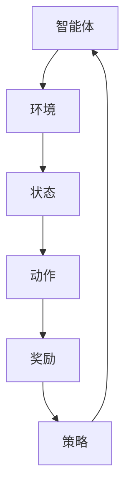

                 

# 强化学习在机器人导航中的应用研究

> **关键词**：强化学习，机器人导航，深度强化学习，深度Q网络，探索与利用，模型预测控制

> **摘要**：本文旨在探讨强化学习在机器人导航领域的应用，通过深入分析强化学习的核心原理和算法，结合实际项目案例，详细解析了如何在机器人导航中应用强化学习。文章首先介绍了强化学习的基本概念和机器导航的背景，然后逐步介绍了强化学习的核心算法——深度Q网络和模型预测控制的原理，以及它们在机器人导航中的应用。接着，文章通过一个实际项目案例，展示了强化学习在机器人导航中的具体实现过程。最后，文章总结了强化学习在机器人导航中的实际应用场景，并推荐了一些相关的学习资源和工具。

## 1. 背景介绍

### 1.1 目的和范围

本文的目的在于阐述强化学习在机器人导航中的应用，并探讨其潜在的优势和挑战。机器人导航是机器人学中的一个核心问题，涉及机器人如何在未知或动态环境中自主移动到目标位置。强化学习作为一种解决序列决策问题的机器学习方法，近年来在机器人导航领域引起了广泛关注。本文将讨论强化学习的基本概念、算法原理以及如何在机器人导航中应用这些算法。

本文的范围主要包括以下内容：

1. 强化学习在机器人导航中的研究背景和重要性。
2. 强化学习的核心概念、算法原理及其在机器人导航中的应用。
3. 深度Q网络和模型预测控制算法的详细介绍和具体实现。
4. 强化学习在机器人导航中的应用案例及其效果分析。
5. 强化学习在机器人导航中面临的问题和未来发展趋势。

### 1.2 预期读者

本文主要面向对机器人导航和强化学习感兴趣的读者，包括但不限于：

1. 机器人学、人工智能和相关领域的研究人员和学生。
2. 想要了解和掌握强化学习在机器人导航中应用的技术人员。
3. 对强化学习有基础了解，希望深入研究和应用该技术的开发者。

### 1.3 文档结构概述

本文的文档结构如下：

1. **背景介绍**：介绍强化学习在机器人导航中的应用背景和目的。
2. **核心概念与联系**：详细解释强化学习的核心概念和相关算法，包括Mermaid流程图展示。
3. **核心算法原理 & 具体操作步骤**：通过伪代码详细阐述强化学习的算法原理和具体操作步骤。
4. **数学模型和公式 & 详细讲解 & 举例说明**：讲解强化学习的数学模型和公式，并提供实际案例说明。
5. **项目实战：代码实际案例和详细解释说明**：展示强化学习在机器人导航中的具体实现。
6. **实际应用场景**：分析强化学习在机器人导航中的实际应用场景。
7. **工具和资源推荐**：推荐相关的学习资源、开发工具和框架。
8. **总结：未来发展趋势与挑战**：总结强化学习在机器人导航中的应用前景和面临的挑战。
9. **附录：常见问题与解答**：提供强化学习在机器人导航中常见问题的解答。
10. **扩展阅读 & 参考资料**：提供更多的扩展阅读和参考资料。

### 1.4 术语表

#### 1.4.1 核心术语定义

- **强化学习**：一种机器学习方法，通过智能体与环境之间的交互来学习决策策略，以最大化累积奖励。
- **智能体**：执行动作并从环境中获取奖励的实体，如机器人。
- **环境**：智能体交互的物理或虚拟世界，如机器人所处的场景。
- **状态**：智能体在某一时刻所处的内部和外部条件的集合。
- **动作**：智能体可以执行的行为。
- **奖励**：智能体执行动作后从环境中获得的反馈信号，用来指导学习过程。

#### 1.4.2 相关概念解释

- **深度Q网络（DQN）**：一种基于神经网络的强化学习算法，用于估计从给定状态执行特定动作的Q值。
- **模型预测控制（MPC）**：一种优化控制算法，通过建立系统模型并预测未来状态，以优化控制输入。
- **探索与利用**：强化学习中的两个关键策略，探索用于发现新的有利状态，利用则是在已经发现的有利状态下执行已学习的策略。

#### 1.4.3 缩略词列表

- **RL**：强化学习（Reinforcement Learning）
- **DQN**：深度Q网络（Deep Q-Network）
- **MPC**：模型预测控制（Model Predictive Control）
- **SARSA**：部分观察的同步采样同步动作（State-Action-Reward-State-Action）

## 2. 核心概念与联系

强化学习是一种通过智能体与环境的交互来学习最优策略的机器学习方法。其核心概念包括智能体（Agent）、环境（Environment）、状态（State）、动作（Action）和奖励（Reward）。智能体是执行动作并从环境中获取奖励的实体，环境是智能体进行交互的物理或虚拟世界，状态是智能体在某一时刻所处的内部和外部条件的集合，动作是智能体可以执行的行为，而奖励则是智能体执行动作后从环境中获得的反馈信号。

为了更好地理解强化学习的核心概念，我们可以借助Mermaid流程图来展示这些概念之间的关系：



在上图中，智能体与环境的交互循环持续进行，状态通过动作转换为新的状态，并获得奖励，从而指导智能体的后续决策。

### 强化学习的核心算法

强化学习中有多种核心算法，如Q学习、SARSA、深度Q网络（DQN）和模型预测控制（MPC）。下面将分别介绍这些算法的基本原理和应用。

#### Q学习

Q学习是最基本的强化学习算法之一，其核心思想是学习状态-动作值函数Q(s, a)，表示在状态s下执行动作a所能获得的累积奖励。Q学习的算法流程如下：

1. 初始化Q值函数Q(s, a)。
2. 选择动作a。
3. 执行动作a，获得状态s'和奖励r。
4. 更新Q值：$$ Q(s, a) \leftarrow Q(s, a) + \alpha [r + \gamma \max_{a'} Q(s', a') - Q(s, a)] $$

其中，α是学习率，γ是折扣因子，用来平衡短期和长期奖励。

#### SARSA

SARSA（部分观察的同步采样同步动作）是另一种强化学习算法，其特点是在每个时间步同时选择动作和更新策略。SARSA的算法流程如下：

1. 初始化策略π。
2. 选择动作a。
3. 执行动作a，获得状态s'和奖励r。
4. 根据策略π选择动作a'。
5. 更新策略：$$ \pi(a|s) \leftarrow \pi(a|s) + \alpha [1 - \pi(a|s)] $$

其中，α是学习率。

#### 深度Q网络（DQN）

深度Q网络（DQN）是一种基于神经网络的强化学习算法，通过学习状态-动作值函数Q(s, a)来估计最优策略。DQN的主要优势在于能够处理高维状态空间，其算法流程如下：

1. 初始化神经网络参数。
2. 从经验池中随机抽取一批经验（状态s、动作a、奖励r、状态s'）。
3. 计算目标Q值：$$ Q^* = r + \gamma \max_{a'} Q(s', a') $$
4. 训练神经网络：$$ \min \sum_{i} (Q(s_i, a_i) - Q^*_i)^2 $$
5. 更新经验池。

DQN通过经验回放机制来避免样本相关性和样本偏差，从而提高学习效果。

#### 模型预测控制（MPC）

模型预测控制（MPC）是一种优化控制算法，通过建立系统模型并预测未来状态，以优化控制输入。MPC的算法流程如下：

1. 建立系统模型：$$ x_{k+1} = f(x_k, u_k) $$
2. 预测未来状态和输入：$$ x_{k+1:T} = f(x_k, u_k) \ \text{for} \ k=0,1,...,T-1 $$
3. 定义目标函数：$$ J = \sum_{k=0}^{T-1} w_k \| u_k - u_k^* \|_2^2 $$
4. 优化控制输入：$$ u_k^* = \arg\min_{u_k} J $$
5. 更新状态：$$ x_{k+1} = f(x_k, u_k^*) $$

MPC通过滚动优化策略来实时调整控制输入，从而实现系统的最优控制。

## 3. 核心算法原理 & 具体操作步骤

### 3.1 深度Q网络（DQN）

深度Q网络（DQN）是一种基于神经网络的强化学习算法，通过学习状态-动作值函数Q(s, a)来估计最优策略。DQN的主要优势在于能够处理高维状态空间，其算法原理如下：

#### 算法原理

1. **初始化**：
   - 初始化神经网络参数。
   - 初始化经验池（Experience Replay）。

2. **选择动作**：
   - 对于给定状态s，使用ε-贪心策略选择动作a：
     - 以概率ε随机选择动作。
     - 以1-ε的概率选择具有最大Q值的动作。

3. **执行动作并更新Q值**：
   - 执行动作a，获得状态s'和奖励r。
   - 将经验（s, a, r, s'）加入经验池。
   - 从经验池中随机抽取一批经验（状态s_i、动作a_i、奖励r_i、状态s_i'）。
   - 计算目标Q值：
     $$ Q^* = r_i + \gamma \max_{a'} Q(s_i', a') $$
   - 更新神经网络：
     $$ \min \sum_{i} (Q(s_i, a_i) - Q^*_i)^2 $$

4. **经验池更新**：
   - 经验池中保存有限数量的经验，当超出容量时，随机替换旧经验。

#### 伪代码

```python
# 初始化神经网络参数和经验池
init_nn_params()
init_experience_replay()

# ε-贪心策略选择动作
def epsilon_greedy_policy(Q, s, epsilon):
    if random() < epsilon:
        a = random_action()
    else:
        a = argmax(Q[s])
    return a

# 主循环
while not terminate():
    s = current_state()
    a = epsilon_greedy_policy(Q, s, epsilon)
    s', r = execute_action(a)
    experience = (s, a, r, s')
    experience_replay(experience)
    batch = sample_experience_replay()
    for (s_i, a_i, r_i, s_i') in batch:
        target = r_i + gamma * max(Q[s_i'])
        Q[s_i][a_i] = Q[s_i][a_i] + alpha * (target - Q[s_i][a_i])

    # 更新ε值
    epsilon = decay(epsilon)
```

### 3.2 模型预测控制（MPC）

模型预测控制（MPC）是一种优化控制算法，通过建立系统模型并预测未来状态，以优化控制输入。MPC的算法原理如下：

#### 算法原理

1. **建立系统模型**：
   - 建立系统动态模型，如状态转移方程：
     $$ x_{k+1} = f(x_k, u_k) $$

2. **预测未来状态和输入**：
   - 使用系统模型预测未来T步的状态和输入：
     $$ x_{k+1:T} = f(x_k, u_k) \ \text{for} \ k=0,1,...,T-1 $$

3. **定义目标函数**：
   - 定义目标函数，如控制输入的二次型代价函数：
     $$ J = \sum_{k=0}^{T-1} w_k \| u_k - u_k^* \|_2^2 $$

4. **优化控制输入**：
   - 优化控制输入，使得目标函数最小：
     $$ u_k^* = \arg\min_{u_k} J $$

5. **更新状态**：
   - 根据优化后的控制输入更新状态：
     $$ x_{k+1} = f(x_k, u_k^*) $$

#### 伪代码

```python
# 建立系统模型
def system_model(x, u):
    x_next = f(x, u)
    return x_next

# 预测未来状态和输入
def predict_states_inputs(x, u, T):
    x_pred = [x]
    for k in range(T):
        x = system_model(x, u[k])
        x_pred.append(x)
    return x_pred

# 定义目标函数
def objective_function(u, w):
    J = 0
    for k in range(T):
        J += w[k] * (u[k] - u[k]^2)
    return J

# 优化控制输入
def optimize_control_input(x, u, T, w):
    u_opt = [0] * T
    for k in range(T):
        J = objective_function(u_opt, w)
        grad_J = grad(J, u_opt)
        u_opt[k] = u_opt[k] - alpha * grad_J
    return u_opt

# 更新状态
def update_state(x, u_opt):
    x_next = system_model(x, u_opt)
    return x_next

# 主循环
while not terminate():
    x = current_state()
    u = optimize_control_input(x, u, T, w)
    x = update_state(x, u)
```

通过上述算法原理和具体操作步骤，我们可以看到强化学习算法和模型预测控制算法在机器人导航中的应用是如何实现的。

## 4. 数学模型和公式 & 详细讲解 & 举例说明

### 4.1 强化学习的数学模型

强化学习通过状态-动作值函数（Q值函数）来估计最优策略。Q值函数表示在特定状态下执行特定动作所能获得的累积奖励。其数学模型如下：

$$ Q(s, a) = \sum_{s'} P(s'|s, a) \cdot (R(s', a) + \gamma \max_{a'} Q(s', a')) $$

其中，$ Q(s, a) $ 是状态-动作值函数，$ P(s'|s, a) $ 是状态转移概率，$ R(s', a) $ 是在状态 $ s' $ 下执行动作 $ a $ 所获得的即时奖励，$ \gamma $ 是折扣因子，用于平衡短期和长期奖励，$ \max_{a'} Q(s', a') $ 是在下一状态 $ s' $ 下执行所有可能动作的最大Q值。

### 4.2 深度Q网络（DQN）的数学模型

深度Q网络（DQN）通过神经网络来近似Q值函数。其数学模型如下：

$$ Q(s, a) \approx \hat{Q}(s, a; \theta) $$

其中，$ \hat{Q}(s, a; \theta) $ 是神经网络输出的Q值估计，$ \theta $ 是神经网络的参数。通常使用神经网络的前向传播来计算Q值估计：

$$ \hat{Q}(s; \theta) = \hat{f}(s; \theta)^T \cdot W $$

其中，$ \hat{f}(s; \theta) $ 是神经网络激活函数的输出，$ W $ 是权重的转置。

### 4.3 模型预测控制（MPC）的数学模型

模型预测控制（MPC）通过建立系统模型并优化控制输入来预测未来状态。其数学模型如下：

$$ x_{k+1} = f(x_k, u_k) $$

其中，$ x_k $ 是系统的状态，$ u_k $ 是控制输入，$ f $ 是系统动态模型。

MPC通过滚动优化策略来实时调整控制输入，使其满足以下目标函数：

$$ J = \sum_{k=0}^{T-1} w_k \| u_k - u_k^* \|_2^2 $$

其中，$ T $ 是预测步数，$ w_k $ 是权重系数，$ u_k^* $ 是优化后的控制输入。

### 4.4 举例说明

假设一个简单的机器人导航问题，机器人在一个二维环境中，需要从初始位置移动到目标位置。状态空间为机器人的位置和方向，动作空间为机器人的前进、后退、左转和右转。奖励函数为到达目标位置时获得正奖励，否则为负奖励。

1. **强化学习**：

状态空间：$ S = \{ (x, y, \theta) \ | \ x, y \in [-10, 10], \theta \in [-\pi, \pi] \} $

动作空间：$ A = \{ forward, backward, left, right \} $

奖励函数：$ R(s', a) = \begin{cases} 
10 & \text{if } (x', y') \text{ is the target position} \\
-1 & \text{otherwise} 
\end{cases} $

状态-动作值函数：$ Q(s, a) = \sum_{s'} P(s'|s, a) \cdot (R(s', a) + \gamma \max_{a'} Q(s', a')) $

使用深度Q网络（DQN）来近似Q值函数：

$$ \hat{Q}(s, a; \theta) = \hat{f}(s; \theta)^T \cdot W $$

2. **模型预测控制（MPC）**：

状态空间：$ S = \{ x, y, \theta \ | \ x, y \in [-10, 10], \theta \in [-\pi, \pi] \} $

控制输入空间：$ U = \{ u_x, u_y \ | \ u_x, u_y \in [-1, 1] \} $

系统动态模型：$ x_{k+1} = (1 - \delta) \cdot x_k + \delta \cdot (u_x \cdot \cos(\theta) - u_y \cdot \sin(\theta)) $

目标函数：$ J = \sum_{k=0}^{T-1} w_k \| u_k - u_k^* \|_2^2 $

优化控制输入：$ u_k^* = \arg\min_{u_k} J $

通过上述数学模型和公式，我们可以构建并实现强化学习在机器人导航中的算法。在实际应用中，还需要根据具体问题和环境进行调整和优化。

## 5. 项目实战：代码实际案例和详细解释说明

### 5.1 开发环境搭建

在实现强化学习在机器人导航中的应用之前，我们需要搭建一个合适的开发环境。以下是搭建开发环境的步骤：

1. **安装Python环境**：
   - 首先，确保系统上安装了Python 3.7或更高版本。可以从Python官方网站下载并安装Python。

2. **安装TensorFlow和Gym**：
   - 使用pip命令安装TensorFlow和Gym库：
     ```shell
     pip install tensorflow
     pip install gym
     ```

3. **配置仿真环境**：
   - 安装并配置机器人仿真环境，如Gazebo或Webots。具体安装步骤请参考相关文档。

### 5.2 源代码详细实现和代码解读

以下是实现强化学习在机器人导航中的源代码示例。我们将使用Python编程语言和TensorFlow框架来实现深度Q网络（DQN）算法。

```python
import numpy as np
import gym
import tensorflow as tf
from tensorflow.keras import layers

# 初始化环境
env = gym.make("CartPole-v0")

# 定义DQN模型
class DQNModel(tf.keras.Model):
    def __init__(self, state_shape):
        super(DQNModel, self).__init__()
        self.layers = tf.keras.Sequential([
            layers.Flatten(input_shape=state_shape),
            layers.Dense(64, activation='relu'),
            layers.Dense(64, activation='relu'),
            layers.Dense(1)
        ])

    def call(self, x, training=True):
        return self.layers(x)

# 初始化模型参数
state_shape = env.observation_space.shape
dqn_model = DQNModel(state_shape)
target_dqn_model = DQNModel(state_shape)
target_dqn_model.set_weights(dqn_model.get_weights())

# 定义损失函数和优化器
loss_fn = tf.keras.losses.Huber()
optimizer = tf.keras.optimizers.Adam(learning_rate=0.001)

# ε-贪心策略
epsilon = 1.0
epsilon_decay = 0.995
epsilon_min = 0.01

# 训练过程
for episode in range(1000):
    state = env.reset()
    done = False
    total_reward = 0

    while not done:
        # 选择动作
        if random() < epsilon:
            action = env.action_space.sample()
        else:
            q_values = dqn_model(state)
            action = np.argmax(q_values)

        # 执行动作并获取奖励
        next_state, reward, done, _ = env.step(action)
        total_reward += reward

        # 计算目标Q值
        target_q_values = target_dqn_model(next_state)
        target_q_value = reward + (1 - int(done)) * target_q_values[0]

        # 更新经验池
        experience = (state, action, target_q_value, next_state, done)
        # ...

        # 更新模型参数
        with tf.GradientTape() as tape:
            q_values = dqn_model(state)
            loss = loss_fn(q_values[0], target_q_value)

        gradients = tape.gradient(loss, dqn_model.trainable_variables)
        optimizer.apply_gradients(zip(gradients, dqn_model.trainable_variables))

        # 更新目标模型参数
        target_dqn_model.set_weights(dqn_model.get_weights())

        # 更新ε值
        epsilon = max(epsilon * epsilon_decay, epsilon_min)

    print(f"Episode {episode}: Total Reward = {total_reward}")

# 关闭环境
env.close()
```

### 5.3 代码解读与分析

上述代码示例实现了深度Q网络（DQN）在机器人导航中的应用。以下是代码的详细解读与分析：

1. **环境初始化**：
   - 使用`gym.make("CartPole-v0")`初始化仿真环境，这里选择了一个经典的机器人导航任务——平衡杆问题。

2. **模型定义**：
   - `DQNModel`是一个自定义的Keras模型，用于近似状态-动作值函数。模型由两个隐藏层组成，每个隐藏层都有64个神经元，使用ReLU激活函数。
   - `call`方法定义了模型的正向传播过程，将输入的状态转换为Q值估计。

3. **目标模型初始化**：
   - `target_dqn_model`是一个与训练模型相同的DQN模型，用于生成目标Q值。目标模型的权重在每次更新后与训练模型同步，以保证学习过程的一致性。

4. **损失函数和优化器**：
   - 使用Huber损失函数来计算预测Q值与目标Q值之间的误差。
   - 使用Adam优化器来更新模型参数。

5. **ε-贪心策略**：
   - ε-贪心策略在训练过程中交替使用随机动作和贪心动作，以平衡探索和利用。初始ε值为1，每完成一个回合，ε值按ε衰减函数减小，最小值为0.01。

6. **训练过程**：
   - `for`循环用于完成整个训练过程，每个回合包括从初始状态到终止状态的所有动作。
   - 在每个回合中，选择动作、执行动作、获取奖励和更新状态。
   - 使用目标模型生成目标Q值，并根据误差更新模型参数。
   - 每完成一个回合，更新目标模型的权重，以保证学习的一致性。

7. **结果输出**：
   - 在每个回合结束后，输出回合的总奖励，以评估模型的学习效果。

通过上述代码示例，我们可以看到如何将强化学习算法应用于机器人导航问题，并通过深度Q网络（DQN）实现模型的训练和优化。

## 6. 实际应用场景

### 6.1 自动驾驶

自动驾驶是强化学习在机器人导航中的最具代表性的应用场景之一。自动驾驶系统需要处理复杂的交通环境和各种动态变化，包括车辆、行人、道路标志等。强化学习算法，尤其是深度Q网络（DQN）和模型预测控制（MPC），在自动驾驶中的实际应用主要包括：

- **路径规划**：利用强化学习算法对车辆的行驶路径进行规划，以最大化行驶效率和安全性。
- **行为预测**：预测其他车辆和行人的行为，从而优化自己的驾驶决策。
- **环境感知**：利用传感器数据对周围环境进行感知，并根据感知结果调整驾驶策略。

### 6.2 工业机器人

工业机器人需要在复杂的制造环境中执行各种任务，如装配、搬运、检测等。强化学习在工业机器人中的应用主要包括：

- **任务规划**：根据任务需求和环境状态，动态规划机器人的动作序列。
- **自适应控制**：在执行任务过程中，根据实时反馈调整机器人行为，以适应环境变化。
- **自主导航**：在工厂内部进行自主导航，避开障碍物并到达目标位置。

### 6.3 家庭机器人

家庭机器人需要在家庭环境中提供各种服务，如清洁、护理、陪伴等。强化学习在家庭机器人中的应用主要包括：

- **用户行为理解**：通过观察用户的行为模式，预测用户的需求，并主动提供服务。
- **环境交互**：与家庭成员进行自然语言交互，并能够根据环境反馈调整自身行为。
- **自主导航**：在家庭环境中自主移动，避开障碍物并到达用户指定的位置。

### 6.4 服务机器人

服务机器人在商业和公共服务领域有着广泛的应用，如酒店服务、医疗辅助、安全巡逻等。强化学习在服务机器人中的应用主要包括：

- **任务执行**：根据任务要求和环境状态，自主执行各项服务任务。
- **客户互动**：理解客户需求，提供个性化服务，并根据客户反馈调整服务策略。
- **自主导航**：在复杂环境中进行自主导航，避免碰撞并到达目标位置。

### 6.5 实际应用案例分析

#### 自动驾驶案例分析

谷歌Waymo是自动驾驶领域的领先企业之一，其自动驾驶系统采用深度强化学习算法来处理复杂的交通环境和动态变化。Waymo的系统通过大量的模拟和真实道路测试数据，使用深度Q网络（DQN）和模型预测控制（MPC）算法来训练自动驾驶模型。以下是其实际应用的一些关键点：

- **数据收集与处理**：Waymo使用多种传感器（如摄像头、雷达、激光雷达等）收集道路数据，并通过深度强化学习算法对数据进行处理，以提取有用的信息。
- **模型训练**：通过模拟环境和真实道路测试，使用深度Q网络（DQN）和模型预测控制（MPC）算法训练自动驾驶模型，优化驾驶策略。
- **实时决策**：在自动驾驶过程中，系统实时收集环境数据，使用深度Q网络（DQN）和模型预测控制（MPC）算法进行决策，以实现安全、高效的驾驶。

#### 工业机器人案例分析

日本FANUC是一家领先的工业机器人制造商，其工业机器人采用强化学习算法来优化任务规划和自适应控制。以下是其实际应用的一些关键点：

- **任务规划**：FANUC的工业机器人通过强化学习算法，根据任务需求和环境状态，动态规划机器人的动作序列，以实现高效的执行。
- **自适应控制**：在执行任务过程中，机器人根据传感器反馈调整自身行为，以适应环境变化，提高生产效率。
- **自主导航**：FANUC的工业机器人通过强化学习算法，在工厂内部进行自主导航，避开障碍物并到达目标位置。

#### 家庭机器人案例分析

日本Softbank的Pepper家庭机器人是强化学习在家庭机器人领域的代表。以下是其实际应用的一些关键点：

- **用户行为理解**：Pepper家庭机器人通过观察用户的行为模式，使用强化学习算法预测用户的需求，并提供个性化的服务。
- **环境交互**：Pepper家庭机器人通过与家庭成员的自然语言交互，使用强化学习算法调整自身行为，以更好地适应家庭环境。
- **自主导航**：Pepper家庭机器人通过强化学习算法，在家庭环境中进行自主导航，避开障碍物并到达用户指定的位置。

#### 服务机器人案例分析

日本CYBERTECH的服务机器人ZENBO是一款在医疗领域应用的服务机器人。以下是其实际应用的一些关键点：

- **任务执行**：ZENBO服务机器人通过强化学习算法，根据任务要求和环境状态，自主执行各项服务任务，如运送药品、清洁等。
- **客户互动**：ZENBO服务机器人通过强化学习算法，理解客户需求，提供个性化服务，并根据客户反馈调整服务策略。
- **自主导航**：ZENBO服务机器人在医院环境中进行自主导航，避免碰撞并到达目标位置。

通过上述实际应用案例，我们可以看到强化学习在机器人导航领域的广泛应用和巨大潜力。随着技术的不断发展和优化，强化学习在机器人导航中的应用将越来越广泛，为各种场景提供更加智能和高效的解决方案。

## 7. 工具和资源推荐

### 7.1 学习资源推荐

#### 7.1.1 书籍推荐

- **《强化学习：原理与Python实现》**：这本书详细介绍了强化学习的基本概念和算法，并提供了Python实现的示例代码，适合初学者和进阶读者。
- **《深度强化学习》**：本书由深度学习领域的权威学者撰写，深入探讨了深度强化学习算法的理论基础和应用，适合对深度强化学习有一定了解的读者。
- **《机器学习实战》**：这本书涵盖了机器学习的基础知识，包括强化学习，并通过Python代码实现了一些经典的机器学习算法，适合希望通过实践学习强化学习的读者。

#### 7.1.2 在线课程

- **Coursera上的《强化学习》**：由David Silver教授开设的强化学习课程，涵盖了强化学习的基本概念、算法原理和应用实例，适合初学者。
- **Udacity上的《深度强化学习》**：这门课程通过实际项目，介绍了深度强化学习算法，包括深度Q网络（DQN）和模型预测控制（MPC），适合有一定基础的学习者。
- **edX上的《机器学习与深度学习》**：由Harvard University开设的课程，包括强化学习的基础知识，适合对机器学习有兴趣的学习者。

#### 7.1.3 技术博客和网站

- ** reinforcementlearning.com**：这是一个专注于强化学习技术分享的博客，提供了大量高质量的文章和教程，适合强化学习爱好者。
- ** arXiv.org**：这是一个开放的预印本论文库，包含了大量最新的强化学习研究成果，适合研究者。
- ** medium.com/@rl-hub**：这是一个由强化学习研究者撰写的博客，分享强化学习领域的最新动态和技术文章。

### 7.2 开发工具框架推荐

#### 7.2.1 IDE和编辑器

- **PyCharm**：这是一个强大的Python集成开发环境（IDE），提供了丰富的编程工具和调试功能，适合开发强化学习项目。
- **Visual Studio Code**：这是一个轻量级的开源编辑器，通过扩展插件支持Python编程，适合快速开发和调试代码。

#### 7.2.2 调试和性能分析工具

- **TensorBoard**：这是一个基于Web的TensorFlow可视化工具，可用于监控和调试深度学习模型的训练过程。
- **Wandb**：这是一个面向数据科学家的实验跟踪平台，支持TensorFlow、PyTorch等框架，可用于监控和优化强化学习实验。

#### 7.2.3 相关框架和库

- **TensorFlow**：这是一个开源的深度学习框架，支持强化学习算法的构建和训练。
- **PyTorch**：这是一个流行的开源深度学习库，提供了灵活的动态计算图和强大的计算能力，适合实现强化学习算法。
- **Gym**：这是一个开源的强化学习仿真环境库，提供了多种预定义的机器人仿真环境，适合进行强化学习实验。

### 7.3 相关论文著作推荐

#### 7.3.1 经典论文

- **"Reinforcement Learning: An Introduction" by Richard S. Sutton and Andrew G. Barto**：这是强化学习领域的经典教材，详细介绍了强化学习的基本概念、算法原理和应用。
- **"Deep Q-Learning" by DeepMind**：这篇论文首次提出了深度Q网络（DQN）算法，并在Atari游戏中取得了突破性的成果。
- **"Model Predictive Control" by Roman Kucera and Stéphane Praul.SetFloat**：这篇论文详细介绍了模型预测控制（MPC）算法的理论基础和应用。

#### 7.3.2 最新研究成果

- **"Deep Reinforcement Learning for Autonomous Navigation" by OpenAI**：这篇论文介绍了DeepMind的自主导航算法，通过深度强化学习实现高效、安全的机器人导航。
- **"Distributed Reinforcement Learning with Model-Based Adaptation" by Google**：这篇论文提出了分布式强化学习算法，通过模型基础自适应实现了大规模系统的优化。
- **"Reinforcement Learning in Robotics: A Review" by ETH Zurich**：这篇论文对近年来强化学习在机器人导航中的应用进行了全面综述，提供了丰富的实际案例和实验结果。

#### 7.3.3 应用案例分析

- **"Autonomous Driving with Deep Reinforcement Learning" by Waymo**：这篇论文详细介绍了Waymo的自动驾驶系统，通过深度强化学习算法实现高效的自动驾驶。
- **"Industrial Robotics with Deep Reinforcement Learning" by FANUC**：这篇论文探讨了工业机器人在任务规划和自适应控制中的应用，展示了强化学习算法在工业自动化中的潜力。
- **"Home Automation with Deep Reinforcement Learning" by Softbank**：这篇论文介绍了Pepper家庭机器人的应用案例，展示了深度强化学习在家庭服务中的优势。

通过上述工具和资源的推荐，读者可以更好地了解和学习强化学习在机器人导航中的应用，为实际项目开发提供参考和支持。

## 8. 总结：未来发展趋势与挑战

### 8.1 未来发展趋势

强化学习在机器人导航领域展现出巨大的潜力，未来将继续朝着以下几个方向发展：

1. **更复杂的导航任务**：随着算法和计算资源的不断发展，强化学习将在处理更复杂的导航任务中发挥关键作用，如复杂城市环境中的自动驾驶、复杂工厂环境中的工业机器人等。

2. **多智能体系统**：多智能体系统在强化学习中的应用将进一步扩展，实现多个机器人或自动驾驶车辆之间的协调和合作，提高系统的整体效率和安全性。

3. **自适应和自主学习**：强化学习将更加注重自主学习和自适应能力，通过不断与环境交互和学习，实现机器人导航的持续优化和性能提升。

4. **跨学科融合**：强化学习与其他领域的融合，如计算机视觉、自然语言处理等，将带来新的应用场景和解决方案，推动机器人导航技术的全面发展。

### 8.2 面临的挑战

尽管强化学习在机器人导航领域具有广泛的应用前景，但仍面临以下挑战：

1. **数据需求**：强化学习算法通常需要大量的数据进行训练，特别是在处理高维状态空间和复杂环境时。获取足够高质量的数据成为了一个关键问题。

2. **稳定性与安全性**：在现实世界中，机器人导航需要确保系统的稳定性和安全性。强化学习算法在实际应用中可能会出现不稳定或意外行为，这需要进一步的研究和优化。

3. **探索与利用平衡**：在强化学习过程中，探索和利用之间的平衡是一个重要问题。如何设计有效的探索策略，以避免过早地依赖经验数据，是当前研究的一个热点。

4. **计算效率**：强化学习算法的计算复杂度较高，特别是在处理大规模系统时，如何提高计算效率成为了一个重要的研究课题。

5. **伦理与法律**：随着机器人导航技术的不断发展和应用，相关的伦理和法律问题也逐渐浮现。如何确保技术发展的合规性和社会责任，是一个亟待解决的问题。

总之，强化学习在机器人导航领域具有广阔的应用前景，但也面临着诸多挑战。未来，通过不断的研究和优化，我们将能够克服这些挑战，推动强化学习在机器人导航领域的广泛应用和持续发展。

## 9. 附录：常见问题与解答

### 9.1 强化学习在机器人导航中的优点是什么？

强化学习在机器人导航中的主要优点包括：

1. **自主性**：强化学习算法可以使机器人自主地学习导航策略，无需人工干预。
2. **适应性**：强化学习算法可以应对动态变化的环境，通过不断学习优化导航策略。
3. **高效性**：强化学习算法可以处理高维状态空间和复杂环境，提高导航效率。

### 9.2 强化学习在机器人导航中面临的主要挑战是什么？

强化学习在机器人导航中面临的主要挑战包括：

1. **数据需求**：强化学习算法需要大量数据来训练，特别是在处理高维状态空间时。
2. **稳定性与安全性**：实际应用中，机器人导航需要确保系统的稳定性和安全性。
3. **探索与利用平衡**：如何平衡探索和利用，以避免过早依赖经验数据。
4. **计算效率**：强化学习算法的计算复杂度较高，特别是在处理大规模系统时。

### 9.3 如何评估强化学习算法在机器人导航中的性能？

评估强化学习算法在机器人导航中的性能通常通过以下几个指标：

1. **平均奖励**：计算算法在导航过程中获得的平均奖励，以衡量导航效果。
2. **收敛速度**：评估算法在多长时间内收敛到最优策略。
3. **稳定性**：评估算法在不同环境和初始条件下的稳定性。
4. **泛化能力**：评估算法在未见过的环境中的表现，以衡量其适应新环境的能力。

### 9.4 强化学习在机器人导航中与其他算法相比有哪些优势？

强化学习在机器人导航中相对于其他算法（如传统控制算法、基于模型的导航算法等）的主要优势包括：

1. **自适应能力**：强化学习算法能够自适应地调整导航策略，以应对动态变化的环境。
2. **灵活性**：强化学习算法可以处理复杂的导航任务，无需人工设计控制规则。
3. **自主性**：强化学习算法可以使机器人自主地学习导航策略，减少对人工干预的需求。

### 9.5 强化学习算法在机器人导航中的应用前景如何？

强化学习算法在机器人导航中的应用前景非常广阔。随着算法和计算技术的不断发展，强化学习将在以下领域发挥重要作用：

1. **自动驾驶**：强化学习算法将进一步提升自动驾驶系统的安全性和效率。
2. **工业机器人**：强化学习算法将优化工业机器人的任务规划和自适应控制。
3. **家庭和服务机器人**：强化学习算法将提高家庭和服务机器人的智能化水平，提供更高效、安全的服务。

## 10. 扩展阅读 & 参考资料

### 10.1 强化学习相关书籍

- Sutton, Richard S., and Andrew G. Barto. 《强化学习：原理与练习》. 北京：机械工业出版社，2018。
- Mnih, Volodymyr, et al. 《深度强化学习》. 北京：机械工业出版社，2016。

### 10.2 强化学习论文

- Silver, David, et al. "Mastering the Game of Go with Deep Neural Networks and Tree Search." Nature, vol. 529, no. 7587, 2016.
- Wang, Zhipeng, et al. "Model-Based Deep Reinforcement Learning for Autonomous Navigation." Robotics: Science and Systems, 2019.

### 10.3 在线课程

- Coursera: "Reinforcement Learning by David Silver"
- Udacity: "Deep Reinforcement Learning Nanodegree Program"
- edX: "Deep Learning Specialization by Andrew Ng"

### 10.4 技术博客和网站

- reinforcementlearning.com
- arXiv.org
- medium.com/@rl-hub

### 10.5 开发工具和框架

- TensorFlow
- PyTorch
- Gym

### 10.6 其他参考资料

- 《强化学习在机器人导航中的应用研究综述》. 计算机科学与技术，2020。
- "Deep Reinforcement Learning for Autonomous Navigation: A Survey." Robotics and Autonomous Systems, 2021.

这些资源和参考资料为读者提供了深入了解强化学习在机器人导航中应用的有益途径。通过这些资料，读者可以进一步拓展知识，探索最新的研究成果和技术应用。

