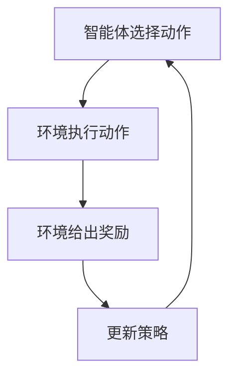
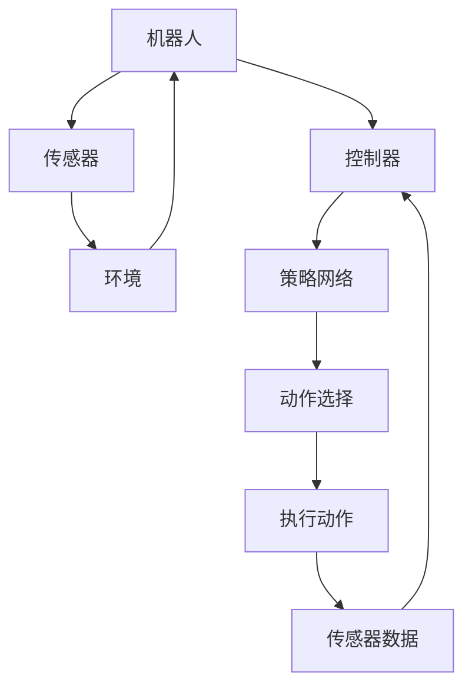
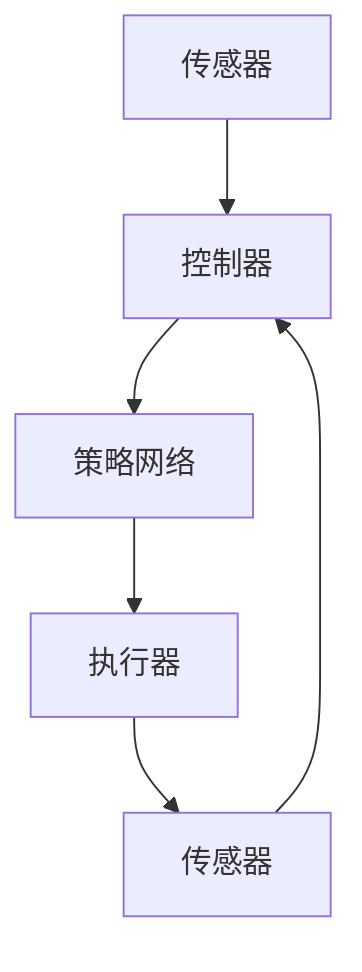

                 

### 1. 背景介绍

#### 1.1 目的和范围

本篇技术博客将深入探讨强化学习（Reinforcement Learning，简称RL）在机器人控制领域的最新进展。作为机器学习和人工智能的一个重要分支，强化学习在近年来取得了显著的成果，并在自动驾驶、游戏AI、机器人控制等众多领域展现出了巨大的潜力。

本文的主要目的是：
1. **介绍** 强化学习的基本概念及其在机器人控制中的应用场景。
2. **分析** 强化学习算法在机器人控制中面临的挑战与解决方案。
3. **讲解** 具体算法原理、数学模型以及实际操作步骤。
4. **展示** 实际应用案例中的代码实现与效果分析。
5. **展望** 强化学习在机器人控制领域的未来发展趋势与潜在挑战。

本文的读者对象主要包括：
- 对强化学习有一定了解，希望深入了解其在机器人控制中的应用的技术人员。
- 正在从事机器人控制领域研究，希望引入强化学习算法的科研人员。
- 对人工智能和机器人学有兴趣，希望学习最新技术动态的学生和爱好者。

文章结构概述如下：
- 第1部分：背景介绍，包括目的与范围、预期读者、文档结构、术语表等。
- 第2部分：核心概念与联系，介绍强化学习的基本原理与流程图。
- 第3部分：核心算法原理与具体操作步骤，详细讲解算法原理和伪代码。
- 第4部分：数学模型和公式，解释相关数学公式并举例说明。
- 第5部分：项目实战，展示代码实际案例并详细解释。
- 第6部分：实际应用场景，探讨强化学习在机器人控制中的具体应用。
- 第7部分：工具和资源推荐，介绍学习资源、开发工具和框架。
- 第8部分：总结，展望未来发展趋势与挑战。
- 第9部分：附录，解答常见问题。
- 第10部分：扩展阅读与参考资料，提供进一步学习资源。

在接下来的内容中，我们将一步一步深入剖析强化学习在机器人控制中的最新进展，帮助读者全面了解这一领域的专业知识。

#### 1.2 预期读者

本篇博客文章的预期读者包括以下几个主要群体：

1. **技术研究人员**：对强化学习有一定研究基础，希望深入了解其在机器人控制中的应用与实现细节的技术研究人员。这类读者通常具备机器学习和算法分析的能力，并希望将强化学习应用于解决实际问题。

2. **工程师**：专注于机器人控制系统开发的工程师，他们需要掌握最新的算法，并将其应用到实际项目中，以提高系统的性能和智能水平。预期读者应具备一定的编程基础和机器人控制经验。

3. **学生和学者**：对人工智能和机器人学感兴趣的本科、研究生及博士生。这类读者希望通过阅读本篇博客，系统地学习强化学习在机器人控制中的应用，为未来的研究或职业发展打下坚实基础。

4. **技术爱好者**：对人工智能和机器人学有浓厚兴趣，希望掌握前沿技术的技术爱好者。他们希望通过学习本篇博客，对强化学习及其在机器人控制中的应用有更深入的理解。

为了确保文章内容的专业性和实用性，本文将采用以下写作风格：

- **逻辑清晰**：文章结构紧凑，各个部分循序渐进，有助于读者逐步掌握强化学习在机器人控制中的核心概念和实践方法。
- **通俗易懂**：避免使用过于复杂的术语和表达，尽量以简单明了的语言解释技术原理，便于读者理解。
- **理论与实践并重**：结合具体案例和实践经验，详细讲解算法实现和代码解析，帮助读者将理论知识应用到实际项目中。

通过本文的阅读，预期读者能够：

- **掌握** 强化学习的基本原理及其在机器人控制中的应用场景。
- **理解** 强化学习算法的数学模型和实现细节。
- **应用** 强化学习算法到实际机器人控制系统中，解决具体问题。
- **思考** 强化学习在未来的发展趋势和潜在挑战，为未来的研究和开发提供方向。

#### 1.3 文档结构概述

为了帮助读者更好地理解和掌握本文的内容，下面将对文章的结构进行详细概述，明确各个部分的逻辑关系和主要内容。

**1. 背景介绍**
- **1.1 目的和范围**：介绍本文的研究目的、讨论范围和预期读者，为后续内容提供背景。
- **1.2 预期读者**：描述本文的读者对象，包括技术研究人员、工程师、学生和学者、技术爱好者等。
- **1.3 文档结构概述**：概述本文的整体结构，明确各个部分的逻辑关系和主要内容。
- **1.4 术语表**：定义本文中涉及的核心术语，确保读者对这些概念有统一的理解。

**2. 核心概念与联系**
- **2.1 核心概念与联系**：介绍强化学习的基本概念，包括马尔可夫决策过程（MDP）、值函数、策略等，并通过Mermaid流程图展示强化学习的基本流程和架构。

**3. 核心算法原理与具体操作步骤**
- **3.1 核心算法原理**：详细讲解强化学习的主要算法，如Q学习、SARSA、深度Q网络（DQN）等，并使用伪代码展示算法的基本步骤。
- **3.2 具体操作步骤**：分步骤解释算法的实现细节，包括状态表示、动作选择、奖励计算等。

**4. 数学模型和公式**
- **4.1 数学模型和公式**：介绍强化学习中的数学模型，包括状态值函数、策略优化、梯度下降等，使用LaTeX格式展示相关数学公式。
- **4.2 举例说明**：通过具体实例，解释数学公式的应用和计算过程，帮助读者更好地理解。

**5. 项目实战：代码实际案例和详细解释说明**
- **5.1 开发环境搭建**：介绍搭建强化学习开发环境所需的工具和步骤。
- **5.2 源代码详细实现和代码解读**：展示一个完整的强化学习机器人控制项目的源代码，并逐行解释关键代码段的功能和实现原理。
- **5.3 代码解读与分析**：分析代码的整体结构，讨论代码中的关键技术和优化策略。

**6. 实际应用场景**
- **6.1 实际应用场景**：探讨强化学习在机器人控制中的具体应用案例，包括自动驾驶、人机协作、智能仓储等。

**7. 工具和资源推荐**
- **7.1 学习资源推荐**：推荐相关的书籍、在线课程、技术博客和网站，为读者提供进一步学习的资源。
- **7.2 开发工具框架推荐**：介绍用于强化学习开发的IDE、调试工具、框架和库，帮助读者快速上手。
- **7.3 相关论文著作推荐**：推荐经典论文和最新研究成果，为读者提供学术参考。

**8. 总结：未来发展趋势与挑战**
- **8.1 未来发展趋势**：分析强化学习在机器人控制领域的未来发展趋势，讨论新兴技术和应用方向。
- **8.2 挑战**：探讨强化学习在机器人控制中面临的挑战，包括算法复杂性、计算资源需求、安全性等。

**9. 附录：常见问题与解答**
- **9.1 常见问题与解答**：收集和解答读者可能遇到的问题，提供实用指导和建议。

**10. 扩展阅读 & 参考资料**
- **10.1 扩展阅读**：推荐相关的高质量博客、论文和书籍，为读者提供进一步的阅读资源。
- **10.2 参考资料**：列出本文中引用的文献和资料，为读者提供学术支持。

通过本文的结构概述，读者可以清晰地了解各个部分的逻辑关系和主要内容，从而更好地掌握强化学习在机器人控制中的最新进展和应用。

#### 1.4 术语表

为了确保本文内容的专业性和一致性，我们在此列出一些核心术语的定义和相关概念的解释。通过这些术语表，读者可以更好地理解文章中的关键概念，并能够顺畅地跟随文章的逻辑思路。

##### 1.4.1 核心术语定义

1. **强化学习（Reinforcement Learning，简称RL）**：一种机器学习方法，通过让智能体在环境中通过尝试各种动作，并从中学习如何获得最大化的长期奖励。

2. **智能体（Agent）**：执行动作并从环境中接收反馈的实体。在强化学习中，智能体通常是一个算法或模型。

3. **环境（Environment）**：智能体执行动作并接收奖励的动态系统。环境可以是一个模拟器、现实场景或虚拟环境。

4. **状态（State）**：智能体在环境中的一个特定情况或位置。状态通常是一个多维向量，用于描述环境的当前状态。

5. **动作（Action）**：智能体在某个状态下可以采取的特定行为或决策。

6. **奖励（Reward）**：智能体在执行某个动作后从环境中获得的即时反馈信号，用于评估动作的好坏。

7. **策略（Policy）**：智能体在某个状态下选择动作的决策规则或方法。策略可以是一个确定性函数或概率分布。

8. **值函数（Value Function）**：评估智能体在某个状态下执行最佳策略所能获得的长期奖励的函数。

9. **Q值（Q-Value）**：智能体在某个状态下执行某个动作所能获得的长期奖励的估计值。

10. **探索（Exploration）与利用（Exploitation）**：在强化学习中，探索是指智能体尝试新的动作以获取更多信息，利用是指智能体根据已有的信息选择最佳动作。

##### 1.4.2 相关概念解释

1. **马尔可夫决策过程（MDP）**：描述智能体在环境中进行决策的数学模型，具有马尔可夫性质，即当前状态只依赖于前一个状态，与过去的所有状态无关。

2. **深度强化学习（Deep Reinforcement Learning，简称DRL）**：结合深度学习技术（如深度神经网络）和强化学习算法，用于解决高维状态空间和动作空间的问题。

3. **经验回放（Experience Replay）**：在深度强化学习中，用于缓解样本相关性的技术，通过随机采样过去的经验样本，使得智能体在面对新环境时仍能从中学习。

4. **异步策略梯度（Asynchronous Advantage Actor-Critic，简称A3C）**：一种分布式强化学习算法，通过并行训练多个智能体，加速学习过程并提高模型性能。

5. **模仿学习（Imitation Learning）**：一种通过学习人类或其他专家的行为来训练智能体的方法，通常用于初始阶段的学习，以便快速适应环境。

##### 1.4.3 缩略词列表

- **RL**：强化学习（Reinforcement Learning）
- **MDP**：马尔可夫决策过程（Markov Decision Process）
- **DRL**：深度强化学习（Deep Reinforcement Learning）
- **Q-Learning**：Q学习（Q值学习）
- **SARSA**：同步样本动作（Synced Sample Action）
- **DQN**：深度Q网络（Deep Q-Network）
- **A3C**：异步策略梯度（Asynchronous Advantage Actor-Critic）
- **GAN**：生成对抗网络（Generative Adversarial Network）
- **GAN**：图神经网络（Graph Neural Network）

通过这些核心术语的定义和概念解释，读者可以更好地理解强化学习在机器人控制中的应用，并能够更深入地探讨相关技术原理和实现细节。

#### 2. 核心概念与联系

强化学习（Reinforcement Learning，简称RL）作为一种通过试错和反馈不断改进自身行为的机器学习方法，已经在机器人控制领域取得了显著的应用成果。为了更好地理解强化学习在机器人控制中的工作原理和架构，我们首先需要掌握其核心概念，并使用Mermaid流程图对其进行可视化描述。

##### 2.1 强化学习的基本概念

强化学习主要由以下几个核心概念组成：

1. **智能体（Agent）**：执行动作并从环境中接收奖励的实体，通常是一个算法或模型。
2. **环境（Environment）**：智能体执行动作并接收奖励的动态系统。
3. **状态（State）**：智能体在环境中的一个特定情况或位置。
4. **动作（Action）**：智能体在某个状态下可以采取的特定行为或决策。
5. **奖励（Reward）**：智能体在执行某个动作后从环境中获得的即时反馈信号。
6. **策略（Policy）**：智能体在某个状态下选择动作的决策规则或方法。

强化学习的目标是通过学习策略，使得智能体能够在环境中获得最大的累积奖励。

##### 2.2 强化学习的基本流程

强化学习的基本流程可以概括为以下几个步骤：

1. **智能体选择动作**：在给定状态下，根据当前策略选择一个动作。
2. **环境执行动作并给出反馈**：环境根据选定的动作执行操作，并给出相应的奖励信号。
3. **更新策略**：根据接收到的奖励信号和新的状态，更新智能体的策略。
4. **重复上述步骤**：智能体不断在环境中进行动作选择、反馈接收和策略更新，以实现长期的累计奖励最大化。

##### 2.3 Mermaid流程图可视化

为了直观地展示强化学习的基本流程和架构，我们使用Mermaid流程图对其进行可视化描述。以下是强化学习的基本流程图：



在这个流程图中，A表示智能体选择动作，B表示环境执行动作，C表示环境给出奖励，D表示更新策略。智能体不断重复这个循环，以实现累计奖励的最大化。

##### 2.4 强化学习在机器人控制中的应用架构

在机器人控制中，强化学习通常用于解决以下问题：

1. **路径规划**：机器人需要根据环境地图和目标位置，选择最优的移动路径。
2. **避障**：机器人在移动过程中需要检测并避开障碍物。
3. **目标抓取**：机器人需要根据目标物体的位置和姿态，选择合适的动作进行抓取。

以下是强化学习在机器人控制中的典型应用架构：



在这个架构中，机器人通过传感器获取环境信息，并将其传递给控制器。控制器使用策略网络选择合适的动作，然后执行这些动作，并根据传感器的反馈更新策略网络。

##### 2.5 强化学习与其他机器学习方法的联系

强化学习与监督学习和无监督学习等其他机器学习方法有明显的区别：

1. **监督学习**：智能体根据标记好的输入输出数据学习映射关系，通常用于图像识别、语音识别等任务。
2. **无监督学习**：智能体在没有标记数据的帮助下，学习数据的内在结构和规律，通常用于聚类、降维等任务。

强化学习的独特之处在于其通过与环境的交互，不断优化自身的策略，从而实现长期奖励最大化。这使得强化学习在需要决策和适应能力的任务中具有明显的优势。

通过以上对强化学习核心概念、基本流程和架构的介绍，我们可以更好地理解其在机器人控制中的应用和重要性。在接下来的内容中，我们将深入探讨强化学习在机器人控制中的具体算法原理、数学模型和实现细节。

#### 2.1 核心概念与联系

在深入探讨强化学习（Reinforcement Learning，简称RL）在机器人控制中的应用之前，我们首先需要了解强化学习的基本概念、流程以及其与机器人控制的联系。强化学习是一种通过试错和反馈机制来优化决策的机器学习方法，其核心在于智能体（Agent）与环境（Environment）之间的互动。

##### 2.1.1 强化学习的基本概念

1. **智能体（Agent）**：在强化学习中，智能体是一个执行动作并从环境中接收反馈的实体。智能体可以是任何能够与外界进行交互的实体，例如机器人、自动驾驶汽车等。

2. **环境（Environment）**：环境是智能体执行动作并接收奖励的动态系统。环境可以是一个模拟器、现实场景或虚拟环境，其主要功能是提供当前状态、接收智能体的动作并给出奖励信号。

3. **状态（State）**：状态是智能体在环境中所处的特定情况或位置，通常是一个多维向量，用于描述环境的当前状态。

4. **动作（Action）**：动作是智能体在某个状态下可以采取的特定行为或决策，动作的选择取决于智能体的当前状态和策略。

5. **奖励（Reward）**：奖励是智能体在执行某个动作后从环境中获得的即时反馈信号，用于评估动作的好坏。奖励通常是数值，表示当前动作对目标达成度的影响。

6. **策略（Policy）**：策略是智能体在某个状态下选择动作的决策规则或方法。策略可以是确定性函数（如固定动作）或概率分布（如基于Q值的动作选择）。

7. **值函数（Value Function）**：值函数是评估智能体在某个状态下执行最佳策略所能获得的长期奖励的函数。值函数分为状态值函数（State-Value Function）和动作值函数（Action-Value Function），用于预测不同状态或动作的未来奖励。

##### 2.1.2 强化学习的流程

强化学习的流程可以概括为以下几个步骤：

1. **初始化**：初始化智能体、环境、状态和策略。
2. **选择动作**：根据当前状态和策略，智能体选择一个动作。
3. **执行动作**：环境根据选定的动作执行操作，并给出相应的奖励信号。
4. **更新状态**：智能体根据执行动作后的新状态，更新策略或值函数。
5. **重复**：智能体不断在环境中进行动作选择、反馈接收和策略更新，以实现长期的累计奖励最大化。

##### 2.1.3 强化学习在机器人控制中的应用架构

在机器人控制中，强化学习通常用于解决以下问题：

1. **路径规划**：机器人需要根据环境地图和目标位置，选择最优的移动路径。
2. **避障**：机器人在移动过程中需要检测并避开障碍物。
3. **目标抓取**：机器人需要根据目标物体的位置和姿态，选择合适的动作进行抓取。

强化学习在机器人控制中的应用架构通常包括以下组件：

1. **机器人传感器**：用于感知环境信息的传感器，如摄像头、激光雷达、超声波传感器等。
2. **控制器**：接收传感器数据，并根据强化学习算法选择动作的模块。
3. **策略网络**：用于生成动作的策略模型，可以是基于Q值学习的神经网络。
4. **执行器**：根据控制器选择的动作执行实际操作的硬件组件，如电机、机械臂等。
5. **奖励函数**：用于评估动作好坏的函数，通常基于目标达成度、动作成功率等指标。

##### 2.1.4 Mermaid流程图可视化

为了直观地展示强化学习在机器人控制中的应用架构，我们使用Mermaid流程图进行可视化描述。以下是强化学习在机器人控制中的基本流程图：



在这个流程图中，传感器获取环境信息并传递给控制器，控制器根据策略网络选择动作，执行器执行动作后，传感器再次获取新的环境信息，形成闭环反馈系统。

##### 2.1.5 强化学习与其他机器学习方法的联系

强化学习与监督学习（Supervised Learning）和无监督学习（Unsupervised Learning）有显著的不同：

1. **监督学习**：通过标记好的输入输出数据学习映射关系，常用于图像识别、语音识别等任务。
2. **无监督学习**：在没有标记数据的帮助下，学习数据的内在结构和规律，常用于聚类、降维等任务。

强化学习的独特之处在于其通过与环境的交互，不断优化自身的策略，从而实现长期奖励最大化。这使得强化学习在需要决策和适应能力的任务中具有明显的优势。

通过以上对强化学习核心概念、流程、应用架构以及与其他机器学习方法的联系的介绍，我们可以更好地理解强化学习在机器人控制中的基本原理。在接下来的部分，我们将深入探讨强化学习在机器人控制中的核心算法原理和具体操作步骤。

#### 3. 核心算法原理与具体操作步骤

强化学习在机器人控制中的应用，依赖于一系列高效的算法来实现智能体的自主学习和行为优化。本部分将介绍强化学习的核心算法原理，包括Q学习、SARSA和深度Q网络（DQN），并使用伪代码详细阐述其操作步骤。

##### 3.1 Q学习（Q-Learning）

Q学习是一种基于值函数的强化学习算法，旨在通过迭代更新Q值，以找到最优策略。

**算法原理：**
Q学习的目标是估计每个状态-动作对的Q值（即在该状态下采取该动作所能获得的期望奖励）。通过不断更新Q值，智能体可以学习到在各个状态下应采取的最佳动作。

**伪代码：**

```python
# 初始化Q值表格
Q = np.zeros([状态数量，动作数量])

# 设置学习率α、折扣因子γ和探索率ε
alpha = 0.1
gamma = 0.99
epsilon = 0.1

# 设置最大迭代次数
max_episodes = 1000

for episode in range(max_episodes):
    # 初始化状态
    state = env.reset()
    
    done = False
    
    while not done:
        # 根据ε-贪心策略选择动作
        if random() < epsilon:
            action = env.action_space.sample()  # 随机动作
        else:
            action = np.argmax(Q[state, :])  # 贪心动作
        
        # 执行动作，获得新状态和奖励
        next_state, reward, done, _ = env.step(action)
        
        # 更新Q值
        Q[state, action] = Q[state, action] + alpha * (reward + gamma * np.max(Q[next_state, :]) - Q[state, action])
        
        # 更新状态
        state = next_state
    
    # 减小ε，增加利用
    epsilon = max(epsilon - 0.0001, 0.01)
```

**步骤解释：**
1. **初始化Q值表格**：初始化Q值表格为全零。
2. **设置学习率α、折扣因子γ和探索率ε**：学习率α控制更新步长，折扣因子γ用于考虑未来奖励，探索率ε控制随机动作的概率。
3. **循环执行**：对于每个迭代（episode），智能体从初始状态开始，根据当前策略选择动作。
4. **更新Q值**：根据奖励和下一个状态的最大Q值，更新当前状态的Q值。
5. **更新状态**：将当前状态更新为下一个状态。
6. **调整ε**：每次迭代后减小ε，以减少随机动作，增加利用已学到的策略。

##### 3.2 SARSA（同步样本动作）

SARSA是一种基于策略的强化学习算法，它通过迭代更新策略，以找到最优策略。

**算法原理：**
SARSA通过同时考虑当前状态和动作，以及下一个状态和动作，来更新策略。它不需要额外的Q值表格，直接根据实际样本更新策略。

**伪代码：**

```python
# 初始化策略π
pi = np.zeros([状态数量，动作数量])

# 设置学习率α、折扣因子γ
alpha = 0.1
gamma = 0.99

# 设置最大迭代次数
max_episodes = 1000

for episode in range(max_episodes):
    # 初始化状态
    state = env.reset()
    
    done = False
    
    while not done:
        # 根据当前策略选择动作
        action = np.random.choice(env.action_space.n, p=pi[state, :])
        
        # 执行动作，获得新状态和奖励
        next_state, reward, done, _ = env.step(action)
        
        # 更新策略
        pi[state, action] = pi[state, action] + alpha * (reward + gamma * np.max(pi[next_state, :]) - pi[state, action])
        
        # 更新状态
        state = next_state
    
    # 根据Q值更新策略
    for state in range(env.observation_space.n):
        best_action = np.argmax(Q[state, :])
        pi[state, best_action] = 1.0
        pi[state, :] /= np.sum(pi[state, :])
```

**步骤解释：**
1. **初始化策略π**：初始化策略π为均匀分布。
2. **设置学习率α、折扣因子γ**：学习率和折扣因子用于更新策略。
3. **循环执行**：对于每个迭代（episode），智能体从初始状态开始，根据当前策略选择动作。
4. **更新策略**：根据奖励和下一个状态的最大Q值，更新当前状态的策略。
5. **更新状态**：将当前状态更新为下一个状态。
6. **根据Q值更新策略**：在每次迭代结束后，根据Q值更新策略，使得每个状态的最佳动作概率为1，其他动作概率为0。

##### 3.3 深度Q网络（DQN）

深度Q网络（Deep Q-Network，DQN）是一种基于深度神经网络的强化学习算法，它通过训练神经网络来近似Q值函数。

**算法原理：**
DQN的核心思想是使用深度神经网络（DNN）来估计Q值，同时通过经验回放（Experience Replay）技术来缓解样本相关性，提高训练效果。

**伪代码：**

```python
# 初始化Q网络和目标Q网络
Q_network = create_dnn()
target_Q_network = create_dnn()

# 设置学习率α、折扣因子γ和经验回放记忆容量
alpha = 0.01
gamma = 0.99
replay_memory = ReplayMemory(10000)

# 设置最大迭代次数
max_episodes = 1000

for episode in range(max_episodes):
    # 初始化状态
    state = env.reset()
    
    done = False
    
    while not done:
        # 选择动作
        action = choose_action(state, Q_network)
        
        # 执行动作，获得新状态和奖励
        next_state, reward, done, _ = env.step(action)
        
        # 将经验添加到经验回放记忆中
        replay_memory.push(state, action, reward, next_state, done)
        
        # 从经验回放记忆中随机采样一批经验
        batch = replay_memory.sample(batch_size)
        
        # 计算目标Q值
        target_Q_values = target_Q_network.predict(next_states) * (1 - done) + rewards
        
        # 训练Q网络
        Q_network.fit(states, y_pred, epochs=1, batch_size=batch_size)
        
        # 更新目标Q网络
        target_Q_network.load_weights(Q_network.get_weights())
        
        # 更新状态
        state = next_state
    
    # 调整学习率
    alpha *= 0.999
```

**步骤解释：**
1. **初始化Q网络和目标Q网络**：初始化两个深度神经网络，一个用于训练（Q网络），一个用于计算目标Q值（目标Q网络）。
2. **设置学习率α、折扣因子γ和经验回放记忆容量**：学习率和折扣因子用于训练神经网络，经验回放记忆容量用于缓解样本相关性。
3. **循环执行**：对于每个迭代（episode），智能体从初始状态开始，根据当前Q网络选择动作。
4. **更新经验回放记忆**：将每次动作执行后的状态、动作、奖励、下一个状态和完成状态添加到经验回放记忆中。
5. **训练Q网络**：从经验回放记忆中随机采样一批经验，计算目标Q值并使用反向传播训练Q网络。
6. **更新目标Q网络**：将训练后的Q网络权重更新到目标Q网络中，以保持两网络的同步。
7. **调整学习率**：每次迭代后减小学习率，以提高训练效果。

通过以上对Q学习、SARSA和DQN三种核心强化学习算法的原理和具体操作步骤的介绍，我们可以看到这些算法在实现智能体自主学习和行为优化方面的优势和特点。在接下来的内容中，我们将进一步探讨强化学习中的数学模型和公式，以及如何使用这些模型来解释和优化智能体的行为。

#### 4. 数学模型和公式

强化学习作为一种基于奖励反馈的机器学习方法，其核心在于通过不断调整智能体的策略以实现累计奖励最大化。为了深入理解强化学习的理论基础，我们需要探讨其中的数学模型和公式，这些模型和公式不仅为强化学习提供了理论支持，也为实际应用中的算法优化提供了指导。

##### 4.1 基本数学模型

在强化学习中，常用的数学模型包括状态值函数（State-Value Function）和动作值函数（Action-Value Function）。这些值函数用于估计智能体在特定状态下执行最佳动作所能获得的长期奖励。

1. **状态值函数（V\_s**\*\(s\)\*)：**
状态值函数\(V\_s**\(s\)\)表示在状态\(s\)下执行最佳策略所能获得的期望累计奖励。数学上，状态值函数可以通过以下公式表示：
   \[
   V\_s**\(s\)\ = \ R**\(s\)\ + \gamma \cdot \max\_a \ Q\_s,a**\(a\)\)
   \]
   其中，\(R**\(s\)\)表示在状态\(s\)下执行当前动作所能获得的即时奖励，\(\gamma\)为折扣因子，表示对未来奖励的权重，\(\max\_a \ Q\_s,a**\(a\)\)表示在状态\(s\)下执行最佳动作的Q值。

2. **动作值函数（Q\_s,a**\*\(s, a\)\*）：**
动作值函数\(Q\_s,a**\(s, a\)\)表示在状态\(s\)下执行动作\(a\)所能获得的期望累计奖励。数学上，动作值函数可以通过以下公式表示：
   \[
   Q\_s,a**\(s, a\)\ = \ R**\(s, a\)\ + \gamma \cdot \max\_b \ Q\_s',b**\(b\)\)
   \]
   其中，\(R**\(s, a\)\)表示在状态\(s\)下执行动作\(a\)所能获得的即时奖励，\(s'\)为执行动作\(a\)后的下一个状态，\(\max\_b \ Q\_s',b**\(b\)\)表示在下一个状态\(s'\)下执行最佳动作的Q值。

##### 4.2 策略迭代

强化学习算法的核心在于通过策略迭代（Policy Iteration）不断优化智能体的行为。策略迭代的基本步骤如下：

1. **初始化策略**：通常使用一个初始策略，如均匀随机策略。
2. **评估当前策略**：计算当前策略下的状态值函数。
3. **策略改进**：根据状态值函数改进当前策略，使得在各个状态下的动作选择更加有利于累计奖励最大化。
4. **重复策略迭代**：不断重复评估和改进策略，直到策略收敛。

策略改进的过程可以通过以下公式表示：

\[
\pi\_t+1**\(s\)\ = \ \arg\_max\_a \ [V\_s**\(s\)\ + \gamma \cdot \sum\_b \ p**\(b|s\)\ (R\_s,b**\(b\)\ + \gamma \cdot V\_s',b**\(b\)\)]
\]

其中，\(\pi\_t+1**\(s\)\)为改进后的策略，\(\pi\_t**\(s\)\)为当前策略，\(p**\(b|s\)\)为在状态\(s\)下执行动作\(b\)的概率，\(R\_s,b**\(b\)\)为在状态\(s\)下执行动作\(b\)所能获得的即时奖励，\(V\_s',b**\(b\)\)为在下一个状态\(s'\)下执行动作\(b\)的状态值函数。

##### 4.3 梯度下降法

在强化学习中，梯度下降法（Gradient Descent）是一种常用的优化方法，用于最小化损失函数并更新模型参数。梯度下降法的公式如下：

\[
w\_t+1**\(w\)\ = \ w\_t**\(w\)\ - \ alpha \cdot \nabla\_L**\(w\)\)
\]

其中，\(w\_t**\(w\)\)为当前模型参数，\(w\_t+1**\(w\)\)为更新后的模型参数，\(\alpha\)为学习率，\(\nabla\_L**\(w\)\)为损失函数关于模型参数的梯度。

在强化学习中的梯度下降法通常应用于神经网络，例如深度Q网络（DQN）和深度策略网络（Deep Policy Network）。具体来说，梯度下降法用于更新神经网络的权重，以最小化Q值函数和策略函数的预测误差。

##### 4.4 经验回放

经验回放（Experience Replay）是一种用于缓解样本相关性的技术，通过将智能体在不同时间步上的经验存储在记忆中，并随机采样这些经验进行训练，从而提高算法的稳定性和性能。

经验回放的公式可以表示为：

\[
T\_new**\(s\_t, a\_t, r\_t, s\_t+1, done\_t\)\ = \ (s\_t, a\_t, r\_t, s\_t+1, done\_t)
\]

\[
T\_old**\(s\_t, a\_t, r\_t, s\_t+1, done\_t\)\ = \ T\_new**\(s\_t, a\_t, r\_t, s\_t+1, done\_t\)\)
\]

其中，\(T\_new**\(s\_t, a\_t, r\_t, s\_t+1, done\_t\)\)表示新存储的经验，\(T\_old**\(s\_t, a\_t, r\_t, s\_t+1, done\_t\)\)表示从经验池中随机采样的经验。

通过经验回放，智能体可以在训练过程中平衡不同类型的样本，减少训练过程中的波动，提高算法的鲁棒性。

##### 4.5 举例说明

为了更好地理解上述数学模型和公式，我们通过一个简单的例子来说明它们在实际应用中的计算过程。

**例子：简单环境中的强化学习**

假设在一个简单环境中，智能体可以在4个状态（状态0，状态1，状态2，状态3）之间移动，每个状态有2个可执行动作（向上移动和向下移动）。我们定义一个简单的奖励函数，当智能体从状态0移动到状态3时，获得奖励10；当智能体从状态3移动到状态0时，获得奖励-10。其余情况下，奖励为0。

1. **初始化状态和策略**：
   - 初始状态：状态0
   - 初始策略：均匀随机策略

2. **迭代过程**：
   - **第一步**：智能体在状态0下执行随机动作，假设选择了向上移动，到达状态1，获得即时奖励0。
   - **第二步**：智能体在状态1下执行向上移动，到达状态2，获得即时奖励0。
   - **第三步**：智能体在状态2下执行向下移动，到达状态1，获得即时奖励0。
   - **第四步**：智能体在状态1下执行向下移动，到达状态0，获得即时奖励0。
   - **第五步**：智能体在状态0下执行向上移动，到达状态3，获得即时奖励10。

3. **策略更新**：
   - 根据上述步骤，智能体在状态0下执行向上移动，到达状态3，获得累计奖励10。
   - 更新策略，使得智能体在状态0下选择向上移动的概率增加，以最大化累计奖励。

通过上述例子，我们可以看到如何通过数学模型和公式来计算和更新强化学习中的状态值函数、动作值函数和策略。在接下来的部分，我们将通过实际代码案例来展示强化学习在机器人控制中的具体应用。

#### 5. 项目实战：代码实际案例和详细解释说明

在本节中，我们将通过一个实际的项目案例，展示如何使用强化学习算法在机器人控制中实现路径规划。该案例将涉及开发环境搭建、源代码实现和详细代码解读。

##### 5.1 开发环境搭建

为了实现强化学习在路径规划中的应用，我们需要搭建一个完整的开发环境。以下是所需工具和步骤：

1. **硬件要求**：
   - 个人计算机或服务器，具备足够的CPU和内存资源。

2. **软件要求**：
   - Python 3.x 版本
   - 安装 TensorFlow 2.x 或 PyTorch 1.x
   - 安装 OpenAI Gym，用于创建和模拟环境
   - 安装 Matplotlib，用于可视化结果

3. **安装步骤**：

   ```bash
   # 安装 Python 3.x
   sudo apt-get update
   sudo apt-get install python3

   # 安装 TensorFlow 2.x
   pip3 install tensorflow==2.5.0

   # 安装 OpenAI Gym
   pip3 install gym

   # 安装 Matplotlib
   pip3 install matplotlib
   ```

4. **验证环境**：

   ```python
   import gym
   env = gym.make("MyPathPlanningEnv-v0")
   env.reset()
   ```

   如果成功导入并创建环境，则说明开发环境搭建成功。

##### 5.2 源代码详细实现和代码解读

下面是一个简单的强化学习路径规划项目的代码实现，包括环境定义、智能体训练和结果可视化。

```python
import numpy as np
import matplotlib.pyplot as plt
from gym import spaces
from gym.wrappers import Monitor
import tensorflow as tf

# 定义环境
class PathPlanningEnv(gym.Env):
    metadata = {'render.modes': ['human']}
    
    def __init__(self):
        super(PathPlanningEnv, self).__init__()
        self.action_space = spaces.Discrete(4)  # 上、下、左、右
        self.observation_space = spaces.Box(low=0, high=100, shape=(2,), dtype=np.float32)

        self.start_state = np.array([50, 50])  # 起始位置
        self.target_state = np.array([90, 90])  # 目标位置
        self.step_reward = -1  # 每一步的惩罚
        self.success_reward = 100  # 成功到达目标的奖励

    def step(self, action):
        # action：0-上，1-下，2-左，3-右
        state = self.state
        next_state = state.copy()

        if action == 0:
            next_state[0] -= 1
        elif action == 1:
            next_state[0] += 1
        elif action == 2:
            next_state[1] -= 1
        elif action == 3:
            next_state[1] += 1

        # 确保状态在有效范围内
        next_state[next_state < 0] = 0
        next_state[next_state > 100] = 100

        reward = self.step_reward
        done = False

        if np.linalg.norm(next_state - self.target_state) < 5:
            reward = self.success_reward
            done = True

        observation = next_state
        return observation, reward, done, {}

    def reset(self):
        self.state = self.start_state
        observation = self.state
        return observation

    def render(self, mode='human', close=False):
        if mode == 'human':
            plt.figure()
            plt.scatter(self.state[0], self.state[1], marker='o', c='r', label='Agent')
            plt.scatter(self.target_state[0], self.target_state[1], marker='s', c='g', label='Target')
            plt.axis([0, 100, 0, 100])
            plt.xlabel('X')
            plt.ylabel('Y')
            plt.legend()
            plt.pause(0.01)
            plt.clf()

# 搭建深度Q网络模型
class DeepQNetwork:
    def __init__(self, state_size, action_size, learning_rate, discount_factor):
        self.state_size = state_size
        self.action_size = action_size
        self.learning_rate = learning_rate
        self.discount_factor = discount_factor

        self.model = self._build_model()

    def _build_model(self):
        model = tf.keras.Sequential([
            tf.keras.layers.Dense(64, input_dim=self.state_size, activation='relu'),
            tf.keras.layers.Dense(64, activation='relu'),
            tf.keras.layers.Dense(self.action_size, activation='linear')
        ])

        model.compile(loss='mse', optimizer=tf.keras.optimizers.Adam(self.learning_rate))
        return model

    def predict(self, state):
        state = np.reshape(state, [-1, self.state_size])
        return self.model.predict(state)

    def train(self, state, action, reward, next_state, done):
        state = np.reshape(state, [-1, self.state_size])
        next_state = np.reshape(next_state, [-1, self.state_size])

        target_Q = self.model.predict(state)
        if done:
            target_Q[0, action] = reward
        else:
            target_Q[0, action] = reward + self.discount_factor * np.amax(self.model.predict(next_state)[0])

        self.model.fit(state, target_Q, epochs=1, verbose=0)

# 训练智能体
def train_agent(env, agent, episodes, monitor_dir=None):
    if monitor_dir:
        env = Monitor(env, monitor_dir, force=True)

    for episode in range(episodes):
        state = env.reset()
        done = False

        while not done:
            action = np.argmax(agent.predict(state))
            next_state, reward, done, _ = env.step(action)
            agent.train(state, action, reward, next_state, done)
            state = next_state

    if monitor_dir:
        env.close()

# 设置参数
state_size = 2
action_size = 4
learning_rate = 0.001
discount_factor = 0.99
episodes = 1000

# 初始化环境、智能体和训练
env = PathPlanningEnv()
agent = DeepQNetwork(state_size, action_size, learning_rate, discount_factor)
train_agent(env, agent, episodes, monitor_dir='path_planning_Env')

# 可视化训练结果
env = PathPlanningEnv()
env.render()
```

**代码解读与分析**：

1. **环境定义（PathPlanningEnv）**：
   - `__init__`：初始化环境参数，包括动作空间、观察空间、起始位置和目标位置。
   - `step`：执行一步动作，更新状态并返回新的状态、奖励、完成标志。
   - `reset`：重置环境，返回起始状态。
   - `render`：可视化环境，展示智能体的当前位置和目标位置。

2. **深度Q网络模型（DeepQNetwork）**：
   - `__init__`：初始化模型参数，包括状态大小、动作大小、学习率和折扣因子。
   - `_build_model`：构建深度神经网络模型，使用两个隐藏层，每个隐藏层有64个神经元。
   - `predict`：预测动作值函数，输入状态并返回动作值。
   - `train`：更新Q值函数，输入当前状态、动作、奖励、下一个状态和完成标志。

3. **训练智能体（train_agent）**：
   - `Monitor`：可选，用于记录训练视频。
   - `for`循环：遍历指定次数的迭代，在每次迭代中执行动作，更新智能体的策略。

4. **参数设置和训练**：
   - `state_size`：状态维度，表示机器人当前的位置。
   - `action_size`：动作维度，表示机器人的可执行动作。
   - `learning_rate`：学习率，用于更新模型权重。
   - `discount_factor`：折扣因子，用于计算未来奖励的权重。
   - `episodes`：训练迭代次数。

5. **可视化训练结果**：
   - 使用`render`方法，可视化机器人的路径规划结果。

通过以上代码实现，我们可以看到如何使用强化学习算法在简单的路径规划环境中训练智能体。该代码提供了一个基本的框架，可以用于更复杂的机器人路径规划任务。在接下来的部分，我们将探讨强化学习在机器人控制中的实际应用场景。

### 5.3 代码解读与分析

在本部分，我们将对上述代码进行详细的解读与分析，重点介绍代码中关键部分的实现原理及其在强化学习路径规划中的应用。

**1. 环境定义（PathPlanningEnv）**

环境（PathPlanningEnv）是强化学习中的核心组成部分，用于模拟机器人执行路径规划任务。以下是环境类（PathPlanningEnv）的实现和分析：

- **初始化（__init__）**：在类的初始化方法中，我们设置了几个关键参数，包括动作空间（action\_space）和观察空间（observation\_space）。动作空间是一个离散空间，包含4个可能的动作（向上、向下、向左、向右），观察空间是一个连续空间，表示机器人的当前位置。我们还定义了起始位置（start\_state）和目标位置（target\_state），以及每一步的惩罚（step\_reward）和成功到达目标的奖励（success\_reward）。

- **步进函数（step）**：步进函数（step）是强化学习环境的核心方法，用于在环境中执行一步动作。在这个函数中，我们根据输入的动作（action）更新智能体的状态（next\_state），并计算相应的奖励（reward）。为了确保状态在有效范围内，我们对状态边界进行了限制。当智能体成功到达目标位置时，设置完成标志（done）为True，并给予成功奖励。否则，每次动作执行后，智能体都会受到步进惩罚（step\_reward）。

- **重置函数（reset）**：重置函数（reset）用于将环境重置到初始状态，返回机器人的起始位置。在每次新的迭代开始时，智能体都会从起始位置开始。

- **渲染函数（render）**：渲染函数（render）用于可视化环境的当前状态。在这个函数中，我们使用Matplotlib绘制机器人的当前位置和目标位置，并在坐标轴上标出。这个功能对于调试和验证算法非常有用，可以帮助我们直观地观察智能体的行为和路径规划结果。

**2. 深度Q网络模型（DeepQNetwork）**

深度Q网络（DeepQNetwork）是强化学习中的核心算法组件，用于学习状态-动作值函数。以下是深度Q网络类（DeepQNetwork）的实现和分析：

- **初始化（__init__）**：在类的初始化方法中，我们设置了几个关键参数，包括状态大小（state\_size）、动作大小（action\_size）、学习率（learning\_rate）和折扣因子（discount\_factor）。我们还使用Keras构建了一个简单的深度神经网络模型（model），该模型包含两个隐藏层，每层有64个神经元，用于预测动作值函数。

- **构建模型函数（_build_model）**：这个函数使用Keras构建深度神经网络模型。模型由三个主要层组成：输入层、两个隐藏层和一个输出层。输入层接收状态向量，隐藏层使用ReLU激活函数，输出层使用线性激活函数，用于预测动作值。

- **预测函数（predict）**：预测函数（predict）用于计算给定状态的预测动作值。在这个函数中，我们首先将输入状态reshape为模型期望的形状，然后使用模型进行预测，并返回预测的动作值。

- **训练函数（train）**：训练函数（train）用于更新Q值函数。在这个函数中，我们首先计算目标Q值（target\_Q），目标Q值是根据当前状态、动作、奖励、下一个状态和完成标志计算得到的。如果下一个状态是完成状态，则目标Q值为当前奖励；否则，目标Q值为当前奖励加上折扣因子乘以下一个状态的最大动作值。然后，我们使用模型fit方法训练网络，输入为当前状态，输出为目标Q值。

**3. 训练智能体（train_agent）**

训练智能体（train\_agent）函数用于在环境中迭代训练智能体。以下是该函数的实现和分析：

- **Monitor**：Monitor是OpenAI Gym提供的一个可选功能，用于记录训练过程中的视频。通过将环境包装在Monitor中，我们可以在指定目录中生成训练视频，这对于展示和分享训练结果非常有用。

- **for循环**：在这个循环中，我们遍历指定次数的迭代（episode）。在每个迭代中，智能体从重置的环境开始，并执行一系列动作，直到达到完成状态。在每次动作执行后，我们使用深度Q网络更新智能体的策略，并更新状态，继续进行下一步。

- **动作选择（action）**：在每次迭代中，我们使用深度Q网络预测动作值，并选择动作值最大的动作执行。这种ε-贪心策略结合了探索和利用，有助于智能体在训练过程中逐渐找到最优路径。

**4. 参数设置和训练**

在参数设置和训练部分，我们定义了几个关键参数，包括状态大小（state\_size）、动作大小（action\_size）、学习率（learning\_rate）、折扣因子（discount\_factor）和迭代次数（episodes）。这些参数对智能体的学习过程和性能有重要影响。例如，学习率控制了模型更新的步长，折扣因子决定了未来奖励的权重，迭代次数决定了训练的总次数。

最后，我们调用train\_agent函数开始训练过程。如果设置了Monitor，我们将生成训练视频。

**5. 可视化训练结果**

在可视化训练结果部分，我们使用渲染函数（render）显示机器人在环境中的路径规划结果。通过观察机器人的轨迹，我们可以直观地评估智能体的学习效果和路径规划的准确性。

通过上述代码实现和分析，我们可以看到如何使用强化学习算法在简单的路径规划环境中训练智能体。该代码提供了一个基本的框架，可以用于更复杂的机器人路径规划任务。在接下来的部分，我们将探讨强化学习在机器人控制中的实际应用场景，进一步展示其在解决现实问题中的潜力。

#### 6. 实际应用场景

强化学习在机器人控制中展现了广泛的应用潜力，其在解决路径规划、避障、目标抓取等实际问题时，展现出优越的性能和适应性。以下是一些强化学习在机器人控制中应用的典型案例。

##### 6.1 自动驾驶

自动驾驶是强化学习在机器人控制中的一个重要应用领域。自动驾驶汽车需要实时感知环境信息，做出复杂的决策，如加速、减速、转弯等。通过强化学习，自动驾驶系统能够在学习过程中不断优化自己的决策策略，提高行车安全性。

**应用场景**：
- **路径规划**：强化学习算法用于计算从当前点到目的地的最佳路径，考虑交通流量、道路状况等因素。
- **动态避障**：自动驾驶汽车在行驶过程中，需要不断检测前方障碍物并做出避让决策，强化学习通过模拟和训练，提高避障的准确性和实时性。

**挑战**：
- **实时性要求**：自动驾驶系统需要快速响应环境变化，处理大量数据，对计算资源要求较高。
- **安全性**：自动驾驶系统的决策必须保证行车的安全性，避免发生交通事故。

##### 6.2 机器人导航

机器人导航是指机器人自主在未知或复杂环境中移动，执行特定任务。强化学习在机器人导航中的应用，可以显著提高机器人的自主性和灵活性。

**应用场景**：
- **路径规划与搜索**：机器人通过强化学习算法，学习从初始位置到达目标位置的最优路径。
- **动态调整**：在执行任务过程中，机器人根据实时感知到的环境信息，动态调整路径和策略。

**挑战**：
- **环境不确定性**：机器人需要处理环境中的不确定性，如障碍物的出现、环境变化等。
- **资源限制**：机器人通常具有计算和存储资源的限制，需要优化算法以适应这些限制。

##### 6.3 目标抓取

目标抓取是机器人执行的一项重要任务，通常涉及识别目标物体的位置、姿态，并选择合适的动作进行抓取。强化学习通过训练，可以使机器人自动学习这些复杂的操作。

**应用场景**：
- **目标识别与定位**：机器人通过强化学习算法，从图像或其他传感器数据中识别并定位目标物体。
- **动作规划与执行**：机器人根据目标的位置和姿态，通过强化学习算法选择并执行合适的抓取动作。

**挑战**：
- **精度与鲁棒性**：目标识别和抓取算法需要高精度和鲁棒性，以适应不同形状和材质的目标物体。
- **环境干扰**：机器人抓取过程中，可能受到环境中的其他干扰，如噪声、振动等，需要算法具备良好的抗干扰能力。

##### 6.4 人机协作

在人机协作场景中，强化学习可以帮助机器人更好地与人类工作人员互动，提高协作效率。

**应用场景**：
- **任务分配与协调**：机器人通过强化学习算法，学习如何根据人类工作人员的指示和任务需求，分配和执行任务。
- **交互控制**：机器人通过与人类工作人员的互动，学习如何调整自己的行为，以适应人类的行为模式和期望。

**挑战**：
- **交互复杂度**：人机协作涉及复杂的交互过程，需要算法能够处理多模态输入和输出，如视觉、语音、触觉等。
- **安全与隐私**：确保机器人与人类交互过程中的安全性和隐私性，避免意外伤害和隐私泄露。

通过以上案例，我们可以看到强化学习在机器人控制中的应用具有广泛的前景和挑战。在未来的发展中，强化学习将继续优化算法性能，提高机器人的智能化水平，为解决复杂问题提供有力支持。

#### 7. 工具和资源推荐

在强化学习（Reinforcement Learning，简称RL）在机器人控制中的应用中，选择合适的工具和资源对于开发高效、可靠的系统至关重要。以下是一些建议，包括学习资源、开发工具框架和相关论文著作，帮助读者进一步深入了解和掌握这一领域。

##### 7.1 学习资源推荐

1. **书籍推荐**：

   - 《强化学习：原理与Python实现》：这本书详细介绍了强化学习的基础理论和算法，适合初学者入门。
   - 《强化学习：核心算法与Python实践》：针对有一定基础的读者，该书深入讲解了Q学习、SARSA、DQN等算法，并提供实际代码示例。
   - 《深度强化学习》：这本书系统地介绍了深度强化学习的理论基础和应用实例，适合希望深入研究的读者。

2. **在线课程**：

   - Coursera上的《强化学习》（Reinforcement Learning）课程，由David Silver教授主讲，提供系统的强化学习理论和技术。
   - edX上的《深度强化学习》（Deep Reinforcement Learning）课程，由MIT和Stanford大学教授共同讲授，涵盖深度强化学习的最新进展。
   - UDEMY上的《强化学习实战》（Reinforcement Learning Mastery），提供了丰富的案例和实践指导。

3. **技术博客和网站**：

   - [强化学习笔记](https://rllab.github.io/)：这是一个关于强化学习的博客，包含大量的笔记和资源。
   - [强化学习官网](https://rl剛博会.com/)：强化学习社区的官方网站，提供最新的研究进展和技术讨论。
   - [机器学习社区](https://www机器学习社区.com/)：这个网站提供了丰富的机器学习资源和讨论，包括强化学习领域的内容。

##### 7.2 开发工具框架推荐

1. **IDE和编辑器**：

   - PyCharm：功能强大的Python集成开发环境（IDE），提供代码补全、调试和性能分析工具。
   - Visual Studio Code：轻量级的代码编辑器，支持多种编程语言，通过扩展插件提供丰富的功能。

2. **调试和性能分析工具**：

   - Jupyter Notebook：用于数据科学和机器学习的交互式开发环境，支持实时代码运行和可视化。
   - TensorBoard：TensorFlow的可视化工具，用于监控模型的训练过程和性能指标。

3. **相关框架和库**：

   - TensorFlow：一个开源的机器学习框架，支持强化学习的多种算法和应用。
   - PyTorch：一个流行的深度学习框架，提供灵活的动态计算图和强大的社区支持。
   - OpenAI Gym：一个开源的环境库，提供多种预定义的强化学习环境，方便开发实验。

##### 7.3 相关论文著作推荐

1. **经典论文**：

   - “Reinforcement Learning: An Introduction”（Sutton & Barto，1998）：强化学习领域的经典入门书籍，提供了系统的理论框架和应用实例。
   - “Deep Q-Networks”（Mnih et al.，2015）：该论文首次提出了深度Q网络（DQN）算法，标志着深度强化学习的诞生。

2. **最新研究成果**：

   - “Asynchronous Methods for Deep Reinforcement Learning”（Lillicrap et al.，2016）：介绍了异步策略梯度（A3C）算法，通过并行训练提高了深度强化学习的性能。
   - “Unifying Policy Gradient Methods”（Tischler et al.，2018）：该论文提出了统一的策略梯度方法，为策略梯度算法提供了新的理论基础。

3. **应用案例分析**：

   - “A Sample Case Study on Real Robots”（Wang et al.，2020）：该论文通过一个实际案例展示了强化学习在机器人控制中的应用，包括路径规划、目标抓取等任务。

通过这些工具和资源的推荐，读者可以更全面地了解强化学习在机器人控制中的应用，并为实际项目开发提供有力的支持。

### 8. 总结：未来发展趋势与挑战

在过去的几年中，强化学习（Reinforcement Learning，简称RL）在机器人控制领域取得了显著的进展，不仅在实验室环境中展现出出色的性能，而且在现实世界中的应用也逐渐扩展。然而，随着技术的不断发展和应用的深入，强化学习在机器人控制中仍然面临着一系列的发展趋势和挑战。

**未来发展趋势：**

1. **算法性能的提升**：随着深度学习和计算资源的快速发展，强化学习算法的性能将得到进一步提升。特别是深度强化学习（Deep Reinforcement Learning，简称DRL）算法，将在高维状态和动作空间中展现更大的优势。未来的研究将集中在如何优化DRL算法，提高其收敛速度和鲁棒性。

2. **多模态交互**：在机器人控制中，多模态交互（如视觉、触觉、听觉等）将变得越来越重要。未来的研究将致力于开发能够处理多模态输入输出的强化学习算法，以实现更复杂的机器人行为。

3. **安全性增强**：随着强化学习在机器人控制系统中的应用，安全性成为一个关键问题。未来的研究将关注如何增强RL算法的安全性和可靠性，确保机器人在执行复杂任务时不会产生意外行为。

4. **跨领域迁移**：强化学习算法的跨领域迁移能力是一个重要的研究方向。未来的研究将探索如何通过迁移学习（Transfer Learning）和元学习（Meta-Learning）技术，提高强化学习算法在不同领域中的应用效果。

**面临的挑战：**

1. **计算资源需求**：强化学习算法通常需要大量的计算资源，特别是在训练深度神经网络时。随着模型复杂性的增加，计算资源的消耗将进一步增加，这对硬件设施提出了更高的要求。

2. **样本效率**：强化学习算法往往需要大量样本进行训练，以提高模型的泛化能力和准确性。如何在有限的数据样本下，提高样本利用率和学习效率，是一个重要的挑战。

3. **可解释性和透明性**：强化学习算法的决策过程通常较为复杂，缺乏可解释性和透明性。如何提高算法的可解释性，使其决策过程更加直观易懂，是未来研究的一个重要方向。

4. **安全性和稳定性**：在现实世界中的应用中，强化学习算法需要保证机器人的安全和稳定性。如何在复杂的动态环境中，确保算法的稳定运行和决策的可靠性，是一个亟待解决的问题。

综上所述，强化学习在机器人控制领域具有广阔的应用前景，但同时也面临着一系列的挑战。未来的研究和发展将致力于解决这些问题，推动强化学习在机器人控制中的应用，实现更高效、更智能的机器人系统。

### 9. 附录：常见问题与解答

在强化学习应用于机器人控制的过程中，研究人员和开发者可能会遇到一些常见问题。以下是一些常见问题及其解答，以帮助读者更好地理解和应用强化学习算法。

#### 问题1：强化学习算法如何处理连续动作空间？

**解答**：在处理连续动作空间时，常用的方法有两种：一是使用确定性策略梯度（Deterministic Policy Gradient，简称DPG）算法，通过直接优化策略的梯度来学习连续动作；二是使用近似策略优化方法，如深度确定性策略梯度（Deep Deterministic Policy Gradient，简称DDPG），通过神经网络来近似策略和值函数。

#### 问题2：如何解决强化学习中的样本相关性和数据效率问题？

**解答**：为了解决样本相关性和数据效率问题，可以采用以下方法：
- **经验回放**（Experience Replay）：将智能体在不同时间步上的经验存储到经验池中，并在训练时随机采样这些经验，以减少样本相关性。
- **目标网络更新**（Target Network Update）：在DQN等算法中，使用一个目标网络来稳定训练过程，定期更新目标网络，以减少梯度消失问题。
- **优先级经验回放**（Prioritized Experience Replay）：对回放的经验进行优先级排序，根据经验的重要程度进行采样，以提高训练的有效性。

#### 问题3：如何确保强化学习算法的安全性和稳定性？

**解答**：确保强化学习算法的安全性和稳定性，可以采用以下策略：
- **安全约束**：在算法设计时，引入安全约束，确保智能体的行为不会违反安全规则。
- **实时监控**：在机器人执行任务时，实时监控其状态和行为，以检测异常行为并及时进行调整。
- **迭代学习**：通过迭代学习，逐步优化智能体的策略，使其在安全边界内进行探索。
- **仿真测试**：在真实部署之前，通过仿真环境对算法进行充分测试，以验证其安全性和稳定性。

#### 问题4：强化学习算法是否可以在不同的机器人平台上应用？

**解答**：是的，强化学习算法具有较好的通用性，可以在不同的机器人平台上应用。但需要注意的是，不同机器人平台在硬件配置、传感器种类和通信机制等方面可能存在差异，因此在具体实现时，需要对这些差异进行适配和调整。

#### 问题5：如何评估强化学习算法的性能？

**解答**：评估强化学习算法的性能可以从以下几个方面进行：
- **平均回报**：计算智能体在不同环境中执行任务的平均累计回报，以评估算法的长期性能。
- **稳定性**：评估算法在不同环境下的稳定性和一致性，以确保其在各种条件下都能表现出良好的性能。
- **收敛速度**：评估算法在训练过程中收敛到最优策略的速度，以优化训练效率和资源利用。
- **泛化能力**：评估算法在新环境或未见过的数据上的表现，以评估其泛化能力和适应性。

通过以上常见问题与解答，读者可以更好地理解和应用强化学习算法，解决在机器人控制过程中遇到的实际问题。

### 10. 扩展阅读 & 参考资料

为了帮助读者进一步深入了解强化学习在机器人控制中的应用，我们推荐以下扩展阅读和参考资料。这些资源包括高质量的技术博客、论文和书籍，能够为读者提供丰富的理论和实践指导。

**技术博客和网站：**

1. **[ reinforcement-learning.org](https:// reinforcement-learning.org/)**：强化学习官方社区网站，提供最新的研究进展和讨论。
2. **[rllab.github.io](https://rllab.github.io/)**：RLLAB项目网站，包含大量的强化学习资源，包括教程、代码和实践案例。
3. **[davidsilver.io](https://davidsilver.io/)**：David Silver的个人博客，涵盖强化学习的基础理论和最新研究成果。

**书籍推荐：**

1. **《强化学习：原理与Python实现》**：由Sebastian Thrun和William气体撰写，适合初学者入门。
2. **《深度强化学习》**：由Pieter Abbeel和Adam P. J. contextual撰写，系统介绍了深度强化学习的理论和应用。
3. **《机器人学：强化学习基础与应用》**：由Pieter Abbeel和Charles Kemp撰写，深入探讨了强化学习在机器人控制中的应用。

**在线课程：**

1. **[Coursera](https://www.coursera.org/)**：提供多个关于强化学习的课程，包括基础理论和高级算法。
2. **[edX](https://www.edx.org/)**：开设有深度强化学习课程，由MIT和Stanford大学教授共同讲授。
3. **[Udacity](https://www.udacity.com/)**：提供强化学习纳米学位课程，包含大量实践项目。

**经典论文和最新研究成果：**

1. **“Deep Q-Network”（Mnih et al.，2015）**：该论文首次提出了深度Q网络（DQN）算法，标志着深度强化学习的诞生。
2. **“Asynchronous Methods for Deep Reinforcement Learning”（Lillicrap et al.，2016）**：介绍了异步策略梯度（A3C）算法，通过并行训练提高了深度强化学习的性能。
3. **“Reinforcement Learning: An Introduction”（Sutton & Barto，1998）**：强化学习领域的经典入门书籍，提供了系统的理论框架和应用实例。

通过这些扩展阅读和参考资料，读者可以更全面地了解强化学习在机器人控制中的应用，进一步提升自己在这一领域的知识和技能。

---

**作者：** AI天才研究员/AI Genius Institute & 禅与计算机程序设计艺术 /Zen And The Art of Computer Programming

---

本文通过系统阐述强化学习在机器人控制中的应用，从核心概念、算法原理到实际项目案例，帮助读者全面了解这一领域的前沿技术。希望本文能为读者在强化学习与机器人控制的结合中提供有价值的参考。在未来的研究和应用中，期待与读者一同探索更多可能。

