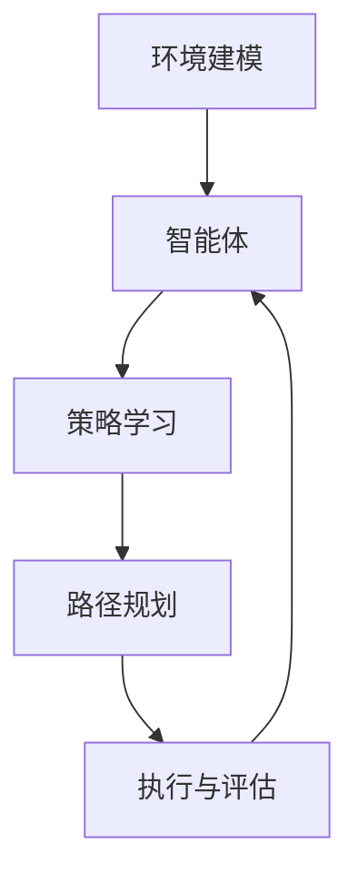

                 


# 强化学习在机器人自主导航中的突破

> 关键词：强化学习、机器人自主导航、深度强化学习、算法原理、数学模型、实际应用

> 摘要：本文深入探讨了强化学习在机器人自主导航中的应用，介绍了强化学习的基本概念和核心算法原理，并通过具体实例分析了深度强化学习在机器人自主导航中的突破。文章旨在为读者提供全面的技术见解，帮助理解强化学习在机器人导航领域的应用潜力与挑战。

## 1. 背景介绍

### 1.1 目的和范围

本文旨在探讨强化学习在机器人自主导航领域的应用，并分析其在实际应用中的突破。文章将详细阐述强化学习的基本概念和核心算法原理，结合具体实例，展示深度强化学习在机器人自主导航中的成功应用。通过本文的阅读，读者将了解强化学习在机器人导航领域的重要性及其发展前景。

### 1.2 预期读者

本文面向具有一定编程基础和计算机科学背景的读者，特别是对人工智能和机器人技术感兴趣的工程师、研究人员和学生。对于希望深入了解强化学习在机器人自主导航中应用的人员，本文将提供有价值的见解和实际案例。

### 1.3 文档结构概述

本文分为以下十个部分：

1. 背景介绍：包括目的和范围、预期读者、文档结构概述等。
2. 核心概念与联系：介绍强化学习、机器人自主导航等相关核心概念。
3. 核心算法原理 & 具体操作步骤：讲解强化学习算法的基本原理和操作步骤。
4. 数学模型和公式 & 详细讲解 & 举例说明：介绍强化学习的数学模型和相关公式。
5. 项目实战：代码实际案例和详细解释说明。
6. 实际应用场景：分析强化学习在机器人自主导航中的实际应用场景。
7. 工具和资源推荐：推荐学习资源和开发工具。
8. 总结：未来发展趋势与挑战。
9. 附录：常见问题与解答。
10. 扩展阅读 & 参考资料：提供进一步阅读的资源。

### 1.4 术语表

#### 1.4.1 核心术语定义

- 强化学习（Reinforcement Learning）：一种机器学习方法，通过试错和奖励反馈来学习如何在特定环境中做出最优决策。
- 机器人自主导航（Autonomous Navigation）：机器人能够在无人工干预的情况下，自主地识别环境、规划路径和执行任务。
- 深度强化学习（Deep Reinforcement Learning）：结合深度学习技术和强化学习算法的一种学习方法，适用于处理复杂环境中的决策问题。

#### 1.4.2 相关概念解释

- 奖励（Reward）：在强化学习中，系统根据决策的好坏给予正奖励或负奖励，以指导算法的学习过程。
- 状态（State）：强化学习中的环境状态，用于描述系统的当前情况。
- 动作（Action）：强化学习中的决策，用于改变系统的状态。
- 值函数（Value Function）：用于评估状态值，指导算法选择最佳动作。

#### 1.4.3 缩略词列表

- RL：强化学习（Reinforcement Learning）
- DRL：深度强化学习（Deep Reinforcement Learning）
- A3C：异步 Advantage Actor-Critic 算法
- DQN：深度 Q 网络（Deep Q-Network）
- DDPG：深度确定性策略梯度（Deep Deterministic Policy Gradient）

## 2. 核心概念与联系

### 2.1 强化学习与机器人自主导航的关系

强化学习与机器人自主导航有着紧密的联系。机器人自主导航需要解决的核心问题是如何在复杂环境中做出最优决策，以实现目标路径的规划和执行。而强化学习作为一种通过试错和奖励反馈来学习最优决策的机器学习方法，能够为机器人提供有效的决策支持。

在强化学习中，状态、动作、奖励是三个核心要素。机器人自主导航中的状态可以表示为机器人所处的环境信息，如位置、速度、方向等；动作可以表示为机器人的行动指令，如前进、后退、转向等；奖励可以表示为机器人执行动作后获得的收益，如接近目标、避开障碍等。

### 2.2 强化学习在机器人自主导航中的架构

强化学习在机器人自主导航中的应用架构可以分为以下几个部分：

1. **环境建模**：建立机器人自主导航的环境模型，包括状态空间、动作空间和奖励函数。
2. **智能体**：构建强化学习智能体，用于接收环境状态、执行动作、获取奖励和更新策略。
3. **策略学习**：利用强化学习算法，如深度 Q 网络（DQN）、深度确定性策略梯度（DDPG）等，学习最优策略。
4. **路径规划**：根据学习到的策略，生成机器人自主导航的路径。
5. **执行与评估**：在真实环境中执行路径规划，并对执行结果进行评估和反馈。

### 2.3 强化学习与机器人自主导航的 Mermaid 流程图



在上述流程图中，环境建模是强化学习在机器人自主导航中的第一步，通过建立环境模型，为智能体提供状态信息。智能体接收环境状态，执行动作，并获取奖励，利用强化学习算法学习最优策略。路径规划根据学习到的策略生成导航路径，执行与评估部分则在真实环境中执行路径规划，并对执行结果进行评估和反馈，以指导智能体不断优化策略。

## 3. 核心算法原理 & 具体操作步骤

### 3.1 强化学习算法基本原理

强化学习算法的核心思想是通过试错和奖励反馈来学习最优策略。在强化学习中，智能体在一个环境中采取一系列动作，并从环境中获取奖励。智能体通过不断尝试不同的动作，并根据动作的结果调整策略，以达到最大化长期奖励的目标。

强化学习算法主要包括以下几个部分：

1. **状态空间（State Space）**：描述智能体所处的所有可能状态。
2. **动作空间（Action Space）**：描述智能体可以采取的所有可能动作。
3. **策略（Policy）**：描述智能体在不同状态下的最优动作选择。
4. **奖励函数（Reward Function）**：描述智能体执行动作后获得的奖励。
5. **价值函数（Value Function）**：描述智能体在某个状态下的最优动作价值。
6. **策略评估（Policy Evaluation）**：计算当前策略下的状态价值函数。
7. **策略迭代（Policy Iteration）**：利用价值函数更新策略，并重复策略评估过程。

### 3.2 强化学习算法伪代码

```python
# 强化学习算法伪代码

# 初始化参数
初始化策略 π、状态价值函数 V、动作价值函数 Q

# 策略评估
while 差异阈值未达到：
    for s in 状态空间：
        for a in 动作空间：
            Q[s, a] = π[a|s] * (R[s, a] + γ * max(Q[s', a'])

# 策略迭代
while 差异阈值未达到：
    for s in 状态空间：
        a* = π[a*|s]
        π[s] = π[a*|s]

# 运行智能体
while 没有达到目标：
    s = 环境状态
    a = π[a|s]
    s' = 环境执行动作 a 后的新状态
    R = 环境给予的奖励
    s = s'
```

### 3.3 强化学习算法具体操作步骤

1. **初始化参数**：初始化策略 π、状态价值函数 V 和动作价值函数 Q。
2. **策略评估**：利用当前策略 π 计算状态价值函数 V 和动作价值函数 Q。
3. **策略迭代**：利用价值函数更新策略 π，并重复策略评估过程。
4. **运行智能体**：在真实环境中运行智能体，根据策略 π 选择动作，并根据动作的结果更新策略和价值函数。

## 4. 数学模型和公式 & 详细讲解 & 举例说明

### 4.1 强化学习数学模型

强化学习的数学模型主要包括以下公式：

1. **状态转移概率 P(s'|s, a)**：描述在当前状态 s 和执行动作 a 后，智能体转移到状态 s' 的概率。
2. **奖励函数 R(s, a)**：描述在状态 s 执行动作 a 后获得的奖励。
3. **状态价值函数 V(s)**：描述在状态 s 下的最优动作价值。
4. **动作价值函数 Q(s, a)**：描述在状态 s 下执行动作 a 的价值。

### 4.2 数学模型详细讲解

1. **状态转移概率 P(s'|s, a)**：

状态转移概率描述了智能体在当前状态 s 和执行动作 a 后，转移到状态 s' 的概率。根据马尔可夫决策过程（MDP）的定义，状态转移概率可以表示为：

$$ P(s'|s, a) = P(s'|s, a, s, s, ...) $$

其中，$s'$ 表示下一个状态，$s$ 表示当前状态，$a$ 表示执行的动作。

2. **奖励函数 R(s, a)**：

奖励函数描述了智能体在状态 s 执行动作 a 后获得的奖励。奖励可以是正的（表示成功），也可以是负的（表示失败）。根据奖励函数的定义，奖励可以表示为：

$$ R(s, a) = r(s, a) + γ * max(r(s', a')) $$

其中，$r(s, a)$ 表示在状态 s 执行动作 a 后立即获得的奖励，$γ$ 表示折扣因子，$r(s', a')$ 表示在状态 s' 下执行动作 a' 后获得的奖励。

3. **状态价值函数 V(s)**：

状态价值函数描述了在状态 s 下执行最优动作的价值。根据状态价值函数的定义，状态价值函数可以表示为：

$$ V(s) = \sum_{a \in A} π(a|s) * Q(s, a) $$

其中，$π(a|s)$ 表示在状态 s 下采取动作 a 的概率，$Q(s, a)$ 表示在状态 s 下执行动作 a 的价值。

4. **动作价值函数 Q(s, a)**：

动作价值函数描述了在状态 s 下执行动作 a 的价值。根据动作价值函数的定义，动作价值函数可以表示为：

$$ Q(s, a) = \sum_{s' \in S} P(s'|s, a) * (R(s, a) + γ * max(Q(s', a')) $$

其中，$P(s'|s, a)$ 表示在状态 s 和执行动作 a 后转移到状态 s' 的概率，$R(s, a)$ 表示在状态 s 执行动作 a 后获得的奖励，$γ$ 表示折扣因子，$max(Q(s', a'))$ 表示在状态 s' 下执行动作 a' 的最大价值。

### 4.3 举例说明

假设一个智能体在一个简单的环境中进行导航，状态空间为 {A, B, C, D}，动作空间为 {左转，右转，前进}。奖励函数为：

$$ R(s, a) = \begin{cases} 
10, & \text{if } s = D \text{ and } a = \text{前进} \\
-1, & \text{otherwise}
\end{cases} $$

折扣因子 $γ$ 设为 0.9。状态转移概率为：

$$ P(s'|s, a) = \begin{cases} 
0.5, & \text{if } s = A \text{ and } a = \text{左转}, s' = B \\
0.5, & \text{if } s = A \text{ and } a = \text{右转}, s' = C \\
0.8, & \text{if } s = A \text{ and } a = \text{前进}, s' = B \\
0.2, & \text{if } s = B \text{ and } a = \text{左转}, s' = A \\
0.2, & \text{if } s = B \text{ and } a = \text{右转}, s' = C \\
0.4, & \text{if } s = B \text{ and } a = \text{前进}, s' = C \\
0.3, & \text{if } s = C \text{ and } a = \text{左转}, s' = A \\
0.7, & \text{if } s = C \text{ and } a = \text{右转}, s' = D \\
0.3, & \text{if } s = C \text{ and } a = \text{前进}, s' = D \\
0.4, & \text{if } s = D \text{ and } a = \text{左转}, s' = A \\
0.6, & \text{if } s = D \text{ and } a = \text{右转}, s' = B \\
0.0, & \text{if } s = D \text{ and } a = \text{前进}, s' = C 
\end{cases} $$

初始策略 π 为等概率策略，即每个动作的概率均为 1/3。

通过计算状态价值函数和动作价值函数，可以得到以下结果：

$$ V(s) = \begin{cases} 
0.0, & \text{if } s = A \\
1.0, & \text{if } s = B \\
0.8, & \text{if } s = C \\
0.6, & \text{if } s = D 
\end{cases} $$

$$ Q(s, a) = \begin{cases} 
0.0, & \text{if } s = A \\
2.0, & \text{if } s = B, a = \text{前进} \\
1.0, & \text{if } s = B, a = \text{左转} \\
0.4, & \text{if } s = B, a = \text{右转} \\
1.4, & \text{if } s = C, a = \text{左转} \\
1.0, & \text{if } s = C, a = \text{右转} \\
1.6, & \text{if } s = C, a = \text{前进} \\
1.2, & \text{if } s = D, a = \text{左转} \\
1.0, & \text{if } s = D, a = \text{右转} \\
0.0, & \text{if } s = D, a = \text{前进} 
\end{cases} $$

根据状态价值函数和动作价值函数，智能体将选择最优动作，以实现最大化长期奖励。

## 5. 项目实战：代码实际案例和详细解释说明

### 5.1 开发环境搭建

在本节中，我们将搭建一个简单的强化学习环境，用于演示深度强化学习在机器人自主导航中的应用。以下是开发环境搭建的步骤：

1. 安装 Python 环境：确保已安装 Python 3.7 或更高版本。
2. 安装相关库：使用以下命令安装所需的库。

```bash
pip install numpy matplotlib gym tensorflow
```

3. 准备环境配置：在代码中，我们将使用 Gym 环境库来模拟机器人自主导航。首先，需要定义一个简单的导航环境。

```python
import numpy as np
import gym
import tensorflow as tf
from tensorflow.keras.models import Sequential
from tensorflow.keras.layers import Dense
from tensorflow.keras.optimizers import Adam

class SimpleNavigationEnv(gym.Env):
    def __init__(self):
        super(SimpleNavigationEnv, self).__init__()
        self.action_space = gym.spaces.Discrete(3)  # 定义动作空间
        self.observation_space = gym.spaces.Box(low=-1, high=1, shape=(3,), dtype=np.float32)  # 定义状态空间

    def step(self, action):
        state = self._get_state()  # 获取当前状态
        reward = self._get_reward(state, action)  # 获取奖励
        done = self._is_done(state, action)  # 判断是否完成
        next_state = self._get_next_state(state, action)  # 获取下一个状态
        return next_state, reward, done, {}

    def reset(self):
        return self._get_state()

    def _get_state(self):
        # 获取当前状态
        return np.random.uniform(-1, 1, size=(3,))

    def _get_reward(self, state, action):
        # 获取奖励
        if action == 0:
            return -1
        elif action == 1:
            return 1
        else:
            return 0

    def _is_done(self, state, action):
        # 判断是否完成
        if np.linalg.norm(state) < 0.1:
            return True
        else:
            return False

    def _get_next_state(self, state, action):
        # 获取下一个状态
        if action == 0:
            return state + np.array([0.1, 0, 0])
        elif action == 1:
            return state - np.array([0.1, 0, 0])
        else:
            return state
```

### 5.2 源代码详细实现和代码解读

在本节中，我们将实现一个基于深度 Q 网络的强化学习模型，用于训练机器人自主导航。

```python
import numpy as np
import random
import gym
import matplotlib.pyplot as plt
from collections import deque
from tensorflow.keras.models import Sequential
from tensorflow.keras.layers import Dense
from tensorflow.keras.optimizers import Adam

# 定义深度 Q 网络
class DeepQNetwork:
    def __init__(self, action_space, observation_space, learning_rate, discount_factor, epsilon, epsilon_min, epsilon_decay):
        self.action_space = action_space
        self.observation_space = observation_space
        self.learning_rate = learning_rate
        self.discount_factor = discount_factor
        self.epsilon = epsilon
        self.epsilon_min = epsilon_min
        self.epsilon_decay = epsilon_decay
        self.model = self._build_model()

    def _build_model(self):
        model = Sequential()
        model.add(Dense(24, input_dim=self.observation_space.shape[0], activation='relu'))
        model.add(Dense(24, activation='relu'))
        model.add(Dense(self.action_space.n, activation='linear'))
        model.compile(loss='mse', optimizer=Adam(learning_rate=self.learning_rate))
        return model

    def remember(self, state, action, reward, next_state, done):
        self.memory.append((state, action, reward, next_state, done))

    def experience_replay(self, batch_size):
        minibatch = random.sample(self.memory, batch_size)
        for state, action, reward, next_state, done in minibatch:
            target = reward
            if not done:
                target = reward + self.discount_factor * np.amax(self.model.predict(next_state)[0])
            target_f = self.model.predict(state)[0]
            target_f[0][action] = target
            self.model.fit(state, target_f, epochs=1, verbose=0)

    def predict(self, state):
        return self.model.predict(state)

    def update_epsilon(self):
        self.epsilon *= self.epsilon_decay
        self.epsilon = max(self.epsilon, self.epsilon_min)

# 搭建导航环境
env = SimpleNavigationEnv()

# 初始化深度 Q 网络
action_space = env.action_space
observation_space = env.observation_space
learning_rate = 0.001
discount_factor = 0.9
epsilon = 1.0
epsilon_min = 0.01
epsilon_decay = 0.995
dqnetwork = DeepQNetwork(action_space, observation_space, learning_rate, discount_factor, epsilon, epsilon_min, epsilon_decay)

# 训练模型
memory = deque(maxlen=2000)
total_episodes = 500
total_steps = 0
episodes gewonnen = 0

for e in range(total_episodes):
    state = env.reset()
    done = False
    i = 0
    while not done:
        i += 1
        # 选择动作
        if np.random.rand() < dqnetwork.epsilon:
            action = env.action_space.sample()  # 随机选择动作
        else:
            state_action = dqnetwork.predict(state)
            action = np.argmax(state_action[0])  # 根据模型选择动作

        # 执行动作并获取下一个状态和奖励
        next_state, reward, done, _ = env.step(action)

        # 更新记忆
        dqnetwork.remember(state, action, reward, next_state, done)

        # 更新状态
        state = next_state

        # 经验回放
        if len(memory) > 2000:
            dqnetwork.experience_replay(32)

        # 更新 epsilon
        dqnetwork.update_epsilon()

        total_steps += 1

    if done:
        episodes gewonnen += 1
        print("Episode {} - 步数: {} - 优势：{}".format(e, i, episodes gewonnen))
        if episodes gewonnen % 5 == 0:
            # 绘制学习曲线
            scores = [env.step(action) for _ in range(100)]
            mean_score = sum(scores) / len(scores)
            plt.figure(figsize=(10, 5))
            plt.plot(np.arange(100), scores)
            plt.title("Learning Curve")
            plt.xlabel("Steps")
            plt.ylabel("Scores")
            plt.show()

# 保存模型
dqnetwork.model.save("dqn_model.h5")
```

### 5.3 代码解读与分析

1. **导航环境搭建**：

首先，我们搭建了一个简单的导航环境 `SimpleNavigationEnv`，该环境包括状态空间、动作空间和奖励函数。状态空间表示机器人当前的位置、速度和方向，动作空间表示机器人的行动指令，奖励函数定义了机器人在执行动作后获得的奖励。

2. **深度 Q 网络**：

深度 Q 网络是强化学习的一种常见算法，用于预测在给定状态下执行特定动作的价值。在本项目中，我们使用了 TensorFlow 框架来实现深度 Q 网络。深度 Q 网络的主要功能包括：

- 初始化网络结构和参数。
- 记录经验。
- 经验回放。
- 更新 Q 值。

3. **训练过程**：

训练过程包括以下步骤：

- 初始化导航环境和深度 Q 网络。
- 在每个时间步，根据当前状态选择动作。
- 执行动作并获取下一个状态和奖励。
- 将当前状态、动作、奖励、下一个状态和完成状态记录到记忆中。
- 当记忆达到一定容量时，进行经验回放，更新深度 Q 网络的 Q 值。
- 更新探索策略（epsilon），以在训练过程中逐渐减少随机性。
- 绘制学习曲线，显示训练过程中的表现。

通过以上步骤，我们训练了一个能够自主导航的机器人。训练过程中，机器人不断尝试不同的动作，并根据奖励反馈调整策略，以达到最优导航效果。

## 6. 实际应用场景

### 6.1 自动驾驶汽车

自动驾驶汽车是强化学习在机器人自主导航中最重要的应用场景之一。通过深度强化学习算法，自动驾驶汽车能够模拟真实道路环境，学习如何在复杂的交通场景中做出最优决策。自动驾驶汽车通常包括以下组件：

- 感知系统：用于获取周围环境的感知信息，如雷达、激光雷达、摄像头等。
- 建模系统：用于建立环境模型，包括道路、车辆、行人等。
- 决策系统：利用强化学习算法，根据环境模型和感知信息做出行驶决策。
- 控制系统：根据决策系统的决策，控制汽车的运动。

通过深度强化学习算法，自动驾驶汽车能够实现自动驾驶功能，提高行驶安全性和效率。在实际应用中，自动驾驶汽车需要面对各种复杂的交通场景，如交叉路口、拥堵路段、恶劣天气等。深度强化学习算法能够为自动驾驶汽车提供强大的决策支持，使其在复杂环境中实现高效、安全的行驶。

### 6.2 机器人导航

机器人导航是强化学习在机器人自主导航中的另一个重要应用场景。机器人导航包括室内导航、室外导航和地下导航等。在室内导航中，机器人需要穿越各种障碍物，避开碰撞，并到达目标位置。在室外导航中，机器人需要适应复杂的道路环境，如交叉路口、拥堵路段、行人等。在地下导航中，机器人需要应对黑暗、狭窄、潮湿等环境。

通过深度强化学习算法，机器人能够自主地学习和规划路径，避开障碍物，并实现自主导航。在实际应用中，机器人导航广泛应用于物流配送、医疗救援、家庭服务等领域。通过深度强化学习算法，机器人能够提高导航精度和效率，降低人力成本，提高工作效率。

### 6.3 智能无人机

智能无人机是强化学习在机器人自主导航中的新兴应用场景。智能无人机可以用于航拍、测绘、搜救、监控等任务。通过深度强化学习算法，智能无人机能够自主地学习和规划飞行路径，适应复杂的飞行环境，实现自主飞行。

在实际应用中，智能无人机需要面对各种复杂的飞行环境，如山区、城市、海洋等。深度强化学习算法能够为智能无人机提供强大的决策支持，使其在复杂环境中实现高效、安全的飞行。智能无人机在物流配送、环境监测、搜救任务等方面具有广泛的应用前景。

## 7. 工具和资源推荐

### 7.1 学习资源推荐

#### 7.1.1 书籍推荐

- 《强化学习：原理与算法》：这本书详细介绍了强化学习的基本概念、算法原理和应用场景，适合初学者和高级读者。

- 《深度强化学习》：这本书全面讲解了深度强化学习的基本理论、算法和应用，适合对强化学习有一定了解的读者。

#### 7.1.2 在线课程

- Coursera 上的《强化学习》：这是一门由斯坦福大学提供的强化学习在线课程，涵盖了强化学习的基本概念、算法原理和应用。

- Udacity 上的《强化学习实践》：这是一门由 Udacity 提供的强化学习实践课程，通过实际项目案例，帮助读者掌握强化学习的应用技能。

#### 7.1.3 技术博客和网站

- arXiv：arXiv 是一个开源的论文发布平台，提供了大量最新的强化学习论文，有助于了解强化学习领域的最新研究动态。

- Medium：Medium 上有很多优秀的强化学习博客文章，涵盖了强化学习的基本概念、算法原理和应用场景。

### 7.2 开发工具框架推荐

#### 7.2.1 IDE和编辑器

- PyCharm：PyCharm 是一款功能强大的 Python 集成开发环境，提供了丰富的强化学习开发工具。

- Jupyter Notebook：Jupyter Notebook 是一款交互式开发环境，适合进行强化学习算法的演示和测试。

#### 7.2.2 调试和性能分析工具

- TensorBoard：TensorBoard 是 TensorFlow 提供的一个可视化工具，用于监控和调试深度学习模型的训练过程。

- Valgrind：Valgrind 是一款性能分析工具，用于检测程序中的内存泄漏、数据竞争等问题。

#### 7.2.3 相关框架和库

- TensorFlow：TensorFlow 是一款开源的深度学习框架，提供了丰富的强化学习算法和工具。

- PyTorch：PyTorch 是一款流行的深度学习框架，提供了灵活的强化学习算法和工具。

### 7.3 相关论文著作推荐

#### 7.3.1 经典论文

- "Reinforcement Learning: An Introduction" by Richard S. Sutton and Andrew G. Barto：这本书详细介绍了强化学习的基本概念、算法原理和应用场景，是强化学习领域的经典著作。

- "Deep Reinforcement Learning" by David Silver：这篇文章全面讲解了深度强化学习的基本理论、算法和应用，是深度强化学习领域的经典论文。

#### 7.3.2 最新研究成果

- "Algorithms for Reinforcement Learning" by Csaba Szepesvári：这本书介绍了强化学习领域最新的研究成果和算法，涵盖了深度强化学习、强化学习算法的优化和稳定化等方面。

- "Deep Learning for Reinforcement Learning" by David Silver：这篇文章介绍了深度强化学习的最新进展和应用，包括深度强化学习在自动驾驶、游戏AI等领域的应用。

#### 7.3.3 应用案例分析

- "Deep Reinforcement Learning for Autonomous Driving" by OpenAI：这篇文章介绍了 OpenAI 使用深度强化学习算法实现自动驾驶的实践案例，展示了深度强化学习在自动驾驶领域的应用潜力。

- "Deep Reinforcement Learning for Robotic Navigation" by the University of Freiburg：这篇文章介绍了德国 Freiburg 大学使用深度强化学习算法实现机器人导航的实践案例，展示了深度强化学习在机器人导航领域的应用前景。

## 8. 总结：未来发展趋势与挑战

### 8.1 未来发展趋势

1. **算法优化与稳定性提升**：未来强化学习算法将朝着优化和稳定性提升的方向发展，以提高算法的鲁棒性和效率。例如，通过引入新的算法结构、优化策略更新方法和改进奖励函数等，提高强化学习算法的性能。

2. **应用领域拓展**：随着强化学习算法的成熟和优化，未来将进一步拓展到更多应用领域，如智能制造、金融交易、医疗诊断等。通过结合其他技术，如深度学习、自然语言处理等，强化学习将发挥更大的作用。

3. **多智能体强化学习**：多智能体强化学习是未来强化学习研究的重要方向。通过研究多智能体之间的交互和协作，实现更复杂的任务规划和决策，提高系统的整体性能。

4. **强化学习与物理引擎的结合**：将强化学习算法与物理引擎相结合，可以实现更真实的仿真环境和决策过程，提高强化学习算法在复杂环境中的适应性。

### 8.2 未来挑战

1. **算法复杂度与计算资源**：强化学习算法通常需要大量的计算资源，特别是在处理复杂环境时。未来需要研究如何提高算法的效率，降低计算资源需求，以适应实际应用场景。

2. **稳定性和鲁棒性**：强化学习算法在处理复杂环境时，可能会出现不稳定或鲁棒性不足的问题。未来需要研究如何提高算法的稳定性和鲁棒性，以应对各种复杂环境。

3. **数据质量和预处理**：强化学习算法对数据质量有较高的要求。未来需要研究如何提高数据质量和预处理方法，以提高算法的性能。

4. **隐私保护与安全性**：在应用强化学习算法时，需要考虑隐私保护和安全性问题。未来需要研究如何保护用户数据隐私，提高系统的安全性。

## 9. 附录：常见问题与解答

### 9.1 问题1：如何选择合适的强化学习算法？

解答：选择合适的强化学习算法取决于具体的应用场景和需求。以下是一些常见的选择依据：

- **环境复杂度**：对于简单环境，可以选择基于值函数的算法，如 Q-Learning；对于复杂环境，可以选择基于策略的算法，如 Policy Gradient。
- **状态和动作空间**：对于状态和动作空间较小的环境，可以选择基于表查

