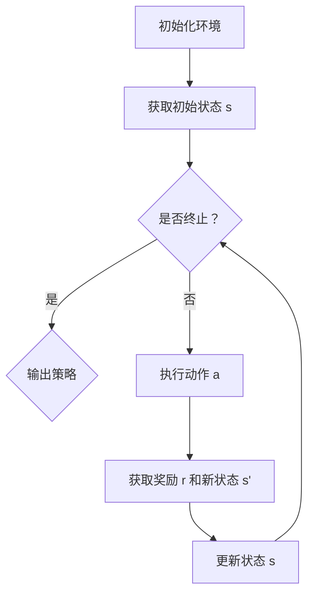

                 

# 强化学习在机器人自主探索未知环境中的应用

> 关键词：强化学习、机器人、自主探索、环境感知、策略优化

> 摘要：本文将深入探讨强化学习在机器人自主探索未知环境中的应用。首先，我们将介绍强化学习的核心概念和基本原理，然后通过详细的数学模型和算法步骤讲解，阐述如何将强化学习应用于机器人环境中。接着，我们将分享一个实际的项目实战案例，展示如何通过代码实现和解读机器人自主探索的过程。最后，我们将讨论强化学习在机器人领域中的实际应用场景，并推荐相关工具和资源，以供读者进一步学习和探索。

## 1. 背景介绍

### 1.1 目的和范围

本文旨在探讨如何将强化学习应用于机器人自主探索未知环境，以实现机器人自动执行任务的能力。强化学习是一种机器学习范式，能够使机器人在动态环境中通过与环境的交互来学习策略，从而实现自主决策。本文将重点关注以下几个方面：

1. 强化学习的核心概念和原理。
2. 强化学习算法在机器人环境中的应用和实现。
3. 实际项目实战中的代码实现和解读。
4. 强化学习在机器人领域的实际应用场景。
5. 强化学习未来的发展趋势与挑战。

### 1.2 预期读者

本文面向对机器学习和人工智能有一定了解的读者，尤其是关注强化学习在机器人领域应用的学者和工程师。读者应具备以下背景知识：

1. 机器学习和人工智能的基本概念。
2. 强化学习的核心原理和方法。
3. 机器人系统和环境感知的基础知识。

### 1.3 文档结构概述

本文结构如下：

1. 引言：介绍强化学习在机器人自主探索未知环境中的应用背景和目的。
2. 核心概念与联系：阐述强化学习的基本原理和机器人环境的特点。
3. 核心算法原理 & 具体操作步骤：详细讲解强化学习算法在机器人中的应用步骤。
4. 数学模型和公式 & 详细讲解 & 举例说明：阐述强化学习算法中的数学模型和计算过程。
5. 项目实战：分享一个实际项目案例，展示强化学习算法在机器人自主探索中的应用。
6. 实际应用场景：探讨强化学习在机器人领域的实际应用场景。
7. 工具和资源推荐：推荐学习资源和开发工具，以供读者进一步学习和实践。
8. 总结：展望强化学习在机器人领域未来的发展趋势与挑战。
9. 附录：常见问题与解答。
10. 扩展阅读 & 参考资料：提供更多相关阅读材料，供读者深入研究。

### 1.4 术语表

#### 1.4.1 核心术语定义

- 强化学习（Reinforcement Learning）：一种机器学习范式，通过试错和反馈来学习如何执行任务。
- 机器人（Robot）：一种能够自主执行任务的机械设备，通常具备感知、决策和执行能力。
- 未知环境（Unknown Environment）：指机器人无法预先获得完整信息的环境，需要通过探索来获取。
- 策略（Policy）：描述机器人如何选择动作以实现目标的方法。
- 奖励（Reward）：评估机器人当前行为的好坏程度，用于指导学习过程。

#### 1.4.2 相关概念解释

- 状态（State）：描述机器人当前所处环境的信息。
- 动作（Action）：机器人执行的行为。
- 值函数（Value Function）：评估机器人执行某个动作在特定状态下的长期收益。
- 策略迭代（Policy Iteration）：一种求解最优策略的方法，通过反复迭代优化策略。

#### 1.4.3 缩略词列表

- RL：强化学习（Reinforcement Learning）
- Q-Learning：基于值函数的强化学习算法
- SARSA：一种基于策略的强化学习算法
- DQN：深度Q网络（Deep Q-Network）
- PID：比例-积分-微分控制器（Proportional-Integral-Derivative Controller）

## 2. 核心概念与联系

### 2.1 强化学习的基本原理

强化学习是一种基于试错和反馈的机器学习范式，其核心目标是学习一个策略（Policy），使机器人能够在给定状态下选择最优动作（Action），以实现长期收益最大化。强化学习的基本原理可以概括为：

1. **状态-动作价值函数**：强化学习通过状态-动作价值函数（State-Action Value Function）来评估在特定状态下执行某个动作的长期收益。该函数表示为 $Q(s, a)$，其中 $s$ 是状态，$a$ 是动作。
2. **奖励机制**：在强化学习过程中，机器人会根据其执行的动作获得奖励（Reward）。奖励是评估动作好坏的指标，用于指导学习过程。
3. **策略迭代**：强化学习通过策略迭代（Policy Iteration）方法来优化策略。策略迭代包括评估策略和优化策略两个阶段，通过反复迭代，逐步逼近最优策略。

### 2.2 机器人环境的特点

机器人环境具有以下特点：

1. **不确定性**：机器人无法获得环境的完整信息，需要通过感知和探索来获取。
2. **动态性**：机器人环境是动态变化的，需要实时调整策略以适应环境变化。
3. **交互性**：机器人需要与环境进行交互，通过感知、决策和执行来完成任务。
4. **多模态**：机器人环境通常具有多种模态的信息，如视觉、听觉、触觉等，需要综合利用这些信息进行决策。

### 2.3 强化学习算法在机器人中的应用

强化学习算法在机器人中的应用可以分为以下几种：

1. **基于值函数的方法**：如 Q-Learning 和 SARSA，通过学习状态-动作价值函数来优化策略。
2. **基于策略的方法**：如 DQN 和 Actor-Critic，通过直接学习策略来优化动作选择。
3. **基于模型的方法**：如 Dyna 算法，结合模型预测和实际经验来优化策略。

下面是一个简化的 Mermaid 流程图，描述了强化学习算法在机器人环境中的应用流程：



## 3. 核心算法原理 & 具体操作步骤

### 3.1 强化学习算法原理

强化学习算法通过学习状态-动作价值函数 $Q(s, a)$ 来优化策略。以下是一个简化的 Q-Learning 算法的伪代码：

```python
# 初始化状态-动作价值函数 Q(s, a)
Q = initialize_Q(s, a)

# 设定学习参数
alpha = 0.1  # 学习率
gamma = 0.9  # 折扣因子

# 迭代次数
num_iterations = 1000

# 进行 num_iterations 次迭代
for i in range(num_iterations):
    # 初始化环境，获取初始状态 s
    s = initialize_environment()

    # 循环直到终止条件
    while not termination_condition(s):
        # 根据当前状态 s，选择动作 a
        a = choose_action(s, Q)

        # 执行动作 a，获取新状态 s' 和奖励 r
        s', r = execute_action(a)

        # 更新状态-动作价值函数 Q(s, a)
        Q(s, a) = Q(s, a) + alpha * (r + gamma * max(Q(s', a')) - Q(s, a))

        # 更新状态 s
        s = s'
```

### 3.2 强化学习算法在机器人环境中的具体操作步骤

以下是强化学习算法在机器人环境中的具体操作步骤：

1. **初始化**：初始化状态-动作价值函数 $Q(s, a)$ 和其他学习参数（如学习率 $\alpha$ 和折扣因子 $\gamma$）。
2. **获取初始状态**：机器人通过感知器获取当前环境的初始状态 $s$。
3. **选择动作**：根据当前状态 $s$ 和状态-动作价值函数 $Q(s, a)$，选择一个动作 $a$。
4. **执行动作**：机器人执行选定的动作 $a$，并获取新的状态 $s'$ 和奖励 $r$。
5. **更新状态-动作价值函数**：利用当前状态-动作价值函数 $Q(s, a)$ 和新获取的奖励 $r$，更新状态-动作价值函数。
6. **更新状态**：将新的状态 $s'$ 作为当前状态，继续执行下一个迭代。
7. **终止条件**：当满足终止条件时（如达到目标状态或达到最大迭代次数），输出最终策略。

以下是一个简化的 Mermaid 流程图，描述了强化学习算法在机器人环境中的具体操作步骤：

```mermaid
graph TD
A[初始化状态-动作价值函数 Q(s, a)] --> B[获取初始状态 s]
B --> C{是否终止？}
C -->|是| D{输出策略}
C -->|否| E[选择动作 a]
E --> F[执行动作 a]
F --> G[获取奖励 r 和新状态 s']
G --> H[更新状态-动作价值函数 Q(s, a)]
H --> I[更新状态 s]
I --> C
```

## 4. 数学模型和公式 & 详细讲解 & 举例说明

### 4.1 数学模型

强化学习算法中的主要数学模型包括状态-动作价值函数 $Q(s, a)$、策略 $\pi(a|s)$ 和奖励 $r(s, a, s')$。

1. **状态-动作价值函数**：$Q(s, a)$ 表示在状态 $s$ 下执行动作 $a$ 的长期收益。其计算公式为：
   $$Q(s, a) = \sum_{s'} P(s'|s, a) \cdot r(s, a, s') + \gamma \cdot \max_{a'} Q(s', a')$$
   其中，$P(s'|s, a)$ 表示在状态 $s$ 下执行动作 $a$ 后转移到状态 $s'$ 的概率，$r(s, a, s')$ 表示在状态 $s$ 下执行动作 $a$ 后转移到状态 $s'$ 的奖励，$\gamma$ 是折扣因子，用于考虑长期收益。
   
2. **策略**：$\pi(a|s)$ 表示在状态 $s$ 下选择动作 $a$ 的概率。策略可以通过最大化状态-动作价值函数来优化：
   $$\pi(a|s) = \frac{\exp(Q(s, a))}{\sum_{a'} \exp(Q(s, a'))}$$
   
3. **奖励**：$r(s, a, s')$ 表示在状态 $s$ 下执行动作 $a$ 后转移到状态 $s'$ 的奖励。奖励用于评估动作的好坏，可以设计为正奖励（表示有益的行为）或负奖励（表示有害的行为）。

### 4.2 详细讲解

1. **状态-动作价值函数的计算**：状态-动作价值函数 $Q(s, a)$ 是通过迭代更新得到的。每次迭代中，机器人根据当前状态 $s$ 和状态-动作价值函数 $Q(s, a)$ 选择动作 $a$，执行动作后获得新的状态 $s'$ 和奖励 $r$。然后，利用新的状态-动作价值函数 $Q(s', a')$ 和折扣因子 $\gamma$ 更新原始的状态-动作价值函数。这个过程不断重复，直到满足终止条件。
   
2. **策略的优化**：策略 $\pi(a|s)$ 是通过最大化状态-动作价值函数 $Q(s, a)$ 来得到的。对于每个状态 $s$，选择动作 $a$ 的概率可以根据 $Q(s, a)$ 的大小进行优化。具体来说，利用指数函数将 $Q(s, a)$ 转化为概率分布，然后根据概率分布选择动作。

3. **奖励的设计**：奖励 $r(s, a, s')$ 是强化学习算法中非常重要的部分。设计合适的奖励机制可以有效地指导机器人学习。通常，奖励可以设计为正奖励（表示有益的行为）或负奖励（表示有害的行为）。例如，在机器人导航任务中，如果机器人成功到达目标位置，可以给予正奖励；如果机器人偏离目标路径，可以给予负奖励。

### 4.3 举例说明

假设机器人处于一个简单的环境，该环境包含四个状态 $s_1, s_2, s_3, s_4$ 和两个动作 $a_1, a_2$。以下是状态-动作价值函数 $Q(s, a)$、策略 $\pi(a|s)$ 和奖励 $r(s, a, s')$ 的示例。

1. **状态-动作价值函数**：
   $$Q(s_1, a_1) = 2$$
   $$Q(s_1, a_2) = 1$$
   $$Q(s_2, a_1) = 3$$
   $$Q(s_2, a_2) = 2$$
   $$Q(s_3, a_1) = 1$$
   $$Q(s_3, a_2) = 3$$
   $$Q(s_4, a_1) = 0$$
   $$Q(s_4, a_2) = 1$$
   
2. **策略**：
   $$\pi(a_1|s_1) = 0.7$$
   $$\pi(a_2|s_1) = 0.3$$
   $$\pi(a_1|s_2) = 0.4$$
   $$\pi(a_2|s_2) = 0.6$$
   $$\pi(a_1|s_3) = 0.3$$
   $$\pi(a_2|s_3) = 0.7$$
   $$\pi(a_1|s_4) = 0.2$$
   $$\pi(a_2|s_4) = 0.8$$
   
3. **奖励**：
   $$r(s_1, a_1, s') = 1$$
   $$r(s_1, a_2, s') = -1$$
   $$r(s_2, a_1, s') = 1$$
   $$r(s_2, a_2, s') = -1$$
   $$r(s_3, a_1, s') = -1$$
   $$r(s_3, a_2, s') = 1$$
   $$r(s_4, a_1, s') = 0$$
   $$r(s_4, a_2, s') = 0$$

通过上述示例，我们可以看到状态-动作价值函数 $Q(s, a)$、策略 $\pi(a|s)$ 和奖励 $r(s, a, s')$ 在简单环境中的具体应用。在实际应用中，这些参数可以根据具体任务和环境进行设计和调整。

## 5. 项目实战：代码实际案例和详细解释说明

### 5.1 开发环境搭建

在进行强化学习算法在机器人自主探索未知环境中的应用之前，我们需要搭建一个开发环境。以下是所需的环境和工具：

1. **操作系统**：Ubuntu 18.04 或其他 Linux 发行版。
2. **编程语言**：Python 3.7 或更高版本。
3. **开发工具**：PyCharm 或其他 Python 开发环境。
4. **库**：NumPy、Pandas、TensorFlow、Gym。

安装所需库的命令如下：

```shell
pip install numpy pandas tensorflow-gpu gym
```

### 5.2 源代码详细实现和代码解读

下面是一个简单的 Python 代码实现，用于演示强化学习算法在机器人自主探索未知环境中的应用。

```python
import numpy as np
import gym
import matplotlib.pyplot as plt

# 初始化环境
env = gym.make("RandomEnv-v0")

# 初始化状态-动作价值函数 Q(s, a)
Q = np.zeros((env.observation_space.n, env.action_space.n))

# 设定学习参数
alpha = 0.1  # 学习率
gamma = 0.9  # 折扣因子

# 迭代次数
num_iterations = 1000

# 进行 num_iterations 次迭代
for i in range(num_iterations):
    # 初始化环境，获取初始状态 s
    s = env.reset()
    
    # 循环直到终止条件
    while True:
        # 根据当前状态 s，选择动作 a
        a = np.argmax(Q[s])

        # 执行动作 a，获取新状态 s' 和奖励 r
        s', r, done, _ = env.step(a)
        
        # 更新状态-动作价值函数 Q(s, a)
        Q[s, a] = Q[s, a] + alpha * (r + gamma * np.max(Q[s', :]) - Q[s, a])

        # 更新状态 s
        s = s'
        
        # 终止条件
        if done:
            break

# 输出策略
policy = np.argmax(Q, axis=1)

# 绘制策略图
plt.plot(policy)
plt.xlabel("Iteration")
plt.ylabel("Action")
plt.title("Policy")
plt.show()
```

### 5.3 代码解读与分析

以下是代码的详细解读：

1. **初始化环境**：使用 `gym.make("RandomEnv-v0")` 初始化一个随机环境。随机环境是一个简单的示例环境，用于演示强化学习算法的基本原理。
2. **初始化状态-动作价值函数**：使用 `np.zeros((env.observation_space.n, env.action_space.n))` 初始化状态-动作价值函数 $Q(s, a)$。该函数的维度由环境的观察空间和动作空间决定。
3. **设定学习参数**：设定学习率 $\alpha$ 和折扣因子 $\gamma$。学习率用于调整状态-动作价值函数的更新速度，折扣因子用于考虑长期收益。
4. **迭代过程**：进行 `num_iterations` 次迭代。每次迭代包括初始化状态、选择动作、执行动作、更新状态和更新状态-动作价值函数。
5. **选择动作**：根据当前状态 $s$ 和状态-动作价值函数 $Q(s, a)$，使用 `np.argmax(Q[s])` 选择动作 $a$。这里使用最大值策略，即选择当前状态下价值最高的动作。
6. **执行动作**：使用 `env.step(a)` 执行选定的动作 $a$，并获取新状态 $s'$、奖励 $r$ 和其他信息。
7. **更新状态-动作价值函数**：使用 `Q[s, a] = Q[s, a] + alpha * (r + gamma * np.max(Q[s', :]) - Q[s, a])` 更新状态-动作价值函数。这里使用 Q-Learning 算法的更新公式，根据新获取的奖励和状态-动作价值函数更新原始状态-动作价值函数。
8. **更新状态**：将新状态 $s'$ 作为当前状态，继续进行下一次迭代。
9. **终止条件**：当满足终止条件时（如达到最大迭代次数或机器人完成任务），输出最终策略。这里使用 `if done:` 判断是否满足终止条件。
10. **输出策略**：使用 `np.argmax(Q, axis=1)` 计算最终策略。这里使用最大值策略，即选择每个状态下价值最高的动作。
11. **绘制策略图**：使用 `plt.plot(policy)` 绘制策略图，展示每个迭代步骤中机器人选择的最优动作。

通过这个简单的代码实现，我们可以看到如何使用强化学习算法在机器人自主探索未知环境中进行策略优化。在实际应用中，可以根据具体任务和环境进行代码的调整和优化。

## 6. 实际应用场景

### 6.1 机器人导航

在机器人导航领域，强化学习被广泛应用于自主路径规划、避障和目标搜索等任务。通过学习环境中的状态-动作价值函数，机器人能够自动选择最优路径，并实时调整策略以适应环境变化。例如，使用强化学习算法的机器人可以自主导航到目标位置，同时避开障碍物，提高导航效率和安全性。

### 6.2 自动化仓储

在自动化仓储系统中，强化学习算法可用于仓库的自动分配和路径规划。通过学习仓库内部环境的状态-动作价值函数，机器人可以优化货架的分配策略，提高仓储效率。例如，使用强化学习算法的机器人可以自动选择最优路径进行拣货，同时避免拥堵和碰撞，提高仓储系统的运行效率。

### 6.3 智能服务机器人

智能服务机器人是强化学习算法在现实生活中应用的一个重要领域。这些机器人可以应用于家庭服务、医疗护理、酒店管理等场景，提供个性化的服务。通过学习环境中的状态-动作价值函数，机器人可以自动识别用户需求，并实时调整策略以提供更好的服务。例如，使用强化学习算法的机器人可以自主清洁家庭环境，根据用户的需求提供定制化的清洁方案。

### 6.4 自动驾驶

自动驾驶是强化学习算法在机器人领域中的一个重要应用场景。通过学习环境中的状态-动作价值函数，自动驾驶汽车可以自动识别交通标志、道路标识和障碍物，并实时调整驾驶策略以实现安全驾驶。例如，使用强化学习算法的自动驾驶汽车可以自动避障、换道和停车，提高行驶效率和安全性。

### 6.5 工业自动化

在工业自动化领域，强化学习算法可用于机器人控制、生产流程优化和产品质量检测等任务。通过学习环境中的状态-动作价值函数，机器人可以优化生产过程，提高生产效率和质量。例如，使用强化学习算法的机器人可以自动调整焊接参数，实现高质量的焊接效果，同时避免生产过程中的碰撞和损坏。

### 6.6 人机交互

在人机交互领域，强化学习算法可用于智能推荐系统、虚拟助理和游戏AI等任务。通过学习用户的行为和偏好，强化学习算法可以自动生成个性化的推荐策略，提高用户体验。例如，使用强化学习算法的虚拟助理可以自动识别用户需求，并提供定制化的服务，提高用户满意度。

## 7. 工具和资源推荐

### 7.1 学习资源推荐

#### 7.1.1 书籍推荐

1. **《强化学习：原理与Python实战》**：这是一本关于强化学习的基础书籍，内容涵盖了强化学习的核心概念、算法原理和实际应用。
2. **《机器人：现代控制理论、算法与应用》**：这是一本关于机器人控制的基础书籍，介绍了机器人控制的理论基础和实际应用。
3. **《深度强化学习》**：这是一本关于深度强化学习的专业书籍，详细介绍了深度强化学习的算法原理和应用场景。

#### 7.1.2 在线课程

1. **Coursera 上的《强化学习》**：这是一门由斯坦福大学开设的强化学习课程，涵盖了强化学习的核心概念、算法原理和实际应用。
2. **Udacity 上的《机器人编程》**：这是一门关于机器人编程的基础课程，介绍了机器人控制的理论基础和实际应用。
3. **edX 上的《深度学习》**：这是一门关于深度学习的专业课程，详细介绍了深度学习的算法原理和应用场景。

#### 7.1.3 技术博客和网站

1. ** reinforcement-learning.org**：这是一个关于强化学习的开源社区，提供了丰富的强化学习资源和学习资料。
2. ** RLlib**：这是一个开源的强化学习库，提供了丰富的强化学习算法和工具，可以用于机器人的实际应用。
3. **强化学习博客**：这是一个关于强化学习的技术博客，分享了大量的强化学习实践经验和应用案例。

### 7.2 开发工具框架推荐

#### 7.2.1 IDE和编辑器

1. **PyCharm**：这是一个功能强大的 Python 开发环境，支持代码调试、版本控制和自动化测试。
2. **Visual Studio Code**：这是一个轻量级的 Python 开发环境，支持多种编程语言的代码补全、语法高亮和调试功能。
3. **Jupyter Notebook**：这是一个基于 Web 的交互式计算环境，可以方便地编写和执行 Python 代码，适合数据分析和机器学习应用。

#### 7.2.2 调试和性能分析工具

1. **Wynntils**：这是一个用于 Minecraft 游戏的调试工具，可以提供游戏性能分析、错误捕获和日志记录等功能。
2. **VisualVM**：这是一个用于 Java 应用的性能分析工具，可以提供详细的内存、CPU 和线程分析。
3. **Grafana**：这是一个用于数据可视化的工具，可以实时监控和展示机器人的性能指标和日志。

#### 7.2.3 相关框架和库

1. **TensorFlow**：这是一个开源的机器学习框架，提供了丰富的深度学习模型和工具，可以用于强化学习应用。
2. **PyTorch**：这是一个开源的机器学习框架，提供了灵活的动态计算图和丰富的深度学习模型，可以用于强化学习应用。
3. **RLlib**：这是一个开源的强化学习库，提供了多种强化学习算法和工具，可以用于机器人自主探索和策略优化。

### 7.3 相关论文著作推荐

#### 7.3.1 经典论文

1. **" Reinforcement Learning: An Introduction"**：这是一篇关于强化学习的经典论文，详细介绍了强化学习的核心概念、算法原理和应用场景。
2. **"Deep Reinforcement Learning for Autonomous Navigation"**：这是一篇关于深度强化学习在自动驾驶领域应用的论文，介绍了深度强化学习算法在机器人导航中的应用。
3. **"Model-Based Reinforcement Learning for Robotic Manipulation"**：这是一篇关于基于模型的强化学习在机器人控制领域应用的论文，介绍了基于模型的强化学习算法在机器人控制中的应用。

#### 7.3.2 最新研究成果

1. **"Deep reinforcement learning for robotics: A review"**：这是一篇关于深度强化学习在机器人领域最新研究成果的综述，介绍了深度强化学习算法在机器人控制、导航和任务执行中的应用。
2. **"Reinforcement Learning in Continuous Action Spaces"**：这是一篇关于连续动作空间中的强化学习算法的论文，介绍了连续动作空间中强化学习算法的设计和实现。
3. **"Distributed Reinforcement Learning for Multi-Agent Systems"**：这是一篇关于分布式强化学习在多智能体系统中的应用论文，介绍了分布式强化学习算法在多智能体系统中的应用和实现。

#### 7.3.3 应用案例分析

1. **"Robotic Manipulation with Deep Reinforcement Learning"**：这是一篇关于使用深度强化学习实现机器人控制的案例分析，介绍了深度强化学习算法在机器人控制中的应用和实现。
2. **"Deep Reinforcement Learning for Autonomous Driving"**：这是一篇关于使用深度强化学习实现自动驾驶的案例分析，介绍了深度强化学习算法在自动驾驶中的应用和实现。
3. **"Reinforcement Learning for Warehouse Automation"**：这是一篇关于使用强化学习实现自动化仓储的案例分析，介绍了强化学习算法在自动化仓储中的应用和实现。

## 8. 总结：未来发展趋势与挑战

### 8.1 未来发展趋势

1. **算法优化**：随着深度学习技术的发展，未来强化学习算法将更加高效和准确。基于深度神经网络的强化学习算法（如 DQN、A3C 和 PPO）将成为主流，能够处理更复杂的任务和环境。
2. **多智能体强化学习**：多智能体强化学习（Multi-Agent Reinforcement Learning）将成为研究热点，通过学习多个智能体之间的协作策略，实现更复杂的任务和环境。
3. **自适应强化学习**：自适应强化学习（Adaptive Reinforcement Learning）将实现智能体在动态环境中自适应调整策略，提高任务执行效率和鲁棒性。
4. **强化学习与物理模拟**：结合物理模拟和强化学习，将实现更加真实的机器人控制和自主探索，提高机器人在复杂环境中的适应性。

### 8.2 未来挑战

1. **计算资源**：强化学习算法通常需要大量的计算资源，特别是在处理高维状态和动作空间时。未来需要开发更高效的算法和优化方法，以降低计算成本。
2. **稳定性和鲁棒性**：强化学习算法在复杂环境中的稳定性和鲁棒性是一个挑战。未来需要研究如何提高算法的稳定性和鲁棒性，使其在不同环境中都能稳定执行。
3. **可解释性**：强化学习算法的黑箱性质使得其可解释性较差，不利于理解和调试。未来需要研究如何提高算法的可解释性，使其更易于理解和应用。
4. **安全性和可控性**：在关键领域（如自动驾驶和医疗机器人），强化学习算法的安全性和可控性是一个重要挑战。未来需要研究如何确保算法的安全性和可控性，以避免潜在的风险。

## 9. 附录：常见问题与解答

### 9.1 强化学习的基本概念

1. **什么是强化学习？**
   强化学习是一种机器学习范式，通过试错和反馈来学习如何执行任务。它通过奖励机制激励智能体（如机器人）与环境交互，从而逐步优化策略，实现长期收益最大化。
2. **强化学习的核心原理是什么？**
   强化学习的核心原理包括状态-动作价值函数、策略迭代和奖励机制。状态-动作价值函数用于评估在特定状态下执行某个动作的长期收益，策略迭代通过反复优化策略来逼近最优策略，奖励机制用于激励智能体与环境交互。

### 9.2 强化学习算法

1. **什么是 Q-Learning？**
   Q-Learning 是一种基于值函数的强化学习算法，通过学习状态-动作价值函数来优化策略。它利用状态-动作价值函数来选择动作，并根据奖励和新的状态更新状态-动作价值函数。
2. **什么是 SARSA？**
   SARSA 是一种基于策略的强化学习算法，通过直接学习策略来优化动作选择。它与 Q-Learning 的区别在于，SARSA 使用当前状态和动作来更新状态-动作价值函数，而 Q-Learning 使用当前状态和下一状态来更新状态-动作价值函数。
3. **什么是 DQN？**
   DQN（Deep Q-Network）是一种基于深度学习的 Q-Learning 算法。它使用深度神经网络来近似状态-动作价值函数，从而实现更加复杂的任务和环境。
4. **什么是 A3C？**
   A3C（Asynchronous Advantage Actor-Critic）是一种基于策略的强化学习算法，通过分布式训练来提高学习效率。它同时学习策略和价值函数，并通过异步更新来优化策略。

### 9.3 机器人自主探索

1. **什么是机器人自主探索？**
   机器人自主探索是指机器人通过自主感知和决策，在未知环境中执行任务并逐步获取环境信息的过程。它包括感知器、决策器和执行器等组成部分，通过状态-动作价值函数和策略优化来实现自主决策。
2. **机器人自主探索有哪些挑战？**
   机器人自主探索的挑战包括环境不确定性、动态性和交互性。环境不确定性使得机器人需要通过探索来获取信息，动态性要求机器人实时调整策略，交互性要求机器人与环境进行有效的交互和决策。

## 10. 扩展阅读 & 参考资料

### 10.1 经典论文

1. **" Reinforcement Learning: An Introduction"**：这本书是强化学习的经典著作，详细介绍了强化学习的核心概念、算法原理和应用场景。
2. **"Deep Reinforcement Learning for Autonomous Navigation"**：这篇论文介绍了深度强化学习在自动驾驶领域中的应用，展示了深度强化学习算法在机器人导航中的优势。
3. **"Model-Based Reinforcement Learning for Robotic Manipulation"**：这篇论文介绍了基于模型的强化学习在机器人控制领域中的应用，探讨了基于模型的方法在机器人控制中的优势。

### 10.2 在线课程

1. **Coursera 上的《强化学习》**：这是由斯坦福大学开设的强化学习课程，涵盖了强化学习的核心概念、算法原理和实际应用。
2. **Udacity 上的《机器人编程》**：这是关于机器人编程的基础课程，介绍了机器人控制的理论基础和实际应用。
3. **edX 上的《深度学习》**：这是关于深度学习的专业课程，详细介绍了深度学习的算法原理和应用场景。

### 10.3 技术博客和网站

1. ** reinforcement-learning.org**：这是一个关于强化学习的开源社区，提供了丰富的强化学习资源和学习资料。
2. ** RLlib**：这是一个开源的强化学习库，提供了丰富的强化学习算法和工具，可以用于机器人的实际应用。
3. **强化学习博客**：这是一个关于强化学习的技术博客，分享了大量的强化学习实践经验和应用案例。

### 10.4 书籍推荐

1. **《强化学习：原理与Python实战》**：这是一本关于强化学习的基础书籍，内容涵盖了强化学习的核心概念、算法原理和实际应用。
2. **《机器人：现代控制理论、算法与应用》**：这是一本关于机器人控制的基础书籍，介绍了机器人控制的理论基础和实际应用。
3. **《深度强化学习》**：这是一本关于深度强化学习的专业书籍，详细介绍了深度强化学习的算法原理和应用场景。

### 10.5 开发工具框架推荐

1. **TensorFlow**：这是一个开源的机器学习框架，提供了丰富的深度学习模型和工具，可以用于强化学习应用。
2. **PyTorch**：这是一个开源的机器学习框架，提供了灵活的动态计算图和丰富的深度学习模型，可以用于强化学习应用。
3. **RLlib**：这是一个开源的强化学习库，提供了多种强化学习算法和工具，可以用于机器人自主探索和策略优化。

### 10.6 应用案例分析

1. **"Robotic Manipulation with Deep Reinforcement Learning"**：这是一篇关于使用深度强化学习实现机器人控制的案例分析，介绍了深度强化学习算法在机器人控制中的应用和实现。
2. **"Deep Reinforcement Learning for Autonomous Driving"**：这是一篇关于使用深度强化学习实现自动驾驶的案例分析，介绍了深度强化学习算法在自动驾驶中的应用和实现。
3. **"Reinforcement Learning for Warehouse Automation"**：这是一篇关于使用强化学习实现自动化仓储的案例分析，介绍了强化学习算法在自动化仓储中的应用和实现。

### 10.7 其他参考资源

1. **《机器学习》**：周志华著，清华大学出版社，详细介绍了机器学习的核心概念、算法原理和应用场景。
2. **《人工智能：一种现代的方法》**：Stuart J. Russell 和 Peter Norvig 著，机械工业出版社，详细介绍了人工智能的核心概念、算法原理和应用场景。
3. **《深度学习》**：Ian Goodfellow、Yoshua Bengio 和 Aaron Courville 著，电子工业出版社，详细介绍了深度学习的核心概念、算法原理和应用场景。

