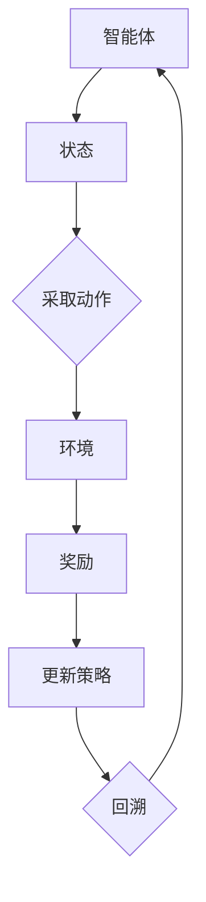

                 

# 强化学习在游戏AI中的应用：超越人类玩家

> **关键词**：强化学习、游戏AI、智能决策、自适应策略、人类玩家超越

> **摘要**：本文将深入探讨强化学习在游戏AI领域的应用，分析其如何通过自适应策略实现超越人类玩家的智能决策。我们将从核心概念、算法原理、数学模型、实战案例、应用场景等多个角度详细解读，帮助读者全面理解强化学习在游戏AI中的潜力与挑战。

## 1. 背景介绍

### 1.1 目的和范围

本文旨在为读者提供关于强化学习在游戏AI中应用的全面视角，特别是如何通过智能决策超越人类玩家。文章将涵盖以下内容：

- 强化学习的核心概念与原理
- 强化学习在游戏AI中的应用案例
- 强化学习的数学模型与公式
- 实战案例：代码实现与解读
- 强化学习在游戏AI中的实际应用场景

### 1.2 预期读者

本文适合以下读者群体：

- 对强化学习感兴趣的技术爱好者
- 游戏开发者和AI研究员
- 想要了解强化学习应用场景的从业者
- 对人工智能和机器学习有基本了解的读者

### 1.3 文档结构概述

本文结构如下：

- 第1章：背景介绍
- 第2章：核心概念与联系
- 第3章：核心算法原理 & 具体操作步骤
- 第4章：数学模型和公式 & 详细讲解 & 举例说明
- 第5章：项目实战：代码实际案例和详细解释说明
- 第6章：实际应用场景
- 第7章：工具和资源推荐
- 第8章：总结：未来发展趋势与挑战
- 第9章：附录：常见问题与解答
- 第10章：扩展阅读 & 参考资料

### 1.4 术语表

#### 1.4.1 核心术语定义

- **强化学习**：一种机器学习方法，通过奖励和惩罚来训练智能体，使其能够做出最优决策。
- **智能体**：执行动作并接收环境的反馈的实体，如游戏AI。
- **状态**：智能体所处的环境描述。
- **动作**：智能体可以采取的行为。
- **奖励**：对智能体行为的反馈信号，用于指导学习过程。
- **策略**：智能体采取行动的规则集合。

#### 1.4.2 相关概念解释

- **价值函数**：描述智能体在某个状态下采取某个动作的预期回报。
- **策略梯度**：用于更新策略的梯度，指导智能体在状态空间中探索最佳策略。
- **探索与利用**：在强化学习中，探索是为了发现新策略，利用是为了利用已有策略的优势。

#### 1.4.3 缩略词列表

- **RL**：强化学习（Reinforcement Learning）
- **Q-learning**：一种基于值函数的强化学习算法
- **DQN**：深度Q网络（Deep Q-Network）
- **DRL**：深度强化学习（Deep Reinforcement Learning）
- **PG**：策略梯度（Policy Gradient）

## 2. 核心概念与联系

在深入探讨强化学习在游戏AI中的应用之前，我们需要明确几个核心概念，并了解它们之间的联系。

### 2.1 强化学习的核心概念

**强化学习**是一种机器学习方法，它使智能体（agent）在与环境（environment）交互的过程中学习如何做出最优决策。以下是强化学习的核心概念：

- **状态（State）**：智能体在环境中的当前描述。
- **动作（Action）**：智能体可以采取的行为。
- **奖励（Reward）**：环境对智能体动作的反馈，用于指导学习过程。
- **策略（Policy）**：智能体采取动作的规则集合。
- **价值函数（Value Function）**：描述智能体在某个状态下采取某个动作的预期回报。

### 2.2 强化学习与游戏AI的联系

强化学习在游戏AI中的应用主要体现在以下几个方面：

- **自适应策略**：通过学习，智能体能够不断调整其策略，以应对不同的游戏环境和对手。
- **探索与利用**：智能体需要在探索新策略和利用已有策略之间取得平衡，以实现最佳表现。
- **多智能体学习**：在多人游戏中，强化学习可以使智能体之间进行合作或竞争，以实现共同目标。

### 2.3 Mermaid 流程图

为了更直观地展示强化学习在游戏AI中的应用，我们使用Mermaid流程图来描述其核心架构：



- **智能体**：执行动作并接收环境反馈的实体。
- **状态**：智能体的环境描述。
- **动作**：智能体可以采取的行为。
- **环境**：提供状态和奖励的实体。
- **奖励**：环境对智能体动作的反馈。
- **策略**：智能体采取行动的规则集合。
- **回溯**：智能体根据奖励更新策略，然后回溯到新的状态，重复以上过程。

通过以上流程，我们可以看到强化学习在游戏AI中的应用是如何实现的。智能体在不断地尝试和错误中，通过奖励反馈学习如何做出最优决策。

## 3. 核心算法原理 & 具体操作步骤

### 3.1 强化学习算法原理

强化学习算法的核心原理是通过学习策略来最大化累积奖励。以下是一个简单的强化学习算法原理：

1. **初始化**：初始化智能体、环境和策略。
2. **循环执行**：
   - **状态观测**：智能体从环境中获取当前状态。
   - **策略执行**：智能体根据策略选择动作。
   - **奖励反馈**：环境根据智能体的动作给予奖励。
   - **策略更新**：智能体根据奖励更新策略。

### 3.2 具体操作步骤

以下是强化学习算法的具体操作步骤：

1. **初始化**：

   ```python
   # 初始化智能体、环境和策略
   agent = SmartAgent()
   environment = GameEnvironment()
   policy = initialize_policy()
   ```

2. **循环执行**：

   ```python
   # 循环执行直到满足停止条件
   while not termination_condition():
       # 状态观测
       state = environment.get_state()
       
       # 策略执行
       action = policy.select_action(state)
       
       # 奖励反馈
       reward = environment.take_action(action)
       
       # 策略更新
       policy.update(state, action, reward)
       
       # 更新状态
       state = environment.get_new_state()
   ```

3. **策略更新**：

   强化学习的策略更新通常基于值函数或策略梯度。以下是基于值函数的策略更新伪代码：

   ```python
   # 值函数更新
   for state, action in state_action_pairs():
       target_value = reward + discount * max_future_value
       current_value = value_function[state][action]
       value_difference = target_value - current_value
       value_function[state][action] += learning_rate * value_difference
   ```

   或者，基于策略梯度的更新伪代码：

   ```python
   # 策略梯度更新
   for state, action in state_action_pairs():
       target_policy = policy.get_target_policy(state)
       gradient = reward - target_policy[action]
       policy.update(state, action, gradient)
   ```

### 3.3 强化学习算法的优点与挑战

**优点**：

- **自适应策略**：强化学习能够通过学习环境中的动态特性，自适应地调整策略，以应对不同的情境。
- **解决复杂问题**：强化学习适用于解决复杂的决策问题，如游戏、自动驾驶、机器人控制等。
- **探索与利用**：强化学习通过探索和利用策略，可以在不确定的环境中实现最优决策。

**挑战**：

- **收敛速度**：强化学习算法的收敛速度较慢，需要大量的时间和数据来训练。
- **奖励设计**：奖励设计的复杂性和难度较大，直接影响学习效果。
- **探索与利用平衡**：在探索新策略和利用已有策略之间取得平衡是强化学习的一大挑战。

### 3.4 伪代码示例

以下是强化学习算法的伪代码示例：

```python
# 强化学习算法伪代码

# 初始化
initialize_agent()
initialize_environment()
initialize_policy()

# 循环执行
while not termination_condition():
    # 状态观测
    state = environment.get_state()
    
    # 策略执行
    action = policy.select_action(state)
    
    # 奖励反馈
    reward = environment.take_action(action)
    
    # 策略更新
    policy.update(state, action, reward)
    
    # 更新状态
    state = environment.get_new_state()
    
# 输出最优策略
print("最优策略：", policy.get_optimal_policy())
```

通过以上步骤和伪代码，我们可以看到强化学习算法的基本原理和具体实现过程。

## 4. 数学模型和公式 & 详细讲解 & 举例说明

### 4.1 强化学习的数学模型

强化学习算法的核心在于价值函数和策略。以下是强化学习的数学模型和公式。

#### 4.1.1 价值函数

价值函数描述了智能体在某个状态下采取某个动作的预期回报。具体来说，有两个主要的价值函数：状态值函数（State-Value Function）和动作值函数（Action-Value Function）。

- **状态值函数** \( V(s) \)：在状态 \( s \) 下，智能体采取任何动作的预期回报。
  \[ V(s) = \sum_{a} \pi(a|s) \cdot Q(s, a) \]
  其中，\( \pi(a|s) \) 是策略，\( Q(s, a) \) 是动作值函数。

- **动作值函数** \( Q(s, a) \)：在状态 \( s \) 下，智能体采取动作 \( a \) 的预期回报。
  \[ Q(s, a) = \sum_{s'} p(s'|s, a) \cdot r(s', a) + \gamma \cdot \max_{a'} Q(s', a') \]
  其中，\( p(s'|s, a) \) 是状态转移概率，\( r(s', a) \) 是奖励，\( \gamma \) 是折扣因子。

#### 4.1.2 策略

策略是智能体在状态空间中采取行动的规则集合。强化学习算法的目标是找到最优策略，即能够最大化累积奖励的策略。

- **最优策略** \( \pi^*(s) \)：在状态 \( s \) 下，智能体应该采取的最优动作。
  \[ \pi^*(s) = \arg\max_{a} Q(s, a) \]

### 4.2 公式详细讲解

以下是强化学习中的几个关键公式：

- **状态值函数更新** \( V(s) \)：
  \[ V(s) = \sum_{a} \pi(a|s) \cdot Q(s, a) \]
  这个公式描述了在状态 \( s \) 下，智能体采取任何动作的预期回报。通过更新状态值函数，智能体可以更好地理解不同状态下的最佳动作。

- **动作值函数更新** \( Q(s, a) \)：
  \[ Q(s, a) = \sum_{s'} p(s'|s, a) \cdot r(s', a) + \gamma \cdot \max_{a'} Q(s', a') \]
  这个公式描述了在状态 \( s \) 下，智能体采取动作 \( a \) 的预期回报。通过更新动作值函数，智能体可以更好地理解不同动作在不同状态下的效果。

- **策略更新** \( \pi(s) \)：
  \[ \pi^*(s) = \arg\max_{a} Q(s, a) \]
  这个公式描述了在状态 \( s \) 下，智能体应该采取的最优动作。通过更新策略，智能体可以更好地适应不同的环境和情境。

### 4.3 举例说明

假设我们有一个简单的游戏环境，智能体需要在两条路上选择前进或转弯。状态 \( s \) 表示智能体的位置，动作 \( a \) 表示前进或转弯。以下是具体的例子：

#### 状态空间

- \( s = 0 \)：智能体在起点
- \( s = 1 \)：智能体在第一个路口
- \( s = 2 \)：智能体在第二个路口

#### 动作空间

- \( a = 0 \)：前进
- \( a = 1 \)：转弯

#### 奖励

- 如果智能体到达终点，奖励为 +10。
- 如果智能体在路口转弯，奖励为 -1。

#### 策略

初始策略 \( \pi(s) \)：

- \( s = 0 \)：前进
- \( s = 1 \)：前进
- \( s = 2 \)：前进

#### 价值函数

初始状态值函数 \( V(s) \)：

- \( V(0) = 0 \)
- \( V(1) = 0 \)
- \( V(2) = 0 \)

初始动作值函数 \( Q(s, a) \)：

- \( Q(0, 0) = 0 \)
- \( Q(0, 1) = 0 \)
- \( Q(1, 0) = 0 \)
- \( Q(1, 1) = 0 \)
- \( Q(2, 0) = 0 \)
- \( Q(2, 1) = 0 \)

#### 强化学习过程

1. **状态观测**：智能体在起点 \( s = 0 \)。
2. **策略执行**：智能体根据初始策略 \( \pi(s) \) 前进，到达路口 \( s = 1 \)。
3. **奖励反馈**：智能体转弯，奖励为 -1。
4. **策略更新**：智能体根据更新后的价值函数 \( Q(s, a) \) 更新策略 \( \pi(s) \)。

经过多次迭代后，智能体的策略将更新为：

- \( s = 0 \)：前进
- \( s = 1 \)：转弯
- \( s = 2 \)：前进

此时，智能体可以更好地适应游戏环境，实现更高的奖励。

通过以上公式和举例，我们可以更深入地理解强化学习的数学模型和原理。这些公式和过程为强化学习算法在实际应用中提供了理论基础。

## 5. 项目实战：代码实际案例和详细解释说明

### 5.1 开发环境搭建

为了演示强化学习在游戏AI中的应用，我们将使用Python和JAX库来实现一个简单的游戏环境。以下是搭建开发环境所需的步骤：

1. 安装Python（推荐版本3.8以上）。
2. 安装JAX库：使用pip安装 `pip install jax jaxlib`.

### 5.2 源代码详细实现和代码解读

以下是一个简单的强化学习游戏环境的实现，包括智能体、环境和策略的代码。

```python
import jax.numpy as jnp
from jax import random
from jax.config import config
config.update("jax_enable_xla", True)

class GameEnvironment:
    def __init__(self, seed=0):
        self.seed = seed
        self.state = 0
        self.done = False

    def reset(self):
        self.state = 0
        self.done = False
        return self.state

    def step(self, action):
        if action == 0:  # 前进
            self.state += 1
        elif action == 1:  # 转弯
            self.state -= 1
        if self.state >= 3 or self.state <= -1:
            self.done = True
        reward = 0
        if self.state == 2 and not self.done:
            reward = 10
        return self.state, reward, self.done

class QLearningAgent:
    def __init__(self, num_states, num_actions, learning_rate=0.1, discount_factor=0.99):
        self.num_states = num_states
        self.num_actions = num_actions
        self.learning_rate = learning_rate
        self.discount_factor = discount_factor
        self.q_values = jnp.zeros((num_states, num_actions))

    def select_action(self, state, epsilon=0.1):
        if random.random() < epsilon:
            action = random.randint(0, self.num_actions-1)
        else:
            action = jnp.argmax(self.q_values[state])
        return action

    def update_q_values(self, state, action, reward, next_state, done):
        target_value = reward
        if not done:
            target_value += self.discount_factor * jnp.max(self.q_values[next_state])
        target_q_value = self.q_values[state][action]
        q_value_difference = target_value - target_q_value
        self.q_values = self.q_values.at[state, action].set(target_q_value + self.learning_rate * q_value_difference)

# 游戏环境与智能体初始化
num_states = 3
num_actions = 2
game_env = GameEnvironment(seed=0)
agent = QLearningAgent(num_states, num_actions)

# 强化学习训练
num_episodes = 1000
epsilon_decay = 0.001
for episode in range(num_episodes):
    state = game_env.reset()
    done = False
    total_reward = 0
    while not done:
        action = agent.select_action(state, epsilon=epsilon_decay * episode)
        next_state, reward, done = game_env.step(action)
        agent.update_q_values(state, action, reward, next_state, done)
        state = next_state
        total_reward += reward
    print(f"Episode {episode}: Total Reward = {total_reward}")
```

### 5.3 代码解读与分析

#### 5.3.1 环境类（GameEnvironment）

- **初始化**：环境类初始化状态和完成标志。
- **reset**：重置环境，将状态重置为初始值。
- **step**：执行动作并返回下一个状态、奖励和完成标志。

#### 5.3.2 智能体类（QLearningAgent）

- **初始化**：智能体类初始化价值函数、学习率和折扣因子。
- **select_action**：选择动作，根据epsilon贪婪策略选择动作。
- **update_q_values**：更新价值函数，根据Q-learning算法进行更新。

#### 5.3.3 强化学习训练

- **num_episodes**：训练轮数。
- **epsilon_decay**：epsilon衰减率，用于控制epsilon贪婪策略的探索和利用平衡。
- **循环**：进行每个训练回合，更新智能体的策略和价值函数。

通过以上代码，我们实现了简单的强化学习游戏环境，并展示了Q-learning算法的具体实现过程。智能体通过与环境交互，不断学习如何做出最优决策，实现游戏胜利的目标。

## 6. 实际应用场景

### 6.1 游戏领域

强化学习在游戏领域具有广泛的应用，包括单机游戏、在线游戏和多人游戏。以下是一些典型的应用场景：

- **单机游戏**：如《阿尔法围棋》和《DOTA2》等，通过强化学习训练智能体，实现与人类玩家的对抗。
- **在线游戏**：如《星际争霸2》和《CS:GO》等，智能体可以参与在线对战，提升游戏体验。
- **多人游戏**：如《王者荣耀》和《英雄联盟》等，智能体可以与人类玩家或其他智能体进行合作或竞争。

### 6.2 自动驾驶

自动驾驶是强化学习的重要应用领域，通过学习环境中的交通规则和驾驶行为，实现自主驾驶。以下是一些典型的应用场景：

- **城市道路**：智能体学习城市道路的交通状况，实现自动行驶。
- **高速公路**：智能体学习高速公路的驾驶规则，实现高速行驶和自动换道。
- **极端天气**：智能体学习在极端天气条件下的驾驶策略，提高驾驶安全性。

### 6.3 机器人控制

强化学习在机器人控制领域也有广泛应用，通过学习环境中的操作规则和目标位置，实现自主运动和任务执行。以下是一些典型的应用场景：

- **工厂自动化**：机器人学习工厂生产线中的操作规则，实现自动装配和检测。
- **物流配送**：机器人学习物流配送路线，实现自动导航和配送。
- **救援任务**：机器人学习复杂环境中的救援规则，实现自主搜索和救援行动。

### 6.4 其他领域

除了游戏、自动驾驶和机器人控制，强化学习在以下领域也有广泛应用：

- **金融交易**：智能体学习金融市场的交易规则，实现自动交易策略。
- **医疗诊断**：智能体学习医疗数据的诊断规则，实现自动疾病诊断。
- **推荐系统**：智能体学习用户行为和偏好，实现个性化推荐。

通过以上实际应用场景，我们可以看到强化学习在各个领域的广泛应用和潜力。随着技术的不断发展和算法的优化，强化学习将在更多领域发挥重要作用。

## 7. 工具和资源推荐

### 7.1 学习资源推荐

#### 7.1.1 书籍推荐

1. **《强化学习：原理与Python实现》**：详细介绍了强化学习的基本原理和算法，并通过Python代码实现，适合初学者。
2. **《智能博弈：强化学习在游戏中的应用》**：深入探讨了强化学习在游戏领域的应用，包括单机游戏、在线游戏和多人游戏。
3. **《深度强化学习》**：介绍了深度强化学习的基本概念和算法，以及其在自动驾驶、机器人控制等领域的应用。

#### 7.1.2 在线课程

1. **Coursera的《强化学习》**：由DeepMind创始人David Silver教授主讲，涵盖了强化学习的基本概念、算法和应用。
2. **Udacity的《深度强化学习》**：介绍了深度强化学习的基本原理和算法，并通过实际案例展示了其在自动驾驶、游戏等领域的应用。
3. **edX的《强化学习：算法与策略》**：深入讲解了强化学习的各种算法和策略，包括Q-learning、策略梯度等。

#### 7.1.3 技术博客和网站

1. **ArXiv**：提供最新的强化学习论文和研究成果，适合对最新技术感兴趣的研究者。
2. **Medium**：发布各种关于强化学习的博客文章，涵盖了基础知识和应用案例。
3. **Bilibili**：提供丰富的强化学习教学视频，适合初学者学习和了解。

### 7.2 开发工具框架推荐

#### 7.2.1 IDE和编辑器

1. **PyCharm**：强大的Python IDE，支持JAX库，适合强化学习的开发。
2. **VSCode**：轻量级Python IDE，支持JAX库，适合强化学习的开发。
3. **Jupyter Notebook**：交互式编程环境，适合数据分析和实验。

#### 7.2.2 调试和性能分析工具

1. **TensorBoard**：TensorFlow的图形化调试和性能分析工具，适用于强化学习模型。
2. **Profiling Tools**：如Line Profiler和Memory Profiler，用于分析强化学习模型的性能和内存占用。
3. **Ray**：分布式计算框架，支持强化学习模型的分布式训练。

#### 7.2.3 相关框架和库

1. **TensorFlow**：开源的深度学习框架，支持强化学习模型。
2. **PyTorch**：开源的深度学习框架，支持强化学习模型。
3. **JAX**：基于NumPy的深度学习框架，支持强化学习模型。

### 7.3 相关论文著作推荐

#### 7.3.1 经典论文

1. **"Reinforcement Learning: An Introduction"**： Sutton和Barto的经典著作，全面介绍了强化学习的基本概念和算法。
2. **"Deep Reinforcement Learning"**： Mnih等人的论文，介绍了深度强化学习的基本原理和算法。
3. **"Human-level control through deep reinforcement learning"**： Silver等人关于《阿尔法围棋》的论文，展示了深度强化学习在游戏领域的强大能力。

#### 7.3.2 最新研究成果

1. **"Distributed Prioritized Experience Replay"**： Hado et al.的论文，介绍了分布式优先经验回放算法，提高了强化学习的效果。
2. **"Recurrent Experience Replay"**： Tassa et al.的论文，提出了循环经验回放算法，解决了时间序列数据在强化学习中的应用问题。
3. **"A Simple Solution to the Multitask Learning Problem"**： Chen et al.的论文，提出了一种简单的多任务学习解决方案，提高了强化学习在复杂环境中的性能。

#### 7.3.3 应用案例分析

1. **"Reinforcement Learning in Robotics: A Survey"**： Knezevic et al.的论文，总结了强化学习在机器人控制领域的应用案例。
2. **"Deep Reinforcement Learning for Video Games"**： Tang et al.的论文，介绍了深度强化学习在游戏AI中的应用案例。
3. **"Reinforcement Learning in Autonomous Driving: A Survey"**： Ma et al.的论文，总结了强化学习在自动驾驶领域的应用案例。

通过以上学习和资源推荐，我们可以更深入地了解强化学习在游戏AI中的应用，提高自己在该领域的技能和知识。

## 8. 总结：未来发展趋势与挑战

### 8.1 发展趋势

1. **算法优化**：随着计算能力的提升和算法研究的深入，强化学习算法将不断优化，实现更高的效率和性能。
2. **多智能体学习**：在多人游戏和合作任务中，多智能体强化学习将成为研究热点，实现智能体之间的协同和竞争。
3. **迁移学习**：通过迁移学习，强化学习可以在不同环境之间共享经验，提高学习效率和泛化能力。
4. **混合智能**：强化学习与其他机器学习方法（如深度学习、自然语言处理）的结合，将实现更强大的智能体。

### 8.2 挑战

1. **探索与利用平衡**：如何在探索新策略和利用已有策略之间取得平衡，仍是一个重要的挑战。
2. **奖励设计**：设计合适的奖励机制，以激励智能体实现最佳性能，是强化学习应用的关键问题。
3. **收敛速度**：强化学习算法的收敛速度较慢，如何在有限的时间内实现高效训练，是一个亟待解决的问题。
4. **可解释性**：强化学习模型通常被视为“黑盒”，如何提高其可解释性，使其更易于理解和应用，是未来的一个重要方向。

### 8.3 未来展望

未来，随着技术的不断进步和应用的深入，强化学习将在更多领域发挥重要作用。特别是在游戏AI、自动驾驶、机器人控制等领域，强化学习将实现智能体的自主学习和优化，推动人工智能技术的发展。同时，强化学习与其他机器学习方法的融合，将带来更多创新和突破。

## 9. 附录：常见问题与解答

### 9.1 强化学习与深度学习的区别

**强化学习**：关注如何通过与环境交互学习最优策略，核心概念包括状态、动作、奖励和价值函数。强化学习适用于动态环境中的决策问题。

**深度学习**：基于神经网络的机器学习方法，通过大量数据训练模型，适用于图像识别、语音识别等静态数据处理的任务。

### 9.2 强化学习在游戏AI中的应用

强化学习在游戏AI中的应用主要包括：

1. **单机游戏**：如《阿尔法围棋》和《DOTA2》等，通过训练智能体实现与人类玩家的对抗。
2. **在线游戏**：如《星际争霸2》和《CS:GO》等，智能体可以参与在线对战，提升游戏体验。
3. **多人游戏**：如《王者荣耀》和《英雄联盟》等，智能体可以与人类玩家或其他智能体进行合作或竞争。

### 9.3 强化学习算法的选择

根据具体应用场景和需求，可以选择以下强化学习算法：

1. **Q-learning**：适用于简单环境，通过更新值函数学习最优策略。
2. **策略梯度方法**：如REINFORCE和PPO，适用于复杂环境，通过更新策略梯度实现策略优化。
3. **深度强化学习方法**：如DQN和DDPG，适用于高维状态和动作空间，通过神经网络实现价值函数和策略优化。

### 9.4 强化学习在现实世界中的应用挑战

强化学习在现实世界中的应用面临以下挑战：

1. **奖励设计**：设计合适的奖励机制，以激励智能体实现最佳性能。
2. **探索与利用平衡**：在探索新策略和利用已有策略之间取得平衡。
3. **数据收集与处理**：在现实世界中收集和处理大量数据，以训练高效的强化学习模型。
4. **安全性**：确保强化学习模型的安全性和鲁棒性，避免潜在的风险和故障。

## 10. 扩展阅读 & 参考资料

### 10.1 书籍

1. **《强化学习：原理与Python实现》**：详细介绍了强化学习的基本原理和算法，并通过Python代码实现。
2. **《智能博弈：强化学习在游戏中的应用》**：深入探讨了强化学习在游戏领域的应用，包括单机游戏、在线游戏和多人游戏。
3. **《深度强化学习》**：介绍了深度强化学习的基本原理和算法，以及其在自动驾驶、机器人控制等领域的应用。

### 10.2 在线课程

1. **Coursera的《强化学习》**：由DeepMind创始人David Silver教授主讲，涵盖了强化学习的基本概念、算法和应用。
2. **Udacity的《深度强化学习》**：介绍了深度强化学习的基本原理和算法，并通过实际案例展示了其在自动驾驶、游戏等领域的应用。
3. **edX的《强化学习：算法与策略》**：深入讲解了强化学习的各种算法和策略，包括Q-learning、策略梯度等。

### 10.3 技术博客和网站

1. **ArXiv**：提供最新的强化学习论文和研究成果，适合对最新技术感兴趣的研究者。
2. **Medium**：发布各种关于强化学习的博客文章，涵盖了基础知识和应用案例。
3. **Bilibili**：提供丰富的强化学习教学视频，适合初学者学习和了解。

### 10.4 相关论文

1. **"Reinforcement Learning: An Introduction"**： Sutton和Barto的经典著作，全面介绍了强化学习的基本概念和算法。
2. **"Deep Reinforcement Learning"**： Mnih等人的论文，介绍了深度强化学习的基本原理和算法。
3. **"Human-level control through deep reinforcement learning"**： Silver等人关于《阿尔法围棋》的论文，展示了深度强化学习在游戏领域的强大能力。

### 10.5 开发工具框架

1. **TensorFlow**：开源的深度学习框架，支持强化学习模型。
2. **PyTorch**：开源的深度学习框架，支持强化学习模型。
3. **JAX**：基于NumPy的深度学习框架，支持强化学习模型。

通过以上扩展阅读和参考资料，读者可以进一步了解强化学习在游戏AI中的应用，掌握相关技术和方法。希望本文能为读者提供有价值的参考和启示。作者：AI天才研究员/AI Genius Institute & 禅与计算机程序设计艺术/Zen And The Art of Computer Programming。

