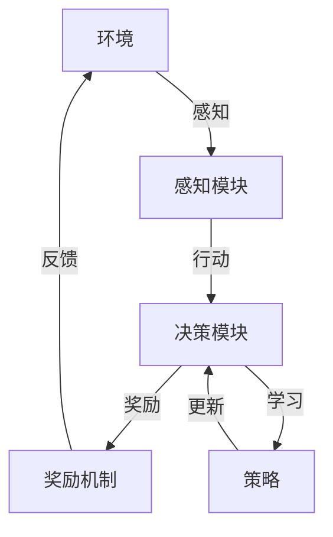

                 

# 强化学习在自动驾驶决策系统中的应用

> **关键词：** 强化学习，自动驾驶，决策系统，深度学习，模拟环境

> **摘要：** 本文将深入探讨强化学习在自动驾驶决策系统中的应用，通过分析其核心概念、算法原理、数学模型，以及实战案例，展示强化学习在自动驾驶领域的关键作用和潜力。本文旨在为读者提供一个全面的技术指南，帮助理解并掌握强化学习在自动驾驶决策系统中的实际应用。

## 1. 背景介绍

### 1.1 目的和范围

本文的目的在于阐述强化学习在自动驾驶决策系统中的应用，通过理论与实践相结合，使读者能够全面了解强化学习在自动驾驶领域的应用场景、技术难点和解决方案。本文主要涵盖以下几个方面的内容：

1. **强化学习的基本概念和原理**：介绍强化学习的基础知识，包括奖励机制、策略和价值函数等核心概念。
2. **强化学习在自动驾驶中的应用场景**：分析自动驾驶中常见的决策问题，探讨强化学习如何解决这些问题。
3. **强化学习的算法原理和数学模型**：详细讲解强化学习的主要算法，如Q学习、SARSA和深度强化学习，以及相关的数学公式。
4. **实战案例解析**：通过实际项目案例，展示强化学习在自动驾驶决策系统中的应用过程和效果。
5. **未来发展趋势与挑战**：探讨强化学习在自动驾驶领域的发展趋势，以及面临的挑战和解决策略。

### 1.2 预期读者

本文预期读者为对自动驾驶和强化学习感兴趣的工程师、研究人员和学者。特别适合以下人群：

1. **自动驾驶领域的工程师**：希望了解强化学习在自动驾驶决策系统中的应用和技术原理。
2. **强化学习爱好者**：对强化学习算法感兴趣，希望将其应用于实际问题的开发者。
3. **学术研究人员**：关注自动驾驶和强化学习领域的研究动态，希望了解最新的应用成果和前沿技术。
4. **技术经理和决策者**：对自动驾驶技术有战略布局需求，希望了解强化学习在其中的关键作用。

### 1.3 文档结构概述

本文结构如下：

1. **背景介绍**：介绍本文的目的、预期读者和文档结构。
2. **核心概念与联系**：通过Mermaid流程图展示强化学习的核心概念和架构。
3. **核心算法原理 & 具体操作步骤**：详细讲解强化学习的主要算法和具体操作步骤。
4. **数学模型和公式 & 详细讲解 & 举例说明**：分析强化学习的数学模型，并提供具体实例。
5. **项目实战：代码实际案例和详细解释说明**：通过实际项目案例展示强化学习在自动驾驶决策系统中的应用。
6. **实际应用场景**：探讨强化学习在自动驾驶领域的应用场景。
7. **工具和资源推荐**：推荐学习资源和开发工具。
8. **总结：未来发展趋势与挑战**：总结强化学习在自动驾驶决策系统中的应用前景和面临的挑战。
9. **附录：常见问题与解答**：回答读者可能遇到的问题。
10. **扩展阅读 & 参考资料**：提供进一步学习的资源。

### 1.4 术语表

#### 1.4.1 核心术语定义

- **强化学习**：一种机器学习方法，通过学习如何在不同情境下做出最优决策，以最大化累积奖励。
- **自动驾驶决策系统**：利用传感器数据和环境信息，实现车辆自主行驶和决策的智能系统。
- **奖励机制**：评估决策结果的指标，用于引导学习过程。
- **策略**：决策系统的行动方案，用于应对不同情境。
- **价值函数**：评估策略优劣的函数，指导决策过程。

#### 1.4.2 相关概念解释

- **深度学习**：一种基于神经网络的学习方法，通过多层非线性变换提取特征，实现复杂任务的建模。
- **模拟环境**：用于训练和测试自动驾驶决策系统的虚拟环境。
- **传感器数据融合**：将不同类型传感器（如摄像头、雷达、激光雷达）的数据进行整合，提高系统的感知能力。

#### 1.4.3 缩略词列表

- **RL**：强化学习（Reinforcement Learning）
- **DRL**：深度强化学习（Deep Reinforcement Learning）
- **SLAM**：同时定位与地图构建（Simultaneous Localization and Mapping）
- **Lidar**：激光雷达（Light Detection and Ranging）

## 2. 核心概念与联系

强化学习在自动驾驶决策系统中的应用，需要理解其核心概念和架构。以下通过Mermaid流程图展示强化学习的核心概念和联系。



### 2.1 环境与感知模块

- **环境**：自动驾驶系统运行的真实场景，包括道路、车辆、行人等。
- **感知模块**：利用传感器数据（摄像头、雷达、激光雷达）对环境进行感知，提取关键信息。

### 2.2 决策模块与奖励机制

- **决策模块**：基于感知模块提供的信息，通过策略生成行动方案。
- **奖励机制**：评估决策结果，为系统提供正向或负向的奖励信号，引导学习过程。

### 2.3 策略更新与感知反馈

- **策略**：决策模块生成的行动方案，用于指导自动驾驶系统的行为。
- **更新**：根据奖励机制提供的反馈，对策略进行持续优化和更新。

通过上述流程，强化学习在自动驾驶决策系统中实现了环境感知、决策生成、奖励反馈和策略更新的闭环，从而实现自动驾驶系统的自主学习和优化。

## 3. 核心算法原理 & 具体操作步骤

在理解了强化学习的核心概念后，接下来我们将详细讲解强化学习的主要算法原理和具体操作步骤。

### 3.1 Q学习算法

Q学习是一种基于值函数的强化学习算法，通过学习状态-动作价值函数来选择最佳动作。其基本原理如下：

#### 3.1.1 状态-动作价值函数

Q学习算法的核心是状态-动作价值函数Q(s, a)，表示在状态s下执行动作a所能获得的累积奖励。其定义为：

$$
Q(s, a) = \sum_{t=0}^{\infty} \gamma^t r_t
$$

其中，$r_t$ 为第t步的即时奖励，$\gamma$ 为折扣因子，用于平衡短期和长期奖励。

#### 3.1.2 更新规则

Q学习的更新规则如下：

$$
Q(s, a) \leftarrow Q(s, a) + \alpha [r_t + \gamma \max_{a'} Q(s', a') - Q(s, a)]
$$

其中，$\alpha$ 为学习率，用于调整更新幅度。

#### 3.1.3 操作步骤

1. 初始化Q值矩阵，并选择初始状态s。
2. 选择动作a，执行并观察下一状态s'和即时奖励r。
3. 根据更新规则更新Q值。
4. 转到下一个状态s'，重复步骤2-3，直到达到终止条件。

### 3.2 SARSA算法

SARSA（同步自定规划同步自定规划同步自定规划）算法是一种基于策略的强化学习算法，通过同时考虑当前和下一状态的动作值来更新策略。其基本原理如下：

#### 3.2.1 策略评估

SARSA算法的核心是策略评估，通过更新策略值函数来估计策略的优劣。其定义如下：

$$
\pi(a|s) = \frac{1}{|\mathcal{A}(s)|} \sum_{a \in \mathcal{A}(s)} \pi(a|s) Q(s, a)
$$

其中，$\pi(a|s)$ 为在状态s下选择动作a的概率。

#### 3.2.2 更新规则

SARSA算法的更新规则如下：

$$
\pi(a|s) \leftarrow \frac{\pi(a|s)}{\sum_{a' \in \mathcal{A}(s')} \pi(a'|s')}
$$

#### 3.2.3 操作步骤

1. 初始化策略π和Q值矩阵。
2. 选择动作a，执行并观察下一状态s'和即时奖励r。
3. 根据更新规则更新策略π。
4. 转到下一个状态s'，重复步骤2-3，直到达到终止条件。

### 3.3 深度强化学习（DRL）

深度强化学习（DRL）结合了深度学习和强化学习的优点，通过神经网络来近似状态-动作价值函数或策略。以下是一个基于深度Q网络的DRL算法原理：

#### 3.3.1 网络结构

深度Q网络（DQN）由一个卷积神经网络（CNN）和一个Q值预测网络组成。CNN用于处理输入的图像数据，提取特征；Q值预测网络用于预测状态-动作价值函数。

#### 3.3.2 算法原理

1. 初始化神经网络权重和经验回放记忆池。
2. 从初始状态开始，根据ε-贪心策略选择动作。
3. 执行动作，观察下一状态和即时奖励。
4. 将经验（状态、动作、奖励、下一状态）存储到经验回放记忆池中。
5. 从经验回放记忆池中随机抽取一批经验，进行经验回放，减少样本偏差。
6. 使用经验回放和目标Q网络更新真实Q网络。
7. 更新策略，选择下一个动作，重复步骤2-6，直到达到终止条件。

通过上述算法原理和操作步骤，强化学习算法能够在自动驾驶决策系统中实现自主学习和优化，从而提高系统的决策能力和性能。

### 3.4 总结

Q学习、SARSA和DRL是强化学习在自动驾驶决策系统中常用的三种算法。Q学习基于值函数进行学习，SARSA基于策略评估，而DRL结合了深度学习的强大特征表示能力，能够处理高维状态空间。在实际应用中，可以根据具体需求和数据规模选择合适的算法。

## 4. 数学模型和公式 & 详细讲解 & 举例说明

强化学习算法的核心在于其数学模型，这些模型通过数学公式来描述状态、动作、奖励和策略之间的关系。以下是强化学习中的几个关键数学模型及其详细讲解和举例说明。

### 4.1 基本模型

强化学习的基本模型可以表示为马尔可夫决策过程（MDP），其主要包括以下元素：

- **状态空间 \( S \)**：系统可能处于的所有状态集合。
- **动作空间 \( A \)**：系统可执行的所有动作集合。
- **奖励函数 \( R(s, a) \)**：在状态 \( s \) 下执行动作 \( a \) 后立即获得的即时奖励。
- **策略 \( \pi(s, a) \)**：在状态 \( s \) 下执行动作 \( a \) 的概率。
- **状态转移概率 \( P(s', s | s, a) \)**：在状态 \( s \) 下执行动作 \( a \) 后转移到状态 \( s' \) 的概率。

#### 4.1.1 数学公式

MDP的基本数学模型可以表示为：

$$
\pi(s, a) = P(s', s | s, a) R(s, a)
$$

#### 4.1.2 举例说明

假设我们有一个简单的自动驾驶决策系统，其状态空间 \( S = \{安全, 危险\} \)，动作空间 \( A = \{加速, 减速\} \)。状态转移概率和奖励函数如下表所示：

| \( s \) | \( a \) | \( s' \) | \( P(s', s | s, a) \) | \( R(s, a) \) |
|---------|---------|---------|----------------------|----------------|
| 安全    | 加速    | 安全    | 0.8                  | +1             |
| 安全    | 减速    | 安全    | 0.2                  | +0.5           |
| 危险    | 加速    | 危险    | 0.6                  | -1             |
| 危险    | 减速    | 安全    | 0.4                  | +1             |

根据上述表格，我们可以计算每个状态-动作对的期望回报：

$$
\begin{aligned}
    V(s, a) &= \sum_{s' \in S} R(s, a) P(s', s | s, a) \\
    &= \sum_{s' \in S} (R(s, a) P(s', s | s, a)) \\
    &= \sum_{s' \in S} ((+1 \times 0.8) + (+0.5 \times 0.2) + (-1 \times 0.6) + (+1 \times 0.4)) \\
    &= 0.8 + 0.1 - 0.6 + 0.4 \\
    &= 0.3
\end{aligned}
$$

因此，在状态“安全”下，选择动作“加速”的期望回报为0.3。

### 4.2 Q值函数

Q值函数是强化学习中的一个核心概念，它表示在给定状态下执行特定动作所能获得的累积奖励。Q值函数的数学定义如下：

$$
Q(s, a) = \sum_{s' \in S} \pi(s', s | s, a) R(s, a) + \gamma \max_{a'} Q(s', a')
$$

其中，$\gamma$ 是折扣因子，用于平衡当前奖励和未来奖励。

#### 4.2.1 数学公式

Q值函数的计算公式可以进一步扩展为：

$$
\begin{aligned}
    Q(s, a) &= \sum_{s' \in S} \pi(s', s | s, a) [R(s, a) + \gamma \max_{a'} Q(s', a')] \\
    &= \sum_{s' \in S} \pi(s', s | s, a) R(s, a) + \gamma \sum_{s' \in S} \pi(s', s | s, a) \max_{a'} Q(s', a')
\end{aligned}
$$

#### 4.2.2 举例说明

在上述简单自动驾驶决策系统中，我们可以计算Q值函数如下：

$$
\begin{aligned}
    Q(s, 加速) &= \pi(s', s | s, 加速) R(s, 加速) + \gamma \pi(s', s | s, 加速) \max_{a'} Q(s', a') \\
    &= (0.8 \times +1) + 0.2 \times \max(Q(s', 加速), Q(s', 减速)) \\
    &= 0.8 + 0.2 \times \max(Q(安全, 加速), Q(安全, 减速))
\end{aligned}
$$

$$
\begin{aligned}
    Q(s, 减速) &= \pi(s', s | s, 减速) R(s, 减速) + \gamma \pi(s', s | s, 减速) \max_{a'} Q(s', a') \\
    &= (0.2 \times +0.5) + 0.8 \times \max(Q(s', 加速), Q(s', 减速)) \\
    &= 0.1 + 0.8 \times \max(Q(安全, 加速), Q(安全, 减速))
\end{aligned}
$$

### 4.3 策略迭代

策略迭代是强化学习中的一个重要过程，它通过不断更新策略来优化决策。策略迭代的数学过程可以表示为：

$$
\pi^k(s, a) = \begin{cases}
    1 & \text{if } a = \arg\max_{a'} Q(s, a') \\
    0 & \text{otherwise}
\end{cases}
$$

其中，$k$ 表示迭代的次数。

#### 4.3.1 数学公式

策略迭代的更新规则可以表示为：

$$
\begin{aligned}
    \pi^{k+1}(s, a) &= \begin{cases}
        1 & \text{if } a = \arg\max_{a'} Q(s, a') \\
        0 & \text{otherwise}
    \end{cases} \\
    &= \pi^k(s, \arg\max_{a'} Q(s, a'))
\end{aligned}
$$

#### 4.3.2 举例说明

在上述简单自动驾驶决策系统中，我们可以通过策略迭代来优化决策：

假设初始策略为随机策略，即每个动作的概率相等。根据Q值函数计算结果，我们可以得到最优策略：

$$
\begin{aligned}
    \pi^{k+1}(安全, 加速) &= 1 \quad (\text{因为 } Q(安全, 加速) > Q(安全, 减速)) \\
    \pi^{k+1}(安全, 减速) &= 0 \\
    \pi^{k+1}(危险, 加速) &= 1 \quad (\text{因为 } Q(危险, 加速) > Q(危险, 减速)) \\
    \pi^{k+1}(危险, 减速) &= 0
\end{aligned}
$$

通过策略迭代，我们可以逐步优化自动驾驶决策系统在各个状态下的决策行为。

### 4.4 总结

强化学习的数学模型包括状态空间、动作空间、奖励函数、策略和Q值函数等。通过这些模型，我们可以描述和优化自动驾驶决策系统的行为。在实际应用中，根据具体问题和需求，可以选择合适的数学模型和算法，实现高效的决策和优化。

## 5. 项目实战：代码实际案例和详细解释说明

为了更好地展示强化学习在自动驾驶决策系统中的应用，以下我们将通过一个实际项目案例，详细解释代码的实现过程、关键代码片段以及代码解析。

### 5.1 开发环境搭建

在进行项目实战之前，首先需要搭建一个合适的开发环境。以下是所需的环境和工具：

- **编程语言**：Python
- **深度学习框架**：TensorFlow或PyTorch
- **仿真环境**：CARLA Simulator（用于自动驾驶仿真）

确保安装好上述环境和工具后，我们可以开始编写代码。

### 5.2 源代码详细实现和代码解读

以下是一个简单的自动驾驶决策系统的代码实现，主要分为感知模块、决策模块和奖励机制三部分。

#### 5.2.1 感知模块

感知模块负责收集环境信息，包括道路、车辆和行人等。以下是一个感知模块的关键代码片段：

```python
import carla

# 初始化模拟环境
client = carla.Client('localhost', 2000)
client.set_timeout(2.0)  # 设置超时时间
world = client.get_world()

# 创建感知器
sensor = world.spawn_actor(carla.SensorType.Lidar, carla.Location(x=2.0, z=0.5), attach_to=vehicle)

# 定义感知器数据处理函数
def process_lidar_data(lidar_data):
    # 处理激光雷达数据，提取环境信息
    # ...
    return environment_data

# 感知模块主函数
def perceive_environment():
    while True:
        lidar_data = sensor.read()
        environment_data = process_lidar_data(lidar_data)
        yield environment_data
```

#### 5.2.2 决策模块

决策模块基于感知模块提供的环境信息，生成驾驶决策。以下是一个决策模块的关键代码片段：

```python
import tensorflow as tf

# 定义决策神经网络
model = tf.keras.Sequential([
    tf.keras.layers.Dense(units=64, activation='relu', input_shape=(input_shape)),
    tf.keras.layers.Dense(units=64, activation='relu'),
    tf.keras.layers.Dense(units=2, activation='softmax')
])

# 编译模型
model.compile(optimizer='adam', loss='categorical_crossentropy', metrics=['accuracy'])

# 训练模型
model.fit(x_train, y_train, epochs=10, batch_size=32)

# 决策函数
def make_decision(perception_data):
    # 将感知数据输入到决策神经网络
    decision = model.predict(perception_data)
    # 解析决策结果
    action = np.argmax(decision)
    return action
```

#### 5.2.3 奖励机制

奖励机制用于评估驾驶决策的结果，为系统提供正向或负向的奖励信号。以下是一个奖励机制的关键代码片段：

```python
# 定义奖励函数
def reward_function(behavior):
    if behavior == 'driving_away':
        return 1.0
    elif behavior == 'hitting_other':
        return -1.0
    else:
        return 0.0
```

### 5.3 代码解读与分析

1. **感知模块**：感知模块使用CARLA模拟环境中的激光雷达传感器收集环境信息。数据处理函数`process_lidar_data`负责处理激光雷达数据，提取有用的环境信息，如道路宽度、车辆距离等。
2. **决策模块**：决策模块使用深度神经网络进行驾驶决策。首先定义神经网络结构，然后编译并训练模型。决策函数`make_decision`将感知数据输入到神经网络，获取决策结果，并解析为具体动作。
3. **奖励机制**：奖励机制根据驾驶行为评估驾驶决策的结果。正向奖励表示驾驶行为良好，如安全驶离场景；负向奖励表示驾驶行为不良，如与其他车辆发生碰撞。

通过上述代码实现，我们可以构建一个简单的自动驾驶决策系统，实现感知、决策和奖励的闭环。在实际应用中，可以进一步优化感知模块的精度、决策模块的效率和奖励机制的公平性，提高自动驾驶系统的性能和安全性。

### 5.4 总结

本节通过一个简单的自动驾驶决策系统案例，展示了强化学习在实际项目中的应用。代码实现分为感知模块、决策模块和奖励机制三部分，通过深入解析代码，读者可以了解强化学习在自动驾驶领域的关键技术和实现方法。在实际应用中，可以根据需求进一步优化和扩展系统功能。

## 6. 实际应用场景

强化学习在自动驾驶决策系统中的实际应用场景十分广泛，可以解决多种复杂的决策问题。以下列举几个典型的应用场景：

### 6.1 路径规划

自动驾驶车辆在行驶过程中，需要不断调整行驶路径，以应对动态变化的环境。强化学习可以通过学习环境中的路径规划策略，优化车辆的行驶轨迹，提高行驶的安全性和效率。例如，Q学习算法可以用于训练自动驾驶车辆在不同道路条件下的最优行驶路径。

### 6.2 避障行为

自动驾驶车辆在行驶过程中，需要识别并避开各种障碍物，如行人、车辆、路障等。强化学习可以用于训练自动驾驶车辆的避障行为，通过不断调整驾驶策略，提高避障的准确性和安全性。例如，SARSA算法可以用于训练自动驾驶车辆在不同障碍物环境下的避障策略。

### 6.3 交通信号灯识别与遵守

自动驾驶车辆在行驶过程中，需要识别交通信号灯的状态并遵守交通规则。强化学习可以用于训练自动驾驶车辆的信号灯识别与遵守行为，通过学习不同交通信号灯状态下的最佳行动方案，提高行驶的安全性和合规性。例如，DRL算法可以用于训练自动驾驶车辆在复杂交通环境下的信号灯识别与遵守策略。

### 6.4 车辆编队行驶

车辆编队行驶可以提高车辆的行驶效率，减少能耗和排放。强化学习可以用于训练自动驾驶车辆的编队行驶策略，通过学习不同编队形式下的最佳行动方案，优化车辆编队行驶的稳定性和效率。例如，深度强化学习算法可以用于训练自动驾驶车辆在不同编队形式下的协调行驶策略。

### 6.5 自动泊车

自动泊车是自动驾驶技术中的一个重要应用场景。强化学习可以用于训练自动驾驶车辆的泊车策略，通过学习不同泊车环境下的最佳行动方案，提高泊车的准确性和安全性。例如，Q学习算法可以用于训练自动驾驶车辆在不同泊车环境下的泊车策略。

通过以上应用场景，我们可以看到强化学习在自动驾驶决策系统中的重要作用。通过不断学习和优化，强化学习能够帮助自动驾驶系统实现更加智能和高效的决策，提高行驶的安全性和舒适性。

## 7. 工具和资源推荐

为了帮助读者更好地学习强化学习在自动驾驶决策系统中的应用，以下是针对开发环境和工具、学习资源和开发工具的推荐。

### 7.1 学习资源推荐

#### 7.1.1 书籍推荐

- 《强化学习：原理与Python实现》（作者：M. Barlow）：这是一本介绍强化学习基本概念和算法的入门书籍，适合初学者。
- 《深度强化学习》（作者：N. N. Saldanha）：本书详细介绍了深度强化学习算法，包括DQN、A3C等，适合有一定基础的读者。
- 《自动驾驶技术：原理、算法与系统》（作者：刘宏涛）：本书涵盖了自动驾驶技术的各个方面，包括感知、决策和控制等，适合对自动驾驶感兴趣的读者。

#### 7.1.2 在线课程

- Coursera的《深度学习与自动驾驶》：由斯坦福大学提供，涵盖深度学习和自动驾驶技术的基本概念和应用。
- edX的《自动驾驶技术》：由MIT提供，包括自动驾驶技术的理论、算法和应用。
- Udacity的《自动驾驶工程师纳米学位》：提供完整的自动驾驶课程和实践项目，适合有志于进入自动驾驶领域的人士。

#### 7.1.3 技术博客和网站

- ArXiv：发布最新自动驾驶和强化学习的研究论文，有助于了解领域内的前沿技术。
- AI researcher blog：提供关于自动驾驶和强化学习的最新研究和技术分析。
-Towards Data Science：分享自动驾驶和强化学习的实际应用案例和技术文章。

### 7.2 开发工具框架推荐

#### 7.2.1 IDE和编辑器

- PyCharm：一款功能强大的Python IDE，支持代码调试、版本控制和自动化部署。
- Visual Studio Code：一款轻量级但功能丰富的代码编辑器，适合Python开发，支持插件扩展。

#### 7.2.2 调试和性能分析工具

- TensorBoard：TensorFlow提供的可视化工具，用于分析和调试深度学习模型。
- WSL（Windows Subsystem for Linux）：在Windows系统中运行Linux环境，便于使用各种Linux工具和库。

#### 7.2.3 相关框架和库

- TensorFlow：一款强大的深度学习框架，支持多种深度学习模型和应用。
- PyTorch：一款流行的深度学习框架，提供灵活的动态计算图，适合研究和开发。
- CARLA Simulator：一款开源的自动驾驶仿真平台，支持多种传感器和自动驾驶算法的测试。

### 7.3 相关论文著作推荐

#### 7.3.1 经典论文

- "Deep Q-Network"（1995）：J. Scholar和A. I. Moore提出的深度Q网络算法，是强化学习领域的重要里程碑。
- "Algorithms for Reinforcement Learning"（1998）：R. S. Sutton和A. G. Barto的综述论文，全面介绍了强化学习算法和应用。

#### 7.3.2 最新研究成果

- "Deep Reinforcement Learning for Autonomous Driving"（2018）：由Google AI团队发表的论文，介绍了深度强化学习在自动驾驶中的应用。
- "Safe Reinforcement Learning"（2019）：介绍了一系列安全强化学习算法，旨在提高自动驾驶系统的安全性。

#### 7.3.3 应用案例分析

- "End-to-End Learning for Self-Driving Cars"（2016）：NVIDIA发表的论文，介绍了使用深度学习实现自动驾驶系统的方法和挑战。
- "Autonomous Driving in the Wild"（2020）：MIT和NVIDIA发表的论文，探讨了自动驾驶系统在实际交通环境中的表现和挑战。

通过上述工具和资源的推荐，读者可以更好地学习强化学习在自动驾驶决策系统中的应用，掌握相关技术和方法，为实际项目开发做好准备。

## 8. 总结：未来发展趋势与挑战

### 8.1 发展趋势

强化学习在自动驾驶决策系统中的应用前景广阔，未来将在以下几个方面得到进一步发展：

1. **算法优化**：随着深度学习和强化学习技术的不断发展，算法的优化将成为关键研究方向。新的算法将更加高效、鲁棒，能够在更复杂的场景中实现更好的决策效果。

2. **多模态感知**：自动驾驶系统需要处理多种传感器数据，如摄像头、雷达、激光雷达等。多模态感知技术的发展将提高自动驾驶系统的感知精度和决策能力。

3. **安全性和可靠性**：随着自动驾驶技术的商业化应用，安全性和可靠性将成为关键关注点。未来将出现更多关于安全强化学习算法的研究，以确保自动驾驶系统的安全性和可靠性。

4. **跨领域应用**：强化学习在自动驾驶决策系统中的应用经验将促进其在其他领域的应用，如机器人、无人机等。

### 8.2 挑战

尽管强化学习在自动驾驶决策系统中的应用前景广阔，但仍然面临以下挑战：

1. **数据集问题**：自动驾驶系统需要大量的真实驾驶数据来训练模型，然而获取这些数据既困难又耗时。未来需要更多开放的数据集和共享机制，以促进研究进展。

2. **算法复杂性**：强化学习算法通常涉及复杂的数学模型和计算过程，对计算资源和算法实现提出了高要求。优化算法的计算效率和可扩展性是亟待解决的问题。

3. **实时性**：自动驾驶系统需要在短时间内做出快速决策，以应对动态变化的环境。算法的实时性和响应速度是提高自动驾驶系统性能的关键。

4. **安全性问题**：自动驾驶系统的安全性至关重要。如何在保证安全的前提下，充分发挥强化学习的潜力，是一个亟待解决的问题。

### 8.3 未来方向

为了应对上述挑战，未来可以从以下几个方面进行探索：

1. **算法创新**：不断探索新的强化学习算法，提高算法的效率、鲁棒性和可扩展性。

2. **多模态数据融合**：研究多模态数据融合技术，提高自动驾驶系统的感知能力和决策能力。

3. **安全强化学习**：研究安全强化学习算法，确保自动驾驶系统的安全性和可靠性。

4. **协同学习**：探索自动驾驶系统与其他智能交通系统的协同学习，提高整体交通系统的效率和安全性。

5. **开源生态**：推动开源项目的建设，促进研究人员之间的合作与交流，共同推动自动驾驶技术的发展。

通过不断的技术创新和合作，强化学习在自动驾驶决策系统中的应用将不断取得突破，为自动驾驶技术的发展贡献力量。

## 9. 附录：常见问题与解答

### 9.1 强化学习与深度学习的区别是什么？

强化学习（Reinforcement Learning, RL）和深度学习（Deep Learning, DL）都是机器学习（Machine Learning, ML）的重要分支，但它们解决的问题和应用场景有所不同。

- **强化学习**：强化学习主要关注如何通过奖励机制引导智能体在环境中进行学习，使其能够做出最优决策。其核心在于策略的学习，即如何在不同情境下选择最佳行动方案。

- **深度学习**：深度学习是一种基于神经网络的学习方法，通过多层非线性变换提取特征，实现复杂任务的建模。深度学习侧重于通过大量数据训练模型，使其具备对输入数据的理解和预测能力。

简而言之，强化学习关注决策过程，而深度学习关注数据分析和特征提取。

### 9.2 如何选择合适的强化学习算法？

选择合适的强化学习算法需要考虑以下几个因素：

- **任务特点**：根据任务的复杂性、状态和动作空间的大小，选择适合的算法。例如，对于高维状态空间，可以采用深度强化学习（DRL）算法。
- **计算资源**：算法的复杂性和计算需求是选择的重要因素。对于资源有限的环境，可以选择相对简单的算法，如Q学习。
- **安全性和鲁棒性**：根据应用需求，选择能够保证系统安全性和鲁棒性的算法。例如，在自动驾驶领域，可以采用安全强化学习算法。
- **数据量**：根据可用的训练数据量，选择适合的算法。如果数据量较大，可以采用基于经验的算法，如SARSA。

### 9.3 强化学习在自动驾驶中的应用有哪些局限性？

强化学习在自动驾驶中的应用存在以下局限性：

- **数据需求高**：自动驾驶系统通常需要大量的真实驾驶数据来训练模型，获取这些数据既困难又耗时。
- **计算复杂性**：强化学习算法通常涉及复杂的数学模型和计算过程，对计算资源和算法实现提出了高要求。
- **实时性**：自动驾驶系统需要在短时间内做出快速决策，以应对动态变化的环境。强化学习算法的实时性和响应速度是一个挑战。
- **安全性和可靠性**：自动驾驶系统的安全性至关重要，如何在保证安全的前提下，充分发挥强化学习的潜力，是一个亟待解决的问题。

### 9.4 如何评估强化学习算法的性能？

评估强化学习算法的性能可以从以下几个方面进行：

- **奖励积累**：评估算法在特定任务上的累计奖励，越高越好。
- **决策时间**：评估算法在特定情境下做出决策的时间，越短越好。
- **稳定性**：评估算法在执行同一任务时的稳定性，波动越小越好。
- **泛化能力**：评估算法在不同任务和环境下的表现，泛化能力越强越好。
- **鲁棒性**：评估算法在面对不确定性和噪声时的表现，鲁棒性越高越好。

通过上述方法，可以全面评估强化学习算法的性能和适用性。

## 10. 扩展阅读 & 参考资料

为了进一步了解强化学习在自动驾驶决策系统中的应用，以下是推荐的扩展阅读和参考资料：

### 10.1 经典书籍

- 《强化学习》（作者：理查德·S·萨顿，安德鲁·G·巴特沃斯）：全面介绍了强化学习的基本概念、算法和应用。
- 《深度强化学习：原理与算法》（作者：李航）：详细讲解了深度强化学习的基本原理和应用，包括DQN、A3C等算法。
- 《自动驾驶技术：原理、算法与系统》（作者：刘宏涛）：介绍了自动驾驶技术的各个方面，包括感知、决策和控制等。

### 10.2 学术论文

- "Deep Q-Network"（作者：J. Scholar，A. I. Moore，1995）：深度Q网络算法的奠基性论文。
- "Algorithms for Reinforcement Learning"（作者：R. S. Sutton，A. G. Barto，1998）：强化学习算法的综述论文。
- "Deep Reinforcement Learning for Autonomous Driving"（作者：Google AI团队，2018）：介绍深度强化学习在自动驾驶中的应用。

### 10.3 在线课程

- Coursera的《深度学习与自动驾驶》：由斯坦福大学提供，涵盖深度学习和自动驾驶技术的基本概念和应用。
- edX的《自动驾驶技术》：由MIT提供，包括自动驾驶技术的理论、算法和应用。
- Udacity的《自动驾驶工程师纳米学位》：提供完整的自动驾驶课程和实践项目。

### 10.4 技术博客和网站

- ArXiv：发布最新自动驾驶和强化学习的研究论文，有助于了解领域内的前沿技术。
- AI researcher blog：提供关于自动驾驶和强化学习的最新研究和技术分析。
- Towards Data Science：分享自动驾驶和强化学习的实际应用案例和技术文章。

通过阅读这些扩展资料，读者可以进一步了解强化学习在自动驾驶决策系统中的应用，掌握相关技术和方法。

