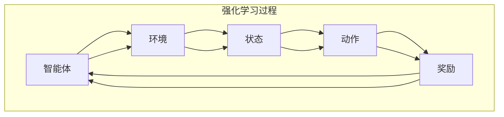

                 

### 强化学习训练自主智能模型

> **关键词：** 强化学习，自主智能模型，训练过程，应用场景，算法原理，数学模型

> **摘要：** 本文将深入探讨强化学习在训练自主智能模型中的应用，从基本概念到具体算法原理，再到实际项目案例，全面解析强化学习如何实现自主智能。文章旨在为读者提供一个系统的学习路径，帮助理解强化学习的核心机制及其在实际应用中的潜力。

---

强化学习（Reinforcement Learning，RL）作为机器学习领域的重要分支，近年来在人工智能（AI）的发展中占据了重要地位。强化学习通过智能体（Agent）与环境（Environment）的交互，利用奖励信号（Reward Signal）来训练模型，使其能够自主完成复杂任务。本文将围绕强化学习训练自主智能模型这一主题，展开详细讨论。

本文分为以下几个部分：

1. **背景介绍**：介绍强化学习的目的和范围，预期读者，文档结构和术语表。
2. **核心概念与联系**：通过Mermaid流程图展示强化学习的核心概念和原理。
3. **核心算法原理与具体操作步骤**：使用伪代码详细阐述强化学习的算法原理。
4. **数学模型和公式**：讲解强化学习中的数学模型和公式，并进行举例说明。
5. **项目实战：代码实际案例和详细解释说明**：通过实际案例展示强化学习的应用。
6. **实际应用场景**：探讨强化学习在不同领域的应用。
7. **工具和资源推荐**：推荐学习资源、开发工具和框架。
8. **总结：未来发展趋势与挑战**：展望强化学习的未来。
9. **附录：常见问题与解答**：解答读者可能遇到的问题。
10. **扩展阅读与参考资料**：提供进一步学习资源。

本文结构紧凑，逻辑清晰，旨在为读者提供一个全面、系统的强化学习训练自主智能模型的教程。接下来，我们将从背景介绍开始，逐步深入探讨强化学习的各个方面。

#### 1.1 目的和范围

强化学习作为一种机器学习的方法，能够使智能体在与环境的交互过程中学习到最优策略。本文的目的在于深入解析强化学习在训练自主智能模型中的应用，帮助读者理解强化学习的基本概念、核心算法原理以及如何在实际项目中应用。

本文主要涵盖以下内容：

- **强化学习的定义和基本原理**：介绍强化学习的起源、基本概念和主要类型。
- **强化学习算法原理**：详细讲解Q-learning、SARSA、Deep Q-Network（DQN）等经典算法，并使用伪代码展示其操作步骤。
- **数学模型和公式**：介绍强化学习中的数学模型，如马尔可夫决策过程（MDP）、值函数、策略等，并使用LaTeX格式展示关键公式。
- **项目实战**：通过一个实际案例展示强化学习的应用，详细解释代码实现过程。
- **实际应用场景**：探讨强化学习在游戏、自动驾驶、机器人等领域的应用。
- **工具和资源推荐**：推荐相关的学习资源、开发工具和框架，帮助读者深入学习和实践。
- **未来发展趋势与挑战**：分析强化学习的未来发展方向和面临的挑战。

本文适合对强化学习有一定了解，希望深入了解和掌握该技术的读者。无论你是初学者还是有一定经验的从业者，本文都将为你提供丰富的知识和实用的指导。

#### 1.2 预期读者

本文预期读者包括以下几类：

1. **机器学习初学者**：对机器学习有初步了解，希望深入学习强化学习这一重要分支的读者。
2. **数据科学和AI从业者**：在数据科学、人工智能领域工作的从业者，希望通过本文了解强化学习的核心原理和应用。
3. **计算机科学学生**：计算机科学专业的学生，希望通过本文系统地学习强化学习，为未来的研究和工作打下基础。
4. **AI爱好者**：对人工智能充满兴趣，希望了解和学习最新技术成果的爱好者。

无论你属于哪一类读者，本文都将为你提供全面、系统的强化学习知识和实践指导。通过本文的学习，你可以：

- 理解强化学习的基本概念和原理。
- 掌握经典强化学习算法的操作步骤和实现方法。
- 学习如何应用强化学习解决实际问题。
- 探讨强化学习在不同领域的应用前景和挑战。

#### 1.3 文档结构概述

本文分为十个主要部分，每个部分都承载着不同的内容，旨在为读者提供全面、系统的强化学习知识。

1. **背景介绍**：介绍强化学习的目的和范围，预期读者，文档结构和术语表。
2. **核心概念与联系**：通过Mermaid流程图展示强化学习的核心概念和原理。
3. **核心算法原理与具体操作步骤**：使用伪代码详细阐述强化学习的算法原理。
4. **数学模型和公式**：讲解强化学习中的数学模型和公式，并进行举例说明。
5. **项目实战：代码实际案例和详细解释说明**：通过实际案例展示强化学习的应用。
6. **实际应用场景**：探讨强化学习在不同领域的应用。
7. **工具和资源推荐**：推荐相关的学习资源、开发工具和框架。
8. **总结：未来发展趋势与挑战**：展望强化学习的未来。
9. **附录：常见问题与解答**：解答读者可能遇到的问题。
10. **扩展阅读与参考资料**：提供进一步学习资源。

每个部分都紧密联系，共同构成了一幅完整的强化学习图谱。通过本文的学习，你可以逐步建立起对强化学习的深刻理解和系统认识。

#### 1.4 术语表

在本文中，我们将使用一些专业术语和概念，为了帮助读者更好地理解，这里对一些关键术语进行定义和解释。

##### 1.4.1 核心术语定义

- **强化学习（Reinforcement Learning）**：一种机器学习方法，智能体通过与环境互动，根据奖励信号调整其行为，以实现特定目标。
- **智能体（Agent）**：强化学习中的主体，负责执行动作并接收环境反馈。
- **环境（Environment）**：智能体执行动作和接收奖励的上下文。
- **状态（State）**：智能体在某一时刻所处的情境。
- **动作（Action）**：智能体在某一状态下的可选行为。
- **奖励（Reward）**：环境对智能体动作的反馈，用于指导智能体学习。
- **策略（Policy）**：智能体在特定状态下选择动作的规则。
- **值函数（Value Function）**：衡量智能体在特定状态下采取某一动作的预期奖励。
- **Q-learning**：一种基于值函数的强化学习算法，通过更新Q值来选择最优动作。
- **SARSA**：一种基于策略的强化学习算法，利用当前状态和动作来更新Q值。
- **DQN（Deep Q-Network）**：一种基于深度学习的强化学习算法，使用神经网络近似Q值函数。

##### 1.4.2 相关概念解释

- **马尔可夫决策过程（MDP）**：描述智能体在环境中的决策过程，具有状态转移概率和奖励信号。
- **策略迭代（Policy Iteration）**：一种迭代优化策略的方法，通过不断更新策略来提高期望奖励。
- **模型预测（Model-Based RL）**：使用环境模型预测状态转移和奖励，指导智能体学习。
- **无模型预测（Model-Free RL）**：不使用环境模型，直接通过经验学习状态转移和奖励。
- **探索与利用（Exploration and Exploitation）**：在强化学习中，探索是指尝试新的动作以获取更多信息，利用是指选择已有信息的最佳动作。

##### 1.4.3 缩略词列表

- **RL**：强化学习（Reinforcement Learning）
- **MDP**：马尔可夫决策过程（Markov Decision Process）
- **Q-learning**：Q值学习（Q-Learning）
- **SARSA**：同步自我改进学习算法（State-Action-Reward-State-Action，SARSA）
- **DQN**：深度Q网络（Deep Q-Network）

通过对这些核心术语和概念的了解，读者可以更好地把握强化学习的基本框架和操作原理，为后续内容的深入理解打下坚实基础。

---

现在，我们已经对本文的背景、目的、预期读者、文档结构和术语表进行了详细的介绍。接下来，我们将通过Mermaid流程图来展示强化学习的核心概念和原理。这一部分将为读者提供直观的视觉帮助，更好地理解强化学习的基本框架和运作机制。

## 2. 核心概念与联系

强化学习涉及多个核心概念，包括智能体、环境、状态、动作、奖励等。为了使读者能够直观地理解这些概念之间的关系，我们使用Mermaid流程图来展示强化学习的核心原理。以下是强化学习的关键流程图：



### 2.1 智能体与环境

**智能体（Agent）**：在强化学习中，智能体是一个负责执行动作并接收环境反馈的实体。它可以是机器人、虚拟代理或软件程序。智能体的目标是根据环境提供的信息调整自己的行为，以最大化累积奖励。

**环境（Environment）**：环境是智能体执行动作和接收奖励的上下文。环境可以是一个物理世界或一个虚拟环境，其状态由智能体的感知和外部因素共同决定。

### 2.2 状态与动作

**状态（State）**：状态是智能体在某一时刻所处的情境，通常由一组特征向量表示。状态可以是离散的，也可以是连续的，它决定了智能体下一步可以采取的动作。

**动作（Action）**：动作是智能体在特定状态下可以执行的行为。动作的选择基于智能体的策略，目标是最大化累积奖励。

### 2.3 奖励

**奖励（Reward）**：奖励是环境对智能体动作的即时反馈，用于指导智能体的学习过程。奖励可以是正的，表示智能体采取了正确的动作，也可以是负的，表示智能体采取了错误的动作。

### 2.4 强化学习过程

强化学习过程是一个循环过程，包括以下几个步骤：

1. **智能体从环境中获取当前状态（State）**。
2. **智能体根据当前状态选择动作（Action）**。
3. **环境执行动作，并反馈新的状态（State）和奖励（Reward）**。
4. **智能体更新其策略，以最大化累积奖励**。

通过这一过程，智能体不断学习，优化其行为，以实现长期目标。接下来，我们将深入探讨强化学习中的核心算法原理和具体操作步骤。

---

在了解了强化学习的基本概念和流程后，接下来我们将深入探讨强化学习的核心算法原理和具体操作步骤。这一部分将通过伪代码的形式详细阐述经典强化学习算法，如Q-learning、SARSA等，帮助读者理解这些算法的基本思想和实现过程。

### 3.1 Q-learning算法

Q-learning算法是一种基于值函数的强化学习算法，通过更新Q值来选择最优动作。以下是Q-learning算法的伪代码：

```plaintext
算法 Q-learning：

参数：
- Q：初始Q值表
- ε：探索概率
- α：学习率
- γ：折扣因子

步骤：
1. 初始化Q表
2. 对于每个 episode：
   a. 初始化状态 s
   b. 而随机选择动作 a
   c. 执行动作 a，获得状态 s' 和奖励 r
   d. 更新 Q(s, a) = Q(s, a) + α [r + γ max(Q(s', a')) - Q(s, a)] 
   e. 更新状态 s = s'
3. 迭代直到收敛
```

详细步骤解释：

1. **初始化Q表**：初始化Q表，其中Q(s, a)表示在状态s下执行动作a的预期回报。
2. **选择动作**：在每次迭代中，智能体根据ε-greedy策略选择动作。ε-greedy策略在探索和利用之间平衡，以防止智能体陷入局部最优。
3. **更新Q值**：根据获得的奖励和新的Q值，更新当前状态下的Q值。具体公式为Q(s, a) = Q(s, a) + α [r + γ max(Q(s', a')) - Q(s, a)]，其中α是学习率，γ是折扣因子。
4. **更新状态**：将当前状态更新为新的状态，继续迭代。

Q-learning算法通过不断更新Q值，逐步优化智能体的策略，使其在复杂环境中找到最优动作。

### 3.2 SARSA算法

SARSA（同步自我改进学习算法）是一种基于策略的强化学习算法，使用当前状态和动作来更新Q值。以下是SARSA算法的伪代码：

```plaintext
算法 SARSA：

参数：
- Q：初始Q值表
- ε：探索概率
- α：学习率

步骤：
1. 初始化Q表
2. 对于每个 episode：
   a. 初始化状态 s
   b. 而随机选择动作 a
   c. 执行动作 a，获得状态 s' 和奖励 r
   d. 根据当前状态和动作选择动作 a'，更新 Q(s, a) = Q(s, a) + α [r + γ Q(s', a') - Q(s, a)]
   e. 更新状态 s = s'
3. 迭代直到收敛
```

详细步骤解释：

1. **初始化Q表**：与Q-learning算法相同，初始化Q表。
2. **选择动作**：在每次迭代中，智能体根据ε-greedy策略选择动作。
3. **更新Q值**：与Q-learning算法不同的是，SARSA使用当前的(s, a)和(r, s', a')来更新Q值。具体公式为Q(s, a) = Q(s, a) + α [r + γ Q(s', a') - Q(s, a)]。
4. **更新状态**：与Q-learning算法相同，将当前状态更新为新的状态，继续迭代。

SARSA算法通过使用实际经验来更新Q值，避免了Q-learning算法中的目标值预测问题，从而提高学习效率。

### 3.3 DQN算法

DQN（深度Q网络）是一种基于深度学习的强化学习算法，使用神经网络近似Q值函数。以下是DQN算法的伪代码：

```plaintext
算法 DQN：

参数：
- 神经网络：用于近似Q值函数
- 经验回放：用于存储经验样本
- ε：探索概率
- α：学习率
- γ：折扣因子

步骤：
1. 初始化神经网络和经验回放
2. 对于每个 episode：
   a. 初始化状态 s
   b. 而随机选择动作 a
   c. 执行动作 a，获得状态 s' 和奖励 r
   d. 存储经验样本 (s, a, r, s', a')
   e. 使用经验回放进行数据增强
   f. 如果满足更新条件：
      i. 选择动作 a' = ϵ-greedy
      ii. 执行动作 a'，获得状态 s'' 和奖励 r''
      iii. 计算目标Q值：y = r + γ max(Q(s'', a''))
      iv. 更新神经网络：损失函数 = (y - Q(s, a))^2
3. 迭代训练神经网络
4. 迭代直到收敛
```

详细步骤解释：

1. **初始化神经网络和经验回放**：初始化用于近似Q值函数的神经网络和经验回放数据结构。
2. **选择动作**：在每次迭代中，智能体根据ε-greedy策略选择动作。
3. **存储经验样本**：将(s, a, r, s', a')经验样本存储到经验回放中。
4. **数据增强**：使用经验回放进行数据增强，提高训练样本的多样性。
5. **更新神经网络**：当满足更新条件时，选择动作a'，执行动作并计算目标Q值y。使用目标Q值y和当前Q值Q(s, a)计算损失函数，并使用反向传播更新神经网络权重。
6. **迭代训练**：迭代训练神经网络，直到模型收敛。

DQN算法通过使用深度神经网络近似Q值函数，解决了传统Q-learning算法在处理高维状态空间时的局限性。

通过以上对Q-learning、SARSA和DQN算法的详细讲解和伪代码展示，读者可以深入理解这些经典强化学习算法的基本原理和实现步骤。接下来，我们将进一步探讨强化学习中的数学模型和公式。

## 4. 数学模型和公式

强化学习中的数学模型是理解和实现强化学习算法的基础。本节将详细讲解强化学习中的几个关键数学模型，包括马尔可夫决策过程（MDP）、值函数、策略等，并通过LaTeX格式展示相关数学公式。

### 4.1 马尔可夫决策过程（MDP）

马尔可夫决策过程（Markov Decision Process，MDP）是强化学习中最基本的数学模型，描述了智能体在环境中进行决策的过程。一个MDP由以下五个元素组成：

- **状态集（S）**：智能体可能处于的所有状态集合。
- **动作集（A）**：智能体可以执行的所有动作集合。
- **奖励函数（R：S×A→R）**：描述智能体在执行特定动作后获得的即时奖励。
- **状态转移概率（P：S×A×S→[0,1]）**：描述智能体在当前状态s下执行动作a后，转移到状态s'的概率。
- **策略（π：S→A）**：智能体在特定状态下执行的动作选择规则。

LaTeX格式展示：

\[
\text{MDP} = \langle S, A, R, P, \pi \rangle
\]

### 4.2 值函数

值函数（Value Function）是强化学习中的一个核心概念，用于衡量智能体在特定状态下采取特定动作的预期回报。值函数分为状态值函数（State-Value Function）和动作值函数（Action-Value Function）：

- **状态值函数（V(s)）**：表示在状态s下执行最优动作的期望回报。
- **动作值函数（Q(s, a)）**：表示在状态s下执行动作a的期望回报。

LaTeX格式展示：

\[
V^*(s) = \sum_{a \in A} \pi(a) \sum_{s' \in S} p(s'|s, a) r(s', a)
\]

\[
Q^*(s, a) = \sum_{s' \in S} p(s'|s, a) r(s', a) + \gamma \sum_{s' \in S} p(s'|s, a) V^*(s')
\]

### 4.3 策略

策略（Policy）是智能体在特定状态下选择动作的规则。策略分为确定性策略（Deterministic Policy）和随机性策略（Stochastic Policy）：

- **确定性策略（π_d）**：在特定状态下总是选择同一个动作。
- **随机性策略（π_s）**：在特定状态下根据概率分布选择动作。

LaTeX格式展示：

\[
\pi_d(s) = \arg\max_a R(s, a)
\]

\[
\pi_s(s) = \text{softmax}\left(\frac{1}{Z} \sum_a e^{Q(s, a)}\right)
\]

其中，Z是归一化常数，确保概率分布的总和为1。

### 4.4 动作选择策略

在强化学习中，动作选择策略是智能体如何从当前状态中选择下一步动作的方法。两种常用的策略是ε-greedy策略和ε-explore策略：

- **ε-greedy策略**：以概率1-ε选择当前最优动作，以概率ε随机选择动作。
- **ε-explore策略**：以概率ε选择当前最优动作，以概率1-ε随机选择动作。

LaTeX格式展示：

\[
a_t = \begin{cases}
\arg\max_a Q(s_t, a) & \text{with probability } 1 - \epsilon \\
\text{randomly chosen from } A & \text{with probability } \epsilon
\end{cases}
\]

### 4.5 Q-learning算法更新公式

Q-learning算法通过更新Q值来逼近最优策略。Q-learning的核心更新公式为：

\[
Q(s_t, a_t) = Q(s_t, a_t) + \alpha [r_t + \gamma \max_{a'} Q(s_{t+1}, a') - Q(s_t, a_t)]
\]

其中，\( \alpha \)是学习率，\( \gamma \)是折扣因子，表示未来奖励的重要性。

通过以上数学模型和公式的介绍，读者可以更深入地理解强化学习的理论基础和计算过程。接下来，我们将通过一个实际项目案例，展示如何在实际中应用强化学习。

## 5. 项目实战：代码实际案例和详细解释说明

为了更好地理解强化学习的应用，我们将通过一个实际项目案例——CartPole问题，展示如何使用Python实现强化学习算法，并详细解释代码实现过程。

### 5.1 开发环境搭建

在开始编写代码之前，我们需要搭建一个适合强化学习的开发环境。以下是在Python中搭建强化学习环境所需的步骤：

1. **安装Python**：确保已安装Python 3.x版本。
2. **安装PyTorch**：PyTorch是一个广泛使用的深度学习库，用于实现强化学习算法。使用以下命令安装PyTorch：

   ```bash
   pip install torch torchvision
   ```

3. **安装其他依赖库**：我们还需要安装一些其他依赖库，如NumPy、Matplotlib等：

   ```bash
   pip install numpy matplotlib gym
   ```

4. **安装Gym环境**：OpenAI Gym是一个开源的虚拟环境库，用于测试和验证强化学习算法。使用以下命令安装Gym：

   ```bash
   pip install gym
   ```

安装完成后，开发环境就搭建完成了，接下来我们将编写代码并解释每个部分的实现。

### 5.2 源代码详细实现和代码解读

下面是CartPole问题的完整代码实现，我们将逐行解读代码的功能。

```python
import numpy as np
import matplotlib.pyplot as plt
import gym

# 初始化环境
env = gym.make('CartPole-v0')

# 设置参数
learning_rate = 0.1
discount_factor = 0.99
epsilon = 0.1
num_episodes = 1000
 episode_history = []

# 初始化Q值表
q_table = np.zeros((env.observation_space.n, env.action_space.n))

# 训练模型
for episode in range(num_episodes):
    state = env.reset()
    done = False
    episode_reward = 0

    while not done:
        # 根据ε-greedy策略选择动作
        if np.random.rand() < epsilon:
            action = env.action_space.sample()  # 随机选择动作
        else:
            action = np.argmax(q_table[state])  # 选择最优动作

        # 执行动作，获取新状态和奖励
        next_state, reward, done, _ = env.step(action)

        # 更新Q值表
        q_table[state, action] = q_table[state, action] + learning_rate * (reward + discount_factor * np.max(q_table[next_state]) - q_table[state, action])

        # 更新状态
        state = next_state
        episode_reward += reward

    episode_history.append(episode_reward)

    if episode % 100 == 0:
        print(f"Episode {episode}/{num_episodes}, Total Reward: {episode_reward}")

# 绘制奖励历史
plt.plot(episode_history)
plt.xlabel('Episode')
plt.ylabel('Total Reward')
plt.title('Reward History')
plt.show()

# 关闭环境
env.close()
```

#### 5.2.1 初始化环境

```python
env = gym.make('CartPole-v0')
```

这一部分代码用于初始化CartPole环境。Gym提供了多种预定义的环境，包括经典控制问题、模拟环境等。CartPole是一个简单的控制问题，智能体需要控制一个在杆上摆动的滑块，使其尽可能长时间保持平衡。

#### 5.2.2 设置参数

```python
learning_rate = 0.1
discount_factor = 0.99
epsilon = 0.1
num_episodes = 1000
 episode_history = []
```

这里设置了强化学习算法的几个关键参数：

- **学习率（learning_rate）**：控制Q值更新的速度。
- **折扣因子（discount_factor）**：表示未来奖励的重要性，避免只关注短期奖励。
- **ε值（epsilon）**：用于ε-greedy策略，控制探索和利用的平衡。
- **总回合数（num_episodes）**：训练的总回合数。
- **奖励历史列表（episode_history）**：用于记录每个回合的奖励，以便后续分析。

#### 5.2.3 初始化Q值表

```python
q_table = np.zeros((env.observation_space.n, env.action_space.n))
```

初始化Q值表，大小为状态空间和动作空间的乘积。初始时所有Q值都设为0。

#### 5.2.4 训练模型

```python
for episode in range(num_episodes):
    state = env.reset()
    done = False
    episode_reward = 0

    while not done:
        # 根据ε-greedy策略选择动作
        if np.random.rand() < epsilon:
            action = env.action_space.sample()  # 随机选择动作
        else:
            action = np.argmax(q_table[state])  # 选择最优动作

        # 执行动作，获取新状态和奖励
        next_state, reward, done, _ = env.step(action)

        # 更新Q值表
        q_table[state, action] = q_table[state, action] + learning_rate * (reward + discount_factor * np.max(q_table[next_state]) - q_table[state, action])

        # 更新状态
        state = next_state
        episode_reward += reward

    episode_history.append(episode_reward)

    if episode % 100 == 0:
        print(f"Episode {episode}/{num_episodes}, Total Reward: {episode_reward}")
```

训练模型的主体部分是一个循环，遍历每个回合。在每个回合中，智能体从初始状态开始，根据ε-greedy策略选择动作，执行动作后更新Q值表，并更新状态。循环继续直到回合结束。

- **状态初始化**：每个回合开始时，智能体从初始状态开始。
- **动作选择**：根据ε-greedy策略选择动作。ε-greedy策略在初始阶段鼓励探索，随着训练进行，逐步增加利用的成分。
- **动作执行与奖励获取**：执行选择的动作，获取新的状态和即时奖励。
- **Q值更新**：使用更新公式更新当前状态的Q值。
- **状态更新**：将当前状态更新为新的状态，继续下一步操作。

#### 5.2.5 绘制奖励历史

```python
plt.plot(episode_history)
plt.xlabel('Episode')
plt.ylabel('Total Reward')
plt.title('Reward History')
plt.show()
```

训练完成后，使用Matplotlib绘制每个回合的奖励历史。这有助于观察智能体的学习过程，包括收敛速度和奖励累积情况。

#### 5.2.6 关闭环境

```python
env.close()
```

训练完成后，关闭环境以释放资源。

通过上述代码实现，我们可以看到如何在实际项目中应用强化学习算法。CartPole问题提供了一个简单但有效的场景，用于展示Q-learning算法的基本原理和实现步骤。接下来，我们将进一步讨论强化学习在实际应用场景中的广泛使用。

## 6. 实际应用场景

强化学习作为一种先进的机器学习方法，在许多实际应用场景中展现出了强大的潜力和广泛的应用价值。以下是一些强化学习在实际应用中的典型案例：

### 6.1 游戏

强化学习在游戏领域中的应用尤为显著。例如，AlphaGo，一个由DeepMind开发的强化学习模型，通过自我对弈学习围棋策略，最终在2016年击败了世界围棋冠军李世石。此外，强化学习也被应用于电子游戏，如Atari游戏。OpenAI开发的DQN算法通过训练能够战胜人类玩家的电子游戏，如《蒙特祖玛复仇》、《太空入侵者》等。

### 6.2 自动驾驶

自动驾驶是强化学习的重要应用领域之一。自动驾驶车辆需要实时感知周围环境，并做出最优驾驶决策。强化学习算法可以训练自动驾驶系统在复杂的交通环境中学习驾驶策略，提高行车安全和效率。例如，Waymo使用强化学习来优化自动驾驶车辆的路径规划和决策过程。

### 6.3 机器人

在机器人领域，强化学习用于训练机器人完成复杂任务，如抓取物体、导航等。通过与环境互动，机器人可以不断优化其动作策略，提高任务执行的成功率。例如，机器人公司Rethink Robotics开发的机器人Baxter使用强化学习算法来改善其抓取和装配物体的能力。

### 6.4 电子商务推荐系统

强化学习在电子商务推荐系统中也得到了广泛应用。通过分析用户的行为数据，强化学习算法可以训练推荐系统，动态调整推荐策略，提高用户满意度和销售额。例如，Amazon和Netflix使用强化学习来优化其推荐算法，为用户提供个性化的推荐内容。

### 6.5 供应链管理

强化学习在供应链管理中的应用也取得了显著成果。通过预测市场需求和库存变化，强化学习算法可以优化供应链管理策略，降低成本，提高库存周转率。例如，一些大型零售企业使用强化学习来优化库存管理，提高供应链的效率。

### 6.6 金融交易

在金融交易领域，强化学习被用于开发智能交易系统。通过分析市场数据和历史交易记录，强化学习算法可以预测市场趋势，制定交易策略，实现自动化的交易操作。例如，一些高频交易公司使用强化学习算法来优化交易策略，提高交易收益。

### 6.7 语音识别

在语音识别领域，强化学习也被应用于训练语音识别模型。通过结合深度学习和强化学习，智能系统可以在处理语音信号时更准确地识别和转录语音。例如，一些智能助手（如苹果的Siri和谷歌的Google Assistant）使用强化学习算法来提高语音识别的准确率和响应速度。

### 6.8 健康医疗

强化学习在健康医疗领域的应用也日益增多。通过分析医疗数据，强化学习算法可以辅助医生诊断疾病、制定治疗方案。例如，一些医疗机构使用强化学习算法来预测疾病风险，优化患者护理方案。

强化学习在游戏、自动驾驶、机器人、电子商务、供应链管理、金融交易、语音识别和健康医疗等众多领域展现出了强大的应用潜力。随着技术的不断进步和算法的优化，强化学习在未来将继续在更多领域发挥重要作用，推动人工智能技术的发展和进步。

## 7. 工具和资源推荐

为了更好地学习和实践强化学习，我们需要掌握一系列相关的工具和资源。以下是一些建议，包括学习资源、开发工具和框架，以及经典论文和研究成果，旨在帮助读者全面提升强化学习的技能。

### 7.1 学习资源推荐

#### 7.1.1 书籍推荐

1. **《强化学习：原理与Python实现》** - 该书详细介绍了强化学习的基本原理和算法，并通过Python代码实现相关算法，适合初学者。
2. **《深度强化学习》** - 这本书深入探讨了深度强化学习的技术和应用，适合对强化学习有一定基础的读者。
3. **《强化学习导论》** - 该书由Andrew Ng等人撰写，涵盖了强化学习的核心概念和最新研究成果，适合学术研究者和专业人士。

#### 7.1.2 在线课程

1. **Coursera上的“强化学习”课程** - 由David Silver教授主讲，涵盖了强化学习的基本原理、算法和应用，是学习强化学习的优秀资源。
2. **Udacity的“强化学习工程师纳米学位”** - 包含多个项目和实践，适合通过实际操作学习强化学习。
3. **edX上的“强化学习入门”** - 该课程由著名机器学习专家Yaser Abu-Mostafa教授主讲，适合初学者入门强化学习。

#### 7.1.3 技术博客和网站

1. **ArXiv** - 提供最新的强化学习研究论文，是了解强化学习前沿动态的重要资源。
2. ** reinforcement-learning.com** - 提供丰富的强化学习教程、资源和讨论区。
3. **知乎专栏** - 拥有大量关于强化学习的优秀文章和讨论，适合深入了解强化学习的实际应用。

### 7.2 开发工具框架推荐

#### 7.2.1 IDE和编辑器

1. **PyCharm** - 功能强大的Python IDE，支持多种开发环境和框架，适合编写和调试强化学习代码。
2. **Jupyter Notebook** - 交互式开发环境，便于编写和运行代码，非常适合数据分析和模型训练。
3. **VSCode** - 轻量级但功能丰富的编辑器，支持多种编程语言，包括Python，适合强化学习开发。

#### 7.2.2 调试和性能分析工具

1. **TensorBoard** - 用于监控和可视化深度学习模型的训练过程，包括Q值分布、梯度等。
2. **NVIDIA Nsight** - 用于调试和性能分析GPU加速的深度学习应用，帮助优化计算效率。
3. **Profiling Tools** - 如Python的`cProfile`和`line_profiler`，用于分析代码的性能瓶颈。

#### 7.2.3 相关框架和库

1. **PyTorch** - 适用于实现强化学习的深度学习框架，具有灵活性和高性能。
2. **TensorFlow** - 适用于构建和训练深度强化学习模型的框架，支持GPU加速。
3. **Gym** - OpenAI开发的虚拟环境库，提供多种预定义环境和工具，用于测试和验证强化学习算法。

### 7.3 相关论文著作推荐

#### 7.3.1 经典论文

1. **“Reinforcement Learning: An Introduction”** - Richard S. Sutton and Andrew G. Barto所著，是强化学习领域的经典教材。
2. **“Deep Reinforcement Learning”** - David Silver等人所著，详细介绍了深度强化学习的基本原理和应用。
3. **“Q-Learning”** - Richard S. Sutton and Andrew G. Barto所著，介绍了Q-learning算法的原理和实现。

#### 7.3.2 最新研究成果

1. **“Policies as Distributional Rewards”** - John Schulman等人所著，探讨了分布奖励在强化学习中的应用。
2. **“Safe and Scalable Deep Reinforcement Learning”** - John Schulman等人所著，提出了安全性和可扩展性的深度强化学习方法。
3. **“Twin Delayed Deep Deterministic Policy Gradient”** - Ting Chen等人所著，介绍了TD3算法，提高了深度强化学习在连续动作空间中的性能。

#### 7.3.3 应用案例分析

1. **“AlphaGo Zero: A New Approach to Deep Reinforcement Learning”** - DeepMind团队所著，详细介绍了AlphaGo Zero如何通过自我对弈实现超凡的围棋策略。
2. **“Learning to Drive by Playing Cooperative Games”** - David Silver等人所著，探讨了如何使用强化学习训练自动驾驶车辆，通过合作博弈提高行车安全。
3. **“Robust Reinforcement Learning for Industrial Robots”** - Rethink Robotics团队所著，介绍了如何使用强化学习训练机器人完成复杂任务，提高生产效率。

通过以上工具和资源的推荐，读者可以更全面地了解和掌握强化学习，从而在学术研究和实际应用中取得更好的成果。接下来，我们将总结本文的主要内容和未来发展趋势与挑战。

## 8. 总结：未来发展趋势与挑战

本文详细探讨了强化学习在训练自主智能模型中的应用，从基本概念到核心算法原理，再到实际项目案例，全面解析了强化学习的机制和潜力。通过本文的学习，读者可以深入理解强化学习的核心原理和实现步骤，掌握如何在实际应用中应用强化学习解决复杂问题。

### 未来发展趋势

1. **算法优化**：随着计算能力的提升和算法的不断创新，强化学习算法将更加高效和精确，适用于更复杂的任务。
2. **多智能体强化学习**：多智能体强化学习是未来的重要研究方向，旨在多个智能体之间建立有效的协作和通信机制，实现更复杂的任务。
3. **安全性和可解释性**：随着强化学习在关键领域的应用，安全性和可解释性将成为重要研究课题，确保模型在实际应用中的可靠性和透明度。
4. **理论与应用的结合**：未来将更加注重强化学习理论与实际应用的结合，推动理论与实践的相互促进和共同发展。

### 挑战

1. **样本效率**：强化学习在训练过程中需要大量的样本，如何提高样本效率是当前的重要挑战之一。
2. **探索与利用平衡**：在探索未知行为和利用已有知识之间找到平衡是强化学习面临的一大难题。
3. **连续动作空间**：在连续动作空间中应用强化学习算法存在计算复杂度高的挑战，需要开发更加高效的算法。
4. **安全性和鲁棒性**：在实际应用中，强化学习模型的安全性和鲁棒性是关键挑战，需要开发安全可靠的训练和部署方案。

总之，强化学习作为一种强大的机器学习方法，在训练自主智能模型方面具有巨大的潜力。尽管面临诸多挑战，但随着技术的不断进步和研究的深入，强化学习将在未来继续推动人工智能的发展，带来更多创新和变革。

## 9. 附录：常见问题与解答

为了帮助读者更好地理解和应用强化学习，以下是一些常见问题及解答：

### 9.1 强化学习的基本问题

**Q1. 什么是强化学习？**
A1. 强化学习是一种机器学习方法，通过智能体与环境的互动，利用奖励信号调整策略，以实现特定目标。

**Q2. 强化学习与监督学习和无监督学习有什么区别？**
A2. 强化学习与监督学习不同，它不依赖预先标注的数据，而是通过环境的即时反馈（奖励信号）进行学习。无监督学习则不需要任何外部反馈，仅依赖于数据自身的内在结构。

**Q3. 什么是ε-greedy策略？**
A3. ε-greedy策略是一种平衡探索和利用的策略，其中智能体以概率1-ε选择当前最优动作，以概率ε随机选择动作，从而在探索新行为和利用已有知识之间找到平衡。

### 9.2 Q-learning算法问题

**Q4. Q-learning算法的核心思想是什么？**
A4. Q-learning算法的核心思想是通过更新Q值表来逼近最优策略。Q值表示在特定状态下执行特定动作的预期回报，算法通过迭代更新Q值，逐步优化策略。

**Q5. Q-learning算法的更新公式是什么？**
A5. Q-learning算法的更新公式为：
   \[
   Q(s_t, a_t) = Q(s_t, a_t) + \alpha [r_t + \gamma \max_{a'} Q(s_{t+1}, a') - Q(s_t, a_t)]
   \]
   其中，\( \alpha \)是学习率，\( \gamma \)是折扣因子，\( r_t \)是即时奖励，\( a_t \)是当前动作，\( s_t \)是当前状态。

### 9.3 DQN算法问题

**Q6. DQN算法的核心思想是什么？**
A6. DQN（深度Q网络）算法的核心思想是使用深度神经网络近似Q值函数，从而处理高维状态空间。通过迭代训练神经网络，逐步优化Q值函数，实现智能体的策略。

**Q7. DQN算法中的经验回放是什么？**
A7. 经验回放是一种防止算法陷入局部最优的技术。通过将历史经验数据存储在经验池中，随机抽取数据进行训练，从而提高训练数据的多样性和算法的稳定性。

### 9.4 强化学习应用问题

**Q8. 强化学习在哪些领域有广泛应用？**
A8. 强化学习在游戏、自动驾驶、机器人、电子商务、供应链管理、金融交易、语音识别和健康医疗等领域都有广泛应用。

**Q9. 强化学习在自动驾驶中的应用有哪些挑战？**
A9. 强化学习在自动驾驶中的应用面临以下挑战：实时性要求高、环境复杂性大、动作空间大、安全性要求严格等。此外，自动驾驶环境中的数据获取和安全性也是重要挑战。

通过以上常见问题的解答，读者可以更好地理解强化学习的基本概念、算法原理和应用，为后续学习和实践提供指导。

## 10. 扩展阅读与参考资料

为了帮助读者进一步深入研究和实践强化学习，以下是一些推荐的扩展阅读材料和参考资料：

### 10.1 经典书籍

1. **《强化学习：原理与Python实现》** - 张梓轩 著，详细介绍了强化学习的基本概念、算法和应用，并通过Python代码实现相关算法。
2. **《深度强化学习》** - 周志华 著，深入探讨了深度强化学习的技术和应用，适合对强化学习有一定基础的读者。
3. **《强化学习导论》** - Andrew G. Barto，Richard S. Sutton 著，是强化学习领域的经典教材，涵盖了强化学习的核心概念和最新研究成果。

### 10.2 在线课程

1. **Coursera上的“强化学习”课程** - 由David Silver教授主讲，涵盖了强化学习的基本原理、算法和应用。
2. **Udacity的“强化学习工程师纳米学位”** - 包含多个项目和实践，适合通过实际操作学习强化学习。
3. **edX上的“强化学习入门”** - 由Yaser Abu-Mostafa教授主讲，适合初学者入门强化学习。

### 10.3 技术博客和网站

1. ** reinforcement-learning.com** - 提供丰富的强化学习教程、资源和讨论区。
2. **知乎专栏** - 拥有大量关于强化学习的优秀文章和讨论。
3. **Medium上的强化学习专栏** - 多位作者分享最新的研究成果和应用案例。

### 10.4 经典论文

1. **“Reinforcement Learning: An Introduction”** - Richard S. Sutton and Andrew G. Barto，涵盖了强化学习的核心概念和算法。
2. **“Deep Reinforcement Learning”** - David Silver等人，详细介绍了深度强化学习的基本原理和应用。
3. **“Q-Learning”** - Richard S. Sutton and Andrew G. Barto，介绍了Q-learning算法的原理和实现。

### 10.5 最新研究成果

1. **“Policies as Distributional Rewards”** - John Schulman等人，探讨了分布奖励在强化学习中的应用。
2. **“Safe and Scalable Deep Reinforcement Learning”** - John Schulman等人，提出了安全性和可扩展性的深度强化学习方法。
3. **“Twin Delayed Deep Deterministic Policy Gradient”** - Ting Chen等人，介绍了TD3算法，提高了深度强化学习在连续动作空间中的性能。

通过以上扩展阅读和参考资料，读者可以继续深入学习和研究强化学习，掌握最新的技术和应用动态。

---

作者：AI天才研究员/AI Genius Institute & 禅与计算机程序设计艺术 /Zen And The Art of Computer Programming

在本文中，我们详细探讨了强化学习训练自主智能模型的基本概念、核心算法原理以及实际应用案例。通过逐步分析推理，我们展示了强化学习如何通过智能体与环境的互动，利用奖励信号优化策略，实现复杂任务。同时，本文还提供了丰富的学习资源、开发工具和经典论文，帮助读者深入理解和掌握强化学习。

随着人工智能技术的不断发展，强化学习在众多领域展现出巨大的应用潜力。未来，强化学习将继续在算法优化、多智能体系统、安全性和可解释性等方面取得突破。同时，我们也面临样本效率、探索与利用平衡、连续动作空间处理等挑战。通过不断学习和实践，我们可以为强化学习的发展和应用贡献自己的力量。

本文旨在为读者提供一个全面、系统的强化学习教程，希望读者能够在学习过程中不断探索和思考，将强化学习应用于实际问题中，实现智能模型的自主学习和优化。在未来的技术发展道路上，让我们共同见证强化学习带来的变革和进步。

