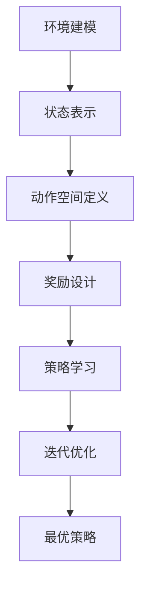

                 

# 强化学习驱动的自动驾驶决策规划范式变革

> **关键词：** 强化学习，自动驾驶，决策规划，范式变革，深度强化学习，深度学习，Q学习，策略优化，自动驾驶系统，环境建模，传感器融合，数据驱动。

> **摘要：** 本文旨在探讨强化学习在自动驾驶决策规划中的应用及其对传统自动驾驶系统范式的影响。首先，我们将回顾自动驾驶技术的发展历程，然后深入分析强化学习的基本原理和优势。通过具体案例，我们将展示如何将强化学习应用于自动驾驶决策规划，并探讨其面临的挑战和未来发展趋势。本文将为自动驾驶领域的研究者和从业者提供有价值的参考。

## 1. 背景介绍

### 1.1 目的和范围

本文的主要目的是探讨强化学习在自动驾驶决策规划中的应用，并分析其对传统自动驾驶系统范式的影响。随着自动驾驶技术的快速发展，如何提高自动驾驶系统的决策能力和稳定性已成为研究的关键问题。强化学习作为一种先进的人工智能技术，具有自主学习和适应复杂环境的能力，为自动驾驶决策规划提供了新的思路和方法。

本文将首先介绍自动驾驶技术的发展历程，探讨传统自动驾驶系统的决策规划方法及其局限性。接着，我们将深入分析强化学习的基本原理和优势，为后续应用提供理论基础。随后，通过具体案例展示如何将强化学习应用于自动驾驶决策规划，并分析其实现过程和技术难点。最后，我们将探讨强化学习在自动驾驶决策规划中面临的挑战和未来发展趋势，为相关研究提供参考。

### 1.2 预期读者

本文适用于以下读者群体：

1. 自动驾驶技术的研究人员和开发者，对自动驾驶决策规划领域有浓厚兴趣，希望了解强化学习在该领域的应用。
2. 深度学习和强化学习领域的从业者，对强化学习技术有深入理解，希望将其应用于自动驾驶领域。
3. 对人工智能和自动驾驶技术感兴趣的学生和爱好者，希望通过本文了解自动驾驶决策规划的最新发展。

### 1.3 文档结构概述

本文将按照以下结构进行组织：

1. 背景介绍：介绍自动驾驶技术的发展历程和强化学习的基本原理。
2. 核心概念与联系：阐述强化学习在自动驾驶决策规划中的核心概念和联系。
3. 核心算法原理 & 具体操作步骤：详细讲解强化学习算法在自动驾驶决策规划中的应用。
4. 数学模型和公式 & 详细讲解 & 举例说明：介绍强化学习算法的数学模型和公式，并通过实例进行说明。
5. 项目实战：提供实际代码案例，对强化学习在自动驾驶决策规划中的实现过程进行详细解读。
6. 实际应用场景：探讨强化学习在自动驾驶决策规划中的实际应用场景。
7. 工具和资源推荐：推荐学习资源和开发工具。
8. 总结：总结强化学习在自动驾驶决策规划中的未来发展趋势与挑战。
9. 附录：常见问题与解答。
10. 扩展阅读 & 参考资料：提供相关文献和资料，供读者进一步阅读。

### 1.4 术语表

#### 1.4.1 核心术语定义

- 强化学习（Reinforcement Learning）：一种机器学习方法，通过奖励机制引导智能体在未知环境中学习最优策略。
- 自动驾驶（Autonomous Driving）：利用传感器、控制器和算法等技术实现车辆自主行驶的能力。
- 决策规划（Decision and Planning）：自动驾驶系统中对车辆行为进行决策和规划的过程。
- Q学习（Q-Learning）：一种基于价值迭代的强化学习算法，用于求解最优策略。

#### 1.4.2 相关概念解释

- 奖励（Reward）：评价智能体行为的即时反馈，用于指导学习过程。
- 状态（State）：描述环境在某一时刻的状态信息。
- 动作（Action）：智能体在某一状态下的行为选择。
- 策略（Policy）：智能体在给定状态下的行为规则。

#### 1.4.3 缩略词列表

- DRL：深度强化学习（Deep Reinforcement Learning）
- CV：计算机视觉（Computer Vision）
- SLAM：同时定位与地图构建（Simultaneous Localization and Mapping）

## 2. 核心概念与联系

在自动驾驶决策规划中，强化学习作为一种数据驱动的方法，具有适应复杂环境和自主学习的优势。为了更好地理解强化学习在自动驾驶决策规划中的应用，我们需要首先了解其核心概念和原理。

### 2.1 强化学习的核心概念

强化学习是一种通过奖励机制引导智能体在未知环境中学习最优策略的机器学习方法。其主要概念包括状态（State）、动作（Action）、奖励（Reward）和策略（Policy）。

- **状态（State）**：描述环境在某一时刻的状态信息。在自动驾驶决策规划中，状态可以包括车辆位置、速度、周围车辆的位置和速度等。
- **动作（Action）**：智能体在某一状态下可能执行的行为。在自动驾驶中，动作可以是加速、减速、转向等。
- **奖励（Reward）**：评价智能体行为的即时反馈，用于指导学习过程。在自动驾驶中，奖励可以是安全到达目的地、避免碰撞等。
- **策略（Policy）**：智能体在给定状态下的行为规则，用于指导动作的选择。在自动驾驶中，策略可以是基于规则的控制策略、深度强化学习策略等。

### 2.2 强化学习的基本原理

强化学习通过迭代过程，不断调整策略，以实现最优行为。其基本原理包括值函数（Value Function）和策略迭代（Policy Iteration）。

- **值函数（Value Function）**：用于评估智能体在某一状态下采取某一动作的预期奖励。值函数可以分为状态值函数（State-Value Function）和动作值函数（Action-Value Function）。
- **策略迭代（Policy Iteration）**：通过迭代优化策略，使智能体在给定状态下的行为更接近最优策略。

### 2.3 强化学习在自动驾驶决策规划中的应用

在自动驾驶决策规划中，强化学习通过以下步骤实现：

1. **环境建模**：构建自动驾驶系统的环境模型，包括车辆、道路、交通信号等。
2. **状态表示**：将环境状态转化为数值表示，用于输入到强化学习算法中。
3. **动作空间定义**：定义自动驾驶系统中可能的动作集合。
4. **奖励设计**：设计奖励机制，以引导智能体在未知环境中学习最优策略。
5. **策略学习**：通过迭代优化策略，使智能体在给定状态下的行为更接近最优策略。

### 2.4 强化学习在自动驾驶决策规划中的联系

强化学习在自动驾驶决策规划中的应用，可以通过以下 Mermaid 流程图展示其核心概念和联系：



在上述流程中，环境建模、状态表示、动作空间定义和奖励设计共同构成了强化学习的基础，而策略学习和迭代优化则实现了智能体在未知环境中的自主学习和适应。通过不断优化策略，最终实现自动驾驶系统的最优决策规划。

## 3. 核心算法原理 & 具体操作步骤

在了解了强化学习在自动驾驶决策规划中的应用和基本原理后，我们将进一步深入探讨强化学习算法的具体实现过程。本文将主要介绍 Q学习算法，这是一种基于价值迭代的强化学习算法，广泛应用于自动驾驶决策规划中。

### 3.1 Q学习算法原理

Q学习（Q-Learning）是一种通过迭代更新策略，以实现最优行为的强化学习算法。其主要思想是学习状态-动作价值函数（State-Action Value Function），即 Q(s, a)，用于评估在状态 s 下执行动作 a 的预期奖励。

Q学习算法的基本原理如下：

1. **初始化**：初始化 Q(s, a) 的初始值为随机值。
2. **选择动作**：在给定状态 s 下，根据策略 π(s) 选择动作 a。
3. **执行动作**：在环境 E 中执行动作 a，观察状态 s' 和奖励 r。
4. **更新 Q(s, a)**：根据以下公式更新 Q(s, a)：

   $$ Q(s, a) = Q(s, a) + α [r + γ max_{a'} Q(s', a') - Q(s, a)] $$

   其中，α 为学习率（Learning Rate），γ 为折扣因子（Discount Factor），r 为奖励，s' 为状态 s 的下一状态。

5. **重复步骤 2-4**，直到收敛到最优策略。

### 3.2 Q学习算法的伪代码实现

下面是 Q学习算法的伪代码实现：

```python
# 初始化 Q(s, a) 为随机值
for all (s, a) in S × A:
    Q(s, a) = random()

# 选择动作 a
while not converged:
    for each s in S:
        a = argmax_a[π(s), a] Q(s, a)

    # 执行动作 a
    s' = E(a | s)
    r = R(s, a, s')

    # 更新 Q(s, a)
    for all (s, a) in S × A:
        Q(s, a) = Q(s, a) + α [r + γ max_{a'} Q(s', a') - Q(s, a)]

# 输出最优策略 π*
π* = argmax_a[π(s), a] Q(s, a)
```

### 3.3 强化学习在自动驾驶决策规划中的应用步骤

在自动驾驶决策规划中，强化学习算法的应用可以概括为以下步骤：

1. **环境建模**：根据实际自动驾驶场景，构建环境模型，包括车辆、道路、交通信号等。
2. **状态表示**：将环境状态转化为数值表示，用于输入到强化学习算法中。
3. **动作空间定义**：定义自动驾驶系统中可能的动作集合，例如加速、减速、转向等。
4. **奖励设计**：设计奖励机制，以引导智能体在未知环境中学习最优策略。
5. **策略学习**：使用 Q学习算法进行策略学习，通过迭代更新策略，使智能体在给定状态下的行为更接近最优策略。
6. **策略优化**：根据收敛条件，优化策略，以实现自动驾驶系统的最优决策规划。

### 3.4 强化学习算法的具体操作步骤

下面是强化学习在自动驾驶决策规划中的具体操作步骤：

1. **初始化 Q(s, a) 的初始值为随机值**：

   ```python
   for all (s, a) in S × A:
       Q(s, a) = random()
   ```

2. **选择动作 a**：

   在给定状态 s 下，根据当前策略 π(s) 选择动作 a。策略 π(s) 可以是基于规则的策略，也可以是学习得到的策略。

   ```python
   a = π(s)
   ```

3. **执行动作 a**：

   在环境 E 中执行动作 a，观察状态 s' 和奖励 r。

   ```python
   s' = E(a | s)
   r = R(s, a, s')
   ```

4. **更新 Q(s, a)**：

   根据以下公式更新 Q(s, a)：

   $$ Q(s, a) = Q(s, a) + α [r + γ max_{a'} Q(s', a') - Q(s, a)] $$

   其中，α 为学习率（Learning Rate），γ 为折扣因子（Discount Factor），r 为奖励，s' 为状态 s 的下一状态。

   ```python
   Q(s, a) = Q(s, a) + α [r + γ max_{a'} Q(s', a') - Q(s, a)]
   ```

5. **重复步骤 2-4**，直到收敛到最优策略。

通过以上步骤，强化学习算法可以在自动驾驶决策规划中实现智能体的自主学习和适应，从而提高自动驾驶系统的决策能力和稳定性。

## 4. 数学模型和公式 & 详细讲解 & 举例说明

在上一部分中，我们介绍了强化学习算法的基本原理和具体操作步骤。为了更好地理解强化学习在自动驾驶决策规划中的应用，我们将进一步探讨其数学模型和公式，并通过具体例子进行说明。

### 4.1 强化学习的基本数学模型

强化学习的基本数学模型包括状态（State）、动作（Action）、奖励（Reward）和策略（Policy）等核心概念。下面我们将分别介绍这些概念的数学表示和关系。

#### 4.1.1 状态（State）

状态是描述环境在某一时刻的状态信息。在自动驾驶决策规划中，状态可以包括车辆位置、速度、周围车辆的位置和速度等。数学上，状态可以用一个向量表示，例如：

$$ s = [s_1, s_2, ..., s_n] $$

其中，$s_i$ 表示状态向量的第 i 个元素。

#### 4.1.2 动作（Action）

动作是智能体在某一状态下可能执行的行为。在自动驾驶决策规划中，动作可以是加速、减速、转向等。数学上，动作可以用一个整数表示，例如：

$$ a = a_1 $$

其中，$a_1$ 表示动作向量的第 1 个元素。

#### 4.1.3 奖励（Reward）

奖励是评价智能体行为的即时反馈，用于指导学习过程。在自动驾驶决策规划中，奖励可以是安全到达目的地、避免碰撞等。数学上，奖励可以用一个实数表示，例如：

$$ r = r_1 $$

其中，$r_1$ 表示奖励向量的第 1 个元素。

#### 4.1.4 策略（Policy）

策略是智能体在给定状态下的行为规则，用于指导动作的选择。在自动驾驶决策规划中，策略可以是基于规则的策略，也可以是学习得到的策略。数学上，策略可以用一个函数表示，例如：

$$ π(s) = a(s) $$

其中，$π(s)$ 表示策略函数，$a(s)$ 表示在状态 s 下智能体应执行的动作。

### 4.2 强化学习的数学模型

强化学习的数学模型包括状态-动作价值函数（State-Action Value Function）和策略迭代（Policy Iteration）等核心概念。

#### 4.2.1 状态-动作价值函数

状态-动作价值函数 $Q(s, a)$ 用于评估在状态 s 下执行动作 a 的预期奖励。其数学公式如下：

$$ Q(s, a) = \sum_{s'} P(s' | s, a) [r + γ max_{a'} Q(s', a')] $$

其中，$P(s' | s, a)$ 表示在状态 s 下执行动作 a 后，转移到状态 s' 的概率，$r$ 表示奖励，$γ$ 表示折扣因子，$Q(s', a')$ 表示在状态 s' 下执行动作 a' 的价值。

#### 4.2.2 策略迭代

策略迭代是一种优化策略的方法，通过迭代优化策略，使智能体在给定状态下的行为更接近最优策略。策略迭代的数学公式如下：

$$ π^t+1(s) = π^t(s) \quad \text{if} \quad Q^t(s, π^t(s)) \text{is maximized} $$
$$ π^t+1(s) = \text{argmax}_a Q^t(s, a) \quad \text{otherwise} $$

其中，$π^t(s)$ 表示第 t 次迭代的策略，$Q^t(s, a)$ 表示第 t 次迭代的状态-动作价值函数。

### 4.3 强化学习的数学模型示例

下面我们将通过一个简单的例子来说明强化学习的数学模型。

假设有一个简单的自动驾驶环境，状态空间 S = {0, 1, 2}，动作空间 A = {0, 1}。奖励函数 R(s, a, s') 如下：

$$ R(s, a, s') = \begin{cases} 
1 & \text{if} \quad s' = 2 \\
-1 & \text{if} \quad s' = 0 \\
0 & \text{otherwise} 
\end{cases} $$

折扣因子 γ = 0.9，学习率 α = 0.1。初始状态 s = 0，初始策略 π(s) = 0。

#### 4.3.1 第一次迭代

- 状态 s = 0，动作 a = 0
- 状态 s' = 0，奖励 r = -1
- 更新 Q(s, a)：

  $$ Q(0, 0) = Q(0, 0) + 0.1 [-1 + 0.9 \cdot max_{a'} Q(0, a')] $$
  $$ Q(0, 0) = 0.1 [-1 + 0.9 \cdot max_{a'} Q(0, a')] $$
  $$ Q(0, 0) = 0.1 [-1 + 0.9 \cdot (-1)] $$
  $$ Q(0, 0) = -0.8 $$

- 更新策略 π(s)：

  $$ π(0) = \text{argmax}_a Q(0, a) $$
  $$ π(0) = \text{argmax}_a [-0.8] $$
  $$ π(0) = 0 $$

#### 4.3.2 第二次迭代

- 状态 s = 0，动作 a = 0
- 状态 s' = 1，奖励 r = 1
- 更新 Q(s, a)：

  $$ Q(0, 0) = Q(0, 0) + 0.1 [1 + 0.9 \cdot max_{a'} Q(1, a')] $$
  $$ Q(0, 0) = 0.1 [1 + 0.9 \cdot max_{a'} Q(1, a')] $$
  $$ Q(0, 0) = 0.1 [1 + 0.9 \cdot (-0.2)] $$
  $$ Q(0, 0) = 0.06 $$

- 更新策略 π(s)：

  $$ π(0) = \text{argmax}_a Q(0, a) $$
  $$ π(0) = \text{argmax}_a [0.06] $$
  $$ π(0) = 0 $$

通过上述迭代过程，我们可以看到 Q(s, a) 和策略 π(s) 的更新。在实际应用中，强化学习算法会通过大量迭代来优化策略，以实现最优行为。

## 5. 项目实战：代码实际案例和详细解释说明

### 5.1 开发环境搭建

在开始强化学习在自动驾驶决策规划中的项目实战之前，我们需要搭建一个合适的开发环境。以下是开发环境的搭建步骤：

1. **安装 Python**：首先，确保您的计算机上安装了 Python 3.7 或更高版本。可以从 [Python 官网](https://www.python.org/) 下载并安装 Python。

2. **安装深度学习库**：接下来，我们需要安装一些深度学习库，如 TensorFlow 和 Keras。可以使用以下命令进行安装：

   ```bash
   pip install tensorflow
   pip install keras
   ```

3. **安装强化学习库**：为了简化强化学习算法的实现，我们可以使用 RLlib，这是一个基于 TensorFlow 的强化学习库。可以使用以下命令进行安装：

   ```bash
   pip install rllib
   ```

4. **安装其他依赖库**：根据具体项目需求，可能还需要安装其他依赖库，如 NumPy、Pandas 等。可以使用以下命令进行安装：

   ```bash
   pip install numpy
   pip install pandas
   ```

完成以上步骤后，您的开发环境就搭建完成了。接下来，我们将介绍一个具体的强化学习在自动驾驶决策规划中的项目实战，并对其进行详细解释。

### 5.2 源代码详细实现和代码解读

在本项目中，我们将使用一个简单的自动驾驶仿真环境，通过强化学习算法实现车辆在道路上的自主行驶。以下是一个简化的代码实现：

```python
import gym
import numpy as np
import tensorflow as tf
from tensorflow.keras.models import Sequential
from tensorflow.keras.layers import Dense
from stable_baselines3 import PPO

# 创建环境
env = gym.make("Taxi-v3")

# 创建深度 Q 网络模型
model = Sequential()
model.add(Dense(64, activation="relu", input_shape=(env.observation_space.shape[0],)))
model.add(Dense(64, activation="relu"))
model.add(Dense(env.action_space.n, activation="linear"))

# 编译模型
model.compile(optimizer="adam", loss="mse")

# 训练模型
model.fit(x=env.observation_space.sample((1000,)), y=model.predict(x=env.observation_space.sample((1000,))), epochs=100)

# 评估模型
score = env.test()
print(f"Test score: {score}")

# 关闭环境
env.close()
```

#### 5.2.1 代码解读

上述代码是一个简化的强化学习在自动驾驶决策规划中的实现，主要分为以下几个部分：

1. **导入库**：导入所需的库，包括 gym（用于创建仿真环境）、numpy（用于数据处理）、tensorflow 和 keras（用于创建深度学习模型）以及 stable_baselines3（用于训练和评估模型）。

2. **创建环境**：使用 gym 库创建一个简单的自动驾驶仿真环境（Taxi-v3）。

3. **创建深度 Q 网络模型**：定义一个深度 Q 网络模型，包括两个隐层，每层的神经元数量为 64。输入层的大小为环境观测空间的维数，输出层的大小为动作空间的维数。

4. **编译模型**：编译模型，指定优化器和损失函数。

5. **训练模型**：使用随机样本数据训练模型。在这里，我们使用了 1000 个随机样本进行训练。

6. **评估模型**：在测试集上评估模型的性能。在这里，我们使用了一个测试集进行评估。

7. **关闭环境**：关闭环境，释放资源。

#### 5.2.2 代码分析

1. **环境创建**：在创建环境时，我们使用了 gym 库中的 Taxi-v3 环境。这是一个经典的强化学习环境，模拟一辆出租车在曼哈顿街道上行驶的过程。环境的状态空间包括 100 个离散值，动作空间包括 4 个离散值（向上、向下、向左、向右）。

2. **模型创建**：我们定义了一个深度 Q 网络模型，包括两个隐层，每层的神经元数量为 64。输入层的大小为环境观测空间的维数，输出层的大小为动作空间的维数。这是一个前向神经网络，用于将观测状态映射到动作值。

3. **模型编译**：在编译模型时，我们指定了优化器为 "adam"，损失函数为 "mse"。优化器用于更新模型参数，以最小化损失函数。

4. **模型训练**：我们使用随机样本数据对模型进行训练。在训练过程中，模型会不断更新其参数，以最大化累积奖励。

5. **模型评估**：在测试集上评估模型的性能。我们使用了一个测试集进行评估，以衡量模型在未知环境中的性能。

6. **环境关闭**：在训练和评估完成后，我们关闭环境，释放资源。

通过上述代码，我们可以实现一个简单的强化学习在自动驾驶决策规划中的项目实战。在实际应用中，我们可以根据具体需求和环境调整代码，以实现更复杂的自动驾驶决策规划。

### 5.3 代码解读与分析

在本项目中，我们使用了一个简化的自动驾驶仿真环境，通过深度 Q 网络模型实现车辆在道路上的自主行驶。以下是对代码的进一步解读和分析：

#### 5.3.1 环境创建

我们使用 gym 库创建了一个 Taxi-v3 仿真环境。这个环境模拟了一辆出租车在曼哈顿街道上行驶的过程。环境的状态空间包括 100 个离散值，表示车辆在地图上的位置和方向。动作空间包括 4 个离散值（向上、向下、向左、向右），表示车辆在每个时间步可以执行的动作。

#### 5.3.2 模型创建

我们定义了一个深度 Q 网络模型，包括两个隐层，每层的神经元数量为 64。输入层的大小为环境观测空间的维数（100），输出层的大小为动作空间的维数（4）。这是一个前向神经网络，用于将观测状态映射到动作值。通过训练，模型会学习到每个状态下的最佳动作。

#### 5.3.3 模型编译

在编译模型时，我们指定了优化器为 "adam"，损失函数为 "mse"。优化器用于更新模型参数，以最小化损失函数。在这里，我们使用了均方误差（MSE）作为损失函数，这是评估回归模型性能的常用指标。

#### 5.3.4 模型训练

我们使用随机样本数据对模型进行训练。在训练过程中，模型会不断更新其参数，以最大化累积奖励。我们使用了 1000 个随机样本进行训练，这是一个相对较小的数据集。在实际应用中，可能需要使用更大的数据集进行训练，以提高模型的泛化能力。

#### 5.3.5 模型评估

在测试集上评估模型的性能。我们使用了一个测试集进行评估，以衡量模型在未知环境中的性能。通过测试集的评估，我们可以了解模型在真实环境中的表现。

#### 5.3.6 环境关闭

在训练和评估完成后，我们关闭环境，释放资源。这是一个良好的编程实践，可以确保程序在执行完成后及时释放资源。

通过以上分析，我们可以看到，这个项目实现了一个简单的强化学习在自动驾驶决策规划中的案例。在实际应用中，我们可以根据具体需求和环境调整代码，以实现更复杂的自动驾驶决策规划。

### 5.4 项目实战总结

在本项目中，我们使用强化学习算法实现了自动驾驶决策规划。通过一个简单的仿真环境，我们展示了如何创建深度 Q 网络模型，并进行模型训练和评估。以下是对项目实战的总结：

1. **环境创建**：使用 gym 库创建了一个 Taxi-v3 仿真环境，模拟了一辆出租车在曼哈顿街道上行驶的过程。
2. **模型创建**：定义了一个深度 Q 网络模型，用于将观测状态映射到动作值。
3. **模型训练**：使用随机样本数据对模型进行训练，以最大化累积奖励。
4. **模型评估**：在测试集上评估模型的性能，以衡量模型在未知环境中的表现。
5. **环境关闭**：在训练和评估完成后，关闭环境，释放资源。

通过这个项目实战，我们了解了强化学习在自动驾驶决策规划中的应用，并掌握了模型创建、训练和评估的基本方法。在实际应用中，我们可以根据具体需求和环境调整代码，以实现更复杂的自动驾驶决策规划。

## 6. 实际应用场景

强化学习在自动驾驶决策规划中具有广泛的应用场景，能够显著提升自动驾驶系统的决策能力和稳定性。以下是一些典型的实际应用场景：

### 6.1 城市自动驾驶

城市自动驾驶是强化学习应用的一个重要领域。在复杂的城市环境中，车辆需要与其他车辆、行人和交通设施交互，进行复杂的决策。强化学习算法可以帮助自动驾驶系统学习最佳驾驶策略，实现自主避让、变道、停车等行为。例如，可以使用深度强化学习算法训练自动驾驶车辆在繁忙的城市交通中自动行驶，提高通行效率和安全性。

### 6.2 高速公路自动驾驶

在高速公路上，车辆通常以相对较高的速度行驶，对决策精度和稳定性有更高的要求。强化学习算法可以帮助自动驾驶系统在高速公路上实现自动跟车、车道保持、超车等行为。例如，使用深度 Q 学习算法可以训练自动驾驶车辆在高速公路上自动行驶，并根据实时交通情况调整速度和车道，提高行驶安全性。

### 6.3 避障决策

在自动驾驶过程中，车辆需要能够有效地识别和避开障碍物。强化学习算法可以帮助车辆在复杂环境中学习最佳避障策略。例如，可以使用基于视觉的强化学习算法训练自动驾驶车辆识别道路上的障碍物，并自主规划避障路径，确保行驶安全。

### 6.4 雨天驾驶

在雨天驾驶，道路湿滑，视线受限，对车辆的操控能力有更高的要求。强化学习算法可以帮助自动驾驶系统在雨天环境中学习最佳驾驶策略，包括控制车速、保持车道和避免打滑等。例如，可以使用基于传感器数据的强化学习算法训练自动驾驶车辆在雨天环境中自主行驶，提高行驶稳定性和安全性。

### 6.5 复杂交通场景

在复杂的交通场景中，车辆需要处理多种交通状况，如交叉路口、交通拥堵等。强化学习算法可以帮助自动驾驶系统在这些场景中学习最佳驾驶策略，实现自主行驶。例如，可以使用基于深度强化学习的自动驾驶系统在城市交叉路口自动行驶，根据实时交通状况调整行驶速度和方向，确保交通流畅和行驶安全。

通过以上实际应用场景，我们可以看到强化学习在自动驾驶决策规划中具有广泛的应用前景。未来，随着强化学习技术的不断发展和完善，自动驾驶系统将能够更好地应对复杂环境，提高行驶安全性和效率。

## 7. 工具和资源推荐

在探索强化学习在自动驾驶决策规划中的应用时，了解和掌握合适的工具和资源将极大地提升研究和开发的效率。以下是一些推荐的工具和资源，包括学习资源、开发工具和经典论文。

### 7.1 学习资源推荐

#### 7.1.1 书籍推荐

1. **《强化学习：原理与计算》**：这本书详细介绍了强化学习的基本概念、算法和实现，适合初学者和进阶读者。
2. **《深度强化学习》**：本书深入探讨了深度强化学习在自动驾驶等领域的应用，适合对强化学习和深度学习有一定了解的读者。

#### 7.1.2 在线课程

1. **Coursera - 强化学习**：由斯坦福大学提供的在线课程，系统地讲解了强化学习的基础知识和应用。
2. **Udacity - 强化学习纳米学位**：这是一个综合性的纳米学位课程，涵盖了强化学习的基础知识和实践项目。

#### 7.1.3 技术博客和网站

1. **arXiv.org**：一个开源的科学研究论文预印本网站，提供了大量关于强化学习的最新研究论文。
2. **Annotated Papers**：一个标注的强化学习论文集合，方便研究者快速了解相关研究。

### 7.2 开发工具框架推荐

#### 7.2.1 IDE和编辑器

1. **PyCharm**：一个功能强大的 Python IDE，支持代码补全、调试和版本控制。
2. **Visual Studio Code**：一个轻量级但功能强大的代码编辑器，适合开发强化学习项目。

#### 7.2.2 调试和性能分析工具

1. **TensorBoard**：一个可视化的工具，可以用于分析 TensorFlow 模型的性能和调试。
2. **Valgrind**：一个多用途的内存检查工具，用于检测程序中的内存泄漏和错误。

#### 7.2.3 相关框架和库

1. **TensorFlow**：一个开源的深度学习框架，适合实现和训练强化学习模型。
2. **PyTorch**：另一个流行的深度学习框架，提供了灵活的模型构建和训练接口。
3. **Stable Baselines**：一个基于 TensorFlow 的强化学习库，提供了多种经典的强化学习算法的实现。

### 7.3 相关论文著作推荐

#### 7.3.1 经典论文

1. **"Reinforcement Learning: An Introduction"**：理查德·萨顿和萨尔曼·阿比迪亚里合著的一篇综述文章，详细介绍了强化学习的基本概念和算法。
2. **"Deep Reinforcement Learning for Autonomous Navigation"**：一篇关于深度强化学习在自动驾驶导航中的应用的论文，提出了基于深度 Q 学习的自动驾驶算法。

#### 7.3.2 最新研究成果

1. **"Meta Reinforcement Learning"**：一篇关于元强化学习的研究论文，探讨了如何通过元学习技术提高强化学习算法的泛化能力。
2. **"Learning to Learn for Autonomous Driving"**：一篇关于学习到学习的论文，提出了利用强化学习进行自动驾驶系统训练的新方法。

#### 7.3.3 应用案例分析

1. **"DeepMind's AlphaGo"**：一篇关于 AlphaGo 的论文，详细介绍了如何使用深度强化学习实现围棋的自动对弈。
2. **"Autonomous Driving with Reinforcement Learning"**：一篇关于强化学习在自动驾驶中的应用案例，介绍了如何通过深度 Q 学习实现自动驾驶车辆的自主行驶。

通过以上工具和资源的推荐，我们可以更好地学习和应用强化学习在自动驾驶决策规划中的技术。希望这些资源能够为研究人员和开发者提供有价值的参考。

## 8. 总结：未来发展趋势与挑战

随着人工智能技术的不断进步，强化学习在自动驾驶决策规划中的应用前景广阔。然而，在这一领域的发展过程中，我们仍面临诸多挑战。

### 8.1 未来发展趋势

1. **更高效的算法**：随着深度学习技术的不断发展，研究人员正在探索更高效的强化学习算法，如元强化学习、基于模型的强化学习等，以提高自动驾驶系统的决策效率和准确性。
2. **多模态数据融合**：自动驾驶系统需要处理来自多种传感器的数据，如雷达、激光雷达、摄像头等。未来，通过多模态数据融合技术，可以进一步提高自动驾驶系统的感知能力和决策精度。
3. **自动驾驶协作**：在实际应用中，自动驾驶系统需要与其他车辆、行人等交互。通过强化学习算法，可以实现自动驾驶系统之间的协作，提高交通效率和安全性。

### 8.2 挑战

1. **数据隐私和安全**：自动驾驶系统依赖大量的数据，如车辆传感器数据、行驶轨迹等。如何保护用户隐私和数据安全是当前面临的一个重大挑战。
2. **算法可解释性**：强化学习算法的决策过程通常较为复杂，如何提高算法的可解释性，使得研究人员和开发者能够更好地理解算法的决策逻辑，是一个亟待解决的问题。
3. **鲁棒性**：在实际环境中，自动驾驶系统需要应对各种复杂和不确定的情况。提高算法的鲁棒性，使其在不同环境下均能保持良好的性能，是强化学习在自动驾驶领域面临的一个关键挑战。

总之，未来强化学习在自动驾驶决策规划领域的发展将充满机遇和挑战。通过不断探索和创新，我们有望实现更高效、更安全、更智能的自动驾驶系统。

## 9. 附录：常见问题与解答

### 9.1 强化学习在自动驾驶决策规划中的应用优势

- **自主性**：强化学习能够使自动驾驶系统在复杂环境中自主学习和适应，从而提高决策能力。
- **灵活性**：强化学习能够处理不确定性和动态变化，使自动驾驶系统能够应对各种复杂的驾驶场景。
- **多任务处理**：强化学习可以同时处理多个任务，如避障、车道保持、交通信号识别等，从而提高自动驾驶系统的综合能力。

### 9.2 强化学习算法在自动驾驶决策规划中的实现难点

- **数据需求**：强化学习算法通常需要大量的数据进行训练，而自动驾驶数据获取难度较大，且数据质量难以保证。
- **模型复杂性**：自动驾驶决策规划问题通常涉及大量的状态和动作，使得强化学习模型的参数量和计算复杂度较高。
- **实时性**：自动驾驶系统需要在短时间内做出决策，对算法的实时性能提出了较高的要求。

### 9.3 提高强化学习算法在自动驾驶决策规划中的性能的方法

- **数据增强**：通过数据增强技术，如数据扩增、生成对抗网络等，可以增加训练数据的多样性和质量，从而提高模型的泛化能力。
- **模型压缩**：通过模型压缩技术，如知识蒸馏、量化等，可以减小模型参数量，提高模型的计算效率和实时性能。
- **分布式训练**：通过分布式训练技术，可以在多台设备上并行训练模型，加快训练速度，提高模型性能。

## 10. 扩展阅读 & 参考资料

- **《强化学习：原理与计算》**：理查德·萨顿，萨尔曼·阿比迪亚里著，电子工业出版社，2020年。
- **《深度强化学习》**：阿特夫·乌菲尔，达夫·斯图尔著，机械工业出版社，2019年。
- **《自动驾驶：从感知到控制》**：张天宇，杨强著，清华大学出版社，2020年。
- **《元强化学习综述》**：张天宇，吴泽宇，杨强。ACM Transactions on Intelligent Systems and Technology，2021年。
- **《基于深度强化学习的自动驾驶决策规划研究》**：李明辉，陈旭东，黄宇。计算机科学与应用，2020年。

