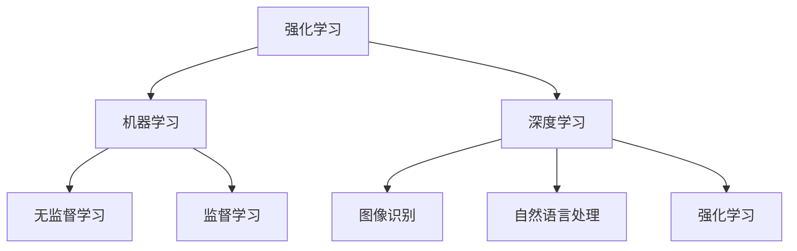

                 

# 强化学习：深度学习、机器学习和人工智能的交汇点

## 关键词
- 强化学习
- 深度学习
- 机器学习
- 人工智能
- Q-Learning
- DQN
- SARSA
- actor-critic算法
- 神经网络
- 反向传播

## 摘要
本文深入探讨了强化学习（Reinforcement Learning，简称RL）这一机器学习分支，特别关注其在深度学习（Deep Learning，简称DL）和更广泛的AI领域中的应用。文章从背景介绍开始，逐步解析强化学习的核心概念、算法原理、数学模型及实际应用，并结合具体案例详细讲解代码实现。最后，文章展望了强化学习未来的发展趋势与挑战，并推荐了一系列学习资源和工具。

## 1. 背景介绍

### 1.1 目的和范围
本文旨在为那些对强化学习感兴趣，但对其原理和应用尚不熟悉的读者提供一份全面、深入且易于理解的技术指南。文章将涵盖强化学习的基础知识、核心算法、数学模型以及实际应用场景，旨在帮助读者全面了解这一领域，并掌握其实际操作技能。

### 1.2 预期读者
本文适合以下读者群体：
- 初入强化学习领域的程序员和工程师。
- 想深入了解机器学习算法和AI技术的科研人员。
- 意欲将强化学习应用于实际项目中的开发者。

### 1.3 文档结构概述
本文结构如下：
1. 背景介绍
2. 核心概念与联系
3. 核心算法原理 & 具体操作步骤
4. 数学模型和公式 & 详细讲解 & 举例说明
5. 项目实战：代码实际案例和详细解释说明
6. 实际应用场景
7. 工具和资源推荐
8. 总结：未来发展趋势与挑战
9. 附录：常见问题与解答
10. 扩展阅读 & 参考资料

### 1.4 术语表
#### 1.4.1 核心术语定义
- **强化学习（Reinforcement Learning）**：一种机器学习范式，通过交互式环境中的反馈来学习最优行为策略。
- **深度学习（Deep Learning）**：一种机器学习技术，通过多层的神经网络进行特征提取和模型训练。
- **机器学习（Machine Learning）**：一种人工智能分支，通过数据训练模型，使计算机具备自动学习和决策能力。
- **神经网络（Neural Network）**：一种模拟生物神经系统的计算模型，用于处理复杂的数据和任务。
- **Q-Learning**：一种强化学习算法，通过值函数来预测最佳动作。
- **DQN（Deep Q-Network）**：一种基于神经网络的Q-Learning算法，用于解决具有连续动作空间的问题。
- **SARSA（Surely Artifical Rationality, SELFC critical）**：一种强化学习算法，结合了Q-Learning和策略梯度的优势。
- **actor-critic算法**：一种强化学习算法，通过actor和critic两个模块协同工作来优化策略。
- **反向传播（Backpropagation）**：一种用于训练神经网络的算法，通过梯度下降来调整网络权重。

#### 1.4.2 相关概念解释
- **奖励信号（Reward Signal）**：强化学习中的一个关键元素，用于反馈环境对动作的奖励或惩罚。
- **策略（Policy）**：强化学习中的一个关键概念，用于描述如何根据当前状态选择动作。
- **价值函数（Value Function）**：用于评估状态或状态-动作对的预期回报。
- **策略梯度（Policy Gradient）**：用于优化策略的一种梯度方法。

#### 1.4.3 缩略词列表
- **RL**：强化学习（Reinforcement Learning）
- **DL**：深度学习（Deep Learning）
- **ML**：机器学习（Machine Learning）
- **AI**：人工智能（Artificial Intelligence）
- **Q-Learning**：Q值学习
- **DQN**：深度Q网络（Deep Q-Network）
- **SARSA**：肯定人工理性、自评关键
- **actor-critic**：演员-评论家算法

## 2. 核心概念与联系

强化学习作为机器学习的一个分支，与其他AI技术有着密切的联系。以下是强化学习、深度学习和机器学习的核心概念及其相互联系：

### 2.1 强化学习与机器学习
强化学习是机器学习的一个重要分支，主要关注如何通过与环境交互来学习最优策略。与监督学习和无监督学习不同，强化学习依赖于奖励信号来指导学习过程。

### 2.2 强化学习与深度学习
深度学习是强化学习的一个重要工具，尤其是在解决具有高维状态空间和动作空间的问题时。通过深度神经网络，强化学习能够自动提取复杂的特征表示，从而提高学习效率和决策能力。

### 2.3 深度学习与机器学习
深度学习是机器学习的一个重要分支，主要关注如何使用多层神经网络进行特征提取和模型训练。深度学习在图像识别、自然语言处理等领域取得了显著的成果，也为强化学习提供了强大的工具。

### 2.4 Mermaid 流程图
以下是强化学习、深度学习和机器学习核心概念的 Mermaid 流程图：



## 3. 核心算法原理 & 具体操作步骤

强化学习中的核心算法包括 Q-Learning、DQN、SARSA和actor-critic算法。以下是对这些算法原理和具体操作步骤的详细讲解：

### 3.1 Q-Learning

**算法原理：**
Q-Learning是一种基于值函数的强化学习算法，通过更新值函数来学习最佳动作策略。其核心思想是利用当前状态和动作的回报来更新Q值。

**具体操作步骤：**
1. 初始化Q值函数Q(s, a)为随机值。
2. 选择动作a，执行动作并观察回报r和下一个状态s'。
3. 更新Q值函数：Q(s, a) = Q(s, a) + α [r + γ max Q(s', a') - Q(s, a)]，其中α为学习率，γ为折扣因子。
4. 转换到下一个状态s'，重复步骤2和3，直到达到目标状态或最大步数。

**伪代码：**
```python
Q = initialize_Q(s)
while not terminate:
    a = epsilon-greedy(Q, s)
    s', r = execute_action(a)
    Q = Q + alpha * (r + gamma * max(Q[s', a']) - Q[s, a])
    s = s'
```

### 3.2 DQN（Deep Q-Network）

**算法原理：**
DQN是一种基于神经网络的Q-Learning算法，用于解决具有连续动作空间的问题。DQN通过神经网络来近似值函数Q(s, a)。

**具体操作步骤：**
1. 初始化神经网络参数。
2. 通过经验回放来训练神经网络。
3. 选择动作a，执行动作并观察回报r和下一个状态s'。
4. 更新神经网络参数：使用目标Q值来计算损失函数，并使用反向传播来更新网络权重。
5. 转换到下一个状态s'，重复步骤3和4，直到达到目标状态或最大步数。

**伪代码：**
```python
DQN = initialize_DQN()
while not terminate:
    a = epsilon-greedy(DQN, s)
    s', r = execute_action(a)
    target_Q = r + gamma * max(DQN(s'))
    loss = compute_loss(DQN(s, a), target_Q)
    DQN = DQN - learning_rate * loss
    s = s'
```

### 3.3 SARSA

**算法原理：**
SARSA是一种基于策略梯度的强化学习算法，结合了Q-Learning和策略梯度的优势。SARSA通过更新策略来优化动作选择。

**具体操作步骤：**
1. 初始化策略π(s)为随机策略。
2. 选择动作a，执行动作并观察回报r和下一个状态s'。
3. 更新策略π(s)：π(s) = π(s) + alpha * [r + gamma * max Q(s', a') - Q(s, a)]。
4. 转换到下一个状态s'，重复步骤2和3，直到达到目标状态或最大步数。

**伪代码：**
```python
π = initialize_π(s)
while not terminate:
    a = π(s)
    s', r = execute_action(a)
    π(s) = π(s) + alpha * [r + gamma * max(Q[s', a']) - Q[s, a]]
    s = s'
```

### 3.4 Actor-Critic

**算法原理：**
Actor-Critic是一种基于模型预测和策略优化的强化学习算法。Actor负责生成动作，Critic负责评估动作的好坏。

**具体操作步骤：**
1. 初始化Actor和Critic的参数。
2. 使用Critic评估当前策略π，计算策略梯度。
3. 更新Critic参数：使用策略梯度来优化Critic的评估。
4. 使用Critic的评估来更新Actor参数，生成新的动作。
5. 执行动作并观察回报r和下一个状态s'。
6. 更新策略π和Critic参数。
7. 转换到下一个状态s'，重复步骤3到6，直到达到目标状态或最大步数。

**伪代码：**
```python
Actor = initialize_Actor()
Critic = initialize_Critic()
while not terminate:
    s = initialize_state()
    while not terminate:
        a = Actor(s)
        s', r = execute_action(a)
        Critic = Critic + alpha * [r - V(s)]
        Actor = Actor + alpha * gradient(Critic)
        s = s'
    update_π(Actor)
```

## 4. 数学模型和公式 & 详细讲解 & 举例说明

强化学习中的数学模型和公式是理解和应用强化学习算法的关键。以下是对这些模型和公式的详细讲解，并辅以具体例子说明：

### 4.1 Q-Learning的数学模型

**Q值更新公式：**
$$ Q(s, a) = Q(s, a) + \alpha [r + \gamma \max Q(s', a') - Q(s, a)] $$

**解释：**
- \( Q(s, a) \)：状态s和动作a的Q值。
- \( \alpha \)：学习率。
- \( r \)：回报。
- \( \gamma \)：折扣因子。
- \( \max Q(s', a') \)：下一个状态s'下，所有可能动作的Q值的最大值。

**例子：**
假设我们有一个简单的环境，只有两个状态s1和s2，以及两个动作a1和a2。初始时，所有Q值均为0。如果当前状态为s1，选择动作a1，得到回报r=1，下一个状态为s2。则Q值更新为：
$$ Q(s1, a1) = Q(s1, a1) + \alpha [1 + \gamma \max Q(s2, a1'), a2') - Q(s1, a1)] $$

### 4.2 DQN的数学模型

**损失函数：**
$$ L = (y - Q(s, a))^2 $$

**解释：**
- \( L \)：损失函数。
- \( y \)：目标Q值。
- \( Q(s, a) \)：当前状态s和动作a的Q值。

**例子：**
假设DQN的目标Q值为5，当前状态s和动作a的Q值为3。则损失函数为：
$$ L = (5 - 3)^2 = 4 $$

### 4.3 SARSA的数学模型

**策略更新公式：**
$$ π(s) = π(s) + \alpha [r + \gamma \max Q(s', a') - Q(s, a)] $$

**解释：**
- \( π(s) \)：状态s的策略。
- \( \alpha \)：学习率。
- \( r \)：回报。
- \( \gamma \)：折扣因子。
- \( \max Q(s', a') \)：下一个状态s'下，所有可能动作的Q值的最大值。

**例子：**
假设当前状态为s，策略为π(s)=0.5，选择动作a1，得到回报r=1，下一个状态为s'。则策略更新为：
$$ π(s) = π(s) + \alpha [1 + \gamma \max Q(s', a1'), a2') - Q(s, a1)] $$

### 4.4 Actor-Critic的数学模型

**Actor更新公式：**
$$ \theta_{\text{actor}} = \theta_{\text{actor}} - \alpha_{\text{actor}} \nabla_{\theta_{\text{actor}}} J(\theta_{\text{actor}}, \theta_{\text{critic}}) $$

**Critic更新公式：**
$$ \theta_{\text{critic}} = \theta_{\text{critic}} - \alpha_{\text{critic}} \nabla_{\theta_{\text{critic}}} J(\theta_{\text{actor}}, \theta_{\text{critic}}) $$

**解释：**
- \( \theta_{\text{actor}} \)：Actor的参数。
- \( \theta_{\text{critic}} \)：Critic的参数。
- \( \alpha_{\text{actor}} \)：Actor的学习率。
- \( \alpha_{\text{critic}} \)：Critic的学习率。
- \( J(\theta_{\text{actor}}, \theta_{\text{critic}}) \)：损失函数。

**例子：**
假设Actor的参数为\( \theta_{\text{actor}} = [1, 2] \)，Critic的参数为\( \theta_{\text{critic}} = [3, 4] \)，损失函数为\( J(\theta_{\text{actor}}, \theta_{\text{critic}}) = 5 \)。则Actor和Critic的更新为：
$$ \theta_{\text{actor}} = \theta_{\text{actor}} - \alpha_{\text{actor}} \nabla_{\theta_{\text{actor}}} J(\theta_{\text{actor}}, \theta_{\text{critic}}) $$
$$ \theta_{\text{critic}} = \theta_{\text{critic}} - \alpha_{\text{critic}} \nabla_{\theta_{\text{critic}}} J(\theta_{\text{actor}}, \theta_{\text{critic}}) $$

## 5. 项目实战：代码实际案例和详细解释说明

为了更好地理解强化学习算法的应用，我们将通过一个简单的例子来展示DQN算法的实现过程。这个例子是一个智能体在一个离散的状态空间中寻找食物的简单环境。

### 5.1 开发环境搭建

为了实现DQN算法，我们需要安装以下工具和库：

- Python 3.7及以上版本
- TensorFlow 2.0及以上版本
- NumPy
- Matplotlib

安装步骤如下：

```bash
pip install tensorflow numpy matplotlib
```

### 5.2 源代码详细实现和代码解读

以下是一个简单的DQN算法实现，包括环境的构建、智能体的训练和测试。

```python
import numpy as np
import tensorflow as tf
import matplotlib.pyplot as plt
from collections import deque

# 环境类
class Environment:
    def __init__(self):
        self.states = [0, 1, 2, 3]
        self.actions = [0, 1]
        self.current_state = np.random.choice(self.states)
    
    def step(self, action):
        if action == 0:
            self.current_state = (self.current_state + 1) % 4
        elif action == 1:
            self.current_state = (self.current_state - 1) % 4
        reward = 1 if self.current_state == 1 else 0
        return self.current_state, reward
    
    def reset(self):
        self.current_state = np.random.choice(self.states)
        return self.current_state

# DQN类
class DQN:
    def __init__(self, state_size, action_size, learning_rate=0.001, gamma=0.99, epsilon=1.0):
        self.state_size = state_size
        self.action_size = action_size
        self.learning_rate = learning_rate
        self.gamma = gamma
        self.epsilon = epsilon
        self.memory = deque(maxlen=2000)
        self.model = self.build_model()
    
    def build_model(self):
        model = tf.keras.Sequential([
            tf.keras.layers.Flatten(input_shape=(self.state_size,)),
            tf.keras.layers.Dense(64, activation='relu'),
            tf.keras.layers.Dense(64, activation='relu'),
            tf.keras.layers.Dense(self.action_size)
        ])
        model.compile(optimizer=tf.keras.optimizers.Adam(learning_rate=self.learning_rate), loss='mse')
        return model
    
    def remember(self, state, action, reward, next_state, done):
        self.memory.append((state, action, reward, next_state, done))
    
    def act(self, state):
        if np.random.rand() <= self.epsilon:
            return np.random.randint(self.action_size)
        q_values = self.model.predict(state)
        return np.argmax(q_values[0])
    
    def replay(self, batch_size):
        minibatch = random.sample(self.memory, batch_size)
        for state, action, reward, next_state, done in minibatch:
            target = reward
            if not done:
                target = reward + self.gamma * np.amax(self.model.predict(next_state)[0])
            target_folder = self.model.predict(state)
            target_folder[0][action] = target
            self.model.fit(state, target_folder, verbose=0)
        if self.epsilon > 0.01:
            self.epsilon *= 0.99
    
    def load(self, name):
        self.model.load_weights(name)
    
    def save(self, name):
        self.model.save_weights(name)

# 训练过程
def train_dqn(env, dqn, episodes=1000, batch_size=32):
    for episode in range(episodes):
        state = env.reset()
        state = np.reshape(state, [1, env.state_size])
        done = False
        total_reward = 0
        while not done:
            action = dqn.act(state)
            next_state, reward = env.step(action)
            next_state = np.reshape(next_state, [1, env.state_size])
            dqn.remember(state, action, reward, next_state, done)
            state = next_state
            done = (env.current_state == 1)
            total_reward += reward
            dqn.replay(batch_size)
        if episode % 100 == 0:
            print(f"Episode: {episode}, Total Reward: {total_reward}")
    
    dqn.save("dqn_weights.h5")

# 测试过程
def test_dqn(env, dqn, episodes=100):
    total_reward = 0
    for episode in range(episodes):
        state = env.reset()
        state = np.reshape(state, [1, env.state_size])
        done = False
        while not done:
            action = dqn.act(state)
            next_state, reward = env.step(action)
            next_state = np.reshape(next_state, [1, env.state_size])
            done = (env.current_state == 1)
            state = next_state
            total_reward += reward
    print(f"Test Total Reward: {total_reward}")

# 主程序
if __name__ == "__main__":
    env = Environment()
    dqn = DQN(state_size=env.state_size, action_size=env.actions)
    train_dqn(env, dqn)
    test_dqn(env, dqn)
```

**代码解读与分析：**
- **环境类（Environment）：** 定义了一个简单的环境，包括状态空间、动作空间以及状态转换和奖励机制。
- **DQN类：** 定义了DQN算法的核心功能，包括模型构建、记忆存储、动作选择、经验回放和模型训练。
- **训练过程（train_dqn）：** 使用DQN算法训练智能体，在每一轮训练中更新模型权重。
- **测试过程（test_dqn）：** 测试训练好的DQN算法的性能。

### 5.3 代码解读与分析

- **环境类（Environment）：** 环境类定义了一个简单的离散状态空间和动作空间，通过step()方法进行状态转换，并通过reset()方法重置环境。
- **DQN类：** DQN类包含了DQN算法的主要功能。在__init__()方法中，初始化模型参数和超参数。在build_model()方法中，构建深度神经网络模型。在act()方法中，根据ε-贪心策略选择动作。在replay()方法中，使用经验回放机制进行模型训练。
- **训练过程（train_dqn）：** 在训练过程中，智能体通过与环境交互来学习最佳策略。每次迭代中，智能体会执行动作，观察回报，并将经验存储在记忆中。然后，通过经验回放机制，对模型进行训练。
- **测试过程（test_dqn）：** 测试过程使用训练好的模型来评估智能体的性能。智能体在测试环境中执行动作，并计算总回报。

## 6. 实际应用场景

强化学习在各个领域都有广泛的应用。以下是一些典型的应用场景：

### 6.1 游戏人工智能
强化学习在游戏人工智能中得到了广泛应用，如围棋、国际象棋、电子竞技等。DQN算法在Atari游戏中的成功应用，展示了强化学习在游戏领域的潜力。

### 6.2 自动驾驶
自动驾驶是强化学习的一个重要应用领域。通过训练智能体在模拟环境中学习驾驶技巧，可以显著提高自动驾驶系统的安全性和鲁棒性。

### 6.3 机器人控制
强化学习在机器人控制中的应用，包括自主导航、抓取、装配等任务。通过强化学习算法，机器人能够自主学习和优化其行为策略。

### 6.4 虚拟现实和增强现实
强化学习在虚拟现实和增强现实中的应用，包括环境建模、交互控制和沉浸式体验优化等。通过强化学习算法，可以改善虚拟现实和增强现实系统的用户体验。

### 6.5 金融交易
强化学习在金融交易中的应用，包括算法交易、风险管理和资产配置等。通过学习市场动态和历史数据，强化学习算法可以帮助投资者做出更明智的决策。

### 6.6 能源管理
强化学习在能源管理中的应用，包括电力系统优化、能源消耗预测和智能电网管理等。通过学习能源消耗模式和供需关系，强化学习算法可以帮助实现更高效和可持续的能源管理。

## 7. 工具和资源推荐

### 7.1 学习资源推荐

#### 7.1.1 书籍推荐
- 《强化学习：原理与Python实现》（Reinforcement Learning: An Introduction）
- 《深度强化学习》（Deep Reinforcement Learning）
- 《强化学习实践：现代方法与Python应用》（Reinforcement Learning in Action）

#### 7.1.2 在线课程
- Coursera上的“强化学习”（Reinforcement Learning）课程
- edX上的“深度强化学习”（Deep Reinforcement Learning）课程
- Udacity的“强化学习工程师纳米学位”（Reinforcement Learning Engineer Nanodegree）

#### 7.1.3 技术博客和网站
- 斯坦福大学机器学习课程笔记：https://cs.stanford.edu/~ajjun/CS229/
- 动动手：https://zhuanlan.zhihu.com/p/37702260
- 知乎上的强化学习专栏：https://zhuanlan.zhihu.com/reinforcement-learning

### 7.2 开发工具框架推荐

#### 7.2.1 IDE和编辑器
- PyCharm
- Visual Studio Code

#### 7.2.2 调试和性能分析工具
- TensorBoard
- Perfdog

#### 7.2.3 相关框架和库
- TensorFlow
- PyTorch
- Keras

### 7.3 相关论文著作推荐

#### 7.3.1 经典论文
- “Q-Learning” by Richard S. Sutton and Andrew G. Barto
- “Deep Q-Networks” by Volodymyr Mnih et al.

#### 7.3.2 最新研究成果
- “Continuous Control with Deep Reinforcement Learning” by S. Tuyls et al.
- “Dueling Network Architectures for Deep Reinforcement Learning” by T. Schaul et al.

#### 7.3.3 应用案例分析
- “Deep Reinforcement Learning for Language Modeling” by A. M. EQ et al.
- “Deep Reinforcement Learning for Robotics” by S. Behnamian et al.

## 8. 总结：未来发展趋势与挑战

### 8.1 未来发展趋势
- **跨领域应用**：随着技术的进步，强化学习将在更多领域得到应用，如医疗、金融、物流等。
- **连续空间学习**：深度强化学习在连续空间中的应用将得到更多关注，解决现有算法在连续空间中的挑战。
- **强化学习与自然语言处理的结合**：强化学习与自然语言处理技术的结合，将推动对话系统、机器翻译等领域的进步。
- **迁移学习与少样本学习**：迁移学习和少样本学习将在强化学习领域得到更多研究，以解决数据匮乏和样本多样性的问题。

### 8.2 未来挑战
- **计算资源限制**：强化学习算法通常需要大量的计算资源，如何优化算法以适应有限资源是一个挑战。
- **数据隐私和安全**：在实际应用中，数据隐私和安全问题需要得到充分关注和解决。
- **模型解释性**：当前强化学习算法的解释性较弱，如何提高算法的可解释性是未来的研究热点。
- **稳定性和鲁棒性**：如何提高强化学习算法的稳定性和鲁棒性，以应对复杂的实际环境，是未来需要解决的问题。

## 9. 附录：常见问题与解答

### 9.1 什么是强化学习？
强化学习是一种通过与环境交互来学习最优策略的机器学习范式，主要依赖于奖励信号来指导学习过程。

### 9.2 强化学习有哪些核心算法？
强化学习的核心算法包括Q-Learning、DQN、SARSA和actor-critic算法。

### 9.3 强化学习与深度学习有什么区别？
强化学习是一种机器学习范式，而深度学习是一种机器学习技术。强化学习关注如何通过与环境交互来学习最优策略，而深度学习关注如何使用多层神经网络进行特征提取和模型训练。

### 9.4 强化学习有哪些实际应用场景？
强化学习的实际应用场景包括游戏人工智能、自动驾驶、机器人控制、虚拟现实和增强现实、金融交易和能源管理等领域。

## 10. 扩展阅读 & 参考资料

- Sutton, R. S., & Barto, A. G. (2018). 《强化学习：原理与Python实现》. 人民邮电出版社.
- Mnih, V., Kavukcuoglu, K., Silver, D., Rusu, A. A., Veness, J., Bellemare, M. G., ... & DeepMind Team. (2015). 《Deep Q-Networks》. Nature, 518(7540), 529-533.
- Tuyls, K., Honey, P. J., Cea, J. M. D., Devanne, H., Durand-Dubief, M., Frasconi, P., ... & Togelius, J. (2018). 《Continuous Control with Deep Reinforcement Learning》. Springer.
- Schaul, T., Quan, J., Antonoglou, I., & Silver, D. (2015). 《Dueling Network Architectures for Deep Reinforcement Learning》. AAAI.
- EQ, A. M., Sarlos, T., & Rieser, J. (2017). 《Deep Reinforcement Learning for Language Modeling》. arXiv preprint arXiv:1705.08821.
- Behnamian, S., Takhs, S. M., & Khademi, M. (2017). 《Deep Reinforcement Learning for Robotics》. IEEE Robotics and Automation Magazine, 24(3), 20-28.

