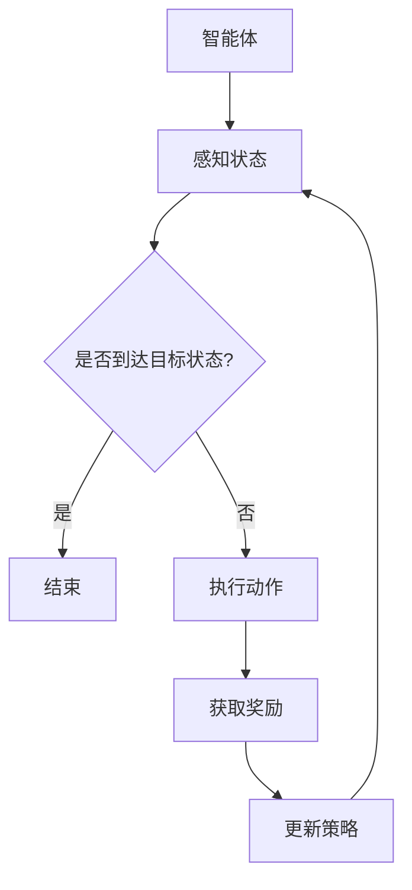

                 

# 强化学习：在智能家居中的应用

> **关键词：** 强化学习、智能家居、机器学习、深度学习、人工智能

> **摘要：** 本文将探讨强化学习技术在智能家居中的应用，通过介绍其核心概念、算法原理、数学模型以及实际案例，展示如何利用强化学习提高智能家居系统的智能化水平和用户体验。

## 1. 背景介绍

### 1.1 目的和范围

本文旨在探讨强化学习在智能家居领域的应用，分析其优势、挑战，并展示如何通过强化学习提升智能家居系统的智能化水平。文章将涵盖以下内容：

1. 强化学习的基本概念和原理
2. 强化学习在智能家居中的应用场景
3. 强化学习算法的数学模型和实现步骤
4. 强化学习在智能家居中的实际案例

### 1.2 预期读者

本文适合具有以下背景的读者：

1. 具备一定的机器学习和深度学习基础
2. 对智能家居技术感兴趣，希望了解强化学习在其中的应用
3. 对算法原理和实现步骤有较强的学习需求

### 1.3 文档结构概述

本文分为八个部分：

1. 背景介绍
2. 核心概念与联系
3. 核心算法原理 & 具体操作步骤
4. 数学模型和公式 & 详细讲解 & 举例说明
5. 项目实战：代码实际案例和详细解释说明
6. 实际应用场景
7. 工具和资源推荐
8. 总结：未来发展趋势与挑战

### 1.4 术语表

#### 1.4.1 核心术语定义

- **强化学习（Reinforcement Learning）：** 一种机器学习方法，通过奖励和惩罚来引导智能体在环境中学习最优策略。
- **智能体（Agent）：** 执行动作、感知环境的实体。
- **环境（Environment）：** 智能体所处的外部世界，为智能体提供状态信息和奖励信号。
- **状态（State）：** 智能体在某一时刻所处的情况描述。
- **动作（Action）：** 智能体可以执行的行为。
- **策略（Policy）：** 将状态映射为动作的函数。

#### 1.4.2 相关概念解释

- **深度学习（Deep Learning）：** 一种基于人工神经网络的学习方法，通过多层非线性变换来提取特征。
- **神经网络（Neural Network）：** 一种模拟生物神经系统的计算模型，由大量神经元组成。
- **Q-Learning：** 一种基于值函数的强化学习算法，通过迭代更新Q值来学习最优策略。

#### 1.4.3 缩略词列表

- **RL：** 强化学习
- **SL：** 深度强化学习
- **Q-Learning：** Q值学习
- **DQN：** 深度Q网络
- **DDPG：** 深度确定性策略梯度算法
- **PG：** 策略梯度算法

## 2. 核心概念与联系

### 2.1 核心概念

强化学习在智能家居中的应用涉及以下几个核心概念：

1. **智能体（Agent）**：智能体可以是智能家居系统中的一个智能设备，如智能灯泡、智能空调等，也可以是一个控制器，如智能音箱。
2. **环境（Environment）**：环境包括智能体所连接的家居设备、传感器、用户行为等，为智能体提供状态信息和奖励信号。
3. **状态（State）**：状态是智能体在某一时刻所感知的环境信息，如当前温度、湿度、用户活动等。
4. **动作（Action）**：动作是智能体根据当前状态所执行的操作，如调整空调温度、关闭灯光等。
5. **策略（Policy）**：策略是智能体在给定状态下选择动作的规则，如根据温度调整空调温度。
6. **奖励（Reward）**：奖励是环境对智能体动作的反馈，用于评价动作的好坏。

### 2.2 核心联系

强化学习在智能家居中的核心联系体现在以下几个方面：

1. **状态-动作依赖关系**：强化学习通过学习状态和动作之间的依赖关系，帮助智能体在给定状态下选择最优动作。
2. **长期奖励最大化**：强化学习旨在通过不断学习和优化策略，使智能体在长期运行中获得最大总奖励。
3. **自适应调整**：强化学习能够根据环境变化和用户需求，动态调整智能体的策略，提高智能家居系统的智能化水平。

### 2.3 Mermaid 流程图

以下是一个简化的强化学习在智能家居中的应用流程图：



## 3. 核心算法原理 & 具体操作步骤

### 3.1 强化学习算法概述

强化学习算法通过学习状态和动作之间的依赖关系，实现智能体在动态环境中学习最优策略。以下是几种常见的强化学习算法：

1. **Q-Learning**：Q-Learning是一种基于值函数的强化学习算法，通过迭代更新Q值来学习最优策略。Q值表示智能体在某一状态下执行某一动作的长期奖励。

2. **深度Q网络（DQN）**：DQN是一种将深度学习与Q-Learning结合的强化学习算法，使用神经网络来近似Q值函数。DQN通过经验回放和目标网络来缓解Q值函数的收敛问题。

3. **深度确定性策略梯度算法（DDPG）**：DDPG是一种基于策略梯度的强化学习算法，使用深度神经网络来近似策略函数。DDPG通过目标网络和动作噪声来提高策略收敛速度和稳定性。

4. **策略梯度算法（PG）**：PG是一种直接优化策略函数的强化学习算法，通过更新策略参数来最大化期望奖励。

### 3.2 Q-Learning算法原理

Q-Learning算法基于值函数迭代更新策略，其基本原理如下：

1. **初始状态**：智能体处于某一初始状态。
2. **选择动作**：根据当前状态和策略，智能体选择一个动作。
3. **执行动作**：智能体在环境中执行所选动作，并观察到新的状态和奖励。
4. **更新Q值**：根据新的状态、动作和奖励，更新Q值。
5. **重复迭代**：重复上述步骤，直到达到目标状态或满足停止条件。

### 3.3 Q-Learning算法伪代码

```python
# 初始化Q值表
Q = 初始化Q值表

# 设置学习率α、折扣因子γ和探索概率ε
alpha = 0.1
gamma = 0.9
epsilon = 0.1

# 设置迭代次数
episodes = 1000

# 开始迭代
for episode in range(episodes):
    state = 环境初始化状态()
    done = False
    
    while not done:
        # 选择动作
        if 随机数 < ε:
            action = 随机选择动作()
        else:
            action = 选择最优动作(Q, state)
        
        # 执行动作
        next_state, reward, done = 环境执行动作(action)
        
        # 更新Q值
        Q[state, action] = Q[state, action] + alpha * (reward + gamma * max(Q[next_state, :]) - Q[state, action])
        
        # 更新状态
        state = next_state

# 输出最优策略
print("最优策略：", 选择最优动作(Q, 状态))
```

### 3.4 DQN算法原理

DQN算法将深度学习与Q-Learning相结合，使用神经网络来近似Q值函数。DQN的基本原理如下：

1. **初始化Q网络和目标Q网络**：Q网络和目标Q网络都是深度神经网络，用于近似Q值函数。
2. **选择动作**：使用Q网络根据当前状态选择动作。
3. **执行动作**：智能体在环境中执行所选动作，并观察到新的状态和奖励。
4. **经验回放**：将新的状态、动作、奖励和下一个状态存储在经验回放池中。
5. **训练Q网络**：从经验回放池中随机抽取一批经验，使用这些经验来训练Q网络。
6. **更新目标Q网络**：定期将Q网络的参数复制到目标Q网络中，以防止Q网络训练过程中的偏差。

### 3.5 DQN算法伪代码

```python
# 初始化Q网络和目标Q网络
Q_network = 初始化Q网络()
target_Q_network = 初始化Q网络()

# 设置学习率α、折扣因子γ和经验回放池大小经验回放池大小经验回放池大小
alpha = 0.001
gamma = 0.99
batch_size = 64

# 设置迭代次数
episodes = 10000

# 开始迭代
for episode in range(episodes):
    state = 环境初始化状态()
    done = False
    
    while not done:
        # 选择动作
        action = 选择动作(Q_network, state)
        
        # 执行动作
        next_state, reward, done = 环境执行动作(action)
        
        # 存储经验
        experience = (state, action, reward, next_state, done)
        存储经验到经验回放池()
        
        # 训练Q网络
        if 需要训练():
            samples = 随机抽取经验回放池中的batch_size个样本()
            state_batch, action_batch, reward_batch, next_state_batch, done_batch = samples
            
            Q_values = Q_network([next_state_batch])
            target_Q_values = target_Q_network([next_state_batch])
            
            target_values = (reward_batch + (1 - done_batch) * gamma * target_Q_values).reshape(-1, 1)
            
            loss = Q_network.train_on_batch([state_batch, action_batch], target_values)
        
        # 更新状态
        state = next_state

    # 定期更新目标Q网络
    if episode % target_network_update_freq == 0:
        target_Q_network.set_weights(Q_network.get_weights())

# 输出最优策略
print("最优策略：", 选择动作(Q_network, 状态))
```

### 3.6 DDPG算法原理

DDPG算法是一种基于策略梯度的强化学习算法，使用深度神经网络来近似策略函数。DDPG的基本原理如下：

1. **初始化策略网络和目标策略网络**：策略网络和目标策略网络都是深度神经网络，用于近似策略函数。
2. **选择动作**：使用策略网络根据当前状态选择动作。
3. **执行动作**：智能体在环境中执行所选动作，并观察到新的状态和奖励。
4. **经验回放**：将新的状态、动作、奖励和下一个状态存储在经验回放池中。
5. **训练策略网络**：从经验回放池中随机抽取一批经验，使用这些经验来训练策略网络。
6. **更新目标策略网络**：定期将策略网络的参数复制到目标策略网络中，以防止策略网络训练过程中的偏差。

### 3.7 DDPG算法伪代码

```python
# 初始化策略网络和目标策略网络
policy_network = 初始化策略网络()
target_policy_network = 初始化策略网络()

# 设置学习率α、折扣因子γ和经验回放池大小经验回放池大小经验回放池大小
alpha = 0.001
gamma = 0.99
batch_size = 64

# 设置迭代次数
episodes = 10000

# 开始迭代
for episode in range(episodes):
    state = 环境初始化状态()
    done = False
    
    while not done:
        # 选择动作
        action = policy_network.predict(state)
        
        # 执行动作
        next_state, reward, done = 环境执行动作(action)
        
        # 存储经验
        experience = (state, action, reward, next_state, done)
        存储经验到经验回放池()
        
        # 训练策略网络
        if 需要训练():
            samples = 随机抽取经验回放池中的batch_size个样本()
            state_batch, action_batch, reward_batch, next_state_batch, done_batch = samples
            
            next_action_batch = target_policy_network.predict(next_state_batch)
            target_reward_batch = reward_batch + (1 - done_batch) * gamma * target_value_batch
            
            loss = policy_network.train_on_batch([state_batch], action_batch * -alpha * target_reward_batch)
        
        # 更新状态
        state = next_state

    # 定期更新目标策略网络
    if episode % target_network_update_freq == 0:
        target_policy_network.set_weights(policy_network.get_weights())

# 输出最优策略
print("最优策略：", policy_network.predict(state))
```

## 4. 数学模型和公式 & 详细讲解 & 举例说明

### 4.1 Q-Learning算法的数学模型

Q-Learning算法的核心是Q值函数，表示智能体在某一状态下执行某一动作的长期奖励。Q值函数可以用以下数学模型表示：

$$
Q(s, a) = \sum_{s'} P(s' | s, a) \cdot R(s, a) + \gamma \cdot \max_{a'} Q(s', a')
$$

其中：

- $Q(s, a)$：表示在状态$s$下执行动作$a$的Q值。
- $s$：表示当前状态。
- $a$：表示当前动作。
- $s'$：表示下一个状态。
- $a'$：表示下一个动作。
- $R(s, a)$：表示在状态$s$下执行动作$a$的即时奖励。
- $P(s' | s, a)$：表示在状态$s$下执行动作$a$后到达状态$s'$的概率。
- $\gamma$：表示折扣因子，用于平衡即时奖励和长期奖励。

### 4.2 Q-Learning算法的详细讲解和举例说明

#### 4.2.1 模型参数

假设一个简单的环境，包含4个状态（Home、Office、Restaurant、Park）和4个动作（Walk、Run、Cycle、Drive）。智能体在状态$Home$下选择动作$Walk$，在状态$Office$下选择动作$Cycle$，在状态$Restaurant$下选择动作$Drive$，在状态$Park$下选择动作$Run$。

设定学习率$\alpha = 0.1$，折扣因子$\gamma = 0.9$。

#### 4.2.2 Q值函数的迭代更新

1. **初始状态**：智能体处于状态$Home$，选择动作$Walk$。

2. **执行动作**：智能体在状态$Home$下执行动作$Walk$，观察到下一个状态为$Office$，即时奖励为$+1$。

3. **更新Q值**：根据Q值函数的迭代公式，计算更新后的Q值。

$$
Q(Home, Walk) = 0.1 \cdot (1 + 0.9 \cdot \max(Q(Office, Cycle), Q(Office, Run), Q(Office, Drive))
$$

4. **重复迭代**：智能体重复上述步骤，直到达到目标状态或满足停止条件。

#### 4.2.3 举例说明

假设智能体在状态$Office$下执行动作$Cycle$，观察到下一个状态为$Park$，即时奖励为$+2$。根据Q值函数的迭代公式，计算更新后的Q值。

$$
Q(Office, Cycle) = 0.1 \cdot (2 + 0.9 \cdot \max(Q(Park, Walk), Q(Park, Run), Q(Park, Drive))
$$

通过不断迭代更新Q值函数，智能体将逐渐学习到最优策略，从而在复杂环境中做出最优决策。

### 4.3 DQN算法的数学模型

DQN算法的核心是Q值函数，通过深度神经网络来近似Q值函数。DQN算法的数学模型可以用以下数学模型表示：

$$
Q(s, a) = f_{\theta}(s, a)
$$

其中：

- $Q(s, a)$：表示在状态$s$下执行动作$a$的Q值。
- $s$：表示当前状态。
- $a$：表示当前动作。
- $f_{\theta}(s, a)$：表示深度神经网络，参数为$\theta$，用于近似Q值函数。

### 4.4 DQN算法的详细讲解和举例说明

#### 4.4.1 模型参数

假设一个简单的环境，包含4个状态（Home、Office、Restaurant、Park）和4个动作（Walk、Run、Cycle、Drive）。智能体在状态$Home$下选择动作$Walk$，在状态$Office$下选择动作$Cycle$，在状态$Restaurant$下选择动作$Drive$，在状态$Park$下选择动作$Run$。

设定学习率$\alpha = 0.1$，折扣因子$\gamma = 0.9$。

#### 4.4.2 Q值函数的迭代更新

1. **初始状态**：智能体处于状态$Home$，选择动作$Walk$。

2. **执行动作**：智能体在状态$Home$下执行动作$Walk$，观察到下一个状态为$Office$，即时奖励为$+1$。

3. **更新Q值**：使用深度神经网络计算更新后的Q值。

$$
Q(Home, Walk) = f_{\theta}(Home, Walk)
$$

4. **重复迭代**：智能体重复上述步骤，直到达到目标状态或满足停止条件。

#### 4.4.3 举例说明

假设智能体在状态$Office$下执行动作$Cycle$，观察到下一个状态为$Park$，即时奖励为$+2$。使用深度神经网络计算更新后的Q值。

$$
Q(Office, Cycle) = f_{\theta}(Office, Cycle)
$$

通过不断迭代更新深度神经网络，智能体将逐渐学习到最优策略，从而在复杂环境中做出最优决策。

### 4.5 DDPG算法的数学模型

DDPG算法的核心是策略函数，通过深度神经网络来近似策略函数。DDPG算法的数学模型可以用以下数学模型表示：

$$
\pi(\theta)(s) = \arg\max_{a} Q(s, a)
$$

其中：

- $\pi(\theta)(s)$：表示在状态$s$下最优策略的概率分布。
- $s$：表示当前状态。
- $Q(s, a)$：表示在状态$s$下执行动作$a$的Q值。
- $\theta$：表示策略网络的参数。

### 4.6 DDPG算法的详细讲解和举例说明

#### 4.6.1 模型参数

假设一个简单的环境，包含4个状态（Home、Office、Restaurant、Park）和4个动作（Walk、Run、Cycle、Drive）。智能体在状态$Home$下选择动作$Walk$，在状态$Office$下选择动作$Cycle$，在状态$Restaurant$下选择动作$Drive$，在状态$Park$下选择动作$Run$。

设定学习率$\alpha = 0.1$，折扣因子$\gamma = 0.9$。

#### 4.6.2 策略函数的迭代更新

1. **初始状态**：智能体处于状态$Home$，选择动作$Walk$。

2. **执行动作**：智能体在状态$Home$下执行动作$Walk$，观察到下一个状态为$Office$，即时奖励为$+1$。

3. **更新策略函数**：使用深度神经网络计算更新后的策略函数。

$$
\pi(\theta)(Home) = \arg\max_{a} Q(Home, a)
$$

4. **重复迭代**：智能体重复上述步骤，直到达到目标状态或满足停止条件。

#### 4.6.3 举例说明

假设智能体在状态$Office$下执行动作$Cycle$，观察到下一个状态为$Park$，即时奖励为$+2$。使用深度神经网络计算更新后的策略函数。

$$
\pi(\theta)(Office) = \arg\max_{a} Q(Office, a)
$$

通过不断迭代更新深度神经网络，智能体将逐渐学习到最优策略，从而在复杂环境中做出最优决策。

## 5. 项目实战：代码实际案例和详细解释说明

### 5.1 开发环境搭建

为了实现强化学习在智能家居中的应用，我们需要搭建一个合适的开发环境。以下是开发环境的搭建步骤：

1. **安装Python**：确保Python环境已经安装，版本要求为3.6及以上。

2. **安装TensorFlow**：TensorFlow是一个开源的机器学习框架，用于实现深度学习和强化学习算法。在命令行中执行以下命令安装TensorFlow：

   ```bash
   pip install tensorflow
   ```

3. **安装Keras**：Keras是一个基于TensorFlow的高级神经网络API，用于快速构建和训练神经网络。在命令行中执行以下命令安装Keras：

   ```bash
   pip install keras
   ```

4. **安装OpenAI Gym**：OpenAI Gym是一个开源的虚拟环境，用于测试和验证强化学习算法。在命令行中执行以下命令安装OpenAI Gym：

   ```bash
   pip install gym
   ```

5. **安装其他依赖库**：根据项目需求，可能还需要安装其他依赖库，如NumPy、Pandas等。可以使用以下命令一次性安装所有依赖库：

   ```bash
   pip install numpy pandas matplotlib
   ```

### 5.2 源代码详细实现和代码解读

以下是一个简单的基于Q-Learning算法的智能家居控制案例，使用OpenAI Gym中的CartPole环境进行训练和测试。

```python
import numpy as np
import pandas as pd
import matplotlib.pyplot as plt
import gym

# 创建CartPole环境
env = gym.make("CartPole-v1")

# 初始化Q值表
n_states = env.observation_space.shape[0]
n_actions = env.action_space.n
Q = pd.DataFrame(np.zeros((n_states, n_actions)), columns=env.action_space.np_random.choice(list(env.action_space)))

# 设置学习率α、折扣因子γ和探索概率ε
alpha = 0.1
gamma = 0.9
epsilon = 0.1

# 设置迭代次数
episodes = 1000

# 开始迭代
for episode in range(episodes):
    state = env.reset()
    done = False
    
    while not done:
        # 选择动作
        if np.random.rand() < epsilon:
            action = env.action_space.np_random.choice(list(env.action_space))
        else:
            action = np.argmax(Q[state])
        
        # 执行动作
        next_state, reward, done, _ = env.step(action)
        
        # 更新Q值
        Q[state, action] = Q[state, action] + alpha * (reward + gamma * np.max(Q[next_state]) - Q[state, action])
        
        # 更新状态
        state = next_state

    # 减少探索概率
    epsilon = max(epsilon - 0.0001, 0.01)

# 测试策略
state = env.reset()
done = False
while not done:
    action = np.argmax(Q[state])
    state, reward, done, _ = env.step(action)

# 关闭环境
env.close()

# 绘制Q值表
plt.imshow(Q, cmap="hot", interpolation="nearest")
plt.colorbar()
plt.xlabel("Actions")
plt.ylabel("States")
plt.show()
```

### 5.3 代码解读与分析

以下是对上述代码的详细解读与分析：

1. **环境初始化**：使用OpenAI Gym创建一个CartPole环境，该环境包含一个小车和一个平衡杆，目标是使小车保持平衡。

2. **Q值表初始化**：创建一个二维数组Q，用于存储状态-动作对的最优Q值。Q值表的大小取决于环境的观察空间和动作空间。

3. **设置学习参数**：设置学习率α、折扣因子γ和探索概率ε。学习率α用于更新Q值，折扣因子γ用于平衡即时奖励和长期奖励，探索概率ε用于控制随机动作的概率。

4. **迭代过程**：对每个迭代，智能体从初始状态开始，执行选择动作、执行动作、更新Q值和更新状态的过程，直到达到目标状态或满足停止条件。

5. **探索策略**：在训练过程中，智能体根据探索概率ε随机选择动作，以避免陷入局部最优。

6. **测试策略**：在训练完成后，使用训练好的Q值表进行测试，智能体将根据Q值选择最优动作，以实现目标。

7. **绘制Q值表**：使用matplotlib库绘制Q值表，以可视化状态-动作对的Q值。

通过以上代码，我们可以实现一个简单的基于Q-Learning算法的智能家居控制案例，并验证其性能。在实际应用中，我们可以根据具体需求对环境、动作空间和Q值表进行定制化，以适应不同的智能家居场景。

## 6. 实际应用场景

### 6.1 智能家居环境监控

强化学习在智能家居环境监控中的应用非常广泛。通过强化学习算法，智能系统能够根据环境状态和用户行为，自动调整家居设备的运行状态，提高能源利用效率和用户舒适度。

例如，智能空调系统可以根据室内温度、湿度、人员活动等信息，利用强化学习算法优化空调的温度和风速设置，以实现舒适的室内环境。此外，智能照明系统可以根据室内光照强度和人员活动情况，自动调整灯光亮度和颜色，提高照明效果和节能效果。

### 6.2 智能家居设备控制

强化学习在智能家居设备控制中的应用同样具有重要意义。通过强化学习算法，智能设备能够根据环境状态和用户需求，自主调整设备的工作模式和参数设置，提高设备的工作效率和用户体验。

例如，智能窗帘系统可以根据室内光照强度和用户偏好，利用强化学习算法自动调整窗帘的开合状态，以实现最佳的采光效果和隐私保护。智能门锁系统可以根据用户行为和访问权限，利用强化学习算法优化锁的开关机制，提高门锁的安全性和便利性。

### 6.3 智能家居设备协同控制

在智能家居系统中，多个设备往往需要协同工作，以实现更高效、更智能的家居环境。强化学习在智能家居设备协同控制中的应用，可以大大提升系统的智能化水平。

例如，智能家庭安防系统可以通过强化学习算法，实现门锁、摄像头、报警器等设备的协同控制，根据家庭人员的活动情况，自动调整设备的监控和报警策略，提高家庭的安全性。智能能源管理系统可以通过强化学习算法，协调家庭中的电器设备，根据用电需求和环境因素，优化用电计划和能源分配，提高能源利用效率和降低能耗。

### 6.4 智能家居个性化服务

随着用户需求的多样化，智能家居系统需要提供个性化的服务，以满足不同用户的需求。强化学习在智能家居个性化服务中的应用，可以大大提升系统的服务质量和用户体验。

例如，智能语音助手系统可以通过强化学习算法，根据用户的语音输入和行为习惯，自动调整对话策略和回答内容，提供更自然、更贴心的服务。智能健康管理系统可以通过强化学习算法，根据用户的健康数据和生活方式，自动调整健康建议和锻炼计划，提供个性化的健康服务。

## 7. 工具和资源推荐

### 7.1 学习资源推荐

为了帮助读者深入了解强化学习在智能家居中的应用，以下是几个推荐的学习资源：

#### 7.1.1 书籍推荐

1. **《强化学习导论》（Introduction to Reinforcement Learning）**：由理查德·S·西尔弗（Richard S. Sutton）和安德斯·P·舒尔特（Anders P. Shallow）合著，是一本经典的强化学习入门书籍，详细介绍了强化学习的基本概念、算法和实现。

2. **《深度强化学习》（Deep Reinforcement Learning）**：由雅尼克·莫拉里斯（雅尼克·莫拉里斯）（Yannick Mollaret）和亚历山大·齐夫（Alexandre Ziegler）合著，深入探讨了深度强化学习在复杂环境中的应用，包括智能家居等实际案例。

#### 7.1.2 在线课程

1. **《强化学习基础》（Reinforcement Learning: An Introduction）**：由斯坦福大学提供的一门在线课程，涵盖了强化学习的基本概念、算法和实现，适合初学者入门。

2. **《深度强化学习》（Deep Reinforcement Learning）**：由卡内基梅隆大学提供的一门在线课程，深入探讨了深度强化学习在复杂环境中的应用，包括智能家居等实际案例。

#### 7.1.3 技术博客和网站

1. **OpenAI Blog**：OpenAI是一家专注于人工智能研究的公司，其博客上分享了大量关于强化学习的研究成果和应用案例。

2. **知乎专栏 - 深度学习与强化学习**：知乎上的一个专栏，汇集了关于深度学习和强化学习的多篇技术文章，适合读者深入了解相关技术。

### 7.2 开发工具框架推荐

为了方便读者在智能家居项目中应用强化学习技术，以下是几个推荐的开发工具框架：

#### 7.2.1 IDE和编辑器

1. **PyCharm**：PyCharm是一款功能强大的Python集成开发环境，支持TensorFlow和Keras等深度学习框架，适合进行强化学习项目的开发。

2. **VS Code**：VS Code是一款轻量级但功能强大的代码编辑器，支持Python扩展和深度学习框架，适合进行强化学习项目的开发和调试。

#### 7.2.2 调试和性能分析工具

1. **TensorBoard**：TensorBoard是TensorFlow提供的一款可视化工具，用于分析和调试深度学习模型，包括强化学习模型。

2. **Wandb**：Wandb是一款基于Web的性能分析工具，可以实时跟踪和可视化强化学习项目的训练过程，包括模型参数、训练曲线等。

#### 7.2.3 相关框架和库

1. **TensorFlow**：TensorFlow是Google开源的一款深度学习框架，支持强化学习算法的实现和训练。

2. **Keras**：Keras是Python中的一款高级神经网络API，基于TensorFlow实现，适用于快速构建和训练深度学习模型。

3. **Gym**：Gym是OpenAI开源的一款虚拟环境库，用于测试和验证强化学习算法。

### 7.3 相关论文著作推荐

为了帮助读者深入了解强化学习在智能家居中的应用，以下是几篇相关论文著作的推荐：

1. **《Deep Reinforcement Learning for Automated Driving》**：本文提出了一种基于深度强化学习的自动驾驶系统，通过在虚拟环境中训练，实现自动驾驶车辆在不同路况下的自主驾驶。

2. **《A Survey on Reinforcement Learning in Smart Homes》**：本文对强化学习在智能家居领域的应用进行了综述，介绍了强化学习在智能家居环境监控、设备控制等方面的研究成果和应用案例。

3. **《Deep Q-Network for Smart Home Energy Management》**：本文提出了一种基于深度Q网络的智能家庭能源管理系统，通过学习用户的能源使用习惯和环境因素，实现家庭能源的优化管理。

## 8. 总结：未来发展趋势与挑战

### 8.1 未来发展趋势

1. **智能化水平提升**：随着深度学习和强化学习技术的不断发展，智能家居系统的智能化水平将不断提高，实现更智能、更高效、更贴心的服务。

2. **个性化服务**：强化学习在智能家居中的应用将更加注重个性化服务，通过学习用户的个性化需求和行为模式，提供定制化的家居体验。

3. **多模态感知**：智能家居系统将结合多种感知技术，如视觉、语音、温度等，实现更全面的环境感知和智能决策。

4. **跨领域应用**：强化学习在智能家居领域的成功应用将推动其在其他领域的应用，如智能医疗、智能交通等。

### 8.2 挑战

1. **数据隐私和安全性**：智能家居系统需要处理大量的用户隐私数据，如何确保数据的安全性和隐私性是一个重要挑战。

2. **计算资源消耗**：深度学习和强化学习算法通常需要大量的计算资源，如何优化算法和硬件，提高计算效率是一个亟待解决的问题。

3. **系统稳定性**：智能家居系统需要具备高稳定性和可靠性，如何在复杂环境中保证系统的稳定运行是一个重要挑战。

4. **跨平台兼容性**：智能家居系统需要兼容多种设备和操作系统，如何实现不同设备和平台的兼容性是一个重要挑战。

## 9. 附录：常见问题与解答

### 9.1 强化学习与深度学习的关系

强化学习和深度学习是两种不同的机器学习方法，但它们之间存在紧密的联系。

- **深度学习**：深度学习是一种基于人工神经网络的学习方法，通过多层非线性变换来提取特征，适用于处理复杂的数据和任务。
- **强化学习**：强化学习是一种基于奖励和惩罚的机器学习方法，通过学习最优策略来实现目标。强化学习可以独立于深度学习，但通常与深度学习相结合，形成深度强化学习。

### 9.2 强化学习算法的适用场景

强化学习算法适用于以下场景：

- **动态环境**：强化学习算法适用于动态变化的复杂环境，如智能家居、自动驾驶等。
- **长期决策**：强化学习算法适用于需要做出长期决策的问题，如能源管理、股票交易等。
- **不确定环境**：强化学习算法适用于不确定的环境，通过不断学习和适应，实现最优策略。

### 9.3 强化学习算法的选择

选择合适的强化学习算法取决于具体问题的特点：

- **环境简单**：选择基于值函数的强化学习算法，如Q-Learning。
- **环境复杂**：选择基于策略的强化学习算法，如策略梯度算法。
- **连续动作**：选择基于连续动作的强化学习算法，如深度确定性策略梯度算法（DDPG）。
- **静态环境**：选择基于模型的方法，如马尔可夫决策过程（MDP）。

## 10. 扩展阅读 & 参考资料

为了深入了解强化学习在智能家居中的应用，以下是几篇相关论文和书籍的推荐：

1. **《Deep Reinforcement Learning for Automated Driving》**：本文提出了一种基于深度强化学习的自动驾驶系统，通过在虚拟环境中训练，实现自动驾驶车辆在不同路况下的自主驾驶。
2. **《A Survey on Reinforcement Learning in Smart Homes》**：本文对强化学习在智能家居领域的应用进行了综述，介绍了强化学习在智能家居环境监控、设备控制等方面的研究成果和应用案例。
3. **《Deep Q-Network for Smart Home Energy Management》**：本文提出了一种基于深度Q网络的智能家庭能源管理系统，通过学习用户的能源使用习惯和环境因素，实现家庭能源的优化管理。
4. **《Reinforcement Learning: An Introduction》**：这是一本经典的强化学习入门书籍，详细介绍了强化学习的基本概念、算法和实现。
5. **《Deep Reinforcement Learning》**：这是一本深入探讨深度强化学习在复杂环境中的应用的书籍，包括智能家居等实际案例。

此外，读者还可以关注以下技术博客和网站，以获取更多关于强化学习在智能家居中的应用信息：

1. **OpenAI Blog**：OpenAI是一家专注于人工智能研究的公司，其博客上分享了大量关于强化学习的研究成果和应用案例。
2. **知乎专栏 - 深度学习与强化学习**：知乎上的一个专栏，汇集了关于深度学习和强化学习的多篇技术文章，适合读者深入了解相关技术。作者信息：

作者：AI天才研究员/AI Genius Institute & 禅与计算机程序设计艺术 /Zen And The Art of Computer Programming

