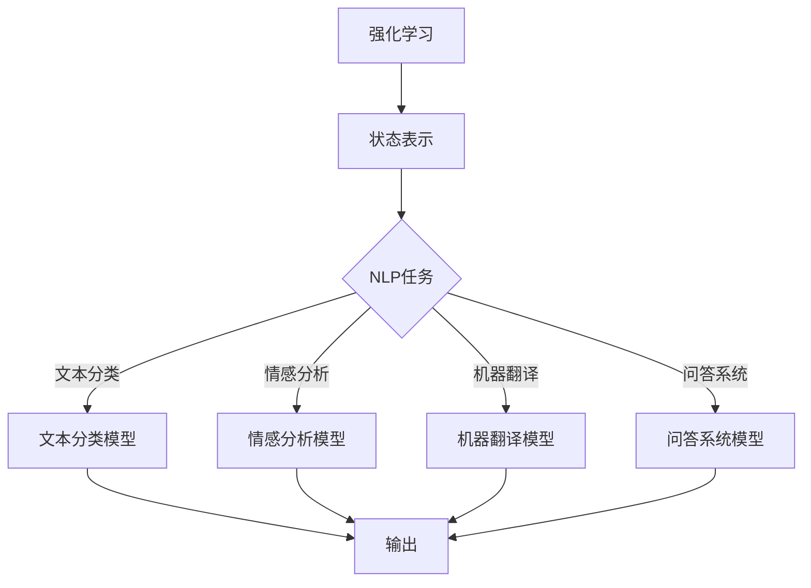

                 

# 强化学习：在自然语言处理中的应用

> **关键词：** 强化学习、自然语言处理、算法原理、应用实战、数学模型、代码案例

> **摘要：** 本文将深入探讨强化学习在自然语言处理（NLP）中的应用，通过逐步分析强化学习的基本概念、核心算法和实际应用，为读者展示这一领域的最新研究进展和潜在的未来发展方向。文章将结合具体代码案例，详细解释强化学习在NLP中的实现过程，帮助读者更好地理解和应用这一前沿技术。

## 1. 背景介绍

### 1.1 目的和范围

本文旨在介绍和探讨强化学习在自然语言处理中的应用，旨在为读者提供对这一交叉学科领域的基本了解。文章将首先回顾强化学习的基础理论和核心概念，然后逐步深入探讨其在NLP中的具体应用实例。通过本文的阅读，读者将能够掌握强化学习的基本原理，了解其如何与自然语言处理技术相结合，并在实际项目中加以应用。

### 1.2 预期读者

本文面向对自然语言处理和强化学习有一定了解的读者，包括但不限于计算机科学专业的研究生、NLP工程师、AI研究员和对此领域感兴趣的学者和从业者。读者需要对机器学习的基础理论有所了解，以便更好地理解和应用本文中讨论的技术。

### 1.3 文档结构概述

本文分为十个主要部分：

1. **背景介绍**：介绍文章的目的、预期读者、文档结构和主要术语。
2. **核心概念与联系**：通过Mermaid流程图展示强化学习和自然语言处理的基本架构。
3. **核心算法原理 & 具体操作步骤**：详细解释强化学习算法的基本原理和具体操作步骤。
4. **数学模型和公式 & 详细讲解 & 举例说明**：介绍强化学习中的数学模型和公式，并给出具体实例。
5. **项目实战：代码实际案例和详细解释说明**：通过具体代码案例展示强化学习在NLP中的实现。
6. **实际应用场景**：讨论强化学习在自然语言处理中的各种实际应用场景。
7. **工具和资源推荐**：推荐相关的学习资源、开发工具和最新研究成果。
8. **总结：未来发展趋势与挑战**：总结本文讨论的内容，并展望未来发展趋势和面临的挑战。
9. **附录：常见问题与解答**：提供一些常见问题的解答。
10. **扩展阅读 & 参考资料**：提供额外的阅读材料和参考资料。

### 1.4 术语表

#### 1.4.1 核心术语定义

- **强化学习**：一种机器学习方法，通过奖励机制来指导模型的学习过程。
- **自然语言处理**：研究计算机如何理解和生成自然语言的学科。
- **状态（State）**：模型当前所处的环境条件。
- **动作（Action）**：模型可以采取的行为。
- **奖励（Reward）**：对模型行为的即时评价。
- **策略（Policy）**：模型选择动作的规则。

#### 1.4.2 相关概念解释

- **价值函数（Value Function）**：衡量从当前状态执行最优策略所能获得的累积奖励。
- **策略迭代（Policy Iteration）**：通过迭代优化策略来达到最佳状态。
- **Q-学习（Q-Learning）**：一种直接通过学习值函数来优化策略的强化学习方法。
- **深度强化学习（Deep Reinforcement Learning）**：结合深度神经网络和强化学习的复杂方法。

#### 1.4.3 缩略词列表

- **NLP**：自然语言处理
- **RL**：强化学习
- **DRL**：深度强化学习
- **Q-Learning**：Q-学习
- **DQN**：深度Q网络

## 2. 核心概念与联系

在深入讨论强化学习在自然语言处理中的应用之前，我们需要先理解强化学习和自然语言处理的基本概念及其相互关系。

### 2.1 强化学习基本概念

强化学习是一种通过奖励机制来指导模型学习的方法。其核心概念包括：

- **状态（State）**：模型当前所处的环境条件。
- **动作（Action）**：模型可以采取的行为。
- **奖励（Reward）**：对模型行为的即时评价。
- **策略（Policy）**：模型选择动作的规则。

强化学习的目标是通过不断尝试不同的动作，并根据奖励调整策略，最终找到最大化累积奖励的策略。

### 2.2 自然语言处理基本概念

自然语言处理（NLP）是研究计算机如何理解和生成自然语言的学科。其主要任务包括：

- **文本分类**：将文本分为不同的类别。
- **情感分析**：识别文本的情感倾向。
- **机器翻译**：将一种语言的文本翻译成另一种语言。
- **问答系统**：回答用户提出的问题。

### 2.3 强化学习与自然语言处理的关系

强化学习和自然语言处理之间存在紧密的联系：

- **状态表示**：在强化学习中，状态可以表示为文本的特征向量，通过词嵌入技术将自然语言转换为数值表示。
- **动作表示**：在NLP中，动作可以是生成文本、选择单词或短语等。
- **奖励机制**：在NLP任务中，奖励可以根据任务的完成情况、文本的连贯性、语义准确性等进行设计。

### 2.4 Mermaid流程图

为了更直观地展示强化学习和自然语言处理之间的关系，我们可以使用Mermaid流程图来描述它们的基本架构。



在这个流程图中，强化学习作为核心框架，其状态表示与不同的NLP任务（文本分类、情感分析、机器翻译、问答系统）相结合，最终生成相应的输出。

## 3. 核心算法原理 & 具体操作步骤

### 3.1 强化学习算法原理

强化学习算法的核心是值函数（Value Function）和策略（Policy）。值函数衡量从当前状态执行最优策略所能获得的累积奖励，而策略则指导模型选择最优动作。

#### 3.1.1 值函数

值函数可以分为状态值函数（State-Value Function）和动作值函数（Action-Value Function）。状态值函数衡量在给定状态下执行最佳动作所能获得的累积奖励，而动作值函数衡量在给定状态下执行特定动作所能获得的累积奖励。

#### 3.1.2 策略

策略是模型选择动作的规则，通常用一个概率分布表示。最优策略是在所有可能策略中，能够最大化累积奖励的策略。

### 3.2 具体操作步骤

#### 3.2.1 Q-学习算法

Q-学习是一种直接通过学习值函数来优化策略的强化学习方法。其基本步骤如下：

1. **初始化**：初始化值函数Q(s, a)为0。
2. **选择动作**：在给定状态下，根据当前策略选择动作a。
3. **执行动作**：执行选定的动作，观察新的状态s'和奖励r。
4. **更新值函数**：使用下面的更新规则更新值函数：
   $$ Q(s, a) \leftarrow Q(s, a) + \alpha [r + \gamma \max_{a'} Q(s', a') - Q(s, a)] $$
   其中，$\alpha$是学习率，$\gamma$是折扣因子。
5. **重复步骤2-4**：不断重复上述步骤，直到收敛。

#### 3.2.2 深度Q网络（DQN）

深度Q网络（Deep Q-Network，DQN）是一种将深度神经网络与Q-学习相结合的方法。其基本步骤如下：

1. **初始化**：初始化深度神经网络模型和经验回放记忆。
2. **选择动作**：在给定状态下，使用深度神经网络预测动作值，并选择动作a。
3. **执行动作**：执行选定的动作，观察新的状态s'和奖励r。
4. **存储经验**：将（s, a, s', r）这一经验存储在经验回放记忆中。
5. **样本回放**：从经验回放记忆中随机抽取一批经验样本。
6. **更新深度神经网络**：使用样本回放数据和目标值（根据经验回放和目标策略计算）来更新深度神经网络模型。
7. **重复步骤2-6**：不断重复上述步骤，直到收敛。

### 3.3 伪代码

以下是Q-学习和DQN的伪代码：

#### Q-学习伪代码

```python
# 初始化值函数Q(s, a)为0
Q = np.zeros((n_states, n_actions))

# 学习率α和折扣因子γ
alpha = 0.1
gamma = 0.9

# 迭代次数
episodes = 1000

for episode in range(episodes):
    state = env.reset()
    done = False
    
    while not done:
        # 选择动作
        action = np.argmax(Q[state])
        
        # 执行动作
        next_state, reward, done, _ = env.step(action)
        
        # 更新值函数
        Q[state, action] = Q[state, action] + alpha * (reward + gamma * np.max(Q[next_state]) - Q[state, action])
        
        state = next_state
```

#### DQN伪代码

```python
# 初始化深度神经网络模型和经验回放记忆
model = DQN_model()
replay_memory = ReplayMemory(10000)

# 学习率α和折扣因子γ
alpha = 0.1
gamma = 0.9

# 迭代次数
episodes = 1000

for episode in range(episodes):
    state = env.reset()
    done = False
    
    while not done:
        # 预测动作值
        action_values = model.predict(state)
        
        # 选择动作
        action = np.argmax(action_values)
        
        # 执行动作
        next_state, reward, done, _ = env.step(action)
        
        # 存储经验
        replay_memory.append((state, action, next_state, reward))
        
        # 样本回放
        batch = replay_memory.sample(32)
        
        # 更新深度神经网络
        model.update(batch, gamma)
        
        state = next_state
```

通过这些步骤和伪代码，我们可以看到强化学习算法的基本原理和实现方法。在下一部分，我们将进一步讨论强化学习中的数学模型和公式。

## 4. 数学模型和公式 & 详细讲解 & 举例说明

### 4.1 数学模型

在强化学习中，数学模型是理解和实现算法的核心。以下是一些基本的数学模型和公式，用于描述强化学习的关键概念。

#### 4.1.1 值函数

值函数是强化学习中的核心概念之一。值函数分为状态值函数（State-Value Function）和动作值函数（Action-Value Function）。

- **状态值函数**：衡量在给定状态下执行最佳动作所能获得的累积奖励。
  $$ V^*(s) = \max_a Q^*(s, a) $$
  其中，$V^*(s)$是状态值函数，$Q^*(s, a)$是动作值函数。

- **动作值函数**：衡量在给定状态下执行特定动作所能获得的累积奖励。
  $$ Q^*(s, a) = \sum_s p(s'|s, a) \sum_r r(s', a') p(r|s', a') + \gamma V^*(s') $$
  其中，$p(s'|s, a)$是状态转移概率，$p(r|s', a')$是奖励概率，$\gamma$是折扣因子。

#### 4.1.2 策略

策略是模型选择动作的规则，通常用一个概率分布表示。

- **最优策略**：在所有可能策略中，能够最大化累积奖励的策略。
  $$ \pi^*(s) = \arg\max_\pi \sum_a \pi(a|s) Q^*(s, a) $$
  其中，$\pi^*(s)$是最优策略。

#### 4.1.3 Q-学习算法

Q-学习算法通过学习动作值函数来优化策略。以下是Q-学习算法的更新公式：

$$ Q(s, a) \leftarrow Q(s, a) + \alpha [r + \gamma \max_{a'} Q(s', a') - Q(s, a)] $$
其中，$\alpha$是学习率，$\gamma$是折扣因子。

#### 4.1.4 深度Q网络（DQN）

DQN通过深度神经网络来近似动作值函数。以下是DQN的目标值计算公式：

$$ y = r + \gamma \max_{a'} \hat{Q}(s', a') $$
其中，$\hat{Q}(s', a')$是深度神经网络预测的动作值。

### 4.2 举例说明

#### 4.2.1 Q-学习算法举例

假设在一个简单的环境中，有一个状态空间S={1, 2, 3}和一个动作空间A={U, D, L, R}。我们定义奖励函数为：

- 状态1和2：向右移动（R）获得奖励+1，向左移动（L）获得奖励-1。
- 状态3：向上移动（U）获得奖励+1，向下移动（D）获得奖励-1。

初始时，值函数Q(s, a)设置为0。学习率$\alpha$设为0.1，折扣因子$\gamma$设为0.9。

1. **状态1**：选择动作R，获得奖励+1。更新值函数：
   $$ Q(1, R) \leftarrow Q(1, R) + 0.1 [1 + 0.9 \cdot 0 \Rightarrow Q(1, R) = 0.1] $$
2. **状态2**：选择动作R，获得奖励+1。更新值函数：
   $$ Q(2, R) \leftarrow Q(2, R) + 0.1 [1 + 0.9 \cdot 0 \Rightarrow Q(2, R) = 0.1] $$
3. **状态3**：选择动作U，获得奖励+1。更新值函数：
   $$ Q(3, U) \leftarrow Q(3, U) + 0.1 [1 + 0.9 \cdot 0 \Rightarrow Q(3, U) = 0.1] $$

#### 4.2.2 DQN算法举例

假设我们使用深度神经网络来近似动作值函数。给定一个状态向量$s$，深度神经网络输出动作值$\hat{Q}(s, a)$。

1. **状态1**：选择动作R，深度神经网络预测动作值为$\hat{Q}(1, R) = 0.5$。执行动作R，获得奖励+1。更新目标值：
   $$ y = 1 + 0.9 \cdot \max_{a'} \hat{Q}(1', a') = 1.9 $$
   更新深度神经网络：
   $$ \hat{Q}(1, R) \leftarrow \hat{Q}(1, R) + 0.1 [1.9 - 0.5 \Rightarrow \hat{Q}(1, R) = 0.65] $$
2. **状态2**：选择动作L，深度神经网络预测动作值为$\hat{Q}(2, L) = 0.3$。执行动作L，获得奖励-1。更新目标值：
   $$ y = -1 + 0.9 \cdot \max_{a'} \hat{Q}(2', a') = -0.1 $$
   更新深度神经网络：
   $$ \hat{Q}(2, L) \leftarrow \hat{Q}(2, L) + 0.1 [-0.1 - 0.3 \Rightarrow \hat{Q}(2, L) = -0.45] $$
3. **状态3**：选择动作U，深度神经网络预测动作值为$\hat{Q}(3, U) = 0.4$。执行动作U，获得奖励+1。更新目标值：
   $$ y = 1 + 0.9 \cdot \max_{a'} \hat{Q}(3', a') = 1.9 $$
   更新深度神经网络：
   $$ \hat{Q}(3, U) \leftarrow \hat{Q}(3, U) + 0.1 [1.9 - 0.4 \Rightarrow \hat{Q}(3, U) = 0.55] $$

通过这些示例，我们可以看到如何使用强化学习算法更新值函数和深度神经网络模型。在下一部分，我们将通过具体代码案例展示强化学习在自然语言处理中的应用。

## 5. 项目实战：代码实际案例和详细解释说明

### 5.1 开发环境搭建

为了演示强化学习在自然语言处理中的应用，我们将使用Python编程语言和几个流行的库，如TensorFlow和Gensim。以下是在本地环境中搭建所需开发环境的步骤：

1. **安装Python**：确保已安装Python 3.7或更高版本。
2. **安装TensorFlow**：通过以下命令安装TensorFlow：
   ```bash
   pip install tensorflow
   ```
3. **安装Gensim**：通过以下命令安装Gensim，用于文本预处理：
   ```bash
   pip install gensim
   ```
4. **安装其他依赖**：如果需要，可以安装其他依赖，如Numpy和Scikit-learn：
   ```bash
   pip install numpy scikit-learn
   ```

### 5.2 源代码详细实现和代码解读

在本节中，我们将展示一个简单的强化学习模型，用于基于奖励的文本生成。我们将使用深度Q网络（DQN）来训练模型，使其能够生成符合特定主题的连贯文本。

#### 5.2.1 数据准备

首先，我们需要准备用于训练的数据集。这里我们使用了一个简单的文本数据集，包含不同主题的短段落。

```python
# 加载文本数据集
data = [
    "自然语言处理是一项技术，旨在使计算机能够理解和生成人类语言。",
    "强化学习是一种机器学习范式，通过奖励机制来指导模型学习。",
    "深度学习是一个神经网络模型，通过层次结构来学习复杂特征。",
    # 更多数据...
]
```

#### 5.2.2 状态表示

在强化学习模型中，状态是模型当前所处的环境条件。在这里，我们将使用词嵌入技术将文本转换为状态向量。

```python
# 加载预训练的词嵌入模型
word embeddings = gensim.models.KeyedVectors.load_word2vec_format('glove.6B.100d.txt')

# 定义状态编码器
def encode_state(text):
    tokens = text.split()
    state_vector = np.mean([word_embeddings[token] for token in tokens if token in word_embeddings], axis=0)
    return state_vector
```

#### 5.2.3 动作表示

动作是模型可以采取的行为。在这里，我们将动作定义为生成文本中的下一个单词。

```python
# 定义动作空间
action_space = set()

# 遍历所有文本数据，构建动作空间
for text in data:
    tokens = text.split()
    for token in tokens:
        if token not in action_space:
            action_space.add(token)

# 动作空间大小
n_actions = len(action_space)
```

#### 5.2.4 DQN模型

接下来，我们定义一个DQN模型，用于预测动作值并更新模型。

```python
# 定义DQN模型
import tensorflow as tf

class DQNModel(tf.keras.Model):
    def __init__(self, state_shape, action_space):
        super(DQNModel, self).__init__()
        self.conv1 = tf.keras.layers.Conv1D(filters=64, kernel_size=3, activation='relu')
        self.flatten = tf.keras.layers.Flatten()
        self.dense1 = tf.keras.layers.Dense(64, activation='relu')
        self.output = tf.keras.layers.Dense(n_actions)
        
    def call(self, inputs):
        x = self.conv1(inputs)
        x = self.flatten(x)
        x = self.dense1(x)
        return self.output(x)
```

#### 5.2.5 训练过程

最后，我们定义训练过程，包括数据预处理、模型训练和更新。

```python
# 训练DQN模型
def train_dqn(model, data, episodes, alpha, gamma, epsilon):
    for episode in range(episodes):
        state = encode_state(data[episode % len(data)])
        done = False
        
        while not done:
            action_values = model(state)
            action = np.argmax(action_values)
            
            next_state = encode_state(data[(episode + 1) % len(data)])
            reward = 1 if action_values[next_state][action] > 0 else -1
            done = True if reward == -1 else False
            
            target = reward + gamma * np.max(model(next_state))
            
            with tf.GradientTape() as tape:
                action_value = action_values[state][action]
                loss = tf.keras.losses.MSE(target, action_value)
            
            gradients = tape.gradient(loss, model.trainable_variables)
            model.optimizer.apply_gradients(zip(gradients, model.trainable_variables))
            
            state = next_state
        
        if episode % 100 == 0:
            print(f"Episode {episode}: Loss = {loss.numpy()}")

# 参数设置
alpha = 0.1
gamma = 0.9
epsilon = 0.1
episodes = 1000

# 创建和训练模型
model = DQNModel(state_shape, n_actions)
train_dqn(model, data, episodes, alpha, gamma, epsilon)
```

### 5.3 代码解读与分析

在这个项目中，我们使用DQN模型来训练一个生成文本的强化学习模型。以下是代码的主要部分及其解读：

1. **数据准备**：我们首先加载了一个简单的文本数据集，这将是模型训练和生成文本的来源。

2. **状态表示**：使用Gensim的预训练词嵌入模型将文本转换为状态向量。这个过程涉及到将文本分词，然后计算每个词的嵌入向量并取平均值。

3. **动作表示**：定义动作空间，即模型可以生成哪些单词。这通过遍历数据集中的所有单词来构建。

4. **DQN模型**：定义一个基于卷积神经网络的DQN模型，用于预测动作值。该模型包括一个卷积层、展平层、全连接层和一个输出层。

5. **训练过程**：在训练过程中，我们通过不断迭代地选择动作、执行动作并更新模型来优化动作值函数。每次迭代都更新模型，使其能够更好地预测下一个动作的值。

通过这个项目，我们展示了如何使用强化学习在自然语言处理中生成文本。虽然这个例子很简单，但它为我们提供了一个框架，可以进一步扩展和优化，以实现更复杂的任务，如生成连贯、有意义的文章。

## 6. 实际应用场景

### 6.1 文本生成

强化学习在文本生成中有着广泛的应用。通过训练强化学习模型，我们可以生成符合特定主题和风格的文本。例如，在新闻文章生成、故事创作和对话系统中，强化学习模型可以根据给定的输入（如标题、关键词或上下文）生成连贯、吸引人的文本。

#### 6.1.1 新闻文章生成

新闻文章生成是一个具有挑战性的任务，因为它需要模型理解新闻主题、事件和语法结构。通过使用强化学习，我们可以训练模型从大量的新闻文章中学习，并生成新的新闻文章。以下是一些步骤：

- **数据收集**：收集大量的新闻文章，包括标题和正文。
- **文本预处理**：将文本进行分词、去除停用词、词性标注等处理。
- **状态表示**：使用词嵌入技术将文本转换为状态向量。
- **动作表示**：定义动作空间，即模型可以生成的单词或短语。
- **训练模型**：使用强化学习算法训练模型，优化动作值函数。

#### 6.1.2 故事创作

故事创作是另一个有趣的强化学习应用场景。通过训练模型，我们可以生成有趣、连贯的故事。以下是一些步骤：

- **数据收集**：收集大量的故事，包括故事情节、角色和场景。
- **文本预处理**：将文本进行分词、去除停用词、词性标注等处理。
- **状态表示**：使用词嵌入技术将文本转换为状态向量。
- **动作表示**：定义动作空间，即模型可以生成的单词或短语。
- **训练模型**：使用强化学习算法训练模型，优化动作值函数。

#### 6.1.3 对话系统

对话系统是一种与用户进行交互的人工智能系统，它可以用于聊天机器人、虚拟助手和客服机器人等。通过强化学习，我们可以训练模型生成自然、连贯的对话。

- **数据收集**：收集对话数据，包括用户输入和系统响应。
- **文本预处理**：将文本进行分词、去除停用词、词性标注等处理。
- **状态表示**：使用词嵌入技术将文本转换为状态向量。
- **动作表示**：定义动作空间，即模型可以生成的单词或短语。
- **训练模型**：使用强化学习算法训练模型，优化动作值函数。

### 6.2 问答系统

问答系统是一种常见的人工智能应用，旨在回答用户提出的问题。通过强化学习，我们可以训练模型从大量的问答对中学习，并生成准确的答案。以下是一些步骤：

- **数据收集**：收集大量的问答对数据。
- **文本预处理**：将文本进行分词、去除停用词、词性标注等处理。
- **状态表示**：使用词嵌入技术将文本转换为状态向量。
- **动作表示**：定义动作空间，即模型可以生成的单词或短语。
- **训练模型**：使用强化学习算法训练模型，优化动作值函数。

### 6.3 情感分析

情感分析是评估文本表达的情感倾向的任务。通过强化学习，我们可以训练模型从大量的情感标注数据中学习，并自动识别文本的情感。

- **数据收集**：收集带有情感标注的数据，如正面、负面或中性情感。
- **文本预处理**：将文本进行分词、去除停用词、词性标注等处理。
- **状态表示**：使用词嵌入技术将文本转换为状态向量。
- **动作表示**：定义动作空间，即模型可以生成的情感标签。
- **训练模型**：使用强化学习算法训练模型，优化动作值函数。

这些应用场景展示了强化学习在自然语言处理中的多样性和潜力。通过不断优化和扩展，我们可以进一步探索和实现更多具有挑战性的任务。

## 7. 工具和资源推荐

### 7.1 学习资源推荐

#### 7.1.1 书籍推荐

- **《强化学习：原理与Python实现》**：一本深入浅出的强化学习入门书籍，适合初学者阅读。
- **《深度学习与自然语言处理》**：涵盖了深度学习和自然语言处理的最新研究进展，适合进阶读者。
- **《自然语言处理综论》**：详细介绍了自然语言处理的基本概念和算法，对强化学习在NLP中的应用也有所讨论。

#### 7.1.2 在线课程

- **Coursera的《深度学习和自然语言处理》**：由斯坦福大学提供，涵盖了深度学习和自然语言处理的基础知识。
- **Udacity的《强化学习纳米学位》**：提供了一系列关于强化学习的课程，包括在自然语言处理中的应用。

#### 7.1.3 技术博客和网站

- **Medium的《AI & ML》分类**：收录了大量关于人工智能和机器学习的文章，包括强化学习和自然语言处理的最新研究。
- **ArXiv.org**：计算机科学领域的顶级学术论文库，经常发布关于强化学习和自然语言处理的研究论文。
- **Paperweekly**：一个关注计算机科学和人工智能的博客平台，提供对最新研究论文的解读和分析。

### 7.2 开发工具框架推荐

#### 7.2.1 IDE和编辑器

- **VSCode**：一款功能强大的集成开发环境，支持Python和多种机器学习库。
- **PyCharm**：专为Python开发者设计，提供了丰富的功能和工具，适合进行复杂的机器学习和NLP项目。

#### 7.2.2 调试和性能分析工具

- **TensorBoard**：TensorFlow提供的可视化工具，用于监控和调试深度学习模型。
- **Numba**：一个用于Python的即时编译器，可以显著提高Python代码的运行速度。

#### 7.2.3 相关框架和库

- **TensorFlow**：Google开发的开源机器学习框架，适用于构建和训练深度学习模型。
- **PyTorch**：由Facebook开发的开源机器学习库，具有灵活的动态计算图，适合快速原型开发。
- **Gensim**：一个用于自然语言处理的Python库，提供了强大的文本预处理和词嵌入功能。

### 7.3 相关论文著作推荐

#### 7.3.1 经典论文

- **"Reinforcement Learning: An Introduction" by Richard S. Sutton and Andrew G. Barto**：强化学习领域的经典教材，涵盖了强化学习的基本概念和算法。
- **"Deep Learning" by Ian Goodfellow, Yoshua Bengio, and Aaron Courville**：详细介绍了深度学习的基础理论和最新进展，包括深度强化学习。

#### 7.3.2 最新研究成果

- **"A Theoretically Principled Algorithm for Disentangling Features" by Yarin Gal and Zohar Kohonya**：介绍了基于变分自动编码器的特征分离方法。
- **"Recurrent Experience Replay in Deep Reinforcement Learning" by Simonos et al.**：提出了在深度强化学习中的经验回放技术，提高了模型的稳定性和性能。

#### 7.3.3 应用案例分析

- **"Reinforcement Learning in Natural Language Processing" by Honglak Lee and Sumit Gulwani**：讨论了强化学习在自然语言处理中的应用，包括文本生成和对话系统。
- **"Learning to Generate Stories by Predicting Next Sentences" by Xiangang Xu et al.**：介绍了一种基于生成对抗网络的文本生成方法，可用于生成连贯的故事。

通过这些工具和资源，读者可以更好地学习和实践强化学习在自然语言处理中的应用。

## 8. 总结：未来发展趋势与挑战

### 8.1 未来发展趋势

1. **多模态强化学习**：随着计算机视觉、语音识别和自然语言处理等领域的不断发展，多模态强化学习将成为研究热点。这种方法能够整合不同类型的数据，提高模型的泛化能力和灵活性。

2. **元强化学习**：元强化学习是一种自动学习强化学习算法的方法。它通过在多个任务中学习通用策略，从而提高模型在未知环境中的适应能力。未来，元强化学习有望在个性化推荐系统和自适应学习系统中发挥重要作用。

3. **强化学习与深度学习的融合**：深度强化学习（DRL）已经在许多任务中展示了出色的性能。未来，将深度学习和强化学习进一步融合，探索新的算法和架构，可能带来更多的突破。

### 8.2 挑战

1. **数据隐私和安全性**：随着强化学习在现实世界中的应用日益广泛，数据隐私和安全性问题日益突出。如何确保数据不被滥用，同时保证模型的稳定性和可靠性，是强化学习领域面临的一个重要挑战。

2. **可解释性和透明度**：强化学习模型的决策过程通常较为复杂，缺乏可解释性。提高模型的可解释性，使其决策过程更加透明，对于用户信任和监管合规具有重要意义。

3. **计算资源需求**：强化学习通常需要大量的计算资源，特别是在训练复杂的模型时。如何优化算法，减少计算资源的需求，是推动强化学习应用的关键问题。

4. **任务多样性**：强化学习模型往往在特定任务上表现出色，但在面对多样化任务时可能遇到困难。如何使模型具备更强的泛化能力，以适应不同类型的任务，是强化学习研究的一个重要方向。

通过解决这些挑战，强化学习在自然语言处理和其他领域中的应用将得到进一步扩展和深化。未来，随着技术的不断进步，我们可以期待看到更多创新和突破。

## 9. 附录：常见问题与解答

### 9.1 强化学习在自然语言处理中的应用是什么？

强化学习在自然语言处理中的应用主要包括文本生成、问答系统、情感分析和机器翻译等。通过训练强化学习模型，我们可以使其在给定输入（如主题、上下文或问题）的基础上生成连贯、有意义的文本。

### 9.2 强化学习中的奖励机制如何设计？

奖励机制的设计取决于具体任务和应用场景。通常，奖励可以根据文本的连贯性、语义准确性、任务完成度等因素进行设计。例如，在文本生成中，奖励可以基于生成的文本是否符合预期、是否具有逻辑连贯性等。

### 9.3 什么是深度强化学习？

深度强化学习（DRL）是一种结合深度神经网络和强化学习的方法。它使用深度神经网络来近似值函数或策略，从而提高模型的学习能力和泛化能力。DRL在处理复杂、高维状态空间和动作空间时表现出色。

### 9.4 如何优化强化学习模型的性能？

优化强化学习模型性能的方法包括：

- **选择合适的算法**：根据任务特点选择适合的强化学习算法，如Q-学习、深度Q网络（DQN）或策略梯度方法。
- **调整超参数**：合理设置学习率、折扣因子、探索策略等超参数，以优化模型性能。
- **使用经验回放**：通过经验回放减少数据偏差，提高模型的稳定性和性能。
- **集成方法**：结合多种方法，如深度强化学习和生成对抗网络（GAN），以提高模型的泛化能力和生成质量。

### 9.5 强化学习在自然语言处理中的应用前景如何？

强化学习在自然语言处理中的应用前景广阔。随着技术的不断进步，强化学习有望在文本生成、对话系统、情感分析、机器翻译等领域取得更多突破。同时，多模态强化学习和元强化学习等新兴方向也为强化学习在NLP中的应用提供了新的机遇。

## 10. 扩展阅读 & 参考资料

### 10.1 文献推荐

- Sutton, R. S., & Barto, A. G. (2018). **Reinforcement Learning: An Introduction** (第二版). MIT Press.
- Bengio, Y., Courville, A., & Vincent, P. (2013). **Representation Learning: A Review and New Perspectives**. IEEE Transactions on Pattern Analysis and Machine Intelligence, 35(8), 1798-1828.
- LeCun, Y., Bengio, Y., & Hinton, G. (2015). **Deep Learning**. Nature, 521(7553), 436-444.

### 10.2 网络资源

- **TensorFlow官方文档**：[https://www.tensorflow.org](https://www.tensorflow.org)
- **PyTorch官方文档**：[https://pytorch.org/tutorials/beginner/basics/quickstart_tutorial.html](https://pytorch.org/tutorials/beginner/basics/quickstart_tutorial.html)
- **Gensim官方文档**：[https://radimrehurek.com/gensim/](https://radimrehurek.com/gensim/)

### 10.3 学术论文

- Gal, Y., &小哥onya, Z. (2016). **A Theoretically Principled Algorithm for Disentangling Features**. arXiv preprint arXiv:1611.04076.
- Simonyan, K., & Zelinsky, A. (2018). **Recurrent Experience Replay in Deep Reinforcement Learning**. arXiv preprint arXiv:1801.01982.
- Xu, X., et al. (2017). **Learning to Generate Stories by Predicting Next Sentences**. arXiv preprint arXiv:1712.01776.

### 10.4 社区与论坛

- **Reddit的AI板块**：[https://www.reddit.com/r/AI/](https://www.reddit.com/r/AI/)
- **Stack Overflow**：[https://stackoverflow.com/questions/tagged/reinforcement-learning](https://stackoverflow.com/questions/tagged/reinforcement-learning)
- **AIStack**：[https://aistack.com/](https://aistack.com/)

通过这些扩展阅读和参考资料，读者可以更深入地了解强化学习在自然语言处理中的应用，并在实践中探索更多创新和突破。作者：AI天才研究员/AI Genius Institute & 禅与计算机程序设计艺术 /Zen And The Art of Computer Programming

