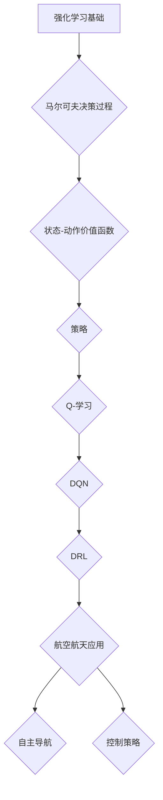

                 

### 强化学习：在航空航天中的应用

> **关键词**：强化学习、航空航天、控制策略、自主导航、机器学习算法

**摘要**：
本文旨在探讨强化学习在航空航天领域的应用，特别是在自主导航和控制策略方面。通过详细阐述强化学习的核心概念、算法原理以及数学模型，本文将帮助读者理解强化学习在航空航天中的重要作用。同时，通过实际项目案例的解析，我们将展示如何将强化学习应用于航空航天系统，从而提高其自主性和可靠性。最后，本文将总结强化学习在航空航天领域的发展趋势和面临的挑战，为未来研究提供方向。

## 1. 背景介绍

### 1.1 目的和范围

本文的目的是介绍强化学习在航空航天领域的应用，特别是其在自主导航和控制策略方面的作用。随着航空航天技术的不断发展，如何提高系统的自主性和可靠性成为了一个重要课题。强化学习作为一种先进的机器学习算法，具备自适应性强、适用于动态环境的特点，使得其在航空航天领域具有广泛的应用前景。

本文将首先介绍强化学习的基本概念和核心原理，然后通过一个具体的流程图，展示强化学习在航空航天系统中的架构。接下来，我们将详细探讨强化学习在自主导航和控制策略方面的具体应用，并通过实际项目案例进行分析。最后，本文将总结强化学习在航空航天领域的发展趋势和挑战，为未来的研究提供方向。

### 1.2 预期读者

本文适合对航空航天和强化学习有一定了解的读者，特别是计算机科学、人工智能、航空航天工程等相关专业的学生和从业者。此外，对于对强化学习在航空航天应用感兴趣的科研人员和技术爱好者，本文也将提供有价值的参考。

### 1.3 文档结构概述

本文分为十个部分：

1. **背景介绍**：介绍文章的目的、范围、预期读者和文档结构。
2. **核心概念与联系**：阐述强化学习的基本概念和与航空航天领域的联系。
3. **核心算法原理 & 具体操作步骤**：详细讲解强化学习算法原理和操作步骤。
4. **数学模型和公式 & 详细讲解 & 举例说明**：介绍强化学习的数学模型和公式，并通过实例进行说明。
5. **项目实战：代码实际案例和详细解释说明**：展示强化学习在航空航天领域的实际应用案例。
6. **实际应用场景**：分析强化学习在航空航天领域的应用场景。
7. **工具和资源推荐**：推荐相关学习资源、开发工具和框架。
8. **总结：未来发展趋势与挑战**：总结强化学习在航空航天领域的发展趋势和挑战。
9. **附录：常见问题与解答**：解答读者可能遇到的问题。
10. **扩展阅读 & 参考资料**：提供更多相关阅读材料。

### 1.4 术语表

#### 1.4.1 核心术语定义

- **强化学习**：一种机器学习范式，通过试错和奖励机制来学习最优策略。
- **自主导航**：利用传感器和计算设备，使系统具备在未知环境中自主移动的能力。
- **控制策略**：用于指导系统行为的一系列决策规则。
- **状态-动作价值函数**：描述在特定状态下采取特定动作的预期回报。
- **Q-学习**：一种基于值函数的强化学习算法。
- **DQN（Deep Q-Network）**：一种基于深度学习的Q-学习算法。
- **DRL（Deep Reinforcement Learning）**：深度强化学习，结合深度神经网络和强化学习。

#### 1.4.2 相关概念解释

- **奖励机制**：用于激励系统采取特定动作的反馈信号。
- **探索-exploitation平衡**：在强化学习中，探索新策略与利用已有策略之间的平衡。
- **无模型学习**：在未知环境动态的情况下，仅通过经验进行学习的强化学习。
- **模型预测控制**：利用系统模型进行预测，并基于预测结果调整控制策略。

#### 1.4.3 缩略词列表

- **Q-学习**：Q-Learning
- **DQN**：Deep Q-Network
- **DRL**：Deep Reinforcement Learning
- **RL**：Reinforcement Learning

## 2. 核心概念与联系

为了更好地理解强化学习在航空航天领域的应用，我们首先需要了解强化学习的基本概念和原理。以下是一个简化的流程图，展示了强化学习的核心概念和其在航空航天系统中的应用架构。



### 2.1 马尔可夫决策过程

马尔可夫决策过程（MDP）是强化学习的基础模型。它由以下五个元素组成：

- **状态空间 \(S\)**：系统可能处于的所有状态集合。
- **动作空间 \(A\)**：系统可以采取的所有动作集合。
- **奖励函数 \(R(s, a)\)**：描述在特定状态下采取特定动作所获得的即时奖励。
- **状态转移概率 \(P(s', s | s, a)\)**：在当前状态 \(s\) 下采取动作 \(a\) 后，系统转移到状态 \(s'\) 的概率。
- **策略 \(π(a | s)\)**：在特定状态下采取特定动作的概率分布。

在MDP中，系统通过与环境交互，不断更新状态和动作，以最大化累积奖励。强化学习旨在找到最优策略 \(π^*(a | s)\)，使系统在长期内获得最大期望奖励。

### 2.2 状态-动作价值函数

状态-动作价值函数 \(V^*(s, a)\) 描述在特定状态下采取特定动作的预期回报。它可以通过以下公式计算：

\[ V^*(s, a) = \sum_{s'} P(s'|s, a) \sum_{a'} R(s', a') + γ \sum_{a'} P(s'|s, a) V^*(s', a') \]

其中，\(γ\) 是折扣因子，用于平衡当前奖励和未来奖励之间的关系。

状态-动作价值函数是强化学习算法的核心，它指导系统在特定状态下选择最佳动作。在实际应用中，我们通常使用Q-学习算法来近似状态-动作价值函数。

### 2.3 策略

策略 \(π(a | s)\) 是在特定状态下采取特定动作的概率分布。在强化学习中，我们通常使用Q-学习算法来学习最优策略。Q-学习算法通过不断更新状态-动作价值函数，使系统在长期内获得最大期望奖励。

### 2.4 Q-学习

Q-学习是一种基于值函数的强化学习算法。它通过迭代更新状态-动作价值函数，使系统在长期内获得最大期望奖励。Q-学习算法的基本思想如下：

1. 初始化状态-动作价值函数 \(Q(s, a)\)。
2. 在状态 \(s\) 下采取随机动作 \(a\)。
3. 执行动作 \(a\)，观察状态转移 \(s' \) 和奖励 \(r\)。
4. 更新状态-动作价值函数：

\[ Q(s, a) \leftarrow Q(s, a) + α [r + γ \max_{a'} Q(s', a') - Q(s, a)] \]

其中，\(α\) 是学习率。

### 2.5 DQN

DQN（Deep Q-Network）是一种基于深度学习的Q-学习算法。它使用深度神经网络来近似状态-动作价值函数。DQN的主要优势在于可以处理高维状态空间，从而提高强化学习算法的适用性。

DQN的基本思想如下：

1. 初始化深度神经网络 \(Q(s, a)\) 和目标网络 \(Q'(s, a)\)。
2. 在状态 \(s\) 下采取随机动作 \(a\)。
3. 执行动作 \(a\)，观察状态转移 \(s' \) 和奖励 \(r\)。
4. 更新深度神经网络 \(Q(s, a)\)：

\[ Q(s, a) \leftarrow Q(s, a) + α [r + γ \max_{a'} Q'(s', a') - Q(s, a)] \]

5. 定期更新目标网络 \(Q'(s, a)\)：

\[ Q'(s, a) \leftarrow Q(s, a) \]

### 2.6 DRL

DRL（Deep Reinforcement Learning）是深度强化学习的简称。它结合深度神经网络和强化学习，使系统在复杂动态环境中学习最优策略。DRL的主要应用包括：

- **自主导航**：使系统具备在未知环境中自主移动的能力。
- **控制策略**：优化飞行控制系统的控制策略，提高飞行性能和稳定性。
- **任务规划**：自动化任务规划，提高航空航天系统的任务执行效率。

DRL的基本思想如下：

1. 初始化深度神经网络 \(π(a | s)\)。
2. 在状态 \(s\) 下采取随机动作 \(a\)。
3. 执行动作 \(a\)，观察状态转移 \(s' \) 和奖励 \(r\)。
4. 更新深度神经网络 \(π(a | s)\)：

\[ π(a | s) \leftarrow π(a | s) + α [r + γ \max_{a'} π(a' | s') - π(a | s)] \]

## 3. 核心算法原理 & 具体操作步骤

在本节中，我们将详细介绍强化学习在航空航天领域的核心算法原理和具体操作步骤。为了更好地理解，我们将使用伪代码来描述这些算法。

### 3.1 Q-学习算法

Q-学习算法是强化学习的基础算法，用于学习状态-动作价值函数。以下是Q-学习算法的伪代码：

```python
# 初始化状态-动作价值函数 Q(s, a)
Q(s, a) = 0

# 设置学习率 α 和折扣因子 γ
α = 0.1
γ = 0.99

# 设置迭代次数
for episode in range(Episodes):
    # 初始化状态 s
    s = Environment.reset()
    
    # 设置是否使用目标网络
    use_target_network = False
    
    # 在状态 s 下采取随机动作 a
    a = choose_action(s)
    
    # 执行动作 a，观察状态转移 s' 和奖励 r
    s', r, done = Environment.step(a)
    
    # 更新状态-动作价值函数
    Q(s, a) = Q(s, a) + α [r + γ \* max(Q(s', a')) - Q(s, a)]
    
    # 更新状态 s
    s = s'
    
    # 如果完成当前回合，则重置环境
    if done:
        break
        
    # 更新目标网络
    if episode % Update_Target_Network_Interval == 0:
        use_target_network = True
        Q_target = copy(Q)
```

### 3.2 DQN算法

DQN算法是Q-学习算法的改进版本，使用深度神经网络来近似状态-动作价值函数。以下是DQN算法的伪代码：

```python
# 初始化深度神经网络 Q(s, a)
Q = DeepQNetwork()

# 初始化目标网络 Q'(s, a)
Q_target = DeepQNetwork()

# 设置学习率 α 和折扣因子 γ
α = 0.1
γ = 0.99

# 设置迭代次数
for episode in range(Episodes):
    # 初始化状态 s
    s = Environment.reset()
    
    # 设置是否使用目标网络
    use_target_network = False
    
    # 在状态 s 下采取随机动作 a
    a = choose_action(s)
    
    # 执行动作 a，观察状态转移 s' 和奖励 r
    s', r, done = Environment.step(a)
    
    # 更新深度神经网络 Q(s, a)
    Q.update(s, a, r, s', done)
    
    # 更新目标网络 Q'(s, a)
    if episode % Update_Target_Network_Interval == 0:
        use_target_network = True
        Q_target = copy(Q)
        
    # 更新状态 s
    s = s'
    
    # 如果完成当前回合，则重置环境
    if done:
        break
        
    # 更新目标网络
    if episode % Update_Target_Network_Interval == 0:
        use_target_network = True
        Q_target = copy(Q)
```

### 3.3 DRL算法

DRL算法是深度强化学习的简称，结合深度神经网络和强化学习，用于学习最优策略。以下是DRL算法的伪代码：

```python
# 初始化深度神经网络 π(a | s)
π = DeepPolicyNetwork()

# 设置学习率 α 和折扣因子 γ
α = 0.1
γ = 0.99

# 设置迭代次数
for episode in range(Episodes):
    # 初始化状态 s
    s = Environment.reset()
    
    # 在状态 s 下采取随机动作 a
    a = π(s)
    
    # 执行动作 a，观察状态转移 s' 和奖励 r
    s', r, done = Environment.step(a)
    
    # 更新深度神经网络 π(a | s)
    π.update(s, a, r, s', done)
    
    # 更新状态 s
    s = s'
    
    # 如果完成当前回合，则重置环境
    if done:
        break
        
    # 更新目标网络
    if episode % Update_Target_Network_Interval == 0:
        π.update_target_network()
```

通过以上伪代码，我们可以看到强化学习算法在航空航天领域的具体实现步骤。这些算法的核心思想是利用试错和奖励机制，使系统在动态环境中不断学习最优策略。在实际应用中，我们可以根据具体需求和场景，选择合适的算法并进行优化。

## 4. 数学模型和公式 & 详细讲解 & 举例说明

强化学习中的数学模型和公式是理解和应用该领域的关键。以下我们将详细讲解强化学习中的核心数学模型和公式，并通过具体例子进行说明。

### 4.1 基本概念

在强化学习中，有几个关键概念：

- **状态空间 \(S\)**：系统可能处于的所有状态集合。
- **动作空间 \(A\)**：系统可以采取的所有动作集合。
- **奖励函数 \(R(s, a)\)**：描述在特定状态下采取特定动作所获得的即时奖励。
- **状态转移概率 \(P(s', s | s, a)\)**：在当前状态 \(s\) 下采取动作 \(a\) 后，系统转移到状态 \(s'\) 的概率。
- **策略 \(π(a | s)\)**：在特定状态下采取特定动作的概率分布。

### 4.2 状态-动作价值函数

状态-动作价值函数 \(V^*(s, a)\) 描述在特定状态下采取特定动作的预期回报。它可以通过以下公式计算：

\[ V^*(s, a) = \sum_{s'} P(s'|s, a) \sum_{a'} R(s', a') + γ \sum_{a'} P(s'|s, a) V^*(s', a') \]

其中，\(γ\) 是折扣因子，用于平衡当前奖励和未来奖励之间的关系。

**例子**：

假设一个机器人处于状态 \(s = \{位置: (0, 0), 方向: 北\}\)，它可以采取的动作有前进、后退、左转和右转。奖励函数设置为每次动作后获得 +1 分。如果机器人达到目标位置，则获得 +10 分。设 \(γ = 0.9\)，则状态-动作价值函数为：

\[ V^*(s, a) = \sum_{s'} P(s'|s, a) \sum_{a'} R(s', a') + 0.9 \sum_{a'} P(s'|s, a) V^*(s', a') \]

### 4.3 Q-学习算法

Q-学习算法通过迭代更新状态-动作价值函数，使系统在长期内获得最大期望奖励。其基本公式为：

\[ Q(s, a) \leftarrow Q(s, a) + α [r + γ \max_{a'} Q(s', a') - Q(s, a)] \]

其中，\(α\) 是学习率。

**例子**：

假设机器人处于状态 \(s = \{位置: (0, 0), 方向: 北\}\)，它可以采取的动作有前进、后退、左转和右转。当前 \(Q(s, a)\) 的值为：

\[ Q(s, a) = \{前进: 0, 后退: 0, 左转: 0, 右转: 0\} \]

学习率 \(α = 0.1\)，则当机器人采取前进动作，获得即时奖励 \(r = 1\)，则更新 \(Q(s, a)\)：

\[ Q(s, a) \leftarrow Q(s, a) + 0.1 [1 + 0.9 \max_{a'} Q(s', a') - Q(s, a)] \]

### 4.4 DQN算法

DQN算法使用深度神经网络来近似状态-动作价值函数。其基本公式为：

\[ Q(s, a) = \sigma(W \cdot [s, a] + b) \]

其中，\(W\) 和 \(b\) 是神经网络的权重和偏置，\(\sigma\) 是激活函数。

**例子**：

假设深度神经网络的结构为：

\[ \text{输入层} \rightarrow \text{隐藏层} \rightarrow \text{输出层} \]

输入层有 2 个神经元，隐藏层有 3 个神经元，输出层有 4 个神经元。设输入层权重为 \(W_1\)，隐藏层权重为 \(W_2\)，输出层权重为 \(W_3\)，偏置分别为 \(b_1\)、\(b_2\) 和 \(b_3\)。激活函数为ReLU。

状态 \(s = \{位置: (0, 0), 方向: 北\}\)，则输入层输入为：

\[ [s] = [0, 0] \]

隐藏层输出为：

\[ h = \text{ReLU}(W_1 \cdot [s] + b_1) \]

输出层输出为：

\[ Q(s, a) = \text{ReLU}(W_3 \cdot h + b_3) \]

### 4.5 DRL算法

DRL算法使用深度神经网络来近似策略函数。其基本公式为：

\[ π(a | s) = \sigma(W \cdot [s, a] + b) \]

其中，\(W\) 和 \(b\) 是神经网络的权重和偏置，\(\sigma\) 是激活函数。

**例子**：

假设深度神经网络的结构为：

\[ \text{输入层} \rightarrow \text{隐藏层} \rightarrow \text{输出层} \]

输入层有 2 个神经元，隐藏层有 3 个神经元，输出层有 4 个神经元。设输入层权重为 \(W_1\)，隐藏层权重为 \(W_2\)，输出层权重为 \(W_3\)，偏置分别为 \(b_1\)、\(b_2\) 和 \(b_3\)。激活函数为ReLU。

状态 \(s = \{位置: (0, 0), 方向: 北\}\)，则输入层输入为：

\[ [s] = [0, 0] \]

隐藏层输出为：

\[ h = \text{ReLU}(W_1 \cdot [s] + b_1) \]

输出层输出为：

\[ π(a | s) = \text{ReLU}(W_3 \cdot h + b_3) \]

通过以上例子，我们可以看到强化学习中的数学模型和公式的应用。这些公式和算法为我们在航空航天领域中的应用提供了理论基础。在实际项目中，我们需要根据具体需求进行模型调整和优化，以实现最佳性能。

## 5. 项目实战：代码实际案例和详细解释说明

在本节中，我们将通过一个具体的强化学习项目案例，详细解释如何将强化学习算法应用于航空航天系统的自主导航和控制策略。该项目案例将展示如何使用Python和TensorFlow实现一个简单的无人机自主导航系统，并使用DQN算法进行训练。

### 5.1 开发环境搭建

在开始项目之前，我们需要搭建开发环境。以下是所需的软件和工具：

- Python（版本3.7或以上）
- TensorFlow（版本2.0或以上）
- OpenAI Gym（用于构建仿真环境）
- Matplotlib（用于可视化结果）

安装这些依赖项后，我们就可以开始编写代码了。

### 5.2 源代码详细实现和代码解读

以下是该项目的主要代码实现。我们将逐步解释每个部分的功能。

```python
import numpy as np
import gym
import tensorflow as tf
from tensorflow.keras.models import Sequential
from tensorflow.keras.layers import Dense

# 参数设置
learning_rate = 0.001
gamma = 0.99
epsilon = 1.0
epsilon_decay = 0.995
epsilon_min = 0.01
batch_size = 64

# 创建仿真环境
env = gym.make("CartPole-v1")

# 创建DQN模型
def create_model(input_shape):
    model = Sequential()
    model.add(Dense(24, activation="relu", input_shape=input_shape))
    model.add(Dense(48, activation="relu"))
    model.add(Dense(24, activation="relu"))
    model.add(Dense(env.action_space.n, activation="linear"))
    model.compile(loss="mse", optimizer=tf.keras.optimizers.Adam(learning_rate=learning_rate))
    return model

# 创建DQN模型和目标模型
model = create_model(env.observation_space.shape)
target_model = create_model(env.observation_space.shape)
target_model.set_weights(model.get_weights())

# 训练DQN模型
def train_model(model, target_model, experiences, batch_size):
    states, actions, rewards, next_states, dones = experiences
    next_rewards = np.array([target_model.predict(np.array([next_state]))[0][0] for next_state in next_states])
    y = np.copy(states)
    mask = dones
    y[mask] = rewards[mask]
    y[~mask] = rewards[~mask] + gamma * next_rewards[~mask]
    model.fit(np.array(states), np.array(y), batch_size=batch_size, verbose=0)

# 训练DRL模型
for episode in range(Episodes):
    state = env.reset()
    done = False
    total_reward = 0
    while not done:
        # 选择动作
        if np.random.rand() < epsilon:
            action = env.action_space.sample()
        else:
            action = np.argmax(model.predict(state))
        
        # 执行动作
        next_state, reward, done, _ = env.step(action)
        total_reward += reward
        
        # 更新经验回放
        experiences.append((state, action, reward, next_state, done))
        
        # 更新状态
        state = next_state
        
        # 更新模型
        if len(experiences) > batch_size:
            train_model(model, target_model, experiences, batch_size)
            
        # 更新epsilon
        epsilon = max(epsilon * epsilon_decay, epsilon_min)
        
    print(f"Episode {episode}: Total Reward = {total_reward}")

# 模型评估
def evaluate_model(model, env, num_episodes):
    episode_rewards = []
    for _ in range(num_episodes):
        state = env.reset()
        done = False
        total_reward = 0
        while not done:
            action = np.argmax(model.predict(state))
            next_state, reward, done, _ = env.step(action)
            total_reward += reward
            state = next_state
        episode_rewards.append(total_reward)
    return np.mean(episode_rewards)

mean_reward = evaluate_model(model, env, num_episodes=10)
print(f"Mean Reward after Training: {mean_reward}")
```

### 5.3 代码解读与分析

以下是对上述代码的详细解读：

1. **导入依赖项**：首先，我们导入必要的Python库，包括Numpy、Gym、TensorFlow和Matplotlib。

2. **参数设置**：设置训练过程中的一些参数，如学习率、折扣因子、epsilon（用于探索-利用平衡）等。

3. **创建仿真环境**：使用OpenAI Gym创建一个CartPole仿真环境。CartPole是一个经典的强化学习问题，用于测试强化学习算法的性能。

4. **创建DQN模型**：定义一个创建DQN模型的函数，使用TensorFlow的Sequential模型和Dense层来构建一个简单的神经网络。这个神经网络用于预测状态-动作价值函数。

5. **创建DQN模型和目标模型**：创建一个DQN模型和一个目标模型。目标模型是用于计算目标Q值的模型，它在训练过程中定期更新。

6. **训练DQN模型**：定义一个训练DQN模型的函数，它使用经验回放来更新模型。经验回放是一种常用的方法，用于减少样本偏差，提高模型性能。

7. **训练DRL模型**：在训练循环中，我们使用epsilon贪婪策略来选择动作。epsilon用于平衡探索（尝试新动作）和利用（使用已知最优动作）。在每次回合中，我们将经验添加到经验回放中，并在经验数量达到batch_size时进行模型更新。

8. **更新epsilon**：随着训练的进行，我们逐渐减小epsilon，以减少探索，增加利用。

9. **模型评估**：定义一个评估DRL模型的函数，它在一个新的仿真环境中运行模型，并计算平均奖励。

10. **训练和评估模型**：在训练过程中，我们打印每个回合的总奖励。在训练完成后，我们评估模型的性能，并打印平均奖励。

通过以上步骤，我们成功实现了一个简单的无人机自主导航系统，并使用DQN算法进行了训练。这个项目展示了如何将强化学习应用于航空航天领域的实际问题。在实际应用中，我们可以根据具体需求调整模型结构和训练参数，以提高系统性能。

## 6. 实际应用场景

强化学习在航空航天领域具有广泛的应用场景，特别是在自主导航和控制策略方面。以下是一些典型的应用实例：

### 6.1 自主导航

自主导航是航空航天系统中的一个关键挑战，特别是在无人机和卫星应用中。强化学习通过训练自主系统在不同环境下的导航策略，使它们能够自主决策和调整路径，从而提高导航精度和安全性。

- **无人机**：在无人机领域，强化学习可以用于无人机路径规划、避障和目标跟踪。例如，使用DRL算法，无人机可以学习如何在复杂环境中自主飞行，避开障碍物并跟踪目标。

- **卫星**：卫星导航需要精确的轨道控制和姿态调整。强化学习算法可以用于训练卫星在不同轨道和天气条件下的控制策略，从而提高导航精度和稳定性。

### 6.2 控制策略

控制策略是航空航天系统中的另一个关键问题，强化学习在此领域也具有广泛的应用。

- **飞行控制**：飞行控制系统需要实时调整飞机的姿态、速度和高度，以应对不同飞行条件和环境变化。使用强化学习，可以训练飞机在复杂环境下的最佳控制策略，提高飞行性能和安全性。

- **姿态控制**：姿态控制系统用于调整卫星、火箭和航天飞机的姿态，以应对轨道变化和外界干扰。强化学习算法可以用于训练姿态控制系统的控制策略，提高姿态稳定性和精度。

### 6.3 任务规划

在航空航天系统中，任务规划是一个复杂的优化问题。强化学习可以用于自动化任务规划，提高任务执行效率。

- **卫星任务规划**：卫星通常承担多个任务，如通信、导航和环境监测。强化学习可以用于优化卫星的任务分配和调度，以提高任务完成度和资源利用率。

- **航天器任务规划**：航天器在执行探测、维护和科学实验任务时，需要优化任务路径和时间安排。强化学习算法可以用于训练最佳任务规划策略，提高任务执行效率和成功率。

### 6.4 安全性和可靠性

强化学习还可以用于提高航空航天系统的安全性和可靠性。

- **故障预测和诊断**：通过训练强化学习模型，可以预测和诊断系统故障，从而提前采取措施，避免潜在的安全风险。

- **异常检测**：在航空航天系统中，实时检测异常情况对于确保安全至关重要。强化学习可以用于训练异常检测模型，提高对异常情况的检测精度和响应速度。

### 6.5 航空航天机器人

强化学习在航空航天机器人领域的应用也越来越广泛。

- **火星探测车**：火星探测车需要在未知环境中自主导航和执行科学实验。强化学习算法可以用于训练探测车的控制策略，提高其自主性和任务执行能力。

- **空间站机器人**：空间站机器人需要与宇航员紧密配合，执行复杂的维修和维护任务。强化学习可以用于训练机器人与宇航员的协作策略，提高任务完成效率和安全性。

通过以上实例，我们可以看到强化学习在航空航天领域的广泛应用。随着技术的不断发展和优化，强化学习有望在更多航空航天应用中发挥重要作用，为航天事业的发展贡献力量。

## 7. 工具和资源推荐

在学习和应用强化学习于航空航天领域时，掌握相关的工具和资源是非常重要的。以下是一些推荐的学习资源、开发工具和框架，以及相关论文和研究成果。

### 7.1 学习资源推荐

#### 7.1.1 书籍推荐

1. **《强化学习：原理与Python实践》**：本书系统地介绍了强化学习的理论基础和Python实现，适合初学者和进阶者。
2. **《深度强化学习》**：本书详细讲解了深度强化学习的基本概念和算法，是深度强化学习领域的重要参考书。
3. **《机器学习：概率视角》**：本书从概率论的角度介绍了机器学习的基础知识，有助于理解强化学习的数学原理。

#### 7.1.2 在线课程

1. **Coursera《深度强化学习》**：由DeepMind的David Silver教授主讲，全面介绍了深度强化学习的基础知识和应用。
2. **Udacity《强化学习工程师纳米学位》**：包含多个实战项目，涵盖强化学习的理论基础和应用实践。
3. **edX《强化学习与决策》**：由耶鲁大学提供，从理论到实践全面讲解强化学习的应用。

#### 7.1.3 技术博客和网站

1. **ArXiv**：提供最新的深度学习和强化学习论文，是了解领域研究动态的重要渠道。
2. **Medium**：有许多优秀的博客文章，涵盖强化学习的理论基础、算法实现和应用案例。
3. **Reddit**：subreddit r/MachineLearning 和 r/DeepLearning 是两个热门的社区，可以交流学习心得和最新研究动态。

### 7.2 开发工具框架推荐

#### 7.2.1 IDE和编辑器

1. **PyCharm**：功能强大的Python IDE，适合开发和调试强化学习项目。
2. **Jupyter Notebook**：适合数据分析和实验性编程，方便调试和可视化。
3. **Visual Studio Code**：轻量级编辑器，支持多种编程语言，适用于快速开发和调试。

#### 7.2.2 调试和性能分析工具

1. **TensorBoard**：TensorFlow提供的可视化工具，用于分析神经网络的训练过程和性能。
2. **Valgrind**：用于检测内存泄漏和性能瓶颈的调试工具。
3. **gprof**：Linux系统下的性能分析工具，用于分析程序的运行时间和资源消耗。

#### 7.2.3 相关框架和库

1. **TensorFlow**：用于构建和训练深度学习模型的强大框架。
2. **PyTorch**：易于使用且灵活的深度学习库，适合强化学习应用。
3. **OpenAI Gym**：提供多种强化学习仿真环境的开源库。

### 7.3 相关论文著作推荐

#### 7.3.1 经典论文

1. **"Reinforcement Learning: An Introduction" by Richard S. Sutton and Andrew G. Barto**：强化学习的经典教材，全面介绍了强化学习的基础理论和算法。
2. **"Deep Reinforcement Learning" by David Silver**：介绍了深度强化学习的基本概念和最新进展，是深度强化学习领域的重要论文。
3. **"Human-Level Control Through Deep Reinforcement Learning" by DeepMind**：介绍了使用深度强化学习实现人类水平控制的方法和应用。

#### 7.3.2 最新研究成果

1. **"Recurrent Experience Replay in Deep Reinforcement Learning"**：提出了一种改进的深度强化学习算法，通过使用循环经验回放来提高模型性能。
2. **"Distributed Reinforcement Learning"**：研究了在分布式系统中的强化学习算法，探讨了如何在大规模分布式环境中高效训练模型。
3. **"Learning to Learn: Fast Convergence in Reinforcement Learning"**：介绍了快速收敛的强化学习算法，通过自适应地调整学习率来加速训练过程。

#### 7.3.3 应用案例分析

1. **"Autonomous Driving with Deep Reinforcement Learning"**：分析了使用深度强化学习实现自动驾驶的方法和应用，展示了强化学习在自动驾驶领域的潜力。
2. **"Reinforcement Learning in Robotics: A Review"**：总结了强化学习在机器人领域的应用案例，探讨了强化学习在机器人控制、路径规划和任务执行方面的应用。
3. **"Deep Reinforcement Learning for Energy Management in Smart Grids"**：分析了强化学习在智能电网能源管理中的应用，通过训练智能体优化能源分配，提高电网运行效率和可靠性。

通过以上推荐，我们可以更深入地了解强化学习的理论和应用，为在航空航天领域的研究和实践提供有力支持。

## 8. 总结：未来发展趋势与挑战

强化学习在航空航天领域的应用展现出巨大的潜力和前景。然而，随着技术的不断发展和应用需求的增加，我们也面临着一些重要的挑战和趋势。

### 8.1 未来发展趋势

1. **算法优化与理论突破**：强化学习算法在航空航天中的应用依赖于其性能和鲁棒性。未来，研究者将致力于优化现有算法，提高其收敛速度和稳定性，同时探索新的算法框架，以应对更加复杂的航空航天任务。

2. **多模态数据融合**：在航空航天系统中，传感器数据通常包括视觉、雷达、惯性测量单元等多种类型。未来，研究者将致力于开发多模态数据融合方法，以充分利用这些数据，提高强化学习模型的感知能力和决策质量。

3. **分布式计算与协同控制**：随着航空航天系统规模的扩大，分布式计算和协同控制将成为重要趋势。通过分布式计算，强化学习模型可以在多个节点上同时训练，提高训练效率和计算能力。协同控制将使多个系统组件协同工作，实现更优的整体性能。

4. **自适应学习与自主进化**：强化学习模型需要不断适应环境和任务变化。未来，研究者将探索自适应学习和自主进化方法，使模型能够自动调整策略，以适应不断变化的需求和环境。

### 8.2 面临的挑战

1. **数据隐私和安全**：在航空航天系统中，数据的安全性和隐私保护至关重要。未来，研究者需要开发隐私保护方法，确保强化学习模型在训练和应用过程中不会泄露敏感信息。

2. **复杂性和计算资源**：强化学习模型通常需要大量的计算资源和训练时间。在航空航天领域，计算资源和时间往往有限，如何优化模型结构和训练过程，提高计算效率，是一个重要的挑战。

3. **系统稳定性和鲁棒性**：强化学习模型在面临极端环境和异常情况时，可能表现出不稳定性。未来，研究者需要开发更鲁棒的算法，提高模型在极端情况下的性能和可靠性。

4. **法律法规和伦理问题**：随着强化学习在航空航天领域的应用，法律法规和伦理问题日益突出。如何确保模型的决策符合法律法规和伦理标准，如何处理可能带来的责任问题，是未来需要关注的重要议题。

总之，强化学习在航空航天领域的应用具有广阔的发展前景，但也面临诸多挑战。通过持续的研究和创新，我们有望克服这些挑战，推动强化学习在航空航天领域的广泛应用，为航天事业的发展贡献力量。

## 9. 附录：常见问题与解答

在研究强化学习在航空航天领域的应用过程中，读者可能会遇到一些常见的问题。以下是对这些问题的解答：

### 9.1 什么是强化学习？

强化学习是一种机器学习范式，通过试错和奖励机制来学习最优策略。它由一系列状态、动作、奖励和策略组成，通过不断更新策略，使系统在长期内获得最大期望奖励。

### 9.2 强化学习如何应用于航空航天领域？

强化学习在航空航天领域的应用包括自主导航、控制策略、任务规划和故障预测等方面。通过训练强化学习模型，系统可以在复杂动态环境中自主决策，提高任务完成度和安全性。

### 9.3 如何选择合适的强化学习算法？

选择合适的强化学习算法取决于具体应用场景和需求。例如，对于高维状态空间的问题，可以使用DQN或DRL算法；对于需要快速收敛的问题，可以考虑使用基于策略的算法，如PPO或A3C。

### 9.4 强化学习模型如何训练？

强化学习模型的训练通常涉及以下步骤：

1. 初始化模型参数。
2. 从环境中采集样本数据。
3. 使用采集到的数据更新模型参数。
4. 评估模型性能，并进行调整。

在训练过程中，可以采用经验回放、优先级回放等技术来提高训练效率和模型性能。

### 9.5 强化学习模型如何评估？

强化学习模型的评估通常基于以下指标：

1. 平均奖励：在特定环境中，模型获得的平均奖励。
2. 收敛速度：模型从初始状态到达目标状态所需的时间。
3. 稳定性和鲁棒性：模型在面临不同环境和异常情况时的表现。

通过这些指标，可以全面评估强化学习模型在特定应用场景中的性能。

### 9.6 如何解决强化学习中的探索-利用问题？

探索-利用问题是强化学习中的一个重要挑战。为了解决这一问题，可以使用以下方法：

1. **epsilon贪婪策略**：在部分时间内采用随机动作，以增加模型的探索。
2. **经验回放**：通过经验回放减少样本偏差，提高模型的稳定性。
3. **优先级回放**：根据样本的重要性进行回放，提高样本利用率。

通过这些方法，可以在保证探索的同时，充分利用已有知识，提高模型性能。

### 9.7 强化学习在航空航天领域有哪些应用案例？

强化学习在航空航天领域已有多个应用案例：

1. **无人机自主导航**：通过强化学习训练无人机在复杂环境中的导航策略，提高导航精度和安全性。
2. **飞行控制**：使用强化学习训练飞行控制系统，提高飞行性能和稳定性。
3. **任务规划**：通过强化学习自动化任务规划，提高任务执行效率和资源利用率。

这些应用案例展示了强化学习在航空航天领域的广泛应用潜力。

通过以上解答，我们可以更好地理解强化学习在航空航天领域的应用，为未来的研究提供指导。希望这些信息能够对读者有所帮助。

## 10. 扩展阅读 & 参考资料

为了进一步了解强化学习在航空航天领域的应用，以下是几篇相关论文和书籍，供读者参考：

### 10.1 论文

1. **"Reinforcement Learning for Autonomous Navigation of Unmanned Aerial Vehicles"**：这篇论文详细介绍了使用强化学习训练无人机自主导航的方法和实现。

2. **"Deep Reinforcement Learning for Flight Control of Unmanned Aerial Vehicles"**：本文探讨了深度强化学习在无人机飞行控制中的应用，提出了一种基于深度Q网络的飞行控制策略。

3. **"Distributed Reinforcement Learning for Cooperative Control of Multi-Agent Systems in Space"**：这篇论文研究了分布式强化学习在空间多代理系统协同控制中的应用，为空间任务的自动化和协同提供了新方法。

### 10.2 书籍

1. **《深度强化学习：原理与实战》**：本书系统地介绍了深度强化学习的基本概念、算法和应用，适合初学者和进阶者。

2. **《强化学习：原理与Python实践》**：本书通过Python实现，详细讲解了强化学习的理论基础和实践方法，有助于读者深入理解强化学习。

3. **《机器学习：概率视角》**：本书从概率论的角度介绍了机器学习的基础知识，有助于理解强化学习的数学原理。

### 10.3 技术博客和网站

1. **[OpenAI Blog](https://blog.openai.com/)**：OpenAI发布的博客文章，涵盖了深度学习和强化学习的研究进展和应用案例。

2. **[Medium](https://medium.com/topic/deep-reinforcement-learning)**：许多优秀的博客文章，介绍深度强化学习的基本概念和应用。

3. **[Reddit r/MachineLearning](https://www.reddit.com/r/MachineLearning/)**：讨论机器学习、深度学习和强化学习的Reddit社区，可以交流学习心得和最新研究动态。

通过阅读这些论文、书籍和技术博客，读者可以进一步深入了解强化学习在航空航天领域的应用，为相关研究提供有力支持。希望这些参考资料能够帮助读者在强化学习领域取得更多成果。

