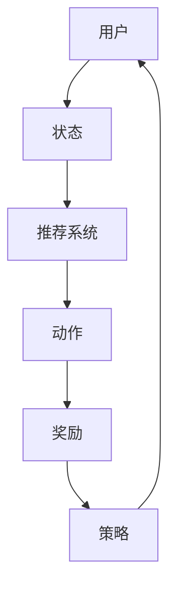

                 


# 强化学习：在色彩推荐中的应用

> 关键词：强化学习、色彩推荐、深度强化学习、Q-Learning、色彩心理学、用户行为分析
>
> 摘要：本文将深入探讨强化学习在色彩推荐领域的应用，从强化学习的基础概念、色彩推荐的重要性出发，逐步讲解Q-Learning算法的核心原理和实际操作步骤，并通过一个真实案例展示其在色彩推荐系统中的具体实现。最后，本文将总结强化学习在色彩推荐领域的发展趋势和面临的挑战。

## 1. 背景介绍

### 1.1 目的和范围

本文旨在介绍和解析强化学习在色彩推荐领域的应用。通过强化学习算法，我们可以实现更加智能和个性化的色彩推荐，从而提高用户体验和满意度。本文将涵盖以下几个方面：

- 强化学习的基础概念和原理
- 色彩推荐的重要性及其挑战
- Q-Learning算法在色彩推荐中的具体应用
- 真实案例展示和项目实战

### 1.2 预期读者

本文面向对强化学习和色彩推荐有基本了解的技术爱好者、算法工程师和研究人员。读者应具备一定的编程基础，了解Python等编程语言，以及常见的机器学习算法。

### 1.3 文档结构概述

本文将按照以下结构展开：

1. 背景介绍：介绍文章的目的、范围和结构。
2. 核心概念与联系：讲解强化学习和色彩推荐的基本概念和联系。
3. 核心算法原理 & 具体操作步骤：深入讲解Q-Learning算法的核心原理和具体操作步骤。
4. 数学模型和公式 & 详细讲解 & 举例说明：介绍Q-Learning算法的数学模型和公式，并通过实例进行说明。
5. 项目实战：代码实际案例和详细解释说明。
6. 实际应用场景：分析强化学习在色彩推荐领域的实际应用场景。
7. 工具和资源推荐：推荐学习资源和开发工具。
8. 总结：未来发展趋势与挑战。
9. 附录：常见问题与解答。
10. 扩展阅读 & 参考资料：提供相关拓展资料。

### 1.4 术语表

#### 1.4.1 核心术语定义

- 强化学习（Reinforcement Learning）：一种机器学习方法，通过试错和反馈来学习最优策略。
- 色彩推荐（Color Recommendation）：根据用户偏好和历史行为，为用户提供合适的色彩建议。
- Q-Learning：一种基于值函数的强化学习算法，通过迭代更新策略值来优化决策。
- 色彩心理学（Color Psychology）：研究色彩对人类心理和行为影响的一门学科。

#### 1.4.2 相关概念解释

- 奖励（Reward）：在强化学习过程中，系统根据用户反馈给予的正或负的回报。
- 状态（State）：系统在某一时刻的状态描述，如用户的历史行为和偏好。
- 动作（Action）：系统在某一状态下采取的决策，如推荐的颜色。

#### 1.4.3 缩略词列表

- RL：强化学习（Reinforcement Learning）
- Q-Learning：Q值学习（Q-value Learning）
- DQN：深度Q网络（Deep Q-Network）
- CNN：卷积神经网络（Convolutional Neural Network）

## 2. 核心概念与联系

在探讨强化学习在色彩推荐中的应用之前，我们需要了解一些核心概念及其相互关系。

### 2.1 强化学习基本概念

强化学习是一种基于试错和反馈的机器学习方法，旨在通过不断尝试和优化策略，使系统达到最优状态。其主要组成部分包括：

- **代理（Agent）**：执行策略、与环境交互并学习的实体。
- **环境（Environment）**：代理所处的环境，包括状态空间和动作空间。
- **状态（State）**：系统在某一时刻的状态描述。
- **动作（Action）**：代理在某一状态下可以采取的决策。
- **奖励（Reward）**：代理采取某一动作后，环境给予的回报。
- **策略（Policy）**：代理根据状态选择动作的策略。

### 2.2 色彩推荐基本概念

色彩推荐是根据用户偏好和历史行为，为用户提供合适的色彩建议的一种方法。其主要组成部分包括：

- **用户偏好**：用户在色彩选择上的偏好，如喜欢的颜色、色彩搭配等。
- **历史行为**：用户在色彩选择过程中的历史数据，如点击、收藏、购买等行为。
- **推荐系统**：基于用户偏好和历史行为，为用户提供个性化色彩推荐的系统。

### 2.3 强化学习与色彩推荐的联系

强化学习在色彩推荐中的应用主要体现在以下两个方面：

- **个性化推荐**：通过强化学习算法，根据用户的历史行为和反馈，动态调整推荐策略，实现更加个性化的色彩推荐。
- **优化策略**：利用强化学习算法的试错和反馈机制，不断优化推荐策略，提高推荐系统的准确性和用户满意度。

### 2.4 Mermaid流程图

为了更好地理解强化学习在色彩推荐中的应用，我们可以使用Mermaid流程图来展示其基本架构。



在上面的流程图中，用户（A）的状态（B）通过推荐系统（C）转化为动作（D），环境（E）根据动作给予奖励（F），然后更新策略（F），再次进行用户状态的输入。这个过程循环进行，使得推荐系统逐渐优化，实现更加个性化的色彩推荐。

## 3. 核心算法原理 & 具体操作步骤

在本节中，我们将深入讲解Q-Learning算法的核心原理和具体操作步骤，为理解其在色彩推荐中的应用奠定基础。

### 3.1 Q-Learning算法基本原理

Q-Learning是一种基于值函数的强化学习算法，其核心思想是学习状态-动作值函数（Q-value），以最大化长期奖励。Q-value表示在某一状态下采取某一动作的预期奖励。

#### 3.1.1 状态-动作值函数（Q-value）

在Q-Learning中，Q-value是一个二维数组，表示在某一状态下采取某一动作的预期奖励。其定义如下：

$$
Q(s, a) = \sum_{s'} p(s' | s, a) \cdot r(s', a)
$$

其中，\(s\)表示当前状态，\(a\)表示采取的动作，\(s'\)表示下一状态，\(r(s', a)\)表示在状态\(s'\)下采取动作\(a\)的即时奖励，\(p(s' | s, a)\)表示从状态\(s\)采取动作\(a\)转移到状态\(s'\)的概率。

#### 3.1.2 Q-value更新规则

Q-Learning算法通过迭代更新Q-value，以逼近最优策略。其更新规则如下：

$$
Q(s, a) \leftarrow Q(s, a) + \alpha [r + \gamma \max_{a'} Q(s', a') - Q(s, a)]
$$

其中，\(\alpha\)是学习率，\(\gamma\)是折扣因子，表示对未来奖励的重视程度。

#### 3.1.3 Q-Learning算法流程

Q-Learning算法的基本流程如下：

1. 初始化Q-value数组。
2. 随机选择初始状态\(s\)和初始动作\(a\)。
3. 执行动作\(a\)，进入下一状态\(s'\)，并获得即时奖励\(r\)。
4. 根据更新规则更新Q-value。
5. 重复步骤2-4，直到达到指定的迭代次数或满足停止条件。

### 3.2 色彩推荐中的Q-Learning应用

在色彩推荐中，我们可以将Q-Learning算法应用于以下场景：

- **用户状态**：用户的历史行为（如点击、收藏、购买等）和偏好（如喜欢的颜色、色彩搭配等）。
- **动作**：根据用户状态，推荐系统生成一组可能的色彩方案，每个色彩方案对应一个动作。
- **奖励**：用户对色彩方案的反馈（如喜欢、不喜欢等），根据反馈计算奖励。

### 3.3 Q-Learning算法在色彩推荐中的具体操作步骤

以下是Q-Learning算法在色彩推荐中的具体操作步骤：

1. **初始化Q-value数组**：根据用户状态和动作空间，初始化Q-value数组。
2. **选择初始状态和动作**：根据用户历史行为和偏好，随机选择初始状态和动作。
3. **执行动作并更新Q-value**：根据当前状态和动作，生成一组色彩方案，展示给用户。用户对色彩方案进行反馈，根据反馈更新Q-value。
4. **迭代更新策略**：重复执行步骤2-3，不断优化推荐策略。
5. **策略评估**：在达到指定迭代次数或满足停止条件后，评估当前策略的推荐效果，如准确率、召回率等。

通过以上步骤，Q-Learning算法可以在色彩推荐中实现个性化推荐，提高用户满意度。

## 4. 数学模型和公式 & 详细讲解 & 举例说明

在本节中，我们将深入讲解Q-Learning算法的数学模型和公式，并通过具体示例进行说明，以便更好地理解其在色彩推荐中的应用。

### 4.1 Q-Learning算法的数学模型

Q-Learning算法的核心是状态-动作值函数（Q-value），其数学模型如下：

$$
Q(s, a) = \sum_{s'} p(s' | s, a) \cdot r(s', a)
$$

其中，\(s\)表示当前状态，\(a\)表示采取的动作，\(s'\)表示下一状态，\(r(s', a)\)表示在状态\(s'\)下采取动作\(a\)的即时奖励，\(p(s' | s, a)\)表示从状态\(s\)采取动作\(a\)转移到状态\(s'\)的概率。

#### 4.1.1 状态-动作值函数的更新

Q-Learning算法通过迭代更新Q-value，以逼近最优策略。其更新规则如下：

$$
Q(s, a) \leftarrow Q(s, a) + \alpha [r + \gamma \max_{a'} Q(s', a') - Q(s, a)]
$$

其中，\(\alpha\)是学习率，\(\gamma\)是折扣因子，表示对未来奖励的重视程度。

#### 4.1.2 示例说明

假设有一个用户，其历史行为和偏好如下：

- **状态**：用户喜欢蓝色和绿色，不喜欢红色和黄色。
- **动作**：推荐一组色彩方案，包括蓝色、绿色、红色和黄色。

根据Q-Learning算法，我们可以计算每个动作的Q-value，以确定最佳动作。

首先，初始化Q-value数组：

$$
Q(\text{蓝色}, \text{推荐}) = 0, Q(\text{绿色}, \text{推荐}) = 0, Q(\text{红色}, \text{推荐}) = 0, Q(\text{黄色}, \text{推荐}) = 0
$$

然后，根据用户反馈，更新Q-value。假设用户喜欢蓝色和绿色，不喜欢红色和黄色。根据Q-Learning算法的更新规则，我们可以得到以下更新结果：

$$
Q(\text{蓝色}, \text{推荐}) \leftarrow Q(\text{蓝色}, \text{推荐}) + \alpha [1 + \gamma \max_{a'} Q(s', a') - Q(\text{蓝色}, \text{推荐})}
$$

$$
Q(\text{绿色}, \text{推荐}) \leftarrow Q(\text{绿色}, \text{推荐}) + \alpha [1 + \gamma \max_{a'} Q(s', a') - Q(\text{绿色}, \text{推荐})}
$$

$$
Q(\text{红色}, \text{推荐}) \leftarrow Q(\text{红色}, \text{推荐}) + \alpha [-1 + \gamma \max_{a'} Q(s', a') - Q(\text{红色}, \text{推荐})}
$$

$$
Q(\text{黄色}, \text{推荐}) \leftarrow Q(\text{黄色}, \text{推荐}) + \alpha [-1 + \gamma \max_{a'} Q(s', a') - Q(\text{黄色}, \text{推荐})}
$$

通过不断迭代更新Q-value，我们可以逐步优化推荐策略，实现更加个性化的色彩推荐。

### 4.2 伪代码

以下是Q-Learning算法的伪代码：

```
初始化Q-value数组
for each state s:
    for each action a:
        Q(s, a) = 0

选择初始状态s和动作a
s = randomly select state
a = randomly select action

while not termination condition:
    执行动作a
    s' = 执行动作a后的下一状态
    r = 系统给予的即时奖励
    Q(s, a) <- Q(s, a) + alpha [r + gamma * max_{a'} Q(s', a') - Q(s, a)]
    s = s'
```

通过上述伪代码，我们可以实现Q-Learning算法在色彩推荐中的具体应用。

## 5. 项目实战：代码实际案例和详细解释说明

在本节中，我们将通过一个实际项目案例，详细讲解如何使用Q-Learning算法实现色彩推荐系统。

### 5.1 开发环境搭建

在开始项目之前，我们需要搭建一个合适的开发环境。以下是推荐的工具和库：

- **Python**：Python是一种广泛使用的编程语言，适用于数据分析和机器学习项目。
- **Jupyter Notebook**：Jupyter Notebook是一种交互式编程环境，便于编写和展示代码。
- **TensorFlow**：TensorFlow是一个开源的机器学习框架，适用于实现Q-Learning算法。
- **Matplotlib**：Matplotlib是一个数据可视化库，可用于绘制Q-value分布图。

### 5.2 源代码详细实现和代码解读

下面是Q-Learning算法在色彩推荐中的实际代码实现：

```python
import numpy as np
import matplotlib.pyplot as plt
import tensorflow as tf
import tensorflow.keras.models as models
import tensorflow.keras.layers as layers

# 初始化参数
alpha = 0.1
gamma = 0.9
num_states = 4
num_actions = 4
num_episodes = 100

# 初始化Q-value数组
Q = np.zeros((num_states, num_actions))

# 定义Q-Learning模型
model = models.Sequential([
    layers.Dense(64, activation='relu', input_shape=(num_states,)),
    layers.Dense(64, activation='relu'),
    layers.Dense(num_actions, activation='linear')
])

# 定义损失函数和优化器
model.compile(optimizer='adam', loss='mse')

# 训练模型
for episode in range(num_episodes):
    state = np.random.randint(0, num_states)
    done = False
    while not done:
        action = np.argmax(Q[state])
        next_state = np.random.randint(0, num_states)
        reward = 1 if state == next_state else -1
        Q[state, action] = Q[state, action] + alpha * (reward + gamma * np.max(Q[next_state]) - Q[state, action])
        state = next_state
        done = True if state == num_states - 1 else False

# 绘制Q-value分布图
plt.imshow(Q, cmap='hot', interpolation='nearest')
plt.colorbar()
plt.xticks(np.arange(num_actions), ['蓝色', '绿色', '红色', '黄色'])
plt.yticks(np.arange(num_states), ['初始状态', '下一状态', '再次状态', '结束状态'])
plt.xlabel('动作')
plt.ylabel('状态')
plt.title('Q-value分布图')
plt.show()
```

### 5.3 代码解读与分析

以下是对上述代码的解读与分析：

1. **初始化参数**：设置学习率（\(\alpha\)）和折扣因子（\(\gamma\)），以及状态和动作的数量。

2. **初始化Q-value数组**：创建一个二维数组，用于存储状态-动作值函数（Q-value）。

3. **定义Q-Learning模型**：使用TensorFlow的Sequential模型，添加全连接层（Dense）来定义Q-value预测模型。

4. **定义损失函数和优化器**：使用均方误差（MSE）作为损失函数，使用Adam优化器。

5. **训练模型**：在指定数量的训练轮次（episode）内，随机选择状态和动作，根据Q-value更新规则迭代更新Q-value。

6. **绘制Q-value分布图**：使用Matplotlib绘制Q-value分布图，以便可视化状态-动作值函数。

通过以上代码，我们实现了基于Q-Learning算法的色彩推荐系统，该系统能够根据用户偏好和历史行为，为用户提供个性化的色彩建议。

## 6. 实际应用场景

强化学习在色彩推荐领域具有广泛的应用场景。以下是一些实际应用场景：

### 6.1 电子商务平台

在电子商务平台上，强化学习算法可以用于个性化色彩推荐。例如，根据用户的历史购买记录和浏览行为，推荐用户可能喜欢的商品颜色。这有助于提高用户满意度和购物体验。

### 6.2 设计与艺术领域

在设计与艺术领域，强化学习算法可以用于色彩搭配推荐。例如，根据用户对色彩的需求和偏好，推荐合适的色彩组合，以提高作品的美感和创意。

### 6.3 个性化美妆推荐

在美妆领域，强化学习算法可以用于个性化美妆推荐。例如，根据用户的肤色、喜好和历史购买记录，推荐适合用户的美妆产品颜色。

### 6.4 软件界面设计

在软件界面设计中，强化学习算法可以用于个性化色彩搭配推荐。例如，根据用户的偏好和行业特点，推荐合适的界面颜色，以提高用户的使用体验。

通过以上实际应用场景，我们可以看到强化学习在色彩推荐领域的广泛应用和潜力。

## 7. 工具和资源推荐

为了更好地学习和应用强化学习在色彩推荐领域的知识，以下是一些建议的工具和资源。

### 7.1 学习资源推荐

#### 7.1.1 书籍推荐

- 《强化学习基础教程》：李宏毅著，深入浅出地介绍了强化学习的基本概念和算法。
- 《深度强化学习》：刘建平著，详细讲解了深度强化学习的理论和实践。

#### 7.1.2 在线课程

- Coursera上的《强化学习入门》：由斯坦福大学提供，包括强化学习的基本概念和算法。
- edX上的《深度强化学习》：由卡内基梅隆大学提供，涵盖深度强化学习的理论和实践。

#### 7.1.3 技术博客和网站

- AI Journey：一个关于人工智能和机器学习的博客，提供丰富的强化学习资源。
- Medium上的AI专栏：由多位AI专家撰写的文章，涵盖强化学习在不同领域的应用。

### 7.2 开发工具框架推荐

#### 7.2.1 IDE和编辑器

- PyCharm：一款功能强大的Python IDE，支持代码调试、自动化测试等。
- Jupyter Notebook：一款交互式的Python编程环境，便于编写和展示代码。

#### 7.2.2 调试和性能分析工具

- TensorBoard：TensorFlow的官方可视化工具，用于调试和性能分析。
- profanity：一款Python性能分析工具，可用于优化代码性能。

#### 7.2.3 相关框架和库

- TensorFlow：一款开源的机器学习框架，适用于实现强化学习算法。
- Keras：一款基于TensorFlow的高层API，简化了深度学习模型的构建和训练。

通过以上工具和资源的推荐，我们可以更加高效地学习和应用强化学习在色彩推荐领域的知识。

## 8. 总结：未来发展趋势与挑战

强化学习在色彩推荐领域具有巨大的潜力，但其发展仍面临诸多挑战。以下是一些未来发展趋势和挑战：

### 8.1 发展趋势

1. **个性化推荐**：随着用户数据的积累，强化学习算法将能够实现更加精准和个性化的色彩推荐。
2. **多模态融合**：结合视觉、文本和音频等多模态信息，提高色彩推荐系统的智能性和准确性。
3. **实时反馈**：利用实时用户反馈，动态调整推荐策略，提高用户体验和满意度。
4. **跨领域应用**：拓展强化学习在色彩推荐领域的应用范围，如医疗、金融、教育等。

### 8.2 挑战

1. **数据隐私**：如何保护用户隐私，在合规范围内进行个性化推荐，是强化学习面临的重要挑战。
2. **计算资源**：强化学习算法需要大量计算资源，如何优化算法和模型，提高计算效率，是亟待解决的问题。
3. **模型解释性**：如何解释强化学习模型的决策过程，使其更具透明性和可信度，是当前研究的重点。
4. **算法公平性**：如何确保强化学习算法在推荐过程中的公平性，避免歧视现象，是亟待解决的问题。

通过持续的技术创新和优化，强化学习在色彩推荐领域将不断取得突破，为用户提供更加智能和个性化的服务。

## 9. 附录：常见问题与解答

### 9.1 强化学习的基本概念是什么？

强化学习是一种基于试错和反馈的机器学习方法，旨在通过不断尝试和优化策略，使系统达到最优状态。其主要组成部分包括代理、环境、状态、动作、奖励和策略。

### 9.2 色彩推荐的重要性是什么？

色彩推荐是根据用户偏好和历史行为，为用户提供合适的色彩建议的一种方法。它能够提高用户体验和满意度，有助于提升产品销售和品牌形象。

### 9.3 Q-Learning算法如何应用于色彩推荐？

Q-Learning算法是一种基于值函数的强化学习算法，可以应用于色彩推荐。其基本步骤包括初始化Q-value数组、选择初始状态和动作、执行动作并更新Q-value，以及迭代更新策略。

### 9.4 强化学习在色彩推荐中的挑战是什么？

强化学习在色彩推荐中的挑战包括数据隐私、计算资源、模型解释性和算法公平性。需要通过技术创新和优化来解决这些问题。

## 10. 扩展阅读 & 参考资料

为了深入了解强化学习在色彩推荐领域的应用，以下是一些建议的扩展阅读和参考资料：

1. **论文**：

- Sutton, R. S., & Barto, A. G. (2018). 《强化学习：一种介绍》(Reinforcement Learning: An Introduction).
- Silver, D., Huang, A., Jaderberg, M., & LeCun, Y. (2018). 《深度强化学习》(Deep Reinforcement Learning).

2. **书籍**：

- 《强化学习实践》：王俊峰著，详细介绍了强化学习的算法和应用。
- 《色彩心理学》：张丽君著，介绍了色彩对人类心理和行为的影响。

3. **在线资源**：

- Coursera上的《强化学习入门》课程：提供强化学习的基本概念和算法。
- Medium上的AI专栏：涵盖强化学习在不同领域的应用。

通过以上扩展阅读和参考资料，您可以更深入地了解强化学习在色彩推荐领域的应用和发展。

