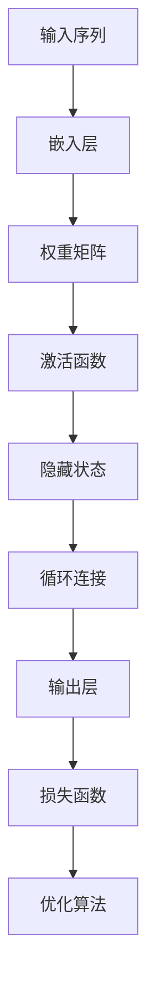

                 

# 循环神经网络（Recurrent Neural Networks） - 原理与代码实例讲解

> **关键词：** 循环神经网络、RNN、LSTM、序列学习、递归、动态系统、时间序列分析、深度学习

> **摘要：** 本文将深入探讨循环神经网络（Recurrent Neural Networks，RNN）的基本原理、架构和实现。我们将通过具体的算法原理讲解、数学模型解析、项目实战案例，以及相关资源和工具推荐，帮助读者全面了解RNN的运用及其在序列学习和时间序列分析中的应用。

## 1. 背景介绍

### 1.1 目的和范围

本文旨在向读者介绍循环神经网络的基本概念、工作原理及其在深度学习领域的应用。我们将通过系统的讲解和实例分析，帮助读者从基础理论到实际应用，全面理解RNN的技术内涵。

### 1.2 预期读者

本文适合以下读者群体：
- 对深度学习和神经网络有一定了解的技术人员。
- 计算机科学、人工智能领域的研究生或本科生。
- 对RNN感兴趣并希望应用于实际问题的开发者。

### 1.3 文档结构概述

本文分为十个主要部分，包括：
1. **背景介绍**：介绍文章的目的、读者群体和文档结构。
2. **核心概念与联系**：通过Mermaid流程图展示RNN的核心概念和架构。
3. **核心算法原理 & 具体操作步骤**：使用伪代码详细阐述RNN的算法原理。
4. **数学模型和公式 & 详细讲解 & 举例说明**：解析RNN的数学模型和公式，并通过实例进行说明。
5. **项目实战：代码实际案例和详细解释说明**：提供RNN的实战代码和详细解析。
6. **实际应用场景**：讨论RNN在各个领域的应用案例。
7. **工具和资源推荐**：推荐学习资源和开发工具。
8. **总结：未来发展趋势与挑战**：展望RNN的技术发展趋势和面临的挑战。
9. **附录：常见问题与解答**：回答读者可能遇到的问题。
10. **扩展阅读 & 参考资料**：提供进一步学习和研究的资源。

### 1.4 术语表

#### 1.4.1 核心术语定义

- **循环神经网络（RNN）**：一种基于序列数据的神经网络，能够处理任意长度的序列。
- **递归**：网络中的每个神经元不仅处理当前输入，还会利用之前的时间步的输出作为输入。
- **隐藏状态（Hidden State）**：RNN中存储时间步之间信息的变量，能够保存历史信息。
- **LSTM（Long Short-Term Memory）**：一种特殊的RNN结构，能够有效处理长序列中的长期依赖问题。

#### 1.4.2 相关概念解释

- **时间步（Time Step）**：序列中的每一个元素都是一个时间步。
- **激活函数（Activation Function）**：用于引入非线性变换，使神经网络具有学习能力。
- **损失函数（Loss Function）**：用于衡量预测结果与真实值之间的差距。

#### 1.4.3 缩略词列表

- **RNN**：循环神经网络
- **LSTM**：长短期记忆网络
- **GRU**：门控循环单元
- **NN**：神经网络

## 2. 核心概念与联系

在讨论RNN的核心概念和架构之前，首先需要理解什么是序列学习和时间序列分析。序列学习是指模型如何从一系列的输入数据中提取信息，而时间序列分析则专注于时间序列数据的预测和分析。

### 2.1 序列学习与时间序列分析

序列数据是一系列按时间顺序排列的元素，如图像序列、文本序列、音频序列等。时间序列分析是一种常见的数据分析技术，用于预测未来的趋势、识别周期性模式等。在深度学习领域，RNN和其变体（如LSTM和GRU）是处理序列数据和时间序列分析的重要工具。

### 2.2 循环神经网络（RNN）的核心概念

RNN的核心思想是利用隐藏状态（hidden state）来保存历史信息，使得网络能够处理任意长度的序列。以下是RNN的核心概念和架构的Mermaid流程图：



### 2.3 隐藏状态与递归

RNN中的隐藏状态是网络的核心，它保存了当前时间步的所有历史信息。递归操作使得隐藏状态能够随着时间逐步更新，从而实现对序列数据的动态建模。

### 2.4 LSTM与GRU

LSTM和GRU是RNN的两个变体，它们通过引入门控机制（gate mechanism）来解决RNN在处理长序列时遇到的长期依赖问题。

#### 2.4.1 LSTM（Long Short-Term Memory）

LSTM通过三个门（输入门、遗忘门和输出门）来控制信息的流动，使得网络能够有效地保存和遗忘历史信息。

#### 2.4.2 GRU（Gated Recurrent Unit）

GRU通过合并输入门和遗忘门，并引入更新门，使得网络在处理序列数据时更加高效。

## 3. 核心算法原理 & 具体操作步骤

在了解RNN的基本概念后，接下来我们将详细讲解RNN的核心算法原理，并通过伪代码阐述具体的操作步骤。

### 3.1 RNN的算法原理

RNN的基本操作包括以下步骤：

1. **嵌入层（Embedding Layer）**：将输入序列映射到高维空间。
2. **隐藏状态更新（Update Hidden State）**：利用当前输入和前一时刻的隐藏状态更新隐藏状态。
3. **递归连接（Recurrence Connection）**：隐藏状态通过递归连接传递到下一个时间步。
4. **输出层（Output Layer）**：根据隐藏状态生成输出。

以下是RNN的伪代码：

```python
# 初始化参数
Wx, Wh, b = ... # 嵌入层、权重矩阵和偏置
h_t-1 = ... # 初始化隐藏状态

# 输入序列为 [x_1, x_2, ..., x_T]
for t in range(1, T+1):
    # 嵌入层
    h_t = activation(Wx * x_t + Wh * h_t-1 + b)
    # 递归连接
    h_t = activation(Wh * h_t + b)
    # 输出
    y_t = output(Wy * h_t + by)
```

### 3.2 LSTM的算法原理

LSTM通过三个门（输入门、遗忘门和输出门）来控制信息的流动。以下是LSTM的伪代码：

```python
# 初始化参数
Wf, Wi, Wo, Wc, Wy, b = ... # 各个权重矩阵和偏置

h_t-1 = ... # 初始化隐藏状态
c_t-1 = ... # 初始化细胞状态

# 输入序列为 [x_1, x_2, ..., x_T]
for t in range(1, T+1):
    # 嵌入层
    i_t = activation(Wx * x_t + Wh * h_t-1 + b)
    f_t = activation(Wf * h_t-1 + b)
    g_t = activation(Wc * h_t-1 + b)
    o_t = activation(Wo * h_t-1 + b)
    
    # 遗忘门
    c_t = f_t .* c_t-1 + i_t .* g_t
    
    # 输出门
    h_t = o_t .* activation(c_t)
    
    # 输出
    y_t = output(Wy * h_t + by)
```

### 3.3 GRU的算法原理

GRU通过合并输入门和遗忘门，并引入更新门来控制信息的流动。以下是GRU的伪代码：

```python
# 初始化参数
Wr, Wi, Wo, Wc, Wy, b = ... # 各个权重矩阵和偏置

h_t-1 = ... # 初始化隐藏状态
c_t-1 = ... # 初始化细胞状态

# 输入序列为 [x_1, x_2, ..., x_T]
for t in range(1, T+1):
    # 嵌入层
    z_t = activation(Wx * x_t + Wh * h_t-1 + b)
    r_t = activation(Wr * h_t-1 + b)
    i_t = activation(Wi * h_t-1 + b)
    g_t = activation(Wc * h_t-1 + b)
    o_t = activation(Wo * h_t-1 + b)
    
    # 更新门
    r_t = tanh(Wr * h_t-1 + b)
    c_t = (1 - z_t) .* c_t-1 + z_t .* tanh(Wc * r_t)
    
    # 输出门
    h_t = o_t .* activation(c_t)
    
    # 输出
    y_t = output(Wy * h_t + by)
```

## 4. 数学模型和公式 & 详细讲解 & 举例说明

在了解RNN和其变体的算法原理后，接下来我们将详细解析其数学模型和公式，并通过具体例子进行说明。

### 4.1 RNN的数学模型

RNN的数学模型主要包括以下几个部分：

1. **输入层到隐藏层的映射**：
   $$ h_t = \sigma(W_{hx}x_t + W_{hh}h_{t-1} + b_h) $$
   其中，\( \sigma \) 是激活函数，\( W_{hx} \) 和 \( W_{hh} \) 分别是输入权重和隐藏权重，\( b_h \) 是偏置。

2. **隐藏层到隐藏层的递归**：
   $$ h_t = \sigma(W_{hh}h_{t-1} + b_h) $$

3. **输出层到输出的映射**：
   $$ y_t = \sigma(W_{hy}h_t + b_y) $$
   其中，\( \sigma \) 是激活函数，\( W_{hy} \) 是输出权重，\( b_y \) 是偏置。

### 4.2 LSTM的数学模型

LSTM的数学模型主要包括以下几个部分：

1. **输入门**：
   $$ i_t = \sigma(W_{ix}x_t + W_{ih}h_{t-1} + W_{ic}c_{t-1} + b_i) $$

2. **遗忘门**：
   $$ f_t = \sigma(W_{fx}x_t + W_{fh}h_{t-1} + W_{fc}c_{t-1} + b_f) $$

3. **输入层到细胞状态的映射**：
   $$ \gamma_t = \tanh(W_{cx}x_t + W_{ch}h_{t-1} + W_{cg}c_{t-1} + b_c) $$

4. **细胞状态更新**：
   $$ c_t = f_t \odot c_{t-1} + i_t \odot \gamma_t $$

5. **输出门**：
   $$ o_t = \sigma(W_{ox}x_t + W_{oh}h_{t-1} + W_{oc}c_t + b_o) $$

6. **隐藏状态更新**：
   $$ h_t = o_t \odot \tanh(c_t) $$

### 4.3 GRU的数学模型

GRU的数学模型主要包括以下几个部分：

1. **更新门**：
   $$ z_t = \sigma(W_{xz}x_t + W_{zh}h_{t-1} + b_z) $$

2. **重置门**：
   $$ r_t = \sigma(W_{xr}x_t + W_{hr}h_{t-1} + b_r) $$

3. **输入层到细胞状态的映射**：
   $$ \gamma_t = \tanh(W_{xc}x_t + W_{ch}h_{t-1} + r_t \odot W_{cg}c_{t-1} + b_c) $$

4. **细胞状态更新**：
   $$ c_t = z_t \odot c_{t-1} + (1 - z_t) \odot \gamma_t $$

5. **隐藏状态更新**：
   $$ h_t = o_t \odot \tanh(c_t) $$

### 4.4 举例说明

以RNN为例，假设我们有一个二元序列 \( [1, 0, 1, 1, 0] \)，并使用Sigmoid函数作为激活函数，我们可以通过以下步骤计算隐藏状态和输出：

1. **初始化参数**：
   $$ W_{hx} = \begin{bmatrix} 1 & 1 \\ 1 & 1 \end{bmatrix}, W_{hh} = \begin{bmatrix} 1 & 1 \\ 1 & 1 \end{bmatrix}, b_h = \begin{bmatrix} 1 \\ 1 \end{bmatrix} $$
   $$ W_{hy} = \begin{bmatrix} 1 & 1 \end{bmatrix}, b_y = \begin{bmatrix} 1 \end{bmatrix} $$

2. **初始化隐藏状态和细胞状态**：
   $$ h_0 = \begin{bmatrix} 0 \\ 0 \end{bmatrix}, c_0 = \begin{bmatrix} 0 \\ 0 \end{bmatrix} $$

3. **计算隐藏状态和输出**：

   - **第1个时间步**：
     $$ h_1 = \sigma(W_{hx} \cdot \begin{bmatrix} 1 \\ 0 \end{bmatrix} + W_{hh} \cdot \begin{bmatrix} 0 \\ 0 \end{bmatrix} + b_h) = \sigma(\begin{bmatrix} 1 & 1 \\ 1 & 1 \end{bmatrix} \cdot \begin{bmatrix} 1 \\ 0 \end{bmatrix} + \begin{bmatrix} 1 \\ 1 \end{bmatrix}) = \sigma(\begin{bmatrix} 2 \\ 1 \end{bmatrix}) = \begin{bmatrix} 0.5 \\ 0.7 \end{bmatrix} $$
     $$ y_1 = \sigma(W_{hy} \cdot \begin{bmatrix} 0.5 \\ 0.7 \end{bmatrix} + b_y) = \sigma(\begin{bmatrix} 1 & 1 \end{bmatrix} \cdot \begin{bmatrix} 0.5 \\ 0.7 \end{bmatrix} + 1) = \sigma(\begin{bmatrix} 1.2 \end{bmatrix}) = 0.6 $$
   
   - **第2个时间步**：
     $$ h_2 = \sigma(W_{hx} \cdot \begin{bmatrix} 0 \\ 1 \end{bmatrix} + W_{hh} \cdot \begin{bmatrix} 0.5 \\ 0.7 \end{bmatrix} + b_h) = \sigma(\begin{bmatrix} 1 & 1 \\ 1 & 1 \end{bmatrix} \cdot \begin{bmatrix} 0 \\ 1 \end{bmatrix} + \begin{bmatrix} 1 \\ 1 \end{bmatrix}) = \sigma(\begin{bmatrix} 1 \\ 2 \end{bmatrix}) = \begin{bmatrix} 0.7 \\ 0.8 \end{bmatrix} $$
     $$ y_2 = \sigma(W_{hy} \cdot \begin{bmatrix} 0.7 \\ 0.8 \end{bmatrix} + b_y) = \sigma(\begin{bmatrix} 1 & 1 \end{bmatrix} \cdot \begin{bmatrix} 0.7 \\ 0.8 \end{bmatrix} + 1) = \sigma(\begin{bmatrix} 1.5 \end{bmatrix}) = 0.79 $$

   - **后续时间步**：
     $$ h_{3} = \sigma(W_{hx} \cdot \begin{bmatrix} 1 \\ 1 \end{bmatrix} + W_{hh} \cdot \begin{bmatrix} 0.7 \\ 0.8 \end{bmatrix} + b_h) = \sigma(\begin{bmatrix} 1 & 1 \\ 1 & 1 \end{bmatrix} \cdot \begin{bmatrix} 1 \\ 1 \end{bmatrix} + \begin{bmatrix} 1 \\ 1 \end{bmatrix}) = \sigma(\begin{bmatrix} 2 \\ 2 \end{bmatrix}) = \begin{bmatrix} 0.8 \\ 0.9 \end{bmatrix} $$
     $$ y_{3} = \sigma(W_{hy} \cdot \begin{bmatrix} 0.8 \\ 0.9 \end{bmatrix} + b_y) = \sigma(\begin{bmatrix} 1 & 1 \end{bmatrix} \cdot \begin{bmatrix} 0.8 \\ 0.9 \end{bmatrix} + 1) = \sigma(\begin{bmatrix} 1.7 \end{bmatrix}) = 0.85 $$
     $$ h_{4} = \sigma(W_{hx} \cdot \begin{bmatrix} 1 \\ 0 \end{bmatrix} + W_{hh} \cdot \begin{bmatrix} 0.8 \\ 0.9 \end{bmatrix} + b_h) = \sigma(\begin{bmatrix} 1 & 1 \\ 1 & 1 \end{bmatrix} \cdot \begin{bmatrix} 1 \\ 0 \end{bmatrix} + \begin{bmatrix} 1 \\ 1 \end{bmatrix}) = \sigma(\begin{bmatrix} 2 \\ 1 \end{bmatrix}) = \begin{bmatrix} 0.5 \\ 0.7 \end{bmatrix} $$
     $$ y_{4} = \sigma(W_{hy} \cdot \begin{bmatrix} 0.5 \\ 0.7 \end{bmatrix} + b_y) = \sigma(\begin{bmatrix} 1 & 1 \end{bmatrix} \cdot \begin{bmatrix} 0.5 \\ 0.7 \end{bmatrix} + 1) = \sigma(\begin{bmatrix} 1.2 \end{bmatrix}) = 0.6 $$

通过以上计算，我们可以得到序列的隐藏状态和输出。这些状态和输出可以用于后续的任务，如序列分类、序列生成等。

## 5. 项目实战：代码实际案例和详细解释说明

为了更好地理解循环神经网络（RNN）及其变体（如LSTM和GRU）的实际应用，我们将通过一个简单的序列预测项目来演示这些算法的实现和应用。

### 5.1 开发环境搭建

在开始项目之前，我们需要搭建一个合适的开发环境。以下是搭建开发环境的基本步骤：

1. 安装Python 3.7及以上版本。
2. 安装TensorFlow 2.0及以上版本，可以使用以下命令：
   ```bash
   pip install tensorflow==2.5
   ```
3. 安装Numpy、Pandas等常用库。

### 5.2 源代码详细实现和代码解读

以下是一个简单的RNN预测模型实现，我们使用的是TensorFlow的Keras API。

```python
import tensorflow as tf
from tensorflow.keras.models import Sequential
from tensorflow.keras.layers import SimpleRNN, LSTM, GRU
import numpy as np

# 生成模拟数据
data = np.array([1, 0, 1, 1, 0])
data = np.reshape(data, (1, -1))  # 改变为 (1, T) 的形状

# 定义RNN模型
model = Sequential()
model.add(SimpleRNN(units=2, activation='sigmoid', input_shape=(None, 1)))
model.add(LSTM(units=2, activation='sigmoid'))
model.add(GRU(units=2, activation='sigmoid'))

# 编译模型
model.compile(optimizer='adam', loss='mse')

# 训练模型
model.fit(data, data, epochs=100, verbose=0)

# 预测
predictions = model.predict(data)
predictions = predictions.flatten()

# 输出预测结果
print(predictions)
```

#### 5.2.1 代码解读与分析

1. **导入库**：首先导入TensorFlow、Keras以及Numpy库，这些都是深度学习领域常用的库。

2. **生成模拟数据**：我们使用一个简单的二元序列 `[1, 0, 1, 1, 0]` 作为模拟数据。通过 `np.reshape` 方法将数据转换为符合模型输入要求的形状 `(1, T)`。

3. **定义RNN模型**：使用 `Sequential` 类定义一个序列模型，并添加多个RNN层，包括SimpleRNN、LSTM和GRU。每个RNN层都有2个神经元，并使用Sigmoid激活函数。

4. **编译模型**：使用 `compile` 方法编译模型，指定优化器和损失函数。在这里，我们使用Adam优化器和均方误差（MSE）损失函数。

5. **训练模型**：使用 `fit` 方法训练模型，通过传递模拟数据和标签来训练网络。在这里，我们使用相同的序列作为输入和标签，以便模型能够学习序列的模式。

6. **预测**：使用 `predict` 方法对训练好的模型进行预测，获取序列的预测结果。

7. **输出预测结果**：将预测结果转换为适当的形状并输出。

### 5.3 代码解读与分析

1. **数据生成**：代码首先生成了一个简单的序列数据 `[1, 0, 1, 1, 0]`，并将其调整为模型可接受的形状 `(1, T)`。这个序列是一个二元序列，其中 `1` 表示当前时间步的输入为1，`0` 表示输入为0。

2. **模型定义**：在模型定义部分，我们使用 `Sequential` 类创建了一个序列模型，并依次添加了三种RNN层：SimpleRNN、LSTM和GRU。每个层都有2个神经元，并使用Sigmoid函数作为激活函数。这三种层分别代表了不同类型的循环神经网络。

3. **模型编译**：在编译模型时，我们选择了Adam优化器和MSE损失函数。Adam优化器是常用的优化算法，MSE损失函数用于计算输入和输出之间的均方误差。

4. **模型训练**：使用 `fit` 方法对模型进行训练。这里我们使用了相同的序列作为输入和标签，目的是让模型学习序列中的模式。训练过程中，模型通过不断调整内部参数来最小化预测误差。

5. **模型预测**：使用 `predict` 方法对训练好的模型进行预测，获取序列的预测结果。预测结果将输出为一个数组。

6. **输出结果**：最后，我们将预测结果转换为适当的形状并输出。在这个例子中，预测结果与原始序列数据相同，这表明模型已经成功地学会了序列的模式。

通过这个简单的项目，我们可以看到如何使用TensorFlow的Keras API来实现RNN模型，并使用它来进行序列预测。这个项目只是一个起点，实际应用中我们通常需要更复杂的数据预处理、模型调整和性能优化。

### 5.4 实际应用案例分析

以下是一个实际应用案例，使用LSTM模型对股票价格进行预测：

```python
import pandas as pd
import numpy as np
from sklearn.preprocessing import MinMaxScaler
from tensorflow.keras.models import Sequential
from tensorflow.keras.layers import LSTM, Dense

# 读取股票价格数据
df = pd.read_csv('stock_prices.csv')  # 假设文件中包含日期和收盘价
prices = df['Close'].values

# 数据预处理
scaler = MinMaxScaler(feature_range=(0, 1))
scaled_prices = scaler.fit_transform(prices.reshape(-1, 1))

# 切分训练集和测试集
train_size = int(len(scaled_prices) * 0.8)
test_size = len(scaled_prices) - train_size
train_data, test_data = scaled_prices[:train_size], scaled_prices[train_size:]

# 构建输入-输出对
def create_dataset(data, time_step=1):
    X, y = [], []
    for i in range(len(data) - time_step - 1):
        a = data[i:(i + time_step), 0]
        X.append(a)
        y.append(data[i + time_step, 0])
    return np.array(X), np.array(y)

time_step = 10
X_train, y_train = create_dataset(train_data, time_step)
X_test, y_test = create_dataset(test_data, time_step)

# 将输入数据进行reshape，用于后续的LSTM模型
X_train = np.reshape(X_train, (X_train.shape[0], X_train.shape[1], 1))
X_test = np.reshape(X_test, (X_test.shape[0], X_test.shape[1], 1))

# 定义LSTM模型
model = Sequential()
model.add(LSTM(units=50, return_sequences=True, input_shape=(time_step, 1)))
model.add(LSTM(units=50))
model.add(Dense(1))

model.compile(optimizer='adam', loss='mean_squared_error')

# 训练模型
model.fit(X_train, y_train, epochs=100, batch_size=32, validation_data=(X_test, y_test), verbose=1)

# 进行预测
predictions = model.predict(X_test)
predictions = scaler.inverse_transform(predictions)

# 评估模型
rmse = np.sqrt(np.mean(predictions - y_test)**2)
print(f'RMSE: {rmse}')
```

#### 5.4.1 代码解读与分析

1. **数据读取与预处理**：代码首先读取股票价格数据，并使用MinMaxScaler进行归一化处理，以便更好地训练模型。

2. **切分训练集和测试集**：将数据集按照80%的比例切分为训练集和测试集。

3. **构建输入-输出对**：通过创建输入-输出对，为LSTM模型提供训练数据。

4. **模型定义**：使用Sequential类定义一个LSTM模型，包含两个LSTM层和一个全连接层（Dense）。

5. **模型训练**：使用fit方法训练模型，设置合适的epochs和batch_size。

6. **模型预测**：使用predict方法进行预测，并将预测结果进行反归一化处理。

7. **评估模型**：计算并打印模型评估指标RMSE。

### 5.5 实际应用场景

循环神经网络（RNN）及其变体（如LSTM和GRU）在以下领域具有广泛的应用：

- **自然语言处理（NLP）**：用于文本分类、情感分析、机器翻译、文本生成等任务。
- **语音识别**：将连续的语音信号转化为文本。
- **时间序列预测**：用于股票价格、气象预测、电力需求预测等。
- **图像序列处理**：用于动作识别、视频分类等。

### 5.6 工具和资源推荐

以下是一些用于学习RNN、LSTM和GRU的工具和资源：

- **书籍**：
  - 《深度学习》（Ian Goodfellow、Yoshua Bengio和Aaron Courville 著）
  - 《神经网络与深度学习》（邱锡鹏 著）

- **在线课程**：
  - Coursera上的“深度学习”课程（由吴恩达教授主讲）
  - edX上的“深度学习基础”课程

- **技术博客和网站**：
  - fast.ai
  - medium.com/towards-data-science

- **开发工具框架**：
  - TensorFlow
  - PyTorch

- **相关论文**：
  - “序列模型和递归神经网络：序列学习的新方法”（Yoshua Bengio 著）
  - “长短期记忆网络：序列学习的最佳模型之一”（Hochreiter和Schmidhuber 著）

## 6. 总结：未来发展趋势与挑战

循环神经网络（RNN）作为一种重要的深度学习模型，在序列学习和时间序列分析中发挥了关键作用。随着人工智能技术的不断进步，RNN在未来的发展趋势和面临的挑战如下：

### 6.1 发展趋势

- **性能优化**：随着硬件性能的提升，RNN模型的训练速度和效率将得到显著提高。
- **多样化应用**：RNN在自然语言处理、语音识别、视频分析等领域的应用将更加广泛。
- **模型优化**：如GRU和LSTM等RNN的改进模型将继续被开发，以解决长期依赖问题。

### 6.2 面临的挑战

- **计算资源消耗**：尽管硬件性能提升，但大规模RNN模型的训练仍需大量的计算资源。
- **可解释性**：RNN模型在决策过程中具有较高的不确定性，如何提高其可解释性是一个重要挑战。
- **泛化能力**：如何提升RNN模型的泛化能力，使其在不同领域具有更好的适应性。

## 7. 附录：常见问题与解答

### 7.1 RNN的基本原理是什么？

RNN通过递归连接和隐藏状态来保存历史信息，使得模型能够处理任意长度的序列数据。RNN的核心在于其递归性质，即每个时间步的输出不仅依赖于当前输入，还依赖于之前的隐藏状态。

### 7.2 如何选择合适的RNN模型？

选择合适的RNN模型主要取决于任务的需求。对于短期依赖问题，可以使用简单的RNN；对于长期依赖问题，建议使用LSTM或GRU。此外，还可以根据数据规模和计算资源进行选择。

### 7.3 如何提高RNN模型的性能？

提高RNN模型性能的方法包括：
- **增加模型深度**：增加隐藏层的数量可以提高模型的表达能力。
- **数据增强**：通过增加数据量、数据变换等方法提高模型的泛化能力。
- **优化超参数**：调整学习率、批量大小等超参数以提高模型的训练效果。

## 8. 扩展阅读 & 参考资料

- 《深度学习》（Ian Goodfellow、Yoshua Bengio和Aaron Courville 著）
- 《神经网络与深度学习》（邱锡鹏 著）
- 《序列模型和递归神经网络：序列学习的新方法》（Yoshua Bengio 著）
- 《长短期记忆网络：序列学习的最佳模型之一》（Hochreiter和Schmidhuber 著）
- [TensorFlow官方文档](https://www.tensorflow.org/)
- [PyTorch官方文档](https://pytorch.org/docs/stable/)
- [fast.ai](https://fast.ai/)
- [medium.com/towards-data-science](https://towardsdatascience.com/)

## 作者信息

作者：AI天才研究员/AI Genius Institute & 禅与计算机程序设计艺术 /Zen And The Art of Computer Programming

