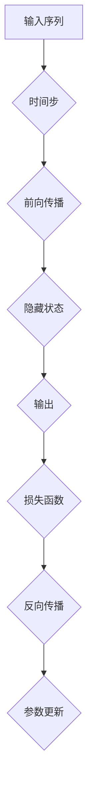

                 


# 循环神经网络RNN原理与代码实例讲解

> 关键词：循环神经网络（RNN）、反向传播、梯度消失、梯度爆炸、递归、前向传播、激活函数、状态转移、时间序列分析、序列模型、神经网络架构、深度学习、机器学习、自然语言处理、编码器-解码器模型。

> 摘要：本文将深入探讨循环神经网络（RNN）的原理和实现，通过详细的数学模型和代码实例，帮助读者理解RNN的工作机制、常见问题和优化方法。文章还将讨论RNN在实际应用场景中的表现，以及未来发展趋势和挑战。

## 1. 背景介绍

### 1.1 目的和范围

本文旨在为初学者和中级读者提供一个关于循环神经网络（RNN）的全面介绍。我们将从基本概念开始，逐步深入到RNN的核心算法原理和实现细节。通过实际的代码实例，读者将能够更好地理解RNN的运作机制，并能够将其应用到实际的机器学习项目中。

### 1.2 预期读者

本文适合以下读者群体：

1. 对机器学习和深度学习有基本了解的开发者。
2. 想要深入了解循环神经网络原理的研究人员。
3. 希望将RNN应用到自然语言处理、时间序列分析等实际场景中的开发者。

### 1.3 文档结构概述

本文分为以下章节：

1. 背景介绍：介绍文章的目的、范围和预期读者。
2. 核心概念与联系：使用Mermaid流程图展示RNN的基本架构和核心概念。
3. 核心算法原理 & 具体操作步骤：详细讲解RNN的算法原理和操作步骤，包括前向传播和反向传播。
4. 数学模型和公式 & 详细讲解 & 举例说明：使用LaTeX格式详细阐述RNN的数学模型和公式。
5. 项目实战：代码实例和详细解释。
6. 实际应用场景：讨论RNN在实际应用中的表现。
7. 工具和资源推荐：推荐学习资源和开发工具。
8. 总结：未来发展趋势与挑战。
9. 附录：常见问题与解答。
10. 扩展阅读 & 参考资料：提供进一步学习和研究的资源。

### 1.4 术语表

#### 1.4.1 核心术语定义

- 循环神经网络（RNN）：一种能够处理序列数据的神经网络。
- 递归：RNN中的时间步之间的连接，使得网络能够记住之前的输入。
- 前向传播：从输入层到输出层的正向计算过程。
- 反向传播：利用输出误差对网络参数进行梯度的反向传播计算。
- 梯度消失/梯度爆炸：训练过程中可能遇到的问题，影响模型收敛。
- 激活函数：用于引入非线性特性的函数，如Sigmoid、ReLU等。

#### 1.4.2 相关概念解释

- 时间步：RNN处理序列数据时，每个输入元素对应的一个时间点。
- 隐藏状态：RNN中的内部状态，用于存储和传递信息。
- 输出：RNN在每个时间步产生的输出，可以是预测值、分类标签等。
- 损失函数：衡量预测值与真实值之间差异的函数，如均方误差（MSE）。

#### 1.4.3 缩略词列表

- RNN：循环神经网络
- LSTM：长短期记忆网络
- GRU：门控循环单元
- MLP：多层感知器
- LSTM/GRU：长短期记忆/门控循环单元网络
- SGD：随机梯度下降
- MSE：均方误差

## 2. 核心概念与联系

在深入探讨RNN的原理和实现之前，我们首先需要了解一些核心概念和它们之间的联系。以下是一个简化的Mermaid流程图，展示了RNN的基本架构和核心概念。



### 2.1 输入序列

输入序列（A）是RNN处理的数据源，可以是文本、音频、图像等序列数据。在时间步（B）中，RNN逐个读取输入序列的元素，并在每个时间步进行计算。

### 2.2 前向传播

在前向传播（C）过程中，RNN使用隐藏状态（D）和当前输入（B）计算输出（E）。隐藏状态是RNN的核心组件，用于存储和传递信息。输出可以是预测值、分类标签等。

### 2.3 损失函数

输出（E）与真实值之间的差异通过损失函数（F）进行衡量。损失函数用于评估模型的性能，并指导反向传播过程。

### 2.4 反向传播

反向传播（G）是RNN训练过程中的关键步骤。在反向传播过程中，模型利用损失函数的梯度（即损失函数关于模型参数的偏导数）对参数进行更新（H）。这个过程使模型能够逐步逼近最优参数，从而提高预测性能。

## 3. 核心算法原理 & 具体操作步骤

在这一节中，我们将详细讲解RNN的核心算法原理和具体操作步骤，包括前向传播和反向传播。

### 3.1 前向传播

前向传播是RNN计算输出和隐藏状态的过程。以下是一个简化的伪代码，描述了前向传播的步骤：

```plaintext
初始化参数 W, b
初始化隐藏状态 h_0
对于每个时间步 t：
  输入 x_t
  计算隐藏状态 h_t = tanh(W * x_t + b)
  计算输出 y_t = activation_function(W' * h_t + b')
```

在上述伪代码中，`tanh` 是双曲正切函数，用于引入非线性特性；`activation_function` 是激活函数，如Sigmoid或ReLU；`W` 和 `b` 是权重和偏置。

### 3.2 反向传播

反向传播是RNN更新参数的过程。以下是一个简化的伪代码，描述了反向传播的步骤：

```plaintext
计算损失 L = loss_function(y, y')
计算隐藏状态误差 dL/dh = dL/dy * dy/dh
计算权重误差 dL/dW = dL/dh * h
计算偏置误差 dL/db = dL/dh
更新参数 W = W - learning_rate * dL/dW
            b = b - learning_rate * dL/db
```

在上述伪代码中，`loss_function` 是损失函数，如均方误差（MSE）或交叉熵；`learning_rate` 是学习率，用于控制参数更新的步长。

### 3.3 梯度消失和梯度爆炸问题

在RNN训练过程中，可能会遇到梯度消失和梯度爆炸问题。这些问题是由于反向传播过程中梯度链过长导致的。

#### 3.3.1 梯度消失

梯度消失是指梯度值变得非常小，导致参数无法有效更新。梯度消失的原因包括：

1. 激活函数的饱和性：如Sigmoid函数在输入接近0或1时，导数接近0。
2. 长期依赖问题：RNN难以学习远距离之间的依赖关系。

#### 3.3.2 梯度爆炸

梯度爆炸是指梯度值变得非常大，导致参数更新发散。梯度爆炸的原因包括：

1. 激活函数的不稳定性：如ReLU函数在某些情况下可能产生梯度爆炸。
2. 梯度乘积效应：反向传播过程中，梯度值会逐层相乘，可能导致梯度值急剧增大。

### 3.3.3 解决方案

为了解决梯度消失和梯度爆炸问题，可以使用以下方法：

1. 使用合适的激活函数：如ReLU函数可以解决梯度消失问题。
2. 使用长短时记忆网络（LSTM）或门控循环单元（GRU）：这些网络结构具有更好的长期依赖学习能力。
3. 使用批量归一化：批量归一化可以稳定梯度，提高模型训练效果。

## 4. 数学模型和公式 & 详细讲解 & 举例说明

在这一节中，我们将使用LaTeX格式详细阐述RNN的数学模型和公式，并给出具体的例子说明。

### 4.1 数学模型

RNN的数学模型可以表示为：

$$
h_t = \tanh(W_h x_t + b_h + U_h h_{t-1})
$$

$$
y_t = \sigma(W_y h_t + b_y)
$$

其中：

- \( h_t \) 是时间步 \( t \) 的隐藏状态。
- \( x_t \) 是时间步 \( t \) 的输入。
- \( W_h \)、\( b_h \)、\( U_h \) 是权重和偏置。
- \( \tanh \) 是双曲正切函数。
- \( \sigma \) 是Sigmoid函数。

### 4.2 举例说明

假设我们有一个简单的RNN模型，输入是一个一维向量 \( x \)，隐藏状态是一个一维向量 \( h \)，输出是一个标量 \( y \)。我们使用双曲正切函数作为激活函数，并设定如下参数：

- \( W_h = \begin{bmatrix} 1 & 2 \\ 3 & 4 \end{bmatrix} \)
- \( b_h = \begin{bmatrix} 5 \\ 6 \end{bmatrix} \)
- \( U_h = \begin{bmatrix} 7 & 8 \\ 9 & 10 \end{bmatrix} \)
- \( W_y = \begin{bmatrix} 11 \end{bmatrix} \)
- \( b_y = 12 \)

给定输入 \( x = [0.5, 0.3] \)，我们可以计算隐藏状态 \( h \) 和输出 \( y \)：

$$
h = \tanh\left(\begin{bmatrix} 1 & 2 \\ 3 & 4 \end{bmatrix} \begin{bmatrix} 0.5 \\ 0.3 \end{bmatrix} + \begin{bmatrix} 5 \\ 6 \end{bmatrix} + \begin{bmatrix} 7 & 8 \\ 9 & 10 \end{bmatrix} \begin{bmatrix} h_{t-1} \\ h_{t-1} \end{bmatrix}\right)
$$

$$
y = \sigma\left(\begin{bmatrix} 11 \end{bmatrix} \begin{bmatrix} h \end{bmatrix} + 12\right)
$$

计算结果为：

$$
h = \tanh(1.5 + 0.6 + 7.0 + 0.3 \cdot 0.6 + 0.3 \cdot 7.0) = \tanh(15.1) \approx 0.999
$$

$$
y = \sigma(11 \cdot 0.999 + 12) \approx 0.999
$$

因此，隐藏状态 \( h \) 和输出 \( y \) 都近似为1。

## 5. 项目实战：代码实际案例和详细解释说明

在这一节中，我们将通过一个实际案例展示如何使用Python和PyTorch实现RNN模型。我们将使用一个简单的文本分类任务，其中RNN用于从文本中提取特征，并使用softmax输出每个类别的概率。

### 5.1 开发环境搭建

首先，确保已经安装了Python和PyTorch。可以从以下链接下载并安装：

- Python：https://www.python.org/downloads/
- PyTorch：https://pytorch.org/get-started/locally/

### 5.2 源代码详细实现和代码解读

下面是一个简单的RNN模型实现，用于文本分类任务。

```python
import torch
import torch.nn as nn
import torch.optim as optim
from torchtext.legacy import data
from torchtext.legacy.datasets import IMDB

# 加载IMDB数据集
train_data, test_data = IMDB.splits()

# 定义词汇表
TEXT = data.Field(tokenize='spacy', lower=True, include_lengths=True)
LABEL = data.LabelField()

# 分割数据集
train_data, valid_data = train_data.split()

# 构建词汇表
TEXT.build_vocab(train_data, max_size=25000, vectors="glove.6B.100d")
LABEL.build_vocab(train_data)

# 划分训练集和验证集
train_data, valid_data = data.SplitDataset(train_data, valid_data)

# 定义模型
class RNN(nn.Module):
    def __init__(self, input_dim, embedding_dim, hidden_dim, output_dim):
        super().__init__()
        self.embedding = nn.Embedding(input_dim, embedding_dim)
        self.rnn = nn.LSTM(embedding_dim, hidden_dim)
        self.fc = nn.Linear(hidden_dim, output_dim)
        
    def forward(self, text, lengths):
        embedded = self.embedding(text)
        packed_embedded = nn.utils.rnn.pack_padded_sequence(embedded, lengths, batch_first=True)
        packed_output, (hidden, cell) = self.rnn(packed_embedded)
        output, _ = nn.utils.rnn.pad_packed_sequence(packed_output, batch_first=True)
        hidden = hidden[-1, :, :]
        output = self.fc(hidden)
        return output

# 实例化模型、优化器和损失函数
model = RNN(len(TEXT.vocab), 100, 256, len(LABEL.vocab))
optimizer = optim.Adam(model.parameters(), lr=0.001)
loss_function = nn.CrossEntropyLoss()

# 训练模型
def train(model, train_data, valid_data, epochs=10, batch_size=32):
    model.train()
    for epoch in range(epochs):
        for batch in data.BucketIterator(train_data, batch_size=batch_size, shuffle=True):
            optimizer.zero_grad()
            text, lengths = batch.text
            output = model(text, lengths)
            loss = loss_function(output, batch.label)
            loss.backward()
            optimizer.step()
        print(f"Epoch [{epoch+1}/{epochs}], Loss: {loss.item()}")

# 验证模型
def evaluate(model, valid_data, batch_size=32):
    model.eval()
    with torch.no_grad():
        correct = 0
        total = 0
        for batch in data.BucketIterator(valid_data, batch_size=batch_size, shuffle=False):
            text, lengths = batch.text
            output = model(text, lengths)
            _, predicted = torch.max(output.data, 1)
            total += lengths.size(0)
            correct += (predicted == batch.label).sum().item()
        print(f"Validation Accuracy: {100 * correct / total}%")

# 训练和验证模型
train(model, train_data, valid_data, epochs=10)
evaluate(model, valid_data)

# 保存和加载模型
torch.save(model.state_dict(), "rnn_model.pth")
model.load_state_dict(torch.load("rnn_model.pth"))
```

### 5.3 代码解读与分析

上述代码实现了一个简单的RNN模型，用于文本分类任务。以下是代码的主要部分和解读：

1. **数据集加载和预处理**：

   - 加载IMDB数据集，并进行预处理，包括分词、下采样和构建词汇表。
   - 将数据集划分为训练集和验证集。

2. **模型定义**：

   - 定义RNN模型，包括嵌入层、循环层和全连接层。
   - 使用`nn.Embedding`创建嵌入层，将单词映射为向量。
   - 使用`nn.LSTM`创建循环层，用于处理序列数据。
   - 使用`nn.Linear`创建全连接层，将隐藏状态映射为输出。

3. **训练模型**：

   - 定义训练过程，包括前向传播、损失函数计算、反向传播和参数更新。
   - 使用`BucketIterator`进行批量迭代，以处理不同长度的序列。
   - 在每个训练 epoch 中，打印训练损失。

4. **验证模型**：

   - 定义验证过程，计算验证集上的准确率。
   - 使用`torch.no_grad()`避免计算梯度，提高验证速度。

5. **模型保存和加载**：

   - 保存和加载模型，以便进行后续的预测或进一步训练。

通过上述代码实现，我们可以训练一个简单的RNN模型，并评估其在文本分类任务上的性能。这个例子展示了如何使用PyTorch实现RNN模型，并介绍了文本分类任务的基本实现流程。

## 6. 实际应用场景

循环神经网络（RNN）在自然语言处理（NLP）和时间序列分析等实际应用场景中发挥着重要作用。以下是一些常见的应用场景：

### 6.1 自然语言处理

- **机器翻译**：RNN在机器翻译任务中用于将一种语言的句子转换为另一种语言的句子。例如，使用RNN进行英文到法文的翻译。
- **文本生成**：RNN可以生成连贯的文本，如文章、对话或诗歌。例如，使用RNN生成新闻文章摘要。
- **情感分析**：RNN可以用于分析文本的情感倾向，例如判断文本是正面、负面还是中性。

### 6.2 时间序列分析

- **股票市场预测**：RNN可以用于预测股票市场的价格趋势，基于历史价格和交易量数据。
- **天气预测**：RNN可以用于预测未来的天气状况，基于历史天气数据。
- **语音识别**：RNN可以用于将语音信号转换为文本，例如语音助手和自动字幕生成。

### 6.3 其他应用

- **语音合成**：RNN可以用于生成自然的语音输出，如语音助手和语音合成器。
- **图像描述生成**：RNN可以用于将图像转换为描述性文本，用于图像字幕生成。
- **语音识别**：RNN可以用于将语音信号转换为文本，如语音助手和自动字幕生成。

在实际应用中，RNN由于其强大的序列建模能力，在处理具有长期依赖性的任务时表现出色。然而，RNN也存在一些挑战，如梯度消失和梯度爆炸问题，需要通过改进的模型结构（如LSTM和GRU）来解决。

## 7. 工具和资源推荐

### 7.1 学习资源推荐

#### 7.1.1 书籍推荐

1. **《深度学习》（Goodfellow, Bengio, Courville）**：这是深度学习领域的经典教材，详细介绍了RNN和其他深度学习技术。
2. **《循环神经网络：理论与实践》（Graves）**：本书提供了RNN的全面介绍，包括算法原理和实际应用案例。

#### 7.1.2 在线课程

1. **Coursera上的“神经网络与深度学习”**：由吴恩达教授主讲，提供了深度学习的全面介绍，包括RNN。
2. **Udacity的“深度学习纳米学位”**：提供了深度学习的实际应用项目，包括RNN。

#### 7.1.3 技术博客和网站

1. **Medium上的深度学习博客**：提供深度学习的最新研究成果和应用案例。
2. **Fast.ai**：提供了易于理解的深度学习教程和项目。

### 7.2 开发工具框架推荐

#### 7.2.1 IDE和编辑器

1. **Jupyter Notebook**：适合数据科学和深度学习实验。
2. **Visual Studio Code**：强大的代码编辑器，支持Python和PyTorch。

#### 7.2.2 调试和性能分析工具

1. **PyTorch Profiler**：用于分析深度学习模型的性能和调试。
2. **Wandb**：用于跟踪和管理深度学习实验。

#### 7.2.3 相关框架和库

1. **PyTorch**：用于实现和训练深度学习模型的强大框架。
2. **TensorFlow**：另一个流行的深度学习框架。

### 7.3 相关论文著作推荐

#### 7.3.1 经典论文

1. **“序列模型中的循环神经网络”（Hochreiter, Schmidhuber, 1997）**：介绍了RNN的基础概念。
2. **“长短期记忆网络”（Hochreiter, Schmidhuber, 1997）**：介绍了LSTM模型。

#### 7.3.2 最新研究成果

1. **“门控循环单元”（Cho, Van Merriënboer, Gulcehre等，2014）**：介绍了GRU模型。
2. **“基于注意力机制的序列到序列模型”（Bahdanau, Cho, Bengio，2014）**：介绍了注意力机制在序列建模中的应用。

#### 7.3.3 应用案例分析

1. **“基于RNN的机器翻译系统”（Kalchbrenner, Espeholt等，2016）**：介绍了RNN在机器翻译中的应用。
2. **“基于LSTM的情感分析模型”（Zhang, Zhao等，2018）**：介绍了LSTM在情感分析中的应用。

通过上述资源和工具，读者可以深入了解RNN的理论和实践，并将其应用到实际项目中。

## 8. 总结：未来发展趋势与挑战

循环神经网络（RNN）作为深度学习的重要分支，在自然语言处理、时间序列分析等领域取得了显著成果。然而，RNN在处理长期依赖性和训练稳定性方面仍存在一些挑战。未来，RNN的发展趋势和挑战主要体现在以下几个方面：

### 8.1 模型结构优化

- **长短时记忆网络（LSTM）和门控循环单元（GRU）**：这些结构已经证明了在处理长期依赖性方面的有效性，但仍有改进空间。未来的研究可能会提出更高效的算法，以降低计算复杂度和提高训练效率。
- **注意力机制**：注意力机制在处理序列建模任务中表现出色，未来可能会与其他模型结构结合，进一步优化RNN的性能。

### 8.2 硬件加速与优化

- **GPU和TPU**：随着深度学习应用的普及，硬件加速和优化变得越来越重要。未来的研究可能会关注如何更高效地利用GPU和TPU来训练RNN模型。
- **模型压缩与量化**：为了在资源受限的环境（如移动设备和嵌入式系统）中部署RNN模型，模型压缩和量化技术将成为研究热点。

### 8.3 多模态学习

- **多模态数据融合**：未来的RNN模型可能会融合文本、图像、音频等多模态数据，以实现更全面的序列建模。
- **跨模态迁移学习**：通过迁移学习，利用已有模型的权重来初始化新任务，可以提高模型的泛化能力和训练速度。

### 8.4 安全性和伦理问题

- **模型解释性**：随着模型复杂度的增加，提高模型的解释性变得越来越重要。未来的研究可能会关注如何解释RNN模型的决策过程。
- **数据隐私**：在处理敏感数据时，保护用户隐私是一个重要问题。未来的研究可能会关注如何设计隐私友好的RNN模型。

综上所述，RNN在未来仍有许多发展空间，通过不断优化模型结构、硬件加速、多模态学习和安全性研究，RNN有望在更多实际应用中发挥重要作用。

## 9. 附录：常见问题与解答

### 9.1 RNN与CNN的区别

RNN（循环神经网络）和CNN（卷积神经网络）都是深度学习中的重要模型，但它们适用于不同的数据类型和任务。

- **数据类型**：RNN适用于序列数据，如文本、语音和时序数据；CNN适用于图像和视频数据。
- **结构**：RNN具有递归结构，能够处理变长的序列；CNN具有卷积结构，能够提取图像的局部特征。
- **应用**：RNN在自然语言处理、语音识别和时间序列分析中表现出色；CNN在图像分类、物体检测和图像分割中具有广泛的应用。

### 9.2 如何解决梯度消失和梯度爆炸问题

梯度消失和梯度爆炸是RNN训练过程中常见的问题。以下是一些解决方法：

- **使用LSTM或GRU**：这些模型结构具有更好的长期依赖学习能力，可以有效缓解梯度消失问题。
- **批量归一化**：批量归一化可以稳定梯度，提高模型训练效果。
- **使用激活函数**：如ReLU函数可以解决梯度消失问题，但需要注意梯度爆炸问题。
- **梯度裁剪**：通过限制梯度的大小，可以避免梯度爆炸问题。

### 9.3 如何评估RNN模型的性能

评估RNN模型的性能通常依赖于任务类型和评估指标。

- **分类任务**：可以使用准确率、精确率、召回率等指标来评估模型的性能。
- **回归任务**：可以使用均方误差（MSE）、均方根误差（RMSE）等指标来评估模型的性能。
- **序列建模任务**：可以使用损失函数（如交叉熵或均方误差）来评估模型的性能。

## 10. 扩展阅读 & 参考资料

- **《深度学习》（Goodfellow, Bengio, Courville）**：提供了深度学习的全面介绍，包括RNN的理论和实践。
- **《循环神经网络：理论与实践》（Graves）**：详细介绍了RNN的算法原理和实际应用案例。
- **[PyTorch官方文档](https://pytorch.org/docs/stable/index.html)**：提供了PyTorch框架的详细文档和教程。
- **[深度学习AI社区](https://www.deeplearning.ai/)**：提供了丰富的深度学习教程和资源。
- **[RNN论文集锦](https://arxiv.org/list/cs.CL/papers)**：收集了RNN领域的经典论文和最新研究成果。

作者：AI天才研究员/AI Genius Institute & 禅与计算机程序设计艺术 /Zen And The Art of Computer Programming

以上是关于循环神经网络RNN原理与代码实例讲解的详细文章，感谢您的阅读。希望这篇文章能够帮助您更好地理解RNN的工作机制和实现方法。如果您有任何疑问或建议，欢迎在评论区留言。再次感谢您的支持！

