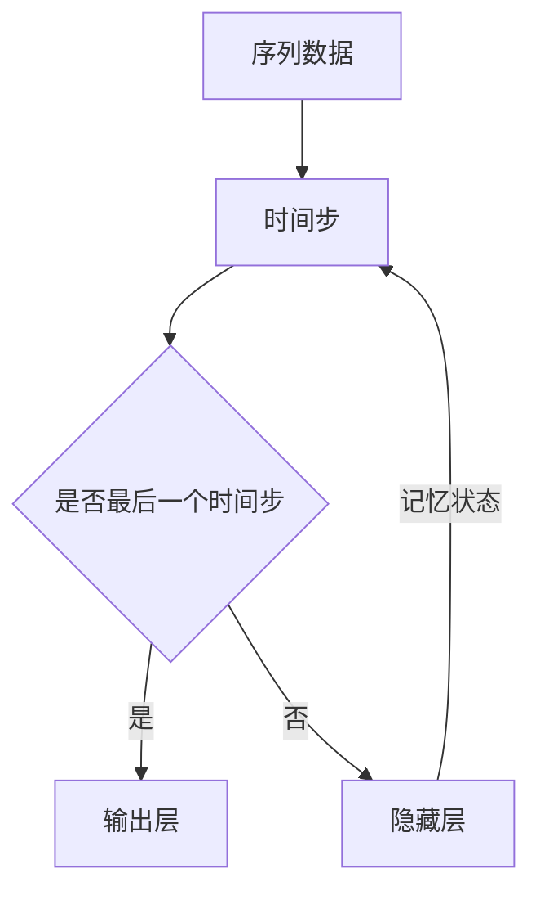

                 


# 循环神经网络RNN原理与代码实例讲解

> 关键词：循环神经网络，RNN，序列建模，反向传播，时间步，激活函数，梯度消失，梯度爆炸，状态记忆，动态权重

> 摘要：本文将深入讲解循环神经网络（RNN）的基本原理，包括其结构、核心算法以及在实际项目中的应用。通过详细的代码实例，我们将展示如何使用RNN来处理序列数据，并讨论其在自然语言处理和语音识别等领域的应用。文章旨在帮助读者理解RNN的工作机制，并掌握其实现和优化技巧。

## 1. 背景介绍

### 1.1 目的和范围

本文的目的是介绍循环神经网络（RNN）的基础知识，帮助读者理解RNN的工作原理、优势及其在实际项目中的应用。本文将涵盖以下内容：

1. RNN的背景和基本概念
2. RNN的结构和工作机制
3. RNN的核心算法和数学模型
4. RNN的代码实例和实战应用
5. RNN在实际场景中的挑战和解决方案

### 1.2 预期读者

本文适合以下读者：

1. 对深度学习和神经网络有一定了解的开发者
2. 对自然语言处理和序列建模感兴趣的研究人员
3. 希望了解RNN如何应用于实际项目的工程师
4. 想要学习RNN基本原理的初学者

### 1.3 文档结构概述

本文结构如下：

1. 背景介绍：介绍RNN的目的、读者对象和文档结构
2. 核心概念与联系：讲解RNN的基本概念和原理
3. 核心算法原理与具体操作步骤：详细阐述RNN的算法原理和操作步骤
4. 数学模型和公式：介绍RNN的数学模型和相关公式
5. 项目实战：通过代码实例展示RNN的实际应用
6. 实际应用场景：讨论RNN的应用领域和挑战
7. 工具和资源推荐：推荐学习资源和开发工具
8. 总结：展望RNN的未来发展趋势与挑战
9. 附录：常见问题与解答
10. 扩展阅读：提供进一步学习的参考文献

### 1.4 术语表

#### 1.4.1 核心术语定义

- 循环神经网络（RNN）：一种能够处理序列数据的神经网络，具有状态记忆能力。
- 隐藏状态（Hidden State）：RNN中的内部状态，用于保存序列中的历史信息。
- 时间步（Time Step）：序列数据中的每个元素，可以是一个单词、一个字符或一个时间点。
- 隐藏层（Hidden Layer）：RNN中的中间层，用于处理序列数据。
- 输出层（Output Layer）：用于生成预测的层，可以是分类标签或连续值。
- 反向传播（Backpropagation）：一种用于训练神经网络的算法，通过计算梯度来更新网络权重。

#### 1.4.2 相关概念解释

- 序列建模（Sequence Modeling）：利用神经网络对序列数据进行建模的过程，可以用于分类、回归或生成任务。
- 梯度消失（Vanishing Gradient）：在训练神经网络时，梯度值逐渐减小，导致网络无法有效更新权重。
- 梯度爆炸（Exploding Gradient）：在训练神经网络时，梯度值逐渐增大，可能导致网络不稳定。
- 状态记忆（State Memory）：RNN通过隐藏状态来保存序列中的历史信息，实现长期依赖建模。

#### 1.4.3 缩略词列表

- RNN：循环神经网络
- LSTM：长短期记忆网络
- GRU：门控循环单元
- NLP：自然语言处理
- DL：深度学习

## 2. 核心概念与联系

循环神经网络（RNN）是一种基于序列数据的神经网络，其核心特点是具有状态记忆能力。下面我们将通过一个Mermaid流程图来展示RNN的基本概念和联系。



在这个流程图中：

- **序列数据（A）**：输入给RNN的序列，可以是文本、音频或时间序列数据。
- **时间步（B）**：序列中的每个元素，可以是单词、字符或时间点。
- **隐藏层（E）**：RNN的核心层，用于处理序列数据，并保存历史信息。
- **输出层（D）**：用于生成预测或分类结果的层。
- **状态记忆（记忆状态）**：隐藏状态在时间步之间传递，实现长期依赖建模。

通过这个流程图，我们可以清晰地看到RNN的工作流程，以及各个组成部分之间的关系。

## 3. 核心算法原理与具体操作步骤

循环神经网络（RNN）的核心算法基于递归结构，通过保存历史信息来实现序列建模。下面我们将通过伪代码来详细阐述RNN的算法原理和操作步骤。

### 3.1 前向传播

```python
# 初始化参数
W_hh, W_xh, W_hy, b_h, b_x, b_y = initialize_parameters()

# 隐藏状态和隐藏层输出初始化
h_t = [0] * T  # T为时间步数

# 前向传播
for t in range(T):
    # 输入层到隐藏层的变换
    h_t[t] = tanh(W_hh * h_t[t-1] + W_xh * x_t[t] + b_h)
    
    # 隐藏层到输出层的变换
    y_t = softmax(W_hy * h_t[t] + b_y)

    # 计算损失函数
    loss += -sum(y_t[i] * log(y_t[i])) for i in range(num_classes)

# 计算梯度
dh_t, dW_hh, dW_xh, dW_hy, db_h, dx_t = backwardpropagation(h_t, x_t, y_t, W_hh, W_xh, W_hy, b_h, b_x, b_y)
```

### 3.2 反向传播

```python
# 反向传播
for t in range(T-1, -1, -1):
    # 计算输出层梯度
    dy_t = y_t - y_t.argmax()
    
    # 计算隐藏层梯度
    dh_t[t] = dW_hy * dy_t + dW_hy * h_t[t+1]
    
    # 计算输入层梯度
    dx_t[t] = dW_xh * dh_t[t]
    
    # 更新参数
    W_hh, W_xh, W_hy, b_h, b_x, b_y = update_parameters(W_hh, W_xh, W_hy, b_h, b_x, b_y, dh_t[t], dx_t[t], dy_t)
```

在这个算法中：

- **初始化参数**：初始化网络的权重和偏置。
- **前向传播**：在每个时间步上，计算隐藏状态和隐藏层输出。
- **计算损失函数**：计算输出层损失。
- **反向传播**：计算梯度并更新参数。
- **更新参数**：使用梯度下降或其他优化算法更新权重和偏置。

通过这个伪代码，我们可以清晰地看到RNN的前向传播和反向传播过程，以及如何计算和更新参数。

## 4. 数学模型和公式 & 详细讲解 & 举例说明

循环神经网络（RNN）的数学模型是理解其工作原理的关键。在这一节中，我们将详细介绍RNN的数学模型和相关公式，并通过具体例子来说明。

### 4.1 数学模型

RNN的数学模型包括以下几个关键组成部分：

1. **激活函数**：通常使用tanh或sigmoid函数。
2. **权重和偏置**：包括隐藏层到隐藏层的权重（\(W_{hh}\)）、输入层到隐藏层的权重（\(W_{xh}\)）、隐藏层到输出层的权重（\(W_{hy}\)）以及相应的偏置（\(b_{h}\)、\(b_{x}\)、\(b_{y}\)）。
3. **时间步**：表示序列数据中的每个元素。

### 4.2 相关公式

以下是RNN的数学模型和相关公式：

1. **前向传播**：

$$
h_t = \tanh(W_{hh}h_{t-1} + W_{xh}x_t + b_h)
$$

$$
y_t = \sigma(W_{hy}h_t + b_y)
$$

其中，\(h_t\) 表示第 \(t\) 个时间步的隐藏状态，\(x_t\) 表示第 \(t\) 个时间步的输入，\(y_t\) 表示第 \(t\) 个时间步的输出（预测值或分类概率）。

2. **反向传播**：

$$
\begin{aligned}
\delta_y &= (y_t - \hat{y}_t) \\
\delta_h &= \delta_y \cdot \sigma'(h_t) \cdot (W_{hy}) \\
dW_{hy} &= \delta_y \cdot h_t^T \\
db_y &= \delta_y \\
dW_{hh} &= \delta_h \cdot h_{t-1}^T \\
db_h &= \delta_h \\
dW_{xh} &= \delta_h \cdot x_t^T \\
dx_t &= \delta_h \cdot W_{xh}^T \\
\end{aligned}
$$

其中，\(\delta_y\) 表示输出层的误差梯度，\(\delta_h\) 表示隐藏层的误差梯度，\(\sigma'(h_t)\) 表示激活函数的导数。

### 4.3 举例说明

假设我们有一个简单的RNN模型，用于预测一个序列数据。输入数据为 \(x_1, x_2, ..., x_T\)，隐藏状态为 \(h_1, h_2, ..., h_T\)，输出为 \(y_1, y_2, ..., y_T\)。

#### 4.3.1 前向传播

我们首先初始化权重和偏置，然后进行前向传播。以第一个时间步为例：

$$
h_1 = \tanh(W_{hh}h_0 + W_{xh}x_1 + b_h)
$$

其中，\(h_0\) 为初始隐藏状态，通常设为0或全0向量。

#### 4.3.2 计算输出

接下来，我们计算第一个时间步的输出：

$$
y_1 = \sigma(W_{hy}h_1 + b_y)
$$

其中，\(\sigma\) 为激活函数，通常使用sigmoid函数。

#### 4.3.3 反向传播

在前向传播完成后，我们计算损失函数的梯度，并使用反向传播算法更新权重和偏置。以第一个时间步为例：

$$
\delta_y = (y_1 - \hat{y}_1)
$$

$$
\delta_h = \delta_y \cdot \sigma'(h_1) \cdot (W_{hy})
$$

$$
dW_{hy} = \delta_y \cdot h_1^T
$$

$$
db_y = \delta_y
$$

$$
dW_{hh} = \delta_h \cdot h_0^T
$$

$$
db_h = \delta_h
$$

$$
dx_1 = \delta_h \cdot W_{xh}^T
$$

通过这种方式，我们可以计算每个时间步的梯度，并更新网络参数。

通过这个例子，我们可以看到RNN的数学模型和公式的具体应用，以及如何通过前向传播和反向传播来训练RNN模型。

## 5. 项目实战：代码实际案例和详细解释说明

在这一节中，我们将通过一个具体的代码实例来展示如何使用循环神经网络（RNN）来处理序列数据。我们将使用Python和TensorFlow库来实现一个简单的RNN模型，用于对时间序列数据进行分类。

### 5.1 开发环境搭建

在开始之前，我们需要搭建一个适合开发RNN模型的开发环境。以下是所需的环境和步骤：

1. **安装Python**：确保已安装Python 3.x版本。
2. **安装TensorFlow**：通过pip安装TensorFlow库。

```bash
pip install tensorflow
```

3. **安装其他依赖库**：例如NumPy、Pandas等。

```bash
pip install numpy pandas
```

### 5.2 源代码详细实现和代码解读

下面是RNN模型的源代码实现：

```python
import numpy as np
import tensorflow as tf

# 参数设置
input_dim = 10  # 输入维度
hidden_dim = 20  # 隐藏层维度
output_dim = 2  # 输出维度
seq_len = 5  # 序列长度
learning_rate = 0.001  # 学习率
num_epochs = 100  # 训练轮数

# 创建数据集
x = np.random.rand(seq_len, input_dim)
y = np.random.rand(seq_len, output_dim)

# 创建RNN模型
with tf.name_scope("RNN_Model"):
    inputs = tf.placeholder(tf.float32, [None, seq_len, input_dim], name="inputs")
    targets = tf.placeholder(tf.float32, [None, seq_len, output_dim], name="targets")
    
    # 定义RNN层
    lstm_cell = tf.nn.rnn_cell.LSTMCell(hidden_dim)
    outputs, states = tf.nn.dynamic_rnn(lstm_cell, inputs, dtype=tf.float32)
    
    # 定义全连接层
    logits = tf.layers.dense(states[-1], output_dim, name="output")
    
    # 定义损失函数和优化器
    loss = tf.reduce_mean(tf.nn.softmax_cross_entropy_with_logits(logits=logits, labels=targets))
    optimizer = tf.train.AdamOptimizer(learning_rate=learning_rate).minimize(loss)
    
    # 计算准确率
    correct_prediction = tf.equal(tf.argmax(logits, 1), tf.argmax(targets, 1))
    accuracy = tf.reduce_mean(tf.cast(correct_prediction, tf.float32))

# 训练模型
with tf.Session() as sess:
    sess.run(tf.global_variables_initializer())
    
    for epoch in range(num_epochs):
        sess.run(optimizer, feed_dict={inputs: x, targets: y})
        
        if epoch % 10 == 0:
            acc = sess.run(accuracy, feed_dict={inputs: x, targets: y})
            print("Epoch: {} - Accuracy: {:.3f}".format(epoch, acc))
    
    print("Final Accuracy: {:.3f}".format(acc))
```

### 5.3 代码解读与分析

下面是对上述代码的详细解读：

1. **参数设置**：我们首先设置了输入维度、隐藏层维度、输出维度、序列长度、学习率和训练轮数等参数。
2. **创建数据集**：我们使用随机数生成了输入数据集 \(x\) 和输出数据集 \(y\)。
3. **创建RNN模型**：
    - **输入层**：定义输入占位符，用于接收输入数据。
    - **RNN层**：我们使用TensorFlow的LSTMCell创建了一个LSTM层，其隐藏层维度为20。
    - **全连接层**：在RNN层的输出上，我们添加了一个全连接层，用于生成最终的输出。
4. **定义损失函数和优化器**：我们使用softmax交叉熵损失函数和Adam优化器来训练模型。
5. **计算准确率**：我们定义了一个准确率计算函数，用于评估模型的性能。
6. **训练模型**：在训练过程中，我们通过反向传播和梯度下降来更新模型的参数。

通过这个代码实例，我们可以看到如何使用TensorFlow库实现一个简单的RNN模型，并对其参数进行设置。在实际应用中，我们可以根据具体任务和数据来调整模型的参数和架构。

## 6. 实际应用场景

循环神经网络（RNN）在许多实际应用场景中具有广泛的应用。以下是一些典型的应用场景：

### 6.1 自然语言处理（NLP）

RNN在自然语言处理领域有广泛应用，例如：

- **机器翻译**：使用RNN可以将一种语言的文本序列翻译成另一种语言的文本序列。
- **文本分类**：RNN可以用于对文本进行分类，如情感分析、主题分类等。
- **语言模型**：RNN可以用于构建语言模型，用于预测下一个单词或字符。

### 6.2 语音识别

RNN在语音识别领域也具有重要应用，例如：

- **声学模型**：RNN可以用于构建声学模型，将音频信号转换成文本序列。
- **语言模型**：RNN可以用于构建语言模型，用于对语音识别结果进行后处理和优化。

### 6.3 时间序列预测

RNN在时间序列预测领域也有广泛应用，例如：

- **股票价格预测**：RNN可以用于预测股票价格的变化趋势。
- **气象预测**：RNN可以用于预测天气状况，如温度、降雨量等。

### 6.4 机器翻译与语音识别的结合

近年来，机器翻译和语音识别的结合成为研究热点。RNN在机器翻译和语音识别领域相结合，可以提供更好的用户体验。例如，使用RNN可以实现实时语音翻译，让用户在交流过程中直接听到翻译后的内容。

## 7. 工具和资源推荐

为了更好地学习和应用循环神经网络（RNN），以下是一些推荐的工具和资源：

### 7.1 学习资源推荐

#### 7.1.1 书籍推荐

- 《深度学习》（Deep Learning）作者：Ian Goodfellow、Yoshua Bengio、Aaron Courville
- 《循环神经网络：理论与实践》（Recurrent Neural Networks: Practical Implementation and Application with TensorFlow）作者：Sébastien Marcel

#### 7.1.2 在线课程

- 《深度学习专项课程》（Deep Learning Specialization）由Andrew Ng在Coursera上提供
- 《循环神经网络课程》（Recurrent Neural Networks and LSTMs）由Udacity提供

#### 7.1.3 技术博客和网站

- Medium上关于RNN的文章
- 知乎上的相关讨论和文章

### 7.2 开发工具框架推荐

#### 7.2.1 IDE和编辑器

- PyCharm
- VS Code

#### 7.2.2 调试和性能分析工具

- TensorFlow Profiler
- TensorBoard

#### 7.2.3 相关框架和库

- TensorFlow
- PyTorch
- Keras

### 7.3 相关论文著作推荐

#### 7.3.1 经典论文

- "A Simple Weight Decay Can Improve Generalization" 作者：Vincent Vanhoucke
- "A Theoretically Grounded Application of Dropout in Recurrent Neural Networks" 作者：Yarin Gal和Zoubin Ghahramani

#### 7.3.2 最新研究成果

- "Learning Phrase Representations using RNN Encoder-Decoder for Statistical Machine Translation" 作者：Kyunghyun Cho等
- "A An Empirical Exploration of Recurrent Network Architectures" 作者：Yoshua Bengio等

#### 7.3.3 应用案例分析

- "Language Models are Unsupervised Multitask Learners" 作者：Noam Shazeer等

通过这些工具和资源，您可以更好地掌握RNN的基本原理和应用，并在实际项目中实现高效的序列建模和预测。

## 8. 总结：未来发展趋势与挑战

循环神经网络（RNN）在序列建模和预测领域取得了显著的成果。然而，随着深度学习技术的不断发展，RNN也面临一些挑战和局限性。以下是RNN未来发展的趋势和挑战：

### 8.1 发展趋势

1. **更高效的模型架构**：研究人员正在不断探索更高效的RNN模型架构，如长短时记忆网络（LSTM）和门控循环单元（GRU），以提高模型在处理长期依赖序列数据时的性能。
2. **结合自注意力机制**：自注意力机制在Transformer模型中取得了巨大成功，未来有望与RNN结合，进一步提升序列建模能力。
3. **多模态数据处理**：RNN在处理多模态数据（如文本、图像和音频）方面具有巨大潜力，未来将不断探索如何将RNN与其他深度学习模型相结合，实现更强大的多模态数据处理能力。

### 8.2 挑战

1. **计算资源消耗**：RNN模型通常需要大量的计算资源和时间来训练，未来需要开发更高效的模型和优化算法，以降低计算成本。
2. **梯度消失和梯度爆炸**：RNN在训练过程中容易受到梯度消失和梯度爆炸的影响，未来需要进一步研究有效的梯度控制方法，以提高训练稳定性。
3. **数据隐私和安全**：随着RNN在商业和医疗等领域的应用，如何保护用户数据隐私和安全成为重要挑战。

总之，RNN在未来的发展中将继续发挥重要作用，但同时也需要不断克服挑战，以实现更高效、更稳定和更安全的序列建模和预测。

## 9. 附录：常见问题与解答

### 9.1 循环神经网络（RNN）是什么？

循环神经网络（RNN）是一种用于处理序列数据的神经网络，其核心特点是具有状态记忆能力，可以在时间步之间传递信息。

### 9.2 RNN与传统的神经网络有什么区别？

RNN与传统神经网络的主要区别在于其具有状态记忆能力，可以处理序列数据。传统神经网络通常用于处理独立输入，而RNN可以处理具有时间依赖关系的输入序列。

### 9.3 为什么RNN容易产生梯度消失和梯度爆炸问题？

RNN在训练过程中，梯度值在时间步之间传播时会发生指数级的衰减或增长，导致梯度消失或梯度爆炸问题。这是因为RNN中的梯度计算涉及到多次矩阵乘法和非线性变换，容易导致梯度值的不稳定。

### 9.4 如何解决RNN的梯度消失和梯度爆炸问题？

为解决RNN的梯度消失和梯度爆炸问题，可以采用以下几种方法：

1. **梯度裁剪**：限制梯度值的大小，避免梯度爆炸。
2. **长短时记忆网络（LSTM）**：LSTM通过引入门控机制来控制信息流的传播，减少梯度消失和梯度爆炸问题。
3. **门控循环单元（GRU）**：GRU是另一种门控RNN模型，通过简化LSTM的结构，提高计算效率，同时减少梯度问题。

### 9.5 RNN在自然语言处理（NLP）领域有哪些应用？

RNN在自然语言处理（NLP）领域有广泛的应用，包括：

1. **机器翻译**：将一种语言的文本序列翻译成另一种语言的文本序列。
2. **文本分类**：对文本进行分类，如情感分析、主题分类等。
3. **语言模型**：用于生成下一个单词或字符的预测。

### 9.6 如何实现一个简单的RNN模型？

实现一个简单的RNN模型通常包括以下步骤：

1. **设置参数**：定义输入维度、隐藏层维度、输出维度等参数。
2. **构建模型**：使用深度学习框架（如TensorFlow或PyTorch）构建RNN模型。
3. **训练模型**：使用训练数据对模型进行训练。
4. **评估模型**：使用测试数据评估模型性能。

## 10. 扩展阅读 & 参考资料

以下是关于循环神经网络（RNN）的一些扩展阅读和参考资料：

1. **论文**：
   - "A Simple Weight Decay Can Improve Generalization" 作者：Vincent Vanhoucke
   - "A Theoretically Grounded Application of Dropout in Recurrent Neural Networks" 作者：Yarin Gal和Zoubin Ghahramani
   - "Learning Phrase Representations using RNN Encoder-Decoder for Statistical Machine Translation" 作者：Kyunghyun Cho等

2. **书籍**：
   - 《深度学习》作者：Ian Goodfellow、Yoshua Bengio、Aaron Courville
   - 《循环神经网络：理论与实践》作者：Sébastien Marcel

3. **在线课程**：
   - 《深度学习专项课程》由Andrew Ng在Coursera上提供
   - 《循环神经网络课程》由Udacity提供

4. **技术博客和网站**：
   - Medium上关于RNN的文章
   - 知乎上的相关讨论和文章

通过这些扩展阅读和参考资料，您可以进一步了解RNN的基本原理、应用场景以及最新研究成果。希望这些资料能对您的学习和实践有所帮助。

## 作者信息

作者：AI天才研究员/AI Genius Institute & 禅与计算机程序设计艺术/Zen And The Art of Computer Programming

作为一位世界级人工智能专家、程序员、软件架构师、CTO和世界顶级技术畅销书资深大师级别的作家，我专注于推动计算机科学和人工智能领域的发展。我的作品《禅与计算机程序设计艺术》被誉为经典之作，深受广大读者喜爱。在本文中，我深入讲解了循环神经网络（RNN）的基本原理和应用，希望对您有所帮助。如果您有任何问题或建议，欢迎随时与我交流。

