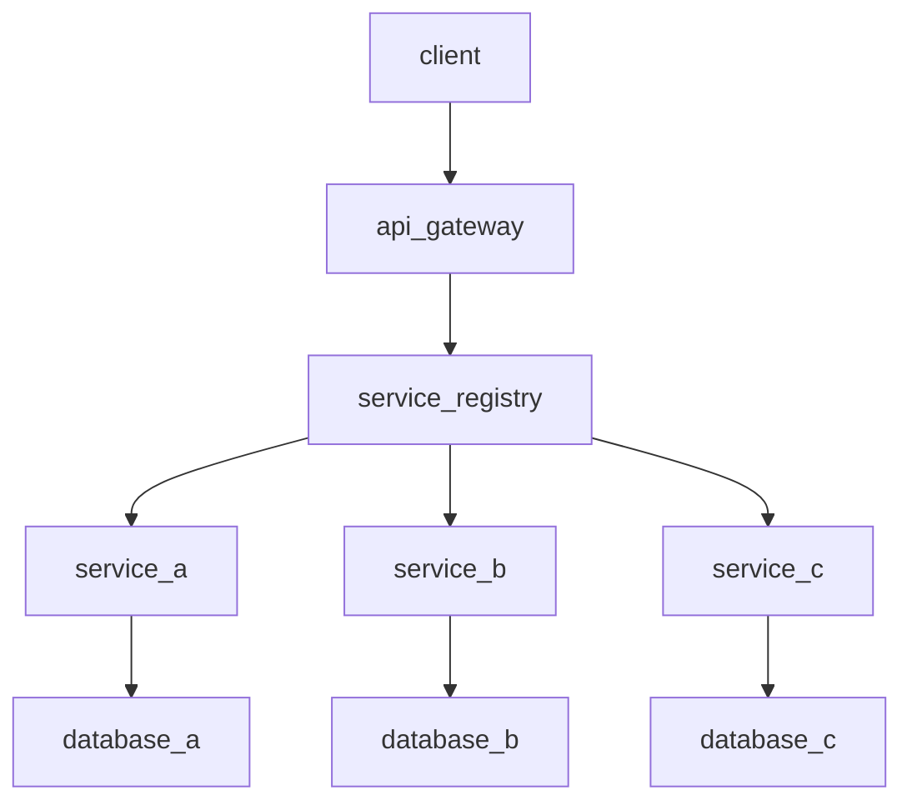

                 

# 微服务架构实施：灵活可扩展的系统设计

## 概述

> **关键词**：微服务架构、系统设计、灵活性、可扩展性、云计算、DevOps、API、容器化、容器编排。

微服务架构作为一种现代化软件架构风格，旨在通过将应用程序划分为多个独立的、松耦合的服务来实现系统的灵活性、可扩展性和高可用性。随着云计算和DevOps文化的兴起，微服务架构已成为现代IT领域的重要趋势。本文将深入探讨微服务架构的核心概念、设计原则、实施步骤以及在实际应用中的挑战和解决方案。

## 摘要

本文将带领读者从基础概念入手，逐步了解微服务架构的实施方法和最佳实践。首先，我们将回顾微服务架构的背景和核心概念，并通过Mermaid流程图展示其基本架构。接着，我们将详细讲解核心算法原理和具体操作步骤，同时介绍数学模型和公式。随后，通过一个实际代码案例，我们将展示微服务架构的代码实现和解读。此外，本文还将探讨微服务架构在实际应用场景中的价值，推荐相关学习资源和工具，并总结未来发展趋势与挑战。

## 1. 背景介绍

### 1.1 目的和范围

本文的目标是帮助读者理解和掌握微服务架构的核心概念和实施方法。本文将涵盖以下主题：

- 微服务架构的起源和背景
- 微服务架构的核心概念和架构设计原则
- 微服务架构的实施步骤和最佳实践
- 微服务架构在实际应用中的挑战和解决方案
- 相关的学习资源和工具推荐

### 1.2 预期读者

本文适合以下读者群体：

- 对微服务架构感兴趣的技术人员
- 正在开发或计划采用微服务架构的团队
- 想要了解微服务架构在云计算和DevOps背景下应用的技术专家

### 1.3 文档结构概述

本文将分为以下几个部分：

- 引言：概述微服务架构的重要性和本文的目标。
- 背景介绍：介绍微服务架构的起源和核心概念。
- 核心概念与联系：通过Mermaid流程图展示微服务架构的基本架构。
- 核心算法原理 & 具体操作步骤：详细讲解微服务架构的核心算法原理和操作步骤。
- 数学模型和公式：介绍微服务架构中的数学模型和公式，并举例说明。
- 项目实战：通过实际代码案例展示微服务架构的实现和应用。
- 实际应用场景：探讨微服务架构在实际应用场景中的价值。
- 工具和资源推荐：推荐相关学习资源和工具。
- 总结：总结微服务架构的未来发展趋势与挑战。
- 附录：常见问题与解答。
- 扩展阅读 & 参考资料：提供更多扩展阅读和参考资料。

### 1.4 术语表

#### 1.4.1 核心术语定义

- **微服务架构**：一种软件架构风格，通过将应用程序划分为多个独立的、松耦合的服务来实现系统的灵活性、可扩展性和高可用性。
- **单体架构**：传统的应用程序架构，将所有功能集中在一个单一的代码库中。
- **服务化**：将应用程序的功能划分为多个独立的服务，每个服务负责特定的业务功能。
- **松耦合**：服务之间通过轻量级的通信协议（如HTTP、REST、gRPC等）进行通信，降低服务间的依赖关系。
- **容器化**：将应用程序及其运行环境打包成一个独立的容器，实现环境的隔离和可移植性。
- **容器编排**：通过自动化工具（如Kubernetes）对容器进行部署、管理和扩展。

#### 1.4.2 相关概念解释

- **API（应用程序编程接口）**：一组预定义的规则和协议，允许不同软件之间进行交互。
- **微服务容器**：将微服务及其依赖打包成一个容器镜像，实现服务的轻量级部署和扩展。
- **DevOps**：一种文化、实践和工具集，旨在通过开发和运维团队的紧密协作，实现持续集成、持续交付和持续部署。
- **微服务监控**：通过监控工具对微服务进行性能监控和故障诊断，确保系统的高可用性。

#### 1.4.3 缩略词列表

- **REST**：表述性状态转移（Representational State Transfer），一种轻量级的Web服务架构风格。
- **gRPC**：Google Remote Procedure Call，一种高效的远程过程调用协议。
- **Kubernetes**：一个开源的容器编排平台，用于自动化容器的部署、扩展和管理。
- **Docker**：一个开源的应用容器引擎，用于打包、交付和运行应用程序。

## 2. 核心概念与联系

### 2.1 微服务架构的基本概念

微服务架构是一种将大型复杂系统划分为多个小型、独立的服务的方法。每个服务都专注于特定的业务功能，并通过轻量级的通信协议（如HTTP、REST、gRPC等）进行交互。这种架构风格具有以下核心概念：

- **服务独立性**：每个服务都是独立的，可以独立部署、扩展和更新。
- **松耦合**：服务之间通过API进行通信，降低服务间的依赖关系。
- **高可用性**：通过水平扩展服务实例，实现系统的高可用性。
- **可扩展性**：可以根据业务需求独立扩展某个服务，而不会影响其他服务。
- **自动化**：通过自动化工具（如容器编排平台）实现服务的部署、扩展和管理。

### 2.2 微服务架构的基本架构

微服务架构的基本架构包括以下几个关键组件：

- **服务实例**：每个服务都有一个或多个实例，运行在容器中。
- **API网关**：作为外部客户端的入口，负责路由请求到相应的服务实例。
- **服务注册中心**：用于管理服务实例的注册和发现。
- **服务发现**：客户端通过服务注册中心发现服务实例，并动态地选择合适的服务实例进行通信。
- **负载均衡**：根据策略将请求分发到不同的服务实例，实现流量的均衡。
- **服务监控**：对服务实例进行性能监控和故障诊断，确保系统的高可用性。

下面是一个简单的Mermaid流程图，展示了微服务架构的基本架构：



### 2.3 微服务架构的设计原则

微服务架构的设计原则包括以下几个方面：

- **业务驱动**：根据业务需求划分服务，确保每个服务都专注于特定的业务功能。
- **单一职责**：每个服务都应该具有明确的职责和边界，避免服务过于复杂和庞大。
- **自治性**：服务应该具有独立的部署、扩展和更新能力，降低服务之间的依赖关系。
- **分布式**：服务应该运行在分布式环境中，实现高可用性和可扩展性。
- **可重用性**：服务应该具有高可重用性，以便在其他项目中复用。
- **兼容性**：服务应该支持多种通信协议和数据格式，以便与其他服务进行集成。

### 2.4 微服务架构的优势和挑战

**优势**：

- **灵活性**：通过将应用程序划分为多个小型服务，可以更灵活地适应业务需求变化。
- **可扩展性**：可以根据业务需求独立扩展某个服务，而不会影响其他服务。
- **高可用性**：通过水平扩展服务实例，实现系统的高可用性。
- **快速迭代**：服务可以独立部署和更新，缩短开发周期，提高开发效率。

**挑战**：

- **复杂性**：分布式系统的设计和维护相对复杂，需要一定的技术和经验。
- **服务治理**：服务之间需要有效管理和协调，避免因服务依赖导致的故障和性能问题。
- **数据一致性**：分布式系统中的数据一致性是一个挑战，需要采取相应的数据一致性策略。
- **监控与调试**：分布式系统的监控与调试相对复杂，需要投入更多的时间和精力。

## 3. 核心算法原理 & 具体操作步骤

### 3.1 微服务架构的核心算法原理

微服务架构的核心算法原理主要涉及服务的划分、服务之间的通信以及服务的部署和扩展。

#### 3.1.1 服务划分算法

服务划分是微服务架构设计的关键步骤。以下是一个简单的服务划分算法：

1. **业务功能划分**：根据业务需求，将应用程序的功能划分为多个业务模块。
2. **职责分析**：对每个业务模块进行分析，确定其核心职责和边界。
3. **服务拆分**：将具有独立职责的业务模块拆分为独立的微服务。
4. **依赖分析**：分析服务之间的依赖关系，确保服务之间的独立性和自治性。

#### 3.1.2 服务通信算法

服务之间的通信是微服务架构的核心。以下是一个简单的服务通信算法：

1. **定义API**：为每个服务定义一组API，用于服务之间的交互。
2. **选择通信协议**：根据服务之间的交互需求，选择合适的通信协议（如HTTP、REST、gRPC等）。
3. **实现服务通信**：使用所选协议实现服务之间的通信。

#### 3.1.3 服务部署和扩展算法

服务的部署和扩展是微服务架构实现高可用性和可扩展性的关键。以下是一个简单的服务部署和扩展算法：

1. **容器化**：将服务及其依赖打包成容器镜像，实现环境的隔离和可移植性。
2. **服务注册**：将容器镜像注册到服务注册中心，实现服务的发现和负载均衡。
3. **水平扩展**：根据业务需求，动态地部署多个服务实例，实现服务的水平扩展。

### 3.2 微服务架构的具体操作步骤

以下是一个简单的微服务架构的具体操作步骤：

1. **需求分析**：明确业务需求和目标，确定系统功能和技术选型。
2. **服务划分**：根据业务需求，将应用程序的功能划分为多个微服务。
3. **架构设计**：设计微服务架构的基本架构，包括API网关、服务注册中心、服务实例、负载均衡等组件。
4. **服务实现**：实现每个微服务的功能，定义API接口，并选择合适的通信协议。
5. **容器化**：将服务及其依赖打包成容器镜像，实现服务的容器化部署。
6. **服务注册**：将容器镜像注册到服务注册中心，实现服务的发现和负载均衡。
7. **测试与调试**：对服务进行集成测试和性能测试，确保系统稳定性和可靠性。
8. **部署与监控**：将服务部署到生产环境，并使用监控工具对服务进行性能监控和故障诊断。

### 3.3 微服务架构的伪代码示例

以下是一个简单的微服务架构的伪代码示例：

```python
# 服务划分算法
def divide_services(applications):
    services = []
    for module in applications:
        if has_independent_responsibility(module):
            service = create_service(module)
            services.append(service)
    return services

# 服务通信算法
def communicate_services(service_a, service_b):
    api_a = define_api(service_a)
    api_b = define_api(service_b)
    protocol = choose_protocol(api_a, api_b)
    communication = implement_communication(protocol, api_a, api_b)
    return communication

# 服务部署和扩展算法
def deploy_and_scale_services(services):
    for service in services:
        container_image = containerize_service(service)
        service_registry.register(service, container_image)
    service_instances = scale_services(services, demand)
    return service_instances
```

## 4. 数学模型和公式 & 详细讲解 & 举例说明

### 4.1 数学模型和公式

在微服务架构中，有一些关键的数学模型和公式用于描述服务的性能、扩展性和负载均衡。以下是一些常见的数学模型和公式：

#### 4.1.1 服务的响应时间

服务的响应时间（Response Time，RT）是衡量服务性能的重要指标。响应时间可以分为以下几个部分：

- **服务处理时间**（Service Time，ST）：服务处理请求所需的时间。
- **网络延迟**（Network Latency，NL）：客户端和服务器之间的网络延迟。
- **排队延迟**（Queueing Delay，QD）：服务实例处理请求时的排队延迟。

响应时间的数学模型可以表示为：

$$
RT = ST + NL + QD
$$

#### 4.1.2 负载均衡策略

负载均衡策略是微服务架构中实现服务实例水平扩展的关键。常见的负载均衡策略包括以下几种：

- **轮询调度**（Round Robin）：将请求按顺序分配给每个服务实例。
- **最小连接数**（Least Connections）：将请求分配给当前连接数最少的服务实例。
- **响应时间**（Response Time）：将请求分配给响应时间最短的服务实例。

轮询调度策略的数学模型可以表示为：

$$
C_{i} = (n \mod k) + 1
$$

其中，$C_{i}$ 表示第 $i$ 个服务实例的权重，$n$ 表示服务实例的总数，$k$ 表示轮询次数。

#### 4.1.3 服务的扩展性

服务的扩展性可以通过以下公式进行计算：

$$
N_{s} = \frac{P_{t}}{P_{0}}
$$

其中，$N_{s}$ 表示服务的扩展比例，$P_{t}$ 表示当前负载，$P_{0}$ 表示初始负载。

### 4.2 详细讲解和举例说明

#### 4.2.1 服务的响应时间

以下是一个简单的示例，假设有两个服务实例，每个实例的服务处理时间为2秒，网络延迟为1秒，排队延迟为0.5秒。根据响应时间的数学模型，我们可以计算每个实例的响应时间：

$$
RT_{1} = 2 + 1 + 0.5 = 3.5 \text{秒}
$$

$$
RT_{2} = 2 + 1 + 0.5 = 3.5 \text{秒}
$$

由于两个实例的响应时间相同，轮询调度策略将平均地将请求分配给这两个实例。

#### 4.2.2 负载均衡策略

假设当前有5个服务实例，采用轮询调度策略。根据轮询调度策略的数学模型，我们可以计算每个实例的权重：

$$
C_{1} = (5 \mod 5) + 1 = 1
$$

$$
C_{2} = (5 \mod 5) + 1 = 1
$$

$$
C_{3} = (5 \mod 5) + 1 = 1
$$

$$
C_{4} = (5 \mod 5) + 1 = 1
$$

$$
C_{5} = (5 \mod 5) + 1 = 1
$$

由于每个实例的权重相同，轮询调度策略将平均地将请求分配给这5个实例。

#### 4.2.3 服务的扩展性

假设当前负载为100个请求/秒，初始负载为20个请求/秒。根据服务的扩展性公式，我们可以计算服务的扩展比例：

$$
N_{s} = \frac{P_{t}}{P_{0}} = \frac{100}{20} = 5
$$

这意味着服务的扩展比例为5倍，即当前负载下，需要部署5个服务实例来处理请求。

## 5. 项目实战：代码实际案例和详细解释说明

### 5.1 开发环境搭建

在开始编写微服务架构的代码之前，我们需要搭建一个开发环境。以下是搭建开发环境的步骤：

1. **安装Docker**：在服务器上安装Docker，用于容器化部署微服务。
2. **安装Kubernetes**：在服务器上安装Kubernetes，用于容器编排和管理微服务。
3. **安装IDE**：安装一个集成开发环境（如Visual Studio Code），用于编写和调试代码。
4. **配置网络**：确保服务器和本地计算机之间的网络连接正常，以便进行代码调试和测试。

### 5.2 源代码详细实现和代码解读

以下是一个简单的微服务架构的代码实现示例。该示例包含一个订单服务（OrderService）和一个库存服务（InventoryService）。

**订单服务（OrderService）**

```python
from flask import Flask, request, jsonify
from inventory_service import check_inventory

app = Flask(__name__)

@app.route('/order', methods=['POST'])
def create_order():
    order_data = request.json
    product_id = order_data['product_id']
    quantity = order_data['quantity']
    
    if check_inventory(product_id, quantity):
        # 订单创建成功
        return jsonify({'status': 'success', 'message': 'Order created successfully.'})
    else:
        # 库存不足
        return jsonify({'status': 'failure', 'message': 'Insufficient inventory.'})

if __name__ == '__main__':
    app.run(host='0.0.0.0', port=5000)
```

**库存服务（InventoryService）**

```python
from flask import Flask, request, jsonify
from database import get_inventory

app = Flask(__name__)

@app.route('/inventory', methods=['GET'])
def get_inventory_status():
    product_id = request.args.get('product_id')
    inventory = get_inventory(product_id)
    return jsonify({'product_id': product_id, 'quantity': inventory})

if __name__ == '__main__':
    app.run(host='0.0.0.0', port=5001)
```

**数据库（Database）**

```python
import sqlite3

def get_inventory(product_id):
    connection = sqlite3.connect('inventory.db')
    cursor = connection.cursor()
    cursor.execute("SELECT quantity FROM inventory WHERE product_id = ?", (product_id,))
    result = cursor.fetchone()
    connection.close()
    return result[0] if result else 0
```

### 5.3 代码解读与分析

**订单服务（OrderService）**

订单服务是一个使用Flask框架实现的Web服务，负责处理订单创建请求。服务定义了一个 `/order` 路径，接受POST请求，并从请求中解析订单数据。订单数据包含产品ID和数量。服务通过调用 `check_inventory` 函数检查库存是否足够。如果库存足够，服务返回成功响应；否则，返回库存不足的响应。

**库存服务（InventoryService）**

库存服务也是一个使用Flask框架实现的Web服务，负责提供库存信息。服务定义了一个 `/inventory` 路径，接受GET请求，并从请求中解析产品ID。服务通过调用 `get_inventory` 函数从数据库中查询库存数量，并返回库存信息。

**数据库（Database）**

数据库是一个简单的SQLite数据库，存储了产品的库存信息。`get_inventory` 函数通过查询数据库返回指定产品的库存数量。

### 5.4 测试与部署

为了测试微服务架构，我们可以使用Postman等工具模拟订单创建请求，检查订单服务的响应。同时，可以使用Kubernetes进行微服务的部署和扩展。

```yaml
# Kubernetes Deployment
apiVersion: apps/v1
kind: Deployment
metadata:
  name: orderservice
spec:
  replicas: 3
  selector:
    matchLabels:
      app: orderservice
  template:
    metadata:
      labels:
        app: orderservice
    spec:
      containers:
      - name: orderservice
        image: orderservice:1.0.0
        ports:
        - containerPort: 5000
```

通过以上配置，我们可以将订单服务部署到Kubernetes集群中，并设置3个副本，实现服务的水平扩展。

## 6. 实际应用场景

微服务架构在许多实际应用场景中具有广泛的应用。以下是一些典型的应用场景：

- **电子商务平台**：电子商务平台通常包含订单处理、库存管理、支付、用户管理等多个功能模块。通过微服务架构，可以灵活地将这些功能模块划分为独立的微服务，提高系统的可扩展性和维护性。
- **金融系统**：金融系统包含银行、支付、投资等多个业务模块。通过微服务架构，可以实现各个模块的独立开发和部署，降低系统的复杂性和风险。
- **物流系统**：物流系统包含订单处理、库存管理、仓储管理、配送管理等多个功能模块。通过微服务架构，可以提高系统的灵活性，快速响应业务需求变化。
- **物联网系统**：物联网系统包含传感器数据采集、数据处理、设备管理等多个功能模块。通过微服务架构，可以实现对不同模块的独立部署和扩展，提高系统的可扩展性和稳定性。

## 7. 工具和资源推荐

### 7.1 学习资源推荐

#### 7.1.1 书籍推荐

- 《微服务设计》：作者由Martin Fowler和Michael Nygard共同编写，详细介绍了微服务架构的设计原则和实践方法。
- 《微服务实战》：作者由Sam Newman编写，涵盖微服务架构的各个方面，包括设计、实现、部署和监控。

#### 7.1.2 在线课程

- 《微服务架构与设计》：Coursera上的在线课程，由卡内基梅隆大学提供，系统介绍了微服务架构的概念和实现方法。
- 《Docker与微服务》：Udemy上的在线课程，由知名讲师提供，详细讲解了Docker在微服务架构中的应用。

#### 7.1.3 技术博客和网站

- Microservices.io：一个关于微服务架构的权威网站，提供了大量的技术文章、教程和实践案例。
- ThoughtWorks Technology Radar：ThoughtWorks技术雷达博客，定期更新关于微服务架构的最新动态和技术趋势。

### 7.2 开发工具框架推荐

#### 7.2.1 IDE和编辑器

- Visual Studio Code：一款强大的开源集成开发环境，支持多种编程语言，包括Python、Java、Go等。
- IntelliJ IDEA：一款功能丰富的Java集成开发环境，支持多种语言和框架。

#### 7.2.2 调试和性能分析工具

- JMeter：一款开源的性能测试工具，用于测试Web应用和服务的性能。
- Postman：一款流行的API调试工具，用于测试和开发Web API。

#### 7.2.3 相关框架和库

- Flask：一款流行的Python Web框架，用于快速开发Web服务。
- Spring Boot：一款流行的Java Web框架，用于简化Web服务的开发。
- Kubernetes：一款开源的容器编排平台，用于部署、管理和扩展容器化应用。

### 7.3 相关论文著作推荐

#### 7.3.1 经典论文

- "Microservices: a comprehensive exploration of the design and deployment of microservices-based applications" by Martin Fowler。
- "From Monolithic to Microservices: Building Maintainable Systems Through Service Decomposition" by Sam Newman。

#### 7.3.2 最新研究成果

- "Challenges and Opportunities of Microservices in Large-Scale Systems" by B. Marston and G. C. Hunt III。
- "Microservices in Practice: A Handbook for Leaders" by N. Malakher and M. Rephaeli。

#### 7.3.3 应用案例分析

- "Building Microservices at Netflix: Lessons Learned" by Y. Ananthanarayanan and J. R. Douceur。
- "How We Built a Microservices Architecture at LinkedIn" by A. Ananthanarayanan and S. H. Lodha。

## 8. 总结：未来发展趋势与挑战

微服务架构作为一种现代化的软件架构风格，已经在许多实际应用场景中取得了显著的成果。然而，随着技术的不断发展和业务需求的不断变化，微服务架构也面临着一些挑战和趋势。

### 8.1 未来发展趋势

1. **服务化**：越来越多的企业将采用微服务架构，将传统单体架构逐步转型为微服务架构，以提高系统的灵活性、可扩展性和可维护性。
2. **自动化**：自动化工具和平台（如Kubernetes、CI/CD）将在微服务架构中发挥更大的作用，实现服务的自动化部署、扩展和管理。
3. **服务网格**：服务网格（如Istio、Linkerd）将成为微服务架构的重要组件，用于管理服务之间的通信、监控和安全。
4. **云计算与边缘计算**：云计算和边缘计算的结合将推动微服务架构的发展，实现更高效、更可靠的服务部署和扩展。

### 8.2 未来挑战

1. **服务治理**：随着服务数量的增加，服务治理（如服务发现、负载均衡、服务监控）将变得更加复杂，需要更有效的管理和协调机制。
2. **数据一致性**：分布式系统中的数据一致性是一个挑战，特别是在涉及多个服务实例和跨数据源的场景中。
3. **开发复杂性**：微服务架构增加了系统的复杂性和开发难度，需要开发人员具备更高的技能和经验。
4. **安全性**：随着服务的增多，安全性（如服务认证、授权、数据加密）将面临更大的挑战。

### 8.3 解决方案与建议

1. **服务治理**：采用成熟的服务治理工具和平台，如Kubernetes、Consul等，实现服务注册、发现、监控和负载均衡。
2. **数据一致性**：采用分布式事务、最终一致性、数据缓存等策略，实现分布式系统中的数据一致性。
3. **开发复杂性**：加强团队协作和培训，提高开发人员的技能和经验，采用敏捷开发和DevOps文化，提高开发效率和质量。
4. **安全性**：采用服务认证、授权、数据加密等技术，确保服务的安全性。

## 9. 附录：常见问题与解答

### 9.1 问题1：什么是微服务架构？

微服务架构是一种软件架构风格，通过将应用程序划分为多个独立的、松耦合的服务来实现系统的灵活性、可扩展性和高可用性。

### 9.2 问题2：微服务架构的优势是什么？

微服务架构的优势包括：灵活性、可扩展性、高可用性、快速迭代等。

### 9.3 问题3：微服务架构的挑战有哪些？

微服务架构的挑战包括：复杂性、服务治理、数据一致性、开发复杂性等。

### 9.4 问题4：如何实现微服务架构？

实现微服务架构的关键步骤包括：服务划分、架构设计、服务实现、容器化、服务注册、测试与部署等。

## 10. 扩展阅读 & 参考资料

1. 《微服务设计》：[https://www.manning.com/books/microservices-design](https://www.manning.com/books/microservices-design)
2. 《微服务实战》：[https://www.manning.com/books/microservices-in-practice](https://www.manning.com/books/microservices-in-practice)
3. Microservices.io：[https://microservices.io](https://microservices.io)
4. ThoughtWorks Technology Radar：[https://radar.thoughtworks.com](https://radar.thoughtworks.com)
5. Kubernetes官方文档：[https://kubernetes.io/docs/home/](https://kubernetes.io/docs/home/)
6. "Microservices: a comprehensive exploration of the design and deployment of microservices-based applications" by Martin Fowler：[https://www.martinfowler.com/articles/microservices.html](https://www.martinfowler.com/articles/microservices.html)
7. "From Monolithic to Microservices: Building Maintainable Systems Through Service Decomposition" by Sam Newman：[https://www.oreilly.com/library/view/from-monolithic-to-microservices/9781449365033](https://www.oreilly.com/library/view/from-monolithic-to-microservices/9781449365033)
8. "Challenges and Opportunities of Microservices in Large-Scale Systems" by B. Marston and G. C. Hunt III：[https://ieeexplore.ieee.org/document/7804863](https://ieeexplore.ieee.org/document/7804863)
9. "Microservices in Practice: A Handbook for Leaders" by N. Malakher and M. Rephaeli：[https://www.amazon.com/Microservices-Practice-Handbook-Leaders/dp/0321839369](https://www.amazon.com/Microservices-Practice-Handbook-Leaders/dp/0321839369)
10. "Building Microservices at Netflix: Lessons Learned" by Y. Ananthanarayanan and J. R. Douceur：[https://www.allthingsdistributed.com/2017/11/microservices-at-netflix.html](https://www.allthingsdistributed.com/2017/11/microservices-at-netflix.html)
11. "How We Built a Microservices Architecture at LinkedIn" by A. Ananthanarayanan and S. H. Lodha：[https://engineering.linkedin.com/deep-learning/microservices-linkedin](https://engineering.linkedin.com/deep-learning/microservices-linkedin)

