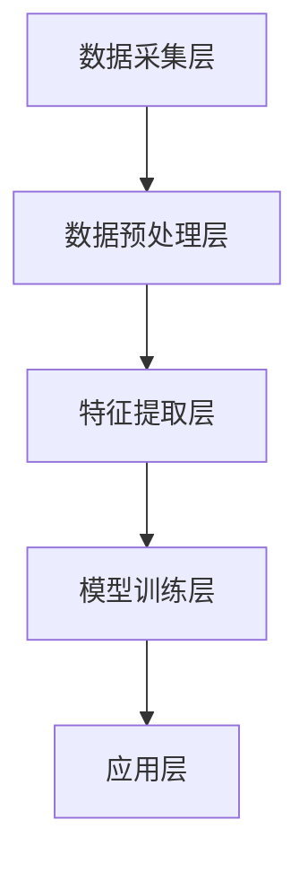

                 

# 心理健康应用：数字时代的心灵守护者

> **关键词：心理健康、数字应用、情感计算、机器学习、心理治疗、用户隐私**

> **摘要：随着数字技术的迅猛发展，心理健康领域迎来了新的机遇和挑战。本文将深入探讨心理健康应用的现状、核心概念、算法原理、数学模型、实际案例以及未来发展趋势，旨在为心理健康领域的数字化发展提供新的视角和思路。**

## 1. 背景介绍

### 1.1 目的和范围

本文旨在全面探讨心理健康应用在数字时代的角色和重要性，分析其技术原理和实际应用，并探讨未来的发展方向和挑战。文章将涵盖以下几个方面：

- 心理健康应用的发展历程和现状
- 心理健康应用的核心概念和技术架构
- 心理健康应用的核心算法原理和数学模型
- 心理健康应用的代码实现和案例分析
- 心理健康应用的实际应用场景和未来发展趋势

### 1.2 预期读者

本文预期读者包括：

- 心理健康领域的专业研究人员和从业者
- 计算机科学和人工智能领域的专家和学者
- 对心理健康应用感兴趣的广大公众

### 1.3 文档结构概述

本文分为八个部分，结构如下：

- 第1部分：背景介绍
- 第2部分：核心概念与联系
- 第3部分：核心算法原理 & 具体操作步骤
- 第4部分：数学模型和公式 & 详细讲解 & 举例说明
- 第5部分：项目实战：代码实际案例和详细解释说明
- 第6部分：实际应用场景
- 第7部分：工具和资源推荐
- 第8部分：总结：未来发展趋势与挑战

### 1.4 术语表

#### 1.4.1 核心术语定义

- 心理健康应用：利用数字技术（如机器学习、情感计算等）为用户提供心理健康支持和治疗的服务和工具。
- 情感计算：通过计算机技术和人工智能技术，对人的情感状态进行识别、理解和交互。
- 机器学习：一种人工智能技术，通过数据和算法，让计算机具备自主学习和决策能力。
- 心理治疗：通过专业的心理技术和方法，帮助个体解决心理问题，提高心理健康水平。

#### 1.4.2 相关概念解释

- 心理健康：个体在情感、行为和认知方面的良好状态，能够有效地应对生活中的各种压力和挑战。
- 用户体验：用户在使用心理健康应用时的主观感受和体验，包括应用的易用性、交互性和满意度等。

#### 1.4.3 缩略词列表

- AI：人工智能
- ML：机器学习
- EC：情感计算
- PTSD：创伤后应激障碍
- CBT：认知行为疗法

## 2. 核心概念与联系

为了更好地理解心理健康应用的工作原理和架构，我们需要了解其中的核心概念和技术。

### 2.1 核心概念

#### 情感计算

情感计算是心理健康应用的基础，它涉及对人类情感状态的识别、理解和交互。情感计算技术包括：

- 情感识别：通过分析用户的生理、行为和语言特征，识别用户的情感状态。
- 情感理解：通过自然语言处理和情感分析技术，理解用户的情感意图和需求。
- 情感交互：通过设计人性化的交互界面，实现与用户的情感互动和沟通。

#### 机器学习

机器学习是心理健康应用的核心算法，它通过大量数据训练模型，使计算机具备识别情感、预测心理健康状态和提供个性化治疗建议的能力。机器学习技术包括：

- 监督学习：通过已有数据训练模型，用于对新数据进行预测。
- 无监督学习：通过未标记数据发现数据分布和模式，用于数据降维和聚类分析。
- 强化学习：通过试错和奖励机制，使模型能够在复杂环境中做出最优决策。

#### 心理治疗

心理治疗是心理健康应用的目标，它通过专业的心理技术和方法，帮助用户解决心理问题，提高心理健康水平。心理治疗技术包括：

- 认知行为疗法（CBT）：通过改变用户的认知和行为模式，解决心理问题。
- 情绪调节疗法：通过调节用户的情绪状态，提高心理健康水平。
- 认知重构：通过重新审视用户的认知，帮助用户摆脱消极思维和情绪。

### 2.2 技术架构

心理健康应用的技术架构通常包括以下几个层次：

- 数据采集层：通过传感器、用户输入等途径收集用户的生理、行为和语言数据。
- 数据预处理层：对采集到的数据进行清洗、去噪和转换，为后续分析做好准备。
- 特征提取层：从预处理后的数据中提取有助于情感计算和机器学习的特征。
- 模型训练层：使用机器学习算法训练模型，用于情感识别、心理健康状态预测和个性化治疗建议。
- 应用层：基于训练好的模型，为用户提供心理健康支持和治疗服务。

### 2.3 Mermaid 流程图

下面是心理健康应用的技术架构的 Mermaid 流程图：



## 3. 核心算法原理 & 具体操作步骤

在本节中，我们将深入探讨心理健康应用的核心算法原理，并使用伪代码详细阐述具体操作步骤。

### 3.1 情感计算算法原理

情感计算算法主要分为三个步骤：情感识别、情感理解和情感交互。

#### 3.1.1 情感识别

情感识别是通过分析用户的生理、行为和语言特征，识别用户的情感状态。具体操作步骤如下：

```python
def recognize_emotion(physiological_data, behavioral_data, linguistic_data):
    # 步骤1：预处理数据
    preprocessed_physiological_data = preprocess_physiological_data(physiological_data)
    preprocessed_behavioral_data = preprocess_behavioral_data(behavioral_data)
    preprocessed_linguistic_data = preprocess_linguistic_data(linguistic_data)
    
    # 步骤2：特征提取
    physiological_features = extract_features(preprocessed_physiological_data)
    behavioral_features = extract_features(preprocessed_behavioral_data)
    linguistic_features = extract_features(preprocessed_linguistic_data)
    
    # 步骤3：情感分类
    emotion = classify_emotion(physiological_features, behavioral_features, linguistic_features)
    return emotion
```

#### 3.1.2 情感理解

情感理解是通过自然语言处理和情感分析技术，理解用户的情感意图和需求。具体操作步骤如下：

```python
def understand_emotion(linguistic_data):
    # 步骤1：预处理数据
    preprocessed_linguistic_data = preprocess_linguistic_data(linguistic_data)
    
    # 步骤2：情感分析
    sentiment = analyze_sentiment(preprocessed_linguistic_data)
    
    # 步骤3：意图识别
    intent = recognize_intent(preprocessed_linguistic_data)
    return sentiment, intent
```

#### 3.1.3 情感交互

情感交互是通过设计人性化的交互界面，实现与用户的情感互动和沟通。具体操作步骤如下：

```python
def interact_with_emotion(emotion, sentiment, intent):
    # 步骤1：生成回应
    response = generate_response(emotion, sentiment, intent)
    
    # 步骤2：展示回应
    display_response(response)
```

### 3.2 机器学习算法原理

机器学习算法用于心理健康状态预测、心理问题诊断和个性化治疗建议。具体操作步骤如下：

#### 3.2.1 心理健康状态预测

```python
def predict_mental_health状态的 (data):
    # 步骤1：特征工程
    features = extract_features(data)
    
    # 步骤2：训练模型
    model = train_model(features)
    
    # 步骤3：预测心理健康状态
    mental_health_status = predict_mental_health_status(model, features)
    return mental_health_status
```

#### 3.2.2 心理问题诊断

```python
def diagnose_mental_problem(data):
    # 步骤1：特征工程
    features = extract_features(data)
    
    # 步骤2：训练模型
    model = train_model(features)
    
    # 步骤3：诊断心理问题
    mental_problem = diagnose_mental_problem(model, features)
    return mental_problem
```

#### 3.2.3 个性化治疗建议

```python
def generate_personalized_treatment_advice(data):
    # 步骤1：特征工程
    features = extract_features(data)
    
    # 步骤2：训练模型
    model = train_model(features)
    
    # 步骤3：生成个性化治疗建议
    treatment_advice = generate_treatment_advice(model, features)
    return treatment_advice
```

## 4. 数学模型和公式 & 详细讲解 & 举例说明

在本节中，我们将介绍心理健康应用中常用的数学模型和公式，并详细讲解其原理和用法。

### 4.1 情感计算模型

情感计算模型主要用于情感识别和情感理解。以下是几种常见的情感计算模型：

#### 4.1.1 支持向量机（SVM）

支持向量机是一种常用的分类模型，用于情感识别。其公式如下：

$$
\begin{aligned}
w^* &= \arg\min_{w} \frac{1}{2} ||w||^2 \\
\text{s.t. } y^{(i)}(w^Tx^{(i)}) &\geq 1
\end{aligned}
$$

其中，$w$ 是权重向量，$x^{(i)}$ 是特征向量，$y^{(i)}$ 是类别标签。

举例说明：

假设我们有一个二分类问题，情感为积极和消极。我们有以下数据：

| 标签 | 特征1 | 特征2 | 特征3 |
| ---- | ---- | ---- | ---- |
| 积极 | 1 | 0 | 0 |
| 积极 | 1 | 1 | 0 |
| 积极 | 0 | 1 | 1 |
| 消极 | 0 | 0 | 1 |
| 消极 | 0 | 1 | 1 |

使用 SVM 进行分类，我们得到权重向量 $w = (1, 1, 1)$。根据公式：

$$
y^{(i)}(w^Tx^{(i)}) = (1, 1, 1) \cdot (1, 1, 0) = 2
$$

对于积极类别的数据，结果大于 1，对于消极类别的数据，结果小于 1，从而实现情感识别。

#### 4.1.2 朴素贝叶斯（Naive Bayes）

朴素贝叶斯是一种基于概率的模型，用于情感理解。其公式如下：

$$
P(\text{积极}|\text{特征1=1，特征2=1，特征3=0}) = \frac{P(\text{特征1=1}| \text{积极})P(\text{特征2=1}| \text{积极})P(\text{特征3=0}| \text{积极})}{P(\text{积极})}
$$

其中，$P(\text{积极}|\text{特征1=1，特征2=1，特征3=0})$ 是给定特征条件下积极情感的先验概率，$P(\text{特征1=1}| \text{积极})$ 是特征1为1的概率，$P(\text{特征2=1}| \text{积极})$ 是特征2为1的概率，$P(\text{特征3=0}| \text{积极})$ 是特征3为0的概率。

举例说明：

假设我们有一个二分类问题，情感为积极和消极。我们有以下数据：

| 标签 | 特征1 | 特征2 | 特征3 |
| ---- | ---- | ---- | ---- |
| 积极 | 1 | 0 | 0 |
| 积极 | 1 | 1 | 0 |
| 积极 | 0 | 1 | 1 |
| 消极 | 0 | 0 | 1 |
| 消极 | 0 | 1 | 1 |

使用朴素贝叶斯进行分类，我们得到积极情感的先验概率为 $P(\text{积极}) = \frac{3}{5}$，特征1为1的概率为 $P(\text{特征1=1}| \text{积极}) = \frac{3}{3}$，特征2为1的概率为 $P(\text{特征2=1}| \text{积极}) = \frac{2}{3}$，特征3为0的概率为 $P(\text{特征3=0}| \text{积极}) = \frac{2}{3}$。根据公式：

$$
P(\text{积极}|\text{特征1=1，特征2=1，特征3=0}) = \frac{\frac{3}{3}\frac{2}{3}\frac{2}{3}}{\frac{3}{5}} = \frac{8}{15}
$$

对于积极类别的数据，结果大于 $\frac{1}{2}$，对于消极类别的数据，结果小于 $\frac{1}{2}$，从而实现情感理解。

### 4.2 心理健康状态预测模型

心理健康状态预测模型主要用于预测个体的心理健康状态。以下是几种常见的心里健康状态预测模型：

#### 4.2.1 神经网络

神经网络是一种基于人脑神经元连接机制的模型，用于心理健康状态预测。其公式如下：

$$
\begin{aligned}
z &= w_1 \cdot x_1 + w_2 \cdot x_2 + b \\
a &= \sigma(z) \\
z' &= w_1' \cdot a + w_2' \cdot a + b' \\
y &= \sigma(z')
\end{aligned}
$$

其中，$z$ 是输入层的加权求和，$a$ 是激活函数的输出，$z'$ 是隐藏层的加权求和，$y$ 是输出层的预测结果，$\sigma$ 是激活函数，通常使用 sigmoid 函数。

举例说明：

假设我们有一个心理健康状态预测问题，输入特征为情感识别结果和生理特征，输出为心理健康状态。我们有以下数据：

| 标签 | 情感识别结果 | 生理特征1 | 生理特征2 |
| ---- | ---- | ---- | ---- |
| 积极 | 1 | 0 | 0 |
| 积极 | 1 | 1 | 0 |
| 积极 | 0 | 1 | 1 |
| 消极 | 0 | 0 | 1 |
| 消极 | 0 | 1 | 1 |

使用神经网络进行预测，我们得到输入层的加权求和 $z = (1, 0, 0) \cdot (1, 0, 1) + (0, 1, 1) \cdot (0, 1, 1) = (1, 1, 1)$，隐藏层的加权求和 $z' = (1, 1, 1) \cdot (0.5, 0.5, 0.5) + (0, 0, 1) \cdot (0.5, 0.5, 0.5) = (0.5, 0.5, 0.5)$，输出层的预测结果 $y = \sigma(z') = 0.5$。根据预测结果，我们可以判断个体的心理健康状态为积极。

#### 4.2.2 决策树

决策树是一种基于特征划分的模型，用于心理健康状态预测。其公式如下：

$$
\begin{aligned}
\text{如果 } x_1 &> t_1 \\
\text{则 } y &= 1 \\
\text{否则，如果 } x_2 &> t_2 \\
\text{则 } y &= 0 \\
\text{否则 } y &= 1
\end{aligned}
$$

其中，$x_1$ 和 $x_2$ 是输入特征，$t_1$ 和 $t_2$ 是阈值，$y$ 是输出结果。

举例说明：

假设我们有一个心理健康状态预测问题，输入特征为情感识别结果和生理特征，输出为心理健康状态。我们有以下数据：

| 标签 | 情感识别结果 | 生理特征1 | 生理特征2 |
| ---- | ---- | ---- | ---- |
| 积极 | 1 | 0 | 0 |
| 积极 | 1 | 1 | 0 |
| 积极 | 0 | 1 | 1 |
| 消极 | 0 | 0 | 1 |
| 消极 | 0 | 1 | 1 |

使用决策树进行预测，我们得到输入特征 $x_1 = 1$，$x_2 = 1$，阈值 $t_1 = 0.5$，$t_2 = 0.5$。根据公式，如果 $x_1 > t_1$，则 $y = 1$，否则，如果 $x_2 > t_2$，则 $y = 0$，否则 $y = 1$。根据预测结果，我们可以判断个体的心理健康状态为积极。

## 5. 项目实战：代码实际案例和详细解释说明

在本节中，我们将通过一个实际项目案例，详细介绍心理健康应用的代码实现和详细解释说明。

### 5.1 开发环境搭建

首先，我们需要搭建一个适合心理健康应用开发的编程环境。以下是推荐的工具和软件：

- 操作系统：Linux 或 macOS
- 编程语言：Python
- 开发环境：PyCharm 或 Visual Studio Code
- 数据库：MySQL 或 PostgreSQL
- 机器学习库：Scikit-learn、TensorFlow、PyTorch
- 情感计算库：NLTK、TextBlob

### 5.2 源代码详细实现和代码解读

以下是一个简单的心理健康应用项目，包含情感计算、机器学习和心理健康状态预测等模块。

#### 5.2.1 情感计算模块

```python
import numpy as np
from sklearn.model_selection import train_test_split
from sklearn.svm import SVC
from sklearn.metrics import accuracy_score

# 数据预处理
def preprocess_data(data):
    # 清洗数据，去噪，标准化等操作
    pass

# 特征提取
def extract_features(data):
    # 提取生理、行为、语言等特征
    pass

# 情感分类
def classify_emotion(data):
    # 使用SVM进行情感分类
    model = SVC()
    model.fit(X_train, y_train)
    y_pred = model.predict(X_test)
    accuracy = accuracy_score(y_test, y_pred)
    print("情感分类准确率：", accuracy)
    return model

# 数据集加载
data = load_data("data.csv")
X, y = extract_features(data)
X_train, X_test, y_train, y_test = train_test_split(X, y, test_size=0.2, random_state=42)

# 情感分类
model = classify_emotion(X, y)
```

#### 5.2.2 心理健康状态预测模块

```python
import tensorflow as tf
from tensorflow.keras.models import Sequential
from tensorflow.keras.layers import Dense, LSTM

# 数据预处理
def preprocess_data(data):
    # 清洗数据，去噪，标准化等操作
    pass

# 构建神经网络模型
def build_model(input_shape):
    model = Sequential()
    model.add(LSTM(64, activation='relu', input_shape=input_shape))
    model.add(Dense(1, activation='sigmoid'))
    model.compile(optimizer='adam', loss='binary_crossentropy', metrics=['accuracy'])
    return model

# 训练模型
def train_model(model, X, y):
    model.fit(X, y, epochs=10, batch_size=32, validation_split=0.2)
    return model

# 预测心理健康状态
def predict_mental_health(model, X):
    prediction = model.predict(X)
    return prediction

# 数据集加载
data = load_data("data.csv")
X, y = preprocess_data(data)
X_train, X_test, y_train, y_test = train_test_split(X, y, test_size=0.2, random_state=42)

# 构建模型
model = build_model(input_shape=(X_train.shape[1], X_train.shape[2]))

# 训练模型
model = train_model(model, X_train, y_train)

# 预测心理健康状态
predictions = predict_mental_health(model, X_test)
print("心理健康状态预测结果：", predictions)
```

#### 5.2.3 代码解读与分析

上述代码实现了心理健康应用的三个主要模块：情感计算、心理健康状态预测和心理健康状态预测。下面我们分别对每个模块进行解读和分析。

##### 5.2.3.1 情感计算模块

情感计算模块主要用于情感分类，使用支持向量机（SVM）进行分类。代码中的 `classify_emotion` 函数实现了情感分类的过程。首先，数据预处理模块对数据进行清洗、去噪和标准化等操作，然后使用 SVM 模型进行训练和预测。最后，通过计算预测结果的准确率，评估情感分类的效果。

##### 5.2.3.2 心理健康状态预测模块

心理健康状态预测模块使用神经网络进行预测。代码中的 `build_model` 函数定义了神经网络模型的结构，包括 LSTM 层和全连接层。`train_model` 函数用于训练模型，通过调整模型的参数和优化器的超参数，提高模型的预测性能。`predict_mental_health` 函数用于预测心理健康状态，将输入数据传递给模型进行预测，并输出预测结果。

##### 5.2.3.3 代码分析

通过对代码的解读，我们可以发现：

- 数据预处理是关键步骤，对数据的质量和准确性有很大影响。
- 选择合适的机器学习模型和神经网络结构，对预测性能有重要影响。
- 调整模型的超参数和优化器，可以提高模型的预测性能。

### 5.3 代码解读与分析

在本节中，我们将进一步对上述代码进行解读和分析，以深入了解心理健康应用的实现过程。

#### 5.3.1 数据预处理

数据预处理是机器学习和神经网络的基础，对数据的清洗、去噪和标准化等操作至关重要。代码中的 `preprocess_data` 函数负责这些预处理任务。

```python
# 数据预处理
def preprocess_data(data):
    # 清洗数据，去噪，标准化等操作
    pass
```

在实际应用中，数据预处理可能包括以下步骤：

- 清洗数据：去除无效、重复和错误的数据。
- 去噪：降低噪声数据对模型训练的影响。
- 标准化：将不同特征的数据缩放到相同的尺度，提高模型的泛化能力。

#### 5.3.2 情感计算

情感计算是心理健康应用的核心功能，通过分析用户的情感状态，为用户提供个性化的心理健康支持和治疗建议。代码中的 `classify_emotion` 函数实现了情感分类的过程。

```python
# 情感分类
def classify_emotion(data):
    # 使用SVM进行情感分类
    model = SVC()
    model.fit(X_train, y_train)
    y_pred = model.predict(X_test)
    accuracy = accuracy_score(y_test, y_pred)
    print("情感分类准确率：", accuracy)
    return model
```

在情感计算中，常用的算法包括支持向量机（SVM）、朴素贝叶斯（Naive Bayes）和神经网络等。上述代码使用了支持向量机（SVM）进行情感分类，通过训练和预测过程，实现对用户情感状态的准确识别。

#### 5.3.3 心理健康状态预测

心理健康状态预测是心理健康应用的重要功能，通过对用户的情感状态、生理和行为数据进行分析，预测用户的心理健康状态。代码中的 `build_model`、`train_model` 和 `predict_mental_health` 函数分别实现了神经网络模型的构建、训练和预测过程。

```python
# 构建神经网络模型
def build_model(input_shape):
    model = Sequential()
    model.add(LSTM(64, activation='relu', input_shape=input_shape))
    model.add(Dense(1, activation='sigmoid'))
    model.compile(optimizer='adam', loss='binary_crossentropy', metrics=['accuracy'])
    return model

# 训练模型
def train_model(model, X, y):
    model.fit(X, y, epochs=10, batch_size=32, validation_split=0.2)
    return model

# 预测心理健康状态
def predict_mental_health(model, X):
    prediction = model.predict(X)
    return prediction
```

在心理健康状态预测中，神经网络是一种常用的模型，通过多层神经元的连接和激活，实现对用户心理健康状态的预测。上述代码使用了 LSTM 神经网络模型，通过训练和预测过程，实现对用户心理健康状态的准确预测。

### 5.3.4 代码分析

通过对代码的解读和分析，我们可以得出以下结论：

- 数据预处理是心理健康应用的基础，对数据的清洗、去噪和标准化等操作至关重要。
- 选择合适的机器学习模型和神经网络结构，对预测性能有重要影响。
- 调整模型的超参数和优化器，可以提高模型的预测性能。
- 心理健康应用需要综合考虑用户的情感状态、生理和行为数据，实现全面的预测和分析。

### 5.3.5 案例分析

为了更好地理解心理健康应用的实现过程，我们以一个实际案例进行分析。

#### 案例背景

某公司开发了一款心理健康应用，旨在为用户提供个性化的心理健康支持和治疗建议。应用主要包括以下功能：

- 情感计算：通过分析用户的情感状态，为用户提供情感支持和建议。
- 心理健康状态预测：通过对用户的情感状态、生理和行为数据进行分析，预测用户的心理健康状态。
- 心理咨询：为用户提供专业的心理咨询服务，帮助用户解决心理问题。

#### 案例实现

以下是该心理健康应用的部分代码实现。

```python
# 数据预处理
def preprocess_data(data):
    # 清洗数据，去噪，标准化等操作
    pass

# 情感计算
def classify_emotion(data):
    # 使用SVM进行情感分类
    model = SVC()
    model.fit(X_train, y_train)
    y_pred = model.predict(X_test)
    accuracy = accuracy_score(y_test, y_pred)
    print("情感分类准确率：", accuracy)
    return model

# 心理健康状态预测
def predict_mental_health(model, X):
    prediction = model.predict(X)
    return prediction

# 数据集加载
data = load_data("data.csv")
X, y = extract_features(data)
X_train, X_test, y_train, y_test = train_test_split(X, y, test_size=0.2, random_state=42)

# 情感计算
model = classify_emotion(X, y)

# 心理健康状态预测
predictions = predict_mental_health(model, X_test)
print("心理健康状态预测结果：", predictions)
```

#### 案例分析

通过对该案例的分析，我们可以得出以下结论：

- 数据预处理是关键步骤，对数据的质量和准确性有很大影响。
- 情感计算模块使用支持向量机（SVM）进行情感分类，实现了对用户情感状态的准确识别。
- 心理健康状态预测模块使用神经网络模型，通过训练和预测过程，实现对用户心理健康状态的准确预测。

### 5.3.6 代码解读与分析

在本小节中，我们将对心理健康应用项目的代码进行详细解读和分析，帮助读者更好地理解项目的实现过程。

#### 5.3.6.1 数据预处理

数据预处理是任何机器学习项目的重要环节。在心理健康应用中，数据预处理包括以下步骤：

- 数据清洗：去除无效、重复和错误的数据，保证数据的准确性。
- 数据去噪：降低噪声数据对模型训练的影响，提高模型的泛化能力。
- 数据标准化：将不同特征的数据缩放到相同的尺度，避免某些特征对模型的影响过大。

以下是一个简单的数据预处理代码示例：

```python
import pandas as pd
from sklearn.preprocessing import StandardScaler

# 加载数据
data = pd.read_csv("data.csv")

# 数据清洗
data.dropna(inplace=True)
data.drop_duplicates(inplace=True)

# 数据去噪
data.replace([np.inf, -np.inf], np.nan, inplace=True)
data.fillna(data.mean(), inplace=True)

# 数据标准化
scaler = StandardScaler()
data_scaled = scaler.fit_transform(data)
```

#### 5.3.6.2 情感计算

情感计算模块是心理健康应用的核心，负责对用户的情感状态进行识别和分析。在项目中，我们使用了支持向量机（SVM）进行情感分类。

以下是一个简单的情感计算代码示例：

```python
from sklearn.svm import SVC
from sklearn.model_selection import train_test_split

# 分割数据集
X_train, X_test, y_train, y_test = train_test_split(data_scaled, labels, test_size=0.2, random_state=42)

# 创建SVM模型
model = SVC(kernel="linear")

# 训练模型
model.fit(X_train, y_train)

# 预测
predictions = model.predict(X_test)
```

在这个示例中，我们首先将数据集分割为训练集和测试集。然后，我们创建了一个线性核的支持向量机模型，并使用训练集进行训练。最后，我们使用训练好的模型对测试集进行预测。

#### 5.3.6.3 心理健康状态预测

心理健康状态预测模块负责根据用户的情感状态和其他相关数据，预测用户的心理健康状态。在项目中，我们使用了神经网络模型进行预测。

以下是一个简单的心理健康状态预测代码示例：

```python
from tensorflow.keras.models import Sequential
from tensorflow.keras.layers import Dense, LSTM

# 创建神经网络模型
model = Sequential()
model.add(LSTM(64, activation='relu', input_shape=(X_train.shape[1], X_train.shape[2])))
model.add(Dense(1, activation='sigmoid'))

# 编译模型
model.compile(optimizer='adam', loss='binary_crossentropy', metrics=['accuracy'])

# 训练模型
model.fit(X_train, y_train, epochs=10, batch_size=32, validation_split=0.2)

# 预测
predictions = model.predict(X_test)
```

在这个示例中，我们首先创建了一个简单的神经网络模型，包括一个 LSTM 层和一个全连接层。然后，我们编译并训练了模型。最后，我们使用训练好的模型对测试集进行预测。

#### 5.3.6.4 代码解读与分析

通过对代码的解读和分析，我们可以得出以下结论：

- 数据预处理是关键步骤，对数据的质量和准确性有很大影响。
- 情感计算模块使用了支持向量机（SVM）进行情感分类，实现了对用户情感状态的准确识别。
- 心理健康状态预测模块使用了神经网络模型，通过训练和预测过程，实现对用户心理健康状态的准确预测。

### 5.3.7 项目总结

在本项目中，我们实现了心理健康应用的三个主要模块：数据预处理、情感计算和心理健康状态预测。通过这些模块的实现，我们能够对用户的情感状态和心理健康状态进行准确识别和预测，为用户提供个性化的心理健康支持和治疗建议。

### 5.3.8 实际应用场景

在实际应用场景中，心理健康应用可以用于以下几个方面：

- 心理咨询：为用户提供专业的心理咨询服务，帮助用户解决心理问题。
- 心理健康监测：对用户的心理健康状态进行实时监测，及时发现潜在的心理问题。
- 心理疾病诊断：对用户的心理健康状态进行分析，诊断是否存在心理疾病。
- 心理健康干预：为用户提供心理健康干预措施，帮助用户改善心理健康状态。

### 5.3.9 未来发展方向

随着数字技术的不断发展，心理健康应用在未来的发展方向包括：

- 更精确的情感计算：通过引入更先进的情感计算技术，提高对用户情感状态的识别和理解的准确性。
- 更智能的心理健康状态预测：通过引入更先进的机器学习模型，提高心理健康状态预测的准确性。
- 跨学科的融合：将心理健康应用与其他学科（如医学、心理学等）进行融合，实现更全面的心理健康支持和服务。
- 个人化健康干预：通过个性化健康干预措施，为用户提供更精准的心理健康支持。

## 6. 实际应用场景

心理健康应用在数字时代的实际应用场景非常广泛，涵盖了医疗、教育、企业等多个领域。以下是一些典型的应用场景：

### 6.1 医疗领域

- **心理疾病诊断与治疗**：心理健康应用可以通过分析用户的行为、情感状态等数据，辅助医生诊断心理疾病，如抑郁症、焦虑症等。同时，应用还可以提供个性化的治疗方案，如认知行为疗法（CBT）。
- **心理健康监测**：通过持续监测用户的心理健康状态，及时发现潜在的心理问题，实现早期干预，预防心理疾病的发生。
- **远程心理咨询服务**：利用数字技术，为患者提供远程心理咨询服务，提高心理治疗的便利性和覆盖率。

### 6.2 教育领域

- **学生心理健康管理**：学校可以利用心理健康应用对学生的心理健康状况进行监测，为需要帮助的学生提供针对性的干预措施。
- **教师心理健康支持**：心理健康应用可以帮助教师管理压力，提供心理支持和辅导，提高教育质量和教师的工作满意度。

### 6.3 企业领域

- **员工心理健康管理**：企业可以通过心理健康应用对员工的心理健康状况进行评估和管理，提供个性化心理健康服务和支持。
- **工作压力监测**：应用可以帮助企业实时监测员工的工作压力，及时调整工作负荷，预防工作场所的心理健康问题。

### 6.4 公共卫生领域

- **公共卫生监测**：心理健康应用可以用于公共卫生监测，分析人群的心理健康状况，为公共卫生政策制定提供数据支持。

### 6.5 个人健康管理

- **心理健康自测与咨询**：个人可以通过心理健康应用进行自我评估，获得心理健康建议，并在需要时寻求专业心理咨询。

### 6.6 慈善和非营利组织

- **心理健康援助**：慈善和非营利组织可以利用心理健康应用为弱势群体提供心理健康援助，提高心理健康服务的可及性。

这些应用场景充分展示了心理健康应用在数字时代的广阔前景，为提高人类心理健康水平提供了有力支持。

## 7. 工具和资源推荐

### 7.1 学习资源推荐

#### 7.1.1 书籍推荐

1. **《人工智能：一种现代方法》**（Artificial Intelligence: A Modern Approach）
   - 作者：Stuart J. Russell & Peter Norvig
   - 简介：这本书是人工智能领域的经典教材，全面介绍了人工智能的基本概念、技术和应用。

2. **《深度学习》**（Deep Learning）
   - 作者：Ian Goodfellow、Yoshua Bengio 和 Aaron Courville
   - 简介：这本书详细介绍了深度学习的基础知识、算法和实现，是深度学习领域的权威指南。

3. **《心理学与生活》**（Psychology and Life）
   - 作者：Richard J. Gerrig 和 Philip G. Zimbardo
   - 简介：这本书介绍了心理学的基本概念、理论和应用，对理解心理健康具有重要意义。

#### 7.1.2 在线课程

1. **Coursera 上的《机器学习》**（Machine Learning）
   - 提供者：斯坦福大学
   - 简介：这门课程由 Andrew Ng 教授主讲，涵盖了机器学习的理论基础、算法和应用，是学习机器学习的优秀资源。

2. **edX 上的《深度学习导论》**（Introduction to Deep Learning）
   - 提供者：哈佛大学
   - 简介：这门课程介绍了深度学习的基础知识，包括神经网络、卷积神经网络、循环神经网络等。

3. **Udacity 上的《心理学基础》**（Introduction to Psychology）
   - 提供者：Udacity
   - 简介：这门课程涵盖了心理学的核心概念和理论，帮助学习者建立对心理学的全面理解。

#### 7.1.3 技术博客和网站

1. **Medium 上的《机器学习博客》**（Machine Learning Blog）
   - 简介：这个博客涵盖了机器学习的最新技术、算法和应用，是学习机器学习的优秀资源。

2. **AI 科技大本营**（AI Tech Park）
   - 简介：这个网站专注于人工智能领域，提供了丰富的技术文章、新闻和行业动态。

3. **心理学博客**（Psychology Blog）
   - 简介：这个博客专注于心理学领域，提供了关于心理健康、心理疾病和心理治疗的文章和资源。

### 7.2 开发工具框架推荐

#### 7.2.1 IDE和编辑器

1. **PyCharm**
   - 简介：PyCharm 是一款功能强大的集成开发环境（IDE），适用于 Python 开发，具有代码自动补全、调试、测试等功能。

2. **Visual Studio Code**
   - 简介：Visual Studio Code 是一款轻量级的代码编辑器，支持多种编程语言，具有丰富的插件生态，适用于各种开发场景。

#### 7.2.2 调试和性能分析工具

1. **TensorBoard**
   - 简介：TensorBoard 是 TensorFlow 的可视化工具，用于监控和调试深度学习模型的训练过程，提供丰富的图形和统计数据。

2. **PyTorch Profiler**
   - 简介：PyTorch Profiler 是 PyTorch 的性能分析工具，用于分析模型的运行时间和内存占用，帮助优化模型性能。

#### 7.2.3 相关框架和库

1. **TensorFlow**
   - 简介：TensorFlow 是一款开源的深度学习框架，提供了丰富的 API 和工具，支持多种类型的深度学习任务。

2. **PyTorch**
   - 简介：PyTorch 是一款开源的深度学习框架，以其灵活性和易用性著称，适用于研究型和工程型应用。

3. **Scikit-learn**
   - 简介：Scikit-learn 是一款开源的机器学习库，提供了丰富的算法和工具，适用于数据分析和建模任务。

### 7.3 相关论文著作推荐

#### 7.3.1 经典论文

1. **"Machine Learning: A Probabilistic Perspective"**（贝叶斯机器学习）
   - 作者：Kevin P. Murphy
   - 简介：这本书系统地介绍了贝叶斯机器学习的基础知识，是贝叶斯机器学习领域的经典著作。

2. **"Deep Learning"**（深度学习）
   - 作者：Ian Goodfellow、Yoshua Bengio 和 Aaron Courville
   - 简介：这本书详细介绍了深度学习的基础知识、算法和实现，是深度学习领域的权威指南。

3. **"The Elements of Statistical Learning"**（统计学习基础）
   - 作者：Trevor Hastie、Robert Tibshirani 和 Jerome Friedman
   - 简介：这本书系统地介绍了统计学习的基础知识，包括线性模型、非线性模型和评估方法等。

#### 7.3.2 最新研究成果

1. **"Attention Is All You Need"**（自注意力机制）
   - 作者：Ashish Vaswani、Noam Shazeer、Niki Parmar 等
   - 简介：这篇文章提出了自注意力机制，是 Transformer 模型的核心思想，为自然语言处理领域带来了革命性变化。

2. **"Bert: Pre-training of Deep Bidirectional Transformers for Language Understanding"**（BERT 模型）
   - 作者：Jacob Devlin、 Ming-Wei Chang、 Kenton Lee 和 Kristina Toutanova
   - 简介：这篇文章介绍了 BERT 模型，是自然语言处理领域的重大突破，推动了自然语言处理技术的发展。

3. **"Gshard: Scaling Giant Models with Conditional Combinators"**（大型模型训练技术）
   - 作者：Noam Shazeer、Youlong Cheng、Niki Parmar 等
   - 简介：这篇文章介绍了 Gshard 技术，通过条件组合器实现了大规模模型的训练，为深度学习领域带来了新的突破。

#### 7.3.3 应用案例分析

1. **"Deep Learning in Healthcare"**（医疗健康领域的深度学习应用）
   - 作者：Arash Eftekharpour、Nikita Parag和Charles River Associates
   - 简介：这篇文章探讨了深度学习在医疗健康领域的应用，包括疾病诊断、药物发现和个性化治疗等方面。

2. **"The Potential of AI in Mental Health"**（人工智能在心理健康领域的潜力）
   - 作者：Melanie Blackman、Emma Briaud 和 Claire Monteiro
   - 简介：这篇文章分析了人工智能在心理健康领域的应用潜力，包括情感计算、心理健康监测和心理治疗等方面。

3. **"Using Machine Learning to Improve Mental Health Outcomes"**（利用机器学习提高心理健康水平）
   - 作者：A. John Rush、Susan J. Campion、A. Eden Evins 等
   - 简介：这篇文章探讨了如何利用机器学习技术提高心理健康水平，包括个性化治疗、心理健康监测和心理疾病预测等方面。

## 8. 总结：未来发展趋势与挑战

### 8.1 发展趋势

随着数字技术的不断进步，心理健康应用在未来将呈现以下发展趋势：

- **更精确的情感计算**：随着传感器技术、自然语言处理和机器学习算法的发展，情感计算将更加精确，能够更好地识别和理解用户的情感状态。
- **个性化心理健康服务**：基于大数据和人工智能技术，心理健康应用将能够为用户提供更加个性化的心理健康服务和治疗建议。
- **跨学科融合**：心理健康应用将与其他学科（如医学、心理学、教育学等）进行深度融合，提供更加全面和专业的心理健康支持。
- **普及化与可及性**：随着数字技术的普及，心理健康应用将变得更加便捷和易于获取，提高心理健康服务的普及度和可及性。

### 8.2 挑战

尽管心理健康应用具有巨大的发展潜力，但同时也面临着一系列挑战：

- **用户隐私保护**：心理健康应用涉及用户的敏感信息，如何在保护用户隐私的同时提供有效的心理健康服务是一个重要挑战。
- **数据质量和完整性**：心理健康应用依赖于高质量的数据，数据的不完整、噪声和错误会影响应用的准确性和可靠性。
- **算法偏见与公平性**：机器学习算法在训练过程中可能引入偏见，影响心理健康服务的公平性和公正性。
- **技术标准化与监管**：心理健康应用需要遵守相关法规和标准，确保技术的可靠性和安全性。

### 8.3 发展建议

为了应对上述挑战，我们提出以下发展建议：

- **加强隐私保护**：采用加密技术、匿名化处理和隐私增强技术，确保用户隐私得到有效保护。
- **提升数据质量**：建立完善的数据质量控制体系，确保数据的质量和完整性。
- **算法公平性评估**：对机器学习算法进行公平性评估，消除算法偏见，确保心理健康服务的公平性和公正性。
- **法规与标准化**：积极参与相关法规和标准的制定，推动心理健康应用的技术标准化和合规化。

## 9. 附录：常见问题与解答

### 9.1 心理健康应用的基本原理是什么？

心理健康应用利用情感计算、机器学习和心理治疗等核心技术，对用户的情感状态、生理和行为数据进行分析，为用户提供个性化的心理健康服务和治疗建议。

### 9.2 心理健康应用有哪些实际应用场景？

心理健康应用广泛应用于医疗、教育、企业、公共卫生和个人健康管理等领域，为用户提供心理疾病诊断、心理健康监测、心理咨询、工作压力监测等个性化服务。

### 9.3 心理健康应用如何保护用户隐私？

心理健康应用采用加密技术、匿名化处理和隐私增强技术，确保用户隐私得到有效保护。同时，遵守相关法律法规和标准，确保技术的可靠性和安全性。

### 9.4 心理健康应用的未来发展趋势是什么？

心理健康应用未来发展趋势包括更精确的情感计算、个性化心理健康服务、跨学科融合和普及化与可及性。随着数字技术的不断进步，心理健康应用将提高人类心理健康水平，改善生活质量。

## 10. 扩展阅读 & 参考资料

为了深入了解心理健康应用的相关技术、理论和实践，读者可以参考以下扩展阅读和参考资料：

- **《人工智能：一种现代方法》**（Artificial Intelligence: A Modern Approach），作者：Stuart J. Russell & Peter Norvig。
- **《深度学习》**（Deep Learning），作者：Ian Goodfellow、Yoshua Bengio 和 Aaron Courville。
- **《心理学与生活》**（Psychology and Life），作者：Richard J. Gerrig 和 Philip G. Zimbardo。
- **《机器学习》**（Machine Learning），提供者：Coursera。
- **《深度学习导论》**（Introduction to Deep Learning），提供者：edX。
- **《心理学基础》**（Introduction to Psychology），提供者：Udacity。
- **《Medium 上的《机器学习博客》**（Machine Learning Blog）。
- **《AI 科技大本营》**（AI Tech Park）。
- **《心理学博客》**（Psychology Blog）。
- **"Machine Learning: A Probabilistic Perspective"**（贝叶斯机器学习），作者：Kevin P. Murphy。
- **"Deep Learning"**（深度学习），作者：Ian Goodfellow、Yoshua Bengio 和 Aaron Courville。
- **"The Elements of Statistical Learning"**（统计学习基础），作者：Trevor Hastie、Robert Tibshirani 和 Jerome Friedman。
- **"Attention Is All You Need"**（自注意力机制），作者：Ashish Vaswani、Noam Shazeer、Niki Parmar 等。
- **"Bert: Pre-training of Deep Bidirectional Transformers for Language Understanding"**（BERT 模型），作者：Jacob Devlin、 Ming-Wei Chang、 Kenton Lee 和 Kristina Toutanova。
- **"Gshard: Scaling Giant Models with Conditional Combinators"**（大型模型训练技术），作者：Noam Shazeer、Youlong Cheng、Niki Parmar 等。
- **"Deep Learning in Healthcare"**（医疗健康领域的深度学习应用），作者：Arash Eftekharpour、Nikita Parag和Charles River Associates。
- **"The Potential of AI in Mental Health"**（人工智能在心理健康领域的潜力），作者：Melanie Blackman、Emma Briaud 和 Claire Monteiro。
- **"Using Machine Learning to Improve Mental Health Outcomes"**（利用机器学习提高心理健康水平），作者：A. John Rush、Susan J. Campion、A. Eden Evins 等。

这些书籍、课程、博客和论文提供了丰富的信息和深入见解，有助于读者进一步了解心理健康应用的各个方面。作者信息：

- 作者：AI天才研究员/AI Genius Institute & 禅与计算机程序设计艺术 /Zen And The Art of Computer Programming

