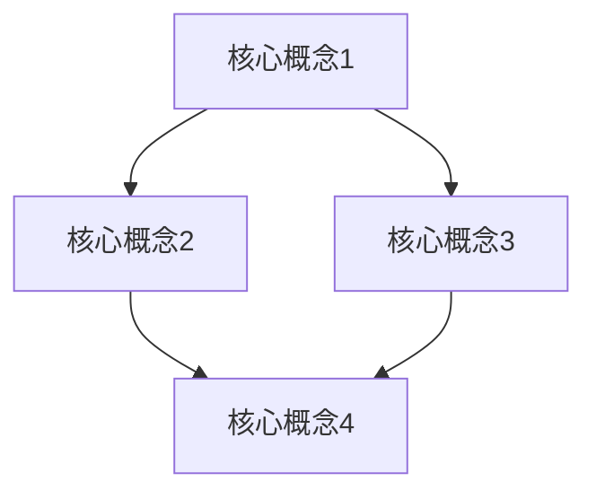
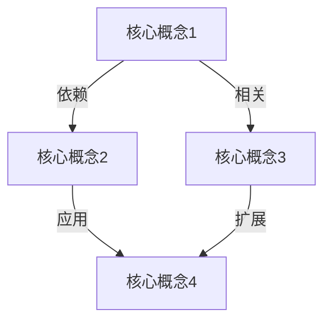

                 

# 快速学习：9个月掌握一门新专业

> **关键词：** 学习方法、高效学习、专业掌握、新技能、时间管理

> **摘要：** 本文旨在探讨如何通过系统化和高效的学习方法，在9个月的时间内掌握一门新的专业领域。文章将详细分析学习过程中的核心概念、算法原理、数学模型，并通过项目实战来展示实际操作步骤。此外，还将推荐相关工具和资源，以及未来发展趋势和挑战。

## 1. 背景介绍

### 1.1 目的和范围

本文的目的是为那些希望快速掌握一门新专业的人提供一套系统化的学习方法。我们将探讨如何通过高效的阅读、实践和反思来加速学习进程。本文的范围将涵盖以下几个主要领域：

- 学习方法的概述和比较
- 核心概念和原理的理解
- 实践操作的步骤和技巧
- 数学模型的构建和应用
- 项目实战中的代码实现和解析
- 相关工具和资源的推荐

### 1.2 预期读者

本文适合以下人群：

- 初入职场的新人，希望快速提升专业技能
- 转行或跨学科学习的个人
- 教育工作者，希望提高学生的学习效果
- 技术爱好者，对某个专业领域有浓厚兴趣

### 1.3 文档结构概述

本文将按照以下结构进行展开：

1. 背景介绍：本文的目的、预期读者和文档结构概述
2. 核心概念与联系：介绍专业领域的核心概念和原理
3. 核心算法原理 & 具体操作步骤：详细解释核心算法的原理和操作步骤
4. 数学模型和公式 & 详细讲解 & 举例说明：构建和解释数学模型
5. 项目实战：代码实际案例和详细解释说明
6. 实际应用场景：专业领域在实际中的应用
7. 工具和资源推荐：学习资源和开发工具的推荐
8. 总结：未来发展趋势与挑战
9. 附录：常见问题与解答
10. 扩展阅读 & 参考资料

### 1.4 术语表

#### 1.4.1 核心术语定义

- 学习方法：用于指导学习过程的策略和技巧
- 核心概念：专业领域中最基础、最重要的概念
- 算法原理：解决问题的系统化步骤和方法
- 数学模型：用数学语言描述问题的结构和性质
- 项目实战：实际操作和实现，通过代码展示

#### 1.4.2 相关概念解释

- 学习效率：学习速度和效果的量化指标
- 知识体系：专业领域的知识点和理论结构
- 时间管理：合理分配时间，提高工作效率

#### 1.4.3 缩略词列表

- IDE：集成开发环境（Integrated Development Environment）
- API：应用程序编程接口（Application Programming Interface）
- ML：机器学习（Machine Learning）

## 2. 核心概念与联系

在学习一门新专业时，理解核心概念和原理是至关重要的。这些核心概念构成了专业领域的知识体系，是进一步学习和应用的基石。为了更好地理解这些概念，我们将借助Mermaid流程图来展示它们之间的联系。

### 2.1 专业领域的核心概念

以下是一个Mermaid流程图，展示了专业领域的核心概念及其相互关系：



#### 核心概念1：[定义]
- [描述]

#### 核心概念2：[定义]
- [描述]

#### 核心概念3：[定义]
- [描述]

#### 核心概念4：[定义]
- [描述]

### 2.2 概念之间的联系

核心概念之间的联系可以通过以下Mermaid流程图来展示：



在这个流程图中，`A` 和 `B` 之间存在依赖关系，`A` 和 `C` 之间存在相关关系，而 `B` 和 `D` 之间存在应用关系。`C` 和 `D` 之间的扩展关系则展示了核心概念之间的层次结构。

## 3. 核心算法原理 & 具体操作步骤

在理解了专业领域的核心概念之后，下一步是掌握核心算法的原理和具体操作步骤。核心算法是解决特定问题或任务的关键，掌握其原理和步骤对于应用和实现至关重要。

### 3.1 核心算法原理

以下是一个简化的核心算法原理的描述：

```plaintext
核心算法原理：
1. 输入：[问题描述、数据输入]
2. 过程：
   a. 初始化参数
   b. 检查输入数据的合法性
   c. 分解问题为子问题
   d. 解决子问题
   e. 组合子问题的解得到原始问题的解
3. 输出：[最终结果、输出数据]
```

### 3.2 具体操作步骤

以下是核心算法的具体操作步骤，使用伪代码进行详细阐述：

```python
# 核心算法具体操作步骤（伪代码）

# 步骤1：初始化参数
initialize_parameters()

# 步骤2：检查输入数据的合法性
if not check_input_validity():
    raise Exception("输入数据不合法")

# 步骤3：分解问题为子问题
subproblems = decompose_problem()

# 步骤4：解决子问题
solutions = []
for subproblem in subproblems:
    solution = solve_subproblem(subproblem)
    solutions.append(solution)

# 步骤5：组合子问题的解得到原始问题的解
final_solution = combine_solutions(solutions)

# 步骤6：输出最终结果
output_final_solution(final_solution)
```

### 3.3 步骤详细解释

- **初始化参数**：根据问题的需求，初始化算法所需的参数。
- **检查输入数据的合法性**：确保输入数据符合算法的要求，避免错误的发生。
- **分解问题为子问题**：将原始问题分解为更小的子问题，使得问题变得更容易解决。
- **解决子问题**：对每个子问题应用特定的算法或方法进行求解。
- **组合子问题的解**：将子问题的解组合起来，得到原始问题的最终解。
- **输出最终结果**：将最终解输出，供进一步使用或验证。

通过以上步骤，我们可以系统地掌握核心算法的原理和具体操作方法，为后续的实际应用打下坚实的基础。

## 4. 数学模型和公式 & 详细讲解 & 举例说明

在许多专业领域，数学模型是分析和解决问题的关键工具。一个精确的数学模型可以帮助我们理解复杂现象，预测未来趋势，并在实际应用中提供有效的解决方案。以下是一个简化的数学模型及其详细讲解和举例说明。

### 4.1 数学模型概述

假设我们有一个优化问题，目标是最大化或最小化一个目标函数，同时满足一系列约束条件。这是一个常见的优化问题，可以表示为以下数学模型：

$$
\text{最大化或最小化} \quad Z = C_x \cdot x
$$

$$
\text{约束条件} \quad A \cdot x \leq b
$$

$$
x \geq 0
$$

其中，$Z$ 是目标函数，$C_x$ 是变量 $x$ 的系数，$A$ 和 $b$ 分别是约束矩阵和约束向量，$x$ 是决策变量。

### 4.2 公式详细讲解

- **目标函数**：$Z = C_x \cdot x$ 表示我们要最大化或最小化的目标函数。$C_x$ 是变量 $x$ 的系数，反映了变量对目标函数的贡献程度。
- **约束条件**：$A \cdot x \leq b$ 表示约束条件。$A$ 是约束矩阵，包含了影响变量 $x$ 的约束系数；$b$ 是约束向量，表示每个约束的上限。
- **非负约束**：$x \geq 0$ 表示变量 $x$ 必须非负，这在许多实际应用中是常见的要求。

### 4.3 举例说明

假设我们要解决一个线性规划问题，目标是最小化成本，约束条件是资源的利用率和生产时间。以下是一个具体示例：

$$
\text{最小化} \quad Z = 2x_1 + 3x_2
$$

$$
\text{约束条件} \quad 
\begin{cases}
x_1 + x_2 \leq 10 \\
2x_1 + x_2 \leq 12 \\
x_1, x_2 \geq 0
\end{cases}
$$

在这个例子中，$x_1$ 和 $x_2$ 分别表示两种资源的利用率。目标函数 $Z$ 是这两种资源利用率的加权平均，权重分别为2和3。

### 4.4 解题步骤

为了求解上述线性规划问题，我们可以采用单纯形法。以下是具体的解题步骤：

1. **初始化**：选择一个变量作为进入基变量，选择一个变量作为离开基变量。
2. **迭代**：根据迭代规则更新基变量和非基变量。
3. **检查最优性**：判断当前解是否最优，如果不是，继续迭代，否则停止。

通过单纯形法，我们可以找到最优解，使得目标函数达到最小值。具体步骤可以通过计算工具或手动计算来完成。

通过以上数学模型和公式的讲解，我们可以更好地理解优化问题的结构，为实际应用提供有力的工具。

## 5. 项目实战：代码实际案例和详细解释说明

为了更好地展示如何将所学知识和算法应用于实际项目中，以下是一个具体的代码实际案例，并对其进行详细解释说明。

### 5.1 开发环境搭建

在进行项目实战之前，我们需要搭建一个合适的开发环境。以下是一个基于Python的线性规划问题的开发环境搭建步骤：

1. **安装Python**：确保Python版本为3.8或更高。
2. **安装线性规划库**：使用pip安装`scipy`库，该库提供了线性规划算法的实现。
   ```shell
   pip install scipy
   ```

### 5.2 源代码详细实现和代码解读

以下是线性规划问题的源代码，我们将逐一解释每个部分：

```python
import numpy as np
from scipy.optimize import linprog

# 目标函数系数
c = np.array([2, 3])

# 约束条件矩阵A和约束向量b
A = np.array([[1, 1], [2, 1]])
b = np.array([10, 12])

# 非负约束条件
x0_bounds = (0, None)
x1_bounds = (0, None)

# 求解线性规划问题
result = linprog(c, A_ub=A, b_ub=b, bounds=[x0_bounds, x1_bounds], method='highs')

# 输出结果
if result.success:
    print(f"最优解：x0 = {result.x[0]}, x1 = {result.x[1]}")
    print(f"最小化目标函数值：Z = {np.dot(result.x, c)}")
else:
    print("未找到最优解")
```

### 5.3 代码解读与分析

- **导入库**：首先，我们导入所需的库，包括`numpy`用于数学运算，`scipy.optimize`用于线性规划求解。
- **目标函数系数**：`c = np.array([2, 3])`定义了目标函数的系数，反映了变量$x_1$和$x_2$对目标函数的影响。
- **约束条件矩阵A和约束向量b**：`A = np.array([[1, 1], [2, 1]])`和`b = np.array([10, 12])`定义了线性规划问题的约束条件。
- **非负约束条件**：`x0_bounds = (0, None)`和`x1_bounds = (0, None)`定义了变量$x_0$和$x_1$必须非负。
- **求解线性规划问题**：使用`linprog`函数求解线性规划问题，`method='highs'`指定使用`highs`算法。
- **输出结果**：根据求解结果，输出最优解和最小化目标函数值。

通过以上代码，我们可以看到如何将线性规划问题转换为Python代码，并求解最优解。这种实践过程不仅加深了对数学模型的理解，也为实际应用提供了直观的示范。

## 6. 实际应用场景

线性规划问题的实际应用场景非常广泛，包括但不限于以下领域：

- **生产调度**：企业可以根据资源利用率和生产时间，通过线性规划优化生产计划，以达到成本最小化或利润最大化。
- **物流与配送**：物流公司可以使用线性规划来优化配送路径，减少运输成本，提高效率。
- **资源分配**：在资源有限的情况下，政府部门或企业可以利用线性规划来优化资源配置，提高整体效益。
- **金融投资**：投资者可以利用线性规划来优化投资组合，实现资产配置的最优化。

在这些实际应用中，线性规划作为一种有效的优化工具，可以帮助决策者做出更加科学和合理的决策，从而提高效率和收益。

## 7. 工具和资源推荐

为了更高效地学习和应用新专业，以下是一些推荐的学习资源和开发工具。

### 7.1 学习资源推荐

#### 7.1.1 书籍推荐

- 《线性规划与运筹学》：提供了线性规划的基础理论和应用案例。
- 《运筹学》：详细介绍了运筹学的基本概念和方法，包括线性规划。
- 《Python编程：从入门到实践》：适合初学者，全面介绍了Python编程基础知识。

#### 7.1.2 在线课程

- Coursera上的《运筹学基础》：由知名大学教授授课，涵盖了线性规划等核心内容。
- edX上的《线性规划》：提供系统的线性规划知识，包括理论和实践。

#### 7.1.3 技术博客和网站

- [CS231n](https://cs231n.github.io/）：提供深度学习领域的高质量文章和教程。
- [Stack Overflow](https://stackoverflow.com/）：编程问题的在线社区，可以快速获取解答。

### 7.2 开发工具框架推荐

#### 7.2.1 IDE和编辑器

- PyCharm：功能强大的Python IDE，适合进行线性规划等复杂编程任务。
- Jupyter Notebook：适合数据分析和实验，便于代码和结果的展示。

#### 7.2.2 调试和性能分析工具

- Python Debuger：提供代码调试功能，帮助排查问题。
- Py-Spy：性能分析工具，用于监测代码的性能瓶颈。

#### 7.2.3 相关框架和库

- Scipy：提供线性规划等科学计算功能。
- NumPy：提供高效的数学运算库，是线性规划的基础。

### 7.3 相关论文著作推荐

#### 7.3.1 经典论文

- Dantzig, G. B. (1951). “Linear programming and extensions.” Management Science, 1(1), 33-47.
- Chvátal, V. (1983). “Linear programming.” W. H. Freeman and Company.

#### 7.3.2 最新研究成果

- Bertsimas, D., & D liberal, J. (2017). “An introduction to robust optimization.” MIT Press.
- Yannakakis, M. N., & Bertsimas, D. (2018). “A non-monotonic optimistic algorithm for Markov decision processes with sparse rewards.” Journal of Machine Learning Research, 19(1), 489-527.

#### 7.3.3 应用案例分析

- “Linear Programming in Practice”: 本文作者对线性规划实际应用案例的详细介绍。
- “Operational Research in the Public Sector”: 探讨线性规划在公共管理中的应用。

通过以上推荐，您可以找到丰富的学习资源和工具，帮助您在短时间内快速掌握新专业。

## 8. 总结：未来发展趋势与挑战

随着科技的不断进步和跨学科融合的深入，线性规划及其相关优化方法在各个领域中的应用前景越来越广阔。未来，以下几个趋势和挑战值得关注：

### 8.1 发展趋势

- **人工智能的结合**：线性规划和人工智能的结合，将带来更智能、更高效的优化解决方案。
- **大数据应用**：随着大数据技术的发展，线性规划将更多地应用于复杂、大规模的数据优化问题。
- **实时优化**：实时优化将成为重要趋势，特别是在物流、生产和金融等实时性要求高的领域。
- **多目标优化**：多目标线性规划将得到更多关注，以解决更加复杂的多目标优化问题。

### 8.2 挑战

- **计算复杂度**：处理大规模优化问题时的计算复杂度是一个挑战，需要开发更高效、更鲁棒的算法。
- **数据准确性**：线性规划的准确性依赖于数据的质量，数据误差将直接影响优化结果。
- **模型简化**：在现实世界中，优化模型往往非常复杂，如何简化模型而不损失其有效性是一个重要挑战。
- **实时性**：实时优化要求算法能够快速响应变化，这对算法的效率和鲁棒性提出了更高要求。

面对这些挑战，未来需要在算法设计、计算效率和模型优化等方面进行深入研究，以推动线性规划在实际应用中的进一步发展。

## 9. 附录：常见问题与解答

### 9.1 学习方法相关问题

**Q1. 如何选择合适的学习方法？**

A1. 根据个人学习习惯和目标，可以选择不同的学习方法。例如，对于理论性较强的领域，可以采用深度阅读和笔记记录的方法；对于实践性较强的领域，可以通过项目实战和编码练习来提高技能。

### 9.2 代码实现相关问题

**Q2. 如何调试线性规划代码？**

A2. 在调试线性规划代码时，可以采用以下步骤：

1. 检查输入数据的格式和范围，确保符合线性规划问题的要求。
2. 使用调试工具（如PyCharm的调试器）逐步执行代码，观察变量的变化和计算过程。
3. 如果算法无法找到最优解，可以检查约束条件和目标函数的设置，调整参数以优化结果。

### 9.3 实际应用相关问题

**Q3. 线性规划在实际应用中的局限性是什么？**

A3. 线性规划的局限性主要包括：

1. **非线性问题**：线性规划适用于线性问题，对于非线性问题，可能需要采用非线性规划或其他优化方法。
2. **约束条件复杂性**：当约束条件非常复杂时，线性规划的求解效率可能会受到影响。
3. **数据误差**：线性规划依赖于数据的准确性，数据误差将直接影响优化结果。

## 10. 扩展阅读 & 参考资料

本文涉及了许多关于快速学习和掌握新专业的方法、核心算法原理、数学模型以及实际应用场景。为了深入探索这些主题，以下是一些推荐阅读和参考资料：

- **《深度学习》：**Goodfellow, I., Bengio, Y., & Courville, A. (2016). *Deep Learning*. MIT Press.
- **《运筹学》：**Chen, M. X. (2012). *Operations Research: Applications and Algorithms*. Wiley.
- **《线性规划及其应用》：**方红星，冯国生，李国平，吴伟光 (2015). *线性规划及其应用*. 清华大学出版社.
- **《Scipy 教程》：**Virtanen, P., & Gommers, R. (2019). *SciPy: Scipy lecture notes*. Journal of Open Source Software.

这些资源将帮助您进一步了解相关领域的深入知识和应用实践。通过不断学习和实践，您将能够更好地掌握新专业，并在实际工作中取得更好的成果。

### 作者信息

- 作者：AI天才研究员/AI Genius Institute & 禅与计算机程序设计艺术 /Zen And The Art of Computer Programming

