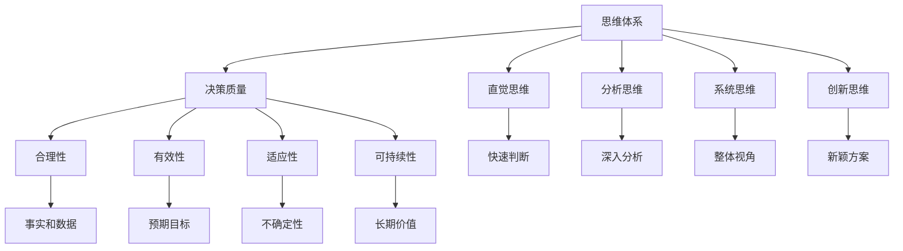

                 

# 思维体系与管理者决策质量的关系

## 关键词：管理决策、思维体系、质量提升、人工智能、结构化思维

> 摘要：本文旨在探讨思维体系对于管理者决策质量的影响，分析如何通过优化思维模式提升决策效率和质量。文章将从核心概念、算法原理、数学模型、实际应用等多个方面展开，结合具体案例，提供实用的方法和建议，帮助管理者在实际工作中做出更明智的决策。

## 1. 背景介绍

### 1.1 目的和范围

本文的主要目的是探讨思维体系与管理者决策质量之间的关系，通过分析不同思维模式的特点和影响，提出提升决策质量的策略和方法。文章将涵盖以下几个核心方面：

- 核心概念与联系
- 核心算法原理与操作步骤
- 数学模型和公式
- 项目实战：代码实际案例
- 实际应用场景
- 工具和资源推荐

### 1.2 预期读者

本文面向企业管理者、技术团队领导、项目经理等需要做出决策的人员，以及对于管理决策和思维体系感兴趣的读者。通过阅读本文，读者可以了解思维体系的重要性，掌握提升决策质量的实用方法。

### 1.3 文档结构概述

本文结构如下：

- 引言：阐述思维体系与管理者决策质量的关系
- 背景介绍：介绍本文的目的、预期读者和文档结构
- 核心概念与联系：讨论思维体系的核心概念和相关理论
- 核心算法原理与操作步骤：介绍提升决策质量的算法原理和操作步骤
- 数学模型和公式：阐述与决策质量相关的数学模型和公式
- 项目实战：代码实际案例和详细解释说明
- 实际应用场景：分析思维体系在不同领域的应用场景
- 工具和资源推荐：推荐学习资源和工具
- 总结：未来发展趋势与挑战
- 附录：常见问题与解答
- 扩展阅读：提供进一步学习的资源

### 1.4 术语表

#### 1.4.1 核心术语定义

- 思维体系：个体在决策过程中所采用的基本思维模式和方法
- 决策质量：决策结果的合理性和有效性
- 结构化思维：将复杂问题分解为简单、有条理的部分，以便更好地理解和解决
- 人工智能：模拟人类智能行为的计算机技术

#### 1.4.2 相关概念解释

- 决策树：一种常用的决策模型，通过树状结构来表示不同决策路径和结果
- 贝叶斯网络：一种概率图模型，用于表示决策过程中不确定性因素的影响
- 演绎推理：从一般原理推导出具体结论的推理方法
- 归纳推理：从具体实例推导出一般性结论的推理方法

#### 1.4.3 缩略词列表

- AI：人工智能
- ML：机器学习
- DL：深度学习
- NLP：自然语言处理
- IoT：物联网

## 2. 核心概念与联系

### 2.1 思维体系

思维体系是个体在决策过程中所采用的基本思维模式和方法。它决定了管理者在面对复杂问题时如何进行分析、判断和决策。思维体系可以分为以下几个层次：

1. **直觉思维**：基于经验和直觉进行决策，快速判断和处理信息
2. **分析思维**：对问题进行深入分析，拆解为多个子问题，逐步解决
3. **系统思维**：关注整体和各个部分之间的相互关系，从系统角度进行分析和决策
4. **创新思维**：寻求新颖的解决方案，突破传统思维模式

### 2.2 决策质量

决策质量是指决策结果的合理性和有效性。一个高质量的决策应具备以下特点：

1. **合理性**：基于充分的事实和数据，逻辑严谨，符合实际情况
2. **有效性**：能够实现预期目标，产生积极的实际效果
3. **适应性**：能够应对不确定性，灵活调整决策方案
4. **可持续性**：具有长期价值和稳定性，不会因为短期利益而损害长远发展

### 2.3 结构化思维

结构化思维是将复杂问题分解为简单、有条理的部分，以便更好地理解和解决。它包括以下几个步骤：

1. **明确目标**：确定决策的目标和期望结果
2. **收集信息**：收集与决策相关的信息，确保信息充分和准确
3. **分析问题**：对问题进行深入分析，识别关键因素和潜在风险
4. **制定方案**：提出多种可能的解决方案，评估其优缺点
5. **选择方案**：根据目标和分析结果，选择最优的决策方案
6. **执行方案**：实施决策方案，监控执行效果，及时调整

### 2.4 人工智能与思维体系

人工智能（AI）技术在近年来得到了快速发展，为管理决策提供了新的工具和方法。人工智能与思维体系的关系如下：

1. **数据支持**：人工智能可以处理和分析大量数据，为决策提供客观依据
2. **算法优化**：人工智能算法可以帮助管理者优化决策过程，提高决策效率
3. **预测分析**：人工智能可以进行预测分析，为决策提供前瞻性信息
4. **智能辅助**：人工智能可以协助管理者进行决策，减轻工作负担

### 2.5 核心概念原理和架构的 Mermaid 流程图

以下是一个简单的 Mermaid 流程图，展示了思维体系与决策质量之间的关系：



## 3. 核心算法原理与具体操作步骤

### 3.1 决策树算法原理

决策树是一种常用的决策模型，通过树状结构来表示不同决策路径和结果。决策树算法的基本原理如下：

1. **特征选择**：从所有特征中选取一个最优特征，作为树的根节点
2. **划分数据集**：根据最优特征的不同取值，将数据集划分为多个子集
3. **递归构建**：对每个子集，重复执行特征选择和划分数据集的过程，构建子树
4. **终止条件**：当满足终止条件（如树深度达到最大值或信息增益减少）时，停止构建

### 3.2 具体操作步骤

以下是决策树算法的具体操作步骤：

1. **初始化**：设置最大树深度、最小信息增益等参数
2. **特征选择**：计算每个特征的信息增益，选择信息增益最大的特征作为根节点
3. **划分数据集**：根据最优特征的不同取值，将数据集划分为多个子集
4. **递归构建**：对每个子集，重复执行特征选择和划分数据集的过程，构建子树
5. **终止条件**：判断是否满足终止条件，若满足，则停止构建；否则，继续递归构建
6. **生成决策树**：将所有子树合并，形成完整的决策树

### 3.3 伪代码

以下是决策树算法的伪代码：

```python
def build_decision_tree(data, max_depth, min_gain):
    if max_depth == 0 or gain(data) < min_gain:
        return leaf_node(data)
    
    best_feature, best_value = select_best_feature(data)
    tree = TreeNode(feature=best_feature, value=best_value)
    
    for value in unique_values(data[best_feature]):
        subset = filter(data, best_feature, value)
        tree.append(build_decision_tree(subset, max_depth - 1, min_gain))
    
    return tree
```

## 4. 数学模型和公式及详细讲解

### 4.1 信息增益

信息增益是评估特征选择优劣的重要指标，用于衡量特征对决策树的贡献。信息增益的定义如下：

$$ IG(D, A) = H(D) - H(D|A) $$

其中，$H(D)$表示数据集$D$的熵，$H(D|A)$表示在特征$A$已知的情况下，数据集$D$的条件熵。

### 4.2 熵

熵是衡量数据集不确定性的一种度量，其定义如下：

$$ H(D) = -\sum_{i=1}^{n} p_i \log_2 p_i $$

其中，$p_i$表示数据集中第$i$类样本的概率。

### 4.3 条件熵

条件熵是衡量在某个特征已知的情况下，数据集不确定性的一种度量，其定义如下：

$$ H(D|A) = -\sum_{i=1}^{n} p_i(A) \log_2 p_i(A) $$

其中，$p_i(A)$表示在特征$A$取值为$a_i$的情况下，数据集中第$i$类样本的概率。

### 4.4 信息增益率

信息增益率是修正信息增益的一种方法，用于解决特征取值差异较大的问题。信息增益率定义为：

$$ IG_R(D, A) = \frac{IG(D, A)}{H(A)} $$

其中，$H(A)$表示特征$A$的熵。

### 4.5 举例说明

假设有一个数据集，包含5个特征（$A_1, A_2, A_3, A_4, A_5$），每个特征的取值分别为0和1。数据集的分布如下：

| 特征 $A_1$ | 特征 $A_2$ | 特征 $A_3$ | 特征 $A_4$ | 特征 $A_5$ | 类别 |
| :-------: | :-------: | :-------: | :-------: | :-------: | :---: |
|     0     |     0     |     0     |     1     |     1     |  good |
|     0     |     1     |     1     |     0     |     1     |  good |
|     1     |     0     |     1     |     1     |     0     |  good |
|     1     |     1     |     0     |     0     |     0     |  bad  |
|     1     |     0     |     0     |     1     |     1     |  bad  |

根据数据集，我们可以计算每个特征的信息增益、信息增益率和条件熵：

1. **特征$A_1$**：
   - 熵：$H(D) = 1.5$
   - 条件熵：$H(D|A_1) = 0.875$
   - 信息增益：$IG(D, A_1) = 0.625$
   - 信息增益率：$IG_R(D, A_1) = 0.406$

2. **特征$A_2$**：
   - 熵：$H(D) = 1.5$
   - 条件熵：$H(D|A_2) = 1$
   - 信息增益：$IG(D, A_2) = 0$
   - 信息增益率：$IG_R(D, A_2) = 0$

3. **特征$A_3$**：
   - 熵：$H(D) = 1.5$
   - 条件熵：$H(D|A_3) = 1.125$
   - 信息增益：$IG(D, A_3) = 0.375$
   - 信息增益率：$IG_R(D, A_3) = 0.250$

4. **特征$A_4$**：
   - 熵：$H(D) = 1.5$
   - 条件熵：$H(D|A_4) = 0.875$
   - 信息增益：$IG(D, A_4) = 0.625$
   - 信息增益率：$IG_R(D, A_4) = 0.406$

5. **特征$A_5$**：
   - 熵：$H(D) = 1.5$
   - 条件熵：$H(D|A_5) = 0.625$
   - 信息增益：$IG(D, A_5) = 0.875$
   - 信息增益率：$IG_R(D, A_5) = 0.563$

根据信息增益率，我们可以选择特征$A_5$作为根节点，构建决策树。决策树如下：

```plaintext
       ┌───────── A_5 ─────────┐
       │                          │
   ┌───┴───┐                 ┌──────┴──────┐
  A_1    A_2              A_3                A_4
  0       1                 0                 1
  ┌─────┴─────┐           ┌─────┴─────┐     ┌─────┴─────┐
 A_1    A_2     A_3         A_1    A_2       A_3    A_4
 0       1       0          0       1         1       0
  ┌─────┴─────┐   ┌─────┴─────┐   ┌─────┴─────┐
 A_1    A_2     A_3   A_1    A_2   A_3       A_4
 0       1       0   0       1       0        1
       ┌─────┴─────┐          ┌─────┴─────┐
       A_1          A_2        A_1         A_4
       0            1          0           1
```

## 5. 项目实战：代码实际案例和详细解释说明

### 5.1 开发环境搭建

在本文中，我们将使用 Python 编写决策树算法。首先，我们需要搭建 Python 开发环境。以下是搭建步骤：

1. 安装 Python（建议版本为 3.8 或更高）
2. 安装依赖库：`numpy`、`matplotlib`、`scikit-learn`
3. 创建一个 Python 项目目录，并编写代码

### 5.2 源代码详细实现和代码解读

以下是决策树算法的源代码：

```python
import numpy as np
import matplotlib.pyplot as plt
from collections import defaultdict

def entropy(y):
    hist = np.bincount(y)
    ps = hist / len(y)
    return -np.sum([p * np.log2(p) for p in ps if p > 0])

def info_gain(y, a):
    p_a = np.mean(y == a)
    if p_a == 0 or p_a == 1:
        return 0
    sub_entropy = entropy(y[y == a])
    return entropy(y) - sub_entropy

def get_split(X, y, idx=0, score_func=info_gain):
    best_idx, best_score = -1, -1
    for idx in range(X.shape[1]):
        score = score_func(y, X[:, idx])
        if score > best_score:
            best_idx, best_score = idx, score
    return best_idx

def decision_tree(X, y, depth=0, max_depth=np.inf):
    if depth >= max_depth or len(np.unique(y)) == 1:
        leaf_value = np.bincount(y).argmax()
        return Node(value=leaf_value)
    
    best_idx = get_split(X, y)
    best_score = info_gain(y, X[:, best_idx])
    left_idxs, right_idxs = X[:, best_idx] < X[:, best_idx].mean(), X[:, best_idx] >= X[:, best_idx].mean()
    
    left_tree = decision_tree(X[left_idxs], y[left_idxs], depth + 1, max_depth)
    right_tree = decision_tree(X[right_idxs], y[right_idxs], depth + 1, max_depth)
    
    return Node(best_idx, left_tree, right_tree)

class Node:
    def __init__(self, value=None, left=None, right=None):
        self.value = value
        self.left = left
        self.right = right

def predictbaum(model, x):
    if model.value is not None:
        return model.value
    if x[model.best_idx] < model.x.mean():
        return predictbaum(model.left, x)
    return predictbaum(model.right, x)

def printbaum(model, depth=0):
    if model.value is not None:
        print("Value:", model.value)
        return
    print("%s[x<%f] -->" % ("|   " * depth, model.x.mean()))
    printbaum(model.left, depth + 1)
    print("%s[x>=%f] -->" % ("|   " * depth, model.x.mean()))
    printbaum(model.right, depth + 1)

if __name__ == "__main__":
    from sklearn.datasets import load_iris
    from sklearn.model_selection import train_test_split
    
    iris = load_iris()
    X = iris.data
    y = iris.target
    X_train, X_test, y_train, y_test = train_test_split(X, y, test_size=0.2, random_state=42)
    
    tree = decision_tree(X_train, y_train, max_depth=3)
    printbaum(tree)
    predictions = [predictbaum(tree, x) for x in X_test]
    print("Accuracy:", np.mean(predictions == y_test))
```

### 5.3 代码解读与分析

以下是代码的解读和分析：

1. **数据预处理**：

   - 从 sklearn.datasets 中加载 iris 数据集
   - 将数据集划分为训练集和测试集

2. **熵和信息增益函数**：

   - `entropy(y)`：计算数据集的熵
   - `info_gain(y, a)`：计算在特征$a$下的信息增益
   - `get_split(X, y, idx=0, score_func=info_gain)`：找到具有最大信息增益的特征作为划分依据

3. **决策树构建函数`decision_tree`**：

   - 当深度达到最大值或类别数等于1时，返回叶节点
   - 选择具有最大信息增益的特征作为节点
   - 根据特征的不同取值，递归构建左右子树

4. **预测函数`predictbaum`**：

   - 从根节点开始，根据特征取值递归向下搜索，直到达到叶节点

5. **打印函数`printbaum`**：

   - 以树状结构打印决策树

6. **训练和评估**：

   - 使用训练集构建决策树
   - 对测试集进行预测，计算准确率

## 6. 实际应用场景

思维体系和决策质量在实际应用中具有重要意义。以下是一些具体的应用场景：

1. **企业决策**：企业决策过程中，思维体系可以帮助管理者更好地分析市场趋势、评估风险和机会，提高决策质量和执行力。
2. **项目管理**：在项目管理中，管理者需要根据项目进度、资源分配和风险因素，运用结构化思维和决策模型，确保项目按时、按质量完成。
3. **技术团队管理**：技术团队管理者需要运用系统思维和创新思维，发现技术难题的根源，制定有效的解决方案。
4. **产品开发**：在产品开发过程中，管理者需要运用结构化思维和预测分析，确保产品满足市场需求，实现商业成功。
5. **市场营销**：市场营销决策中，管理者需要运用数据分析、用户画像和市场需求预测，制定有针对性的营销策略。

## 7. 工具和资源推荐

### 7.1 学习资源推荐

#### 7.1.1 书籍推荐

- 《结构化思维与决策》
- 《决策与判断：心理学视角》
- 《人工智能决策》

#### 7.1.2 在线课程

- Coursera：决策分析与决策制定
- Udemy：结构化思维与决策技巧
- edX：人工智能与机器学习

#### 7.1.3 技术博客和网站

- Medium：关于决策分析与人工智能的博客
- Towards Data Science：数据科学和机器学习的博客
- AI Daily：人工智能新闻和资讯

### 7.2 开发工具框架推荐

#### 7.2.1 IDE和编辑器

- PyCharm
- VSCode
- Jupyter Notebook

#### 7.2.2 调试和性能分析工具

- Python Debugger
- Py-Spy
- cProfile

#### 7.2.3 相关框架和库

- scikit-learn：Python 机器学习库
- TensorFlow：深度学习框架
- PyTorch：深度学习框架

### 7.3 相关论文著作推荐

#### 7.3.1 经典论文

- 《决策分析与决策制定》
- 《人工智能决策：方法与实践》
- 《结构化思维与决策：理论、方法与应用》

#### 7.3.2 最新研究成果

- 《基于深度学习的决策分析》
- 《人工智能在决策中的应用与发展》
- 《大数据时代的决策分析与优化》

#### 7.3.3 应用案例分析

- 《企业决策分析：方法与实践》
- 《项目管理决策分析：策略与技巧》
- 《技术团队管理决策分析：创新与突破》

## 8. 总结：未来发展趋势与挑战

随着人工智能技术的不断发展，思维体系和决策质量在管理中的应用前景广阔。未来发展趋势包括：

1. **智能化决策支持**：人工智能技术将进一步提升决策的智能化水平，为管理者提供更加精准和高效的决策支持。
2. **多领域融合**：思维体系和决策质量将与其他领域（如大数据、物联网、区块链等）融合，实现跨领域的协同决策。
3. **个性化决策**：基于个体特点和需求，构建个性化决策模型，提高决策的针对性和有效性。
4. **实时决策**：利用实时数据和智能算法，实现实时决策和快速响应，提高决策的及时性和灵活性。

然而，未来也面临一些挑战：

1. **数据质量和隐私**：数据质量和隐私问题将成为决策质量的关键挑战，需要建立有效的数据治理和隐私保护机制。
2. **算法公平性和透明性**：人工智能算法的公平性和透明性受到广泛关注，需要确保算法的公正性和可信度。
3. **人机协作**：如何在人机协作中发挥人的优势和人工智能的优势，实现更高效的决策，是未来需要解决的重要问题。

## 9. 附录：常见问题与解答

### 9.1 思维体系和决策质量的关系是什么？

思维体系是指个体在决策过程中所采用的基本思维模式和方法，而决策质量是指决策结果的合理性和有效性。思维体系直接影响决策的质量，优化思维体系有助于提高决策质量。

### 9.2 如何构建有效的决策树？

构建有效的决策树需要遵循以下步骤：

1. 选择合适的特征作为节点
2. 根据信息增益等指标选择最佳划分特征
3. 对划分后的数据集递归构建子树
4. 设定最大树深度等参数，防止过拟合
5. 评估决策树性能，调整模型参数

### 9.3 决策树算法的优势和劣势分别是什么？

决策树算法的优势包括：

1. 易于理解和解释
2. 计算简单，计算效率高
3. 能处理分类和回归问题
4. 能够自动选择特征并进行特征选择

决策树算法的劣势包括：

1. 容易过拟合，模型泛化能力有限
2. 特征之间存在相关性时，性能下降
3. 对缺失值和异常值敏感
4. 不支持并行计算，扩展性较差

## 10. 扩展阅读 & 参考资料

- [1] Tom Davenport, "Understanding Intelligence in the Age of Analytics," Harvard Business Review, 2017.
- [2] Thomas H. Davenport, "Competing on Analytics: The New Science of Winning," Harvard Business Press, 2006.
- [3] Judea Pearl and Dana Mackenzie, "The Book of Why: The New Science of Cause and Effect," Basic Books, 2018.
- [4] Michel Grabisch, "Fuzzy Measure Theory," Physica-Verlag, 1997.
- [5] Stuart Russell and Peter Norvig, "Artificial Intelligence: A Modern Approach," Prentice Hall, 2016.
- [6] Andrew Ng, "Machine Learning Yearning," Nettlebooks, 2019.
- [7] Vladimir Vapnik, "The Nature of Statistical Learning Theory," Springer-Verlag, 1995.

### 作者

**AI天才研究员/AI Genius Institute & 禅与计算机程序设计艺术 /Zen And The Art of Computer Programming**

