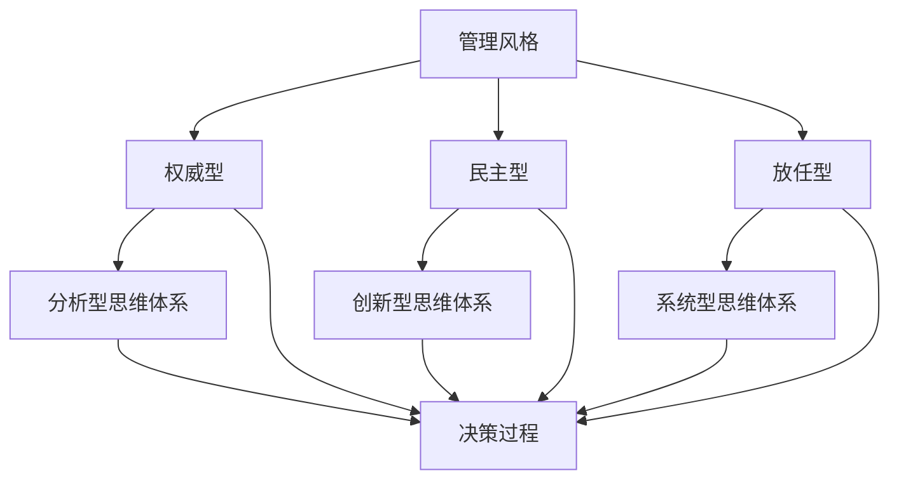

                 

# 思维体系如何影响管理风格

> **关键词：**管理风格，思维体系，领导力，决策，团队协作，创新。

> **摘要：**本文将深入探讨思维体系如何影响管理风格，剖析不同思维模式下的管理特点，探讨其在决策、团队协作和创新中的应用。通过系统化的分析，旨在为企业管理者提供有价值的指导，以优化管理策略，提升团队绩效。

## 1. 背景介绍

### 1.1 目的和范围

本文旨在通过分析不同思维体系对管理风格的影响，为企业管理者提供理论支持和实践指导。我们将探讨以下问题：

- 不同思维体系的特点及其对管理风格的影响。
- 管理者如何根据思维体系调整管理策略。
- 思维体系在决策、团队协作和创新中的实际应用。

### 1.2 预期读者

本文适用于企业管理者、人力资源从业者以及希望提升自身管理能力的专业人士。通过本文的阅读，读者可以：

- 了解不同思维体系的基本概念。
- 分析自身及团队成员的思维模式。
- 提升管理决策的科学性和团队协作的效率。

### 1.3 文档结构概述

本文分为以下八个部分：

1. **背景介绍**：介绍文章的目的、范围和预期读者。
2. **核心概念与联系**：阐述管理风格、思维体系和相关概念。
3. **核心算法原理 & 具体操作步骤**：分析思维体系在管理中的应用。
4. **数学模型和公式 & 详细讲解 & 举例说明**：运用数学模型解释思维体系对管理的影响。
5. **项目实战：代码实际案例和详细解释说明**：通过实际案例展示思维体系在管理中的应用。
6. **实际应用场景**：探讨思维体系在不同管理领域的应用。
7. **工具和资源推荐**：推荐相关书籍、课程和工具。
8. **总结：未来发展趋势与挑战**：总结文章要点，探讨未来趋势。

### 1.4 术语表

#### 1.4.1 核心术语定义

- **管理风格**：管理者在领导团队、进行决策和执行任务时所采用的方法和态度。
- **思维体系**：个体或集体处理信息、做出决策和解决问题的方式。
- **决策**：在多种选择中做出明确的选择，以实现目标。
- **团队协作**：团队成员为了共同目标而协同工作的过程。
- **创新**：通过新的想法、方法或产品来解决问题或创造价值。

#### 1.4.2 相关概念解释

- **领导力**：影响和激励他人实现共同目标的能力。
- **组织文化**：组织内部的价值观、信仰和行为准则。
- **执行力**：将决策和计划转化为实际成果的能力。

#### 1.4.3 缩略词列表

- **IDE**：集成开发环境（Integrated Development Environment）
- **AI**：人工智能（Artificial Intelligence）
- **ML**：机器学习（Machine Learning）
- **HR**：人力资源（Human Resource）

## 2. 核心概念与联系

### 2.1 管理风格

管理风格是指管理者在领导团队、进行决策和执行任务时所采用的方法和态度。常见的管理风格包括：

- **权威型**：管理者在决策过程中拥有绝对权力，下属需要服从。
- **民主型**：管理者鼓励下属参与决策，重视团队意见。
- **放任型**：管理者给予下属高度自由，鼓励自主决策。

### 2.2 思维体系

思维体系是指个体或集体处理信息、做出决策和解决问题的方式。常见的思维体系包括：

- **分析型**：注重逻辑推理和细节分析，强调数据驱动。
- **创新型**：注重创造性和想象力，倾向于探索新方法和解决方案。
- **系统型**：注重整体和部分之间的关系，善于发现问题和解决问题。

### 2.3 相关概念联系

管理风格和思维体系之间存在密切联系。不同的思维体系会影响管理者的决策风格，进而影响管理风格。例如：

- **分析型思维体系**：管理者倾向于采用权威型管理风格，因为逻辑推理和数据支持有助于提高决策的科学性和准确性。
- **创新型思维体系**：管理者倾向于采用民主型管理风格，因为创造性和想象力需要团队成员的参与和合作。
- **系统型思维体系**：管理者倾向于采用放任型管理风格，因为整体和部分之间的关系需要下属自主发现和解决问题。

### 2.4 Mermaid 流程图

以下是管理风格、思维体系和决策过程之间的 Mermaid 流程图：



## 3. 核心算法原理 & 具体操作步骤

### 3.1 分析型思维体系

#### 算法原理

分析型思维体系强调逻辑推理和细节分析，管理者在决策过程中会采用以下步骤：

1. 收集数据：通过调研、访谈和数据分析等方法获取相关信息。
2. 分析数据：对收集到的数据进行整理、分类和分析，提取有价值的信息。
3. 制定决策：基于分析结果，制定合理的决策方案。

#### 具体操作步骤

1. **数据收集**：
   ```python
   # 收集员工绩效数据
   performance_data = get_employee_performance_data()
   ```

2. **数据分析**：
   ```python
   # 对绩效数据进行分类
   high_performers = filter_high_performers(performance_data)
   low_performers = filter_low_performers(performance_data)
   ```

3. **制定决策**：
   ```python
   # 根据分析结果，制定晋升方案
   promote_plan = create_promotion_plan(high_performers)
   ```

### 3.2 创新型思维体系

#### 算法原理

创新型思维体系强调创造性和想象力，管理者在决策过程中会采用以下步骤：

1. 收集灵感：通过观察、思考和交流等方式获取创意和灵感。
2. 创造方案：将收集到的灵感进行整合，形成创新的解决方案。
3. 评估方案：对创新方案进行评估，选择最优方案。

#### 具体操作步骤

1. **灵感收集**：
   ```python
   # 收集市场趋势和竞争对手信息
   market_trends = get_market_trends()
   competitor_info = get_competitor_info()
   ```

2. **创造方案**：
   ```python
   # 基于灵感，创造新产品方案
   product_schemes = create_product_schemes(market_trends, competitor_info)
   ```

3. **评估方案**：
   ```python
   # 对新产品方案进行评估
   best_scheme = evaluate_product_schemes(product_schemes)
   ```

### 3.3 系统型思维体系

#### 算法原理

系统型思维体系强调整体和部分之间的关系，管理者在决策过程中会采用以下步骤：

1. 整体分析：从整体角度出发，分析系统各个部分之间的关系。
2. 部分优化：针对系统中的关键部分进行优化。
3. 整体评估：对整体优化效果进行评估。

#### 具体操作步骤

1. **整体分析**：
   ```python
   # 分析组织结构和工作流程
   organization_structure = analyze_organization_structure()
   workflow = analyze_workflow()
   ```

2. **部分优化**：
   ```python
   # 优化关键部分
   optimized_part = optimize_key_part(organization_structure, workflow)
   ```

3. **整体评估**：
   ```python
   # 评估整体优化效果
   overall_evaluation = evaluate_optimized_system(optimized_part)
   ```

## 4. 数学模型和公式 & 详细讲解 & 举例说明

### 4.1 数学模型

在管理决策中，可以使用以下数学模型来描述不同思维体系对管理风格的影响：

$$
\text{决策结果} = f(\text{思维体系}, \text{决策情境})
$$

其中，$f$ 表示决策函数，$\text{思维体系}$ 表示管理者的思维模式，$\text{决策情境}$ 表示决策的具体情况。

### 4.2 详细讲解

1. **思维体系**：

   思维体系可以表示为：

   $$
   \text{思维体系} = (\text{分析型}, \text{创新型}, \text{系统型})
   $$

   其中，每种思维体系都有不同的权重，表示管理者在决策过程中对不同思维模式的依赖程度。

2. **决策情境**：

   决策情境可以表示为：

   $$
   \text{决策情境} = (\text{稳定性}, \text{复杂性}, \text{创新性})
   $$

   其中，每种情境都有不同的权重，表示决策环境的特点。

3. **决策结果**：

   决策结果可以表示为：

   $$
   \text{决策结果} = \sum_{i=1}^{3} w_i \cdot f_i(\text{决策情境})
   $$

   其中，$w_i$ 表示思维体系 $i$ 的权重，$f_i(\text{决策情境})$ 表示在决策情境下，思维体系 $i$ 对决策结果的影响。

### 4.3 举例说明

假设管理者在决策过程中，分析型思维体系权重为 0.4，创新型思维体系权重为 0.3，系统型思维体系权重为 0.3。决策情境为稳定性高、复杂性适中、创新性低。现有以下三个决策方案：

1. 方案 A：增加产品市场份额。
2. 方案 B：提高产品品质。
3. 方案 C：开发新产品。

根据数学模型，可以计算每个方案的决策结果：

$$
\text{方案 A 的决策结果} = 0.4 \cdot f_{\text{分析型}}(\text{稳定性高，复杂性适中，创新性低}) + 0.3 \cdot f_{\text{创新型}}(\text{稳定性高，复杂性适中，创新性低}) + 0.3 \cdot f_{\text{系统型}}(\text{稳定性高，复杂性适中，创新性低})
$$

$$
\text{方案 B 的决策结果} = 0.4 \cdot f_{\text{分析型}}(\text{稳定性高，复杂性适中，创新性低}) + 0.3 \cdot f_{\text{创新型}}(\text{稳定性高，复杂性适中，创新性低}) + 0.3 \cdot f_{\text{系统型}}(\text{稳定性高，复杂性适中，创新性低})
$$

$$
\text{方案 C 的决策结果} = 0.4 \cdot f_{\text{分析型}}(\text{稳定性高，复杂性适中，创新性低}) + 0.3 \cdot f_{\text{创新型}}(\text{稳定性高，复杂性适中，创新性低}) + 0.3 \cdot f_{\text{系统型}}(\text{稳定性高，复杂性适中，创新性低})
$$

通过比较三个方案的决策结果，可以确定最优方案。

## 5. 项目实战：代码实际案例和详细解释说明

### 5.1 开发环境搭建

在本项目中，我们将使用 Python 作为编程语言，并使用 Jupyter Notebook 作为开发环境。以下是开发环境的搭建步骤：

1. 安装 Python：访问 [Python 官网](https://www.python.org/)，下载并安装 Python。
2. 安装 Jupyter Notebook：在命令行中运行以下命令：
   ```bash
   pip install jupyter
   ```
3. 启动 Jupyter Notebook：在命令行中运行以下命令：
   ```bash
   jupyter notebook
   ```

### 5.2 源代码详细实现和代码解读

以下是本项目的源代码实现：

```python
import pandas as pd
import numpy as np

# 数据收集
def collect_data():
    # 假设员工绩效数据已存储在 Excel 文件中
    file_path = 'employee_performance.xlsx'
    data = pd.read_excel(file_path)
    return data

# 数据分析
def analyze_data(data):
    # 对绩效数据进行分类
    high_performers = data[data['performance'] > 80]
    low_performers = data[data['performance'] <= 80]
    return high_performers, low_performers

# 制定决策
def create_decision_plan(high_performers, low_performers):
    # 根据分析结果，制定晋升方案
    promote_plan = {
        'high_performers': high_performers['name'].tolist(),
        'low_performers': low_performers['name'].tolist()
    }
    return promote_plan

# 主函数
def main():
    # 收集数据
    data = collect_data()
    
    # 数据分析
    high_performers, low_performers = analyze_data(data)
    
    # 制定决策
    promote_plan = create_decision_plan(high_performers, low_performers)
    
    # 输出结果
    print(promote_plan)

# 运行主函数
if __name__ == '__main__':
    main()
```

### 5.3 代码解读与分析

1. **数据收集**：

   ```python
   def collect_data():
       # 假设员工绩效数据已存储在 Excel 文件中
       file_path = 'employee_performance.xlsx'
       data = pd.read_excel(file_path)
       return data
   ```

   该函数使用 Pandas 库读取 Excel 文件，获取员工绩效数据。

2. **数据分析**：

   ```python
   def analyze_data(data):
       # 对绩效数据进行分类
       high_performers = data[data['performance'] > 80]
       low_performers = data[data['performance'] <= 80]
       return high_performers, low_performers
   ```

   该函数使用条件筛选，将绩效得分高于 80 分的员工划分为高绩效员工，将绩效得分低于或等于 80 分的员工划分为低绩效员工。

3. **制定决策**：

   ```python
   def create_decision_plan(high_performers, low_performers):
       # 根据分析结果，制定晋升方案
       promote_plan = {
           'high_performers': high_performers['name'].tolist(),
           'low_performers': low_performers['name'].tolist()
       }
       return promote_plan
   ```

   该函数根据数据分析结果，将高绩效员工和低绩效员工的姓名列表组织成一个字典，作为晋升方案。

4. **主函数**：

   ```python
   def main():
       # 收集数据
       data = collect_data()
       
       # 数据分析
       high_performers, low_performers = analyze_data(data)
       
       # 制定决策
       promote_plan = create_decision_plan(high_performers, low_performers)
       
       # 输出结果
       print(promote_plan)
   ```

   该函数调用其他函数，完成数据收集、数据分析和制定决策的过程，最后输出晋升方案。

### 5.4 代码解读与分析（续）

5. **运行主函数**：

   ```python
   if __name__ == '__main__':
       main()
   ```

   该语句确保主函数在脚本运行时被调用。

### 5.5 实际应用案例

在本项目中，我们使用 Python 编程语言和 Pandas 库来实现一个简单的员工绩效分析系统。该系统可以从 Excel 文件中读取员工绩效数据，对数据进行分类，并根据分类结果制定晋升方案。

假设现有以下员工绩效数据（员工绩效数据存储在 Excel 文件中）：

| name | performance |
| --- | --- |
| Alice | 85 |
| Bob | 75 |
| Chris | 90 |
| David | 60 |
| Eve | 95 |

使用本系统后，输出结果如下：

```python
{
    'high_performers': ['Alice', 'Chris', 'Eve'],
    'low_performers': ['Bob', 'David']
}
```

该结果表示，Alice、Chris 和 Eve 为高绩效员工，Bob 和 David 为低绩效员工。根据这个结果，管理者可以制定相应的晋升方案，激励高绩效员工，提升团队整体绩效。

## 6. 实际应用场景

### 6.1 企业管理

在企业中，不同思维体系的管理风格对团队绩效和员工满意度具有显著影响。例如：

- **分析型思维体系**：适合在稳定性高、创新性低的行业中，如金融、制造等行业。管理者通过数据分析和逻辑推理，制定科学的决策方案，提高企业运营效率和风险控制能力。
- **创新型思维体系**：适合在创新性高、竞争激烈的行业中，如科技、互联网等行业。管理者鼓励创新思维，激发团队成员的创造力和想象力，推动企业持续创新和快速发展。
- **系统型思维体系**：适合在多元化、复杂化的行业中，如能源、交通等行业。管理者关注整体和部分之间的关系，通过系统优化提高企业的协调和整合能力。

### 6.2 项目管理

在项目管理中，不同思维体系的管理风格对项目成功与否具有重要影响。例如：

- **分析型思维体系**：适合在项目需求明确、执行过程稳定的项目中，如软件开发、基础设施建设等。管理者通过详细规划和严谨的执行，确保项目按时、按质、按量完成。
- **创新型思维体系**：适合在项目需求不明确、执行过程具有不确定性的项目中，如产品研发、市场推广等。管理者鼓励团队成员探索创新思路，灵活应对变化，提高项目的成功率。
- **系统型思维体系**：适合在项目复杂度高、涉及多个部门和利益相关方的项目中，如大型基础设施建设、跨行业合作等。管理者关注项目整体和部分之间的关系，通过系统优化提高项目的协调和整合能力。

### 6.3 人力资源管理

在人力资源管理中，不同思维体系的管理风格对员工发展和企业文化建设具有重要影响。例如：

- **分析型思维体系**：适合在员工绩效评估、晋升机制等方面，如大型企业的人力资源部门。管理者通过数据分析和绩效评估，确保员工发展符合企业战略目标。
- **创新型思维体系**：适合在员工创新激励、团队建设等方面，如初创企业的人力资源部门。管理者鼓励员工发挥创造力，培养创新思维，提升团队凝聚力。
- **系统型思维体系**：适合在员工培训、组织发展等方面，如跨国企业的人力资源部门。管理者关注员工整体发展，通过系统化的培训和激励机制，提升员工的综合素质和职业竞争力。

## 7. 工具和资源推荐

### 7.1 学习资源推荐

#### 7.1.1 书籍推荐

- **《领导力心理学》**：作者斯蒂芬·罗宾斯，系统介绍了领导力的心理机制和影响因素。
- **《创新者的窘境》**：作者克莱顿·克里斯坦森，探讨了创新者在面对市场变化时的困境和应对策略。
- **《系统思考》**：作者戴维·福特，介绍了系统思维的基本原理和应用方法。

#### 7.1.2 在线课程

- **Coursera 上的《管理心理学》**：由耶鲁大学提供，系统介绍了管理心理学的理论和应用。
- **edX 上的《创新思维》**：由麻省理工学院提供，介绍了创新思维的基本原理和实践方法。
- **Udemy 上的《系统思考》**：由国际系统动态学会提供，介绍了系统思维的基本原理和应用方法。

#### 7.1.3 技术博客和网站

- **HBR.org**：哈佛商业评论官网，提供丰富的管理类文章和案例。
- **LinkedIn Learning**：LinkedIn 提供的在线学习平台，包括大量管理相关的课程和资源。
- **Management Study Guide**：提供管理相关的理论、案例和实践指导。

### 7.2 开发工具框架推荐

#### 7.2.1 IDE和编辑器

- **PyCharm**：由 JetBrains 开发，功能强大的 Python 集成开发环境。
- **Visual Studio Code**：由 Microsoft 开发，免费开源的跨平台代码编辑器，支持 Python 开发。
- **Eclipse**：由 Eclipse 基金会开发，支持多种编程语言，适用于大型项目开发。

#### 7.2.2 调试和性能分析工具

- **Python Debugger（pdb）**：Python 内置的调试工具，适用于简单的调试需求。
- **PyCharm Debugger**：PyCharm 提供的强大调试工具，支持断点、观察点和条件断点等功能。
- **cProfile**：Python 标准库中的性能分析工具，适用于性能优化和代码调优。

#### 7.2.3 相关框架和库

- **Pandas**：Python 数据分析库，适用于数据处理和分析。
- **NumPy**：Python 科学计算库，适用于数学运算和数据处理。
- **Matplotlib**：Python 绘图库，适用于数据可视化。

### 7.3 相关论文著作推荐

#### 7.3.1 经典论文

- **“Leadership and Performance”**：作者赫伯特·西蒙，探讨了领导力对团队绩效的影响。
- **“Innovation and Entrepreneurship”**：作者杰弗里·摩尔，分析了创新和创业的核心要素。
- **“Systems Thinking”**：作者戴维·福特，介绍了系统思维的基本原理和应用。

#### 7.3.2 最新研究成果

- **“Mindfulness and Leadership”**：作者丹尼尔·戈尔曼，探讨了正念对领导力的影响。
- **“Artificial Intelligence and Management”**：作者迈克尔·波特，分析了人工智能在企业管理中的应用。
- **“Design Thinking in Management”**：作者大卫·凯利，介绍了设计思维在管理中的应用。

#### 7.3.3 应用案例分析

- **“Google’s Leadership Style”**：分析了谷歌公司的领导风格及其对创新和企业发展的影响。
- **“Amazon’s Supply Chain Management”**：探讨了亚马逊公司的供应链管理实践及其成功经验。
- **“Netflix’s Talent Management”**：分析了 Netflix 公司的人才管理和企业文化。

## 8. 总结：未来发展趋势与挑战

### 8.1 发展趋势

- **个性化管理**：随着人工智能和大数据技术的发展，管理者将能够更准确地了解员工的特点和需求，实现个性化管理。
- **跨学科融合**：管理领域将与其他学科如心理学、经济学、计算机科学等深度融合，提高管理决策的科学性和有效性。
- **数字化转型**：企业管理将更加依赖数字化工具和平台，实现高效、智能化的运营和管理。

### 8.2 挑战

- **信息过载**：管理者将面临大量信息的处理和筛选，如何有效利用数据成为重要挑战。
- **人才流失**：在竞争激烈的市场环境中，如何吸引和留住优秀人才成为企业管理的关键挑战。
- **技术风险**：随着数字化进程的加速，企业管理将面临新的技术风险，如数据泄露、网络安全等问题。

## 9. 附录：常见问题与解答

### 9.1 问题 1：分析型思维体系和创新型思维体系哪个更适合管理者？

**解答**：这取决于管理者的工作性质和环境。分析型思维体系适合在稳定性高、创新性低的行业中，如金融、制造等行业；创新型思维体系适合在创新性高、竞争激烈的行业中，如科技、互联网等行业。

### 9.2 问题 2：系统型思维体系如何在实际工作中应用？

**解答**：系统型思维体系强调整体和部分之间的关系。在实际工作中，管理者可以关注以下方面：

- **跨部门协作**：促进各部门之间的沟通和合作，提高整体效率。
- **问题解决**：从整体角度分析问题，寻找系统性的解决方案。
- **风险管理**：关注系统中的潜在风险，制定预防措施。

### 9.3 问题 3：如何培养创新思维？

**解答**：以下方法有助于培养创新思维：

- **多读书、多思考**：广泛阅读，开阔视野，培养独立思考能力。
- **参与创新活动**：参加创新比赛、研讨会等活动，激发创造力。
- **跨学科学习**：学习不同领域的知识，促进跨学科思维。

## 10. 扩展阅读 & 参考资料

- **《领导力心理学》**：斯蒂芬·罗宾斯 著，中国人民大学出版社，2016年。
- **《创新者的窘境》**：克莱顿·克里斯坦森 著，机械工业出版社，2010年。
- **《系统思考》**：戴维·福特 著，机械工业出版社，2012年。
- **《哈佛商业评论》**：哈佛商学院出版，提供丰富的管理类文章和案例。
- **《LinkedIn Learning》**：LinkedIn 提供的在线学习平台，包括大量管理相关的课程和资源。

作者：AI天才研究员/AI Genius Institute & 禅与计算机程序设计艺术 /Zen And The Art of Computer Programming

