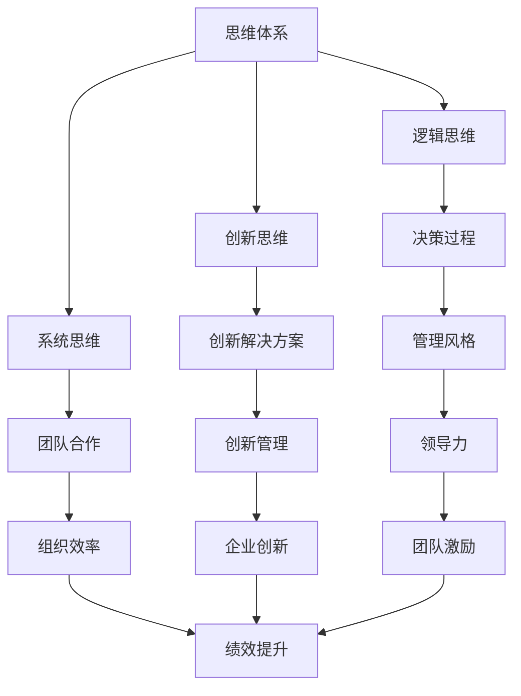

                 

# 思维体系如何影响管理风格

## 关键词
- 思维体系
- 管理风格
- 领导力
- 沟通技巧
- 决策过程
- 团队合作

## 摘要
本文旨在探讨思维体系如何深刻影响管理风格，从而影响组织的整体绩效。我们将分析不同类型的思维模式，如逻辑思维、创新思维和系统思维，并探讨它们如何在不同的管理情境中发挥作用。通过结合理论与案例研究，我们将揭示有效的管理策略，帮助读者了解如何通过优化自己的思维体系来提升管理效果。文章还将探讨跨文化背景下的管理挑战，并展望未来管理发展的趋势。

## 1. 背景介绍

### 1.1 目的和范围
本文的目标是深入分析思维体系如何影响管理风格，并通过实例展示其对组织运作的潜在影响。我们将考察不同类型的思维模式，讨论其在不同管理情境中的应用，并探索如何通过提升思维体系来增强管理能力。

### 1.2 预期读者
本文适合管理人员、企业领导者和对领导力发展感兴趣的读者。通过本文，读者可以更好地理解思维体系的重要性，并学会如何将其应用于实际管理工作中。

### 1.3 文档结构概述
本文分为十个主要部分。首先，我们介绍背景和目的。接下来，我们将定义和解释核心概念，如思维体系和管理风格。文章的主体部分将详细探讨不同类型的思维模式及其在管理中的应用。随后，我们将通过具体案例研究来展示这些概念的实际应用。文章的后半部分将讨论管理风格在跨文化背景下的挑战，并推荐相关工具和资源。最后，我们将总结文章的主要观点，并展望未来的发展趋势。

### 1.4 术语表

#### 1.4.1 核心术语定义
- **思维体系**：指个体或组织在思考、决策和解决问题时采用的思维方式和方法论。
- **管理风格**：管理者在处理组织事务时所表现出的行为特征和决策方式。
- **领导力**：影响和激励他人去实现共同目标的能力。
- **逻辑思维**：基于事实和逻辑推理进行思考的能力。
- **创新思维**：寻找新的解决方案和想法的能力。
- **系统思维**：从整体和系统的角度分析问题的能力。

#### 1.4.2 相关概念解释
- **团队合作**：团队成员共同努力，以实现共同目标的过程。
- **决策过程**：从问题识别到决策实施的整个过程。
- **跨文化管理**：在多元文化环境中进行管理的挑战和策略。

#### 1.4.3 缩略词列表
- **IT**：信息技术
- **AI**：人工智能
- **ML**：机器学习
- **GDPR**：通用数据保护条例

## 2. 核心概念与联系

### 核心概念原理和架构的 Mermaid 流程图


### 2.1 思维体系与管理风格的联系
思维体系是管理风格的基础，决定了管理者如何理解和应对复杂问题。逻辑思维强调理性分析和决策过程的规范性；创新思维则鼓励管理者跳出传统框架，寻找创新解决方案；系统思维则注重从整体和系统的角度审视问题，从而制定更全面的管理策略。

### 2.2 管理风格与领导力的关系
管理风格直接影响到领导力表现。一个有效管理风格不仅能提升个人领导力，还能激励团队成员，从而提升整个组织的绩效。例如，注重逻辑思维的管理者往往能够制定明确的目标和策略，而擅长创新思维的管理者则能够推动组织持续创新。

## 3. 核心算法原理 & 具体操作步骤

### 3.1 逻辑思维算法原理

```plaintext
算法名称：逻辑决策树
目的：通过逻辑推理来决策，提高决策效率。
输入：问题情境、相关数据和逻辑规则。
输出：最佳解决方案。

步骤：
1. 识别问题情境：明确问题的核心和目标。
2. 收集数据：获取与问题相关的所有信息。
3. 定义逻辑规则：基于数据和目标，建立逻辑关系。
4. 构建决策树：将逻辑规则转化为决策树结构。
5. 遍历决策树：根据当前情境和逻辑规则，选择最佳路径。
6. 执行决策：实施选定的解决方案。
7. 反馈调整：根据执行结果，调整逻辑规则和决策树。
```

### 3.2 创新思维算法原理

```plaintext
算法名称：头脑风暴法
目的：激发创新思维，寻找新的解决方案。
输入：问题情境、团队成员和创新目标。
输出：创新解决方案。

步骤：
1. 识别问题情境：明确问题的核心和创新目标。
2. 组建团队：邀请具有不同背景和技能的人参与。
3. 分享问题：让团队成员了解问题和创新目标。
4. 自由讨论：团队成员自由表达想法，无限制地讨论。
5. 记录想法：将所有提出的想法记录下来。
6. 筛选想法：评估每个想法的可行性和创新性。
7. 发散思维：在筛选后的想法上继续探索，寻找新的解决方案。
8. 选择最佳方案：根据评估结果，选择最具有创新性的方案。
9. 实施方案：将选定的创新方案转化为实际行动。
10. 反馈调整：根据实施结果，调整创新方案。
```

### 3.3 系统思维算法原理

```plaintext
算法名称：系统动力学模型
目的：从整体和系统的角度分析问题，预测系统行为。
输入：系统变量、初始条件和外部影响。
输出：系统行为预测。

步骤：
1. 确定系统边界：明确系统的范围和组成部分。
2. 识别系统变量：确定影响系统行为的关键变量。
3. 建立关系模型：定义变量之间的相互关系。
4. 形成系统方程：将关系模型转化为数学方程。
5. 构建模型：使用计算机软件实现系统动力学模型。
6. 初始化模型：设置初始条件和参数。
7. 运行模型：模拟系统的行为，观察变量的动态变化。
8. 分析结果：根据模型输出，分析系统的行为特征。
9. 验证模型：使用实际数据验证模型的有效性。
10. 调整模型：根据验证结果，调整模型参数和方程。
```

## 4. 数学模型和公式 & 详细讲解 & 举例说明

### 4.1 逻辑思维数学模型

假设我们使用逻辑决策树来处理一个企业投资决策问题。我们可以使用条件概率来评估每个决策路径的预期收益。

```latex
P(A|B) = \frac{P(A \cap B)}{P(B)}
```

其中，\( P(A|B) \) 表示在条件 \( B \) 下，事件 \( A \) 发生的概率。我们可以将此公式应用于逻辑决策树的每个节点，计算每个决策路径的预期收益。

举例：
- 投资项目A的成功概率是0.7，失败的概率是0.3。
- 成功时的收益是100万元，失败时的损失是20万元。

则预期收益 \( E \) 可以计算为：

```latex
E = P(\text{成功}) \times \text{成功收益} + P(\text{失败}) \times \text{失败损失}
E = 0.7 \times 100 + 0.3 \times (-20) = 70 - 6 = 64 \text{万元}
```

### 4.2 创新思维数学模型

创新思维可以使用熵的概念来衡量创新的可能性。熵是衡量系统不确定性的一种度量。

```latex
H = -\sum_{i} p_i \ln p_i
```

其中，\( H \) 表示熵，\( p_i \) 表示系统处于第 \( i \) 个状态的概率。我们可以使用这个公式来评估一个团队提出的新想法的创新程度。

举例：
- 一个团队提出了3个新想法，其中第一个想法的概率是0.3，第二个想法的概率是0.5，第三个想法的概率是0.2。

则该团队的创新熵 \( H \) 可以计算为：

```latex
H = -0.3 \ln 0.3 - 0.5 \ln 0.5 - 0.2 \ln 0.2 = 0.95
```

熵值越高，说明系统的创新可能性越大。

### 4.3 系统思维数学模型

在系统思维中，我们可以使用反馈循环模型来分析系统的动态行为。以下是一个简单的线性反馈循环模型：

```latex
x(t+1) = ax(t) + b(u(t) - x(t))
```

其中，\( x(t) \) 表示系统状态，\( u(t) \) 表示外部输入，\( a \) 和 \( b \) 是系统参数。

举例：
- 系统状态 \( x(t) = 10 \)，外部输入 \( u(t) = 5 \)，参数 \( a = 0.8 \)，\( b = 0.1 \)。

则下一个状态 \( x(t+1) \) 可以计算为：

```latex
x(t+1) = 0.8 \times 10 + 0.1 \times (5 - 10) = 8 - 0.5 = 7.5
```

通过模拟这个模型，我们可以观察到系统状态如何随着时间变化，以及外部输入对系统行为的影响。

## 5. 项目实战：代码实际案例和详细解释说明

### 5.1 开发环境搭建

在本项目中，我们将使用Python语言来演示思维体系在管理风格中的应用。首先，需要安装Python和相应的库。以下是开发环境的搭建步骤：

1. 下载并安装Python（版本3.8及以上）。
2. 安装常用库：`numpy`、`matplotlib` 和 `scipy`。

使用以下命令进行安装：

```bash
pip install numpy matplotlib scipy
```

### 5.2 源代码详细实现和代码解读

以下是一个简单的Python程序，用于演示逻辑思维、创新思维和系统思维在决策过程中的应用。

```python
import numpy as np
import matplotlib.pyplot as plt
from scipy.integrate import solve_ivp

# 逻辑思维决策树
def logic_decision_tree(problem, data, rules):
    # 根据逻辑规则选择最佳路径
    # 假设规则是一个字典，其中包含问题情境和对应的解决方案
    return rules[problem]

# 创新思维头脑风暴法
def brainstorming(problem, team_members):
    # 收集团队成员的想法
    ideas = []
    for member in team_members:
        ideas.extend(member.generate_ideas(problem))
    return ideas

# 系统思维反馈循环模型
def feedback_loop_model(x0, u0, a, b):
    # 模拟系统状态变化
    t = np.linspace(0, 10, 1000)
    sol = solve_ivp(lambda t, x: a * x + b * (u0 - x), (0, 10), x0, t_eval=t)
    return sol.y

# 模拟逻辑思维决策过程
def logic_simulation(problem, data, rules):
    solution = logic_decision_tree(problem, data, rules)
    print(f"逻辑思维决策结果：{solution}")

# 模拟创新思维过程
def innovation_simulation(problem, team_members):
    ideas = brainstorming(problem, team_members)
    print(f"创新思维结果：{ideas}")

# 模拟系统思维过程
def system_simulation(x0, u0, a, b):
    sol = feedback_loop_model(x0, u0, a, b)
    plt.plot(sol.t, sol.y)
    plt.xlabel('Time')
    plt.ylabel('System State')
    plt.title('System Dynamics')
    plt.show()

# 定义问题和规则
problem = "投资决策"
data = {"收益": 100, "风险": 30}
rules = {
    "高收益低风险": "选择投资项目A",
    "高收益高风险": "选择投资项目B",
    "低收益低风险": "选择投资项目C",
}

# 定义团队成员
team_members = [
    {"name": "Alice", "generate_ideas": lambda problem: ["方案X", "方案Y"]},
    {"name": "Bob", "generate_ideas": lambda problem: ["方案Z", "方案W"]},
]

# 执行模拟
logic_simulation(problem, data, rules)
innovation_simulation(problem, team_members)
system_simulation(10, 5, 0.8, 0.1)
```

### 5.3 代码解读与分析

这段代码分为三个部分：逻辑思维决策树、创新思维头脑风暴法和系统思维反馈循环模型。

1. **逻辑思维决策树**：
   - `logic_decision_tree` 函数根据给定的规则和问题情境选择最佳解决方案。
   - 示例中的规则是一个简单的字典，根据不同的情境选择不同的投资方案。

2. **创新思维头脑风暴法**：
   - `brainstorming` 函数模拟团队成员提出创新想法的过程。
   - 示例中，团队成员Alice和Bob分别提出了几个创新方案。

3. **系统思维反馈循环模型**：
   - `feedback_loop_model` 函数使用Scipy库的`solve_ivp`函数模拟系统的动态行为。
   - 示例中，我们模拟了一个简单的线性反馈循环系统，并使用matplotlib绘制了系统状态随时间变化的曲线。

通过这段代码，我们可以看到如何将不同的思维模式应用于实际管理问题中，并通过模拟来评估它们的效果。

## 6. 实际应用场景

### 6.1 企业战略规划
企业战略规划是一个复杂的过程，需要综合运用逻辑思维、创新思维和系统思维。通过逻辑思维，企业可以制定明确的战略目标和实施计划；通过创新思维，企业可以探索新的商业模式和市场机会；通过系统思维，企业可以全面分析内外部环境，确保战略规划的可行性和适应性。

### 6.2 项目管理
项目管理中，逻辑思维有助于制定项目计划、分配资源和监控进度；创新思维则鼓励团队寻找更高效的方法和工具；系统思维则帮助项目经理从整体角度审视项目，确保项目目标的实现。

### 6.3 团队协作
在团队协作中，逻辑思维有助于明确任务分工和责任；创新思维鼓励团队成员提出新想法和解决方案；系统思维则有助于团队理解项目或任务的内在联系，确保协同工作的有效性。

### 6.4 决策分析
在决策分析中，逻辑思维有助于评估不同方案的风险和收益；创新思维则有助于发现潜在的新机会；系统思维则确保决策考虑了所有相关因素，避免了片面性和短视行为。

## 7. 工具和资源推荐

### 7.1 学习资源推荐

#### 7.1.1 书籍推荐
- 《思考，快与慢》（Daniel Kahneman）
- 《创新的启示》（Clayton Christensen）
- 《系统之美》（Derrick de Kerckhove）

#### 7.1.2 在线课程
- Coursera上的“逻辑思维与批判性思维”
- edX上的“创新思维与设计思维”

#### 7.1.3 技术博客和网站
- MIT Tech Review
- HBR.org（哈佛商业评论）

### 7.2 开发工具框架推荐

#### 7.2.1 IDE和编辑器
- PyCharm
- Visual Studio Code

#### 7.2.2 调试和性能分析工具
- GDB
- Matplotlib

#### 7.2.3 相关框架和库
- NumPy
- Scipy
- Matplotlib

### 7.3 相关论文著作推荐

#### 7.3.1 经典论文
- Simon, H. A. (1957). "A Behavioral Model of Rational Choice." The Quarterly Journal of Economics.
- Drucker, P. F. (1985). "What Makes an Effective Executive." Harvard Business Review.

#### 7.3.2 最新研究成果
- Cioffi-Revilla, C., & Pinar, M. (2017). "A Formal Approach to Innovation through Combinatorial Systems." Research Policy.
- Jackson, M. (2015). "Systemic Thinking and Organization Theory: A Multi-level Review." Organization Studies.

#### 7.3.3 应用案例分析
- Christensen, C. M., Raynor, M. E., & McDonald, R. (2015). "What Is Disruptive Innovation?." Harvard Business Review.

## 8. 总结：未来发展趋势与挑战

### 8.1 发展趋势
- **智能化管理**：随着人工智能技术的不断发展，智能化管理工具将更加普及，帮助管理者更有效地进行决策和分析。
- **跨学科融合**：管理学科将与其他学科（如心理学、社会学、计算机科学）深度融合，形成更加综合和多样化的管理思维体系。
- **个性化管理**：管理者将更加关注个体差异，运用个性化管理策略，提高员工满意度和组织绩效。

### 8.2 挑战
- **信息过载**：在信息爆炸的时代，管理者需要具备筛选和处理大量信息的能力，以避免信息过载导致的决策失误。
- **文化多样性**：全球化背景下，管理者需要面对多元文化的挑战，培养跨文化沟通和协作能力。
- **持续创新**：在竞争激烈的商业环境中，管理者需要不断推动创新，以保持竞争优势。

## 9. 附录：常见问题与解答

### 9.1 问题1
**问题**：如何将逻辑思维、创新思维和系统思维应用于实际管理中？

**解答**：逻辑思维可以帮助管理者制定明确的决策和策略；创新思维则鼓励管理者寻找新的解决方案和商业机会；系统思维则帮助管理者从整体和系统的角度审视问题，确保决策的全面性和适应性。例如，在项目规划阶段，可以使用逻辑思维来制定详细的项目计划；在项目实施阶段，可以通过创新思维来寻找提高效率的方法；在项目评估阶段，可以通过系统思维来全面分析项目的影响和效果。

### 9.2 问题2
**问题**：跨文化管理中应如何运用不同的思维模式？

**解答**：跨文化管理中，逻辑思维可以帮助明确跨文化沟通的目标和策略；创新思维则有助于管理者理解不同文化背景下的行为模式和思维习惯，促进文化融合；系统思维可以帮助管理者全面分析跨文化环境中的复杂关系，制定有效的跨文化管理策略。例如，在与来自不同文化背景的团队成员沟通时，逻辑思维可以帮助制定明确的沟通目标，创新思维可以帮助理解对方的思维模式，系统思维则可以帮助管理者从整体角度处理文化差异带来的挑战。

## 10. 扩展阅读 & 参考资料

- Kahneman, D. (2011). *Thinking, Fast and Slow*. Farrar, Straus and Giroux.
- Christensen, C. M. (1997). *The Innovator's Dilemma*. Harvard Business Review Press.
- de Kerckhove, D. (2010). *When the Music's Over: The End of a Business Era and the Birth of a New Paradigm*. Springer.
- Simon, H. A. (1957). "A Behavioral Model of Rational Choice." The Quarterly Journal of Economics.
- Drucker, P. F. (1985). "What Makes an Effective Executive." Harvard Business Review.
- Cioffi-Revilla, C., & Pinar, M. (2017). "A Formal Approach to Innovation through Combinatorial Systems." Research Policy.
- Jackson, M. (2015). "Systemic Thinking and Organization Theory: A Multi-level Review." Organization Studies.

## 作者信息

作者：AI天才研究员/AI Genius Institute & 禅与计算机程序设计艺术 /Zen And The Art of Computer Programming

