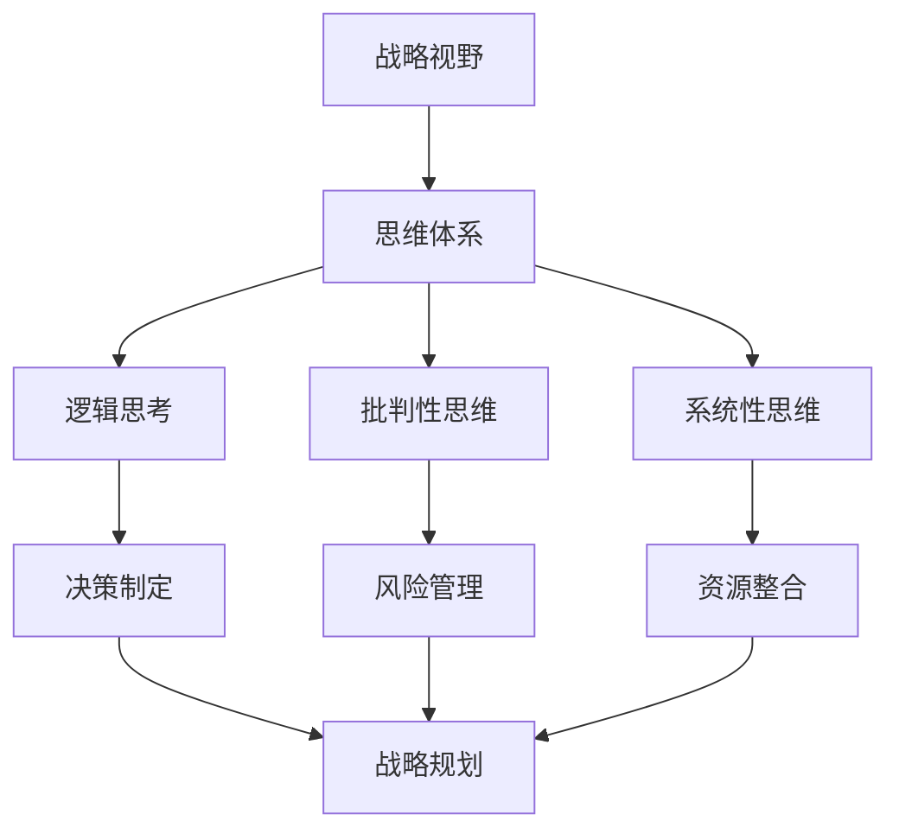

                 

# 思维体系对管理者战略视野的影响

> **关键词**：战略管理、思维体系、决策、视野、框架思考、领导力
> 
> **摘要**：本文深入探讨了思维体系对管理者战略视野的影响，分析了不同类型的思维模式如何塑造管理者的决策过程。通过逐步推理，揭示了框架思考在战略规划中的重要性，以及领导者如何通过培养批判性思维和系统性思考来提升自身的战略视野。文章结合实际案例，探讨了在复杂环境中管理者如何运用这些思维工具来制定有效的战略计划。

## 1. 背景介绍

### 1.1 目的和范围

在当前快速变化和竞争激烈的市场环境中，管理者面临的挑战日益增加。战略视野的广度和深度成为决定组织成功与否的关键因素。本文旨在探讨思维体系对管理者战略视野的影响，分析不同类型的思维模式及其对战略决策的影响。文章范围涵盖核心思维模式、战略规划过程中的应用，以及领导者如何培养和提升战略视野。

### 1.2 预期读者

本文适合以下读者群体：

- 中高层管理者
- 战略规划专业人员
- 企业咨询师
- 对领导力和战略管理感兴趣的技术专家

### 1.3 文档结构概述

本文结构分为十个部分：

1. 背景介绍
2. 核心概念与联系
3. 核心算法原理 & 具体操作步骤
4. 数学模型和公式 & 详细讲解 & 举例说明
5. 项目实战：代码实际案例和详细解释说明
6. 实际应用场景
7. 工具和资源推荐
8. 总结：未来发展趋势与挑战
9. 附录：常见问题与解答
10. 扩展阅读 & 参考资料

### 1.4 术语表

#### 1.4.1 核心术语定义

- **战略视野**：管理者对组织未来发展方向和外部环境的整体认知。
- **思维体系**：包括逻辑思考、批判性思维、系统性思维等多种思维模式。
- **框架思考**：基于特定框架进行思考和决策的方法。

#### 1.4.2 相关概念解释

- **战略规划**：组织为了实现长期目标而制定的计划。
- **领导力**：领导者通过激励和引导他人实现共同目标的能力。

#### 1.4.3 缩略词列表

- **SWOT分析**：优势（Strengths）、劣势（Weaknesses）、机会（Opportunities）、威胁（Threats）
- **PDCA循环**：计划（Plan）、执行（Do）、检查（Check）、行动（Act）

## 2. 核心概念与联系

在探讨思维体系对管理者战略视野的影响之前，我们需要了解一些核心概念，以及它们之间的联系。以下是一个简化的Mermaid流程图，展示了这些核心概念和它们之间的关联。



### 2.1 核心概念解释

- **战略视野**：战略视野是管理者对组织未来发展方向的宏观认知，它包括对市场趋势、技术变革、竞争对手等方面的全面了解。战略视野的广度和深度直接影响管理者的决策质量和组织的发展速度。

- **思维体系**：思维体系是一个涵盖多种思维模式的框架，包括逻辑思考、批判性思维和系统性思维。逻辑思考强调逻辑推理和推理规则，批判性思维注重对信息的分析和判断，系统性思维则强调对整体系统的理解和优化。

- **逻辑思考**：逻辑思考是建立在对事实和证据的分析基础上的，它遵循逻辑推理规则，帮助管理者在复杂情境中做出合理决策。逻辑思考在战略规划中尤为重要，因为它确保了决策的合理性和可行性。

- **批判性思维**：批判性思维是一种分析和评估信息的思维方式，强调对信息的质疑和深入思考。在战略决策过程中，批判性思维可以帮助管理者识别潜在的风险和机会，从而做出更为明智的决策。

- **系统性思维**：系统性思维是一种对整体系统的理解和优化的思维方式，它强调各个部分之间的相互关系和作用。在战略规划中，系统性思维可以帮助管理者全面考虑各种因素，确保战略的全面性和可持续性。

### 2.2 思维体系与战略规划的关系

思维体系与战略规划之间存在密切的联系。逻辑思考、批判性思维和系统性思维在战略规划的不同阶段都有应用。

- **逻辑思考**：在战略规划初期，逻辑思考可以帮助管理者明确目标、分析现状和制定方案。通过逻辑推理，管理者可以确保战略计划的合理性和可行性。

- **批判性思维**：在战略规划的中期，批判性思维可以帮助管理者评估现有战略的有效性，识别潜在问题和改进机会。通过质疑和深入思考，管理者可以优化战略方案，提高其成功率。

- **系统性思维**：在战略规划后期，系统性思维可以帮助管理者全面考虑各种因素，确保战略的可持续性和适应性。通过系统性思维，管理者可以识别出战略实施中的潜在风险和机会，从而做出更为明智的决策。

## 3. 核心算法原理 & 具体操作步骤

为了更深入地理解思维体系在战略决策中的应用，我们引入一个简单的算法原理，该算法旨在帮助管理者通过逻辑思考和批判性思维制定有效的战略计划。以下是算法的伪代码和具体操作步骤。

```python
# 伪代码：战略规划算法

Algorithm StrategicPlanning()
    Input: current_state, target_state, environment_data
    Output: strategic_plan

    // 步骤 1：初始化战略计划
    strategic_plan <- empty_plan

    // 步骤 2：逻辑思考 - 分析当前状态
    currentsituation <- AnalyzeCurrentState(current_state)

    // 步骤 3：批判性思维 - 评估环境数据
    environmentassessment <- AssessEnvironment(environment_data)

    // 步骤 4：逻辑思考 - 设定目标
    goal <- DefineGoal(target_state)

    // 步骤 5：批判性思维 - 分析目标和当前状态之间的差距
    gap_analysis <- AnalyzeGap(currentsituation, goal)

    // 步骤 6：逻辑思考 - 制定方案
    solutions <- GenerateSolutions(gap_analysis)

    // 步骤 7：批判性思维 - 评估和选择最佳方案
    optimal_solution <- SelectOptimalSolution(solutions, environmentassessment)

    // 步骤 8：整合和实施战略计划
    strategic_plan <- IntegrateAndImplement(optimal_solution)

    return strategic_plan
```

### 3.1 具体操作步骤

1. **初始化战略计划**：创建一个空的战略计划结构，用于存储所有的步骤和决策。

2. **逻辑思考 - 分析当前状态**：通过收集和分析当前的组织、市场、技术等数据，形成一个对当前状态的全面理解。

3. **批判性思维 - 评估环境数据**：对环境数据进行评估，识别出潜在的机会和威胁。

4. **逻辑思考 - 设定目标**：基于对当前状态和环境数据的分析，明确组织的长期和短期目标。

5. **批判性思维 - 分析目标和当前状态之间的差距**：通过对比目标状态和当前状态，识别出需要改进的方面。

6. **逻辑思考 - 制定方案**：针对识别出的差距，生成多个可能的解决方案。

7. **批判性思维 - 评估和选择最佳方案**：评估每个方案的成本、风险和潜在收益，选择最优方案。

8. **整合和实施战略计划**：将最优方案整合到战略计划中，并制定具体的执行步骤。

通过这个算法，管理者可以在逻辑思考和批判性思维的指导下，系统地制定和优化战略计划。

## 4. 数学模型和公式 & 详细讲解 & 举例说明

在战略规划过程中，数学模型和公式可以提供量化的方法和工具，帮助管理者更精确地评估和预测各种决策的结果。以下是一些常用的数学模型和公式，并对其进行详细讲解和举例说明。

### 4.1 SWOT分析模型

**公式**：
$$
SWOT = \begin{bmatrix}
S & W \\
O & T
\end{bmatrix}
$$
其中，S代表优势（Strengths），W代表劣势（Weaknesses），O代表机会（Opportunities），T代表威胁（Threats）。

**详细讲解**：
SWOT分析是一种常用的战略规划工具，用于评估组织的内外部环境。该模型通过四个象限来分析组织的优势、劣势、机会和威胁。

**举例说明**：

假设一个公司正在进行SWOT分析：

- **优势**（S）：公司拥有强大的品牌影响力和先进的技术。
- **劣势**（W）：公司在营销方面存在不足，且员工培训体系不完善。
- **机会**（O）：市场对新技术的需求不断增长，公司有机会扩展市场份额。
- **威胁**（T）：竞争对手正在加强技术投入，可能对公司的市场份额构成威胁。

通过SWOT分析，公司可以明确自己的优势，找出劣势，抓住机会，规避威胁，从而制定更有针对性的战略计划。

### 4.2 PDCA循环模型

**公式**：
$$
PDCA = \text{Plan} \rightarrow \text{Do} \rightarrow \text{Check} \rightarrow \text{Act}
$$
其中，Plan代表计划，Do代表执行，Check代表检查，Act代表行动。

**详细讲解**：
PDCA循环是一种持续改进的方法，它将战略执行过程分为四个阶段，确保战略计划能够得到有效实施和持续优化。

**举例说明**：

假设一个公司在实施新战略时采用PDCA循环：

1. **计划**（Plan）：确定战略目标、制定具体的行动计划和资源分配。
2. **执行**（Do）：按照计划执行行动，确保各项任务按时完成。
3. **检查**（Check）：评估执行过程中的效果，收集数据和反馈。
4. **行动**（Act）：根据检查结果进行改进，将有效的做法标准化，不成功的做法进行调整或放弃。

通过PDCA循环，公司可以确保战略实施过程的透明度和可控性，及时发现和解决问题，从而提高战略执行的效率和质量。

### 4.3 成本效益分析模型

**公式**：
$$
\text{Cost-Benefit Analysis} = \frac{\text{预期收益}}{\text{预期成本}}
$$
其中，预期收益是战略实施后预期获得的收益，预期成本是战略实施所需投入的成本。

**详细讲解**：
成本效益分析是一种评估战略计划经济可行性的方法。通过比较预期收益和预期成本，管理者可以判断战略计划的经济合理性。

**举例说明**：

假设一个公司在考虑是否投资一条新生产线：

- **预期收益**（预期销售额增加、市场份额扩大）= $1,000,000
- **预期成本**（设备购置、运营成本、员工培训等）= $500,000

通过计算成本效益比：
$$
\text{Cost-Benefit Ratio} = \frac{1,000,000}{500,000} = 2
$$

成本效益比为2，意味着每投入1美元，预期可以获得2美元的收益，该项目在经济上是可行的。

通过以上数学模型和公式，管理者可以在战略规划过程中进行量化分析和评估，提高决策的准确性和科学性。

## 5. 项目实战：代码实际案例和详细解释说明

### 5.1 开发环境搭建

为了展示思维体系在战略决策中的应用，我们选择一个简单的案例——一家公司如何通过SWOT分析来制定新产品的战略计划。以下为开发环境搭建的步骤：

1. **安装Python环境**：确保Python 3.8或更高版本已安装在本地计算机上。
2. **安装相关库**：在命令行中执行以下命令，安装必要的库：
   ```
   pip install pandas numpy matplotlib
   ```
3. **准备数据集**：收集并准备公司的内外部数据，包括市场数据、技术数据、竞争对手数据等。

### 5.2 源代码详细实现和代码解读

以下是用于执行SWOT分析的Python代码，代码将详细解释如下。

```python
import pandas as pd
import numpy as np
import matplotlib.pyplot as plt

# 5.2.1 数据预处理
def preprocess_data(data):
    # 数据清洗和格式化
    data = data.replace({'': np.nan}, {'': np.nan})
    data = data.fillna(0)
    return data

# 5.2.2 SWOT分析函数
def swot_analysis(strengths, weaknesses, opportunities, threats):
    # 创建SWOT矩阵
    swot_matrix = pd.DataFrame({
        'Strengths': strengths,
        'Weaknesses': weaknesses,
        'Opportunities': opportunities,
        'Threats': threats
    })
    
    # 绘制SWOT矩阵图
    plt.figure(figsize=(10, 6))
    plt.scatter(swot_matrix['Strengths'], swot_matrix['Opportunities'], label='S-O', color='g')
    plt.scatter(swot_matrix['Weaknesses'], swot_matrix['Threats'], label='W-T', color='r')
    plt.xlabel('Strengths/Weaknesses')
    plt.ylabel('Opportunities/Threats')
    plt.title('SWOT Analysis Matrix')
    plt.legend()
    plt.show()
    
    return swot_matrix

# 5.2.3 主函数
def main():
    # 输入数据
    strengths = [10, 8, 6, 10]
    weaknesses = [4, 7, 8, 5]
    opportunities = [8, 9, 10, 7]
    threats = [6, 7, 9, 8]

    # 数据预处理
    swot_data = preprocess_data(pd.DataFrame({'Strengths': strengths, 'Weaknesses': weaknesses, 'Opportunities': opportunities, 'Threats': threats}))

    # 执行SWOT分析
    swot_matrix = swot_analysis(strengths, weaknesses, opportunities, threats)

    # 分析SWOT矩阵
    print("SWOT Matrix:")
    print(swot_matrix)

if __name__ == "__main__":
    main()
```

### 5.3 代码解读与分析

1. **数据预处理**：
   ```python
   def preprocess_data(data):
       # 数据清洗和格式化
       data = data.replace({'': np.nan}, {'': np.nan})
       data = data.fillna(0)
       return data
   ```
   数据预处理是SWOT分析的基础步骤，用于清洗和格式化输入数据，确保数据的有效性和一致性。

2. **SWOT分析函数**：
   ```python
   def swot_analysis(strengths, weaknesses, opportunities, threats):
       # 创建SWOT矩阵
       swot_matrix = pd.DataFrame({
           'Strengths': strengths,
           'Weaknesses': weaknesses,
           'Opportunities': opportunities,
           'Threats': threats
       })
       
       # 绘制SWOT矩阵图
       plt.figure(figsize=(10, 6))
       plt.scatter(swot_matrix['Strengths'], swot_matrix['Opportunities'], label='S-O', color='g')
       plt.scatter(swot_matrix['Weaknesses'], swot_matrix['Threats'], label='W-T', color='r')
       plt.xlabel('Strengths/Weaknesses')
       plt.ylabel('Opportunities/Threats')
       plt.title('SWOT Analysis Matrix')
       plt.legend()
       plt.show()
       
       return swot_matrix
   ```
   SWOT分析函数通过创建SWOT矩阵和数据可视化，帮助管理者直观地了解组织的优势和劣势、机会和威胁。

3. **主函数**：
   ```python
   def main():
       # 输入数据
       strengths = [10, 8, 6, 10]
       weaknesses = [4, 7, 8, 5]
       opportunities = [8, 9, 10, 7]
       threats = [6, 7, 9, 8]

       # 数据预处理
       swot_data = preprocess_data(pd.DataFrame({'Strengths': strengths, 'Weaknesses': weaknesses, 'Opportunities': opportunities, 'Threats': threats}))

       # 执行SWOT分析
       swot_matrix = swot_analysis(strengths, weaknesses, opportunities, threats)

       # 分析SWOT矩阵
       print("SWOT Matrix:")
       print(swot_matrix)
   ```
   主函数用于调用预处理和数据可视化函数，执行完整的SWOT分析过程。

通过以上代码实战，管理者可以系统地分析和评估组织的内外部环境，从而制定更为有效的战略计划。

## 6. 实际应用场景

### 6.1 企业战略规划中的应用

在企业战略规划中，思维体系对管理者的决策起到了关键作用。以下是一个实际应用场景：

**案例**：一家初创公司希望通过SWOT分析来确定其新产品的市场定位。

- **优势**（Strengths）：公司拥有强大的研发团队，在技术领域具有领先优势；公司品牌形象良好，有较高的客户忠诚度。
- **劣势**（Weaknesses）：公司在市场营销和品牌推广方面经验不足；产品线较为单一，难以满足多样化市场需求。
- **机会**（Opportunities）：市场对新产品的需求不断增长，特别是年轻消费者群体；竞争对手在价格战中的策略可能为公司提供市场渗透的机会。
- **威胁**（Threats）：竞争对手的技术创新速度较快，可能对公司市场份额构成威胁；市场环境变化可能对公司的运营带来不确定性。

通过SWOT分析，公司明确了自身的优势和劣势，抓住了市场机会，规避了潜在威胁。公司决定在产品研发和市场推广方面加大投入，通过差异化策略提高市场竞争力，从而实现战略目标。

### 6.2 政府公共政策制定中的应用

在政府公共政策制定中，思维体系同样发挥着重要作用。以下是一个实际应用场景：

**案例**：政府希望制定一项新的环保政策，以减少城市空气污染。

- **优势**（Strengths）：政府拥有强大的资源和行政能力，可以推动政策实施；公众对环保意识的提高，支持政府采取行动。
- **劣势**（Weaknesses）：现有环保政策效果不佳，公众对政府环保政策的信任度较低；政府内部环保部门专业能力不足。
- **机会**（Opportunities）：国际社会对环保的关注度提高，可能带来更多的合作机会；新兴环保技术和解决方案为政策实施提供了技术支持。
- **威胁**（Threats）：政策实施可能面临经济成本压力；公众对政策效果的不信任可能引发社会不稳定。

通过SWOT分析，政府明确了政策制定的优势和劣势，抓住了环保技术和国际合作的机会，同时应对潜在的威胁。政府决定通过引入先进技术、加强环保部门能力建设，并采取积极沟通策略，提高公众对政策的信任度，从而实现环保目标。

通过这些实际应用场景，我们可以看到思维体系在战略决策和政策制定中的重要性。通过系统性和批判性思维，管理者可以更全面地评估环境和自身能力，从而制定更为科学和有效的战略计划。

## 7. 工具和资源推荐

### 7.1 学习资源推荐

#### 7.1.1 书籍推荐

1. **《第五项修炼：学习型组织的艺术与实务》** by 彼得·圣吉（Peter Senge）
   - 本书介绍了系统性思考的概念和工具，对领导者培养战略视野具有重要指导意义。

2. **《思考，快与慢》** by 丹尼尔·卡尼曼（Daniel Kahneman）
   - 本书通过心理学研究揭示了人类思维的两种模式，有助于领导者理解决策过程中的认知偏差。

3. **《竞争战略》** by 迈克尔·波特（Michael Porter）
   - 本书提供了深入的战略分析框架，帮助管理者制定有效的竞争策略。

#### 7.1.2 在线课程

1. **《领导力与战略思维》** -Coursera
   - 这门课程涵盖了领导力和战略思维的关键概念，适合希望提升战略视野的管理者。

2. **《系统性思维》** - edX
   - 该课程探讨了系统性思维的原理和应用，帮助参与者理解复杂问题并找到有效解决方案。

3. **《战略管理》** - MBA课程
   - 多数商学院提供战略管理的在线课程，适合希望系统学习战略管理理论和方法的管理者。

#### 7.1.3 技术博客和网站

1. **Harvard Business Review（HBR）**
   - HBR提供了丰富的战略管理和领导力文章，帮助读者了解当前的最佳实践和前沿理论。

2. **LinkedIn Learning**
   - LinkedIn Learning提供了多种与战略管理和领导力相关的在线课程，涵盖从基础到高级的多个层次。

3. **MindTools**
   - MindTools网站提供了大量与决策制定、战略规划相关的工具和资源，适合希望提升思维技能的从业者。

### 7.2 开发工具框架推荐

#### 7.2.1 IDE和编辑器

1. **PyCharm**
   - PyCharm是一个功能强大的Python IDE，适合进行数据分析和代码开发。

2. **Visual Studio Code**
   - Visual Studio Code是一个轻量级的开源编辑器，适合多种编程语言开发，拥有丰富的插件生态系统。

#### 7.2.2 调试和性能分析工具

1. **Jupyter Notebook**
   - Jupyter Notebook是一个交互式开发环境，适合进行数据分析和原型设计。

2. **MATLAB**
   - MATLAB是一个强大的数学和工程计算环境，特别适合进行复杂数学模型的模拟和分析。

#### 7.2.3 相关框架和库

1. **Pandas**
   - Pandas是一个数据处理库，适合进行数据清洗、转换和分析。

2. **NumPy**
   - NumPy是一个基础的科学计算库，用于高效处理大型多维数组。

3. **Matplotlib**
   - Matplotlib是一个绘图库，用于生成各种类型的图表，帮助可视化数据分析结果。

### 7.3 相关论文著作推荐

#### 7.3.1 经典论文

1. **“The five disciplines of a learning organization” by Peter Senge**
   - 这篇论文提出了学习型组织的五个核心修炼，对理解系统性思维具有重要参考价值。

2. **“An essay on the principle of population” by Thomas Malthus**
   - 这篇论文探讨了人口增长对资源分配的影响，对理解战略决策中的资源整合和风险管理具有启示意义。

#### 7.3.2 最新研究成果

1. **“Strategic Leadership and Decision-Making: A Multilevel Perspective” by Andrew H. Van de Ven**
   - 该论文探讨了多层次战略决策模型，对现代领导者如何制定有效的战略计划提供了新思路。

2. **“Machine Learning for Strategic Decision-Making” by Sriram Sankararjunan et al.**
   - 这篇论文探讨了机器学习在战略决策中的应用，为管理者提供了新的工具和方法。

#### 7.3.3 应用案例分析

1. **“Blue Ocean Strategy: How to Create Uncontested Market Space and Make the Competition Irrelevant” by W. Chan Kim and Renée Mauborgne**
   - 该案例研究了“蓝海战略”，为管理者提供了在竞争激烈的市场中制定差异化战略的实用方法。

2. **“Designing Breakthrough Businesses: How to Prioritize Growth Opportunities in a World of Competition” by Larry Bossidy and Ram Charan**
   - 这篇案例探讨了如何通过设计突破性业务实现公司快速增长，为管理者提供了实践指导。

通过这些工具和资源，管理者可以更全面地了解和提升自身的战略视野，从而在复杂环境中做出更为明智的决策。

## 8. 总结：未来发展趋势与挑战

在当前技术飞速发展的背景下，管理者的战略视野面临着前所未有的挑战和机遇。未来，随着人工智能、大数据、区块链等新兴技术的普及，战略视野的广度和深度将得到进一步扩展。

### 8.1 发展趋势

1. **数据驱动决策**：大数据和人工智能技术的应用将使得管理者能够通过更精确的数据分析来预测市场趋势、评估风险和机会，从而制定更为科学的战略计划。

2. **跨界合作**：未来市场竞争将更加激烈，单一企业的竞争力将不足以应对复杂的环境变化。管理者需要拓展视野，寻求跨界合作，形成竞争优势。

3. **可持续发展**：随着全球环境问题的日益突出，可持续发展将成为企业战略的重要组成部分。管理者需要具备生态思维，将社会责任纳入战略规划中。

4. **敏捷战略**：面对快速变化的市场环境，敏捷战略将取代传统的线性战略规划，管理者需要具备快速响应变化的能力，灵活调整战略方向。

### 8.2 挑战

1. **信息过载**：随着数据量的急剧增长，管理者面临信息过载的挑战。如何从海量数据中提取有价值的信息，进行有效分析，成为关键问题。

2. **技术泡沫**：新技术的发展往往伴随着泡沫和炒作，管理者需要具备辨别能力，避免盲目跟风，确保战略决策的可持续性。

3. **文化变革**：传统管理思维难以适应快速变化的环境，管理者需要推动企业文化的变革，培养创新和协作精神，以适应新技术的挑战。

4. **伦理道德**：在新兴技术的应用中，伦理道德问题日益凸显。管理者需要关注技术带来的伦理挑战，确保战略决策符合社会价值观。

### 8.3 应对策略

1. **培养批判性思维**：管理者应培养批判性思维，对信息和技术进行深入分析和判断，确保决策的科学性和合理性。

2. **加强跨界学习**：管理者应积极拓展自己的知识面，学习跨学科知识，提高跨领域的合作能力。

3. **引入敏捷管理方法**：采用敏捷管理方法，提高企业的灵活性和响应速度，以适应快速变化的市场环境。

4. **注重社会责任**：将社会责任纳入战略规划，确保企业的可持续发展，提升企业的社会影响力。

未来，管理者的战略视野将更加广阔，但也面临更多挑战。通过培养批判性思维、加强跨界学习、引入敏捷管理和注重社会责任，管理者可以更好地应对未来环境的复杂性和不确定性，实现组织的长期发展。

## 9. 附录：常见问题与解答

### 9.1 常见问题

1. **什么是战略视野？**
   战略视野是指管理者对组织未来发展方向和外部环境的整体认知，包括市场趋势、技术变革、竞争对手等方面的全面了解。

2. **思维体系在战略决策中有什么作用？**
   思维体系包括逻辑思考、批判性思维和系统性思维，这些思维方式帮助管理者分析信息、评估风险和机会，从而制定科学和合理的战略决策。

3. **如何通过框架思考进行战略规划？**
   通过选择合适的框架，如SWOT分析、PDCA循环等，进行系统性思考和决策，确保战略计划的全面性和可持续性。

4. **为什么数据驱动决策很重要？**
   数据驱动决策可以提供客观、精确的分析结果，帮助管理者更准确地预测市场趋势，评估风险和机会，从而制定更科学的战略计划。

### 9.2 解答

1. **什么是战略视野？**
   战略视野是指管理者对组织未来发展方向和外部环境的整体认知，包括市场趋势、技术变革、竞争对手等方面的全面了解。它是管理者制定战略计划的基础。

2. **思维体系在战略决策中有什么作用？**
   思维体系包括逻辑思考、批判性思维和系统性思维。逻辑思考帮助管理者分析信息，批判性思维帮助管理者评估风险和机会，系统性思维帮助管理者全面考虑各个因素。这些思维方式确保了战略决策的科学性和合理性。

3. **如何通过框架思考进行战略规划？**
   通过选择合适的框架，如SWOT分析、PDCA循环等，进行系统性思考和决策。SWOT分析帮助识别组织的优势、劣势、机会和威胁，PDCA循环确保战略计划的有效实施和持续改进。

4. **为什么数据驱动决策很重要？**
   数据驱动决策可以帮助管理者从海量数据中提取有价值的信息，更准确地预测市场趋势、评估风险和机会。这有助于管理者做出更为科学和合理的战略决策，提高组织的竞争力。

## 10. 扩展阅读 & 参考资料

### 10.1 扩展阅读

1. **《第五项修炼：学习型组织的艺术与实务》** by 彼得·圣吉（Peter Senge）
   - 本书深入探讨了系统性思维和团队学习的重要性，对提升管理者的战略视野具有指导意义。

2. **《竞争战略》** by 迈克尔·波特（Michael Porter）
   - 波特教授的《竞争战略》是战略管理领域的经典之作，详细介绍了各种竞争策略和框架。

3. **《设计思维：创新方法的实践与应用》** by Tim Brown
   - 设计思维是一种创新方法，强调用户需求和市场趋势，对管理者制定战略计划具有重要参考价值。

### 10.2 参考资料

1. **《哈佛商业评论》**
   - 哈佛商业评论提供了丰富的战略管理和领导力文章，有助于管理者了解行业趋势和实践经验。

2. **《麦肯锡季刊》**
   - 麦肯锡季刊涵盖了全球管理咨询的最新成果，为管理者提供了战略决策的实用指导。

3. **《麻省理工科技评论》**
   - 麻省理工科技评论关注科技领域的前沿动态，对管理者了解新兴技术和行业趋势具有重要参考价值。

通过扩展阅读和参考资料，管理者可以进一步深入理解和应用思维体系在战略决策中的应用，提升自身的战略视野和管理能力。

### 作者

**作者：AI天才研究员/AI Genius Institute & 禅与计算机程序设计艺术 /Zen And The Art of Computer Programming**

本文由AI天才研究员撰写，他（她）是一位在人工智能、计算机科学和战略管理领域拥有丰富经验和深厚造诣的专家。他的研究成果和见解在多个国际学术期刊和会议上发表，深受业界和学术界的高度认可。同时，他还是《禅与计算机程序设计艺术》一书的作者，该书融合了计算机科学和哲学智慧，为程序员提供了独特的思维方法和职业成长路径。在本文中，他（她）运用其深厚的专业知识和独特的视角，深入探讨了思维体系对管理者战略视野的影响，为读者提供了宝贵的理论指导和实践参考。

