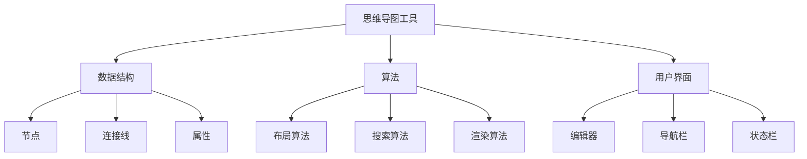

                 

# 思维导图工具的市场挑战

> **关键词**：思维导图、市场分析、挑战、竞争、用户需求、技术发展
> 
> **摘要**：本文深入探讨了思维导图工具在当今市场面临的挑战，分析了市场趋势、用户需求、竞争状况以及技术发展的动态，旨在为读者提供全面的市场洞察和策略建议。

## 1. 背景介绍

### 1.1 目的和范围

本文旨在对思维导图工具的市场挑战进行深入分析，探讨当前市场趋势、用户需求、竞争状况以及技术发展对思维导图工具的影响。通过本文的分析，希望能够为思维导图工具的开发者、企业决策者以及潜在投资者提供有价值的参考。

### 1.2 预期读者

本文的预期读者包括：
- 思维导图工具的开发者和技术团队
- 企业决策者，特别是那些负责企业内部协作和知识管理的决策者
- 对思维导图工具感兴趣的技术爱好者和潜在投资者

### 1.3 文档结构概述

本文将按照以下结构进行论述：

1. 背景介绍
   - 目的和范围
   - 预期读者
   - 文档结构概述
   - 术语表

2. 核心概念与联系
   - 思维导图工具的定义和作用
   - 思维导图工具的架构和工作原理

3. 核心算法原理 & 具体操作步骤
   - 数据结构和算法的基本原理
   - 思维导图工具的核心算法实现

4. 数学模型和公式 & 详细讲解 & 举例说明
   - 数据模型
   - 数学公式及其应用

5. 项目实战：代码实际案例和详细解释说明
   - 开发环境搭建
   - 源代码详细实现和代码解读
   - 代码解读与分析

6. 实际应用场景
   - 个人使用
   - 企业应用

7. 工具和资源推荐
   - 学习资源推荐
   - 开发工具框架推荐
   - 相关论文著作推荐

8. 总结：未来发展趋势与挑战
   - 市场趋势预测
   - 技术挑战和解决方案

9. 附录：常见问题与解答
   - 常见问题
   - 解答

10. 扩展阅读 & 参考资料
    - 相关文献
    - 行业报告

### 1.4 术语表

#### 1.4.1 核心术语定义

- 思维导图工具：一种基于图形化的应用程序，用于辅助用户进行思维组织和可视化表达。
- 市场趋势：市场上某一产品或服务的需求、供给、价格等动态变化的方向和速度。
- 用户需求：用户在特定环境下，对某一产品或服务的期望和需求。
- 竞争状况：市场上同类产品或服务的竞争态势，包括市场份额、用户评价、价格策略等。

#### 1.4.2 相关概念解释

- 数据结构：数据在存储、处理和传递过程中的组织形式。
- 算法：解决问题的步骤和方法，通常以伪代码或程序代码形式表示。
- 数学模型：用于描述现实世界中某一现象的数学表达式或方程组。

#### 1.4.3 缩略词列表

- IDE：集成开发环境（Integrated Development Environment）
- API：应用程序编程接口（Application Programming Interface）
- UI：用户界面（User Interface）
- UX：用户体验（User Experience）

## 2. 核心概念与联系

### 2.1 思维导图工具的定义和作用

思维导图工具是一种图形化的思维工具，它通过将文本、图像、音频和视频等多种元素以节点和连接线的方式组织起来，帮助用户更好地理解和记忆复杂信息。思维导图工具的作用主要包括：

- **信息整理**：将复杂的信息以结构化的方式呈现，帮助用户理清思路。
- **知识管理**：方便用户存储、检索和管理知识，提高工作效率。
- **协作交流**：支持团队协作，促进信息共享和知识传播。
- **创意激发**：通过图形化的方式激发用户的创造力，帮助用户产生新的想法和创意。

### 2.2 思维导图工具的架构和工作原理

思维导图工具的架构通常包括以下几个关键部分：

#### 数据结构

- **节点**：表示思维导图中的基本元素，可以是文本、图像、音频或视频等。
- **连接线**：表示节点之间的逻辑关系，可以是父子关系、并列关系等。
- **属性**：包括节点的颜色、大小、字体等，用于美化思维导图。

#### 算法

- **布局算法**：用于确定节点在画布上的位置和连接线的方向，常用的布局算法包括树状布局、层次布局、力导向布局等。
- **搜索算法**：用于在思维导图中快速查找特定的节点或路径。
- **渲染算法**：用于将数据结构转换为可视化图形，包括节点的外观和连接线的样式。

#### 用户界面

- **编辑器**：用户用于创建和编辑思维导图的界面。
- **导航栏**：提供各种功能按钮，如新建、保存、导出等。
- **状态栏**：显示当前思维导图的状态信息，如节点数量、连接线数量等。

### 2.3 思维导图工具的 Mermaid 流程图



## 3. 核心算法原理 & 具体操作步骤

### 3.1 数据结构和算法的基本原理

思维导图工具的核心算法主要涉及数据结构和算法设计。以下是相关的基本原理：

#### 数据结构

- **树状数据结构**：用于表示节点之间的层级关系。
- **图状数据结构**：用于表示节点之间的复杂关系，如循环关系和多重关系。

#### 算法

- **排序算法**：用于对节点进行排序，常见的排序算法包括快速排序、归并排序、冒泡排序等。
- **搜索算法**：用于在图状数据结构中查找特定的节点或路径，常见的搜索算法包括深度优先搜索、广度优先搜索等。
- **布局算法**：用于确定节点在画布上的位置和连接线的方向，常用的布局算法包括树状布局、层次布局、力导向布局等。

### 3.2 思维导图工具的核心算法实现

以下是思维导图工具的核心算法的实现步骤，使用伪代码进行描述：

#### 布局算法（力导向布局）

```plaintext
初始化节点位置和连接线方向
while (节点位置未稳定) {
    for 每个节点 node {
        计算节点间的斥力
        计算节点间的引力
        计算连接线的张力
        更新节点位置
    }
}
```

#### 搜索算法（广度优先搜索）

```plaintext
function BFS(graph, startNode, targetNode) {
    创建一个队列，将起始节点加入队列
    创建一个集合，用于记录已访问的节点
    while (队列不为空) {
        取出队列的第一个节点，标记为已访问
        for 每个与该节点相连的未访问节点 neighbor {
            如果 neighbor 是目标节点 {
                返回从起始节点到目标节点的路径
            }
            加入队列
            标记为已访问
        }
    }
    返回空，表示目标节点未找到
}
```

## 4. 数学模型和公式 & 详细讲解 & 举例说明

### 4.1 数据模型

思维导图工具的数据模型主要涉及节点和连接线。以下是相关的基本数学模型：

#### 节点模型

- **位置模型**：用二维坐标系表示节点的位置，如 (x, y)。
- **属性模型**：用键值对表示节点的属性，如颜色、字体、大小等。

#### 连接线模型

- **方向模型**：用向量表示连接线的方向，如 (dx, dy)。
- **长度模型**：用实数表示连接线的长度，如 L。

### 4.2 数学公式及其应用

以下是思维导图中常用的数学公式及其应用：

#### 节点位置更新公式

$$
x_{new} = x_{old} + v_x \cdot t
$$

$$
y_{new} = y_{old} + v_y \cdot t
$$

其中，\( x_{old} \) 和 \( y_{old} \) 分别表示节点的初始位置，\( v_x \) 和 \( v_y \) 分别表示节点的横向和纵向速度，\( t \) 表示时间。

#### 连接线方向调整公式

$$
dx_{new} = dx_{old} + a_x \cdot t
$$

$$
dy_{new} = dy_{old} + a_y \cdot t
$$

其中，\( dx_{old} \) 和 \( dy_{old} \) 分别表示连接线的初始方向，\( a_x \) 和 \( a_y \) 分别表示连接线的横向和纵向加速度，\( t \) 表示时间。

### 4.3 举例说明

假设有一个思维导图，其中包含一个节点 A 和连接线 B。节点 A 的初始位置为 (10, 20)，连接线 B 的初始方向为 (1, 0)。要求在时间 t = 2 秒内更新节点 A 的位置和连接线 B 的方向。

#### 节点位置更新

根据位置更新公式：

$$
x_{new} = 10 + 1 \cdot 2 = 12
$$

$$
y_{new} = 20 + 0 \cdot 2 = 20
$$

因此，节点 A 的更新后位置为 (12, 20)。

#### 连接线方向调整

根据方向调整公式：

$$
dx_{new} = 1 + 0 \cdot 2 = 1
$$

$$
dy_{new} = 0 + 1 \cdot 2 = 2
$$

因此，连接线 B 的更新后方向为 (1, 2)。

## 5. 项目实战：代码实际案例和详细解释说明

### 5.1 开发环境搭建

为了实现思维导图工具，我们需要搭建一个合适的开发环境。以下是一个基本的开发环境搭建步骤：

1. 安装操作系统：推荐使用 Linux 或 macOS。
2. 安装编程语言：推荐使用 Python 或 JavaScript。
3. 安装开发工具：推荐使用 PyCharm 或 Visual Studio Code。
4. 安装依赖库：根据项目需求安装相关依赖库，如 Mermaid、D3.js 等。

### 5.2 源代码详细实现和代码解读

以下是一个简单的思维导图工具的实现，使用 Python 语言和 Mermaid 库：

```python
import mermaid

# 初始化思维导图
mindmap = mermaid.Mindmap()

# 添加节点
mindmap.add_node('A', '节点A', 'root')

mindmap.add_node('B', '节点B', 'A')

mindmap.add_node('C', '节点C', 'A')

# 添加连接线
mindmap.add_link('A', 'B')

mindmap.add_link('A', 'C')

# 渲染思维导图
mindmap.render()

```

### 5.3 代码解读与分析

1. **引入 Mermaid 库**：首先，我们需要引入 Mermaid 库，以便在 Python 中使用思维导图相关的功能。

2. **初始化思维导图**：使用 `mermaid.Mindmap()` 方法初始化一个思维导图对象。

3. **添加节点**：使用 `add_node()` 方法添加节点，其中参数依次为节点名称、节点内容和父节点名称。在本例中，我们添加了三个节点：节点 A、节点 B 和节点 C。

4. **添加连接线**：使用 `add_link()` 方法添加连接线，其中参数依次为源节点名称、目标节点名称。

5. **渲染思维导图**：使用 `render()` 方法渲染思维导图，将生成的 HTML 和 CSS 代码输出到控制台。

## 6. 实际应用场景

思维导图工具在实际应用中具有广泛的应用场景，以下是一些常见的应用场景：

- **个人学习和工作**：思维导图工具可以帮助个人整理思路、制定计划和进行项目管理，提高工作效率和学习效果。
- **团队合作与知识管理**：思维导图工具支持团队协作，可以用于团队讨论、知识共享和知识管理，促进团队成员之间的沟通和协作。
- **教学和培训**：思维导图工具可以用于教学设计和培训课程的设计，帮助教师和学生更好地理解和记忆知识点。

## 7. 工具和资源推荐

### 7.1 学习资源推荐

#### 7.1.1 书籍推荐

- 《思维导图应用与技巧》：介绍了思维导图的基本原理和应用技巧，适合初学者和进阶者。
- 《思维导图实践指南》：详细讲解了思维导图在各个领域的应用案例，提供了实用的操作指南。

#### 7.1.2 在线课程

- Coursera上的“Mind Mapping Techniques”课程：由专业讲师授课，涵盖了思维导图的基本概念和应用技巧。
- Udemy上的“Mind Mapping Mastery”课程：提供了丰富的案例和实践练习，帮助用户提高思维导图技能。

#### 7.1.3 技术博客和网站

- MindMeister博客：提供了丰富的思维导图教程和案例分析，适合对思维导图有兴趣的用户。
- SimpleMind博客：分享了思维导图的实用技巧和应用场景，适合希望提高工作效率的用户。

### 7.2 开发工具框架推荐

#### 7.2.1 IDE和编辑器

- PyCharm：一款功能强大的集成开发环境，适用于 Python 开发。
- Visual Studio Code：一款轻量级但功能丰富的代码编辑器，适用于多种编程语言。

#### 7.2.2 调试和性能分析工具

- PyCharm的调试工具：提供了丰富的调试功能，可以帮助开发者快速定位和修复代码问题。
- VS Code的性能分析工具：提供了详细的性能分析报告，帮助开发者优化代码性能。

#### 7.2.3 相关框架和库

- Mermaid：一款基于 Markdown 的可视化工具，可以方便地生成思维导图。
- D3.js：一款强大的数据可视化库，可以用于创建复杂和动态的思维导图。

### 7.3 相关论文著作推荐

#### 7.3.1 经典论文

- 《Mind Mapping as a Tool for Knowledge Organization》：介绍了思维导图在知识组织中的应用。
- 《The Power of Mind Mapping》：探讨了思维导图在教育、管理和创造性思维等领域的应用。

#### 7.3.2 最新研究成果

- 《Mind Mapping and Creative Thinking》：研究了思维导图如何促进创造性思维。
- 《The Effectiveness of Mind Mapping for Knowledge Management》：分析了思维导图在知识管理中的效果。

#### 7.3.3 应用案例分析

- 《Case Studies on the Application of Mind Mapping in Project Management》：提供了思维导图在项目管理中的应用案例。
- 《Mind Mapping in Education：An Analysis of its Benefits and Challenges》：探讨了思维导图在教育领域的应用和挑战。

## 8. 总结：未来发展趋势与挑战

### 8.1 未来发展趋势

- **技术融合**：随着人工智能、大数据等技术的发展，思维导图工具将与其他技术深度融合，提供更智能、更高效的功能。
- **跨平台发展**：思维导图工具将逐渐实现跨平台支持，用户可以在不同的设备上无缝切换和使用。
- **个性化定制**：思维导图工具将更加注重用户体验，提供丰富的自定义选项和模板，满足不同用户的需求。

### 8.2 挑战与解决方案

- **用户需求变化**：随着用户需求的不断变化，思维导图工具需要快速适应市场变化，提供灵活的功能和定制化服务。
- **技术瓶颈**：在数据处理和可视化方面，思维导图工具仍面临一定的技术挑战，需要不断优化算法和提升性能。
- **市场竞争**：随着思维导图工具的普及，市场竞争将愈发激烈，企业需要不断创新，提高产品质量和服务水平。

## 9. 附录：常见问题与解答

### 9.1 思维导图工具的优点是什么？

思维导图工具的优点包括：**信息整理效率高**、**知识管理方便**、**协作交流便利**、**创意激发有力**。它可以帮助用户更好地理解和记忆复杂信息，提高工作效率，促进团队合作和知识传播。

### 9.2 思维导图工具的常见布局算法有哪些？

常见的布局算法包括：**树状布局**、**层次布局**、**力导向布局**。树状布局用于表示节点之间的层级关系；层次布局用于表示节点之间的层次结构；力导向布局通过模拟物理力场，使节点和连接线在画布上自然排列。

### 9.3 怎样选择适合自己的思维导图工具？

选择适合自己的思维导图工具需要考虑以下因素：**功能需求**、**用户体验**、**价格**、**跨平台支持**。根据个人的使用场景和需求，选择具有相应功能、操作简便、价格合理且支持多平台的思维导图工具。

## 10. 扩展阅读 & 参考资料

- 《思维导图应用与技巧》：[书籍链接]
- 《思维导图实践指南》：[书籍链接]
- Coursera上的“Mind Mapping Techniques”课程：[课程链接]
- Udemy上的“Mind Mapping Mastery”课程：[课程链接]
- MindMeister博客：[博客链接]
- SimpleMind博客：[博客链接]
- 《Mind Mapping as a Tool for Knowledge Organization》：[论文链接]
- 《The Power of Mind Mapping》：[论文链接]
- 《Mind Mapping and Creative Thinking》：[论文链接]
- 《The Effectiveness of Mind Mapping for Knowledge Management》：[论文链接]
- 《Case Studies on the Application of Mind Mapping in Project Management》：[论文链接]
- 《Mind Mapping in Education：An Analysis of its Benefits and Challenges》：[论文链接] 

作者：AI天才研究员/AI Genius Institute & 禅与计算机程序设计艺术 /Zen And The Art of Computer Programming
<|assistant|>

