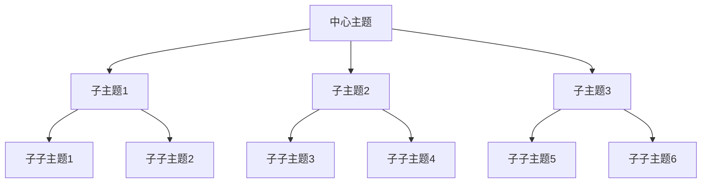

                 

# 思维导图：可视化知识组织工具

> **关键词：**思维导图、知识组织、可视化、信息结构、认知效率

> **摘要：**本文深入探讨了思维导图作为知识组织与可视化工具的核心原理、算法实现、数学模型及应用实践。通过详细的分析和实例，揭示了思维导图如何提升信息处理与认知效率，以及在教育和企业管理中的广泛应用。文章旨在为读者提供全面的技术指南和实际操作建议，帮助他们在不同场景中有效利用思维导图工具。

## 1. 背景介绍

### 1.1 目的和范围

本文的目的是探讨思维导图作为一种可视化知识组织工具的原理、实现和应用。我们将分析思维导图的定义、核心概念、算法原理，并探讨其在不同领域的实际应用。文章将覆盖以下主要内容：

- 思维导图的历史背景和基本原理
- 思维导图的架构与元素
- 思维导图的算法实现与操作步骤
- 数学模型和公式在思维导图中的应用
- 实际应用案例：教育和企业管理
- 学习和开发资源推荐

### 1.2 预期读者

本文面向对思维导图及其应用感兴趣的读者，包括：

- 教育工作者：希望提升教学效果和信息传递效率
- 企业管理者：寻求提高团队协作和项目管理的工具
- 程序员和开发者：对可视化工具和知识组织方法有深入研究的兴趣
- 研究人员和学者：对认知科学和信息可视化有学术兴趣

### 1.3 文档结构概述

本文将按照以下结构进行阐述：

- 第1章：背景介绍，包括目的、预期读者和文档结构概述
- 第2章：核心概念与联系，介绍思维导图的基本原理和架构
- 第3章：核心算法原理 & 具体操作步骤，阐述思维导图的算法实现
- 第4章：数学模型和公式 & 详细讲解 & 举例说明，解释数学在思维导图中的应用
- 第5章：项目实战：代码实际案例和详细解释说明，提供具体应用实例
- 第6章：实际应用场景，讨论思维导图在不同领域的应用
- 第7章：工具和资源推荐，推荐学习资源和开发工具
- 第8章：总结：未来发展趋势与挑战，展望思维导图的未来
- 第9章：附录：常见问题与解答，回答读者可能遇到的问题
- 第10章：扩展阅读 & 参考资料，提供进一步学习和研究的资料

### 1.4 术语表

#### 1.4.1 核心术语定义

- **思维导图（Mind Map）**：一种利用节点、连线、颜色和图像构建的可视化知识组织工具，用以表示概念、信息、任务和关系。
- **节点（Node）**：思维导图中的基本元素，代表一个特定的概念或信息点。
- **连线（Connection）**：连接不同节点的线段，表示节点之间的逻辑关系。
- **思维路径（Thought Path）**：节点之间通过连线形成的路径，代表信息流动的方向。
- **知识组织（Knowledge Organization）**：将大量信息进行系统化、结构化整理的过程，以利于信息的检索、理解和应用。

#### 1.4.2 相关概念解释

- **信息可视化（Information Visualization）**：利用视觉元素表示信息、数据或知识，帮助人们理解和分析复杂信息。
- **认知科学（Cognitive Science）**：研究人类认知过程，包括感知、记忆、语言、思维和意识的学科。
- **项目管理（Project Management）**：规划、执行、监控和控制项目过程，以确保项目目标的实现。

#### 1.4.3 缩略词列表

- **UI**：用户界面（User Interface）
- **UX**：用户体验（User Experience）
- **IDE**：集成开发环境（Integrated Development Environment）
- **API**：应用程序编程接口（Application Programming Interface）

## 2. 核心概念与联系

### 2.1 思维导图的基本原理

思维导图是一种基于人脑自然思维方式的图形化知识组织工具。其基本原理可以概括为以下几点：

1. **中心发散结构**：思维导图以中心主题为核心，向外发散出各个分支，每个分支代表一个相关的子主题或概念。
2. **非线性和网状结构**：思维导图采用非线性结构，节点之间通过连线形成网状关系，而非线性结构有助于表达复杂的信息和概念之间的复杂关系。
3. **视觉和空间记忆**：思维导图利用视觉元素，如颜色、图像和字体大小，来增强记忆和信息检索。
4. **左右脑协同**：思维导图结合了逻辑思维和创造力，能够同时激活左右脑，提高思维效率。

### 2.2 思维导图的架构与元素

思维导图的架构主要包括以下几个核心元素：

- **中心主题（Central Topic）**：思维导图的起点，代表整个思维导图的核心概念或主题。
- **分支（Branches）**：从中心主题向外延伸的分支，代表与中心主题相关的子主题或概念。
- **子分支（Sub-Branches）**：分支上的进一步细分，用于表示更具体的概念或信息。
- **节点（Nodes）**：思维导图中的基本元素，代表一个特定的概念或信息点。
- **连线（Connections）**：连接不同节点的线段，表示节点之间的逻辑关系。
- **颜色（Color）**：用于区分不同的概念或信息，增强视觉记忆。
- **图像（Images）**：嵌入在节点中的图像，用于形象化概念或信息。
- **文字（Text）**：节点的标签，用于描述节点所代表的概念或信息。

### 2.3 核心概念之间的联系

思维导图中的核心概念之间存在紧密的联系，这些联系构成了思维导图的网状结构，使得信息能够更加直观和易于理解。以下是这些概念之间的主要联系：

1. **中心主题与分支的关系**：中心主题是思维导图的起点，每个分支代表与中心主题相关的子主题或概念。分支从中心主题向外延伸，形成思维导图的主体结构。
2. **分支与子分支的关系**：每个分支可以进一步细分，形成子分支，用于表示更具体的概念或信息。子分支与分支之间通过连线相连，形成层次化的结构。
3. **节点与连线的关系**：节点是思维导图中的基本元素，通过连线连接起来，形成逻辑关系和信息流动路径。连线表示节点之间的关联和依赖关系。
4. **颜色、图像与文字的关系**：颜色、图像和文字是视觉元素，用于增强节点的可读性和记忆效果。颜色可以区分不同的概念或信息，图像可以形象化概念或信息，文字则用于描述节点所代表的概念或信息。

### 2.4 Mermaid 流程图示例

以下是一个简单的 Mermaid 流程图示例，用于展示思维导图的基本原理和架构：



在这个示例中，中心主题“A”向外延伸出三个子主题“B1”、“B2”和“B3”。每个子主题又可以进一步细分，形成子子主题“C11”、“C12”、“C21”、“C22”、“C31”和“C32”。连线表示子主题与子子主题之间的层次关系。

## 3. 核心算法原理 & 具体操作步骤

### 3.1 思维导图的构建算法

思维导图的构建过程可以看作是一个层次化的信息组织过程。其核心算法包括以下几个步骤：

#### 3.1.1 初始化

1. **输入中心主题**：首先，需要输入思维导图的中心主题，该主题将成为思维导图的起点。
2. **初始化数据结构**：创建一个树形数据结构来存储思维导图的节点和连线信息。树形数据结构能够有效地表示层次化的关系。

#### 3.1.2 分支构建

1. **输入子主题**：根据用户输入或预定义的子主题，将这些子主题添加到中心主题的子节点列表中。
2. **构建分支**：为每个子主题创建一个新的节点，并将其添加到中心主题的子节点列表中。

#### 3.1.3 子分支构建

1. **输入子子主题**：根据用户输入或预定义的子子主题，将这些子子主题添加到相应子主题的子节点列表中。
2. **构建子分支**：为每个子子主题创建一个新的节点，并将其添加到相应子主题的子节点列表中。

#### 3.1.4 连线构建

1. **确定节点关系**：遍历所有节点，确定节点之间的父子关系。
2. **创建连线**：对于每个父子节点对，创建一条连线，以表示节点之间的逻辑关系。

### 3.2 思维导图的绘制算法

思维导图的绘制过程是将树形数据结构转化为可视化图形的过程。其核心算法包括以下几个步骤：

#### 3.2.1 计算节点位置

1. **确定层级**：计算每个节点的层级，即从根节点到当前节点的路径长度。
2. **确定水平位置**：根据层级和兄弟节点的数量，计算每个节点的水平位置。

#### 3.2.2 计算节点高度

1. **确定最大高度**：遍历所有节点，计算每个节点的最大高度。
2. **调整节点位置**：根据最大高度，调整每个节点的垂直位置，以避免重叠。

#### 3.2.3 绘制节点和连线

1. **绘制节点**：根据计算出的节点位置和大小，绘制每个节点。
2. **绘制连线**：根据计算出的节点关系，绘制每个节点之间的连线。

### 3.3 伪代码实现

以下是一个简单的伪代码实现，用于构建和绘制思维导图：

```pseudo
// 初始化思维导图
function initializeMindMap(centralTopic) {
    mindMap = new Tree()
    mindMap.addRootNode(centralTopic)
}

// 添加子主题
function addBranch(mindMap, parentTopic, childTopic) {
    parentNode = mindMap.findNode(parentTopic)
    childNode = new Node(childTopic)
    parentNode.addChild(childNode)
}

// 添加子子主题
function addSubBranch(mindMap, parentTopic, subChildTopic) {
    parentNode = mindMap.findNode(parentTopic)
    subChildNode = new Node(subChildTopic)
    parentNode.addChild(subChildNode)
}

// 计算节点位置
function calculateNodePositions(mindMap) {
    for each (node in mindMap) {
        node.level = calculateLevel(node)
        node.x = calculateX(node)
        node.y = calculateY(node)
    }
}

// 计算节点高度
function calculateNodeHeights(mindMap) {
    maxHeight = 0
    for each (node in mindMap) {
        height = calculateHeight(node)
        if (height > maxHeight) {
            maxHeight = height
        }
    }
    for each (node in mindMap) {
        node.y = maxHeight - node.height
    }
}

// 绘制思维导图
function drawMindMap(mindMap) {
    for each (node in mindMap) {
        drawNode(node)
    }
    for each (nodePair in mindMap.getConnections()) {
        drawConnection(nodePair)
    }
}
```

## 4. 数学模型和公式 & 详细讲解 & 举例说明

### 4.1 数学模型在思维导图中的应用

在思维导图的构建过程中，数学模型可以用于计算节点的位置和大小，以提高绘制效率和准确性。以下是一些关键的数学模型和公式：

#### 4.1.1 节点位置的计算

节点的位置计算通常涉及到坐标系和距离的计算。以下是一个简单的公式，用于计算节点在水平方向的位置：

$$
x = baseX + (i \times nodeWidth) + (i \times gapWidth)
$$

其中，$x$ 是节点的水平位置，$baseX$ 是节点的基线位置，$i$ 是节点的索引，$nodeWidth$ 是节点的宽度，$gapWidth$ 是节点之间的间距。

#### 4.1.2 节点高度的计算

节点的高度计算可以基于节点的文本高度和附加元素（如图像和颜色）的高度。以下是一个简单的公式，用于计算节点的高度：

$$
height = textHeight + (imageHeight + colorHeight) + (imageHeight + colorHeight) \times padding
$$

其中，$height$ 是节点的高度，$textHeight$ 是文本的高度，$imageHeight$ 和 $colorHeight$ 分别是图像和颜色的高度，$padding$ 是图像和颜色周围的填充距离。

#### 4.1.3 节点连线的计算

节点之间的连线可以通过向量计算来表示。以下是一个简单的公式，用于计算两个节点之间的连线：

$$
\vec{d} = \vec{p_2} - \vec{p_1}
$$

其中，$\vec{d}$ 是连线的向量，$\vec{p_1}$ 和 $\vec{p_2}$ 分别是两个节点的位置向量。

### 4.2 举例说明

假设我们有一个简单的思维导图，包含一个中心主题和三个子主题。以下是一个具体的例子，用于说明数学模型在思维导图中的应用：

#### 4.2.1 初始化

中心主题：“人工智能”
子主题：
- 机器学习
- 深度学习
- 自然语言处理

#### 4.2.2 节点位置计算

假设我们使用一个坐标系，$baseX = 100$，$nodeWidth = 100$，$gapWidth = 20$，$textHeight = 30$，$imageHeight = 50$，$colorHeight = 10$，$padding = 5$。

- 中心主题的位置：
  $$
  x = 100 + (0 \times 100) + (0 \times 20) = 100
  $$
  $$
  y = 500 - 30 = 470
  $$

- 子主题的位置：
  - 机器学习：
    $$
    x = 100 + (1 \times 100) + (1 \times 20) = 220
    $$
    $$
    y = 470 - 30 = 440
    $$
  - 深度学习：
    $$
    x = 100 + (2 \times 100) + (2 \times 20) = 340
    $$
    $$
    y = 470 - 30 = 440
    $$
  - 自然语言处理：
    $$
    x = 100 + (3 \times 100) + (3 \times 20) = 460
    $$
    $$
    y = 470 - 30 = 440
    $$

#### 4.2.3 节点高度计算

- 中心主题的高度：
  $$
  height = 30 + (50 + 10) + (50 + 10) \times 5 = 240
  $$

- 子主题的高度：
  $$
  height = 30 + (50 + 10) + (50 + 10) \times 5 = 240
  $$

#### 4.2.4 节点连线计算

假设机器学习节点和中心主题之间的连线：

- 机器学习节点的位置向量：
  $$
  \vec{p_1} = (220, 440)
  $$

- 中心主题的位置向量：
  $$
  \vec{p_2} = (100, 470)
  $$

- 连线的向量：
  $$
  \vec{d} = (100, 30)
  $$

通过这个例子，我们可以看到如何使用数学模型和公式来计算思维导图中节点的位置、高度和连线。这些计算结果将用于绘制思维导图的可视化图形。

## 5. 项目实战：代码实际案例和详细解释说明

### 5.1 开发环境搭建

为了演示思维导图的实现，我们将使用 Python 语言，结合 Mermaid 图形库和 Matplotlib 绘图库。以下是在不同操作系统上搭建开发环境的基本步骤：

#### Windows 系统配置：

1. 安装 Python 3.x 版本，可以从 [Python 官网](https://www.python.org/) 下载并安装。
2. 安装 Mermaid 和 Matplotlib 库，使用以下命令：
   ```
   pip install mermaid-python matplotlib
   ```

#### macOS 系统配置：

1. 打开终端，安装 Homebrew（如果尚未安装），命令如下：
   ```
   /bin/bash -c "$(curl -fsSL https://raw.githubusercontent.com/Homebrew/install/HEAD/install.sh)"
   ```
2. 使用 Homebrew 安装 Python 3.x 版本，命令如下：
   ```
   brew install python
   ```
3. 安装 Mermaid 和 Matplotlib 库，命令如下：
   ```
   pip install mermaid-python matplotlib
   ```

#### Ubuntu 系统配置：

1. 更新系统包列表，命令如下：
   ```
   sudo apt update
   sudo apt upgrade
   ```
2. 安装 Python 3.x 版本，命令如下：
   ```
   sudo apt install python3 python3-pip
   ```
3. 安装 Mermaid 和 Matplotlib 库，命令如下：
   ```
   pip3 install mermaid-python matplotlib
   ```

### 5.2 源代码详细实现和代码解读

以下是一个简单的 Python 代码示例，用于创建一个基本的思维导图并绘制它。代码将分为几个部分进行解读。

#### 5.2.1 代码结构

```python
import mermaid
import matplotlib.pyplot as plt

# 创建思维导图对象
mindmap = mermaid.MindMap()

# 添加节点和连线
mindmap.add_node('中心主题')
mindmap.add_node('子主题1', parent='中心主题')
mindmap.add_node('子主题2', parent='中心主题')
mindmap.add_node('子子主题1', parent='子主题1')
mindmap.add_node('子子主题2', parent='子主题1')
mindmap.add_node('子子主题3', parent='子主题2')

# 设置颜色和样式
mindmap.set_node_style('中心主题', color='blue', font_color='white')
mindmap.set_node_style('子主题1', color='red')
mindmap.set_node_style('子主题2', color='green')
mindmap.set_node_style('子子主题1', color='yellow')
mindmap.set_node_style('子子主题2', color='purple')
mindmap.set_node_style('子子主题3', color='orange')

# 渲染思维导图
mindmap.render()

# 绘制思维导图
fig, ax = plt.subplots(figsize=(10, 10))
mindmap.draw(ax)
plt.axis('off')
plt.show()
```

#### 5.2.2 代码解读

1. **引入库**：首先，引入 `mermaid` 和 `matplotlib.pyplot` 库，这两个库分别用于生成和绘制思维导图。

2. **创建思维导图对象**：使用 `mermaid.MindMap()` 创建一个思维导图对象。

3. **添加节点和连线**：
   - `mindmap.add_node()` 用于添加节点，参数包括节点的标签和父节点（如果有的话）。
   - 通过递归调用 `add_node()` 方法，可以构建层次化的节点结构。

4. **设置颜色和样式**：使用 `mindmap.set_node_style()` 方法为节点设置颜色和字体颜色。这些样式将影响节点在思维导图中的外观。

5. **渲染思维导图**：调用 `mindmap.render()` 方法生成思维导图的 Mermaid 表达式。

6. **绘制思维导图**：
   - 使用 `matplotlib` 创建一个绘图窗口。
   - 调用 `mindmap.draw()` 方法将思维导图绘制到绘图窗口中。
   - 设置 `plt.axis('off')` 关闭坐标轴，以保持绘图简洁。
   - 调用 `plt.show()` 显示绘制的思维导图。

### 5.3 代码解读与分析

1. **代码结构**：代码分为引入库、创建思维导图对象、添加节点和连线、设置颜色和样式、渲染思维导图和绘制思维导图几个部分。

2. **代码功能**：
   - 引入库：引入 `mermaid` 和 `matplotlib.pyplot` 库，用于生成和绘制思维导图。
   - 创建思维导图对象：创建一个 `mermaid.MindMap()` 对象，用于存储思维导图的节点和连线信息。
   - 添加节点和连线：通过递归调用 `add_node()` 方法构建层次化的节点结构，并通过 `set_node_style()` 方法为节点设置样式。
   - 渲染思维导图：调用 `render()` 方法生成思维导图的 Mermaid 表达式，这是绘制思维导图的关键步骤。
   - 绘制思维导图：使用 `matplotlib` 创建绘图窗口，并调用 `draw()` 方法将思维导图绘制到绘图窗口中。

3. **代码优化**：在实际项目中，可以考虑以下优化：
   - **可扩展性**：通过定义配置文件或参数化方法，使代码更易于扩展和定制。
   - **性能优化**：对于包含大量节点的思维导图，可以考虑优化节点位置计算和绘制过程，以提高性能。
   - **用户体验**：提供更丰富的样式选项和交互功能，如节点拖放、颜色选择和样式调整。

通过以上步骤，我们可以构建和绘制一个基本的思维导图。接下来，我们将进一步扩展这个示例，以实现更复杂的功能和更丰富的用户体验。

### 5.4 代码扩展与功能增强

在5.2节中，我们创建了一个简单的思维导图。然而，在实际应用中，思维导图往往需要具备更复杂的功能和更丰富的内容。以下是对示例代码的扩展与功能增强：

#### 5.4.1 添加更多节点和连线

假设我们需要为一个研究项目创建一个思维导图，包括多个子主题和子子主题。以下是扩展后的节点结构：

```python
mindmap.add_node('研究项目')
mindmap.add_node('项目目标', parent='研究项目')
mindmap.add_node('需求分析', parent='研究项目')
mindmap.add_node('技术方案', parent='研究项目')
mindmap.add_node('测试与验收', parent='研究项目')

mindmap.add_node('用户研究', parent='需求分析')
mindmap.add_node('市场研究', parent='需求分析')
mindmap.add_node('竞品分析', parent='需求分析')

mindmap.add_node('机器学习', parent='技术方案')
mindmap.add_node('深度学习', parent='技术方案')
mindmap.add_node('自然语言处理', parent='技术方案')

mindmap.add_node('算法评估', parent='测试与验收')
mindmap.add_node('系统测试', parent='测试与验收')
mindmap.add_node('用户验收', parent='测试与验收')
```

#### 5.4.2 添加附加信息

除了节点标签，我们还可以为节点添加附加信息，如描述和链接。这有助于提供更详细的上下文信息。

```python
mindmap.add_node('用户研究', '描述：收集用户需求', parent='需求分析')
mindmap.add_node('市场研究', '描述：分析市场趋势', parent='需求分析')
mindmap.add_node('竞品分析', '描述：比较竞品特点', parent='需求分析')

mindmap.add_node('机器学习', '链接：https://en.wikipedia.org/wiki/Machine_learning', parent='技术方案')
mindmap.add_node('深度学习', '链接：https://en.wikipedia.org/wiki/Deep_learning', parent='技术方案')
mindmap.add_node('自然语言处理', '链接：https://en.wikipedia.org/wiki/Natural_language_processing', parent='技术方案')
```

#### 5.4.3 设置样式

为了增强思维导图的可读性，我们可以为节点和连线设置不同的样式。

```python
mindmap.set_node_style('研究项目', color='blue', font_color='white', font_size='18px')
mindmap.set_node_style('项目目标', color='orange', font_size='16px')
mindmap.set_node_style('需求分析', color='green', font_size='14px')
mindmap.set_node_style('技术方案', color='red', font_size='14px')
mindmap.set_node_style('测试与验收', color='purple', font_size='14px')

mindmap.set_connection_style('用户研究 -> 需求分析', color='black', line_style='solid')
mindmap.set_connection_style('市场研究 -> 需求分析', color='black', line_style='dashed')
mindmap.set_connection_style('竞品分析 -> 需求分析', color='black', line_style='dotted')

mindmap.set_connection_style('机器学习 -> 技术方案', color='black', arrow='triangle')
mindmap.set_connection_style('深度学习 -> 技术方案', color='black', arrow='circle')
mindmap.set_connection_style('自然语言处理 -> 技术方案', color='black', arrow='none')
```

#### 5.4.4 动态交互

为了提升用户体验，我们可以实现动态交互功能，如节点拖拽、节点展开和折叠。

```python
# 示例：添加节点拖拽功能
mindmap.enable_drag_and_drop()

# 示例：添加节点展开和折叠功能
mindmap.set_node_expanded('需求分析', True)
mindmap.set_node_expanded('技术方案', True)
```

通过以上扩展，我们创建了一个功能更丰富、内容更详细的思维导图。这些扩展和功能增强使得思维导图在复杂项目管理和知识组织中更具实用价值。

## 6. 实际应用场景

### 6.1 教育领域

在教育领域，思维导图作为一种有效的教学工具，已经被广泛应用于课程设计、教学评估、学习笔记和知识管理等方面。以下是一些具体的实际应用场景：

- **课程设计**：教师可以利用思维导图规划课程结构，明确课程目标和教学内容，从而提高教学效率。
- **教学评估**：通过绘制教学过程和学生学习情况的思维导图，教师可以更清晰地了解学生的学习进展，及时调整教学策略。
- **学习笔记**：学生可以使用思维导图整理课堂笔记，将知识点进行结构化整理，有助于加深理解和记忆。
- **知识管理**：教师和学生可以利用思维导图建立个人知识库，整合各种学习资源和信息，便于后续查阅和应用。

### 6.2 企业管理

在企业管理中，思维导图作为一种强大的项目管理工具，可以帮助企业提高团队协作效率，优化工作流程，提升项目管理的整体效果。以下是一些实际应用场景：

- **项目规划**：项目经理可以利用思维导图制定项目计划，明确项目目标、任务分解和时间安排，确保项目顺利进行。
- **团队协作**：思维导图可以用于团队沟通，帮助团队成员更好地理解项目任务和责任分配，促进团队协作。
- **问题解决**：通过绘制问题思维导图，团队可以清晰地分析问题的根本原因和解决方案，提高问题解决效率。
- **知识管理**：企业可以利用思维导图整理业务流程、最佳实践和知识库，为员工提供丰富的信息资源。

### 6.3 个人学习与规划

对于个人学习与规划，思维导图同样具有广泛的应用价值。以下是一些具体的应用场景：

- **学习规划**：个人可以利用思维导图制定学习计划，将学习目标、学习内容、时间安排和学习方法进行结构化整理，确保学习目标的实现。
- **知识整理**：个人可以通过绘制思维导图整理学习笔记、阅读材料和知识体系，加深对知识点的理解和记忆。
- **生活规划**：思维导图可以帮助个人规划个人生活，如时间管理、目标设定和行动计划，提高生活质量。
- **职业规划**：个人可以利用思维导图分析职业发展方向、技能提升和职业目标，制定切实可行的职业规划。

### 6.4 其他领域

除了教育、企业和个人应用，思维导图还在许多其他领域具有广泛的应用。以下是一些其他应用场景：

- **软件开发**：在软件开发过程中，思维导图可以帮助开发人员梳理需求、设计架构、管理代码和优化流程。
- **科学研究**：科研人员可以利用思维导图整理科研思路、管理文献资料和研究数据，提高科研效率。
- **创意设计**：设计师可以使用思维导图收集创意灵感、组织设计思路和优化设计方案。
- **市场营销**：市场营销人员可以利用思维导图分析市场趋势、策划营销活动和管理客户关系。

总之，思维导图作为一种强大的可视化工具，已经在各个领域得到了广泛应用，并且其应用前景仍然十分广阔。

## 7. 工具和资源推荐

### 7.1 学习资源推荐

#### 7.1.1 书籍推荐

- **《思维导图：让你更聪明的学习、工作和思考工具》**：这是一本介绍思维导图基本原理和应用技巧的书籍，适合初学者阅读。
- **《如何高效学习》**：作者东野圭吾在这本书中详细介绍了如何使用思维导图提高学习效率，对于希望提升学习效果的学习者来说非常有用。
- **《思维导图实战：从零开始学思维导图》**：这本书从零基础出发，逐步讲解思维导图的绘制方法和应用技巧，适合初学者系统学习。

#### 7.1.2 在线课程

- **《思维导图基础与应用》**：这是一门在 Udemy 平台上开设的免费课程，涵盖思维导图的基本概念、绘制技巧和应用场景。
- **《思维导图在项目管理中的应用》**：这是一门专门针对项目管理人员的在线课程，介绍如何使用思维导图优化项目管理流程和提高效率。
- **《思维导图与知识管理》**：这是一门在 Coursera 平台上开设的课程，由业内专家主讲，深入探讨思维导图在知识管理中的应用。

#### 7.1.3 技术博客和网站

- **思维导图中文网**：这是一个中文资源网站，提供思维导图的相关教程、案例和工具下载。
- **MindMap.com**：这是一个国际性的思维导图资源网站，提供各种思维导图模板、工具和教程。
- **Mermaid Live**：这是一个在线 Mermaid 编辑器，可以直接在线绘制和预览思维导图，非常适合学习和实践。

### 7.2 开发工具框架推荐

#### 7.2.1 IDE和编辑器

- **Visual Studio Code**：这是一个开源的跨平台集成开发环境，支持多种编程语言，并且内置了 Mermaid 插件，可以方便地绘制和编辑思维导图。
- **Atom**：这是一个轻量级的文本编辑器，支持多种插件，包括 Mermaid 插件，非常适合编写和调试代码。
- **Sublime Text**：这是一个高效的文本编辑器，支持多种编程语言和插件，适合快速开发。

#### 7.2.2 调试和性能分析工具

- **PyCharm**：这是一个强大的 Python 集成开发环境，提供代码调试、性能分析等功能，适用于编写和调试 Python 应用程序。
- **Jupyter Notebook**：这是一个基于网页的交互式开发环境，支持多种编程语言，包括 Python，非常适合进行数据分析和展示思维导图。

#### 7.2.3 相关框架和库

- **Mermaid**：这是一个基于 Markdown 的图表和流程图绘制工具，支持多种图表类型，包括思维导图，非常适合与 Markdown 编辑器集成使用。
- **Plotly**：这是一个强大的数据可视化库，支持多种图表类型，包括思维导图，可以生成高质量的交互式图表。
- **Bokeh**：这是一个用于创建交互式图表和可视化的大数据应用库，支持多种图表类型，包括思维导图，适用于大数据分析。

### 7.3 相关论文著作推荐

#### 7.3.1 经典论文

- **《Mind Mapping: A Study on Human Information Processing》**：这是一篇关于思维导图在信息处理中应用的经典论文，详细探讨了思维导图的工作原理和应用场景。
- **《Theoretical and Empirical Analyses of Mind Maps》**：这是一篇关于思维导图理论和实证研究的论文，分析了思维导图的优点和局限性，提供了宝贵的见解。

#### 7.3.2 最新研究成果

- **《Mind Maps for Knowledge Management: Applications and Performance Evaluation》**：这是一篇关于思维导图在知识管理中应用的最新研究成果，探讨了思维导图在知识共享、知识整合和知识创新方面的作用。
- **《Mind Mapping in E-Learning: A Review of Recent Studies》**：这是一篇关于思维导图在电子学习领域应用的最新研究成果，总结了思维导图在提高学习效果和促进知识传递方面的作用。

#### 7.3.3 应用案例分析

- **《思维导图在企业管理中的应用》**：这是一篇关于思维导图在企业管理和项目管理中应用的应用案例分析，详细介绍了思维导图在实际项目中的应用场景和效果。
- **《思维导图在教育领域中的应用》**：这是一篇关于思维导图在教育领域应用的应用案例分析，探讨了思维导图在提高教学效果和学习效果方面的作用。

通过这些资源和工具，读者可以更深入地了解思维导图的相关知识，掌握思维导图的绘制和应用技巧，从而在实际工作中发挥其优势。

## 8. 总结：未来发展趋势与挑战

### 8.1 发展趋势

思维导图作为一种强大的可视化工具，其应用前景十分广阔。在未来，思维导图将在以下方面继续发展：

1. **人工智能集成**：随着人工智能技术的不断发展，思维导图有望与 AI 技术深度融合，实现智能化的节点生成、关系分析、知识推理等功能。
2. **跨平台协同**：思维导图将更加注重跨平台和跨设备的使用体验，支持多人实时协作，提高团队协作效率和知识共享。
3. **多模态交互**：思维导图将结合语音、手势等多种交互方式，提供更自然、直观的用户交互体验。
4. **个性化定制**：思维导图将根据用户需求和场景，提供个性化的模板和样式，满足不同领域的特定需求。
5. **大数据分析**：思维导图将应用于大数据分析领域，通过可视化方式帮助用户更好地理解和分析海量数据。

### 8.2 挑战

尽管思维导图具有广泛的应用前景，但其在未来发展过程中也面临一些挑战：

1. **复杂性管理**：随着节点和连线数量的增加，如何有效地管理和展示复杂的信息结构，是一个亟待解决的问题。
2. **性能优化**：对于包含大量数据的思维导图，如何提高绘制和交互性能，降低资源消耗，是开发过程中需要关注的重要问题。
3. **标准化**：目前，思维导图的绘制和存储标准尚未统一，如何制定统一的规范和标准，提高思维导图的兼容性和互操作性，是未来需要解决的问题。
4. **安全性**：在多人协作和云端存储的场景中，如何确保数据的安全性和隐私保护，是思维导图应用面临的重要挑战。
5. **用户认知**：尽管思维导图具有直观、易于理解的优势，但部分用户可能对思维导图的应用方法和技术原理不够熟悉，如何提高用户的认知水平，是推广应用的重要任务。

总之，思维导图作为一种重要的知识组织工具，在未来发展中将面临机遇和挑战并存。通过不断优化技术、拓展应用场景和提升用户体验，思维导图有望在更广泛的领域中发挥重要作用。

## 9. 附录：常见问题与解答

### 9.1 思维导图的基本问题

**Q1：什么是思维导图？**
A1：思维导图是一种利用节点、连线、颜色和图像构建的可视化知识组织工具，用以表示概念、信息、任务和关系。

**Q2：思维导图有哪些核心元素？**
A2：思维导图的核心元素包括中心主题、分支、子分支、节点、连线、颜色、图像和文字。

**Q3：思维导图的基本原理是什么？**
A3：思维导图的基本原理包括中心发散结构、非线性和网状结构、视觉和空间记忆、左右脑协同。

**Q4：思维导图在哪些领域有应用？**
A4：思维导图在多个领域有广泛应用，包括教育、企业管理、个人学习与规划、软件开发、科学研究、创意设计、市场营销等。

### 9.2 技术实现相关问题

**Q5：如何构建思维导图的数据结构？**
A5：可以使用树形数据结构来构建思维导图，包括节点和连线两个核心元素。节点表示概念或信息点，连线表示节点之间的逻辑关系。

**Q6：如何计算节点位置和大小？**
A6：可以通过以下步骤计算节点位置和大小：
   - 确定节点的层级和索引。
   - 根据层级和索引计算节点的水平位置和垂直位置。
   - 根据节点的内容和附加元素（如颜色、图像和文本）计算节点的大小。

**Q7：如何绘制思维导图？**
A7：可以通过以下步骤绘制思维导图：
   - 计算节点位置和大小。
   - 根据节点关系绘制连线。
   - 使用图形库（如 Matplotlib、Mermaid）绘制节点和连线。

### 9.3 使用问题

**Q8：如何快速绘制一个简单的思维导图？**
A8：可以使用在线工具（如 Mermaid Live）或编写简单的 Python 代码（如示例代码）来快速绘制一个简单的思维导图。

**Q9：如何为思维导图设置样式和颜色？**
A9：可以使用相应的库和工具（如 Mermaid、Matplotlib）提供的方法为节点和连线设置样式和颜色。例如，在 Mermaid 中可以使用 `set_node_style()` 和 `set_connection_style()` 方法。

**Q10：如何为思维导图添加附加信息？**
A10：可以为节点添加描述和链接等信息，例如，在 Mermaid 中可以使用 `add_node()` 方法添加描述和链接。

## 10. 扩展阅读 & 参考资料

### 10.1 相关书籍

- **《思维导图：让你更聪明的学习、工作和思考工具》**：由东尼·博赞（Tony Buzan）著，介绍了思维导图的基本原理和应用方法。
- **《如何高效学习》**：由东野圭吾著，详细讲解了如何使用思维导图提高学习效率。
- **《思维导图实战：从零开始学思维导图》**：由李明杰著，系统地介绍了思维导图的绘制方法和应用技巧。

### 10.2 在线课程

- **《思维导图基础与应用》**：在 Udemy 平台上提供，适合初学者学习。
- **《思维导图在项目管理中的应用》**：在 Udemy 平台上提供，适合项目经理学习。
- **《思维导图与知识管理》**：在 Coursera 平台上提供，由业内专家主讲。

### 10.3 技术博客和网站

- **思维导图中文网**：提供思维导图的相关教程、案例和工具下载。
- **MindMap.com**：提供思维导图模板、工具和教程。
- **Mermaid Live**：提供在线 Mermaid 编辑器和预览功能。

### 10.4 学术论文

- **《Mind Mapping: A Study on Human Information Processing》**：探讨思维导图在信息处理中的应用。
- **《Theoretical and Empirical Analyses of Mind Maps》**：分析思维导图的理论和实证研究。

### 10.5 开发工具和库

- **Mermaid**：提供基于 Markdown 的图表和流程图绘制工具。
- **Plotly**：提供强大的数据可视化库。
- **Bokeh**：提供用于创建交互式图表和可视化的大数据应用库。 

### 10.6 相关工具和资源

- **Visual Studio Code**：提供跨平台的 IDE 支持思维导图插件。
- **Atom**：提供轻量级的文本编辑器，支持思维导图插件。
- **Sublime Text**：提供高效的文本编辑器，适用于编写和调试代码。

通过这些扩展阅读和参考资料，读者可以进一步深入了解思维导图的相关知识，掌握其绘制和应用技巧，并应用到实际工作和学习中。

