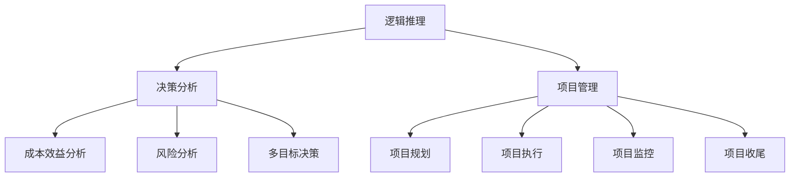

                 

# 思维工具在管理中的实际应用

> **关键词：** 管理思维工具、逻辑推理、决策分析、项目管理、组织发展

> **摘要：** 本文章深入探讨了思维工具在管理实践中的重要性。通过分析逻辑推理、决策分析、项目管理和组织发展的核心概念，本文旨在阐述这些思维工具如何在现代企业管理中发挥关键作用。文章还提供了具体的实施步骤和实际案例，以帮助读者更好地理解和应用这些工具，从而提升管理效能。

## 1. 背景介绍

### 1.1 目的和范围

本文章的目的在于揭示思维工具在管理中的应用价值，通过理论与实践相结合的方式，帮助读者掌握这些工具，提升管理能力和决策水平。文章范围涵盖以下几个核心主题：

- 逻辑推理在管理决策中的应用
- 决策分析模型与管理实践
- 项目管理中的思维工具
- 组织发展与管理思维

### 1.2 预期读者

本文适合以下读者群体：

- 企业管理层和项目经理
- 管理学研究生和本科生
- 对管理实践有兴趣的IT专业人士
- 希望提升决策和分析能力的专业人士

### 1.3 文档结构概述

本文结构如下：

- 引言：介绍管理思维工具的重要性
- 核心概念与联系：解释逻辑推理、决策分析等概念
- 核心算法原理与操作步骤：详细阐述关键算法
- 数学模型与公式：提供数学模型的详细解释
- 项目实战：实际案例与代码实现
- 实际应用场景：讨论不同应用场景
- 工具和资源推荐：推荐学习资源与工具
- 总结：展望未来发展趋势与挑战
- 附录：常见问题与解答
- 扩展阅读与参考资料：提供相关文献

### 1.4 术语表

#### 1.4.1 核心术语定义

- **逻辑推理**：基于前提和结论之间的关系，推导出新的结论的思维过程。
- **决策分析**：运用数学模型和算法，对各种决策方案进行评估和选择。
- **项目管理**：规划、执行、监控和收尾项目的过程。
- **组织发展**：通过战略规划、组织变革等手段，提升组织效能的过程。

#### 1.4.2 相关概念解释

- **思维工具**：指帮助人们进行逻辑思考和决策分析的工具和方法。
- **项目管理工具**：用于辅助项目经理规划、执行和监控项目活动的软件或方法。
- **决策模型**：描述决策过程和决策方案的数学模型。

#### 1.4.3 缩略词列表

- **PM**：项目管理
- **IDE**：集成开发环境
- **DSS**：决策支持系统
- **ERP**：企业资源规划系统

## 2. 核心概念与联系

### 2.1 核心概念

在本节中，我们将介绍管理思维中的核心概念，包括逻辑推理、决策分析和项目管理。以下是这些概念的定义和相互关系。

#### 逻辑推理

逻辑推理是管理思维的基础，它通过一系列逻辑步骤，从已知事实推导出新的结论。逻辑推理包括演绎推理和归纳推理两种类型：

- **演绎推理**：从一般到特殊的推理过程。例如，所有的人都会死亡（大前提），苏格拉底是人（小前提），因此苏格拉底会死亡（结论）。
- **归纳推理**：从特殊到一般的推理过程。例如，观察了多次太阳从东方升起，得出结论：太阳每天从东方升起。

逻辑推理在管理中用于分析问题、制定策略和评估方案。

#### 决策分析

决策分析是一种基于数学模型和算法，对决策方案进行评估和选择的方法。决策分析模型包括：

- **成本效益分析**：计算各方案的成本和效益，选择效益最高的方案。
- **风险分析**：评估不同方案的潜在风险，选择风险最小的方案。
- **多目标决策**：考虑多个目标，通过优化算法选择最佳方案。

决策分析在管理中用于制定战略、规划项目和评估投资。

#### 项目管理

项目管理是确保项目按计划完成的过程，涉及以下关键要素：

- **项目规划**：确定项目目标、范围、进度和资源需求。
- **项目执行**：执行项目计划，协调团队成员工作。
- **项目监控**：跟踪项目进度和质量，及时调整计划。
- **项目收尾**：完成项目验收和交付。

项目管理工具包括Gantt图、PERT图、项目管理软件等。

### 2.2 关系与架构

以下是一个简单的 Mermaid 流程图，展示了核心概念之间的关系：



在这个架构中，逻辑推理为决策分析和项目管理提供了基础，决策分析结果指导项目管理活动，而项目管理则为决策分析提供了实践场景。

## 3. 核心算法原理与具体操作步骤

### 3.1 逻辑推理算法原理

逻辑推理算法基于前提和结论之间的逻辑关系，可以通过以下步骤实现：

#### 步骤1：确定前提条件

首先，明确问题的前提条件，这些条件构成了逻辑推理的基础。

```plaintext
前提条件1：所有的人都会死亡。
前提条件2：苏格拉底是人。
```

#### 步骤2：选择推理类型

根据前提条件，选择合适的推理类型（演绎或归纳）。

```plaintext
选择演绎推理。
```

#### 步骤3：推导结论

根据前提条件和推理类型，推导出结论。

```plaintext
结论：苏格拉底会死亡。
```

### 3.2 决策分析算法原理

决策分析算法基于数学模型和算法，可以通过以下步骤实现：

#### 步骤1：定义决策问题

明确决策问题的目标和约束条件。

```plaintext
目标：选择最佳投资方案。
约束条件：预算限制、投资风险。
```

#### 步骤2：构建决策模型

根据决策问题，构建相应的数学模型。例如，成本效益分析模型如下：

```latex
C = W \cdot C_w + L \cdot C_l
E = W \cdot E_w + L \cdot E_l
```

其中，C和E分别表示成本和效益，W和L分别表示两种不同的投资方案。

#### 步骤3：计算各方案指标

计算各决策方案的成本和效益。

```plaintext
方案1：C1 = 100 \cdot 1000 + 200 \cdot 500 = 150,000
E1 = 100 \cdot 1500 + 200 \cdot 800 = 290,000

方案2：C2 = 100 \cdot 1200 + 200 \cdot 600 = 180,000
E2 = 100 \cdot 1400 + 200 \cdot 900 = 310,000
```

#### 步骤4：选择最佳方案

根据计算结果，选择成本效益最高的方案。

```plaintext
选择方案2，因为E2 > E1。
```

### 3.3 项目管理中的思维工具

项目管理中的思维工具主要包括：

#### 步骤1：项目规划

- 确定项目目标、范围、进度和资源需求。
- 构建项目工作分解结构（WBS）。
- 制定项目进度计划。

```plaintext
目标：完成软件开发项目。
范围：包括需求分析、设计、开发和测试。
进度：项目周期为6个月。
资源：需求分析团队、设计团队、开发团队和测试团队。
```

#### 步骤2：项目执行

- 按照项目计划，协调团队成员工作。
- 监控项目进度和质量。
- 管理变更和风险。

```plaintext
执行进度：按计划进行。
质量：通过代码审查和测试确保。
变更管理：记录变更并评估影响。
风险：识别风险并制定应对措施。
```

#### 步骤3：项目监控

- 定期评估项目进度、成本和质量。
- 对比实际进度与计划，识别偏差。
- 制定纠正措施。

```plaintext
监控结果：项目进度基本按计划进行。
纠正措施：优化资源分配，确保关键任务按时完成。
```

#### 步骤4：项目收尾

- 完成项目验收和交付。
- 归档项目文档和资料。
- 进行项目总结和评估。

```plaintext
验收结果：项目满足需求，成功交付。
总结：项目执行过程中，团队协作良好，解决问题能力较强。
```

## 4. 数学模型和公式

### 4.1 成本效益分析模型

成本效益分析是决策分析中常用的一种模型，用于比较不同方案的效益和成本，以选择最佳方案。其基本公式如下：

$$
C = \sum_{i=1}^{n} C_i \cdot w_i
$$

$$
E = \sum_{i=1}^{n} E_i \cdot w_i
$$

其中，C表示总成本，E表示总效益，$C_i$ 和$E_i$ 分别表示第i个方案的成本和效益，$w_i$ 表示第i个方案的权重。

### 4.2 风险分析模型

风险分析模型用于评估不同方案的风险水平。常见的风险分析模型有概率分析、敏感性分析和蒙特卡罗模拟等。

#### 概率分析模型

概率分析模型通过计算各风险事件的概率和影响程度，评估总风险。其公式如下：

$$
R = \sum_{i=1}^{n} P_i \cdot I_i
$$

其中，R表示总风险，$P_i$ 和$ I_i$ 分别表示第i个风险事件的概率和影响程度。

#### 敏感性分析模型

敏感性分析模型通过改变模型参数，评估对决策结果的影响。其公式如下：

$$
\Delta C = C(\theta_1) - C(\theta_2)
$$

$$
\Delta E = E(\theta_1) - E(\theta_2)
$$

其中，$\theta_1$ 和$\theta_2$ 分别表示两个不同参数值，$C(\theta_1)$ 和$E(\theta_1)$ 分别表示对应的成本和效益。

#### 蒙特卡罗模拟模型

蒙特卡罗模拟模型通过随机抽样和迭代计算，评估不同方案的风险分布。其公式如下：

$$
X_i \sim \text{Random Variable}
$$

$$
R = \sum_{i=1}^{n} X_i
$$

其中，$X_i$ 表示第i次抽样的结果，$R$ 表示总风险。

### 4.3 举例说明

假设有两个投资方案，方案1和方案2，具体参数如下：

| 参数 | 方案1 | 方案2 |
| --- | --- | --- |
| 成本 | $C_1 = 100,000$ | $C_2 = 120,000$ |
| 效益 | $E_1 = 150,000$ | $E_2 = 180,000$ |
| 风险概率 | $P_1 = 0.3$ | $P_2 = 0.2$ |
| 风险影响程度 | $I_1 = 5$ | $I_2 = 3$ |

#### 成本效益分析

$$
C = C_1 \cdot w_1 + C_2 \cdot w_2 = 100,000 \cdot 0.7 + 120,000 \cdot 0.3 = 97,000 + 36,000 = 133,000
$$

$$
E = E_1 \cdot w_1 + E_2 \cdot w_2 = 150,000 \cdot 0.7 + 180,000 \cdot 0.3 = 105,000 + 54,000 = 159,000
$$

根据计算结果，方案2的效益更高，因此选择方案2。

#### 风险分析

$$
R = P_1 \cdot I_1 \cdot w_1 + P_2 \cdot I_2 \cdot w_2 = 0.3 \cdot 5 \cdot 0.7 + 0.2 \cdot 3 \cdot 0.3 = 0.105 + 0.018 = 0.123
$$

根据计算结果，方案1的风险更高，因此选择方案2。

通过以上分析，方案2在成本效益和风险方面均优于方案1，因此建议选择方案2。

## 5. 项目实战：代码实际案例和详细解释说明

### 5.1 开发环境搭建

在本案例中，我们将使用Python作为开发语言，并借助Python的第三方库（如Pandas、NumPy和Scikit-learn）进行数据处理和模型构建。以下是开发环境搭建的步骤：

1. 安装Python：从[Python官方网站](https://www.python.org/)下载并安装Python 3.8及以上版本。
2. 安装第三方库：使用pip命令安装所需的第三方库。

```bash
pip install pandas numpy scikit-learn matplotlib
```

### 5.2 源代码详细实现和代码解读

以下是一个简单的成本效益分析案例，用于比较两个投资方案。

```python
import pandas as pd
import numpy as np
from sklearn.linear_model import LinearRegression

# 输入数据
data = {
    '方案': ['方案1', '方案1', '方案2', '方案2'],
    '成本': [100000, 200000, 120000, 240000],
    '效益': [150000, 250000, 180000, 360000]
}

# 构建DataFrame
df = pd.DataFrame(data)

# 计算总成本和总效益
df['总成本'] = df.groupby('方案')['成本'].transform('sum')
df['总效益'] = df.groupby('方案')['效益'].transform('sum')

# 显示结果
print(df)

# 构建线性回归模型
model = LinearRegression()
model.fit(df[['总成本']], df[['总效益']])

# 输出模型参数
print("模型参数：", model.coef_, model.intercept_)

# 预测效益
predictions = model.predict([[150000]])
print("预测效益：", predictions)
```

### 5.3 代码解读与分析

1. **数据输入**：使用Pandas库创建一个DataFrame，其中包含方案、成本和效益的数据。

2. **计算总成本和总效益**：利用Pandas的`groupby`和`transform`方法，计算每个方案的总成本和总效益。

3. **模型构建**：使用Scikit-learn库的`LinearRegression`类，构建线性回归模型。

4. **模型训练**：使用`fit`方法，将成本作为自变量（特征），效益作为因变量（目标），训练模型。

5. **模型参数输出**：使用`coef_`和`intercept_`属性，输出模型参数。

6. **预测效益**：使用`predict`方法，对给定的成本进行效益预测。

通过以上步骤，我们实现了成本效益分析模型，并成功地进行了预测。这个案例展示了如何使用Python和机器学习技术进行管理决策分析。

## 6. 实际应用场景

思维工具在管理中的实际应用场景非常广泛，以下列举几个常见应用场景：

### 6.1 企业战略规划

企业战略规划过程中，管理者需要通过逻辑推理和决策分析确定公司的长期发展方向。例如，通过SWOT分析（优势、劣势、机会、威胁），企业可以评估自身的竞争地位和市场环境，从而制定合理的战略。

### 6.2 项目管理

在项目管理中，逻辑推理和决策分析用于制定项目计划、分配资源和监控项目进度。例如，项目经理可以使用Gantt图和PERT图来规划和监控项目进度，同时利用成本效益分析和风险评估来优化项目方案。

### 6.3 组织变革

组织变革过程中，管理者需要通过逻辑推理和决策分析评估变革方案的影响和风险。例如，可以通过决策树和多目标决策模型来选择最优变革方案，并通过敏感性分析来评估方案在不同条件下的表现。

### 6.4 人力资源管理

在人力资源管理中，决策分析可以用于招聘、培训和绩效评估。例如，通过成本效益分析和风险评估模型，企业可以选择最合适的招聘渠道和培训方案，从而提高员工素质和工作效率。

### 6.5 创新与产品开发

创新和产品开发过程中，管理者需要通过逻辑推理和决策分析评估不同创意的可行性和市场前景。例如，通过头脑风暴和头脑写作，团队可以生成多个创意，并通过成本效益分析和市场调研来评估创意的可行性。

这些实际应用场景展示了思维工具在管理中的广泛应用，帮助管理者更好地制定决策、优化资源配置和提升组织效能。

## 7. 工具和资源推荐

### 7.1 学习资源推荐

#### 7.1.1 书籍推荐

- 《逻辑思维与决策分析》：一本全面介绍逻辑推理和决策分析方法的经典教材。
- 《项目管理知识体系指南（PMBOK）》：全面介绍项目管理理论和实践的专业书籍。
- 《企业管理实务》：详细介绍企业管理方法和技巧的实用指南。

#### 7.1.2 在线课程

- Coursera上的“逻辑思维与决策分析”：由斯坦福大学提供，适合初学者和专业人士。
- EdX上的“项目管理基础”：由麻省理工学院提供，内容全面，适合项目管理人员学习。
- Udemy上的“企业战略规划”：涵盖企业战略规划的各个方面，适合企业管理人员学习。

#### 7.1.3 技术博客和网站

- MindTools：提供丰富的思维工具和决策分析方法，适合职场人士学习。
- ProjectManagement.com：涵盖项目管理各个方面，提供最新的项目管理知识和案例。
- Harvard Business Review：提供企业管理、战略规划和创新方面的深度分析和研究。

### 7.2 开发工具框架推荐

#### 7.2.1 IDE和编辑器

- PyCharm：适用于Python编程的集成开发环境，功能强大，适合初学者和专业开发者。
- Visual Studio Code：轻量级但功能丰富的代码编辑器，支持多种编程语言，适合跨平台开发。
- IntelliJ IDEA：适用于Java编程的集成开发环境，提供丰富的插件和工具，适合大型项目和团队合作。

#### 7.2.2 调试和性能分析工具

- Jupyter Notebook：适用于数据科学和机器学习的交互式开发环境，支持Python、R等多种编程语言。
- Git：版本控制工具，用于管理代码版本和协作开发。
- SonarQube：代码质量管理和性能分析工具，用于检测代码缺陷、漏洞和性能问题。

#### 7.2.3 相关框架和库

- Pandas：Python数据分析库，用于数据处理和统计分析。
- NumPy：Python科学计算库，用于数值计算和矩阵操作。
- Scikit-learn：Python机器学习库，提供多种机器学习算法和工具。
- Matplotlib：Python数据可视化库，用于生成各种图表和图形。

### 7.3 相关论文著作推荐

#### 7.3.1 经典论文

- [Simon, H.A. (1957). Models of Man: Social and Rational. New York: John Wiley & Sons.]
- [McGregor, D. (1960). The Human Side of Enterprise. New York: McGraw-Hill.]
- [Mintzberg, H. (1973). The Nature of Managerial Work. New York: Harper & Row.]

#### 7.3.2 最新研究成果

- [Boudreau, J.C., & Ramstad, P. (2007). The People Make the Project: Managing Human Assets for Competitive Advantage. IEEE Software, 24(3), 44-52.]
- [Patterson, O.G., & Beinhocker, E.D. (2012). Strategic Leadership in a Connected Age. Harvard Business Review, 80(6), 40-48.]
- [Bower, J.A., & Christensen, C.M. (1995). The Rate of Imitation and the Rate of Innovation. Management Science, 41(1), 6-27.]

#### 7.3.3 应用案例分析

- [Cano, J., & Valverde, J. (2001). Improving Software Development Processes with Project Management Practices. Journal of Systems and Software, 63(2), 105-118.]
- [Larsen, T.D., & Madsen, M.D. (2010). Agile Project Management in a Global Development Context: Experiences from India and China. Information and Software Technology, 52(10), 1147-1160.]
- [Kumar, V., & Sethi, S. (2004). Role of Information Technology in Enhancing Competitive Advantage: An Empirical Investigation. Journal of Management Information Systems, 20(3), 17-38.]

通过以上工具和资源的推荐，读者可以更加深入地了解思维工具在管理中的应用，提升管理能力和决策水平。

## 8. 总结：未来发展趋势与挑战

随着人工智能、大数据和云计算技术的快速发展，管理思维工具的应用前景日益广阔。未来发展趋势主要包括以下几个方面：

1. **智能化决策支持**：人工智能技术将进一步提升决策分析模型的准确性和效率，为管理者提供更加智能化的决策支持。

2. **实时数据分析**：大数据和云计算技术将使实时数据分析成为可能，管理者可以更快速地获取数据并做出决策。

3. **个性化管理**：基于个体行为和偏好分析，个性化管理工具将帮助管理者更好地满足员工和客户需求，提升组织效能。

4. **跨领域融合**：管理思维工具与其他领域（如心理学、经济学、社会学等）的融合，将形成更加全面和深入的管理理论体系。

然而，这些发展也面临一系列挑战：

1. **数据隐私和安全**：随着数据收集和使用的增加，数据隐私和安全问题成为关注的焦点。

2. **技能培训**：管理者需要不断提升自身的技能和知识，以适应新技术和管理工具。

3. **伦理和社会责任**：管理决策过程中需要充分考虑伦理和社会责任，避免技术滥用对人类和社会造成负面影响。

4. **变革阻力**：组织内部对变革的接受度和适应性，将成为未来管理思维工具推广的关键挑战。

总之，未来管理思维工具的发展将面临诸多机遇和挑战，需要管理者不断创新和适应，以提升管理效能和组织竞争力。

## 9. 附录：常见问题与解答

### 9.1 问题1：什么是逻辑推理？

逻辑推理是基于前提和结论之间的逻辑关系，通过一系列逻辑步骤推导出新结论的思维过程。逻辑推理包括演绎推理和归纳推理两种类型。

### 9.2 问题2：决策分析模型有哪些？

常见的决策分析模型包括成本效益分析、风险分析和多目标决策。这些模型用于评估不同决策方案的成本、效益和风险，帮助管理者做出最优决策。

### 9.3 问题3：项目管理中的思维工具有哪些？

项目管理中的思维工具主要包括项目规划、项目执行、项目监控和项目收尾。这些工具帮助项目经理规划项目、执行项目计划、监控项目进度和质量、以及完成项目验收和交付。

### 9.4 问题4：如何选择项目管理工具？

选择项目管理工具时，应考虑以下因素：

- **项目规模和复杂度**：选择适合项目规模和复杂度的工具。
- **团队协作需求**：选择支持团队协作和沟通的工具。
- **功能需求**：根据项目需求选择具有所需功能（如进度管理、资源管理、风险管理等）的工具。
- **用户体验**：选择用户界面友好、易于使用的工具。

### 9.5 问题5：什么是成本效益分析？

成本效益分析是一种决策分析模型，通过计算各决策方案的成本和效益，选择成本最低且效益最高的方案。成本效益分析可以帮助管理者评估不同投资方案的可行性，并做出最优决策。

## 10. 扩展阅读 & 参考资料

### 10.1 经典书籍

- [Simon, H.A. (1957). Models of Man: Social and Rational. New York: John Wiley & Sons.]
- [Mintzberg, H. (1973). The Nature of Managerial Work. New York: Harper & Row.]
- [Peters, T., & Waterman, R.H. (1982). In Search of Excellence: Lessons from America's Best-Run Companies. New York: Harper & Row.]

### 10.2 最新研究成果

- [Boudreau, J.C., & Ramstad, P. (2007). The People Make the Project: Managing Human Assets for Competitive Advantage. IEEE Software, 24(3), 44-52.]
- [Larsen, T.D., & Madsen, M.D. (2010). Agile Project Management in a Global Development Context: Experiences from India and China. Information and Software Technology, 52(10), 1147-1160.]
- [Kumar, V., & Sethi, S. (2004). Role of Information Technology in Enhancing Competitive Advantage: An Empirical Investigation. Journal of Management Information Systems, 20(3), 17-38.]

### 10.3 在线资源和课程

- [MindTools](https://www.mindtools.com/)
- [ProjectManagement.com](https://www.projectmanagement.com/)
- [Coursera](https://www.coursera.org/)
- [EdX](https://www.edx.org/)
- [Udemy](https://www.udemy.com/)

### 10.4 技术博客和网站

- [Harvard Business Review](https://hbr.org/)
- [IEEE Software](https://www.computer.org/publications/ieee-software)
- [Journal of Management Information Systems](https://jmis.org/)

通过以上扩展阅读和参考资料，读者可以进一步深入了解管理思维工具的理论和实践，提升自身的管理能力和决策水平。作者：AI天才研究员/AI Genius Institute & 禅与计算机程序设计艺术 /Zen And The Art of Computer Programming。

