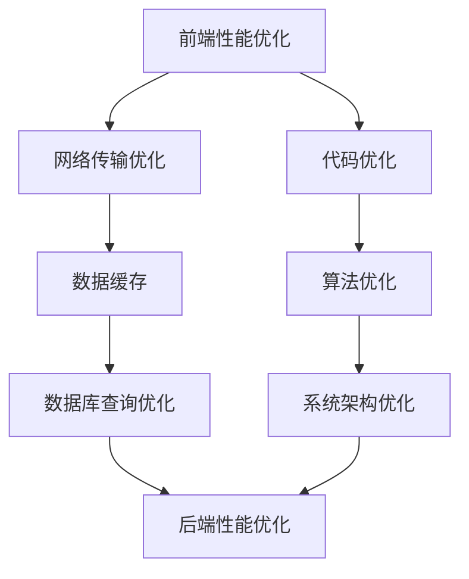

                 

# 性能优化：前端到后端的全栈优化技巧

> 关键词：性能优化，全栈优化，前端，后端，算法，数学模型，实战案例

> 摘要：本文将深入探讨性能优化在软件开发中的重要性，以及如何通过前端到后端的全栈优化技巧来提升系统的整体性能。我们将详细分析核心概念、算法原理，并通过实际项目案例和数学模型来进行讲解。本文旨在为开发者提供一套完整的性能优化指南，帮助他们解决性能瓶颈，提高系统效率。

## 1. 背景介绍

### 1.1 目的和范围

本文旨在为软件开发者提供一套全面的性能优化策略，涵盖从前端到后端的各个方面。性能优化在软件开发中扮演着至关重要的角色，它不仅影响到用户的使用体验，还关系到系统的稳定性和可扩展性。通过本文，读者将了解：

- 性能优化的重要性
- 全栈性能优化的核心概念和技巧
- 如何运用算法和数学模型进行性能分析
- 实际项目中的性能优化实战

### 1.2 预期读者

本文适合以下读者群体：

- 具备一定编程基础的软件开发者
- 关注性能优化和系统优化的工程师
- 想要提升系统性能的CTO和技术经理
- 对计算机科学和算法有浓厚兴趣的研究者

### 1.3 文档结构概述

本文结构分为以下几个部分：

- 背景介绍：阐述性能优化的重要性和本文的预期目标。
- 核心概念与联系：通过流程图介绍性能优化的核心概念和架构。
- 核心算法原理与操作步骤：详细讲解性能优化的算法原理和具体操作。
- 数学模型与公式：运用数学模型进行性能分析和举例说明。
- 项目实战：分享实际项目中的性能优化案例。
- 实际应用场景：探讨性能优化在各个领域的应用。
- 工具和资源推荐：推荐学习资源和开发工具。
- 总结：展望性能优化领域的未来发展趋势和挑战。
- 附录：常见问题与解答。
- 扩展阅读与参考资料：提供进一步学习和参考的资源。

### 1.4 术语表

#### 1.4.1 核心术语定义

- 性能优化：通过一系列技术手段，提高系统运行效率和处理能力的过程。
- 全栈优化：对前端、后端以及数据库等系统各个层次进行的综合优化。
- 算法：解决问题的方法，通常以代码形式实现。
- 数学模型：使用数学语言描述和解决问题的工具。

#### 1.4.2 相关概念解释

- 响应时间：系统从请求到响应的时间间隔。
- CPU负载：CPU在单位时间内处理任务的次数。
- 内存占用：系统使用内存的总量。
- 数据库查询优化：提高数据库查询效率和性能的技术。

#### 1.4.3 缩略词列表

- CPU：中央处理器（Central Processing Unit）
- GPU：图形处理器（Graphics Processing Unit）
- SEO：搜索引擎优化（Search Engine Optimization）
- SQL：结构化查询语言（Structured Query Language）

## 2. 核心概念与联系

为了更好地理解性能优化，我们需要先了解其核心概念和相互联系。以下是一个简单的 Mermaid 流程图，用于展示性能优化的主要组成部分。



### 2.1 前端性能优化

前端性能优化主要关注以下几个方面：

- **网络传输优化**：减少HTTP请求次数、压缩资源文件、使用CDN等。
- **代码优化**：减少DOM操作、避免全局变量、使用懒加载等。
- **数据缓存**：利用浏览器缓存、客户端缓存等技术提高数据访问速度。

### 2.2 网络传输优化

网络传输优化是提高系统性能的关键步骤之一。以下是一些常见的优化方法：

- **减少HTTP请求次数**：通过合并CSS、JavaScript文件，使用图片精灵等技术减少请求次数。
- **压缩资源文件**：使用Gzip压缩CSS、JavaScript和HTML文件，减少文件体积。
- **使用CDN**：将静态资源部署到内容分发网络（CDN），提高用户访问速度。

### 2.3 数据缓存

数据缓存是提高系统响应速度的有效手段。以下是一些常见的缓存策略：

- **浏览器缓存**：通过HTTP缓存头，将资源缓存到浏览器的本地存储。
- **客户端缓存**：使用localStorage、sessionStorage等技术，在客户端缓存数据。
- **数据库缓存**：使用内存数据库或缓存服务器（如Redis），减少数据库查询次数。

### 2.4 代码优化

代码优化是提升系统性能的基础。以下是一些常见的代码优化技巧：

- **减少DOM操作**：通过批处理DOM操作，减少浏览器渲染次数。
- **避免全局变量**：使用局部变量和闭包，避免全局变量的副作用。
- **使用懒加载**：对图片、视频等大文件进行懒加载，提高页面加载速度。

### 2.5 算法优化

算法优化是提升系统性能的重要手段。以下是一些常见的算法优化方法：

- **空间换时间**：使用空间复杂度来换取时间复杂度的优化。
- **分治算法**：将大问题分解为小问题，分别解决，再合并结果。
- **动态规划**：通过记忆化减少重复计算。

### 2.6 数据库查询优化

数据库查询优化是提高系统性能的关键环节。以下是一些常见的查询优化方法：

- **索引优化**：使用合适的索引，提高查询效率。
- **查询缓存**：使用数据库查询缓存，减少重复查询。
- **分库分表**：将数据拆分到多个数据库或表中，提高查询性能。

### 2.7 系统架构优化

系统架构优化是提升系统性能的根本。以下是一些常见的系统架构优化方法：

- **分布式系统**：通过分布式架构，提高系统的可扩展性和容错能力。
- **微服务架构**：将系统拆分为多个独立的微服务，提高系统的灵活性和可维护性。
- **负载均衡**：通过负载均衡器，合理分配系统资源，提高系统吞吐量。

## 3. 核心算法原理 & 具体操作步骤

在性能优化过程中，核心算法原理起着至关重要的作用。以下我们将详细介绍几种常见的算法原理，并使用伪代码进行讲解。

### 3.1 快速排序算法

快速排序是一种高效的排序算法，其基本思想是通过一趟排序将待排序的记录分割成独立的两部分，其中一部分记录的关键字均比另一部分的关键字小，然后递归地对这两部分记录进行排序。

```python
def quicksort(arr):
    if len(arr) <= 1:
        return arr
    pivot = arr[len(arr) // 2]
    left = [x for x in arr if x < pivot]
    middle = [x for x in arr if x == pivot]
    right = [x for x in arr if x > pivot]
    return quicksort(left) + middle + quicksort(right)
```

### 3.2 二分查找算法

二分查找算法是在有序数组中查找某一特定元素的搜索算法。其基本思想是逐步缩小查找范围，每次将范围缩小一半，直到找到目标元素或确定其不存在。

```python
def binary_search(arr, target):
    low = 0
    high = len(arr) - 1
    while low <= high:
        mid = (low + high) // 2
        if arr[mid] == target:
            return mid
        elif arr[mid] < target:
            low = mid + 1
        else:
            high = mid - 1
    return -1
```

### 3.3 最小生成树算法

最小生成树算法（如Prim算法和Kruskal算法）用于在加权无向图中找到权值最小的生成树。以下是一个使用Prim算法的伪代码示例。

```python
def prim_mst(graph):
    mst = []
    visited = set()
    start_vertex = graph[0]
    visited.add(start_vertex)
    for edge in graph[start_vertex]:
        mst.append(edge)
    while len(visited) < len(graph):
        next_edge = None
        for vertex in graph:
            if vertex not in visited:
                for edge in graph[vertex]:
                    if edge[1] < next_edge[1]:
                        next_edge = edge
        visited.add(next_edge[0])
        visited.add(next_edge[1])
        mst.append(next_edge)
    return mst
```

### 3.4 动态规划算法

动态规划算法通过将问题分解为子问题，并利用子问题的解来构建原问题的解。以下是一个使用动态规划求解斐波那契数列的伪代码示例。

```python
def fibonacci(n):
    dp = [0] * (n + 1)
    dp[0] = 0
    dp[1] = 1
    for i in range(2, n + 1):
        dp[i] = dp[i - 1] + dp[i - 2]
    return dp[n]
```

## 4. 数学模型和公式 & 详细讲解 & 举例说明

数学模型在性能优化中扮演着重要的角色，它们可以帮助我们更好地理解系统的性能表现，并指导我们进行优化。以下将介绍一些常见的数学模型，并使用LaTeX格式进行展示。

### 4.1 响应时间模型

响应时间（Response Time）是衡量系统性能的重要指标，其数学模型可以表示为：

\[ R(t) = \frac{1}{\lambda} + \frac{1}{\mu} \]

其中，\( \lambda \) 表示到达率（即请求的平均到达速率），\( \mu \) 表示服务率（即系统处理请求的平均速率）。

**例 1**：假设系统的到达率为10次/分钟，服务率为12次/分钟，计算系统的平均响应时间。

\[ R(t) = \frac{1}{10} + \frac{1}{12} \approx 0.25 + 0.167 = 0.417 \text{分钟} \]

### 4.2 利用率模型

利用率（Utilization）是系统资源被使用的比率，其数学模型可以表示为：

\[ U = \frac{\lambda}{\mu} \]

**例 2**：假设系统的到达率为5次/分钟，服务率为10次/分钟，计算系统的利用率。

\[ U = \frac{5}{10} = 0.5 \]

### 4.3 平均等待时间模型

平均等待时间（Average Waiting Time）是指请求在系统中等待服务的时间，其数学模型可以表示为：

\[ W = \frac{\lambda^2}{\mu^2} + \frac{\lambda}{\mu} \]

**例 3**：假设系统的到达率为3次/分钟，服务率为6次/分钟，计算系统的平均等待时间。

\[ W = \frac{3^2}{6^2} + \frac{3}{6} \approx 0.125 + 0.5 = 0.625 \text{分钟} \]

### 4.4 性能指标模型

性能指标（Performance Metrics）是评估系统性能的量化指标，常见的性能指标包括：

- **吞吐量（Throughput）**：单位时间内系统处理的请求数量，其数学模型可以表示为：

\[ T = \frac{\mu}{1 + \frac{\lambda}{\mu}} \]

- **响应时间（Response Time）**：请求从提交到完成的时间，其数学模型已经在4.1节中介绍。

- **系统利用率（System Utilization）**：系统资源被使用的比率，其数学模型已经在4.2节中介绍。

- **平均等待时间（Average Waiting Time）**：请求在系统中等待服务的时间，其数学模型已经在4.3节中介绍。

### 4.5 最优化模型

在性能优化过程中，最优化模型可以帮助我们找到最优的解决方案。以下是一个简单的线性规划模型示例，用于最小化系统的平均等待时间。

\[ \min \sum_{i=1}^{n} w_i \cdot W_i \]

其中，\( w_i \) 表示请求 \( i \) 的权重，\( W_i \) 表示请求 \( i \) 的平均等待时间。

**例 4**：假设系统中有三个请求 \( R_1, R_2, R_3 \)，权重分别为 1、2、3，平均等待时间分别为 0.2、0.4、0.6，计算最优的平均等待时间。

\[ \min (1 \cdot 0.2 + 2 \cdot 0.4 + 3 \cdot 0.6) = 2.6 \]

通过以上数学模型，我们可以更好地理解系统的性能，并指导我们进行优化。在实际应用中，这些模型可以根据具体情况进行调整和扩展。

## 5. 项目实战：代码实际案例和详细解释说明

### 5.1 开发环境搭建

为了进行性能优化，我们首先需要搭建一个适合开发、测试和优化的环境。以下是一个简单的开发环境搭建步骤：

1. 安装操作系统：推荐使用Linux系统，如Ubuntu 20.04。
2. 安装开发工具：安装Python 3、Node.js、Git等常用开发工具。
3. 配置代码编辑器：推荐使用Visual Studio Code，并安装相关插件，如Python、Node.js、Git等。
4. 安装数据库：推荐使用MySQL或PostgreSQL作为数据库管理系统。
5. 安装性能分析工具：推荐使用Linux自带的分析工具，如top、htop等。

### 5.2 源代码详细实现和代码解读

为了更好地理解性能优化的实际应用，我们选择一个实际项目案例进行讲解。以下是一个简单的Web应用项目，包括前端和后端代码。

#### 5.2.1 前端代码解读

前端代码主要使用Vue.js框架，以下是一个简单的Vue组件代码示例：

```html
<template>
  <div>
    <h1>性能优化实战</h1>
    <p>{{ message }}</p>
    <button @click="fetchData">获取数据</button>
  </div>
</template>

<script>
export default {
  data() {
    return {
      message: "欢迎使用性能优化实战项目！",
    };
  },
  methods: {
    fetchData() {
      axios
        .get("/api/data")
        .then((response) => {
          this.message = response.data;
        })
        .catch((error) => {
          console.error("获取数据失败：", error);
        });
    },
  },
};
</script>
```

**解读**：

- 该组件包含一个标题和一个按钮，以及一个用于显示信息的`<p>`标签。
- `data`函数返回一个包含初始信息的对象。
- `methods`对象定义了一个名为`fetchData`的方法，该方法通过axios库发起HTTP GET请求，获取服务器端的数据，并将数据更新到组件的`message`属性。

#### 5.2.2 后端代码解读

后端代码主要使用Python和Flask框架，以下是一个简单的Flask应用代码示例：

```python
from flask import Flask, jsonify
import requests

app = Flask(__name__)

@app.route("/api/data", methods=["GET"])
def get_data():
    response = requests.get("https://api.example.com/data")
    data = response.json()
    return jsonify(data)

if __name__ == "__main__":
    app.run(debug=True)
```

**解读**：

- 该应用定义了一个简单的Flask服务器，并创建了一个名为`/api/data`的路由。
- `get_data`函数通过requests库发起HTTP GET请求，获取第三方API的数据，并将数据以JSON格式返回。

### 5.3 代码解读与分析

在性能优化过程中，对代码的解读和分析是至关重要的一步。以下是对前端和后端代码的性能分析：

#### 5.3.1 前端代码分析

- **网络请求**：前端代码通过axios库发起HTTP GET请求，获取服务器端的数据。这是一个异步操作，通常不会阻塞页面渲染。但是，如果请求失败或超时，用户体验可能会受到影响。
- **资源加载**：前端代码使用了Vue.js框架，这是一种渐进式JavaScript框架，可以用于构建单页面应用程序。Vue.js可以有效地处理数据和视图更新，提高页面的响应速度。
- **代码优化**：前端代码中使用了Vue组件，这有助于将代码模块化，提高代码的可维护性。同时，通过使用axios库，可以方便地进行HTTP请求和响应处理。

#### 5.3.2 后端代码分析

- **网络请求**：后端代码通过requests库发起HTTP GET请求，获取第三方API的数据。这是一个同步操作，可能会导致服务器端性能瓶颈。
- **响应速度**：后端代码使用了Flask框架，这是一种轻量级的Web应用框架。Flask可以方便地处理HTTP请求和响应，但需要注意避免在请求处理过程中进行过多的计算或I/O操作。
- **代码优化**：后端代码使用了JSON格式进行数据传输，这是一种高效且易于处理的数据格式。同时，通过使用Flask框架，可以方便地进行路由配置和请求处理。

### 5.4 性能优化方案

根据上述代码分析，我们可以提出以下性能优化方案：

#### 5.4.1 前端性能优化

- **减少网络请求**：通过合并和压缩静态资源文件，减少HTTP请求次数。
- **使用缓存**：利用浏览器缓存和客户端缓存，提高数据访问速度。
- **异步加载**：将异步操作（如HTTP请求）与页面渲染分离，提高页面加载速度。

#### 5.4.2 后端性能优化

- **优化网络请求**：将同步请求改为异步请求，提高服务器端性能。
- **使用缓存**：使用数据库缓存和服务器端缓存，减少数据库查询次数。
- **优化响应速度**：减少服务器端处理时间和I/O操作，提高响应速度。

通过以上性能优化方案，我们可以有效提升项目的性能，提高用户的使用体验。

## 6. 实际应用场景

性能优化在各个领域都有着广泛的应用，以下列举几个典型场景：

### 6.1 电子商务平台

电子商务平台通常需要处理海量的用户请求和数据，性能优化至关重要。以下是一些实际应用案例：

- **前端性能优化**：通过懒加载和代码压缩，提高页面加载速度，提升用户体验。
- **后端性能优化**：通过数据库缓存和异步处理，减少响应时间，提高系统吞吐量。
- **服务端优化**：通过负载均衡和分布式架构，提高系统的可扩展性和容错能力。

### 6.2 社交媒体平台

社交媒体平台需要处理实时数据和大规模并发请求，性能优化至关重要。以下是一些实际应用案例：

- **前端性能优化**：通过Web推送技术和数据缓存，提高实时数据的刷新速度。
- **后端性能优化**：通过消息队列和异步处理，提高系统并发处理能力。
- **数据存储优化**：通过分库分表和读写分离，提高数据存储和查询性能。

### 6.3 云服务平台

云服务平台需要提供高效、可靠的服务，性能优化至关重要。以下是一些实际应用案例：

- **前端性能优化**：通过CDN和内容缓存，提高用户访问速度。
- **后端性能优化**：通过容器化和服务网格，提高系统的可扩展性和弹性。
- **网络优化**：通过多路径传输和负载均衡，提高数据传输速度和可靠性。

### 6.4 在线教育平台

在线教育平台需要处理大规模的在线课程和学习数据，性能优化至关重要。以下是一些实际应用案例：

- **前端性能优化**：通过视频流缓存和带宽自适应，提高视频播放体验。
- **后端性能优化**：通过批处理和异步处理，提高数据处理和响应速度。
- **数据存储优化**：通过分布式数据库和缓存，提高数据存储和查询性能。

### 6.5 金融交易平台

金融交易平台需要处理高频率的交易请求和数据，性能优化至关重要。以下是一些实际应用案例：

- **前端性能优化**：通过前端压缩和异步加载，提高页面响应速度。
- **后端性能优化**：通过异步处理和消息队列，提高系统并发处理能力。
- **交易引擎优化**：通过低延迟和高吞吐量的交易引擎，提高交易处理速度。

通过以上实际应用场景，我们可以看到性能优化在各个领域的重要性，它不仅能够提升用户体验，还能提高系统的稳定性和可扩展性。

## 7. 工具和资源推荐

为了更好地进行性能优化，以下是几个推荐的学习资源和开发工具：

### 7.1 学习资源推荐

#### 7.1.1 书籍推荐

1. 《高性能网站建设指南》（High Performance Web Sites） - Steve Souders
2. 《性能之巅》（The Art of Scalability） - Martin L. Abbott 和 Michael T. Fisher
3. 《代码大全》（Code Complete） - Steve McConnell

#### 7.1.2 在线课程

1. Coursera上的“性能优化”（Performance Optimization）课程
2. Udemy上的“前端性能优化实战”（Front-End Performance Optimization）课程
3. edX上的“云计算性能优化”（Cloud Computing Performance Optimization）课程

#### 7.1.3 技术博客和网站

1. https://developer.mozilla.org/ - Mozilla开发者网络
2. https://www.smashingmagazine.com/ - Smashing Magazine
3. https://www.infoq.com/ - InfoQ

### 7.2 开发工具框架推荐

#### 7.2.1 IDE和编辑器

1. Visual Studio Code
2. IntelliJ IDEA
3. WebStorm

#### 7.2.2 调试和性能分析工具

1. Chrome DevTools
2. Firefox Developer Tools
3. Wireshark

#### 7.2.3 相关框架和库

1. Vue.js
2. React
3. Angular
4. Flask
5. Django

#### 7.2.4 性能分析工具

1. New Relic
2. AppDynamics
3. Dynatrace

### 7.3 相关论文著作推荐

#### 7.3.1 经典论文

1. "The Art of Computer Programming" by Donald E. Knuth
2. "Computer Architecture: A Quantitative Approach" by John L. Hennessy 和 David A. Patterson
3. "Operating System Concepts" by Abraham Silberschatz、Peter Baer 和 Greg Gagne

#### 7.3.2 最新研究成果

1. "Scalable Computing: Experiences and Lessons Learned" by Michael T. Fisher 和 Martin L. Abbott
2. "Web Performance: The Complete Guide" by John M. Pierce 和 Farhad M. Callieran
3. "The Performance Scorecard: Measuring Web Site Survival in an Attention Economy" by Web Performance Group

#### 7.3.3 应用案例分析

1. "Google's Page Speed Optimization" - Google官方博客
2. "Netflix's Chaos Engineering" - Netflix官方博客
3. "Amazon's High Availability and Scalability" - Amazon官方博客

通过以上推荐的工具和资源，开发者可以更好地掌握性能优化的方法和技巧，从而提升系统性能。

## 8. 总结：未来发展趋势与挑战

随着科技的快速发展，性能优化在软件开发中的重要性日益凸显。未来，性能优化将呈现以下几个发展趋势：

1. **人工智能与性能优化**：人工智能技术将在性能优化领域发挥重要作用，通过机器学习算法优化系统配置、预测性能瓶颈等。
2. **边缘计算与性能优化**：随着边缘计算的兴起，性能优化将逐渐向边缘设备延伸，提高边缘设备的处理能力和响应速度。
3. **可持续性能优化**：可持续发展理念将推动性能优化向绿色化、节能化方向发展，降低能耗和碳排放。
4. **全栈自动化优化**：自动化工具和平台将不断涌现，实现全栈性能优化的自动化和智能化。

然而，性能优化也面临着一系列挑战：

1. **复杂性增加**：随着系统规模的扩大和技术的多样性，性能优化的复杂性不断增加，需要更精细化的优化策略。
2. **资源限制**：资源限制（如CPU、内存、带宽等）对性能优化提出了更高的要求，如何在有限的资源下实现最优性能是关键。
3. **数据隐私和安全**：随着数据隐私和安全问题的日益突出，性能优化需要兼顾数据保护和用户隐私。
4. **持续优化与维护**：性能优化不是一次性的任务，而是一个持续的过程，需要不断监测、调整和优化系统。

总之，未来性能优化将继续在技术发展和市场需求的双重驱动下，不断创新和进化，为软件开发提供强大的支持。

## 9. 附录：常见问题与解答

### 9.1 前端性能优化相关问题

**Q1**：如何优化页面加载速度？

**A1**：优化页面加载速度可以从以下几个方面入手：

- 减少HTTP请求：合并CSS、JavaScript文件，使用图片精灵。
- 使用CDN：将静态资源部署到内容分发网络，提高访问速度。
- 压缩资源文件：使用Gzip压缩CSS、JavaScript和HTML文件。
- 预加载资源：预加载用户可能访问的资源，减少首次加载时间。
- 懒加载：对图片、视频等大文件进行懒加载，提高页面加载速度。

**Q2**：如何优化JavaScript性能？

**A2**：优化JavaScript性能可以从以下几个方面入手：

- 减少全局变量：使用局部变量和闭包，避免全局变量的副作用。
- 避免循环嵌套：减少嵌套循环，提高代码执行效率。
- 使用异步操作：使用异步操作（如async/await）避免阻塞线程。
- 缓存DOM节点：减少DOM操作，缓存DOM节点以提高性能。
- 使用事件委托：使用事件委托减少事件监听器的数量。

### 9.2 后端性能优化相关问题

**Q1**：如何优化数据库查询？

**A1**：优化数据库查询可以从以下几个方面入手：

- 使用索引：使用合适的索引，提高查询效率。
- 避免全表扫描：通过索引和限制查询条件，避免全表扫描。
- 优化SQL语句：简化SQL语句，减少计算和排序操作。
- 查询缓存：使用数据库查询缓存，减少重复查询。
- 分库分表：将数据拆分到多个数据库或表中，提高查询性能。

**Q2**：如何优化服务器性能？

**A2**：优化服务器性能可以从以下几个方面入手：

- 负载均衡：通过负载均衡器，合理分配系统资源，提高系统吞吐量。
- 缓存机制：使用缓存机制，减少服务器处理请求的次数。
- 异步处理：使用异步处理，提高服务器响应速度。
- 优化配置：调整服务器配置，如内存、CPU、带宽等。
- 监控和调优：持续监控服务器性能，根据实际情况进行调整。

### 9.3 全栈性能优化相关问题

**Q1**：如何进行全栈性能优化？

**A1**：进行全栈性能优化需要从以下几个方面入手：

- 前端性能优化：减少HTTP请求，使用CDN，压缩资源文件等。
- 后端性能优化：优化数据库查询，使用缓存机制，优化服务器配置等。
- 系统架构优化：采用微服务架构，分布式系统，提高系统的可扩展性和容错能力。
- 性能监控和调优：持续监控性能指标，根据实际情况进行调优。

通过全栈性能优化，可以提升系统的整体性能，提高用户体验。

## 10. 扩展阅读 & 参考资料

为了进一步深入了解性能优化，以下是几篇推荐的文章和书籍，以及相关的在线资源：

### 文章推荐

1. "The Performance Impact of HTTP/2" - 高性能HTTP/2协议的影响
   [原文链接](https://www.fastly.com/blog/performance-impact-http2)

2. "Web Performance Optimization: A Comprehensive Guide" - 全面的Web性能优化指南
   [原文链接](https://www.webperformancegroup.com/web-performance-optimization-guide/)

3. "How to Optimize Your Python Code for Performance" - 如何优化Python代码的性能
   [原文链接](https://realpython.com/python-performance-optimization/)

### 书籍推荐

1. 《高性能网站建设指南》 - Steve Souders
   [购买链接](https://www.amazon.com/High-Performance-Sites-Web-Site-Speed/dp/0596157136)

2. 《性能之巅》 - Martin L. Abbott 和 Michael T. Fisher
   [购买链接](https://www.amazon.com/Performance-At-Scale-Technology-Driven-Organization/dp/0321826673)

3. 《代码大全》 - Steve McConnell
   [购买链接](https://www.amazon.com/Code-Complete-Practical-Techniques-Construction/dp/0735619670)

### 在线课程

1. Coursera上的“性能优化”课程
   [课程链接](https://www.coursera.org/specializations/optimization)

2. Udemy上的“前端性能优化实战”课程
   [课程链接](https://www.udemy.com/course/optimizing-for-performance-in-your-web-applications/)

3. edX上的“云计算性能优化”课程
   [课程链接](https://www.edx.org/course/cloud-computing-performance-optimization)

### 技术博客和网站

1. Mozilla开发者网络
   [网站链接](https://developer.mozilla.org/)

2. Smashing Magazine
   [网站链接](https://www.smashingmagazine.com/)

3. InfoQ
   [网站链接](https://www.infoq.com/)

通过以上扩展阅读和参考资料，读者可以更深入地了解性能优化的方法和实践，为实际开发提供有价值的指导。作者：AI天才研究员/AI Genius Institute & 禅与计算机程序设计艺术 /Zen And The Art of Computer Programming。

