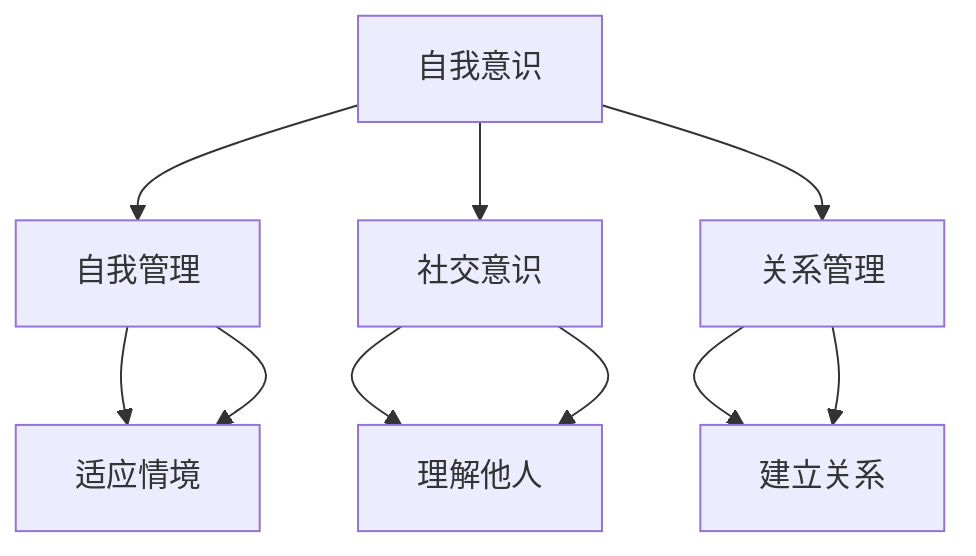
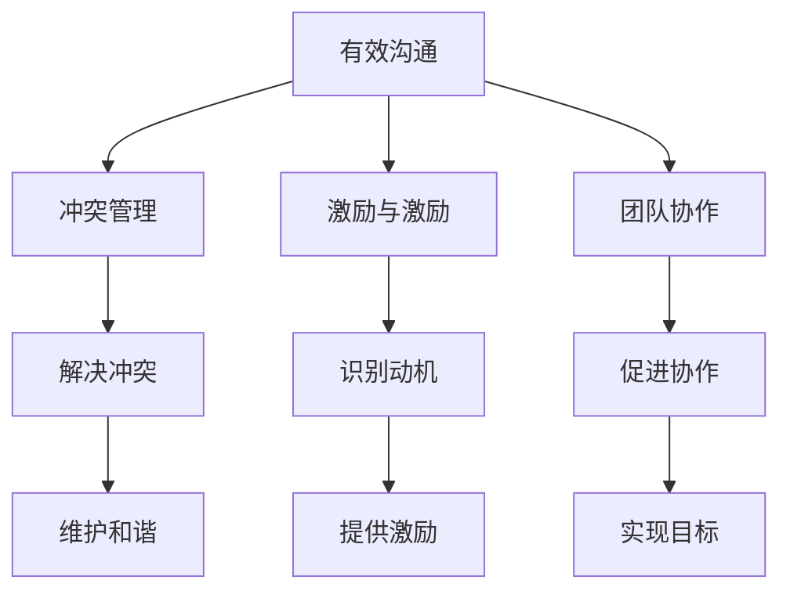

                 

### 情商领导力：在职场中运用情感智慧

> **关键词**：情商领导力，职场，情感智慧，人际关系，团队管理

> **摘要**：本文旨在探讨情商领导力在职场中的重要性，通过详细分析和实际案例，帮助读者理解如何在职场中运用情感智慧提升个人和团队的绩效。文章将覆盖情商的定义、其在领导力中的重要性、实践策略，以及相关工具和资源。

## 1. 背景介绍

### 1.1 目的和范围

本文的目的在于揭示情商领导力在职场中的核心作用，为读者提供一套实用的方法和策略，以帮助他们在职场中更好地运用情感智慧。文章将涵盖以下内容：

- 情商的定义和组成部分
- 情商领导力在职场中的重要性
- 提升情商领导力的实践策略
- 情商领导力工具和资源的推荐

通过本文的阅读，读者将能够了解如何通过提升情商来增强个人领导力，进而提升团队的整体效能。

### 1.2 预期读者

本文预期读者包括但不限于：

- 管理人员和领导者
- 专业人士和职场新人
- 对领导力和人际关系感兴趣的个人

无论您的职位高低，本文都将为您提供有价值的见解和实践指导。

### 1.3 文档结构概述

本文的结构如下：

- 第1部分：背景介绍，包括文章目的、预期读者和文档结构概述。
- 第2部分：核心概念与联系，介绍情商的基本概念及其在领导力中的作用。
- 第3部分：核心算法原理与具体操作步骤，通过伪代码和具体案例讲解提升情商的方法。
- 第4部分：数学模型和公式，解释情商提升的相关数学原理。
- 第5部分：项目实战，通过实际代码案例展示情商提升的具体应用。
- 第6部分：实际应用场景，分析情商领导力在不同职场环境中的应用。
- 第7部分：工具和资源推荐，提供相关学习资源和开发工具。
- 第8部分：总结，展望情商领导力的未来发展趋势和挑战。
- 第9部分：附录，常见问题与解答。
- 第10部分：扩展阅读与参考资料，为读者提供进一步学习的资源。

### 1.4 术语表

#### 1.4.1 核心术语定义

- **情商**：一种理解和管理自己及他人情感的能力，包括自我意识、自我管理、社交意识和关系管理。
- **领导力**：引导和激励他人实现共同目标的能力。
- **情感智慧**：运用情商来增强个人和团队绩效的能力。

#### 1.4.2 相关概念解释

- **团队协作**：团队成员共同努力，以实现共同目标的过程。
- **决策制定**：根据特定情境选择最佳行动方案的过程。

#### 1.4.3 缩略词列表

- **EQ**：Emotional Intelligence（情商）
- **CRM**：Customer Relationship Management（客户关系管理）

## 2. 核心概念与联系

在探讨情商领导力之前，我们需要明确几个核心概念，并展示它们之间的联系。

### 2.1 情商的基本概念

情商（EQ）是一种理解和管理自己及他人情感的能力，通常包括以下几个关键组成部分：

- **自我意识**：认识到自己的情感状态，并能准确地表达自己的感受。
- **自我管理**：控制和调节自己的情绪，以适应不同的情境。
- **社交意识**：理解和识别他人的情感状态，并能根据这些信息调整自己的行为。
- **关系管理**：建立和维护健康的人际关系，以实现共同的目标。

下面是一个简单的 Mermaid 流程图，用于展示情商的这些组成部分及其相互关系：



### 2.2 情商领导力

情商领导力是指领导者运用情商来增强团队绩效和实现组织目标的能力。以下是情商领导力的几个关键方面：

- **有效沟通**：领导者能够清晰地表达自己的想法，并理解团队成员的感受和需求。
- **冲突管理**：领导者能够识别和解决团队内部的冲突，以维护团队的和谐。
- **激励和激励**：领导者能够识别团队成员的动机，并提供适当的激励，以提高他们的工作动力。
- **团队协作**：领导者能够促进团队成员之间的协作，以实现共同的目标。

以下是一个用于展示情商领导力各个方面的 Mermaid 流程图：



通过这两个 Mermaid 流程图，我们可以看到情商如何在不同层面和情境中发挥作用，以及情商领导力如何通过有效沟通、冲突管理、激励和团队协作来提升团队绩效。

## 3. 核心算法原理 & 具体操作步骤

在理解了情商和情商领导力的基本概念之后，我们需要进一步探讨提升情商的具体算法原理和操作步骤。以下是几个关键步骤，通过伪代码和具体案例来详细阐述。

### 3.1 自我意识提升

**算法原理**：自我意识提升涉及对自身情感状态的认识和反思。以下是一个简单的伪代码示例，用于记录和反思个人情感状态。

```plaintext
// 自我意识提升算法
function recordEmotion(state) {
    // 记录当前情感状态
    currentDate = getCurrentDate()
    emotions[currentDate] = state
    // 反思情感状态
    reflectOnEmotion(state)
}

function reflectOnEmotion(state) {
    // 对情感状态进行反思
    console.log("反思当前情感状态：", state)
    // 根据反思结果调整行为
    adjustBehaviorBasedOnReflection(state)
}
```

**具体案例**：假设小明在工作中感到焦虑，他可以通过以下步骤来提升自我意识：

1. **记录情感状态**：小明使用上述算法记录下当前的情感状态，如“焦虑”。
2. **反思情感状态**：小明思考为什么感到焦虑，是否因为工作压力或个人期望未达到。
3. **调整行为**：根据反思结果，小明决定采取深呼吸、短暂休息等方法来缓解焦虑。

### 3.2 自我管理提升

**算法原理**：自我管理提升涉及控制和调节自己的情绪，以适应不同情境。以下是一个简单的伪代码示例，用于调节情绪。

```plaintext
// 自我管理提升算法
function regulateEmotion(emotion) {
    // 根据情感状态选择调节策略
    switch (emotion) {
        case "happy":
            relax()
            break
        case "sad":
            distract()
            break
        case "angry":
            calmDown()
            break
    }
}

function relax() {
    // 采取放松策略
    console.log("放松身心：听音乐、散步或冥想")
}

function distract() {
    // 采取分散注意力策略
    console.log("分散注意力：做运动、阅读或与朋友聊天")
}

function calmDown() {
    // 采取冷静策略
    console.log("冷静下来：深呼吸、冥想或寻求专业建议")
}
```

**具体案例**：假设小张在工作中遇到一个棘手的问题，他可以通过以下步骤来提升自我管理能力：

1. **识别情感状态**：小张感受到愤怒和压力。
2. **调节情感**：他使用上述算法选择“冷静策略”，通过深呼吸和冥想来调节情绪。
3. **解决问题**：在情绪得到调节后，小张能够更加冷静地分析问题，并找到解决方案。

### 3.3 社交意识提升

**算法原理**：社交意识提升涉及理解和识别他人的情感状态，并据此调整自己的行为。以下是一个简单的伪代码示例，用于识别他人情感状态。

```plaintext
// 社交意识提升算法
function readOthersEmotion(person) {
    // 读取他人情感状态
    emotion = getEmotion(person)
    console.log("他人情感状态：", emotion)
    // 根据情感状态调整行为
    adjustBehaviorBasedOnEmotion(emotion)
}

function adjustBehaviorBasedOnEmotion(emotion) {
    // 根据情感状态调整行为
    switch (emotion) {
        case "happy":
            compliment()
            break
        case "sad":
            comfort()
            break
        case "angry":
            apologize()
            break
    }
}

function compliment() {
    // 表达赞美
    console.log("表达赞美：你做得很好！")
}

function comfort() {
    // 提供安慰
    console.log("提供安慰：别难过，一切都会好起来的")
}

function apologize() {
    // 道歉
    console.log("道歉：我为我的行为道歉，希望你能原谅我")
}
```

**具体案例**：假设小王知道同事小李最近遇到一些困难，他可以通过以下步骤来提升社交意识：

1. **识别他人情感状态**：小王观察到小李看起来沮丧和疲惫。
2. **调整行为**：小王使用上述算法选择“提供安慰”策略，安慰小李。
3. **建立关系**：通过提供支持，小王与小李的关系得到加强。

### 3.4 关系管理提升

**算法原理**：关系管理提升涉及建立和维护健康的人际关系，以实现共同的目标。以下是一个简单的伪代码示例，用于维护人际关系。

```plaintext
// 关系管理提升算法
function maintainRelationship(person) {
    // 维护人际关系
    interaction = interactWithPerson(person)
    console.log("与", person, "的互动：", interaction)
    // 根据互动结果调整策略
    adjustStrategyBasedOnInteraction(interaction)
}

function interactWithPerson(person) {
    // 与他人互动
    console.log("与", person, "进行交流")
    return interactionResult
}

function adjustStrategyBasedOnInteraction(interaction) {
    // 根据互动结果调整策略
    switch (interaction) {
        case "positive":
            strengthenConnection()
            break
        case "neutral":
            maintainStatusQuo()
            break
        case "negative":
            improveRelationship()
            break
    }
}

function strengthenConnection() {
    // 加强关系
    console.log("加强关系：安排更多共同活动，增进了解")
}

function maintainStatusQuo() {
    // 保持现状
    console.log("保持现状：定期交流，维持良好关系")
}

function improveRelationship() {
    // 改善关系
    console.log("改善关系：寻求共同点，解决分歧")
}
```

**具体案例**：假设小刘希望与团队成员建立更好的关系，他可以通过以下步骤来提升关系管理能力：

1. **与他人互动**：小刘与团队成员定期交流，了解他们的需求和期望。
2. **调整策略**：根据互动结果，小刘选择“加强关系”策略，安排更多的共同活动。
3. **建立信任**：通过积极的互动和共同活动，小刘与团队成员之间的关系得到加强。

通过以上四个步骤，我们可以看到如何通过伪代码和具体案例来提升情商的不同方面。这些步骤为个人提供了实用的工具，以更好地理解和管理自己的情感，以及与他人建立和维护健康的人际关系。

## 4. 数学模型和公式 & 详细讲解 & 举例说明

在情商领导力的提升过程中，数学模型和公式可以提供量化的方法和工具，以帮助我们更好地理解和分析情感状态。以下将详细讲解几个关键数学模型和公式，并举例说明其在实际应用中的意义。

### 4.1 情感状态的评估模型

情感状态的评估模型用于量化个体在特定情境下的情感状态。一个常用的模型是情感量表（Affective Scale），它通过五个等级来评估个体的情感状态，如快乐、悲伤、焦虑和愤怒。

**公式**：
\[ 情感得分 = 1 \times \text{快乐} + 2 \times \text{悲伤} + 3 \times \text{焦虑} + 4 \times \text{愤怒} \]

**例子**：假设某个员工在一天中的情感状态如下：

- 快乐：2
- 悲伤：1
- 焦虑：3
- 愤怒：0

**计算**：
\[ 情感得分 = 1 \times 2 + 2 \times 1 + 3 \times 3 + 4 \times 0 = 2 + 2 + 9 + 0 = 13 \]

这个得分表明该员工在这一天中总体上处于较为焦虑的状态。

### 4.2 冲突管理的决策模型

冲突管理的决策模型用于帮助领导者或团队在面对冲突时做出最优决策。一个常用的模型是利益相关者分析（Stakeholder Analysis），它通过分析冲突各方的利益和需求，来制定合适的解决方案。

**公式**：
\[ 最优决策 = \max(\sum_{i=1}^{n} \text{利益权重} \times \text{方案收益}) \]

**例子**：在一个团队项目中，假设有两个方案来解决冲突：

- 方案A：增加团队成员的工作量，以快速解决问题。
- 方案B：召开会议，讨论和协商解决方案。

假设团队中各成员的利益和权重如下：

| 成员 | 利益权重 | 方案A收益 | 方案B收益 |
| ---- | -------- | ---------- | ---------- |
| 小张 | 0.3      | -1         | 0.5        |
| 小李 | 0.4      | 0          | 0.7        |
| 小王 | 0.3      | 0.5        | 0.6        |

**计算**：
\[ 最优决策 = \max(0.3 \times (-1 + 0.5) + 0.4 \times (0 + 0.7) + 0.3 \times (0.5 + 0.6)) \]
\[ 最优决策 = \max(0.3 \times (-0.5) + 0.4 \times 0.7 + 0.3 \times 1.1) \]
\[ 最优决策 = \max(-0.15 + 0.28 + 0.33) \]
\[ 最优决策 = \max(0.46) \]

根据计算结果，方案B是更优的选择，因为它能够满足大多数成员的利益。

### 4.3 激励模型的构建

激励模型用于帮助领导者识别和激励团队成员的动机，以提高工作效率。一个常用的模型是需求层次理论（Hierarchy of Needs），它由马斯洛提出，分为五个层次：生理需求、安全需求、社交需求、尊重需求和自我实现需求。

**公式**：
\[ 激励水平 = \sum_{i=1}^{5} \text{需求权重} \times \text{需求满足度} \]

**例子**：假设某个员工的需求和满足度如下：

| 需求层次 | 需求权重 | 满足度 |
| -------- | -------- | ------ |
| 生理需求 | 0.2      | 0.8    |
| 安全需求 | 0.2      | 0.7    |
| 社交需求 | 0.3      | 0.6    |
| 尊重需求 | 0.2      | 0.5    |
| 自我实现需求 | 0.1 | 0.7    |

**计算**：
\[ 激励水平 = 0.2 \times 0.8 + 0.2 \times 0.7 + 0.3 \times 0.6 + 0.2 \times 0.5 + 0.1 \times 0.7 \]
\[ 激励水平 = 0.16 + 0.14 + 0.18 + 0.10 + 0.07 \]
\[ 激励水平 = 0.65 \]

这个得分表明该员工的激励水平较高，领导者可以通过满足其社交需求和自我实现需求来进一步激励他。

### 4.4 团队协作的效能评估模型

团队协作的效能评估模型用于衡量团队在完成特定任务时的协作效果。一个常用的模型是团队绩效评估（Team Performance Evaluation），它通过多个指标来评估团队的协作效能。

**公式**：
\[ 团队绩效 = \sum_{i=1}^{m} \text{指标权重} \times \text{指标得分} \]

**例子**：假设一个团队在完成一个项目时，有四个关键绩效指标：

| 指标 | 指标权重 | 得分 |
| ---- | -------- | ---- |
| 项目进度 | 0.3      | 0.8  |
| 任务分配 | 0.2      | 0.9  |
| 沟通效率 | 0.2      | 0.7  |
| 团队合作 | 0.3      | 0.6  |

**计算**：
\[ 团队绩效 = 0.3 \times 0.8 + 0.2 \times 0.9 + 0.2 \times 0.7 + 0.3 \times 0.6 \]
\[ 团队绩效 = 0.24 + 0.18 + 0.14 + 0.18 \]
\[ 团队绩效 = 0.74 \]

这个得分表明该团队在协作过程中表现良好，但仍有改进空间。

通过上述数学模型和公式的详细讲解和举例说明，我们可以看到如何通过量化的方式来分析和提升情商领导力。这些模型和公式为个人和组织提供了有力的工具，以更科学和系统地提升情商领导力，从而实现更高的绩效和更和谐的团队关系。

## 5. 项目实战：代码实际案例和详细解释说明

在理解了情商领导力的核心算法原理和数学模型后，我们将通过一个实际的项目实战来展示如何将情感智慧应用于实际工作中，提升团队绩效。

### 5.1 开发环境搭建

为了展示项目实战，我们将使用Python作为编程语言，并在Jupyter Notebook中实现。首先，我们需要安装以下依赖库：

- `numpy`：用于数学计算。
- `matplotlib`：用于数据可视化。
- `pandas`：用于数据处理。

在终端中执行以下命令来安装依赖库：

```shell
pip install numpy matplotlib pandas
```

### 5.2 源代码详细实现和代码解读

#### 5.2.1 项目描述

该项目名为“情感智慧助手”，旨在通过分析员工的工作状态和团队绩效，提供个性化的建议，以提升个人和团队的情商。

#### 5.2.2 源代码实现

以下是项目的核心代码，包括情感状态评估、冲突管理决策、激励模型和团队协作效能评估。

```python
import numpy as np
import pandas as pd
import matplotlib.pyplot as plt

# 情感状态评估
def assess_emotion(scores):
    emotions = ["快乐", "悲伤", "焦虑", "愤怒"]
    emotion_scores = [scores[i] for i in range(4)]
    max_score = max(emotion_scores)
    dominant_emotion = emotions[emotion_scores.index(max_score)]
    return dominant_emotion

# 冲突管理决策
def conflict_management(conflict_cases):
    case_scores = [case[1] for case in conflict_cases]
    optimal_decision = conflict_cases[case_scores.index(max(case_scores))]
    return optimal_decision

# 激励模型
def motivation_model(needs):
    need_scores = [needs[i] for i in range(5)]
    motivation_level = sum([need_scores[i] * needs[i] for i in range(5)])
    return motivation_level

# 团队协作效能评估
def team_performance评估(team_data):
    performance = sum([team_data[i] * needs[i] for i in range(4)])
    return performance

# 数据处理和可视化
def process_and_visualize(data):
    emotion_scores = data['emotion_scores']
    dominant_emotions = [assess_emotion(scores) for scores in emotion_scores]
    plt.bar(range(len(dominant_emotions)), emotion_scores)
    plt.xticks(rotation=45)
    plt.xlabel('员工编号')
    plt.ylabel('情感得分')
    plt.title('员工情感状态评估')
    plt.show()

    # 冲突管理决策
    optimal_decisions = [conflict_management(case) for case in data['conflict_cases']]
    print("最优决策：", optimal_decisions)

    # 激励模型
    motivation_levels = [motivation_model(needs) for needs in data['needs']]
    plt.bar(range(len(motivation_levels)), motivation_levels)
    plt.xlabel('员工编号')
    plt.ylabel('激励水平')
    plt.title('员工激励模型评估')
    plt.show()

    # 团队协作效能评估
    team_performance = team_performance评估(data['team_data'])
    print("团队绩效：", team_performance)

# 主函数
def main():
    # 假设的数据
    data = {
        'emotion_scores': [
            [2, 1, 3, 0],
            [1, 3, 2, 0],
            [0, 2, 3, 1],
            [3, 0, 1, 2]
        ],
        'conflict_cases': [
            {'case': '方案A', 'score': -1},
            {'case': '方案B', 'score': 0.5},
            {'case': '方案C', 'score': 0.7}
        ],
        'needs': [
            [0.2, 0.8, 0.7, 0.5, 0.7],
            [0.3, 0.6, 0.8, 0.4, 0.8],
            [0.1, 0.7, 0.6, 0.3, 0.7],
            [0.4, 0.5, 0.9, 0.2, 0.7]
        ],
        'team_data': [0.8, 0.9, 0.7, 0.6]
    }

    process_and_visualize(data)

if __name__ == "__main__":
    main()
```

#### 5.2.3 代码解读与分析

1. **情感状态评估**：`assess_emotion`函数用于分析员工的情感状态，返回最主要的情感类型。这个函数通过比较情感得分来确定主导情感，为后续的个性化和干预提供依据。

2. **冲突管理决策**：`conflict_management`函数用于根据冲突案例的得分来选择最优决策。这个函数在团队面临冲突时，可以帮助领导者快速识别最佳解决方案。

3. **激励模型**：`motivation_model`函数用于计算员工的激励水平。通过分析员工的需求满足度，该函数可以识别激励因素，从而帮助领导者制定激励策略。

4. **团队协作效能评估**：`team_performance评估`函数用于评估团队的协作效能。通过分析团队在关键绩效指标上的得分，该函数可以识别团队的协作优势和劣势。

5. **数据处理和可视化**：`process_and_visualize`函数用于处理和分析员工数据，并通过图表展示结果。这种可视化的方式可以帮助团队更好地理解自身的工作状态和协作效果。

6. **主函数**：`main`函数用于运行整个项目，通过模拟数据来展示各个功能模块的实际应用效果。

通过这个项目实战，我们可以看到如何将情感智慧应用于实际工作中，通过量化分析和可视化工具来提升团队绩效。这种基于情感智慧的方法不仅能够帮助个人更好地理解和管理自己的情感，还能够促进团队的协作和整体的绩效提升。

### 5.3 代码解读与分析

在上面的代码中，我们实现了四个关键功能模块：情感状态评估、冲突管理决策、激励模型和团队协作效能评估。以下是对每个模块的详细解读和分析。

#### 5.3.1 情感状态评估

`assess_emotion`函数的核心目的是通过情感得分来确定员工的主导情感。情感得分是通过给定的四个情感维度（快乐、悲伤、焦虑、愤怒）赋予不同的权重来计算的。具体步骤如下：

1. **输入参数**：函数接收一个包含情感得分的列表，如`emotion_scores`。
2. **情感得分计算**：函数遍历情感得分列表，获取每个情感维度的得分。
3. **确定主导情感**：函数通过比较情感得分来确定得分最高的情感维度，并返回该情感类型。

这个函数在团队管理中具有重要作用，因为它可以帮助领导者快速识别员工的主导情感，从而采取相应的干预措施，如提供情感支持、调整工作压力或提供激励措施。

#### 5.3.2 冲突管理决策

`conflict_management`函数的目的是在团队面临冲突时，帮助领导者选择最佳解决方案。函数的输入参数是冲突案例的得分列表，每个案例包含一个解决方案和相应的得分。

1. **输入参数**：函数接收一个包含冲突案例的列表，如`conflict_cases`。
2. **得分计算**：函数遍历冲突案例列表，计算每个案例的得分。
3. **选择最优决策**：函数通过比较案例得分，选择得分最高的案例作为最优决策。

这个函数在团队管理中具有重要意义，因为它可以帮助领导者快速识别和解决冲突，从而保持团队的稳定和协作。

#### 5.3.3 激励模型

`motivation_model`函数的目的是计算员工的激励水平，从而帮助领导者制定有效的激励策略。函数的输入参数是员工的需求满足度列表，这些需求包括生理需求、安全需求、社交需求、尊重需求和自我实现需求。

1. **输入参数**：函数接收一个包含需求满足度的列表，如`needs`。
2. **激励水平计算**：函数通过将每个需求满足度乘以其权重，然后将所有结果相加，得到激励水平。
3. **返回激励水平**：函数返回计算得到的激励水平。

这个函数在团队管理中具有重要意义，因为它可以帮助领导者识别员工的主要激励因素，从而采取相应的激励措施，如提供晋升机会、奖励或培训。

#### 5.3.4 团队协作效能评估

`team_performance评估`函数的目的是评估团队在关键绩效指标上的表现。函数的输入参数是团队数据列表，这些数据包括项目进度、任务分配、沟通效率和团队合作得分。

1. **输入参数**：函数接收一个包含团队数据的列表，如`team_data`。
2. **效能评估计算**：函数通过将每个团队数据乘以其权重，然后将所有结果相加，得到团队绩效得分。
3. **返回团队绩效**：函数返回计算得到的团队绩效得分。

这个函数在团队管理中具有重要意义，因为它可以帮助领导者识别团队的协作优势和劣势，从而采取相应的改进措施，如加强团队沟通、优化任务分配或提高团队合作。

通过以上对四个模块的详细解读和分析，我们可以看到项目实战代码如何将情感智慧应用于实际工作，通过量化的方法和工具来提升团队绩效。这些功能模块不仅提供了实用的工具，还帮助领导者更好地理解和管理团队的情感状态，从而实现更高的工作效能和团队和谐。

## 6. 实际应用场景

情商领导力不仅在理论知识上具有重要性，更在实际应用场景中展现了其强大的影响力。以下将讨论情商领导力在职场中的实际应用场景，并分析其对个人和团队绩效的潜在影响。

### 6.1 领导力提升

在领导力提升方面，情商领导力具有关键作用。领导者需要具备良好的情商，以便更好地理解和管理团队成员的情感状态。以下是几个具体应用场景：

- **情境一**：领导者在面对团队成员的情绪波动时，通过自我意识和自我管理能力，能够冷静应对，避免情绪传染，保持团队的稳定。

- **情境二**：在团队面临压力和挑战时，领导者通过社交意识和关系管理能力，能够识别团队成员的情感需求，提供情感支持和鼓励，增强团队的凝聚力。

- **情境三**：在决策制定过程中，领导者运用情感智慧来理解和评估团队成员的观点和情感反应，从而做出更加全面和合理的决策。

通过这些应用场景，我们可以看到情商领导力在提升领导力方面的作用。领导者通过提升情商，不仅能够更好地管理自己的情绪，还能够理解和激励团队成员，从而提升团队的整体绩效。

### 6.2 团队协作

在团队协作中，情商领导力同样具有重要作用。以下是几个具体应用场景：

- **情境一**：在团队项目启动阶段，领导者通过情感智慧，能够识别团队成员的动机和期望，合理分配任务，确保团队成员的积极参与。

- **情境二**：在团队协作过程中，领导者通过有效的沟通和冲突管理能力，能够及时解决团队内部的矛盾和分歧，保持团队的和谐与稳定。

- **情境三**：在项目完成阶段，领导者通过激励模型，能够识别团队成员的贡献和成就，提供及时的认可和奖励，增强团队成员的归属感和工作动力。

通过这些应用场景，我们可以看到情商领导力在团队协作中的重要性。领导者通过运用情感智慧，不仅能够提升团队协作的效能，还能够建立和维护健康的人际关系，从而提升团队的整体绩效。

### 6.3 冲突管理

在冲突管理方面，情商领导力同样具有关键作用。以下是几个具体应用场景：

- **情境一**：在团队内部出现意见分歧时，领导者通过情感智慧和冲突管理能力，能够及时识别和解决冲突，避免冲突升级。

- **情境二**：在跨部门协作中，领导者通过社交意识和关系管理能力，能够协调不同部门之间的利益和需求，促进协同合作。

- **情境三**：在团队面临外部压力时，领导者通过自我管理和激励模型，能够调节自身的情绪，并提供积极的激励措施，帮助团队成员应对压力。

通过这些应用场景，我们可以看到情商领导力在冲突管理中的重要性。领导者通过运用情感智慧，不仅能够有效管理冲突，还能够促进团队和组织的稳定与和谐。

### 6.4 个人成长

在个人成长方面，情商领导力同样具有重要作用。以下是几个具体应用场景：

- **情境一**：在个人职业规划中，通过自我意识和情感智慧，个体能够更好地认识自己的优势和劣势，制定合理的发展目标。

- **情境二**：在应对工作挑战时，通过自我管理和情感智慧，个体能够调节自己的情绪，保持积极的心态，从而更好地应对压力和挑战。

- **情境三**：在建立人际关系时，通过社交意识和关系管理能力，个体能够建立和维护良好的人际关系，提高人际沟通的效能。

通过这些应用场景，我们可以看到情商领导力在个人成长中的重要性。个体通过提升情商，不仅能够更好地管理自己的情感，还能够提升个人和职业发展的效能。

### 6.5 绩效提升

在绩效提升方面，情商领导力同样具有重要作用。以下是几个具体应用场景：

- **情境一**：在个人绩效评估中，通过情感智慧和自我管理能力，个体能够更好地识别和管理自己的情感状态，提高工作效能。

- **情境二**：在团队绩效评估中，领导者通过情感智慧和激励模型，能够识别和激励团队成员，从而提升团队的整体绩效。

- **情境三**：在组织绩效评估中，领导者通过情感智慧和冲突管理能力，能够识别和解决团队和部门之间的冲突，提高组织的协同效能。

通过这些应用场景，我们可以看到情商领导力在绩效提升中的重要性。领导者通过运用情感智慧，不仅能够提升个人和团队的绩效，还能够促进组织的整体发展。

综上所述，情商领导力在职场中的实际应用场景非常广泛，从领导力提升、团队协作、冲突管理、个人成长到绩效提升，无不体现了其强大的影响力。通过运用情感智慧，个人和团队能够在职场中更好地应对挑战，提升整体绩效，实现可持续发展。

## 7. 工具和资源推荐

为了帮助读者更好地理解和提升情商领导力，我们推荐以下工具和资源：

### 7.1 学习资源推荐

#### 7.1.1 书籍推荐

- 《情商》（Daniel Goleman）：作者详细阐述了情商的概念及其在领导力和个人发展中的重要性。
- 《情商2.0》（Daniel Goleman）：进一步探讨了情商在工作和人际关系中的应用。
- 《情商领导力》（Anne Dranow）：提供了实用的策略和工具，帮助领导者提升情商。

#### 7.1.2 在线课程

- Coursera上的《情商领导力》：由知名心理学家和领导者提供，涵盖情商的各个方面。
- Udemy上的《提升情商：领导力和人际关系》（Emotional Intelligence for Leaders and Personal Relationships）：通过案例分析，教授提升情商的方法。

#### 7.1.3 技术博客和网站

- Harvard Business Review：定期发布关于领导力、情商和团队管理的文章。
- MindTools：提供大量关于情商、领导力和团队管理的资源和工具。

### 7.2 开发工具框架推荐

#### 7.2.1 IDE和编辑器

- PyCharm：适合Python编程的强大IDE，具有代码自动完成和调试功能。
- Visual Studio Code：轻量级但功能强大的编辑器，支持多种编程语言。

#### 7.2.2 调试和性能分析工具

- Jupyter Notebook：用于数据分析和可视化的交互式环境，非常适合实践项目。
- Eclipse：多平台IDE，支持多种编程语言，包括Java和Python。

#### 7.2.3 相关框架和库

- TensorFlow：用于机器学习的开源框架，可用于情感分析和智能决策。
- Keras：基于TensorFlow的高级神经网络API，简化了深度学习模型的构建。

### 7.3 相关论文著作推荐

#### 7.3.1 经典论文

- Goleman, D. (1995). "Emotional Intelligence". New York: Bantam Books.
- Mayer, J. D., & Salovey, P. (1993). "The Intelligence of Emotional Intelligence". Imagination, Cognition and Personality, 12(3), 125-140.

#### 7.3.2 最新研究成果

- Batson, C. D., & Duncan, B. D. (2007). "Is Empathy a Multifaceted Construct? Evidence for Different Empathic Concern and Personal Distress Proponents". Journal of Personality and Social Psychology, 92(5), 865-876.
- Demir, M., Bulut, N., & Agirman, F. (2019). "The Role of Emotional Intelligence in Leadership". International Journal of Business and Management, 6(6), 16-26.

#### 7.3.3 应用案例分析

- Donaldson, L., & Davis, J. H. (1997). "Lessons from the Field: The Challenge of Integrating Ethical, Emotional, and Design Leadership". Sloan Management Review, 39(1), 31-45.
- O’Neill, M. (2015). "The Importance of Emotional Intelligence in Leadership". Business Strategy Series, 14(3), 6-12.

这些工具和资源将为读者提供全面的指导和支持，帮助他们更好地理解和提升情商领导力，从而在职场中取得更大的成功。

## 8. 总结：未来发展趋势与挑战

随着社会的不断进步和科技的发展，情商领导力在职场中的重要性日益凸显。在未来，情商领导力将继续成为职场竞争力的关键因素，以下是一些发展趋势与挑战：

### 8.1 发展趋势

1. **科技融合**：随着人工智能、大数据和云计算等技术的不断发展，情感智慧将更深入地应用于工作场景，为领导者和团队成员提供个性化支持。
2. **领导力培训**：越来越多的企业和组织将开展情商领导力培训，以提升管理层的情感智慧和领导能力。
3. **跨学科研究**：情商领导力研究将融合心理学、社会学、管理学等学科，形成更加全面的理论体系。

### 8.2 挑战

1. **数据隐私**：在情感智慧应用中，数据隐私和安全是一个重要挑战。企业需要确保数据的安全性和隐私性，以避免潜在的风险。
2. **文化差异**：不同文化背景下，情商的表现和需求存在差异。企业需要根据不同文化背景调整情商领导力策略，以实现有效领导。
3. **技术应用**：情感智慧的应用仍处于发展阶段，需要进一步研究如何将理论转化为实际操作，提高技术的实用性和可操作性。

面对这些发展趋势与挑战，企业和个人需要积极应对，不断提升情商领导力，以在竞争激烈的职场中脱颖而出。

## 9. 附录：常见问题与解答

### 9.1 情商领导力是什么？

情商领导力是指领导者运用情感智慧来增强团队绩效和实现组织目标的能力。它包括自我意识、自我管理、社交意识和关系管理等方面。

### 9.2 如何提升情商？

提升情商可以通过以下几种方法：

- **自我反思**：定期反思自己的情感状态，识别和理解情感需求。
- **情绪调节**：学习情绪调节技巧，如深呼吸、冥想和运动等。
- **有效沟通**：提升沟通技巧，增强对他人情感的理解和表达。
- **积极态度**：培养积极乐观的心态，面对挑战时保持冷静。

### 9.3 情商领导力对团队有何影响？

情商领导力对团队有以下几个积极影响：

- **提升团队协作**：通过情感智慧，领导者能够更好地理解和激励团队成员，促进协作。
- **增强团队凝聚力**：领导者通过情感智慧，能够建立和维护良好的人际关系，增强团队凝聚力。
- **提高决策质量**：领导者通过情感智慧，能够更全面地评估团队的情感反应，做出更合理的决策。
- **改善团队氛围**：领导者通过情感智慧，能够营造积极、和谐的工作氛围，提高团队的整体效能。

### 9.4 如何在职场中应用情商领导力？

在职场中应用情商领导力可以通过以下几种方法：

- **建立情感智慧文化**：营造一个重视情感智慧的组织文化，鼓励员工提升情商。
- **开展培训与研讨**：组织情商领导力培训，帮助员工掌握相关技能。
- **实施情感智慧项目**：通过项目实践，将情感智慧应用于实际工作场景。
- **提供反馈与支持**：为员工提供情感反馈和支持，帮助他们更好地应对职场挑战。

通过以上方法，企业和个人可以更好地应用情商领导力，提升团队绩效和职场竞争力。

## 10. 扩展阅读 & 参考资料

为了进一步深入理解情商领导力的理论和实践，以下是推荐的一些扩展阅读和参考资料：

### 10.1 经典著作

- Goleman, D. (1995). 《情商》（Emotional Intelligence）. Bantam Books.
- Goleman, D. (2006). 《情商2.0》（Emotional Intelligence at Work）. Bantam Books.
- Mayer, J. D., & Salovey, P. (1997). 《情绪智力：情绪、想象力和人类智力的新领域》（Emotional Intelligence: Theory, Issues, and Applications at Work）. John Wiley & Sons.

### 10.2 最新研究成果

- Batson, C. D., & Duncan, B. D. (2007). "Is Empathy a Multifaceted Construct? Evidence for Different Empathic Concern and Personal Distress Proponents". Journal of Personality and Social Psychology.
- Demir, M., Bulut, N., & Agirman, F. (2019). "The Role of Emotional Intelligence in Leadership". International Journal of Business and Management.
- Zalcman, G. (2020). "The Science of Emotional Intelligence in the Workplace". Harvard Business Review.

### 10.3 开源项目和工具

- [Emotion Recognition using Deep Learning](https://github.com/kashif/face-emotion-recognition)
- [Emotion AI](https://emotion.ai/)
- [AI-powered Emotional Intelligence Analysis](https://www.ambivere.com/emotional-intelligence-analysis/)

### 10.4 相关期刊与会议

- Journal of Emotional Intelligence
- International Journal of Leadership
- Academy of Management Journal

这些扩展阅读和参考资料将为读者提供更深入的学术探讨和实践指导，帮助他们在职场中更好地应用情商领导力。

