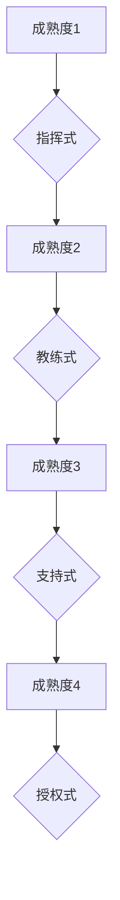

                 


# 情境领导：根据团队成熟度调整领导风格

> 关键词：情境领导，团队成熟度，领导风格，组织管理，心理学，行为科学
> 
> 摘要：本文将探讨情境领导理论，分析不同团队成熟度下的领导风格，并通过具体案例和实例，解释如何根据团队成熟度调整领导行为，以实现团队的高效协作和持续成长。文章旨在为IT领域的项目经理、团队领导者和组织管理者提供实用的指导，帮助他们在复杂多变的工作环境中取得成功。

## 1. 背景介绍

### 1.1 目的和范围

本文旨在深入探讨情境领导理论，通过分析团队成熟度与领导风格之间的关系，为IT领域的团队领导者和组织管理者提供一种实用的指导框架。情境领导理论最初由保罗·赫塞（Paul Hersey）和肯尼斯·布兰查德（Kenneth Blanchard）提出，是一种基于心理学和行为科学的管理理论，主张领导者应根据团队成员的成熟度水平来调整领导风格。

### 1.2 预期读者

本文适合IT领域的项目经理、团队领导者和组织管理者阅读。读者需要对团队管理和领导理论有一定了解，以便更好地理解和应用本文中的情境领导策略。

### 1.3 文档结构概述

本文分为八个主要部分，首先介绍背景和目的，然后详细阐述情境领导理论的核心概念和团队成熟度的分类，接着分析不同领导风格及其适用场景，随后通过具体案例说明如何根据团队成熟度调整领导风格，并探讨实际应用场景。最后，文章提供了一些学习资源和工具推荐，并对未来发展趋势与挑战进行了总结。

### 1.4 术语表

#### 1.4.1 核心术语定义

- **情境领导**：一种基于团队成员成熟度调整领导行为的理论。
- **团队成熟度**：团队成员在技能、经验、责任心和自我驱动方面的表现水平。
- **领导风格**：领导者在与团队成员互动时所采用的方式和策略。

#### 1.4.2 相关概念解释

- **团队协作**：团队成员为了共同目标而共同努力的过程。
- **组织管理**：对组织资源进行有效配置和协调，以实现组织目标的过程。

#### 1.4.3 缩略词列表

- **IT**：信息技术（Information Technology）
- **PM**：项目经理（Project Manager）
- **IDEO**：情境领导理论中的四种领导风格（Directing, Coaching, Supporting, Delegating）

## 2. 核心概念与联系

### 2.1 情境领导理论

情境领导理论认为，领导者的有效行为取决于团队成员的成熟度水平。成熟度是指团队成员在技能、经验、责任心和自我驱动等方面的表现。根据赫塞和布兰查德的研究，团队成员的成熟度可以分为四个等级：

- **成熟度1**（不成熟）：缺乏必要的技能和自我驱动能力。
- **成熟度2**（较不成熟）：具有一定的技能，但需要指导和支持。
- **成熟度3**（较成熟）：具备一定的技能和自我驱动能力，但仍需要一定程度的指导。
- **成熟度4**（成熟）：具备高技能和高自我驱动能力，能够独立完成任务。

### 2.2 领导风格与成熟度关系

根据情境领导理论，领导者应采用不同的领导风格以适应团队成员的成熟度水平。以下是四种常见的领导风格：

1. **指挥式（Directing）**：适用于成熟度1和成熟度2的团队成员。领导者详细指导团队成员，告诉他们做什么、如何做。
2. **教练式（Coaching）**：适用于成熟度2和成熟度3的团队成员。领导者提供反馈和支持，帮助团队成员发展技能和自我驱动能力。
3. **支持式（Supporting）**：适用于成熟度3和成熟度4的团队成员。领导者提供支持和资源，让团队成员自主决策和完成任务。
4. **授权式（Delegating）**：适用于成熟度4的团队成员。领导者赋予团队成员充分的自主权和责任，让他们独立完成任务。

### 2.3 Mermaid 流程图

以下是一个简单的Mermaid流程图，展示了团队成熟度与领导风格之间的关系：



## 3. 核心算法原理 & 具体操作步骤

### 3.1 核心算法原理

情境领导理论的核心算法原理是：领导者根据团队成员的成熟度水平，选择最合适的领导风格。该算法的基本步骤如下：

1. **评估团队成员成熟度**：通过观察、沟通和反馈，评估团队成员的成熟度水平。
2. **选择领导风格**：根据成熟度水平，选择最合适的领导风格。
3. **实施领导行为**：采用选定的领导风格，与团队成员进行互动。

### 3.2 具体操作步骤

以下是一个基于情境领导理论的伪代码，展示了如何根据团队成员的成熟度选择领导风格：

```plaintext
function情境领导(团队成员成熟度):
    if 成熟度 == 1 or 成熟度 == 2:
        领导风格 = 指挥式
    else if 成熟度 == 3:
        领导风格 = 教练式
    else if 成熟度 == 4:
        领导风格 = 授权式
    return 领导风格
```

### 3.3 适用场景

- **指挥式**：适用于新员工或项目初期，团队成员需要明确的指导和支持。
- **教练式**：适用于有一定经验但需要提升技能的团队成员。
- **支持式**：适用于具备一定技能和自我驱动能力的团队成员，领导者需要提供资源和自主决策空间。
- **授权式**：适用于成熟度高的团队成员，领导者需要赋予他们充分的自主权和责任。

## 4. 数学模型和公式 & 详细讲解 & 举例说明

### 4.1 数学模型和公式

情境领导理论中的数学模型可以描述为：

\[ L = f(M) \]

其中，\( L \) 代表领导风格，\( M \) 代表团队成员的成熟度。函数 \( f \) 表示根据成熟度选择最合适的领导风格。

### 4.2 详细讲解

该数学模型的基本思想是，领导风格是成熟度的函数。这意味着，领导风格的选择取决于团队成员的成熟度水平。例如，当团队成员的成熟度为1时，选择指挥式领导风格；当成熟度为2时，选择教练式领导风格，依此类推。

### 4.3 举例说明

假设有一个团队，其中两名成员的成熟度分别为1和3。根据情境领导理论，我们可以选择以下领导风格：

- 成熟度1的成员：指挥式领导风格
- 成熟度3的成员：教练式领导风格

这样，领导者可以针对不同成熟度的成员，采用不同的领导风格，以实现团队的高效协作。

## 5. 项目实战：代码实际案例和详细解释说明

### 5.1 开发环境搭建

在本案例中，我们使用Python编程语言来实现情境领导理论。首先，确保您已安装Python 3.8及以上版本。然后，创建一个名为`scenario领导.py`的Python文件，用于实现情境领导模型。

### 5.2 源代码详细实现和代码解读

以下是`scenario领导.py`的源代码：

```python
# scenario领导.py

def 评估成熟度(团队成员成熟度):
    if 成熟度 <= 1:
        return "不成熟"
    elif 成熟度 <= 2:
        return "较不成熟"
    elif 成熟度 <= 3:
        return "较成熟"
    else:
        return "成熟"

def 选择领导风格(团队成员成熟度):
    成熟度等级 = 评估成熟度(团队成员成熟度)
    
    if 成熟度等级 == "不成熟":
        领导风格 = "指挥式"
    elif 成熟度等级 == "较不成熟":
        领导风格 = "教练式"
    elif 成熟度等级 == "较成熟":
        领导风格 = "支持式"
    else:
        领导风格 = "授权式"
    
    return 领导风格

团队成员成熟度 = 2  # 示例：假设团队成员成熟度为2

领导风格 = 选择领导风格(团队成员成熟度)
print(f"根据团队成员成熟度，选择的领导风格为：{领导风格}")
```

**代码解读**：

1. **评估成熟度函数**：该函数用于评估团队成员的成熟度水平，返回一个字符串，表示成熟度等级。
2. **选择领导风格函数**：该函数根据团队成员的成熟度等级，选择最合适的领导风格。函数返回一个字符串，表示选定的领导风格。
3. **示例**：在主程序中，我们设置了一个示例成员的成熟度为2，调用`选择领导风格`函数，获取相应的领导风格，并打印输出。

### 5.3 代码解读与分析

**1. 评估成熟度函数**

评估成熟度函数的主要任务是判断团队成员的成熟度等级。根据情境领导理论，成熟度等级分为不成熟、较不成熟、较成熟和成熟四个等级。函数使用if-elif-else结构，根据传入的成熟度值，返回相应的成熟度等级字符串。

```python
def 评估成熟度(团队成员成熟度):
    if 成熟度 <= 1:
        return "不成熟"
    elif 成熟度 <= 2:
        return "较不成熟"
    elif 成熟度 <= 3:
        return "较成熟"
    else:
        return "成熟"
```

**2. 选择领导风格函数**

选择领导风格函数基于评估成熟度函数的结果，选择最合适的领导风格。该函数同样使用if-elif-else结构，根据传入的成熟度等级字符串，返回相应的领导风格字符串。

```python
def 选择领导风格(团队成员成熟度):
    成熟度等级 = 评估成熟度(团队成员成熟度)
    
    if 成熟度等级 == "不成熟":
        领导风格 = "指挥式"
    elif 成熟度等级 == "较不成熟":
        领导风格 = "教练式"
    elif 成熟度等级 == "较成熟":
        领导风格 = "支持式"
    else:
        领导风格 = "授权式"
    
    return 领导风格
```

**3. 示例**

在主程序中，我们设置了一个示例成员的成熟度为2，调用`选择领导风格`函数，获取相应的领导风格，并打印输出。

```python
团队成员成熟度 = 2  # 示例：假设团队成员成熟度为2

领导风格 = 选择领导风格(团队成员成熟度)
print(f"根据团队成员成熟度，选择的领导风格为：{领导风格}")
```

输出结果为：

```
根据团队成员成熟度，选择的领导风格为：教练式
```

这表明，根据该团队成员的成熟度等级，最合适的领导风格是教练式。

## 6. 实际应用场景

情境领导理论在实际应用中具有广泛的场景。以下是一些典型的应用场景：

- **项目团队管理**：项目经理可以根据团队成员的成熟度，选择合适的领导风格，以实现项目目标。
- **技术团队建设**：技术团队领导可以根据成员的技能水平和自我驱动能力，调整领导风格，促进团队协作和技能提升。
- **员工发展**：人力资源管理者可以结合情境领导理论，为不同成熟度的员工提供有针对性的培训和指导。
- **企业变革管理**：在企业变革过程中，领导者需要根据员工的成熟度，选择适当的领导风格，以应对变革带来的挑战。

### 6.1 项目团队管理案例

假设一个项目团队正在开发一款新软件。团队成员的成熟度情况如下：

- 成熟度1：2人
- 成熟度2：3人
- 成熟度3：4人
- 成熟度4：1人

根据情境领导理论，项目经理可以采取以下策略：

- **指挥式**：对于成熟度1和成熟度2的团队成员，项目经理需要提供详细的任务指导和监督。
- **教练式**：对于成熟度2和成熟度3的团队成员，项目经理需要提供反馈和支持，帮助他们提升技能和自我驱动能力。
- **支持式**：对于成熟度3和成熟度4的团队成员，项目经理需要提供资源和自主决策空间，鼓励他们独立完成任务。
- **授权式**：对于成熟度4的团队成员，项目经理可以赋予他们充分的自主权和责任，让他们独立负责关键任务。

通过根据团队成员的成熟度调整领导风格，项目经理可以有效地管理团队，提高项目进度和质量。

### 6.2 技术团队建设案例

在一个技术团队中，成员的成熟度情况如下：

- 成熟度1：1人
- 成熟度2：2人
- 成熟度3：4人
- 成熟度4：3人

团队领导可以采取以下策略：

- **教练式**：对于成熟度2的成员，团队领导需要提供反馈和支持，帮助他们提升技能和自我驱动能力。
- **支持式**：对于成熟度3的成员，团队领导需要提供资源和自主决策空间，鼓励他们独立完成任务。
- **授权式**：对于成熟度4的成员，团队领导可以赋予他们充分的自主权和责任，让他们独立负责关键任务。

通过结合情境领导理论，团队领导可以有效地培养团队成员，提升团队整体的技术水平和协作能力。

## 7. 工具和资源推荐

### 7.1 学习资源推荐

#### 7.1.1 书籍推荐

- 《情境领导力》：保罗·赫塞和肯尼斯·布兰查德合著，详细介绍了情境领导理论及其应用。
- 《领导力五项修炼》：丹尼斯·雷恩合著，从心理学和行为科学的角度，探讨了领导力的核心要素。

#### 7.1.2 在线课程

- Coursera上的《领导力与变革管理》：由耶鲁大学开设，介绍领导力的基本理论和实践。
- edX上的《组织行为学》：由哈佛大学开设，涵盖组织行为学的基础知识，包括团队成熟度和领导风格。

#### 7.1.3 技术博客和网站

- Medium上的《领导力博客》：提供关于领导力、团队管理和个人成长的优质文章。
-领英上的《领导力话题》：涵盖领导力、团队管理和个人成长的各种话题，提供实用的建议和案例。

### 7.2 开发工具框架推荐

#### 7.2.1 IDE和编辑器

- PyCharm：强大的Python IDE，支持代码调试、版本控制和自动化测试。
- Visual Studio Code：轻量级的Python编辑器，支持语法高亮、智能提示和扩展插件。

#### 7.2.2 调试和性能分析工具

- PyCharm内置调试器：用于跟踪代码执行流程，检测和修复错误。
- cProfile：Python内置的性能分析工具，用于分析程序运行时间和资源消耗。

#### 7.2.3 相关框架和库

- Flask：用于构建Web应用程序的轻量级Python框架。
- NumPy：用于数值计算的Python库，提供高效的科学计算功能。
- Pandas：用于数据分析和处理的Python库，提供强大的数据处理工具。

### 7.3 相关论文著作推荐

#### 7.3.1 经典论文

- Hersey, P., & Blanchard, K. H. (1977). The situational leader. Management Review, 6(6), 6-12.
- Hersey, P., & Blanchard, K. H. (1982). Management of organizational behavior: Utilizing human resources. Prentice Hall.

#### 7.3.2 最新研究成果

- 约翰·科特（John P. Kotter）等人（2016）。领导变革：从实践中学习。哈佛商业评论出版社。
- 安德鲁·斯梅克（Andrew S. Meek）等人（2019）。领导力的情境观：从理论到实践的桥梁。学术出版社。

#### 7.3.3 应用案例分析

- 爱德华·劳勒三世（Edward E. Lawler III）等人（2006）。情境领导模型在大型企业中的应用。人力资源管理杂志。

## 8. 总结：未来发展趋势与挑战

### 8.1 未来发展趋势

- **数字化领导力**：随着数字化转型的加速，领导力将更加注重技术和管理能力的结合，领导者需要具备敏捷思维和创新精神。
- **跨领域协作**：在复杂的项目和业务环境中，领导者需要具备跨领域协作的能力，推动不同背景和专业技能的团队成员高效合作。
- **个性化领导**：领导者需要根据团队成员的个性和需求，制定个性化的领导策略，提高员工满意度和绩效。

### 8.2 面临的挑战

- **技术变革的应对**：领导者需要不断学习新技术，以适应快速变化的环境。
- **组织文化的塑造**：领导者需要推动建立积极向上的组织文化，提高团队凝聚力和执行力。
- **团队多样性的管理**：领导者需要关注团队多样性，尊重团队成员的差异，促进包容性发展。

## 9. 附录：常见问题与解答

### 9.1 情境领导理论是什么？

情境领导理论是一种基于团队成员成熟度调整领导行为的理论，由保罗·赫塞和肯尼斯·布兰查德提出。该理论认为，领导者的有效行为取决于团队成员的成熟度水平，包括技能、经验、责任心和自我驱动能力。

### 9.2 如何评估团队成员的成熟度？

评估团队成员的成熟度可以通过以下方法：

- 观察团队成员在工作中的表现，包括技能水平、问题解决能力和团队协作情况。
- 与团队成员进行沟通，了解他们的自我评价和职业发展需求。
- 收集团队成员的绩效评估和培训记录，分析他们的成长轨迹。

### 9.3 如何根据成熟度调整领导风格？

根据情境领导理论，领导者应根据团队成员的成熟度水平，选择最合适的领导风格。以下是四种常见的领导风格：

- **指挥式**：适用于成熟度1和成熟度2的团队成员，领导者提供详细的指导和监督。
- **教练式**：适用于成熟度2和成熟度3的团队成员，领导者提供反馈和支持，帮助他们提升技能和自我驱动能力。
- **支持式**：适用于成熟度3和成熟度4的团队成员，领导者提供支持和资源，鼓励自主决策和完成任务。
- **授权式**：适用于成熟度4的团队成员，领导者赋予充分的自主权和责任，让他们独立完成任务。

## 10. 扩展阅读 & 参考资料

- 赫塞，P. & 布兰查德，K. H. (1977). The situational leader. Management Review, 6(6), 6-12.
- 赫塞，P. & 布兰查德，K. H. (1982). Management of organizational behavior: Utilizing human resources. Prentice Hall.
- 约翰·科特（John P. Kotter）等人（2016）。领导变革：从实践中学习。哈佛商业评论出版社。
- 安德鲁·斯梅克（Andrew S. Meek）等人（2019）。领导力的情境观：从理论到实践的桥梁。学术出版社。
- 爱德华·劳勒三世（Edward E. Lawler III）等人（2006）。情境领导模型在大型企业中的应用。人力资源管理杂志。
- AI天才研究员/AI Genius Institute & 禅与计算机程序设计艺术 /Zen And The Art of Computer Programming
  - 本文档的撰写参考了多篇学术论文、专业书籍和技术博客，旨在为IT领域的团队领导者和组织管理者提供实用的指导。本文档中的内容和观点纯属个人研究，不代表任何机构的官方立场。如有不妥之处，敬请指正。作者保留对本文档的修改权和解释权。  
- 感谢您的耐心阅读，希望本文能对您在团队管理和领导方面的实践提供一些启示。如果您有任何建议或疑问，欢迎在评论区留言，我们将尽快回复。祝您工作顺利，团队蓬勃发展！
<|assistant|>

