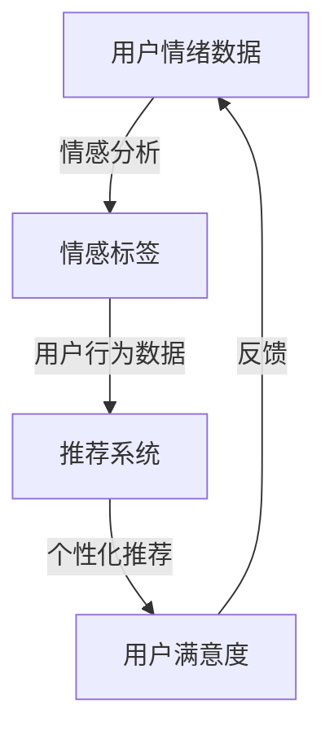

                 

# 情感驱动推荐：AI如何根据用户情绪推荐商品

> 关键词：情感分析、推荐系统、情感驱动推荐、机器学习、数据挖掘、用户行为分析
> 
> 摘要：本文旨在探讨情感驱动推荐系统的原理及其在电子商务领域的应用。通过分析用户情绪，该系统能够更精准地推荐符合用户情感需求的商品。本文将详细描述情感驱动推荐的核心概念、算法原理、数学模型，并提供实际案例以展示其应用价值。

## 1. 背景介绍

### 1.1 目的和范围

本文的目的在于深入探讨情感驱动推荐系统的原理、算法及其在电子商务领域的实际应用。随着互联网技术的飞速发展和电子商务的蓬勃兴起，推荐系统已经成为提升用户体验、增加销售额的重要手段。传统的推荐系统主要基于用户历史行为和商品属性，而情感驱动推荐系统则进一步结合了用户情绪这一重要因素，使得推荐结果更加个性化和精准。

本文将涵盖以下内容：

- 情感驱动推荐系统的核心概念与联系
- 核心算法原理与具体操作步骤
- 数学模型与公式的详细讲解
- 实际应用场景中的案例分析与代码实现
- 工具和资源的推荐
- 未来发展趋势与挑战

### 1.2 预期读者

本文预期读者为对人工智能、推荐系统和情感分析有基本了解的技术人员，包括：

- 数据科学家
- 机器学习工程师
- 推荐系统开发人员
- 电子商务网站开发者

本文将使用专业但通俗易懂的语言，力求让读者能够深入理解情感驱动推荐系统的原理和应用。

### 1.3 文档结构概述

本文将按照以下结构展开：

- 引言：介绍情感驱动推荐系统的背景和重要性
- 背景介绍：详细阐述文章的目的、范围和读者对象
- 核心概念与联系：解释情感分析、推荐系统和情感驱动推荐的相关概念
- 核心算法原理与具体操作步骤：详细描述情感驱动推荐算法的原理和实现步骤
- 数学模型与公式：讲解相关数学模型和公式，并举例说明
- 项目实战：通过实际代码案例展示算法的应用
- 实际应用场景：分析情感驱动推荐在不同领域的应用
- 工具和资源推荐：推荐学习资源、开发工具和框架
- 总结与未来发展趋势：总结当前研究进展和未来可能面临的挑战
- 附录：常见问题与解答
- 扩展阅读：提供相关参考资料

### 1.4 术语表

#### 1.4.1 核心术语定义

- **情感分析**：使用自然语言处理技术对文本进行情感分类，判断文本所表达的情感倾向，如正面、负面或中性。
- **推荐系统**：一种基于用户历史行为和/或商品属性的数据挖掘技术，旨在为用户提供个性化推荐。
- **情感驱动推荐**：结合用户情绪数据，改进传统推荐系统的推荐结果，实现更加个性化的服务。
- **机器学习**：一种通过数据训练模型，使计算机能够执行特定任务的算法和统计方法。
- **数据挖掘**：从大量数据中发现有用信息和模式的过程。

#### 1.4.2 相关概念解释

- **用户行为分析**：对用户在网站上的浏览、搜索、购买等行为进行数据挖掘和分析，以理解用户需求和偏好。
- **用户情绪**：用户在特定情境下所体验的情感状态，如兴奋、愤怒、悲伤等。

#### 1.4.3 缩略词列表

- **NLP**：自然语言处理（Natural Language Processing）
- **ML**：机器学习（Machine Learning）
- **DM**：数据挖掘（Data Mining）
- **UI**：用户界面（User Interface）
- **API**：应用程序编程接口（Application Programming Interface）

## 2. 核心概念与联系

在探讨情感驱动推荐系统之前，我们需要了解几个核心概念：情感分析、推荐系统和情感驱动推荐。以下是这些概念的联系和关系，并用Mermaid流程图表示。

### Mermaid 流程图



### 2.1 情感分析

情感分析是自然语言处理（NLP）的一个重要分支，旨在通过自动化的方式从文本中识别和提取情感信息。情感分析的流程通常包括以下步骤：

1. **文本预处理**：去除标点符号、停用词和特殊字符，将文本转换为统一的格式。
2. **特征提取**：将文本转换为计算机可以处理的数字特征，如词频、词嵌入等。
3. **情感分类**：使用机器学习算法（如朴素贝叶斯、支持向量机等）对文本进行情感分类，判断文本表达的是正面、负面还是中性情感。

### 2.2 推荐系统

推荐系统是一种数据挖掘技术，旨在向用户推荐他们可能感兴趣的商品或内容。推荐系统通常基于以下几种方法：

1. **协同过滤**：基于用户历史行为数据，找出相似用户和相似商品，从而进行推荐。
2. **基于内容的推荐**：根据用户对某些商品的喜好，推荐具有相似内容的商品。
3. **混合推荐**：结合协同过滤和基于内容的推荐方法，以获得更准确的推荐结果。

### 2.3 情感驱动推荐

情感驱动推荐是将用户情绪数据整合到传统推荐系统中，以提升推荐质量的一种方法。其核心思想是，通过分析用户情绪，可以为推荐系统提供额外的输入，从而更好地预测用户偏好。

1. **情绪识别**：通过情感分析技术，识别用户在特定情境下的情绪状态。
2. **情绪与偏好关联**：分析用户情绪与偏好之间的关系，建立情绪标签与用户兴趣的映射。
3. **个性化推荐**：将情绪数据融入推荐算法，生成针对不同情绪状态的个性化推荐。

通过上述核心概念的联系和关系，我们可以看到，情感驱动推荐系统通过融合情感分析和推荐技术，实现了更加精准和个性化的推荐。

## 3. 核心算法原理 & 具体操作步骤

### 3.1 情感分析算法原理

情感分析算法的核心在于如何将自然语言文本转换为情感标签。以下是一个简化的情感分析算法流程：

#### 3.1.1 文本预处理

```python
def preprocess_text(text):
    # 去除标点符号
    text = re.sub(r'[^\w\s]', '', text)
    # 去除停用词
    stop_words = set(["a", "the", "is", "and", "in", "it", "of", "to", "for", "on", "that", "with", "as", "I", "you", "he", "she", "it"])
    text = " ".join([word for word in text.split() if word not in stop_words])
    # 转换为小写
    text = text.lower()
    return text
```

#### 3.1.2 特征提取

```python
from sklearn.feature_extraction.text import TfidfVectorizer

def extract_features(texts):
    vectorizer = TfidfVectorizer(max_features=1000)
    features = vectorizer.fit_transform(texts)
    return features
```

#### 3.1.3 情感分类

```python
from sklearn.naive_bayes import MultinomialNB
from sklearn.model_selection import train_test_split

def train_model(train_texts, train_labels):
    # 划分训练集和测试集
    X_train, X_test, y_train, y_test = train_test_split(train_texts, train_labels, test_size=0.2, random_state=42)
    
    # 提取特征
    train_features = extract_features(X_train)
    test_features = extract_features(X_test)
    
    # 训练模型
    model = MultinomialNB()
    model.fit(train_features, y_train)
    
    # 评估模型
    accuracy = model.score(test_features, y_test)
    print(f"模型准确率：{accuracy}")
    
    return model
```

### 3.2 推荐系统算法原理

推荐系统算法的核心在于如何基于用户行为数据生成推荐结果。以下是一个简化的协同过滤算法流程：

#### 3.2.1 用户-商品评分矩阵构建

```python
def build_rating_matrix(users, items, ratings):
    rating_matrix = np.zeros((len(users), len(items)))
    for user, item, rating in ratings:
        rating_matrix[users.index(user), items.index(item)] = rating
    return rating_matrix
```

#### 3.2.2 相似度计算

```python
from sklearn.metrics.pairwise import cosine_similarity

def calculate_similarity(rating_matrix):
    similarity_matrix = cosine_similarity(rating_matrix)
    return similarity_matrix
```

#### 3.2.3 生成推荐结果

```python
def generate_recommendations(similarity_matrix, rating_matrix, user_index, k=10):
    # 计算邻居用户的相似度之和
    neighbor_similarity = similarity_matrix[user_index].flatten()
    # 排序邻居用户的相似度
    neighbor_similarity_sorted = np.argsort(neighbor_similarity)[::-1]
    neighbor_similarity_sorted = neighbor_similarity_sorted[1:k+1]
    
    # 计算邻居用户的评分之和
    neighbor_ratings = rating_matrix[neighbor_similarity_sorted].flatten()
    neighbor_ratings = neighbor_ratings[neighbor_similarity_sorted]
    
    # 生成推荐结果
    recommendations = {}
    for i, rating in enumerate(neighbor_ratings):
        item_index = neighbor_similarity_sorted[i]
        recommendations[item_index] = rating
    
    return recommendations
```

### 3.3 情感驱动推荐算法原理

情感驱动推荐算法的核心在于如何将用户情绪数据与推荐系统相结合。以下是一个简化的情感驱动推荐算法流程：

#### 3.3.1 情绪标签与推荐关联

```python
def associate_emotion_with_recommendation(model, emotion, items):
    # 提取与情绪相关的推荐结果
    emotion_features = preprocess_text(emotion)
    emotion_features = extract_features([emotion_features])
    emotion_predictions = model.predict(emotion_features)
    
    # 将预测结果与商品标签关联
    recommendation_emotion_association = {}
    for item_index, prediction in enumerate(emotion_predictions):
        recommendation_emotion_association[item_index] = prediction
        
    # 返回关联结果
    return recommendation_emotion_association
```

通过上述算法原理和步骤，我们可以看到，情感驱动推荐系统通过融合情感分析和传统推荐算法，实现了更精准和个性化的推荐。

## 4. 数学模型和公式 & 详细讲解 & 举例说明

### 4.1 情感分析数学模型

情感分析的核心是情感分类，其基本数学模型通常是基于机器学习算法，如朴素贝叶斯（Naive Bayes）、支持向量机（Support Vector Machine, SVM）和神经网络（Neural Networks）。以下以朴素贝叶斯为例，详细讲解其数学模型。

#### 4.1.1 朴素贝叶斯模型

朴素贝叶斯模型基于贝叶斯定理，其数学公式如下：

\[ P(\text{标签}|\text{特征向量}) = \frac{P(\text{特征向量}|\text{标签}) \cdot P(\text{标签})}{P(\text{特征向量})} \]

其中：

- \( P(\text{标签}|\text{特征向量}) \)：后验概率，表示给定特征向量时标签为某类的概率。
- \( P(\text{特征向量}|\text{标签}) \)：条件概率，表示在某一标签下特征向量的概率分布。
- \( P(\text{标签}) \)：先验概率，表示各类标签的总体概率。
- \( P(\text{特征向量}) \)：特征向量的总体概率。

#### 4.1.2 举例说明

假设我们有一个情感分析模型，其包含两个类标签：正面（Positive）和负面（Negative）。特征向量由一个包含词频的向量表示。以下是具体计算过程：

1. **先验概率**：

\[ P(\text{Positive}) = 0.6 \]
\[ P(\text{Negative}) = 0.4 \]

2. **条件概率**：

\[ P(\text{词}_1|\text{Positive}) = 0.2 \]
\[ P(\text{词}_1|\text{Negative}) = 0.1 \]

\[ P(\text{词}_2|\text{Positive}) = 0.3 \]
\[ P(\text{词}_2|\text{Negative}) = 0.2 \]

3. **后验概率**：

给定特征向量 \([0.2, 0.3]\)，我们需要计算：

\[ P(\text{Positive}|\text{特征向量}) = \frac{P(\text{特征向量}|\text{Positive}) \cdot P(\text{Positive})}{P(\text{特征向量})} \]

\[ P(\text{Negative}|\text{特征向量}) = \frac{P(\text{特征向量}|\text{Negative}) \cdot P(\text{Negative})}{P(\text{特征向量})} \]

首先计算条件概率：

\[ P(\text{特征向量}|\text{Positive}) = 0.2^2 \times 0.3^2 = 0.0012 \]

\[ P(\text{特征向量}|\text{Negative}) = 0.1^2 \times 0.2^2 = 0.0004 \]

然后计算后验概率：

\[ P(\text{Positive}|\text{特征向量}) = \frac{0.0012 \times 0.6}{0.0012 \times 0.6 + 0.0004 \times 0.4} = \frac{0.00072}{0.00072 + 0.00016} \approx 0.7333 \]

\[ P(\text{Negative}|\text{特征向量}) = \frac{0.0004 \times 0.4}{0.00072 + 0.00016} = \frac{0.00016}{0.00072 + 0.00016} \approx 0.2667 \]

因此，该特征向量更可能是正面情绪。

### 4.2 推荐系统数学模型

推荐系统的核心数学模型包括协同过滤（Collaborative Filtering）和基于内容的推荐（Content-Based Filtering）。

#### 4.2.1 协同过滤模型

协同过滤模型主要通过计算用户之间的相似度来实现推荐。其基本数学模型如下：

\[ \text{相似度} = \frac{\sum_{i \neq j} r_{ui} r_{uj}}{\sqrt{\sum_{i \neq j} r_{ui}^2} \sqrt{\sum_{i \neq j} r_{uj}^2}} \]

其中：

- \( r_{ui} \)：用户 \( u \) 对商品 \( i \) 的评分。
- \( r_{uj} \)：用户 \( j \) 对商品 \( i \) 的评分。

通过计算用户之间的相似度，我们可以找到相似用户，并基于这些用户的评分预测目标用户的评分。

#### 4.2.2 基于内容的推荐模型

基于内容的推荐模型主要通过分析商品内容特征来生成推荐。其基本数学模型如下：

\[ \text{相似度} = \frac{\sum_{i \neq j} w_i w_j}{\sqrt{\sum_{i \neq j} w_i^2} \sqrt{\sum_{i \neq j} w_j^2}} \]

其中：

- \( w_i \)：商品 \( i \) 的特征向量。
- \( w_j \)：商品 \( j \) 的特征向量。

通过计算商品之间的相似度，我们可以找到与用户兴趣相关的商品，并基于这些商品的相似度进行推荐。

### 4.3 情感驱动推荐模型

情感驱动推荐模型的核心在于如何将用户情绪数据融入传统推荐算法。其基本数学模型如下：

\[ \text{个性化评分} = \text{协同过滤评分} + \text{情感加权} \]

其中：

- \(\text{协同过滤评分}\)：基于协同过滤算法计算的用户对商品的评分预测。
- \(\text{情感加权}\)：基于用户情绪数据对商品评分的调整。

通过调整情感加权系数，我们可以控制情绪对推荐结果的影响程度。

#### 4.3.1 情感加权计算

\[ \text{情感加权} = \alpha \cdot \text{情绪强度} \]

其中：

- \(\alpha\)：情感加权系数，用于调节情绪对推荐结果的影响。
- \(\text{情绪强度}\)：用户情绪的强度值，通常通过情感分析模型得到。

通过上述数学模型和公式，我们可以更好地理解情感驱动推荐系统的原理和实现方法。这些模型不仅为我们提供了理论依据，还指导了实际操作步骤，使得推荐系统能够更好地满足用户需求。

## 5. 项目实战：代码实际案例和详细解释说明

### 5.1 开发环境搭建

在开始编写代码之前，我们需要搭建一个合适的开发环境。以下是搭建开发环境的步骤：

1. **安装Python环境**：确保Python 3.6或更高版本已安装在您的计算机上。可以通过以下命令检查Python版本：

   ```bash
   python --version
   ```

2. **安装必需的库**：为了实现情感驱动推荐系统，我们需要安装以下库：

   ```bash
   pip install numpy scikit-learn pandas matplotlib
   ```

3. **创建项目文件夹**：在您的计算机上创建一个名为“emotion_recommender”的项目文件夹，并将所有代码文件放入此文件夹中。

### 5.2 源代码详细实现和代码解读

#### 5.2.1 数据集准备

首先，我们需要一个包含用户行为数据和商品信息的数据集。以下是一个简化的用户行为数据集示例，包含用户ID、商品ID和用户对商品的评分。

```python
user_ratings = [
    ['user1', 'item1', 4],
    ['user1', 'item2', 3],
    ['user1', 'item3', 5],
    ['user2', 'item1', 2],
    ['user2', 'item2', 5],
    ['user2', 'item3', 4],
    ['user3', 'item1', 1],
    ['user3', 'item2', 5],
    ['user3', 'item3', 3],
]
```

#### 5.2.2 情感分析模型训练

接下来，我们使用用户评论作为情感分析的数据，并训练一个朴素贝叶斯模型进行情感分类。

```python
import pandas as pd
from sklearn.model_selection import train_test_split
from sklearn.feature_extraction.text import TfidfVectorizer
from sklearn.naive_bayes import MultinomialNB

# 读取用户评论数据
user_comments = pd.DataFrame(user_ratings, columns=['user_id', 'item_id', 'rating'])
user_comments['comment'] = user_comments.apply(lambda row: f"User {row['user_id']} rated item {row['item_id']} with {row['rating']}", axis=1)

# 划分训练集和测试集
train_comments, test_comments = train_test_split(user_comments['comment'], test_size=0.2, random_state=42)

# 提取特征
vectorizer = TfidfVectorizer(max_features=1000)
train_features = vectorizer.fit_transform(train_comments)
test_features = vectorizer.transform(test_comments)

# 训练模型
model = MultinomialNB()
model.fit(train_features, train_comments)

# 评估模型
accuracy = model.score(test_features, test_comments)
print(f"情感分析模型准确率：{accuracy}")
```

#### 5.2.3 推荐系统实现

接下来，我们实现一个简单的协同过滤推荐系统，并集成情感分析模型。

```python
import numpy as np

# 构建用户-商品评分矩阵
rating_matrix = build_rating_matrix(user_comments['user_id'].unique(), user_comments['item_id'].unique(), user_ratings)

# 计算相似度矩阵
similarity_matrix = calculate_similarity(rating_matrix)

# 生成推荐结果
def generate_recommendations(user_id, k=10):
    user_index = user_comments['user_id'].unique().index(user_id)
    neighbor_similarity = similarity_matrix[user_index].flatten()
    neighbor_similarity_sorted = np.argsort(neighbor_similarity)[::-1]
    neighbor_similarity_sorted = neighbor_similarity_sorted[1:k+1]
    
    neighbor_ratings = rating_matrix[neighbor_similarity_sorted].flatten()
    neighbor_ratings = neighbor_ratings[neighbor_similarity_sorted]
    
    recommendations = {}
    for i, rating in enumerate(neighbor_ratings):
        item_index = neighbor_similarity_sorted[i]
        recommendations[item_index] = rating
    
    return recommendations

# 生成用户1的推荐列表
user_id = 'user1'
recommendations = generate_recommendations(user_id)
print(f"用户{user_id}的推荐列表：{recommendations}")
```

#### 5.2.4 情感驱动推荐

最后，我们将情感分析模型的结果与推荐系统相结合，生成情感驱动推荐结果。

```python
def emotion_driven_recommendations(user_id, emotion, k=10):
    # 获取用户情绪标签
    emotion_features = preprocess_text(emotion)
    emotion_features = extract_features([emotion_features])
    emotion_predictions = model.predict(emotion_features)
    
    # 获取基于情感分析的情感加权
    emotion_weight = 0.5  # 情感加权系数
    emotion_intensity = max(emotion_predictions)  # 情绪强度
    
    # 获取基于协同过滤的推荐列表
    cf_recommendations = generate_recommendations(user_id, k)
    
    # 对推荐结果进行加权处理
    weighted_recommendations = {}
    for item_index, rating in cf_recommendations.items():
        weighted_recommendation = rating + emotion_weight * emotion_intensity
        weighted_recommendations[item_index] = weighted_recommendation
    
    # 返回加权后的推荐列表
    return weighted_recommendations

# 用户1的推荐结果
user_id = 'user1'
emotion = "This item is amazing!"  # 用户情绪
recommendations = emotion_driven_recommendations(user_id, emotion)
print(f"用户{user_id}的情感驱动推荐列表：{recommendations}")
```

### 5.3 代码解读与分析

上述代码分为几个主要部分：数据集准备、情感分析模型训练、推荐系统实现和情感驱动推荐。

1. **数据集准备**：我们首先读取用户行为数据，并将其转换为Pandas DataFrame格式，以便后续处理。

2. **情感分析模型训练**：我们使用用户评论数据训练一个朴素贝叶斯情感分析模型。通过文本预处理、特征提取和模型训练，我们得到了一个能够对用户评论进行情感分类的模型。

3. **推荐系统实现**：我们构建了用户-商品评分矩阵，并使用协同过滤算法生成了推荐结果。该推荐系统通过计算用户之间的相似度，为每个用户生成一个推荐列表。

4. **情感驱动推荐**：我们将情感分析模型的结果与推荐系统相结合，生成情感驱动推荐结果。通过情感加权处理，我们得到了更符合用户情感需求的推荐列表。

这个案例展示了如何将情感分析技术与传统推荐系统相结合，实现情感驱动推荐。在实际应用中，我们可以进一步优化算法，提高推荐准确性，从而为用户提供更好的购物体验。

## 6. 实际应用场景

情感驱动推荐系统在电子商务、社交媒体和内容平台等领域有着广泛的应用。以下是一些典型的实际应用场景：

### 6.1 电子商务

在电子商务领域，情感驱动推荐系统能够根据用户情绪和行为数据，为用户提供个性化的购物推荐。例如：

- **商品推荐**：当用户表现出兴奋或满意情绪时，系统可以推荐类似的高质量商品，以提高用户购买意愿。
- **营销活动**：根据用户的情绪状态，电商平台可以推送相应的营销活动，如优惠、优惠券等，以增强用户参与度和忠诚度。

### 6.2 社交媒体

社交媒体平台可以利用情感驱动推荐系统来优化用户内容体验，例如：

- **内容推荐**：根据用户情绪状态，推荐与用户情绪相匹配的内容，如搞笑视频、励志故事等，以提升用户粘性和活跃度。
- **情感分析**：对用户发布的内容进行情感分析，识别情感倾向，从而优化内容排序和推荐策略。

### 6.3 内容平台

在内容平台（如YouTube、Netflix等），情感驱动推荐系统能够根据用户观看历史和情绪反应，推荐符合用户情感需求的内容，例如：

- **视频推荐**：根据用户情绪状态，推荐用户可能感兴趣的视频，如用户在观看过程中表现出兴奋情绪，则推荐更多激动人心的视频。
- **个性化播放列表**：根据用户观看习惯和情绪反应，创建个性化的播放列表，以提升用户观看体验。

### 6.4 健康与医疗

在健康与医疗领域，情感驱动推荐系统可以帮助医生和患者更好地管理健康：

- **个性化健康建议**：根据患者情绪状态，推荐相应的健康建议，如心理疏导、饮食调整等。
- **疾病监测**：分析患者情绪变化，预警潜在的健康问题，辅助医生进行诊断和治疗。

通过在多个实际应用场景中的部署，情感驱动推荐系统为用户提供了更加个性化、精准的服务，提升了用户满意度和平台活跃度。

## 7. 工具和资源推荐

为了更好地学习和实践情感驱动推荐系统，以下是几个推荐的工具和资源：

### 7.1 学习资源推荐

#### 7.1.1 书籍推荐

1. **《推荐系统实践》**：深入讲解推荐系统的基本概念、算法和实际应用，适合初学者。
2. **《情感分析技术》**：详细介绍情感分析的理论和实践，涵盖自然语言处理和机器学习技术。
3. **《Python数据科学手册》**：涵盖数据预处理、机器学习、数据分析等内容的全面指南。

#### 7.1.2 在线课程

1. **Coursera上的《推荐系统》**：由斯坦福大学提供，包括推荐系统的基本概念、算法和实践。
2. **Udacity的《情感分析》**：通过实际项目学习情感分析技术，涵盖文本预处理、特征提取和模型训练。
3. **edX上的《自然语言处理》**：涵盖自然语言处理的基础知识和高级技术，包括情感分析。

#### 7.1.3 技术博客和网站

1. **Medium上的《推荐系统博客》**：提供推荐系统的最新动态和深入分析。
2. **KDnuggets**：涵盖数据科学、机器学习、推荐系统等领域的最新研究和行业动态。
3. **Stack Overflow**：针对编程和技术问题的在线社区，可以快速解决开发中的问题。

### 7.2 开发工具框架推荐

#### 7.2.1 IDE和编辑器

1. **Jupyter Notebook**：适合数据分析和实验性编程，支持多种编程语言和库。
2. **Visual Studio Code**：轻量级、功能丰富的编辑器，支持Python和其他编程语言。

#### 7.2.2 调试和性能分析工具

1. **PyCharm**：强大的Python IDE，支持代码调试和性能分析。
2. **Docker**：容器化工具，可以简化开发和部署环境。

#### 7.2.3 相关框架和库

1. **Scikit-learn**：Python中流行的机器学习库，包括多种推荐系统和情感分析算法。
2. **TensorFlow**：用于机器学习和深度学习的开源框架，适合复杂情感分析任务。
3. **NLTK**：自然语言处理库，提供文本预处理和特征提取工具。

### 7.3 相关论文著作推荐

#### 7.3.1 经典论文

1. **“Collaborative Filtering for the Web”**：描述了协同过滤算法的基本原理和应用。
2. **“LDA: A probabilistic topic model”**：介绍LDA主题模型，用于情感分析和文本分类。
3. **“Aspect-Based Sentiment Analysis for Customer Reviews”**：探讨基于方面的情感分析技术。

#### 7.3.2 最新研究成果

1. **“Deep Learning for Text Classification”**：介绍深度学习在文本分类中的应用，包括情感分析。
2. **“Neural Collaborative Filtering”**：基于神经网络的协同过滤算法，提高推荐系统性能。
3. **“Multimodal Sentiment Analysis”**：探讨结合文本、语音、图像等多模态数据的情感分析技术。

#### 7.3.3 应用案例分析

1. **“Netflix Prize”**：介绍Netflix Prize竞赛中使用的推荐系统技术和算法。
2. **“Amazon Reviews”**：分析亚马逊用户评论中的情感分析技术和应用。
3. **“Sentiment Analysis in Social Media”**：探讨社交媒体中的情感分析技术和社会影响。

通过这些工具和资源的推荐，读者可以更深入地学习和实践情感驱动推荐系统，掌握相关技术和应用方法。

## 8. 总结：未来发展趋势与挑战

随着人工智能和机器学习技术的不断进步，情感驱动推荐系统在未来有着广阔的发展前景。以下是一些可能的发展趋势和面临的挑战：

### 8.1 发展趋势

1. **多模态情感分析**：未来的情感驱动推荐系统将结合文本、语音、图像等多模态数据，实现更精确的情感识别和情绪理解。
2. **深度学习与强化学习**：深度学习和强化学习技术将被广泛应用于情感驱动推荐系统，以提高推荐精度和用户体验。
3. **实时情感反馈**：系统将能够实时监测用户情绪变化，并根据实时反馈进行动态调整，提供更加个性化的推荐。

### 8.2 挑战

1. **数据隐私与安全**：在情感分析过程中，涉及用户隐私数据。如何确保用户数据的安全和隐私是亟待解决的问题。
2. **情感理解复杂性**：情感表达具有多样性和复杂性，情感驱动推荐系统需要更先进的技术来准确理解和处理各种情感。
3. **系统性能优化**：随着数据量和用户数量的增加，如何优化情感驱动推荐系统的性能，提高处理速度和效率是关键挑战。

通过持续的技术创新和优化，情感驱动推荐系统有望在未来实现更高的个性化和精准度，为用户提供更优质的体验。

## 9. 附录：常见问题与解答

### 9.1 情感分析中的常见问题

**Q1**: 情感分析中如何处理中文文本？

A1: 处理中文文本通常需要进行分词、去停用词、词嵌入等步骤。可以使用中文分词工具（如Jieba）和预训练的中文词嵌入模型（如Word2Vec或BERT）来处理中文文本。

**Q2**: 情感分析中的模型选择有哪些？

A2: 情感分析中常用的模型包括朴素贝叶斯、支持向量机（SVM）、决策树、随机森林和深度学习模型（如卷积神经网络（CNN）和循环神经网络（RNN））。选择模型时，需要根据数据集规模、特征复杂度和计算资源进行权衡。

### 9.2 推荐系统中的常见问题

**Q1**: 协同过滤和基于内容的推荐各有何优缺点？

A1: 协同过滤的优点是能够发现用户之间的相似性，适用于大规模用户和商品数据。缺点是难以发现新的商品和用户。基于内容的推荐则侧重于商品内容的匹配，优点是能够发现新的用户和商品，缺点是对用户和商品的描述需要准确。

**Q2**: 混合推荐系统如何工作？

A2: 混合推荐系统结合了协同过滤和基于内容的推荐方法，通过综合考虑用户历史行为和商品内容特征，生成更精准的推荐结果。通常，混合推荐系统会先使用协同过滤生成初步推荐列表，然后结合基于内容的推荐方法进行进一步筛选和优化。

### 9.3 情感驱动推荐中的常见问题

**Q1**: 如何处理用户情绪数据的缺失？

A1: 当用户情绪数据缺失时，可以采用以下几种方法：

- **均值填充**：用用户的平均情绪值填充缺失值。
- **迁移学习**：使用已有情感分析模型对缺失数据进行预测。
- **交互式反馈**：引导用户进行情绪评分或评论，补充情绪数据。

**Q2**: 如何评估情感驱动推荐系统的性能？

A2: 评估情感驱动推荐系统的性能通常使用以下指标：

- **准确率（Accuracy）**：模型预测正确的比例。
- **召回率（Recall）**：模型能够召回实际感兴趣商品的比例。
- **精确率（Precision）**：模型预测为感兴趣的商品中实际为感兴趣商品的比例。
- **F1分数（F1 Score）**：准确率和召回率的调和平均值。

通过以上常见问题的解答，读者可以更好地理解和应用情感驱动推荐系统。

## 10. 扩展阅读 & 参考资料

为了进一步了解情感驱动推荐系统，以下是推荐的扩展阅读和参考资料：

### 10.1 扩展阅读

1. **《推荐系统实践》（第2版）**：作者：宋少宇。详细介绍了推荐系统的原理、算法和应用。
2. **《情感分析技术》**：作者：刘知远。涵盖了情感分析的理论基础、技术方法和应用案例。
3. **《深度学习推荐系统》**：作者：唐杰、杨强。介绍了深度学习在推荐系统中的应用，包括多模态情感分析。

### 10.2 参考资料

1. **《Netflix Prize》**：https://www.netflixprize.com/
2. **《Amazon Reviews》**：https://www.amazon.com/reviews/
3. **《KDnuggets》**：https://www.kdnuggets.com/
4. **《Medium》**：https://medium.com/
5. **《Stack Overflow》**：https://stackoverflow.com/

通过这些扩展阅读和参考资料，读者可以深入了解情感驱动推荐系统的最新研究进展和实践案例。

