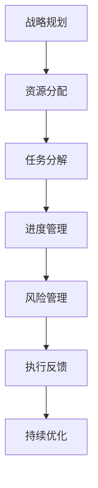

                 

# 战略执行力：从计划到实施的领导技巧

## 关键词
战略管理、执行力、领导力、计划与实施、项目成功

## 摘要
本文旨在深入探讨战略执行力在IT领域中的应用，分析从计划到实施的领导技巧。通过对战略执行的核心概念、关键算法原理、数学模型以及实际案例的详细解析，帮助读者理解和掌握如何通过有效的领导和管理手段，将战略计划转化为实际成果。

## 1. 背景介绍

### 1.1 目的和范围
本文将聚焦于IT行业中的战略执行力，探讨如何通过领导技巧将战略计划转化为具体实施步骤，以实现项目目标和组织愿景。我们将从理论到实践，详细分析战略执行的关键要素。

### 1.2 预期读者
本文适合IT项目经理、团队领导、CTO及对战略执行力有兴趣的专业人士阅读。通过本文，读者可以深入了解战略执行的内在逻辑和操作步骤。

### 1.3 文档结构概述
本文分为十个部分，包括背景介绍、核心概念与联系、核心算法原理与步骤、数学模型和公式、项目实战、实际应用场景、工具和资源推荐、总结、常见问题与解答及扩展阅读。

### 1.4 术语表

#### 1.4.1 核心术语定义
- **战略执行力**：将战略计划转化为实际执行的能力。
- **领导力**：激励和引导团队实现目标的能力。
- **计划与实施**：战略执行的两个关键阶段，计划是蓝图，实施是行动。

#### 1.4.2 相关概念解释
- **战略规划**：定义组织愿景、目标和路径的过程。
- **项目成功**：在预定时间内，以预算和预期质量完成项目。

#### 1.4.3 缩略词列表
- **CTO**：首席技术官
- **IDE**：集成开发环境

## 2. 核心概念与联系

在战略执行力中，理解以下核心概念及其相互关系至关重要：

### 2.1 战略执行力概述
战略执行力是组织在战略规划后的实际执行过程，包括资源分配、任务分解、进度管理、风险管理等。

### 2.2 领导力与执行力
领导力是战略执行的核心，领导者的决策能力、沟通技巧和团队管理能力直接影响执行效果。

### 2.3 计划与实施的关系
计划是实施的前提，实施是计划的执行。有效的计划需要明确的里程碑、可量化的目标和详细的执行步骤。

### 2.4 Mermaid 流程图
为了更直观地展示战略执行的过程，我们可以使用Mermaid流程图来描述关键节点和流程。



## 3. 核心算法原理 & 具体操作步骤

战略执行力依赖于一系列算法和操作步骤，以下是一种典型的流程：

### 3.1 算法原理

#### 3.1.1 基本步骤
1. **目标设定**：明确项目的目标，确保目标具有可量化的指标。
2. **资源分配**：根据目标分配所需的人力、物力和财力。
3. **任务分解**：将大任务拆分为小任务，明确每个任务的负责人和完成时间。
4. **进度管理**：使用项目管理工具监控任务进度，及时调整计划。
5. **风险管理**：识别潜在风险，制定应对措施。
6. **执行反馈**：定期评估执行情况，收集反馈，持续改进。

#### 3.1.2 伪代码
```python
# 战略执行算法
function strategicExecution(target, resources):
    # 目标设定
    setGoals(target)

    # 资源分配
    allocateResources(resources)

    # 任务分解
    decomposeTasks()

    # 进度管理
    monitorProgress()

    # 风险管理
    manageRisks()

    # 执行反馈
    collectFeedback()
    
    # 持续优化
    optimizeExecution()
```

### 3.2 具体操作步骤

#### 3.2.1 目标设定
- 明确项目目标：例如，提高系统性能30%。
- 设定可量化指标：例如，响应时间从2秒降至1.5秒。

#### 3.2.2 资源分配
- 确定所需人力资源：如开发人员、测试人员。
- 分配预算：根据任务复杂度和时间要求确定。

#### 3.2.3 任务分解
- 列出所有任务：如需求分析、系统设计、编码、测试等。
- 分配任务负责人：确保每个任务都有明确的负责人。

#### 3.2.4 进度管理
- 制定项目计划：包括里程碑和时间节点。
- 使用项目管理工具：如Jira、Trello等监控进度。

#### 3.2.5 风险管理
- 识别潜在风险：如技术难题、资源短缺等。
- 制定应对措施：如技术储备、增加预算等。

#### 3.2.6 执行反馈
- 定期评估执行情况：如每周会议、月度报告等。
- 收集反馈意见：如用户反馈、团队评估等。

#### 3.2.7 持续优化
- 根据反馈调整计划：如优化流程、改进工具等。
- 持续改进执行效果：如提高自动化测试覆盖率、优化代码结构等。

## 4. 数学模型和公式 & 详细讲解 & 举例说明

在战略执行力中，数学模型和公式可以帮助我们量化目标、评估进度和风险。以下是一个简单的例子：

### 4.1 目标设定公式
$$
目标完成率 = \frac{实际完成量}{计划完成量}
$$

#### 4.1.1 举例说明
假设我们计划在一个月内完成100个任务，实际完成了80个任务，则目标完成率为：
$$
目标完成率 = \frac{80}{100} = 0.8
$$

### 4.2 进度管理公式
$$
进度偏差 = 实际完成时间 - 计划完成时间
$$

#### 4.2.1 举例说明
如果实际完成时间比计划完成时间晚了5天，则进度偏差为：
$$
进度偏差 = 5天
$$

### 4.3 风险管理公式
$$
风险概率 = 潜在风险发生次数 / 可能的总发生次数
$$

#### 4.3.1 举例说明
如果某个潜在风险有10次发生机会，其中5次可能发生，则风险概率为：
$$
风险概率 = \frac{5}{10} = 0.5
$$

## 5. 项目实战：代码实际案例和详细解释说明

### 5.1 开发环境搭建

在本文中，我们将使用Python编程语言和Jira作为项目管理工具进行战略执行力实践。

#### 5.1.1 环境要求
- Python 3.8及以上版本
- Jira账户

#### 5.1.2 安装Jira
1. 访问Jira官网下载最新版本。
2. 解压并运行Jira。

### 5.2 源代码详细实现和代码解读

以下是一个简单的Python脚本，用于监控任务进度并生成报告。

#### 5.2.1 源代码
```python
import json
import requests

# Jira API凭证
JIRA_USER = 'your_username'
JIRA_PASSWORD = 'your_password'
JIRA_URL = 'https://your_jira_instance.atlassian.net'

# 获取任务列表
def get_tasks():
    response = requests.get(f'{JIRA_URL}/rest/api/3/search?jql="project = YOUR_PROJECT_ID"', auth=(JIRA_USER, JIRA_PASSWORD))
    if response.status_code == 200:
        return json.loads(response.text)
    else:
        return None

# 更新任务状态
def update_task_status(task_id, status):
    headers = {'Accept': 'application/json', 'Content-Type': 'application/json'}
    payload = json.dumps({"fields": {"status": {"name": status}}})
    response = requests.put(f'{JIRA_URL}/rest/api/3/issue/{task_id}', headers=headers, data=payload, auth=(JIRA_USER, JIRA_PASSWORD))
    if response.status_code == 204:
        return True
    else:
        return False

# 主函数
def main():
    tasks = get_tasks()
    if tasks:
        for task in tasks:
            if task['status']['name'] == 'In Progress':
                print(f'Updating task {task["key"]} to "In Review"')
                if update_task_status(task['id'], 'In Review'):
                    print(f'Updated successfully')
                else:
                    print(f'Update failed')
            elif task['status']['name'] == 'In Review':
                print(f'Updating task {task["key"]} to "Done"')
                if update_task_status(task['id'], 'Done'):
                    print(f'Updated successfully')
                else:
                    print(f'Update failed')

if __name__ == '__main__':
    main()
```

#### 5.2.2 代码解读
- **获取任务列表**：使用Jira API获取指定项目的所有任务。
- **更新任务状态**：根据任务状态进行更新，例如，从“进行中”更新为“评审中”，从“评审中”更新为“完成”。
- **主函数**：遍历任务列表，更新任务状态。

### 5.3 代码解读与分析

该代码实现了通过Jira API自动更新任务状态的功能，以下是关键部分的解读：

- **API调用**：使用requests库调用Jira API，获取任务列表和更新任务状态。
- **状态更新逻辑**：根据任务当前状态，将其更新为下一个状态。
- **错误处理**：对API调用失败进行错误处理，确保程序的稳定运行。

通过这个实际案例，我们可以看到如何将战略执行力中的理论转化为具体的代码实现。

## 6. 实际应用场景

战略执行力在IT领域的应用广泛，以下是一些实际应用场景：

- **软件开发项目**：通过有效的战略执行力，确保项目按时交付，提高客户满意度。
- **IT运维**：通过战略执行力，确保系统的稳定运行，降低故障率。
- **数字化转型**：通过战略执行力，确保数字化转型项目的顺利实施，提高组织竞争力。
- **项目管理**：通过战略执行力，提高项目管理效率，确保项目目标的实现。

## 7. 工具和资源推荐

### 7.1 学习资源推荐

#### 7.1.1 书籍推荐
- 《敏捷项目管理实践指南》
- 《项目管理知识体系指南》（PMBOK指南）

#### 7.1.2 在线课程
- Coursera上的《项目管理》课程
- Udemy上的《敏捷项目管理》课程

#### 7.1.3 技术博客和网站
- ProjectManagement.com
- AgileScout

### 7.2 开发工具框架推荐

#### 7.2.1 IDE和编辑器
- PyCharm
- Visual Studio Code

#### 7.2.2 调试和性能分析工具
- JMeter
- New Relic

#### 7.2.3 相关框架和库
- Jira
- GitHub

### 7.3 相关论文著作推荐

#### 7.3.1 经典论文
- 《敏捷软件开发宣言》
- 《项目管理知识体系》（PMBOK）

#### 7.3.2 最新研究成果
- 《数字化转型中的战略执行力》
- 《敏捷领导力：如何打造高效团队》

#### 7.3.3 应用案例分析
- 《谷歌如何管理战略执行》
- 《特斯拉的执行文化》

## 8. 总结：未来发展趋势与挑战

随着技术的不断进步和市场竞争的加剧，战略执行力在IT领域的地位日益重要。未来，战略执行力的发展趋势包括：

- **数字化转型加速**：战略执行力将成为数字化转型成功的关键。
- **人工智能应用**：人工智能技术将被用于优化战略执行过程，提高执行效率。
- **全球化协作**：全球化趋势将要求领导者具备跨文化沟通和协作能力。

然而，未来战略执行力也将面临以下挑战：

- **技术变革**：技术更新速度加快，要求领导者具备快速学习和适应能力。
- **人才短缺**：具备战略执行能力的人才短缺，将成为组织发展的瓶颈。
- **管理复杂性**：随着项目的复杂度增加，战略执行的难度也将加大。

## 9. 附录：常见问题与解答

### 9.1 如何提高战略执行力？

**解答**：提高战略执行力需要从以下几个方面入手：

- 明确目标和计划，确保执行有方向。
- 增强团队协作，提高执行效率。
- 建立有效的沟通机制，确保信息流通。
- 优化流程和工具，提高执行速度。

### 9.2 如何应对执行过程中的风险？

**解答**：应对执行过程中的风险，需要：

- 早期识别潜在风险，制定应对策略。
- 建立风险管理机制，定期评估风险。
- 提高团队应对风险的能力，加强培训和演练。

### 9.3 如何衡量战略执行力？

**解答**：衡量战略执行力可以通过以下指标：

- 目标完成率：衡量目标实现的程度。
- 项目进度偏差：衡量项目执行的进度。
- 风险管理效果：衡量风险管理的有效性。

## 10. 扩展阅读 & 参考资料

- 《战略执行力：从计划到实施的领导技巧》
- 《敏捷项目管理实践指南》
- 《项目管理知识体系指南》（PMBOK指南）
- ProjectManagement.com
- AgileScout
- Coursera上的《项目管理》课程
- Udemy上的《敏捷项目管理》课程
- 《敏捷软件开发宣言》
- 《项目管理知识体系》（PMBOK）

## 作者信息

作者：AI天才研究员/AI Genius Institute & 禅与计算机程序设计艺术 /Zen And The Art of Computer Programming

[文章标题]：战略执行力：从计划到实施的领导技巧

[关键词]：战略管理、执行力、领导力、计划与实施、项目成功

[摘要]：本文深入探讨了战略执行力在IT领域中的应用，分析了从计划到实施的领导技巧。通过对核心概念、关键算法原理、数学模型和实际案例的详细解析，帮助读者理解和掌握如何通过有效的领导和管理手段，将战略计划转化为实际成果。

