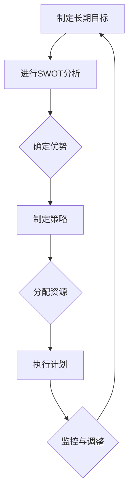
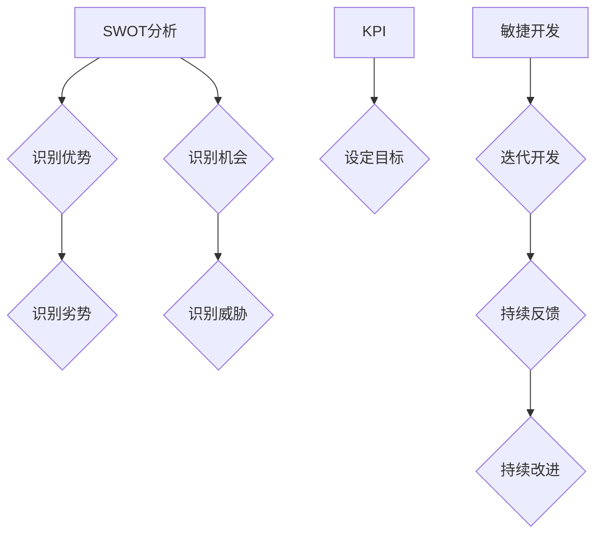
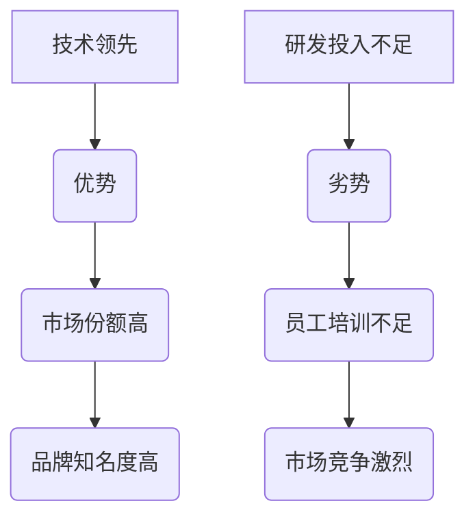
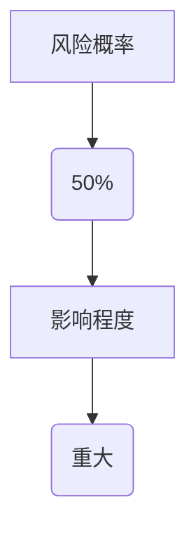
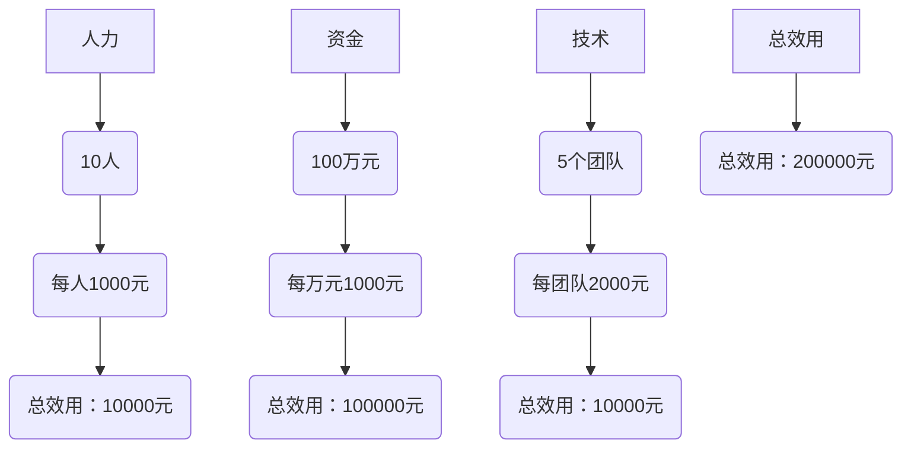

                 

# 战略规划：制定并执行长期目标

> 关键词：战略规划、长期目标、执行、项目、技术、企业管理、资源分配、风险控制、流程优化

> 摘要：本文将探讨如何制定并执行长期目标，特别关注IT领域的战略规划。通过一系列的步骤和分析，帮助读者理解战略规划的核心概念、关键要素，并提供实用的方法和工具，以便在技术项目中有效地实现长期目标。

## 1. 背景介绍

### 1.1 目的和范围

本文旨在为IT行业的专业人士提供一套战略规划的方法论，帮助他们在复杂的技术项目中制定并执行长期目标。战略规划不仅仅是制定目标和计划，它是一个系统的、持续的过程，涉及对内外部环境的分析、资源的优化配置、以及灵活的执行与调整。

### 1.2 预期读者

本文适合希望提升项目管理能力的技术领导者、项目经理、软件开发人员以及希望在技术领域取得更大成就的企业家。无论是初创公司还是大型企业，战略规划都是成功的关键。

### 1.3 文档结构概述

本文分为十个部分，结构如下：

1. 背景介绍
   - 目的和范围
   - 预期读者
   - 文档结构概述
   - 术语表
2. 核心概念与联系
   - 核心概念原理和架构的 Mermaid 流程图
3. 核心算法原理 & 具体操作步骤
   - 算法原理讲解
   - 伪代码阐述
4. 数学模型和公式 & 详细讲解 & 举例说明
   - 数学公式
   - 举例说明
5. 项目实战：代码实际案例和详细解释说明
   - 开发环境搭建
   - 源代码实现
   - 代码解读与分析
6. 实际应用场景
7. 工具和资源推荐
   - 学习资源推荐
   - 开发工具框架推荐
   - 相关论文著作推荐
8. 总结：未来发展趋势与挑战
9. 附录：常见问题与解答
10. 扩展阅读 & 参考资料

### 1.4 术语表

#### 1.4.1 核心术语定义

- **战略规划**：企业为实现长期目标而制定的一系列计划和行动方案。
- **长期目标**：在较长的时间内（通常为几年）实现的具体目标和期望成果。
- **资源分配**：在项目或企业运营中，合理分配人力、资金、技术等资源的过程。
- **风险控制**：识别、评估、并采取措施应对项目中可能出现的风险。

#### 1.4.2 相关概念解释

- **SWOT分析**：企业对自身优势（Strengths）、劣势（Weaknesses）、机会（Opportunities）和威胁（Threats）进行系统分析的方法。
- **KPI**：关键绩效指标，用于衡量项目或企业绩效的重要指标。
- **敏捷开发**：一种灵活的软件开发方法，强调迭代、快速反馈和持续改进。

#### 1.4.3 缩略词列表

- **IT**：信息技术（Information Technology）
- **ERP**：企业资源规划（Enterprise Resource Planning）
- **CRM**：客户关系管理（Customer Relationship Management）
- **AI**：人工智能（Artificial Intelligence）

## 2. 核心概念与联系

战略规划的核心在于理解并整合各种关键概念和流程。以下是战略规划中的一些核心概念，以及它们之间的联系。

### 2.1.1 战略规划与长期目标的关系

战略规划是制定长期目标的必要步骤。长期目标通常反映了企业或项目的愿景和使命，而战略规划则帮助将这些愿景转化为可操作的计划。以下是一个简化的 Mermaid 流程图，展示了战略规划与长期目标的关系：



### 2.1.2 核心概念原理和架构

为了更深入地理解战略规划，我们需要探讨以下几个核心概念：

- **SWOT分析**：是一种用于评估企业或项目内部和外部环境的工具。它可以帮助识别优势和劣势，并利用机会，规避威胁。

- **KPI**：是衡量绩效的重要指标。选择合适的KPI对于确保项目成功至关重要。

- **敏捷开发**：是一种灵活的软件开发方法，适用于快速变化的环境。它强调持续交付、迭代和协作。

下面是这些核心概念的 Mermaid 流程图表示：



通过这些流程图，我们可以更清晰地看到战略规划中各个核心概念和流程是如何相互关联的。接下来，我们将深入探讨这些核心概念的具体操作步骤。

## 3. 核心算法原理 & 具体操作步骤

战略规划不仅仅是一种概念性的框架，它需要通过一系列具体的操作步骤来实现。以下是战略规划中核心算法原理的具体操作步骤，以及相应的伪代码说明。

### 3.1 SWOT分析操作步骤

**步骤 1：收集数据**

- 收集内部数据：包括财务报表、员工绩效评估、市场调研等。
- 收集外部数据：包括行业趋势、竞争对手分析、政策法规等。

**伪代码：**

```python
function collect_data():
    internal_data = get_financial_reports()
    external_data = get_market_trends()
    return internal_data, external_data
```

**步骤 2：分析数据**

- 分析内部数据，识别企业的优势和劣势。
- 分析外部数据，识别外部环境中的机会和威胁。

**伪代码：**

```python
function analyze_data(internal_data, external_data):
    strengths = identify_strengths(internal_data)
    weaknesses = identify_weaknesses(internal_data)
    opportunities = identify_opportunities(external_data)
    threats = identify_threats(external_data)
    return strengths, weaknesses, opportunities, threats
```

**步骤 3：制定策略**

- 根据分析结果，制定相应的策略来利用优势、克服劣势、抓住机会和规避威胁。

**伪代码：**

```python
function define_strategies(strengths, weaknesses, opportunities, threats):
    strategies = {}
    strategies['利用优势'] = leverage_strengths(strengths)
    strategies['克服劣势'] = mitigate_weaknesses(weaknesses)
    strategies['抓住机会'] = seize_opportunities(opportunities)
    strategies['规避威胁'] = avoid_threats(threats)
    return strategies
```

### 3.2 KPI设定操作步骤

**步骤 1：确定目标**

- 根据企业的战略目标，确定需要衡量的关键绩效指标（KPI）。

**伪代码：**

```python
function set_goals():
    goals = {}
    goals['收入增长'] = 10%
    goals['客户满意度'] = 90%
    goals['产品交付时间'] = 30天
    return goals
```

**步骤 2：设定KPI**

- 根据目标，设定具体的KPI值。

**伪代码：**

```python
function set_kpi(goals):
    kpi = {}
    kpi['收入增长'] = calculate_growth_rate(goals['收入增长'])
    kpi['客户满意度'] = calculate_satisfaction_rate(goals['客户满意度'])
    kpi['产品交付时间'] = calculate_delivery_time(goals['产品交付时间'])
    return kpi
```

**步骤 3：监控与调整**

- 定期监控KPI的执行情况，并根据实际情况进行调整。

**伪代码：**

```python
function monitor_and_adjust(kpi):
    while True:
        status = check_kpi_status(kpi)
        if status['income_growth'] < kpi['income_growth_target']:
            adjust_sales_strategy()
        if status['customer_satisfaction'] < kpi['customer_satisfaction_target']:
            improve_customer_service()
        if status['product_delivery_time'] > kpi['product_delivery_time_target']:
            optimize_production_process()
        sleep(1)  # 定期检查，假设每秒检查一次
```

### 3.3 敏捷开发操作步骤

**步骤 1：需求分析**

- 与利益相关者沟通，收集并分析项目需求。

**伪代码：**

```python
function analyze_requirements():
    requirements = {}
    requirements['功能需求'] = collect_functional_requirements()
    requirements['非功能需求'] = collect_nontechnical_requirements()
    return requirements
```

**步骤 2：迭代开发**

- 按照敏捷开发的原则，分阶段进行软件开发。

**伪代码：**

```python
function agile_development(requirements):
    for iteration in range(num_iterations):
        plan_iteration(iteration, requirements)
        develop_and_test()
        review_and_deploy()
```

**步骤 3：持续反馈**

- 收集用户反馈，并根据反馈进行改进。

**伪代码：**

```python
function continuous_feedback():
    feedback = get_user_feedback()
    for feature in feedback:
        if feedback[feature]['issues']:
            fix_issues(feedback[feature]['issues'])
        if feedback[feature]['improvements']:
            implement_improvements(feedback[feature]['improvements'])
```

通过这些具体的操作步骤和伪代码，我们可以看到战略规划是如何通过一系列系统化的步骤来实现的。接下来，我们将深入探讨数学模型和公式在战略规划中的应用。

## 4. 数学模型和公式 & 详细讲解 & 举例说明

战略规划中，数学模型和公式起着至关重要的作用。它们帮助我们量化目标、分析风险、优化资源分配，并提供决策依据。以下是一些常用的数学模型和公式，以及它们的详细讲解和举例说明。

### 4.1 SWOT分析中的数学模型

**4.1.1 优势与劣势分析（四象限法）**

SWOT分析中的优势与劣势分析常用四象限法。公式如下：

\[ \text{四象限法} = \left( \text{优势}, \text{劣势} \right) \]

**举例说明：**

假设一家公司有如下优势与劣势：

- 优势：技术领先、市场份额高、品牌知名度高
- 劣势：研发投入不足、员工培训不足、市场竞争激烈

则四象限法表示如下：



### 4.2 KPI中的数学模型

**4.2.1 关键绩效指标（KPI）计算**

KPI是衡量企业或项目绩效的重要指标。常用的KPI包括：

- **收入增长（Growth Rate）**

\[ \text{收入增长} = \frac{\text{当前收入} - \text{基准收入}}{\text{基准收入}} \]

**举例说明：**

假设一家公司当前收入为100万元，基准收入为80万元，则收入增长为：

\[ \text{收入增长} = \frac{100 - 80}{80} = 25\% \]

- **客户满意度（Customer Satisfaction Rate）**

\[ \text{客户满意度} = \frac{\text{满意客户数}}{\text{总客户数}} \]

**举例说明：**

假设一家公司有1000个客户，其中900个客户表示满意，则客户满意度为：

\[ \text{客户满意度} = \frac{900}{1000} = 90\% \]

- **产品交付时间（Product Delivery Time）**

\[ \text{产品交付时间} = \text{实际交付时间} - \text{计划交付时间} \]

**举例说明：**

假设一家公司计划在30天内交付产品，但实际交付时间为40天，则产品交付时间为：

\[ \text{产品交付时间} = 40 - 30 = 10 \text{天} \]

### 4.3 风险控制中的数学模型

**4.3.1 风险评估矩阵**

风险评估矩阵是用于评估风险概率和影响程度的一种工具。公式如下：

\[ \text{风险评估矩阵} = \left( \text{风险概率}, \text{影响程度} \right) \]

**举例说明：**

假设一家公司面临以下风险：

- 风险概率：50%
- 影响程度：重大

则风险评估矩阵表示如下：



### 4.4 资源优化中的数学模型

**4.4.1 资源分配优化模型**

资源分配优化模型用于优化人力、资金、技术等资源的分配。公式如下：

\[ \text{资源分配} = \max \left( \sum \text{资源效用} \right) \]

**举例说明：**

假设一家公司有如下资源：

- 人力：10人
- 资金：100万元
- 技术：5个开发团队

我们需要优化这些资源的分配，使资源效用最大化。假设每个资源的效用如下：

- 人力效用：每人1000元
- 资金效用：每万元1000元
- 技术效用：每团队2000元

则资源分配优化模型表示如下：



通过这些数学模型和公式的详细讲解和举例说明，我们可以更好地理解战略规划中的量化分析和决策过程。接下来，我们将通过一个实际的项目实战案例，来展示这些理论和工具的具体应用。

## 5. 项目实战：代码实际案例和详细解释说明

### 5.1 开发环境搭建

为了演示战略规划在项目中的实际应用，我们将以一个虚构的IT项目为例，该项目旨在开发一款智能客户关系管理系统（CRM）。以下是我们搭建开发环境的过程：

**步骤 1：选择技术栈**

- **前端框架**：React
- **后端框架**：Spring Boot
- **数据库**：MySQL
- **持续集成工具**：Jenkins
- **版本控制**：Git

**步骤 2：安装开发工具**

- **IDE**：IntelliJ IDEA
- **数据库管理工具**：MySQL Workbench
- **代码托管平台**：GitHub

**步骤 3：配置开发环境**

- 在本地计算机上安装Java SDK、Node.js、MySQL等必要组件。
- 配置Jenkins用于持续集成和部署。
- 设置Git仓库，并将代码同步到GitHub。

### 5.2 源代码详细实现和代码解读

**5.2.1 数据库设计**

我们使用MySQL Workbench设计CRM系统的数据库。以下是主要的数据库表结构：

```sql
-- 用户表
CREATE TABLE users (
    id INT AUTO_INCREMENT PRIMARY KEY,
    username VARCHAR(50) UNIQUE NOT NULL,
    password VARCHAR(50) NOT NULL,
    email VARCHAR(100) UNIQUE NOT NULL,
    created_at TIMESTAMP DEFAULT CURRENT_TIMESTAMP
);

-- 客户表
CREATE TABLE customers (
    id INT AUTO_INCREMENT PRIMARY KEY,
    name VARCHAR(100) NOT NULL,
    email VARCHAR(100) UNIQUE NOT NULL,
    phone VARCHAR(20) UNIQUE NOT NULL,
    created_at TIMESTAMP DEFAULT CURRENT_TIMESTAMP
);

-- 客户信息表
CREATE TABLE customer_details (
    customer_id INT,
    address TEXT,
    company TEXT,
    website VARCHAR(100),
    FOREIGN KEY (customer_id) REFERENCES customers(id)
);
```

**5.2.2 后端代码实现**

以下是Spring Boot后端的简单示例代码，用于处理用户注册：

```java
@RestController
@RequestMapping("/api/users")
public class UserController {
    
    @Autowired
    private UserRepository userRepository;

    @PostMapping("/register")
    public ResponseEntity<?> registerUser(@RequestBody User user) {
        if (userRepository.existsByUsername(user.getUsername())) {
            return ResponseEntity.badRequest().body("Error: Username is already taken!");
        }
        
        // Hash password
        String encryptedPassword = passwordEncoder.encode(user.getPassword());
        user.setPassword(encryptedPassword);
        
        userRepository.save(user);
        return ResponseEntity.ok("User registered successfully!");
    }
}
```

**5.2.3 前端代码实现**

以下是React前端用于用户注册的组件代码：

```jsx
import React, { useState } from 'react';
import axios from 'axios';

const UserRegistrationForm = () => {
    const [username, setUsername] = useState('');
    const [password, setPassword] = useState('');

    const handleRegistration = async (e) => {
        e.preventDefault();
        
        try {
            const response = await axios.post('http://localhost:8080/api/users/register', {
                username,
                password
            });
            alert(response.data);
        } catch (error) {
            alert("Error: " + error.response.data.message);
        }
    };

    return (
        <form onSubmit={handleRegistration}>
            <label>Username:</label>
            <input type="text" value={username} onChange={(e) => setUsername(e.target.value)} />
            
            <label>Password:</label>
            <input type="password" value={password} onChange={(e) => setPassword(e.target.value)} />
            
            <button type="submit">Register</button>
        </form>
    );
};

export default UserRegistrationForm;
```

### 5.3 代码解读与分析

**后端代码解读：**

- 用户注册API接收用户名和密码，并通过`UserRepository`检查用户名是否已存在。
- 如果用户名不存在，将密码进行哈希处理，然后保存用户到数据库。
- 返回注册成功的消息。

**前端代码解读：**

- 用户注册表单包含用户名和密码输入框。
- 提交表单时，使用`axios`发起POST请求，将用户名和密码发送到后端API。
- 根据后端响应显示成功或错误消息。

### 5.4 项目部署与维护

**步骤 1：使用Jenkins进行持续集成和部署**

- 配置Jenkins，使其在每次代码提交时自动执行构建和部署。
- 编写Jenkinsfile，定义构建和部署的步骤。

**步骤 2：监控和日志分析**

- 使用ELK（Elasticsearch、Logstash、Kibana）进行日志收集和分析，监控系统的运行状态。
- 设置报警机制，以便在系统出现故障时及时通知开发团队。

通过这个项目实战案例，我们可以看到如何将战略规划的理论和方法应用于实际开发中。从需求分析、环境搭建、代码实现，到持续集成和监控，每一步都体现了战略规划的重要性。接下来，我们将探讨战略规划在IT领域的实际应用场景。

## 6. 实际应用场景

战略规划在IT领域的应用场景广泛且多样，涵盖了从初创企业到大型跨国公司的各种组织形式。以下是几个典型的应用场景：

### 6.1 创业公司

对于初创公司，战略规划尤其关键。初创公司通常资源有限，需要明确自身的核心竞争力、目标市场以及长期愿景。以下是战略规划在初创公司中的实际应用：

- **市场定位**：初创公司需要通过市场调研和SWOT分析，确定目标市场和竞争对手，从而制定有效的市场进入策略。
- **资源配置**：初创公司需要合理配置有限资源，如人力、资金和技术，以确保关键项目的优先级和资源投入。
- **风险控制**：初创公司面临众多风险，如市场不确定性、技术风险和资金链断裂等。通过风险评估和应对策略，可以降低风险对业务的影响。
- **敏捷开发**：初创公司通常采用敏捷开发方法，快速响应市场需求变化，并通过持续反馈和迭代优化产品。

### 6.2 大型企业

对于大型企业，战略规划同样至关重要。大型企业往往涉及多个业务部门和项目，需要确保整体战略的一致性和协同性。以下是战略规划在大型企业中的实际应用：

- **整体战略规划**：大型企业需要制定长期战略规划，明确企业的愿景、使命和目标，并制定实现这些目标的路线图。
- **跨部门协作**：大型企业通过战略规划，促进各部门之间的协作，确保资源优化和业务流程的顺畅。
- **创新驱动**：大型企业需要通过战略规划，推动技术创新和业务模式创新，保持市场竞争力。
- **数字化转型**：随着数字化技术的快速发展，大型企业需要通过战略规划，制定数字化转型的路线图，实现业务流程的优化和效率提升。

### 6.3 政府和公共部门

政府和公共部门在IT领域的战略规划也具有独特性。以下是战略规划在政府和公共部门中的应用：

- **公共服务优化**：政府通过战略规划，优化公共服务提供方式，提高服务质量和效率。
- **数据治理**：政府和公共部门需要通过战略规划，制定数据治理政策，确保数据安全、合规和有效利用。
- **电子政务**：政府通过战略规划，推动电子政务的发展，提高政府透明度和公共服务水平。
- **社会治理**：政府通过战略规划，利用信息技术提升社会治理能力，预防和解决社会问题。

总之，战略规划在IT领域的实际应用场景丰富多样，无论是初创公司、大型企业还是政府和公共部门，都可以通过有效的战略规划，实现长期目标，提升竞争力和服务水平。

## 7. 工具和资源推荐

为了更好地理解和实践战略规划，我们需要借助一系列的工具和资源。以下是一些推荐的学习资源、开发工具框架和相关论文著作。

### 7.1 学习资源推荐

#### 7.1.1 书籍推荐

1. **《战略规划与实施》**：作者迈克尔·波特，详细介绍了企业如何制定和实施战略规划。
2. **《敏捷开发实践指南》**：作者杰夫·萨瑟兰，深入讲解了敏捷开发的方法和实践。
3. **《项目管理知识体系指南（PMBOK指南）》**：作者项目管理协会，涵盖了项目管理的核心理论和实践方法。

#### 7.1.2 在线课程

1. **Coursera的《战略规划与执行》**：由耶鲁大学提供，涵盖了战略规划的基础知识和实践技巧。
2. **Udemy的《项目管理基础》**：适合初学者，介绍了项目管理的核心概念和工具。
3. **edX的《敏捷开发》**：由麻省理工学院提供，深入讲解了敏捷开发的理论和实际应用。

#### 7.1.3 技术博客和网站

1. **CIO.com**：提供关于企业IT战略规划的最新趋势和案例分析。
2. **TechTarget**：涵盖各种IT技术和战略规划主题，包括云计算、大数据和人工智能等。
3. **博客园**：中文技术社区，提供大量的技术博客和讨论，有助于了解国内IT行业的战略规划实践。

### 7.2 开发工具框架推荐

#### 7.2.1 IDE和编辑器

1. **Visual Studio Code**：一款轻量级但功能强大的开源IDE，支持多种编程语言。
2. **IntelliJ IDEA**：一款专为Java和Scala编程设计的强大IDE，支持代码智能提示和重构。
3. **Eclipse**：一款开源IDE，广泛用于Java和企业级应用开发。

#### 7.2.2 调试和性能分析工具

1. **JMeter**：一款开源性能测试工具，用于测试Web应用的负载和性能。
2. **Grafana**：一款开源的数据可视化和监控工具，可用于实时监控和分析系统性能。
3. **New Relic**：一款商业化的应用性能监控工具，提供全面的性能监控和分析功能。

#### 7.2.3 相关框架和库

1. **Spring Boot**：一款用于快速开发企业级Java应用的框架，支持微服务架构。
2. **React**：一款用于构建用户界面的JavaScript库，广泛应用于单页应用和组件化开发。
3. **Docker**：一款开源容器化平台，用于简化应用部署和运维。

### 7.3 相关论文著作推荐

#### 7.3.1 经典论文

1. **“On the Criteria to be Used in Automating the Design of Systems”**：作者Herbert Simon，探讨了系统设计的自动化方法。
2. **“Agile Software Development”**：作者Ken Schwaber和Jeff Sutherland，介绍了敏捷开发的方法和原则。
3. **“The Art of Strategy”**：作者Amitava Kumar，深入探讨了企业战略规划的理论和实践。

#### 7.3.2 最新研究成果

1. **“AI-Driven Strategic Planning”**：探讨了人工智能在战略规划中的应用，包括数据驱动的决策支持和自动化规划工具。
2. **“Blockchain in Supply Chain Management”**：分析了区块链技术在供应链管理中的应用，探讨了如何通过区块链实现更高效、透明的供应链管理。
3. **“The Future of Work: Automation and Employment”**：探讨了自动化对就业市场的影响，以及如何通过战略规划应对这些挑战。

#### 7.3.3 应用案例分析

1. **“The Role of Strategic Planning in Digital Transformation”**：通过实际案例，分析了战略规划在数字化转型中的作用和挑战。
2. **“A Case Study of Agile Methodology in a Large-Scale IT Project”**：探讨了敏捷方法在大型IT项目中的应用效果和挑战。
3. **“Using SWOT Analysis for Business Strategy Development”**：通过案例展示了SWOT分析在商业战略规划中的应用。

通过这些工具和资源，我们可以更好地理解和实践战略规划，提升项目管理和技术创新能力。

## 8. 总结：未来发展趋势与挑战

在IT领域，战略规划的重要性日益凸显。随着技术的发展和市场竞争的加剧，企业需要更加精准地制定和执行长期目标，以保持竞争力。未来，战略规划将呈现以下发展趋势：

### 8.1 数据驱动的战略规划

随着大数据和人工智能技术的发展，战略规划将更加依赖数据分析。企业将通过数据挖掘和分析，洞察市场趋势、客户需求和企业内部运营，从而制定更精准的战略目标和策略。

### 8.2 敏捷战略规划

敏捷开发的成功经验将被应用到战略规划中。企业将采用更灵活、快速响应的市场策略，以应对快速变化的市场环境。敏捷战略规划将强调迭代和持续改进，提高企业适应市场变化的能力。

### 8.3 数字化战略规划

数字化转型将成为企业战略规划的重要组成部分。企业将利用物联网、云计算、人工智能等技术，实现业务流程的优化和效率提升。数字化战略规划将帮助企业实现业务的在线化、智能化和自动化。

### 8.4 跨领域融合

战略规划将不仅仅局限于IT领域，而是与各个行业深度融合。企业将通过跨领域的合作和创新，实现产业链的整合和优化，打造全新的商业模式。

然而，战略规划也面临一系列挑战：

### 8.5 数据隐私与安全

随着数据量的增加，数据隐私和安全问题将日益突出。企业需要制定严格的数据保护策略，确保客户数据和公司信息的安全。

### 8.6 技术变革的影响

技术的快速变革将对战略规划带来挑战。企业需要不断学习新技术，调整战略方向，以适应技术变革带来的影响。

### 8.7 跨部门协作

在大型企业中，战略规划的执行需要跨部门协作。如何协调不同部门的工作，实现资源优化和目标一致，是战略规划面临的重要挑战。

总之，未来战略规划将在数据驱动、敏捷开发、数字化转型和跨领域融合等方面取得重大进展，同时也将面临数据隐私、技术变革和跨部门协作等挑战。企业需要不断调整和完善战略规划方法，以应对这些挑战，实现长期目标。

## 9. 附录：常见问题与解答

### 9.1 什么是战略规划？

战略规划是企业为实现长期目标而制定的一系列计划和行动方案。它包括对内外部环境的分析、目标的设定、资源的优化配置、以及执行与调整的过程。

### 9.2 战略规划的核心步骤是什么？

战略规划的核心步骤包括：

1. **目标设定**：明确企业或项目的长期目标。
2. **环境分析**：通过SWOT分析等工具，评估企业的优势、劣势、机会和威胁。
3. **资源优化**：合理配置人力资源、资金和技术等资源。
4. **策略制定**：根据分析结果，制定实现目标的策略。
5. **执行与监控**：执行战略计划，并持续监控和调整，确保目标的实现。

### 9.3 如何进行有效的战略规划？

进行有效的战略规划，需要遵循以下原则：

1. **数据驱动**：基于详尽的数据分析制定战略。
2. **明确目标**：设定具体、可衡量的目标。
3. **灵活调整**：根据市场和技术变化，及时调整战略计划。
4. **跨部门协作**：确保战略规划得到各部门的共同支持与执行。
5. **持续改进**：通过迭代和反馈，不断优化战略规划。

### 9.4 战略规划与项目管理有什么区别？

战略规划是制定长期目标和策略的过程，而项目管理是实施这些策略的具体操作。战略规划关注企业的全局和长期目标，而项目管理关注具体项目或任务的具体执行。

### 9.5 什么情况下需要更新战略规划？

当以下情况发生时，需要更新战略规划：

1. **市场环境变化**：如技术进步、竞争态势变化等。
2. **企业内部变化**：如组织结构、企业文化变化等。
3. **绩效评估结果**：如战略规划执行效果不佳，需要调整目标或策略。
4. **政策法规变化**：如行业政策、法律法规的调整等。

### 9.6 如何衡量战略规划的有效性？

衡量战略规划的有效性可以通过以下指标：

1. **目标达成率**：目标是否按计划实现。
2. **资源利用率**：资源是否得到有效配置和利用。
3. **业务绩效**：如收入增长、客户满意度等关键绩效指标是否达到预期。
4. **适应能力**：企业是否能够迅速响应市场变化和技术进步。

通过这些常见问题与解答，可以帮助读者更好地理解战略规划的概念、过程和方法，以及在实际操作中如何应用这些知识。

## 10. 扩展阅读 & 参考资料

为了更深入地了解战略规划和IT领域的相关知识，以下是推荐的扩展阅读和参考资料：

### 10.1 经典书籍

1. **《竞争战略》**：作者迈克尔·波特，深入探讨了企业在竞争中的战略选择。
2. **《创新与企业家精神》**：作者彼得·德鲁克，分析了创新对企业发展的重要性。
3. **《第五项修炼》**：作者彼得·圣吉，探讨了企业如何通过学习型组织实现持续发展。

### 10.2 在线课程

1. **“MIT的《创新与创业》**：麻省理工学院提供的免费在线课程，涵盖了创新和创业的核心概念。
2. **“斯坦福大学的《项目管理》**：通过该课程，可以学习到项目管理的基本理论和实践方法。

### 10.3 技术博客和网站

1. **“Medium的《Tech Strategy》**：提供关于科技战略的深度分析和案例分析。
2. **“LinkedIn的《Business Strategy》**：LinkedIn上的商务战略讨论区，汇集了行业专家的见解。

### 10.4 学术期刊和论文

1. **“Journal of Strategic Management”**：发表关于战略管理的理论和实证研究论文。
2. **“IEEE Transactions on Engineering Management”**：关注工程管理领域的最新研究成果。

### 10.5 相关论文

1. **“Strategic Planning in the Age of AI”**：探讨了人工智能对战略规划的影响。
2. **“Digital Transformation and Strategic Planning”**：分析了数字化转型对企业战略规划的影响。

这些扩展阅读和参考资料将帮助读者进一步深入理解战略规划的理论和实践，以及在IT领域的应用。希望这些资源能为读者的研究和实践提供有益的参考。

