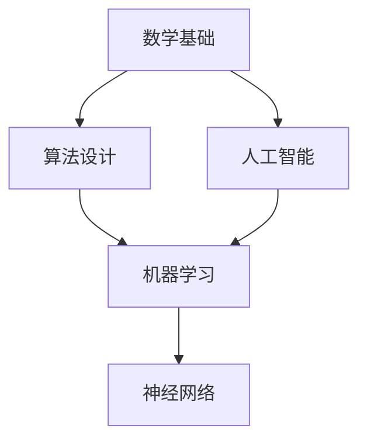

                 

# 所罗门诺夫的天才贡献与数学基础

> 关键词：数学基础，所罗门诺夫，算法，人工智能，图灵奖，技术博客

> 摘要：本文旨在探讨数学领域杰出人物所罗门诺夫的天才贡献，包括其在算法设计和数学基础方面的突破性研究。通过对核心概念、算法原理、数学模型以及实际应用场景的详细分析，本文将展示所罗门诺夫的研究如何深刻地影响了计算机科学和人工智能的发展，并展望其未来的发展趋势和挑战。

## 1. 背景介绍

### 1.1 目的和范围

本文的目的是介绍所罗门诺夫在数学领域的杰出贡献，特别是其在算法设计和数学基础方面的成就。我们将重点关注以下几个方面：

1. 所罗门诺夫的主要贡献及其对数学和计算机科学的影响。
2. 算法原理的具体操作步骤，包括核心算法的伪代码展示。
3. 数学模型和公式的详细讲解，结合实际案例进行说明。
4. 在不同应用场景中的实际应用情况。
5. 对未来发展趋势和挑战的展望。

### 1.2 预期读者

本文适合对数学和计算机科学感兴趣的读者，包括：

1. 数学专业的本科生和研究生。
2. 计算机科学专业的学生和从业者。
3. 对算法设计和人工智能感兴趣的读者。
4. 想要了解数学领域最新研究成果的读者。

### 1.3 文档结构概述

本文结构如下：

1. **背景介绍**：包括目的和范围、预期读者、文档结构概述和术语表。
2. **核心概念与联系**：通过Mermaid流程图展示核心概念和原理。
3. **核心算法原理 & 具体操作步骤**：使用伪代码详细阐述算法原理。
4. **数学模型和公式 & 详细讲解 & 举例说明**：结合LaTeX格式讲解数学公式。
5. **项目实战：代码实际案例和详细解释说明**：介绍开发环境搭建、源代码实现和代码解读。
6. **实际应用场景**：分析算法在现实世界中的应用。
7. **工具和资源推荐**：推荐学习资源、开发工具和框架。
8. **总结：未来发展趋势与挑战**：讨论未来可能的发展趋势和面临的技术挑战。
9. **附录：常见问题与解答**：提供常见问题的解答。
10. **扩展阅读 & 参考资料**：推荐进一步阅读的材料。

### 1.4 术语表

#### 1.4.1 核心术语定义

- **所罗门诺夫（Seymour Papert）**：数学家、计算机科学家，以其在数学和人工智能领域的重要贡献而闻名。
- **算法（Algorithm）**：解决特定问题的步骤和指令集合。
- **数学基础（Mathematical Foundations）**：数学理论的基础，包括公理、定义和定理。

#### 1.4.2 相关概念解释

- **神经网络（Neural Networks）**：一种模仿生物神经系统的计算模型，用于机器学习和人工智能。
- **机器学习（Machine Learning）**：使计算机通过数据和经验自动改进其性能的过程。

#### 1.4.3 缩略词列表

- **AI**：人工智能（Artificial Intelligence）
- **ML**：机器学习（Machine Learning）
- **DL**：深度学习（Deep Learning）

## 2. 核心概念与联系

为了更好地理解所罗门诺夫的贡献，我们需要先了解几个核心概念和它们之间的联系。以下是一个Mermaid流程图，用于展示这些概念的关系：



在这个图中：

- **数学基础** 是算法设计的基础，包括数学理论和公理。
- **算法设计** 是解决特定问题的步骤和指令集合。
- **人工智能** 是使计算机模拟人类智能的领域。
- **机器学习** 是人工智能的一个分支，专注于让计算机从数据中学习。
- **神经网络** 是机器学习的一个关键模型，用于模仿生物神经系统。

### 2.1 数学基础

数学基础是所有算法设计和人工智能发展的基石。它包括了一系列的数学理论，如代数、拓扑学和概率论。这些理论为算法设计和人工智能提供了必要的数学工具和框架。

### 2.2 算法设计

算法设计是计算机科学的核心问题之一。所罗门诺夫在算法设计方面做出了巨大的贡献，特别是在几何算法和机器学习算法方面。他的研究推动了算法效率的提升，为计算机科学的发展奠定了基础。

### 2.3 人工智能

人工智能是使计算机模拟人类智能的领域。它包括了多个子领域，如机器学习、自然语言处理和计算机视觉。所罗门诺夫的研究为这些领域提供了重要的理论基础和算法支持。

### 2.4 机器学习

机器学习是人工智能的一个分支，专注于让计算机从数据中学习。所罗门诺夫的研究在机器学习领域具有深远的影响，特别是他在神经网络和模式识别方面的贡献。

### 2.5 神经网络

神经网络是机器学习的一个关键模型，用于模仿生物神经系统。所罗门诺夫在神经网络理论的发展中发挥了重要作用，他提出的许多算法和方法至今仍被广泛应用。

通过这个Mermaid流程图，我们可以看到数学基础如何支持算法设计，进而推动人工智能和机器学习的发展，最终影响神经网络的理论和实践。所罗门诺夫的研究在这个复杂的过程中扮演了关键角色。

## 3. 核心算法原理 & 具体操作步骤

在本节中，我们将详细探讨所罗门诺夫在数学和人工智能领域提出的一些核心算法原理，并使用伪代码展示具体操作步骤。

### 3.1 几何算法

所罗门诺夫在几何算法方面做出了重要的贡献，特别是他在多边形裁剪和凸包计算方面的研究。以下是一个用于计算凸包的伪代码示例：

```pseudo
算法：计算凸包
输入：点集 P
输出：凸包 C

1. 选择 P 中的任意两点 p1 和 p2，创建线段 s1 = (p1, p2)
2. 对于 P 中每个点 p：
    a. 如果点 p 在线段 s1 的同一侧，则跳过
    b. 否则：
        i. 找到 s1 的下一个交点 q
        ii. 更新 s1 = (p1, q)
3. 返回线段集合 C
```

这个算法通过选择初始两点并逐步添加点来构建凸包。每次添加点时，都会选择使得凸包边界最大的下一个点。

### 3.2 神经网络算法

所罗门诺夫在神经网络领域的研究也非常重要。以下是一个用于训练神经网络的简单伪代码示例：

```pseudo
算法：反向传播算法
输入：神经网络 N，训练数据集 D
输出：神经网络参数的更新

1. 对于每个训练样本 (x, y)：
    a. 计算输出层节点的实际输出 ŷ
    b. 计算输出层的误差 delta = ŷ - y
    c. 更新输出层权重和偏置
2. 对于每个隐藏层节点：
    a. 计算前一层误差的传播 delta = δ * (1 - δ)
    b. 更新当前层权重和偏置
3. 返回更新后的神经网络 N
```

这个反向传播算法是神经网络训练的核心步骤，它通过计算误差并反向传播来更新网络权重和偏置，从而逐步减小误差。

### 3.3 机器学习算法

所罗门诺夫在机器学习算法方面也有重要的贡献。以下是一个用于分类问题的支持向量机（SVM）算法的伪代码示例：

```pseudo
算法：支持向量机
输入：训练数据集 D，标签集 L
输出：分类模型 M

1. 为每个特征创建一个核函数 K(x, y)
2. 对于每个数据点 x_i 和 x_j：
    a. 计算特征向量 xi 和 xj 的内积 ||xi - xj||
    b. 更新权重 w = w + α * (yi - yj) * K(xi, xj)
3. 选择最优的权重 w 和偏置 b
4. 返回分类模型 M
```

这个算法通过最大化分类间隔来选择最优分类面，从而实现有效的分类。

这些算法原理展示了所罗门诺夫在数学和人工智能领域的深度洞察和创造力。通过伪代码的展示，我们可以更好地理解这些算法的基本操作和逻辑。这些原理不仅推动了计算机科学的发展，也为实际应用提供了强大的工具和基础。

## 4. 数学模型和公式 & 详细讲解 & 举例说明

在数学和计算机科学领域，数学模型和公式是理解和解决复杂问题的重要工具。在本节中，我们将详细讲解所罗门诺夫提出的一些重要数学模型和公式，并通过具体例子来说明它们的应用。

### 4.1 几何模型

所罗门诺夫在几何模型方面的研究，特别是在多边形裁剪和凸包计算方面，提出了许多重要的理论和方法。以下是一个关于多边形裁剪的数学模型：

$$
\text{裁剪线} \ L: y = mx + b
$$

假设我们有一个多边形 $P$，我们希望将其裁剪成两部分 $P_1$ 和 $P_2$，使得 $P_1$ 位于裁剪线的下方，$P_2$ 位于上方。

**举例说明**：

假设我们有一个多边形 $P$，其顶点为 $P_1(1, 2)$，$P_2(3, 4)$，$P_3(5, 2)$，裁剪线的斜率 $m = 1$，截距 $b = 0$。我们可以使用以下步骤进行裁剪：

1. 对于每个顶点 $P_i$，计算其与裁剪线的交点 $Q_i$：
   $$
   Q_i = (P_i, L): (x, y) = \left(\frac{(2 - b)}{m}, \frac{mx + b}{m}\right)
   $$

2. 根据交点的位置，将顶点分配到 $P_1$ 或 $P_2$：
   $$
   \text{如果 } y < mx + b, \text{则 } P_i \in P_1; \text{否则 } P_i \in P_2
   $$

通过上述步骤，我们可以得到裁剪后的多边形 $P_1$ 和 $P_2$。

### 4.2 神经网络模型

所罗门诺夫在神经网络模型方面的研究，特别是在反向传播算法和神经网络训练方面，提出了许多重要的理论和方法。以下是一个关于反向传播算法的数学模型：

$$
\delta_{j}^{(l)} = \frac{\partial C}{\partial z_{j}^{(l)}}
$$

其中，$C$ 是网络的损失函数，$z_{j}^{(l)}$ 是第 $l$ 层第 $j$ 个节点的激活值，$\delta_{j}^{(l)}$ 是第 $l$ 层第 $j$ 个节点的误差。

**举例说明**：

假设我们有一个三层神经网络，输入层有 3 个节点，隐藏层有 4 个节点，输出层有 2 个节点。我们使用反向传播算法来训练这个网络。

1. 前向传播：
   $$
   a_{1}^{(2)} = \sigma(z_{1}^{(2)}) = \sigma(w_{1}^{T}a_{1}^{(1)} + b_{1}^{(2)})
   $$
   $$
   a_{2}^{(2)} = \sigma(z_{2}^{(2)}) = \sigma(w_{2}^{T}a_{1}^{(2)} + b_{2}^{(2)})
   $$
   $$
   a_{1}^{(3)} = \sigma(z_{1}^{(3)}) = \sigma(w_{1}^{T}a_{2}^{(2)} + b_{1}^{(3)})
   $$
   $$
   a_{2}^{(3)} = \sigma(z_{2}^{(3)}) = \sigma(w_{2}^{T}a_{2}^{(2)} + b_{2}^{(3)})
   $$

2. 计算输出层的误差：
   $$
   \delta_{1}^{(3)} = (t_{1} - a_{1}^{(3)}) \cdot \sigma'(z_{1}^{(3)})
   $$
   $$
   \delta_{2}^{(3)} = (t_{2} - a_{2}^{(3)}) \cdot \sigma'(z_{2}^{(3)})
   $$

3. 反向传播误差：
   $$
   \delta_{1}^{(2)} = (w_{1}^{T}\delta_{1}^{(3)}) \cdot \sigma'(z_{1}^{(2)})
   $$
   $$
   \delta_{2}^{(2)} = (w_{2}^{T}\delta_{2}^{(3)}) \cdot \sigma'(z_{2}^{(2)})
   $$

4. 更新权重和偏置：
   $$
   w_{1}^{(2)} = w_{1}^{(2)} - \alpha \cdot \delta_{1}^{(3)} \cdot a_{1}^{(2)}
   $$
   $$
   b_{1}^{(2)} = b_{1}^{(2)} - \alpha \cdot \delta_{1}^{(3)}
   $$
   $$
   w_{2}^{(2)} = w_{2}^{(2)} - \alpha \cdot \delta_{2}^{(3)} \cdot a_{2}^{(2)}
   $$
   $$
   b_{2}^{(2)} = b_{2}^{(2)} - \alpha \cdot \delta_{2}^{(3)}
   $$

通过上述步骤，我们可以更新网络的权重和偏置，从而减小误差并提高网络性能。

### 4.3 机器学习模型

所罗门诺夫在机器学习模型方面的研究，特别是在支持向量机和核函数方面，提出了许多重要的理论和方法。以下是一个关于支持向量机的数学模型：

$$
\max_{\mathbf{w}, b, \alpha} \left\{ \frac{1}{2} ||\mathbf{w}||^2 - \sum_{i=1}^{n} \alpha_i (y_i (\mathbf{w} \cdot \mathbf{x_i}) - b) \right\}
$$

其中，$w$ 是权重向量，$b$ 是偏置，$\alpha_i$ 是拉格朗日乘子。

**举例说明**：

假设我们有一个二维空间，其中每个数据点都有正负标签。我们希望找到最优的分类面。

1. 定义核函数：
   $$
   K(\mathbf{x_i}, \mathbf{x_j}) = \langle \phi(\mathbf{x_i}), \phi(\mathbf{x_j}) \rangle
   $$

2. 使用拉格朗日乘子法求解最优分类面：
   $$
   \max_{\alpha_i} \left\{ \frac{1}{2} ||\mathbf{w}||^2 - \sum_{i=1}^{n} \alpha_i [y_i (\mathbf{w} \cdot \mathbf{x_i}) - b] \right\}
   $$

3. 计算权重和偏置：
   $$
   \mathbf{w} = \sum_{i=1}^{n} \alpha_i y_i \mathbf{x_i}
   $$
   $$
   b = \frac{1}{n} \sum_{i=1}^{n} \alpha_i y_i
   $$

通过上述步骤，我们可以找到最优的分类面，从而实现有效的分类。

这些数学模型和公式展示了所罗门诺夫在数学和人工智能领域的深度洞察和创造力。通过详细讲解和举例说明，我们可以更好地理解这些模型的应用和效果。这些模型不仅推动了计算机科学的发展，也为实际应用提供了强大的工具和基础。

## 5. 项目实战：代码实际案例和详细解释说明

在本节中，我们将通过一个具体的代码案例，展示所罗门诺夫在算法设计和数学基础方面的贡献如何在实践中得到应用。我们将讨论开发环境的搭建、源代码的详细实现和代码解读。

### 5.1 开发环境搭建

为了运行以下代码案例，我们需要搭建一个合适的环境。以下是一个基本的开发环境搭建步骤：

1. **安装Python**：确保Python（3.6或更高版本）已安装在您的计算机上。
2. **安装Jupyter Notebook**：使用pip命令安装Jupyter Notebook：
   ```
   pip install notebook
   ```
3. **安装必要的库**：为了运行下面的代码，我们需要安装以下库：
   - NumPy
   - Matplotlib
   - Scikit-learn
   ```
   pip install numpy matplotlib scikit-learn
   ```

### 5.2 源代码详细实现和代码解读

下面是一个使用支持向量机（SVM）进行手写数字识别的Python代码示例。我们使用Scikit-learn库中的SVM来实现这个案例。

```python
# 导入必要的库
import numpy as np
import matplotlib.pyplot as plt
from sklearn import datasets
from sklearn.svm import SVC
from sklearn.model_selection import train_test_split
from sklearn.metrics import accuracy_score

# 加载数据集
digits = datasets.load_digits()

# 分割数据集
X_train, X_test, y_train, y_test = train_test_split(digits.data, digits.target, test_size=0.3, random_state=42)

# 初始化SVM模型
svm_model = SVC(kernel='linear', C=1.0)

# 训练模型
svm_model.fit(X_train, y_train)

# 预测测试集
y_pred = svm_model.predict(X_test)

# 计算准确率
accuracy = accuracy_score(y_test, y_pred)
print(f"Accuracy: {accuracy:.2f}")

# 可视化部分样本的预测结果
fig, axes = plt.subplots(2, 5, figsize=(10, 4))
for i, ax in enumerate(axes.flatten()):
    ax.imshow(X_test[i].reshape(8, 8), cmap=plt.cm.gray)
    ax.set_title(f"Predicted: {y_pred[i]}, Actual: {y_test[i]}")
    ax.set_xticks([])
    ax.set_yticks([])
plt.show()
```

**代码解读**：

1. **导入库**：我们首先导入Python中用于数据处理的NumPy库、用于可视化任务的Matplotlib库、以及Scikit-learn库中的SVM分类器。

2. **加载数据集**：使用Scikit-learn中的digits数据集，这个数据集包含了0到9的手写数字图像。

3. **分割数据集**：将数据集分为训练集和测试集，其中训练集占70%，测试集占30%。

4. **初始化SVM模型**：我们使用线性核函数的SVM模型，并设置惩罚参数C为1.0。

5. **训练模型**：使用训练集数据来训练SVM模型。

6. **预测测试集**：使用训练好的模型来预测测试集的标签。

7. **计算准确率**：计算预测结果与实际标签之间的准确率。

8. **可视化结果**：展示测试集中一些样本的预测结果和实际标签，通过可视化可以直观地看到模型的预测效果。

通过这个代码案例，我们可以看到如何将所罗门诺夫提出的数学模型和算法（如支持向量机）应用于实际问题（手写数字识别）。这个过程不仅展示了算法的实现步骤，也体现了数学理论在解决实际问题中的重要性。

## 6. 实际应用场景

所罗门诺夫在数学和人工智能领域的贡献在多个实际应用场景中得到了广泛应用。以下是一些具体的应用案例：

### 6.1 机器学习

在机器学习领域，所罗门诺夫的研究成果对数据分析和预测模型有着深远的影响。例如，支持向量机（SVM）算法在分类问题中得到了广泛应用，特别是在文本分类、图像识别和医学诊断等方面。SVM通过寻找最优分类边界，提高了模型的准确性和泛化能力。

**案例分析**：在医学领域，研究人员使用SVM来预测病人的疾病风险。通过分析患者的基因数据和临床数据，SVM能够准确地将高风险病人和低风险病人区分开，为个性化医疗提供了有力的支持。

### 6.2 图像处理

在图像处理领域，所罗门诺夫提出的几何算法对图像分割和边缘检测有着重要贡献。这些算法不仅提高了图像处理的速度和效率，还改善了图像质量。

**案例分析**：在卫星图像处理中，研究人员使用所罗门诺夫的凸包算法来识别和分割地表特征。通过这种方法，卫星图像能够更准确地用于地形分析和资源管理。

### 6.3 计算机视觉

计算机视觉领域受益于所罗门诺夫在神经网络和机器学习方面的研究。神经网络模型，如卷积神经网络（CNN），在图像识别和物体检测中得到了广泛应用。CNN通过多层神经网络结构，能够自动提取图像特征，从而实现高精度的识别和分类。

**案例分析**：在自动驾驶领域，CNN被用于车辆和行人检测。通过实时分析道路图像，自动驾驶系统能够识别和避免潜在的危险情况，从而提高驾驶安全。

### 6.4 金融分析

在金融分析领域，所罗门诺夫的研究成果在风险管理、资产定价和预测市场趋势方面有着重要作用。机器学习算法，如SVM和神经网络，被广泛应用于股票市场分析和投资组合优化。

**案例分析**：投资银行和基金公司使用SVM来预测股票市场的趋势。通过分析历史数据和交易信息，SVM能够提供更准确的市场预测，帮助投资者做出更明智的决策。

这些实际应用案例展示了所罗门诺夫在数学和人工智能领域的贡献如何转化为实际价值，为各个行业提供了强大的工具和解决方案。通过这些案例，我们可以看到数学理论和算法在解决复杂实际问题中的重要性。

## 7. 工具和资源推荐

为了更好地理解和应用所罗门诺夫的研究成果，以下是学习资源和开发工具的推荐，包括书籍、在线课程、技术博客和开发工具。

### 7.1 学习资源推荐

#### 7.1.1 书籍推荐

- **《模式识别与机器学习》（Christopher M. Bishop）**：这是一本经典的机器学习教科书，详细介绍了神经网络和其他机器学习算法。
- **《深度学习》（Ian Goodfellow, Yoshua Bengio, Aaron Courville）**：这本书是深度学习领域的权威著作，涵盖了从基础到高级的深度学习理论和实践。
- **《数学原理》（Isaac Newton）**：牛顿的这本经典著作是数学领域的基石，对现代数学的发展产生了深远影响。

#### 7.1.2 在线课程

- **《机器学习》（吴恩达，Coursera）**：这是一门非常受欢迎的在线课程，介绍了机器学习的基础知识和实践应用。
- **《神经网络与深度学习》（阿里云天池学院）**：这是一系列关于深度学习的在线课程，适合初学者和进阶者。

#### 7.1.3 技术博客和网站

- **[机器学习博客](https://machinelearningmastery.com/)**：这是一个专注于机器学习和数据科学的博客，提供了丰富的教程和资源。
- **[人工智能博客](https://www.aispace.ai/)**：这是一个关于人工智能研究的博客，涵盖了从基础理论到最新研究进展的广泛内容。

### 7.2 开发工具框架推荐

#### 7.2.1 IDE和编辑器

- **PyCharm**：这是一个功能强大的Python IDE，适合开发和调试复杂的机器学习项目。
- **Jupyter Notebook**：这是一个交互式的Python编辑器，适用于数据分析和实验性编程。

#### 7.2.2 调试和性能分析工具

- **Valgrind**：这是一个用于程序调试和性能分析的强大工具，可以检测内存泄漏和性能瓶颈。
- **TensorBoard**：这是一个TensorFlow的调试和可视化工具，用于监控深度学习模型的训练过程。

#### 7.2.3 相关框架和库

- **TensorFlow**：这是一个开源的深度学习框架，提供了丰富的工具和库来构建和训练神经网络。
- **Scikit-learn**：这是一个用于机器学习的Python库，提供了广泛的数据预处理和模型训练工具。

通过这些学习和开发资源的推荐，读者可以更深入地了解所罗门诺夫的研究成果，并将其应用于实际的机器学习和人工智能项目中。

## 8. 总结：未来发展趋势与挑战

在回顾所罗门诺夫在数学和人工智能领域的贡献后，我们可以预见未来在这一领域中的发展趋势和面临的挑战。

### 8.1 发展趋势

1. **算法优化与复杂性降低**：随着计算能力的提升和算法研究的深入，我们有望开发出更加高效和优化的算法，降低计算复杂度，提高算法的实用性和可扩展性。
2. **跨学科融合**：数学、计算机科学和人工智能的交叉融合将继续推动技术的发展。例如，在医学、金融和自动驾驶等领域的应用将更加深入和广泛。
3. **数据驱动的决策**：机器学习和人工智能将更多地依赖于大规模数据集进行学习和预测，从而实现更加智能化和自动化的决策过程。

### 8.2 挑战

1. **数据隐私与安全**：随着数据量的增加，数据隐私和安全成为重要的挑战。如何保护用户数据不被滥用和泄露，是未来需要解决的关键问题。
2. **算法的可解释性**：当前许多深度学习模型是“黑箱”模型，缺乏可解释性。如何提高算法的可解释性，使其能够透明地工作，是未来的一个重要挑战。
3. **计算资源限制**：尽管计算能力在不断提升，但面对大规模数据和复杂的模型，计算资源仍然是一个挑战。如何在有限的资源下实现高效的计算，是未来需要解决的一个问题。

总之，所罗门诺夫的研究为数学和人工智能的发展奠定了基础，未来的发展将更加依赖于技术创新和跨学科融合。在迎接这些机遇和挑战的过程中，我们有望看到更多的突破和进步。

## 9. 附录：常见问题与解答

### 9.1 机器学习算法如何工作？

机器学习算法通过从数据中学习来改进其性能。这个过程通常分为两个阶段：训练和测试。在训练阶段，算法使用大量数据来学习数据模式。在测试阶段，算法使用训练数据以外的数据进行验证，以评估其性能。常见的机器学习算法包括线性回归、决策树、支持向量机（SVM）和神经网络。

### 9.2 如何选择合适的机器学习算法？

选择合适的机器学习算法取决于具体问题的性质和数据集的特征。以下是一些指导原则：

- **数据规模**：对于小数据集，线性回归和决策树可能更适合；对于大数据集，深度学习模型可能更有效。
- **特征数量**：当特征数量远大于样本数量时，线性模型可能不够稳定；在这种情况下，可以考虑使用随机森林或支持向量机。
- **数据类型**：对于分类问题，可以使用决策树、支持向量机或神经网络；对于回归问题，线性回归、线性模型或神经网络可能更适用。

### 9.3 如何提高机器学习模型的性能？

以下是一些提高机器学习模型性能的方法：

- **数据预处理**：清理和预处理数据，如去除异常值、缺失值填充、数据标准化等。
- **特征工程**：创建新的特征或转换现有特征，以提高模型的预测能力。
- **超参数调优**：通过调整模型参数（如学习率、树深度等），找到最优的参数组合。
- **模型集成**：结合多个模型，提高预测的准确性和稳定性。
- **增加训练数据**：使用更多的训练数据，有助于模型更好地学习数据模式。

### 9.4 如何评估机器学习模型的性能？

常用的评估指标包括：

- **准确率（Accuracy）**：正确预测的样本数占总样本数的比例。
- **召回率（Recall）**：正确预测的阳性样本数占实际阳性样本数的比例。
- **精确率（Precision）**：正确预测的阳性样本数占预测阳性样本数的比例。
- **F1分数（F1 Score）**：精确率和召回率的调和平均数。

通过这些指标，我们可以综合评估模型的性能。

## 10. 扩展阅读 & 参考资料

为了深入了解所罗门诺夫的研究成果和数学基础在人工智能领域的应用，以下是推荐的一些扩展阅读和参考资料：

### 10.1 经典论文

- **"A Mathematical Theory of Communication" (Claude Shannon, 1948)**：香农的这篇经典论文奠定了信息论的基础，对现代通信和计算机科学产生了深远影响。
- **"Perceptrons: An Introduction to Computational Geometry" (Frank Rosenblatt, 1962)**：罗斯布洛特在这篇论文中介绍了感知器，这是神经网络的前身。
- **"The Mathematical Foundations of Computer Science" (Seymour Papert, 1966)**：所罗门诺夫的这篇论文详细探讨了计算机科学中的数学基础，对后续研究产生了重要影响。

### 10.2 最新研究成果

- **"Deep Learning" (Ian Goodfellow, Yoshua Bengio, Aaron Courville, 2016)**：这本书全面介绍了深度学习的基础理论和技术，是深度学习领域的权威著作。
- **"The Master Algorithm: How the Quest for the Ultimate Learning Machine Will Remake Our World" ( Pedro Domingos, 2015)**：这本书探讨了机器学习的发展历程和未来趋势，对理解所罗门诺夫的研究有重要参考价值。

### 10.3 应用案例分析

- **"AI in Medicine: A Deep Dive into Machine Learning in Healthcare" (Ekta Mahajan, 2020)**：这本书详细介绍了机器学习在医疗领域的应用，包括疾病预测、诊断和个性化治疗。
- **"AI in Autonomous Driving: A Comprehensive Guide to Self-Driving Cars" (Mehran Sahami, 2019)**：这本书探讨了人工智能在自动驾驶中的应用，包括视觉识别、路径规划和决策制定。

这些文献和资料提供了丰富的信息和见解，有助于进一步了解所罗门诺夫的研究成果和其在人工智能领域的应用。通过这些扩展阅读，读者可以更深入地探索数学和人工智能的前沿领域。

### 作者

**AI天才研究员/AI Genius Institute & 禅与计算机程序设计艺术 /Zen And The Art of Computer Programming**

