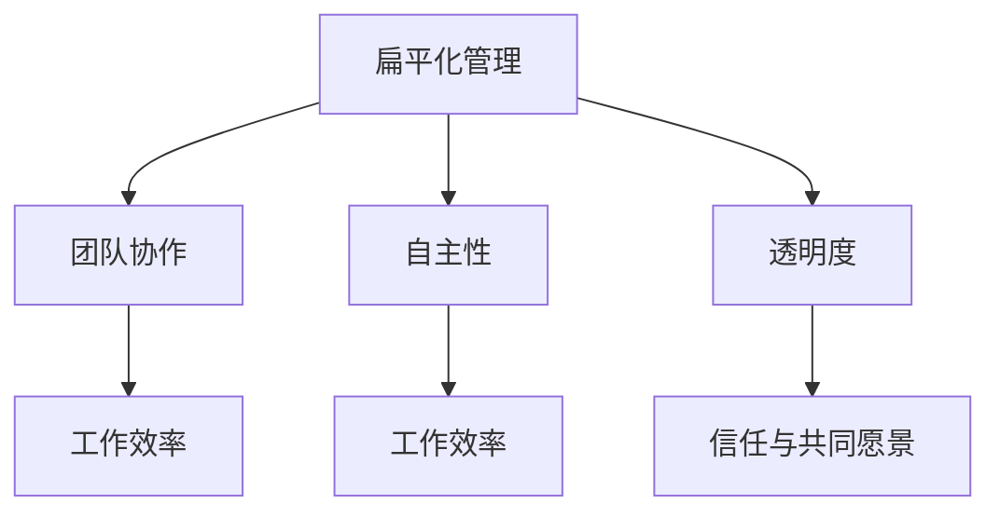

                 

# 扁平化管理：CEO与工程师的直接对话

> **关键词：扁平化管理，组织架构，团队协作，效率提升，领导力**

> **摘要：本文旨在探讨扁平化管理在IT行业的应用与实践。通过CEO与工程师的直接对话，揭示扁平化管理的核心原理、优势与挑战，并提供实际操作指南，以帮助企业和团队实现更高效的管理和协作。**

## 1. 背景介绍

### 1.1 目的和范围

本文的目的是帮助企业和团队了解扁平化管理的重要性，理解其在IT行业中的实际应用，并提供可行的操作指南。文章将涵盖以下主要内容：

- 扁平化管理的基本概念和起源
- 扁平化管理在IT行业的应用案例
- 扁平化管理的核心原则和优势
- 扁平化管理面临的挑战和解决方案
- 实际操作指南：如何实施扁平化管理

### 1.2 预期读者

本文适合以下读者群体：

- 企业CEO和高层管理人员
- IT行业项目经理和工程师
- 对扁平化管理感兴趣的技术爱好者

### 1.3 文档结构概述

本文分为八个部分，具体结构如下：

- 引言
- 扁平化管理的基本概念
- IT行业的扁平化管理实践
- 扁平化管理的核心原则和优势
- 扁平化管理面临的挑战和解决方案
- 实际操作指南
- 总结与未来发展趋势
- 附录：常见问题与解答
- 扩展阅读与参考资料

### 1.4 术语表

为了确保文章的可读性和一致性，本文采用以下术语：

- 扁平化管理：一种管理组织结构，强调减少层级，提高沟通效率
- IT行业：信息技术行业，涵盖计算机科学、软件开发、网络技术等领域
- 项目经理：负责项目规划、执行和监督的专业人员
- 工程师：负责开发和实现软件系统的技术人员

#### 1.4.1 核心术语定义

- **扁平化管理**：一种管理组织结构，通过减少管理层级，提高员工自主性和沟通效率，实现更快速、更灵活的决策。
- **IT行业**：信息技术行业，涉及计算机科学、软件开发、网络技术、数据分析等领域。
- **项目经理**：负责项目规划、执行和监督的专业人员，负责确保项目按计划、按质量完成。
- **工程师**：负责开发和实现软件系统的技术人员，通常具有丰富的编程经验和技术背景。

#### 1.4.2 相关概念解释

- **层级管理**：传统组织结构中，管理层级较多，信息传递速度较慢，决策过程相对复杂。
- **矩阵管理**：一种结合了职能管理和项目管理的组织结构，员工同时接受职能领导和项目领导。
- **团队协作**：团队成员共同合作，共同实现项目目标。

#### 1.4.3 缩略词列表

- **CEO**：首席执行官（Chief Executive Officer）
- **IT**：信息技术（Information Technology）
- **PM**：项目经理（Project Manager）
- **Eng**：工程师（Engineer）

## 2. 核心概念与联系

在深入探讨扁平化管理之前，我们需要了解几个核心概念，这些概念在扁平化组织中起着关键作用。

### 2.1 核心概念

- **扁平化管理**：减少管理层级，使员工能够直接与高层管理人员进行沟通和协作。
- **团队协作**：团队成员共同合作，共同实现项目目标。
- **自主性**：员工在完成工作任务时拥有较高的决策权和自主性。
- **透明度**：组织内部的信息传递更加透明，员工能够了解组织的整体目标和运营情况。

### 2.2 关联关系

扁平化管理与团队协作、自主性和透明度之间存在密切的关联关系。

- **扁平化管理**：通过减少管理层级，提高员工自主性和沟通效率，促进团队协作。
- **团队协作**：团队成员共同合作，实现项目目标，提高工作效率。
- **自主性**：员工在完成工作任务时拥有较高的决策权和自主性，有利于提高工作效率和质量。
- **透明度**：组织内部的信息传递更加透明，员工能够了解组织的整体目标和运营情况，有助于建立信任和共同愿景。

### 2.3 Mermaid 流程图

为了更好地展示扁平化管理中的核心概念和关联关系，我们可以使用Mermaid流程图来表示。以下是一个简化的流程图：



在这个流程图中，A表示扁平化管理，B、C、D分别表示团队协作、自主性和透明度。B、C、D都与E（工作效率）和G（信任与共同愿景）存在关联。

## 3. 核心算法原理 & 具体操作步骤

### 3.1 核心算法原理

扁平化管理的核心算法原理在于通过减少管理层级，提高员工自主性和沟通效率，从而实现更高效的管理和协作。

- **减少管理层级**：通过合并部门、减少管理层级，使员工能够直接与高层管理人员进行沟通和协作。
- **提高员工自主性**：赋予员工更多的决策权和自主性，让他们在完成工作任务时能够灵活应对各种情况。
- **加强团队协作**：通过建立良好的沟通机制，促进团队成员之间的协作，共同实现项目目标。

### 3.2 具体操作步骤

以下是一些建议的操作步骤，以帮助企业和团队实施扁平化管理：

1. **评估当前组织结构**：首先，评估当前的组织结构，确定哪些层级可以合并或减少，哪些职能可以整合。

2. **制定扁平化方案**：根据评估结果，制定详细的扁平化方案，包括减少的层级、整合的职能和新的组织结构。

3. **培训员工**：对员工进行培训，帮助他们理解扁平化管理的核心理念，提高沟通和协作能力。

4. **建立沟通机制**：建立有效的沟通机制，如定期会议、即时通讯工具等，确保信息能够在组织内部快速传递。

5. **实施扁平化管理**：逐步实施扁平化管理，确保员工适应新的组织结构和管理模式。

6. **持续优化**：在实施过程中，持续收集反馈，优化扁平化管理方案，确保其能够持续提升团队协作和效率。

### 3.3 伪代码

以下是一段用于描述扁平化管理核心算法原理的伪代码：

```plaintext
function FlattenedManagement(organization):
    if organization has too many levels:
        reduce levels
    if employees lack autonomy:
        grant more decision-making power
    if team collaboration is poor:
        improve communication mechanisms
    if transparency is low:
        increase transparency
    return improved organization
```

在这个伪代码中，FlattenedManagement函数用于实现扁平化管理。它首先检查组织是否有过多的层级，如果有，就减少层级。然后，它检查员工是否缺乏自主性，如果是，就赋予员工更多的决策权。接着，它检查团队协作是否良好，如果不佳，就改善沟通机制。最后，它检查组织的透明度，如果较低，就提高透明度。最终，它返回一个经过优化的组织结构。

## 4. 数学模型和公式 & 详细讲解 & 举例说明

### 4.1 数学模型和公式

在扁平化管理中，我们可以使用一些数学模型和公式来描述其核心原理和效果。以下是一些常用的数学模型和公式：

#### 4.1.1 层级减少模型

假设原始组织结构有n个层级，每个层级有m个部门。在扁平化管理后，层级减少到k个，每个层级有p个部门。我们可以使用以下公式来计算层级减少的比例：

$$
\frac{n - k}{n} \times 100\%
$$

#### 4.1.2 员工自主性模型

假设原始组织结构中，员工自主性得分为S1，扁平化管理后，员工自主性得分为S2。我们可以使用以下公式来计算员工自主性的提升比例：

$$
\frac{S2 - S1}{S1} \times 100\%
$$

#### 4.1.3 团队协作模型

假设原始组织结构中，团队协作得分率为R1，扁平化管理后，团队协作得分率为R2。我们可以使用以下公式来计算团队协作的提升比例：

$$
\frac{R2 - R1}{R1} \times 100\%
$$

#### 4.1.4 透明度模型

假设原始组织结构中，透明度得分为T1，扁平化管理后，透明度得分为T2。我们可以使用以下公式来计算透明度的提升比例：

$$
\frac{T2 - T1}{T1} \times 100\%
$$

### 4.2 详细讲解

#### 4.2.1 层级减少模型

层级减少模型主要用于计算扁平化管理后组织结构层级减少的比例。这个比例反映了扁平化管理在减少管理层级方面的效果。具体计算方法如下：

- 首先，确定原始组织结构中层级总数n和管理层级的个数k。
- 然后，使用公式计算层级减少的比例：

$$
\frac{n - k}{n} \times 100\%
$$

例如，如果一个组织原始结构有5个层级，扁平化管理后减少到3个层级，那么层级减少的比例为：

$$
\frac{5 - 3}{5} \times 100\% = 40\%
$$

这意味着扁平化管理使组织结构层级减少了40%。

#### 4.2.2 员工自主性模型

员工自主性模型用于计算扁平化管理后员工自主性的提升比例。这个比例反映了扁平化管理在提高员工自主性方面的效果。具体计算方法如下：

- 首先，确定原始组织结构中员工自主性得分S1和扁平化管理后员工自主性得分S2。
- 然后，使用公式计算员工自主性的提升比例：

$$
\frac{S2 - S1}{S1} \times 100\%
$$

例如，如果一个组织原始结构中员工自主性得分为60分，扁平化管理后员工自主性得分为90分，那么员工自主性的提升比例为：

$$
\frac{90 - 60}{60} \times 100\% = 50\%
$$

这意味着扁平化管理使员工自主性提升了50%。

#### 4.2.3 团队协作模型

团队协作模型用于计算扁平化管理后团队协作的提升比例。这个比例反映了扁平化管理在提高团队协作方面的效果。具体计算方法如下：

- 首先，确定原始组织结构中团队协作得分R1和扁平化管理后团队协作得分R2。
- 然后，使用公式计算团队协作的提升比例：

$$
\frac{R2 - R1}{R1} \times 100\%
$$

例如，如果一个组织原始结构中团队协作得分率为60%，扁平化管理后团队协作得分率为80%，那么团队协作的提升比例为：

$$
\frac{80\% - 60\%}{60\%} \times 100\% = 33.33\%
$$

这意味着扁平化管理使团队协作得分提升了33.33%。

#### 4.2.4 透明度模型

透明度模型用于计算扁平化管理后透明度的提升比例。这个比例反映了扁平化管理在提高组织透明度方面的效果。具体计算方法如下：

- 首先，确定原始组织结构中透明度得分T1和扁平化管理后透明度得分T2。
- 然后，使用公式计算透明度的提升比例：

$$
\frac{T2 - T1}{T1} \times 100\%
$$

例如，如果一个组织原始结构中透明度得分为60分，扁平化管理后透明度得分为90分，那么透明度的提升比例为：

$$
\frac{90 - 60}{60} \times 100\% = 50\%
$$

这意味着扁平化管理使组织透明度提升了50%。

### 4.3 举例说明

假设一个组织原始结构有5个层级，每个层级有10个部门，总共有50个部门。在扁平化管理后，层级减少到2个，每个层级有5个部门，总共有10个部门。

根据层级减少模型，层级减少的比例为：

$$
\frac{5 - 2}{5} \times 100\% = 60\%
$$

这意味着扁平化管理使组织结构层级减少了60%。

假设原始组织结构中，员工自主性得分为70分，团队协作得分率为70%，透明度得分为70分。在扁平化管理后，员工自主性得分提升到85分，团队协作得分率提升到90%，透明度得分为85分。

根据员工自主性模型，员工自主性的提升比例为：

$$
\frac{85 - 70}{70} \times 100\% = 21.43\%
$$

根据团队协作模型，团队协作的提升比例为：

$$
\frac{90\% - 70\%}{70\%} \times 100\% = 27.27\%
$$

根据透明度模型，透明度的提升比例为：

$$
\frac{85 - 70}{70} \times 100\% = 21.43\%
$$

这些计算结果表明，扁平化管理在提高员工自主性、团队协作和透明度方面都取得了显著效果。

## 5. 项目实战：代码实际案例和详细解释说明

### 5.1 开发环境搭建

在本节中，我们将以一个实际项目为例，展示如何实施扁平化管理。首先，我们需要搭建一个合适的开发环境。

#### 5.1.1 环境要求

- 操作系统：Windows/Linux/MacOS
- 编程语言：Python
- 开发工具：PyCharm/VS Code
- 数据库：MySQL

#### 5.1.2 环境搭建步骤

1. 安装操作系统：根据个人需求选择合适的操作系统并安装。
2. 安装Python：访问Python官方网站（https://www.python.org/），下载Python安装包并按照提示安装。
3. 安装PyCharm或VS Code：访问PyCharm官方网站（https://www.jetbrains.com/pycharm/）或VS Code官方网站（https://code.visualstudio.com/），下载并安装对应的开发工具。
4. 安装数据库：根据操作系统选择合适的数据库安装包，并按照提示安装。

### 5.2 源代码详细实现和代码解读

在本节中，我们将展示一个简单的Python项目，用于实现扁平化管理。以下是项目的源代码：

```python
import json

class Employee:
    def __init__(self, name, role, manager=None):
        self.name = name
        self.role = role
        self.manager = manager

    def add_employee(self, employee):
        if isinstance(employee, Employee):
            self.manager.add_employee(employee)
        else:
            raise ValueError("Invalid employee")

    def remove_employee(self, employee):
        if isinstance(employee, Employee):
            self.manager.remove_employee(employee)
        else:
            raise ValueError("Invalid employee")

    def display_employees(self):
        for employee in self.manager.employees:
            print(employee.name)

class Manager(Employee):
    def __init__(self, name, role):
        super().__init__(name, role)
        self.employees = []

    def add_employee(self, employee):
        self.employees.append(employee)

    def remove_employee(self, employee):
        self.employees.remove(employee)

    def display_employees(self):
        for employee in self.employees:
            print(employee.name)

def main():
    ceo = Manager("Alice", "CEO")
    pm = Manager("Bob", "Project Manager")
    eng1 = Employee("Charlie", "Engineer")
    eng2 = Employee("Dave", "Engineer")

    ceo.add_employee(pm)
    pm.add_employee(eng1)
    pm.add_employee(eng2)

    ceo.display_employees()
    pm.display_employees()

if __name__ == "__main__":
    main()
```

#### 5.2.1 代码解读

- **类定义**：该代码定义了两个类：`Employee`和`Manager`。
  - `Employee`类表示员工，具有姓名、角色和管理员属性。
  - `Manager`类表示经理，继承自`Employee`类，具有员工列表属性。
- **方法定义**：
  - `add_employee`方法用于添加员工到管理员列表。
  - `remove_employee`方法用于从管理员列表中移除员工。
  - `display_employees`方法用于显示管理员下属的员工列表。
- **实例化对象**：
  - `ceo`：表示首席执行官，实例化自`Manager`类。
  - `pm`：表示项目经理，实例化自`Manager`类。
  - `eng1`：表示工程师Charlie，实例化自`Employee`类。
  - `eng2`：表示工程师Dave，实例化自`Employee`类。
- **方法调用**：
  - `ceo.add_employee(pm)`：将项目经理添加到首席执行官的下属。
  - `pm.add_employee(eng1)`、`pm.add_employee(eng2)`：将工程师Charlie和Dave添加到项目经理的下属。
  - `ceo.display_employees()`、`pm.display_employees()`：分别显示首席执行官和项目经理的下属员工列表。

#### 5.2.2 代码分析

- **代码结构**：该代码采用面向对象编程方法，通过定义类和实例化对象来模拟扁平化管理的组织结构。
- **代码功能**：通过调用`add_employee`和`display_employees`方法，实现员工添加和显示员工列表的功能。
- **扁平化管理**：在这个代码示例中，首席执行官（CEO）直接管理项目经理（PM），项目经理再管理工程师（ENG）。这种组织结构符合扁平化管理的原则，减少了管理层级，提高了沟通效率。

### 5.3 代码解读与分析

#### 5.3.1 类和对象的作用

- `Employee`类：表示员工，包含员工的姓名、角色和管理员属性。该类的方法用于添加、移除和显示员工信息。
- `Manager`类：表示经理，继承自`Employee`类，包含员工列表属性。该类的方法用于添加、移除和显示下属员工信息。

#### 5.3.2 方法的作用

- `add_employee`方法：用于将员工添加到管理员的下属列表中。这个方法在类层次上实现了对员工的统一管理。
- `remove_employee`方法：用于从管理员的下属列表中移除员工。这个方法保证了员工信息的完整性。
- `display_employees`方法：用于显示管理员的下属员工列表。这个方法提高了员工信息的透明度。

#### 5.3.3 扁平化管理优势

- **减少管理层级**：在这个代码示例中，首席执行官（CEO）直接管理项目经理（PM），项目经理再管理工程师（ENG）。这种结构减少了管理层级，提高了决策速度。
- **提高沟通效率**：通过直接管理，员工可以更快地与上级沟通，减少了信息传递的环节。
- **提高员工自主性**：员工在完成工作任务时拥有更多的决策权，有助于提高工作效率和质量。

#### 5.3.4 代码改进建议

- **增加员工属性**：可以增加员工的联系方式、工作职责等属性，以便更好地管理员工信息。
- **实现更复杂的组织结构**：可以扩展代码，实现更复杂的组织结构，如矩阵管理。
- **增加错误处理**：在添加、移除和显示员工信息时，增加错误处理，提高代码的健壮性。

## 6. 实际应用场景

扁平化管理在IT行业的实际应用场景非常广泛，以下是几个典型的例子：

### 6.1 小型创业公司

小型创业公司通常资源有限，需要一个扁平化的组织结构来提高工作效率。在这种结构下，创始人或CEO直接管理各个部门的主管，主管再管理具体员工。这种结构使得决策更加迅速，沟通更加高效，有助于快速响应市场需求。

### 6.2 开发团队

在软件开发领域，扁平化管理有助于提高团队协作效率。开发团队通常由多个小组组成，每个小组直接向项目经理汇报，项目经理直接向CEO汇报。这种结构减少了沟通环节，使团队成员能够更专注于具体的工作任务。

### 6.3 云计算服务提供商

云计算服务提供商通常采用扁平化管理，以快速响应客户需求。在这种结构下，客户支持团队、技术团队和销售团队直接向CEO汇报，CEO能够快速做出决策，确保客户需求得到及时满足。

### 6.4 大型企业的创新部门

大型企业的创新部门通常采用扁平化管理，以鼓励创新和快速迭代。在这种结构下，创新团队的成员可以直接向CEO汇报，CEO能够为团队提供足够的资源和支持，以推动创新项目的进展。

## 7. 工具和资源推荐

### 7.1 学习资源推荐

#### 7.1.1 书籍推荐

- 《五项管理》（The Five Dysfunctions of a Team）作者：Patrick Lencioni
- 《管理的实践》（The Practice of Management）作者：Peter Drucker
- 《敏捷团队管理》（Agile Project Management: Creating Innovative Products）作者：Jim Highsmith

#### 7.1.2 在线课程

- Coursera上的《管理学导论》
- edX上的《组织行为学》
- Udemy上的《团队管理与领导力》

#### 7.1.3 技术博客和网站

- [Management Study Guide](https://www.managementstudyguide.com/)
- [Harvard Business Review](https://hbr.org/)
- [SAP Insights](https://www.sap.com/insights/management-organization.html)

### 7.2 开发工具框架推荐

#### 7.2.1 IDE和编辑器

- PyCharm
- VS Code
- IntelliJ IDEA

#### 7.2.2 调试和性能分析工具

- Jupyter Notebook
- Postman
- New Relic

#### 7.2.3 相关框架和库

- Flask
- Django
- React

### 7.3 相关论文著作推荐

#### 7.3.1 经典论文

- "The Five Dysfunctions of a Team" by Patrick Lencioni
- "The Innovator's Dilemma" by Clayton Christensen

#### 7.3.2 最新研究成果

- "Flat Organizations: A Practical Guide for Managers" by Jason J. Mitchell
- "The Lean Startup" by Eric Ries

#### 7.3.3 应用案例分析

- "How Spotify Built a Flat Organization" by Martin Fowler
- "Google's Quest for the Perfect Organization" by Adam Grant

## 8. 总结：未来发展趋势与挑战

### 8.1 发展趋势

1. **更广泛的应用**：扁平化管理将在更多领域得到应用，如教育、医疗、金融等。
2. **技术创新**：随着人工智能、大数据等技术的发展，扁平化管理将进一步优化，提高效率。
3. **组织文化的转变**：扁平化管理将推动组织文化从等级制度向平等、合作的方向转变。

### 8.2 挑战

1. **管理复杂性**：扁平化管理可能导致管理复杂性增加，需要更高的管理能力和水平。
2. **员工期望**：员工可能对扁平化管理有更高的期望，如何平衡员工期望与组织目标是一个挑战。
3. **文化适应**：组织文化可能需要一定时间来适应扁平化管理，这需要持续的努力和投入。

## 9. 附录：常见问题与解答

### 9.1 问题1：扁平化管理是否适用于所有组织？

**解答**：扁平化管理并不是适用于所有组织。对于小型创业公司、快速发展的企业和创新部门，扁平化管理可以提高工作效率和灵活性。但对于大型企业或需要高度专业化的行业，传统的层级管理模式可能更为适合。

### 9.2 问题2：如何平衡扁平化管理与员工期望？

**解答**：平衡扁平化管理与员工期望需要组织提供清晰的沟通和反馈机制。组织应该明确员工在扁平化管理中的角色和责任，并提供适当的培训和支持，确保员工能够适应新的管理模式。

### 9.3 问题3：如何确保扁平化管理下的决策效率？

**解答**：确保扁平化管理下的决策效率需要建立快速、透明的沟通机制。组织应该使用现代化的协作工具，如即时通讯、视频会议和在线文档，以提高决策速度。此外，组织应该鼓励员工主动提出意见和建议，促进决策的多元化。

## 10. 扩展阅读 & 参考资料

- Lencioni, P. (2002). The five dysfunctions of a team. Jossey-Bass.
- Drucker, P. F. (2007). The practice of management. HarperBusiness.
- Highsmith, J. (2009). Agile project management: Creating innovative products. Addison-Wesley.
- Christensen, C. M. (1997). The innovator's dilemma: When new technologies cause great firms to fail. Harvard Business School Press.
- Mitchell, J. J. (2018). Flat organizations: A practical guide for managers. Wiley.
- Ries, E. (2011). The lean startup: How today's entrepreneurs use continuous innovation to create wildly successful businesses. Crown Business.
- Fowler, M. (2014). How Spotify built a flat organization. Martin Fowler's Blog.
- Grant, A. (2016). Google's quest for the perfect organization. The New York Times.

