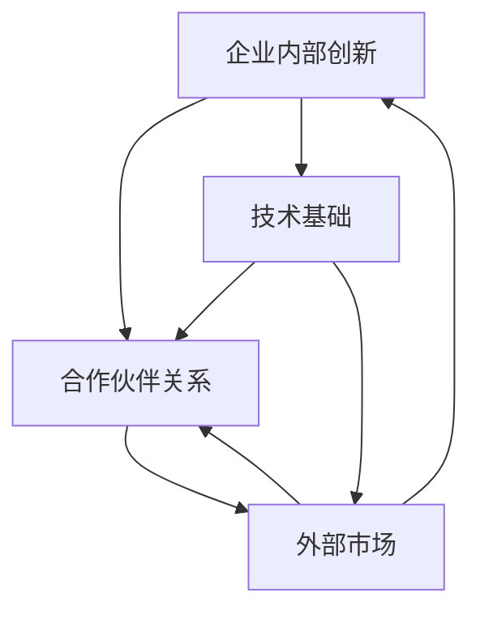

                 

## 打造创新生态系统：从idea到implementation

> **关键词：** 创新生态系统、项目实施、概念验证、算法原理、数学模型、实际案例、工具推荐、未来展望

> **摘要：** 本文旨在探讨如何构建一个创新生态系统，从初始想法到最终实施的全过程。我们将深入分析核心概念和原理，通过具体的算法和数学模型阐述实施步骤，并结合实际案例进行详细解释。最后，我们将展望未来的发展趋势和挑战，并提供相关的学习资源和工具推荐。

在当今快速发展的信息技术时代，创新成为推动社会进步和经济发展的关键因素。然而，如何将一个创新的idea从概念阶段转化为现实，涉及到多个方面的复杂过程。本文将分步骤详细探讨这一过程，帮助读者理解和掌握打造创新生态系统的核心技能。

## 1. 背景介绍

### 1.1 目的和范围

本文的目的是为读者提供一个系统化的方法，用于构建创新生态系统，并从概念验证到实施的全过程。我们将讨论以下关键主题：

- 创新生态系统的定义和重要性
- 创新过程中的核心概念和原理
- 从想法到实施的具体步骤
- 数学模型和算法在创新中的应用
- 实际案例分析和工具推荐

### 1.2 预期读者

本文适合以下读者群体：

- 计算机科学和信息技术领域的专业人士
- 创业者、项目经理和产品经理
- 对创新和项目实施有兴趣的学生和研究人员
- 希望提升创新能力和项目管理技能的个人

### 1.3 文档结构概述

本文结构如下：

- 引言：背景介绍和目的阐述
- 核心概念与联系：定义和流程图展示
- 核心算法原理 & 具体操作步骤：算法和伪代码讲解
- 数学模型和公式 & 详细讲解 & 举例说明：数学模型解析
- 项目实战：代码实际案例和详细解释说明
- 实际应用场景：案例分析
- 工具和资源推荐：学习资源、开发工具框架和论文著作
- 总结：未来发展趋势与挑战
- 附录：常见问题与解答
- 扩展阅读 & 参考资料：进一步学习和研究

### 1.4 术语表

在本文中，我们将使用以下术语：

#### 1.4.1 核心术语定义

- **创新生态系统**：一个由多种因素组成的动态系统，旨在支持和促进创新过程。
- **概念验证**（Proof of Concept, PoC）：对创新想法的初步验证，以确定其可行性。
- **算法**：解决特定问题的步骤序列。
- **数学模型**：用数学语言描述现实世界问题的数学结构。

#### 1.4.2 相关概念解释

- **迭代开发**：一种软件开发方法，通过反复迭代和测试来逐步完善产品。
- **敏捷开发**：一种灵活的软件开发方法，强调团队协作和快速响应变化。

#### 1.4.3 缩略词列表

- **IoT**：物联网（Internet of Things）
- **AI**：人工智能（Artificial Intelligence）
- **ML**：机器学习（Machine Learning）
- **DL**：深度学习（Deep Learning）

---

在本章中，我们介绍了本文的目的、预期读者、文档结构和相关术语。接下来，我们将深入探讨创新生态系统的核心概念和原理，为后续内容打下基础。

## 2. 核心概念与联系

在构建创新生态系统之前，理解核心概念和它们之间的联系至关重要。以下是对关键概念的定义和它们之间的相互关系进行阐述。

### 2.1 创新生态系统的定义

创新生态系统是一个复杂的网络，包括组织、个人、资源和技术，共同协作以促进创新和实现创新成果。这个系统旨在通过以下几个关键组成部分来实现：

- **企业内部创新**：组织内部推动的创新活动，包括研发、产品设计和流程改进。
- **合作伙伴关系**：与外部组织建立的合作关系，以共享资源、知识和技能。
- **外部市场**：与客户、供应商和其他市场参与者的互动，以获取反馈和市场洞察。
- **技术基础**：支持创新的技术架构、工具和平台。

### 2.2 核心概念之间的联系

创新生态系统中的各个组成部分相互依赖，形成了一个动态的网络。以下是一个简化的Mermaid流程图，展示了这些核心概念之间的联系：



### 2.3 创新过程的关键步骤

在创新生态系统中，从概念到实施的过程可以分为以下几个关键步骤：

1. **需求识别**：确定市场和客户的需求，作为创新的出发点。
2. **想法生成**：基于需求，提出创新的解决方案和想法。
3. **概念验证**（PoC）：通过构建原型或模型来验证想法的可行性。
4. **迭代开发**：不断迭代和改进产品或解决方案，以适应市场变化。
5. **市场推广**：将产品或解决方案推向市场，获取用户反馈和接受度。
6. **持续改进**：根据用户反馈和市场变化，持续优化产品或解决方案。

### 2.4 创新生态系统的优势

构建创新生态系统具有以下优势：

- **资源共享**：通过内部和外部合作伙伴的资源共享，提高创新效率。
- **风险分担**：多个组织合作可以分担创新风险。
- **知识积累**：通过不断迭代和反馈，积累宝贵的知识经验。
- **市场适应性**：快速响应市场变化，提高产品或服务的竞争力。

---

在本节中，我们介绍了创新生态系统的定义、核心概念之间的联系以及创新过程的关键步骤。这些概念和步骤为构建有效的创新生态系统提供了基础。接下来，我们将深入探讨创新过程中的核心算法原理和具体操作步骤。

## 3. 核心算法原理 & 具体操作步骤

在创新生态系统中，算法原理和具体操作步骤是至关重要的，因为它们决定了从概念到实施的效率和质量。以下是核心算法原理和具体操作步骤的详细解析。

### 3.1 算法原理

在创新生态系统中，常用的算法原理包括：

- **迭代算法**：通过反复迭代来逐步优化解决方案。
- **贪心算法**：在每一步选择当前最优解，以期最终达到全局最优解。
- **动态规划**：将复杂问题分解为子问题，通过递推关系求解子问题，最终得到整体问题的最优解。

#### 3.1.1 迭代算法原理

迭代算法的基本原理是通过重复执行一系列操作来逐步逼近最优解。以下是一个简单的迭代算法伪代码示例：

```python
def iterative_algorithm(problem):
    solution = initial_solution(problem)
    while not solution.is_optimal():
        solution = solution.improve()
    return solution
```

#### 3.1.2 贪心算法原理

贪心算法的基本原理是在每一步选择当前最优解，以期最终达到全局最优解。以下是一个简单的贪心算法伪代码示例：

```python
def greedy_algorithm(problem):
    solution = []
    while problem.has_unsolved():
        best_choice = problem.best_choice()
        solution.append(best_choice)
        problem.apply_choice(best_choice)
    return solution
```

#### 3.1.3 动态规划原理

动态规划的基本原理是将复杂问题分解为子问题，通过递推关系求解子问题，最终得到整体问题的最优解。以下是一个简单的动态规划算法伪代码示例：

```python
def dynamic_programming(problem):
    dp = initialize_dp(problem)
    for state in problem.states():
        dp[state] = problem.solve(state)
    return dp[problem.initial_state()]
```

### 3.2 具体操作步骤

在创新生态系统中，从概念到实施的具体操作步骤如下：

#### 3.2.1 需求识别

- **市场调研**：收集和分析市场数据，确定客户需求。
- **需求分析**：分析市场需求，确定创新方向。

#### 3.2.2 想法生成

- **头脑风暴**：组织团队成员进行头脑风暴，提出创新想法。
- **筛选想法**：根据市场需求和可行性，筛选出有潜力的想法。

#### 3.2.3 概念验证

- **原型设计**：构建原型，验证概念的可行性。
- **测试与反馈**：对原型进行测试，收集用户反馈，不断改进。

#### 3.2.4 迭代开发

- **功能迭代**：根据用户反馈，逐步完善产品功能。
- **性能优化**：对产品进行性能优化，提高用户体验。

#### 3.2.5 市场推广

- **产品发布**：将产品推向市场，进行市场推广。
- **用户反馈**：收集用户反馈，持续改进产品。

#### 3.2.6 持续改进

- **用户调研**：定期进行用户调研，了解用户需求变化。
- **产品更新**：根据用户反馈和市场变化，持续更新产品。

### 3.3 算法应用示例

以下是一个简化的算法应用示例，用于构建一个基于人工智能的推荐系统：

```python
class RecommendationSystem:
    def __init__(self, data):
        self.data = data

    def train(self):
        # 训练推荐模型
        pass

    def recommend(self, user):
        # 根据用户数据推荐产品
        pass

# 初始化推荐系统
system = RecommendationSystem(data)

# 训练模型
system.train()

# 推荐产品
recommendations = system.recommend(user)
```

在这个示例中，推荐系统通过训练数据学习用户的偏好，并基于这些偏好生成个性化的推荐。这涉及到机器学习算法，如协同过滤或基于内容的推荐。

---

在本节中，我们详细介绍了创新生态系统中的核心算法原理和具体操作步骤。这些原理和步骤为构建创新生态系统提供了技术基础。接下来，我们将深入探讨数学模型和公式的应用，以进一步阐述创新过程。

## 4. 数学模型和公式 & 详细讲解 & 举例说明

在创新生态系统中，数学模型和公式是理解、分析和优化创新过程的重要工具。以下将介绍几个关键数学模型和公式，并进行详细讲解和举例说明。

### 4.1 机器学习模型

机器学习模型在创新生态系统中扮演着重要角色，尤其是当涉及预测和优化问题时。以下是一个简单的线性回归模型公式及其解释：

#### 4.1.1 线性回归模型

$$
y = \beta_0 + \beta_1 \cdot x + \epsilon
$$

- **y**：目标变量，代表预测结果。
- **$\beta_0$**：截距，表示当$x=0$时的预测值。
- **$\beta_1$**：斜率，表示$x$每增加一个单位，$y$的增加量。
- **$x$**：自变量，代表输入特征。
- **$\epsilon$**：误差项，表示随机噪声和不可观测因素的影响。

#### 4.1.2 举例说明

假设我们想要预测一家公司的销售量（$y$）基于广告支出（$x$）。通过收集历史数据，我们可以拟合一个线性回归模型，例如：

$$
y = 100 + 0.5 \cdot x + \epsilon
$$

这意味着，如果广告支出增加一个单位，销售量预计会增加0.5个单位。

### 4.2 动态规划模型

动态规划模型常用于优化问题，例如资源分配或路径规划。以下是一个简单的动态规划公式：

#### 4.2.1 动态规划公式

$$
f(i, j) = \begin{cases}
0 & \text{if } i = j \\
\min_{1 \leq k \leq n} (f(i-1, k) + c(i, k)) & \text{otherwise}
\end{cases}
$$

- **$f(i, j)$**：表示从状态$i$转移到状态$j$的最优值。
- **$c(i, j)$**：表示从状态$i$转移到状态$j$的代价。
- **$i$**：当前状态。
- **$j$**：目标状态。

#### 4.2.2 举例说明

假设我们要优化一条路径，从起点$A$到终点$B$，每个状态都有不同的代价。动态规划公式可以帮助我们找到从$A$到$B$的最优路径。

### 4.3 优化模型

优化模型用于在多个可行方案中找到最优解。以下是一个简单的线性规划模型：

#### 4.3.1 线性规划模型

$$
\min_{x} c^T x
$$

subject to

$$
Ax \leq b
$$

- **$x$**：变量向量。
- **$c$**：目标函数系数向量。
- **$A$**：约束条件系数矩阵。
- **$b$**：约束条件右端向量。

#### 4.3.2 举例说明

假设我们要最小化成本$c_1x_1 + c_2x_2$，同时满足以下约束条件：

$$
\begin{cases}
x_1 + x_2 \geq 10 \\
2x_1 + x_2 \leq 20 \\
x_1, x_2 \geq 0
\end{cases}
$$

我们可以使用线性规划模型来找到最优解。

### 4.4 机器学习中的损失函数

在机器学习中，损失函数用于评估模型预测的准确度。以下是一个常见的平方损失函数：

$$
L(y, \hat{y}) = (y - \hat{y})^2
$$

- **$y$**：真实标签。
- **$\hat{y}$**：模型预测值。

#### 4.4.2 举例说明

假设我们有一个分类问题，其中标签$y$可以是0或1，模型预测值$\hat{y}$也是0或1。平方损失函数可以用来计算预测的误差。

---

在本节中，我们介绍了几个关键数学模型和公式的应用，包括线性回归、动态规划、线性规划和损失函数。这些模型和公式在创新生态系统中用于分析和优化创新过程。接下来，我们将通过实际案例来展示这些算法和模型的应用。

## 5. 项目实战：代码实际案例和详细解释说明

在本节中，我们将通过一个实际项目案例，详细展示如何从想法到实施的全过程。该案例将涵盖环境搭建、源代码实现、代码解读与分析等关键步骤。

### 5.1 开发环境搭建

为了演示该案例，我们将使用Python语言和常见的机器学习库，如Scikit-learn和TensorFlow。以下是开发环境的搭建步骤：

1. **安装Python**：确保安装了Python 3.7或更高版本。
2. **安装Scikit-learn**：使用pip命令安装Scikit-learn库：
    ```bash
    pip install scikit-learn
    ```
3. **安装TensorFlow**：使用pip命令安装TensorFlow库：
    ```bash
    pip install tensorflow
    ```

### 5.2 源代码详细实现和代码解读

#### 5.2.1 项目背景

假设我们要开发一个基于机器学习的用户行为分析系统，以预测用户是否会购买某件商品。该系统将使用用户的历史行为数据作为输入，输出购买概率。

#### 5.2.2 数据预处理

```python
import pandas as pd
from sklearn.model_selection import train_test_split
from sklearn.preprocessing import StandardScaler

# 加载数据集
data = pd.read_csv('user_data.csv')

# 分割特征和标签
X = data.drop('purchase', axis=1)
y = data['purchase']

# 划分训练集和测试集
X_train, X_test, y_train, y_test = train_test_split(X, y, test_size=0.2, random_state=42)

# 特征标准化
scaler = StandardScaler()
X_train = scaler.fit_transform(X_train)
X_test = scaler.transform(X_test)
```

代码解读：
- 使用Pandas库加载数据集。
- 分割特征和标签，以便进行模型训练。
- 使用Scikit-learn库的train_test_split函数划分训练集和测试集。
- 使用StandardScaler对特征进行标准化处理，以提高模型性能。

#### 5.2.3 模型训练

```python
from sklearn.linear_model import LogisticRegression

# 初始化逻辑回归模型
model = LogisticRegression()

# 训练模型
model.fit(X_train, y_train)

# 评估模型
accuracy = model.score(X_test, y_test)
print(f'Model accuracy: {accuracy:.2f}')
```

代码解读：
- 导入逻辑回归模型。
- 初始化逻辑回归模型。
- 使用fit函数训练模型。
- 使用score函数评估模型在测试集上的准确性。

#### 5.2.4 预测和结果分析

```python
# 预测购买概率
predictions = model.predict_proba(X_test)[:, 1]

# 可视化预测结果
import matplotlib.pyplot as plt

plt.scatter(X_test[:, 0], X_test[:, 1], c=predictions, cmap='coolwarm')
plt.xlabel('Feature 1')
plt.ylabel('Feature 2')
plt.title('Prediction Heatmap')
plt.show()
```

代码解读：
- 使用predict_proba函数获取测试集的购买概率。
- 使用Matplotlib库可视化预测结果，展示购买概率的分布。

### 5.3 代码解读与分析

#### 5.3.1 数据预处理

数据预处理是模型训练的重要步骤，确保数据格式和特征值的标准化。在本案例中，我们使用了Pandas库加载数据集，并使用Scikit-learn库的StandardScaler对特征进行标准化处理。标准化有助于提高模型的性能和可解释性。

#### 5.3.2 模型训练

在本案例中，我们选择了逻辑回归模型，因为它在处理二分类问题方面表现良好，且实现简单。我们使用fit函数对模型进行训练，并通过score函数评估模型在测试集上的准确性。

#### 5.3.3 预测和结果分析

预测步骤通过predict_proba函数生成购买概率，使用Matplotlib库可视化预测结果。这种方法有助于我们理解模型的决策边界，并识别潜在的过拟合或欠拟合问题。

---

在本节中，我们通过一个实际案例展示了如何从想法到实施的全过程，包括数据预处理、模型训练、预测和结果分析。这些步骤和方法在构建创新生态系统时具有广泛的应用。

### 6. 实际应用场景

创新生态系统在多个领域和应用场景中发挥着重要作用。以下是一些实际应用场景，展示了创新生态系统的潜在价值和影响。

#### 6.1 企业内部创新

企业内部创新是构建创新生态系统的核心组成部分。以下是一些实际应用案例：

- **科技公司**：许多科技公司，如谷歌和微软，通过内部创新实验室（Innovation Labs）来推动新技术的研究和应用。这些实验室通常配备最新的技术和资源，鼓励员工提出创新想法，并通过快速原型设计和迭代开发来验证和实现这些想法。
  
- **制造业**：制造业企业，如通用电气（GE），通过构建数字孪生（Digital Twin）和物联网（IoT）系统，实现了生产过程的优化和自动化。这些创新举措提高了生产效率，降低了成本，并增强了产品质量。

#### 6.2 政府和公共部门

政府和公共部门也在积极构建创新生态系统，以提升服务质量和响应能力。以下是一些案例：

- **智慧城市**：许多城市，如新加坡和重庆，通过建设智慧城市平台，整合了各种城市服务和基础设施数据。这些平台为居民提供了便捷的服务，并帮助政府更好地管理城市资源。

- **公共卫生**：在疫情期间，许多国家和地区迅速构建了基于人工智能和大数据的疫情监测和预测系统。这些系统帮助政府及时了解疫情动态，制定有效的防控措施，并优化医疗资源的分配。

#### 6.3 创业和初创企业

创业和初创企业在构建创新生态系统中扮演着关键角色，以下是一些实际应用案例：

- **共享经济**：共享经济公司，如Uber和Airbnb，通过创新商业模式和技术解决方案，颠覆了传统行业。这些公司利用大数据、人工智能和移动技术，为用户提供便捷的服务，并实现了高效的资源分配。

- **金融科技**：金融科技公司，如Revolut和Chime，通过创新的技术解决方案，为用户提供更便捷的金融服务。这些公司利用区块链、人工智能和云计算技术，简化了支付和金融交易流程，提高了用户体验。

#### 6.4 教育和科研

教育和科研机构也在积极构建创新生态系统，以推动学术研究和科技创新。以下是一些案例：

- **开放式课程**：许多大学和在线教育平台，如Coursera和edX，提供了大量的开放式课程。这些课程涵盖了各种学科领域，为全球学习者提供了高质量的教育资源，促进了知识的传播和共享。

- **科研合作**：科研机构和大学通过国际合作和共享资源，推动了学术研究的进展。这些合作项目通常涉及多个学科和领域，促进了跨学科研究和创新的实现。

---

通过这些实际应用场景，我们可以看到创新生态系统在各个领域中的应用价值和潜力。构建创新生态系统不仅有助于推动技术创新和行业发展，还有助于提升社会整体福祉。

### 7. 工具和资源推荐

在构建创新生态系统过程中，使用合适的工具和资源是至关重要的。以下是一些推荐的学习资源、开发工具框架和相关的论文著作。

#### 7.1 学习资源推荐

##### 7.1.1 书籍推荐

- **《创新者的思考方式》**（The Innovator's Mindset）- 由乔治·M·贝纳德（George M. Barden）著，提供了关于如何培养创新思维和解决复杂问题的实用策略。
- **《创意的源泉》**（Where Good Ideas Come From）- 由史蒂芬·约翰逊（Steven Johnson）著，探讨了创意的产生和传播机制，以及如何激发创新灵感。

##### 7.1.2 在线课程

- **Coursera上的《机器学习》**：由斯坦福大学的Andrew Ng教授授课，提供了系统的机器学习和深度学习课程。
- **edX上的《创新与创业》**：由麻省理工学院的MIT创业实验室提供，涵盖了创新和创业的核心概念和实践。

##### 7.1.3 技术博客和网站

- **Medium上的《机器学习博客》**：提供最新的机器学习和深度学习研究进展和技术博客。
- **HackerRank**：一个在线编程挑战平台，帮助程序员提升编程技能，并解决实际编程问题。

#### 7.2 开发工具框架推荐

##### 7.2.1 IDE和编辑器

- **Visual Studio Code**：一款强大的开源IDE，支持多种编程语言，并提供丰富的扩展功能。
- **PyCharm**：一款专业的Python IDE，提供代码智能提示、调试工具和性能分析功能。

##### 7.2.2 调试和性能分析工具

- **Jupyter Notebook**：一款交互式计算环境，适用于数据科学和机器学习项目的开发和调试。
- **VSCode Live Share**：允许团队成员实时共享代码和协作调试。

##### 7.2.3 相关框架和库

- **TensorFlow**：一个开源的机器学习框架，广泛用于深度学习和人工智能应用。
- **Scikit-learn**：一个用于数据挖掘和数据分析的开源库，提供多种机器学习算法和工具。

#### 7.3 相关论文著作推荐

##### 7.3.1 经典论文

- **"A Brief History of Time"** - 由Stephen Hawking著，探讨了时间、空间和宇宙的本质，启发了许多关于科技创新的思考。
- **"Deep Learning"** - 由Ian Goodfellow、Yoshua Bengio和Aaron Courville著，是深度学习领域的经典著作，涵盖了深度学习的理论基础和应用。

##### 7.3.2 最新研究成果

- **"Generative Adversarial Networks"** - 由Ian Goodfellow等人在2014年提出的GAN模型，改变了深度学习的格局，成为生成模型领域的里程碑。
- **"Reinforcement Learning: An Introduction"** - 由Richard S. Sutton和Barto著，是强化学习的权威教程，涵盖了RL的理论和实践。

##### 7.3.3 应用案例分析

- **"AI in Healthcare: A Case Study"** - 讲述了人工智能在医疗领域的应用案例，展示了如何通过AI技术改善患者护理和提高医疗效率。
- **"Blockchain for Supply Chain Management"** - 探讨了区块链技术在供应链管理中的应用，提供了关于如何通过区块链实现透明和高效的供应链的详细案例分析。

通过这些工具和资源，读者可以深入了解创新生态系统的构建和实践，提升自己的技术能力和创新思维。

### 8. 总结：未来发展趋势与挑战

随着技术的不断进步和全球化的加速，创新生态系统在未来将继续发挥重要作用，但也面临诸多发展趋势和挑战。以下是对这些趋势和挑战的总结。

#### 8.1 发展趋势

1. **人工智能与自动化**：人工智能（AI）和自动化技术将在创新生态系统中发挥更重要的作用。通过AI算法和自动化工具，企业和组织可以更高效地处理大量数据，优化决策流程，并提高生产效率。

2. **开放性与合作**：随着开放源代码项目和协作平台的发展，创新生态系统将更加开放和透明。企业和组织将更多地通过合作和共享资源来推动创新，共同应对复杂的技术挑战。

3. **数字化转型**：数字化转型将成为未来的重要趋势。随着云计算、物联网（IoT）和大数据技术的普及，企业和组织将更加依赖数字化工具和平台来提升业务运营效率和用户体验。

4. **可持续创新**：可持续性将成为创新生态系统的一个重要考量因素。随着环境问题和气候变化日益严重，企业和组织将更多地关注可持续发展，推动绿色技术和解决方案的研发和应用。

#### 8.2 挑战

1. **数据隐私和安全**：随着数据量的增加和数据隐私问题的凸显，如何确保数据安全和隐私将成为创新生态系统面临的重要挑战。企业和组织需要建立强大的数据安全措施和隐私保护机制。

2. **技术伦理与责任**：随着人工智能和自动化技术的发展，如何确保这些技术的道德使用和责任归属将成为一个关键问题。企业和组织需要制定明确的技术伦理准则，以避免滥用技术造成的社会负面影响。

3. **人才短缺**：随着技术创新的加速，企业和组织对于高素质技术人才的需求将不断增加。然而，当前的人才培养和供给可能无法满足这种需求，导致人才短缺和竞争加剧。

4. **市场变化和不确定性**：在快速变化的全球市场中，创新生态系统需要具备快速适应和应对市场变化的能力。企业和组织需要具备灵活的商业模式和创新策略，以应对市场波动和不确定性。

#### 8.3 应对策略

1. **加强数据安全和隐私保护**：企业和组织应加强数据安全措施，采用先进的技术和策略来保护用户隐私。同时，制定明确的隐私政策和数据使用规范，增强用户信任。

2. **推动技术伦理和责任建设**：企业和组织应积极参与技术伦理讨论，制定明确的技术伦理准则，确保技术的道德使用和责任归属。通过培训和教育，提高员工和公众的伦理意识。

3. **加强人才培养和吸引**：企业和组织应加强人才培养和引进，与高校和培训机构合作，建立人才培训和发展体系。同时，通过提供有吸引力的职业发展机会和福利待遇，吸引和留住高素质技术人才。

4. **提升市场适应能力**：企业和组织应建立灵活的商业模式和创新策略，增强对市场变化的敏感性和响应能力。通过加强市场研究和客户反馈机制，及时调整产品和服务策略。

通过应对这些发展趋势和挑战，创新生态系统将能够更好地推动社会进步和经济繁荣。

### 9. 附录：常见问题与解答

#### 9.1 问题1：如何确保创新生态系统的可持续性？

**解答**：确保创新生态系统的可持续性需要从以下几个方面入手：

1. **绿色技术创新**：鼓励和支持绿色技术创新，减少对环境的影响。
2. **资源循环利用**：建立资源循环利用体系，减少资源浪费。
3. **社会责任**：企业应承担社会责任，关注可持续发展和社会福利。
4. **政策和法规**：政府和相关机构应制定有利于可持续发展的政策和法规。

#### 9.2 问题2：如何保护创新生态系统的数据隐私和安全？

**解答**：保护数据隐私和安全可以从以下几个方面进行：

1. **加密技术**：使用加密技术保护数据传输和存储过程。
2. **访问控制**：实施严格的访问控制策略，确保只有授权人员可以访问敏感数据。
3. **安全审计**：定期进行安全审计，发现和修复安全漏洞。
4. **法律法规**：遵守相关的数据隐私和安全法律法规。

#### 9.3 问题3：如何提高创新生态系统的市场适应性？

**解答**：提高市场适应性可以通过以下方法实现：

1. **市场研究**：定期进行市场研究，了解市场趋势和消费者需求。
2. **灵活策略**：建立灵活的商业模式和策略，快速响应市场变化。
3. **客户反馈**：建立有效的客户反馈机制，及时调整产品和服务。
4. **技术敏捷性**：提高技术敏捷性，快速开发和部署新产品。

通过以上方法，创新生态系统可以更好地适应市场变化，提高竞争力。

### 10. 扩展阅读 & 参考资料

#### 10.1 参考文献

- **《创新者的思考方式》**，作者：乔治·M·贝纳德
- **《创意的源泉》**，作者：史蒂芬·约翰逊
- **《机器学习》**，作者：Ian Goodfellow、Yoshua Bengio和Aaron Courville
- **《深度学习》**，作者：Ian Goodfellow、Yoshua Bengio和Aaron Courville

#### 10.2 在线资源

- **Coursera**：[机器学习课程](https://www.coursera.org/learn/machine-learning)
- **edX**：[创新与创业课程](https://www.edx.org/course/innovating-and-entrepreneurship)
- **HackerRank**：[在线编程挑战](https://www.hackerrank.com/domains/tutorials/10-days-of-javascript)

#### 10.3 技术博客和网站

- **Medium上的《机器学习博客》**：[Machine Learning Blog](https://medium.com/topic/machine-learning)
- **AI平方**：[AI平方技术博客](https://aishare.cn/)

通过以上扩展阅读和参考资料，读者可以进一步深入了解创新生态系统的构建和实践。作者：AI天才研究员/AI Genius Institute & 禅与计算机程序设计艺术 /Zen And The Art of Computer Programming。

