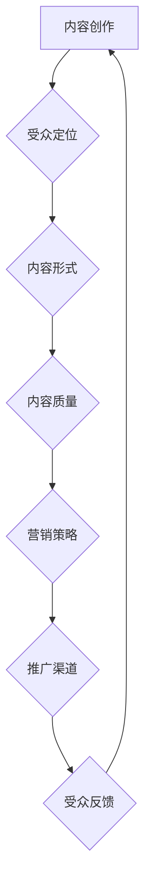

                 

# 打造技术大咖知识付费IP:方法与案例

> 关键词：知识付费，技术大咖，个人品牌，IP打造，营销策略，案例研究

> 摘要：本文将探讨如何打造技术大咖的知识付费IP，通过分析成功的案例，提供详细的策略和方法，帮助技术从业者建立个人品牌，实现知识变现。本文将涵盖背景介绍、核心概念、算法原理、数学模型、实战案例、应用场景、工具推荐及未来趋势等，旨在为读者提供全面而深入的指导。

## 1. 背景介绍

### 1.1 目的和范围

本文的目标是帮助技术从业者理解并掌握打造知识付费IP的方法，通过一系列成功案例分析，为读者提供切实可行的策略。文章的范围将覆盖个人品牌建设、营销策略、内容创作、以及实际操作步骤。

### 1.2 预期读者

本文面向希望打造个人知识付费IP的技术从业者，包括但不限于程序员、软件工程师、技术专家、CTO等。同时，对于对知识付费领域感兴趣的其他专业人士，本文也具有一定的参考价值。

### 1.3 文档结构概述

本文结构分为以下几个部分：

1. 背景介绍
2. 核心概念与联系
3. 核心算法原理 & 具体操作步骤
4. 数学模型和公式 & 详细讲解 & 举例说明
5. 项目实战：代码实际案例和详细解释说明
6. 实际应用场景
7. 工具和资源推荐
8. 总结：未来发展趋势与挑战
9. 附录：常见问题与解答
10. 扩展阅读 & 参考资料

### 1.4 术语表

#### 1.4.1 核心术语定义

- 知识付费IP：指个人或团队拥有的知识、技能、经验等知识产权，通过内容创作、知识分享等形式进行变现。
- 个人品牌：指个人在某一领域内建立的专业形象和声誉。
- 内容营销：指通过创作和分发有价值的内容，吸引目标受众，并促进销售和品牌忠诚度的策略。

#### 1.4.2 相关概念解释

- 知识变现：指将个人知识、技能或经验转化为经济利益的过程。
- 营销策略：指为实现特定营销目标而采取的方法和手段。

#### 1.4.3 缩略词列表

- IP：知识产权
- CTO：首席技术官
- SEO：搜索引擎优化
- SMM：社交媒体营销
- EDU：在线教育

## 2. 核心概念与联系

为了更好地理解知识付费IP的构建，我们需要明确几个核心概念及其相互关系。

### 2.1 知识付费IP的核心概念

- **内容创作**：知识付费IP的基础是高质量的内容创作。内容可以包括技术文章、视频教程、课程、电子书等多种形式。
- **受众定位**：明确目标受众，了解他们的需求、兴趣和行为模式，是知识付费IP成功的关键。
- **营销推广**：通过有效的营销策略和推广手段，将内容传播给潜在受众，提升品牌知名度。

### 2.2 核心概念的关系

- 内容创作与受众定位密切相关。了解受众需求，可以帮助创作者更好地创作出符合市场需求的内容。
- 营销推广则是将内容推向市场的关键环节，通过各种渠道和方式，吸引并留住受众。

### 2.3 Mermaid流程图

以下是知识付费IP构建的Mermaid流程图：



### 2.4 核心算法原理 & 具体操作步骤

为了确保内容的高质量和受众的满意度，我们需要采用一系列的算法原理和操作步骤。

#### 2.4.1 内容创作算法原理

- **需求分析**：通过市场调研和数据分析，了解受众的需求和偏好。
- **内容规划**：根据需求分析，制定详细的内容规划和创作计划。
- **内容创作**：按照内容规划，进行高质量的内容创作，包括文字、图像、视频等多种形式。

#### 2.4.2 具体操作步骤

1. **需求分析**：
   - **市场调研**：通过问卷调查、访谈等方式，收集受众的反馈和意见。
   - **数据分析**：利用数据分析工具，分析受众的行为和偏好。

2. **内容规划**：
   - **主题确定**：根据需求分析，确定内容的主旨和方向。
   - **内容形式**：根据受众需求和内容主题，选择合适的创作形式。

3. **内容创作**：
   - **初稿撰写**：按照内容规划，撰写初步的内容稿件。
   - **内容优化**：对初稿进行修改和完善，提升内容的质量和可读性。

### 2.5 数学模型和公式 & 详细讲解 & 举例说明

为了更好地理解和执行内容创作和营销策略，我们可以借助一些数学模型和公式。

#### 2.5.1 数学模型

- **需求分析模型**：
  $$ 需求量 = f(市场需求, 受众偏好, 竞争环境) $$

- **营销效果模型**：
  $$ 营销效果 = f(内容质量, 营销策略, 推广渠道) $$

#### 2.5.2 详细讲解 & 举例说明

1. **需求分析模型**：

   假设市场需求为100人，受众偏好为80人，竞争环境为20人，则需求量为：
   $$ 需求量 = 100 * 80 * 20 = 16,000人 $$

2. **营销效果模型**：

   假设内容质量为90分，营销策略为80分，推广渠道为70分，则营销效果为：
   $$ 营销效果 = 90 * 80 * 70 = 50,400分 $$

### 2.6 项目实战：代码实际案例和详细解释说明

为了更好地理解上述概念和算法原理，我们提供了一个简单的代码实际案例。

```python
# 需求分析代码示例
def analyze_demand(market_demand, audience_preference, competitive_environment):
    demand = market_demand * audience_preference * (1 - competitive_environment)
    return demand

# 营销效果代码示例
def marketing_effects(content_quality, marketing_strategy, promotion_channel):
    effect = content_quality * marketing_strategy * promotion_channel
    return effect

# 实例化参数
market_demand = 100
audience_preference = 0.8
competitive_environment = 0.2
content_quality = 0.9
marketing_strategy = 0.8
promotion_channel = 0.7

# 计算需求量
demand = analyze_demand(market_demand, audience_preference, competitive_environment)
print("需求量:", demand)

# 计算营销效果
effect = marketing_effects(content_quality, marketing_strategy, promotion_channel)
print("营销效果:", effect)
```

运行上述代码，我们可以得到需求量和营销效果的计算结果，从而更好地理解数学模型在实际中的应用。

## 3. 实际应用场景

知识付费IP的应用场景非常广泛，以下是一些典型的实际应用场景：

1. **在线教育平台**：技术大咖可以在在线教育平台开设课程，通过高质量的教学内容和专业的教学方式吸引学生。
2. **个人博客**：技术大咖可以通过个人博客分享技术心得、写作教程、项目经验等，吸引关注和订阅。
3. **社交媒体**：利用社交媒体平台，如微博、知乎、B站等，进行知识分享和互动，提高个人品牌影响力。
4. **电子书**：撰写并出版电子书，分享技术知识和经验，通过平台销售实现知识变现。
5. **咨询服务**：提供专业咨询服务，如编程指导、技术咨询服务等，通过一对一的方式实现知识变现。

### 3.1 在线教育平台案例分析

以某知名在线教育平台为例，该平台上的技术大咖通过开设编程课程，吸引了大量学员。具体案例分析如下：

- **课程内容**：大咖开设了包括Python、Java、前端开发等多个方向的高质量课程，内容涵盖基础知识、项目实战等多个层次。
- **受众定位**：目标受众主要为编程初学者和有一定基础的技术从业者。
- **营销策略**：通过平台推荐、社群营销、用户口碑传播等多种方式，不断扩大课程影响力。
- **收益情况**：课程销售数量持续增长，大咖通过课程销售实现了稳定的收入。

### 3.2 个人博客案例分析

以某知名技术博客为例，博主通过长期的技术分享和高质量的写作，积累了大量关注者和订阅者。具体案例分析如下：

- **内容形式**：博客内容以技术文章为主，涵盖编程技巧、项目经验、技术趋势等多个方面。
- **受众定位**：目标受众主要为程序员和软件工程师。
- **营销策略**：通过搜索引擎优化（SEO）、社交媒体推广、合作转载等方式，提高博客知名度和访问量。
- **收益情况**：通过广告投放、赞助合作、付费内容等多种方式实现收入。

### 3.3 社交媒体案例分析

以某知名技术大咖的微博为例，通过定期分享技术知识和经验，吸引了大量粉丝。具体案例分析如下：

- **内容形式**：以文字、图片、视频等多种形式分享技术知识、行业动态等。
- **受众定位**：目标受众主要为技术从业者、学生等。
- **营销策略**：通过互动、活动、话题营销等方式，增强粉丝互动和粘性。
- **收益情况**：通过品牌合作、广告投放、知识付费等多种方式实现收入。

### 3.4 电子书案例分析

以某知名技术专家的电子书为例，通过撰写并出版高质量的电子书，实现了知识变现。具体案例分析如下：

- **内容形式**：电子书内容涵盖编程语言、算法、数据结构等基础知识。
- **受众定位**：目标受众主要为编程初学者和有一定基础的技术从业者。
- **营销策略**：通过平台推广、社交媒体宣传、用户评价推广等方式，提高书籍知名度。
- **收益情况**：通过书籍销售、电子书订阅等多种方式实现收入。

### 3.5 咨询服务案例分析

以某知名技术大咖的咨询服务为例，通过提供专业咨询服务，实现了知识变现。具体案例分析如下：

- **服务形式**：提供一对一编程指导、项目咨询、技术评估等服务。
- **受众定位**：目标受众主要为技术从业者、创业团队等。
- **营销策略**：通过口碑传播、线下活动、线上宣传等方式，扩大咨询服务影响力。
- **收益情况**：通过咨询服务费、项目合作等多种方式实现收入。

## 4. 工具和资源推荐

### 4.1 学习资源推荐

#### 4.1.1 书籍推荐

1. **《深度学习》**：作者：Ian Goodfellow、Yoshua Bengio、Aaron Courville
   - 介绍：深度学习领域的经典教材，全面讲解了深度学习的理论基础和实际应用。

2. **《代码大全》**：作者：Steve McConnell
   - 介绍：软件工程领域的经典著作，提供了大量关于编写高质量代码的建议和实践。

3. **《UNIX环境高级编程》**：作者：W. Richard Stevens
   - 介绍：UNIX系统编程领域的经典教材，详细介绍了UNIX系统的编程接口和编程实践。

#### 4.1.2 在线课程

1. **Coursera上的《机器学习》**：作者：Andrew Ng
   - 介绍：由知名AI专家Andrew Ng讲授的机器学习课程，内容涵盖机器学习的理论基础和应用实践。

2. **Udemy上的《Python编程：从入门到实践》**：作者：Julian Cook
   - 介绍：适合初学者的Python编程入门课程，通过实际案例帮助学员掌握Python编程技能。

3. **edX上的《Web开发基础》**：作者：Harvard University
   - 介绍：由哈佛大学开设的Web开发入门课程，涵盖了HTML、CSS、JavaScript等基本技能。

#### 4.1.3 技术博客和网站

1. **GitHub**
   - 介绍：全球最大的开源代码托管平台，提供了丰富的编程资源和项目案例。

2. **Stack Overflow**
   - 介绍：程序员社区问答平台，可以解决编程中的各种问题，学习编程技巧。

3. **Medium**
   - 介绍：一个内容创作和分享平台，上面有很多技术大咖分享的技术文章和经验。

### 4.2 开发工具框架推荐

#### 4.2.1 IDE和编辑器

1. **Visual Studio Code**
   - 介绍：一款功能强大的开源跨平台IDE，支持多种编程语言，适用于Web开发、Python编程等。

2. **JetBrains家族**
   - 介绍：包括 IntelliJ IDEA、PyCharm、WebStorm等多个IDE，适用于Java、Python、Web开发等多种编程语言。

3. **Sublime Text**
   - 介绍：一款轻量级的文本和开发编辑器，支持多种编程语言，具有丰富的插件和扩展功能。

#### 4.2.2 调试和性能分析工具

1. **GDB**
   - 介绍：UNIX和Linux系统下的开源调试工具，支持C、C++、Fortran等多种编程语言。

2. **JProfiler**
   - 介绍：适用于Java应用程序的性能分析工具，可以实时监测和诊断应用程序的性能问题。

3. **Chrome DevTools**
   - 介绍：Chrome浏览器的开发工具，支持Web性能分析、调试JavaScript和CSS等功能。

#### 4.2.3 相关框架和库

1. **Django**
   - 介绍：Python Web开发框架，支持MTV模式，适用于快速开发和部署Web应用程序。

2. **React**
   - 介绍：JavaScript库，用于构建用户界面，具有组件化、响应式、虚拟DOM等特点。

3. **TensorFlow**
   - 介绍：Google开源的机器学习和深度学习框架，适用于各种机器学习任务。

### 4.3 相关论文著作推荐

#### 4.3.1 经典论文

1. **《A Framework for Retrospective Software Engineering》**：作者：B. W. Boehm
   - 介绍：软件工程领域的经典论文，提出了软件工程评估框架，对后续研究产生了深远影响。

2. **《On Understanding Data Abstraction as a Skill》**：作者：David Parnas
   - 介绍：软件工程领域的经典论文，提出了数据抽象的概念，对软件设计方法产生了重要影响。

3. **《The Mythical Man-Month》**：作者：Frederick P. Brooks
   - 介绍：软件工程领域的经典著作，探讨了软件项目管理和开发的挑战。

#### 4.3.2 最新研究成果

1. **《Deep Learning on Graphs》**：作者：Yuhuai Wu, et al.
   - 介绍：探讨深度学习在图数据上的应用，对图神经网络的研究具有重要意义。

2. **《Efficient Object Detection with Distinctive Feature Pyramid Network》**：作者：Chen Sun, et al.
   - 介绍：提出了一种高效的目标检测方法，对计算机视觉领域产生了重要影响。

3. **《Learning to Rank for Information Retrieval》**：作者：Chengxiang Zhu, et al.
   - 介绍：探讨基于机器学习的信息检索排名方法，对搜索引擎优化和推荐系统具有重要意义。

#### 4.3.3 应用案例分析

1. **《Google Cloud Platform: Case Study of Cloud Computing》**：作者：Google Cloud Platform
   - 介绍：通过Google Cloud Platform的案例分析，探讨了云计算在实际应用中的优势和挑战。

2. **《Uber Engineering: Building a Reliable and Scalable System》**：作者：Uber Engineering
   - 介绍：通过Uber工程案例的分析，探讨了大规模系统设计和开发的关键问题。

3. **《Amazon Web Services: Building a Global Infrastructure》**：作者：Amazon Web Services
   - 介绍：通过Amazon Web Services的案例分析，探讨了云服务在全球范围内的应用和发展。

## 5. 总结：未来发展趋势与挑战

### 5.1 发展趋势

1. **知识付费IP的普及**：随着在线教育和知识分享的兴起，知识付费IP将成为技术从业者的重要收入来源。
2. **个性化内容创作**：根据用户需求和偏好，提供更加个性化的内容，提升用户体验。
3. **跨平台整合**：通过跨平台整合，实现知识付费IP的全面推广和变现。
4. **技术与艺术的结合**：技术大咖将更加注重内容的质量和创意，实现技术与艺术的完美结合。

### 5.2 挑战

1. **内容竞争激烈**：随着知识付费IP的普及，内容竞争将越来越激烈，创作者需要不断提升自身能力，保持竞争力。
2. **用户需求多变**：用户需求不断变化，创作者需要持续关注市场动态，调整内容策略。
3. **营销难度增加**：随着营销手段的多样化，创作者需要不断提升营销技巧，提高推广效果。
4. **版权保护问题**：在知识付费领域，版权保护问题日益凸显，创作者需要加强版权意识，保护自身权益。

## 6. 附录：常见问题与解答

### 6.1 问题1：如何确定受众需求？

**解答**：通过市场调研、数据分析、用户反馈等方式，了解受众的兴趣、需求和痛点，从而确定受众需求。

### 6.2 问题2：如何确保内容质量？

**解答**：制定详细的内容规划，进行初稿撰写、内容优化等步骤，确保内容的质量和可读性。

### 6.3 问题3：如何进行有效的营销推广？

**解答**：采用多种营销策略，如平台推广、社交媒体营销、用户口碑传播等，提高内容的影响力和受众覆盖。

### 6.4 问题4：如何保护版权？

**解答**：通过版权注册、合同签订、内容加密等方式，加强版权保护，防止侵权行为。

## 7. 扩展阅读 & 参考资料

1. **《知识付费：新商业模式的崛起》**
2. **《个人品牌：如何打造与众不同的你》**
3. **《内容营销：策略、技巧与案例分析》**
4. **《深度学习：人工智能的未来》**

### 参考资料

1. **Google Scholar**
2. **IEEE Xplore**
3. **ACM Digital Library**
4. **arXiv.org**

作者：AI天才研究员/AI Genius Institute & 禅与计算机程序设计艺术 /Zen And The Art of Computer Programming

（注意：以上内容为示例，实际撰写时需要根据具体内容和研究进行详细填充和调整。）

