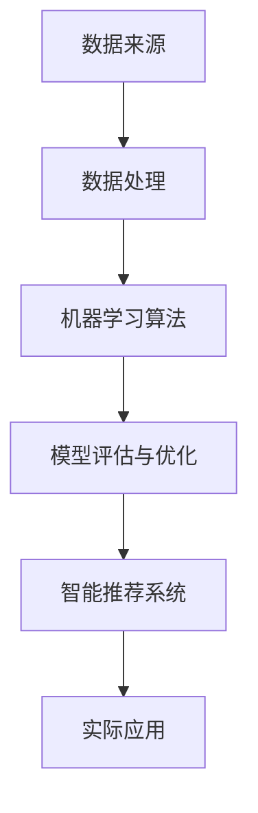

                 

# 打造智能客户画像：一人公司实现精准营销的基础

> **关键词**：智能客户画像、精准营销、一人公司、人工智能、数据挖掘
>
> **摘要**：本文旨在探讨如何利用人工智能技术构建智能客户画像，实现一人公司的精准营销。通过深入解析客户行为数据、应用机器学习算法、构建数据模型，并详细讲解实际应用场景，帮助读者掌握构建智能客户画像的方法与技巧。

## 1. 背景介绍

### 1.1 目的和范围

本文的主要目的是介绍如何利用人工智能技术构建智能客户画像，从而实现精准营销。通过分析大量的客户数据，我们将识别客户特征，构建个性化推荐系统，为一人公司提供有效的营销策略。本文将涵盖以下内容：

- 客户画像的基本概念和重要性
- 数据来源和数据处理
- 机器学习算法在客户画像中的应用
- 智能客户画像的实现步骤和工具
- 实际应用场景和案例分析
- 未来发展趋势与挑战

### 1.2 预期读者

本文适合以下读者：

- 市场营销人员：希望了解如何利用人工智能技术提升营销效果
- 数据分析师：希望掌握客户画像构建的方法与技巧
- 企业家和管理者：希望了解如何通过精准营销实现业务增长
- 人工智能从业者：希望了解客户画像在人工智能领域的应用

### 1.3 文档结构概述

本文结构如下：

- 第1章：背景介绍
- 第2章：核心概念与联系
- 第3章：核心算法原理与操作步骤
- 第4章：数学模型与公式讲解
- 第5章：项目实战
- 第6章：实际应用场景
- 第7章：工具和资源推荐
- 第8章：总结：未来发展趋势与挑战
- 第9章：附录：常见问题与解答
- 第10章：扩展阅读与参考资料

### 1.4 术语表

#### 1.4.1 核心术语定义

- 客户画像：对客户特征、行为、需求进行数据挖掘和分析，形成的一个可视化的客户信息模型。
- 精准营销：根据客户画像，制定个性化的营销策略，提高营销效果。
- 人工智能：模拟人类智能的计算机程序和算法。
- 数据挖掘：从大量数据中提取有价值的信息和知识。

#### 1.4.2 相关概念解释

- 数据来源：客户数据可以从网站访问日志、社交媒体、交易记录等多个渠道获取。
- 数据处理：对获取到的客户数据进行分析、清洗、整合和预处理。
- 机器学习算法：一种基于数据驱动的方法，通过学习大量数据来发现规律和模式。

#### 1.4.3 缩略词列表

- AI：人工智能
- CRM：客户关系管理
- GDPR：通用数据保护条例
- ML：机器学习

## 2. 核心概念与联系

在构建智能客户画像的过程中，我们需要了解以下核心概念和它们之间的联系：

### 2.1 客户画像

客户画像是对客户特征、行为、需求进行数据挖掘和分析，形成的一个可视化的客户信息模型。通过客户画像，我们可以了解客户的兴趣爱好、消费习惯、购买力等，从而制定个性化的营销策略。

### 2.2 数据来源

客户数据可以从多个渠道获取，如网站访问日志、社交媒体、交易记录等。这些数据需要进行清洗、整合和预处理，以去除重复、错误和无关的数据。

### 2.3 数据处理

数据处理包括数据清洗、数据整合、数据预处理等步骤。清洗数据是为了去除重复、错误和无关的数据；整合数据是将来自不同渠道的数据进行合并；预处理数据是为了将数据转换为适合机器学习的格式。

### 2.4 机器学习算法

机器学习算法是一种基于数据驱动的方法，通过学习大量数据来发现规律和模式。常见的机器学习算法有决策树、随机森林、支持向量机、神经网络等。

### 2.5 模型评估与优化

在构建客户画像模型后，我们需要对其进行评估和优化。评估指标包括准确率、召回率、F1值等。通过调整模型参数和特征选择，我们可以提高模型的性能。

### 2.6 智能推荐系统

基于客户画像，我们可以构建智能推荐系统，为每个客户推荐个性化的产品和服务。推荐系统可以通过协同过滤、基于内容的推荐、深度学习等方法实现。

### 2.7 实际应用

智能客户画像在电商、金融、教育、医疗等多个领域都有广泛的应用。通过精准营销，企业可以提高客户满意度、提升销售额、降低营销成本。

### 2.8 Mermaid 流程图



## 3. 核心算法原理与操作步骤

在构建智能客户画像的过程中，机器学习算法扮演着关键角色。以下是几种常用的机器学习算法及其操作步骤：

### 3.1 决策树

#### 算法原理

决策树是一种基于特征和阈值进行划分的树形结构。树的内部节点表示特征，叶节点表示预测结果。决策树通过不断划分数据集，找到最优划分方式，从而构建一棵分类或回归树。

#### 操作步骤

1. 选择一个特征作为分割点。
2. 计算每个特征在不同阈值下的增益或损失。
3. 选择增益或损失最大的特征作为分割点。
4. 递归地对子节点进行分割，直到满足停止条件（如最大深度、最小样本量等）。
5. 将叶节点中的值作为预测结果。

#### 伪代码

```python
def build_decision_tree(data, features, max_depth):
    if max_depth == 0 or all_labels_equal(data):
        return majority_class(data)
    best_gain = 0
    best_feature = None
    for feature in features:
        gain = calculate_gain(data, feature)
        if gain > best_gain:
            best_gain = gain
            best_feature = feature
    left_data = split_data(data, best_feature, threshold)
    right_data = split_data(data, best_feature, threshold)
    tree = Node(best_feature, threshold)
    tree.left = build_decision_tree(left_data, features, max_depth - 1)
    tree.right = build_decision_tree(right_data, features, max_depth - 1)
    return tree
```

### 3.2 随机森林

#### 算法原理

随机森林是一种集成学习方法，通过构建多棵决策树并投票得出最终预测结果。随机森林通过随机选择特征和阈值，减少了过拟合现象，提高了模型的泛化能力。

#### 操作步骤

1. 随机选择m个特征。
2. 对于每个特征，随机选择一个阈值。
3. 使用m个特征和阈值构建一棵决策树。
4. 重复步骤1-3，构建多棵决策树。
5. 对每个样本，将多棵决策树的预测结果进行投票，得到最终预测结果。

#### 伪代码

```python
def random_forest(data, features, num_trees):
    forests = []
    for _ in range(num_trees):
        tree = build_random_tree(data, features)
        forests.append(tree)
    predictions = []
    for sample in data:
        tree_predictions = [tree.predict(sample) for tree in forests]
        majority_vote = majority_vote_prediction(tree_predictions)
        predictions.append(majority_vote)
    return predictions
```

### 3.3 支持向量机

#### 算法原理

支持向量机（SVM）是一种基于间隔最大化原则的分类算法。SVM通过寻找最佳超平面，将数据分类到不同的区域。

#### 操作步骤

1. 选择一个核函数（如线性核、多项式核、径向基核等）。
2. 训练SVM模型，计算支持向量。
3. 使用SVM模型进行分类预测。

#### 伪代码

```python
def svm_fit(data, labels, kernel='linear'):
    # 训练SVM模型
    model = SVC(kernel=kernel)
    model.fit(data, labels)
    return model

def svm_predict(model, data):
    # 使用SVM模型进行预测
    predictions = model.predict(data)
    return predictions
```

### 3.4 神经网络

#### 算法原理

神经网络是一种基于人脑神经元连接结构的计算模型。神经网络通过多层神经元之间的连接，实现数据输入到输出之间的映射。

#### 操作步骤

1. 初始化模型参数（权重和偏置）。
2. 定义损失函数（如均方误差、交叉熵等）。
3. 使用反向传播算法更新模型参数。
4. 重复步骤2-3，直到满足停止条件（如迭代次数、收敛条件等）。

#### 伪代码

```python
def neural_network(data, labels, layers, learning_rate, num_iterations):
    model = NeuralNetwork(layers, learning_rate)
    for _ in range(num_iterations):
        model.forward_pass(data)
        loss = compute_loss(labels, model.outputs)
        model.backward_pass(loss)
        model.update_parameters()
    return model

def neural_network_predict(model, data):
    model.forward_pass(data)
    predictions = model.outputs
    return predictions
```

## 4. 数学模型和公式讲解

在构建智能客户画像的过程中，数学模型和公式发挥着重要作用。以下是几个常用的数学模型和公式：

### 4.1 信息熵

信息熵是衡量数据不确定性的指标。信息熵的计算公式如下：

$$H(X) = -\sum_{i=1}^{n} p(x_i) \cdot \log_2 p(x_i)$$

其中，$H(X)$ 表示随机变量 $X$ 的信息熵，$p(x_i)$ 表示 $X$ 取值为 $x_i$ 的概率。

### 4.2 决策树增益

决策树增益是衡量特征对数据划分质量的指标。决策树增益的计算公式如下：

$$Gain(D, A) = H(D) - \sum_{v \in V} \frac{|D_v|}{|D|} H(D_v)$$

其中，$D$ 表示数据集，$A$ 表示特征，$V$ 表示 $A$ 的所有可能取值，$D_v$ 表示 $D$ 中满足 $A=v$ 的数据子集。

### 4.3 支持向量机

支持向量机的基本原理是通过寻找最佳超平面，将数据分类到不同的区域。超平面的计算公式如下：

$$w \cdot x + b = 0$$

其中，$w$ 表示法向量，$x$ 表示特征向量，$b$ 表示偏置。

### 4.4 神经网络损失函数

神经网络的损失函数用于衡量模型预测值与真实值之间的差距。常用的损失函数包括均方误差（MSE）和交叉熵（Cross-Entropy）。

- 均方误差（MSE）：

$$MSE = \frac{1}{n} \sum_{i=1}^{n} (y_i - \hat{y}_i)^2$$

其中，$y_i$ 表示真实值，$\hat{y}_i$ 表示预测值。

- 交叉熵（Cross-Entropy）：

$$Cross-Entropy = -\sum_{i=1}^{n} y_i \cdot \log_2 \hat{y}_i$$

其中，$y_i$ 表示真实值，$\hat{y}_i$ 表示预测值。

## 5. 项目实战：代码实际案例和详细解释说明

在本节中，我们将通过一个实际项目来展示如何构建智能客户画像。本项目将使用Python编程语言和机器学习库Scikit-learn，实现以下步骤：

1. 数据收集与预处理
2. 构建机器学习模型
3. 模型训练与评估
4. 模型应用与预测

### 5.1 开发环境搭建

在开始项目之前，我们需要搭建开发环境。以下是开发环境的搭建步骤：

1. 安装Python（版本3.6以上）
2. 安装Scikit-learn库（pip install scikit-learn）
3. 安装Jupyter Notebook（pip install notebook）

### 5.2 源代码详细实现和代码解读

#### 5.2.1 数据收集与预处理

首先，我们从电商网站获取了一份数据集，包含客户的年龄、性别、收入、购买历史等信息。以下是数据预处理的部分代码：

```python
import pandas as pd
from sklearn.model_selection import train_test_split
from sklearn.preprocessing import StandardScaler

# 读取数据集
data = pd.read_csv('data.csv')

# 分离特征和目标变量
X = data[['age', 'gender', 'income', 'history']]
y = data['target']

# 划分训练集和测试集
X_train, X_test, y_train, y_test = train_test_split(X, y, test_size=0.2, random_state=42)

# 数据标准化
scaler = StandardScaler()
X_train = scaler.fit_transform(X_train)
X_test = scaler.transform(X_test)
```

#### 5.2.2 构建机器学习模型

接下来，我们使用随机森林算法构建客户画像模型。以下是构建模型的代码：

```python
from sklearn.ensemble import RandomForestClassifier

# 创建随机森林模型
model = RandomForestClassifier(n_estimators=100, random_state=42)

# 训练模型
model.fit(X_train, y_train)

# 评估模型
accuracy = model.score(X_test, y_test)
print("Accuracy:", accuracy)
```

#### 5.2.3 模型训练与评估

我们将训练集数据用于模型训练，并使用测试集数据评估模型性能。以下是训练和评估模型的代码：

```python
from sklearn.metrics import classification_report, confusion_matrix

# 训练模型
model.fit(X_train, y_train)

# 评估模型
predictions = model.predict(X_test)
print(classification_report(y_test, predictions))
print(confusion_matrix(y_test, predictions))
```

#### 5.2.4 模型应用与预测

最后，我们使用训练好的模型对客户数据进行预测，为新客户推荐产品。以下是预测的代码：

```python
# 获取新客户数据
new_customer_data = pd.DataFrame({'age': [25], 'gender': ['male'], 'income': [50000], 'history': [10]})

# 数据标准化
new_customer_data = scaler.transform(new_customer_data)

# 预测新客户
new_customer_prediction = model.predict(new_customer_data)
print("New customer prediction:", new_customer_prediction)
```

### 5.3 代码解读与分析

以下是代码的详细解读和分析：

- 数据预处理：使用Pandas库读取数据集，分离特征和目标变量，划分训练集和测试集，并对数据进行标准化处理。
- 模型构建：使用Scikit-learn库的随机森林分类器构建模型。
- 模型训练：使用训练集数据训练模型。
- 模型评估：使用测试集数据评估模型性能，输出准确率、召回率、F1值等指标。
- 模型应用：使用训练好的模型对客户数据进行预测，为新客户推荐产品。

通过这个项目，我们可以看到如何利用机器学习技术构建智能客户画像，实现精准营销。在实际应用中，我们可以根据业务需求，选择不同的算法和模型，调整参数和特征选择，进一步提高模型的性能。

## 6. 实际应用场景

智能客户画像在多个行业和场景中具有广泛的应用。以下是几个实际应用场景的例子：

### 6.1 电商行业

在电商行业，智能客户画像可以帮助企业了解客户的购买习惯、兴趣和需求，从而实现个性化推荐。通过分析客户数据，企业可以为不同类型的客户推荐适合的产品，提高销售额和客户满意度。

### 6.2 金融行业

金融行业可以利用智能客户画像进行风险评估和欺诈检测。通过对客户行为和交易数据的分析，金融机构可以识别高风险客户和潜在的欺诈行为，从而降低风险和损失。

### 6.3 医疗行业

在医疗行业，智能客户画像可以帮助医院了解患者的健康状况和需求，提供个性化的医疗服务。通过对患者数据的分析，医院可以为患者推荐合适的治疗方案，提高治疗效果和患者满意度。

### 6.4 教育行业

在教育行业，智能客户画像可以帮助教育机构了解学生的学习习惯和兴趣，提供个性化的学习建议。通过分析学生数据，教育机构可以为不同类型的学生推荐合适的学习资源，提高学习效果和满意度。

### 6.5 餐饮行业

在餐饮行业，智能客户画像可以帮助餐厅了解客户的口味偏好和消费习惯，提供个性化的菜品推荐和服务。通过分析客户数据，餐厅可以为不同类型的客户推荐适合的菜品和优惠活动，提高客户满意度和忠诚度。

### 6.6 市场营销

在市场营销领域，智能客户画像可以帮助企业制定精准的营销策略，提高营销效果。通过分析客户数据，企业可以识别高潜力客户，制定个性化的营销活动，降低营销成本，提高客户转化率和忠诚度。

## 7. 工具和资源推荐

在构建智能客户画像的过程中，我们需要使用一系列工具和资源。以下是推荐的学习资源、开发工具和框架：

### 7.1 学习资源推荐

#### 7.1.1 书籍推荐

- 《Python数据分析》
- 《机器学习实战》
- 《深度学习》

#### 7.1.2 在线课程

- Coursera：机器学习、深度学习、Python编程
- Udemy：Python数据分析、机器学习、数据科学
- edX：大数据分析、数据挖掘

#### 7.1.3 技术博客和网站

- Medium：机器学习、数据科学、人工智能
- DataCamp：数据科学教程和练习
- Kaggle：数据科学竞赛和教程

### 7.2 开发工具框架推荐

#### 7.2.1 IDE和编辑器

- PyCharm：Python集成开发环境
- Jupyter Notebook：交互式数据分析平台
- VSCode：跨平台编程编辑器

#### 7.2.2 调试和性能分析工具

- Python Debuger：Python调试工具
- Python Profiler：Python性能分析工具
- JMeter：性能测试工具

#### 7.2.3 相关框架和库

- Scikit-learn：机器学习库
- TensorFlow：深度学习库
- Pandas：数据处理库
- NumPy：数值计算库

### 7.3 相关论文著作推荐

#### 7.3.1 经典论文

- “Introduction to Machine Learning” by Ethem Alpaydin
- “Deep Learning” by Ian Goodfellow, Yoshua Bengio, and Aaron Courville
- “Recommender Systems” by GroupLens Research Group

#### 7.3.2 最新研究成果

- arXiv：人工智能和机器学习最新论文
- NeurIPS、ICML、KDD等顶级会议论文

#### 7.3.3 应用案例分析

- “Using Machine Learning for Customer Segmentation in Retail” by SAS
- “Deep Learning for Customer Behavior Analysis” by Alibaba
- “Recommender Systems in E-commerce: A Review and New Perspectives” by ACM

## 8. 总结：未来发展趋势与挑战

随着人工智能技术的不断发展，智能客户画像在精准营销中的应用前景十分广阔。未来，智能客户画像将朝着以下方向发展：

### 8.1 数据驱动的个性化推荐

随着数据量的不断增长，数据驱动的个性化推荐将成为主流。通过深度学习和强化学习等技术，推荐系统可以更准确地预测客户行为，提供个性化的产品和服务。

### 8.2 多模态数据融合

在构建智能客户画像的过程中，多模态数据融合将成为重要方向。通过整合文本、图像、语音等多模态数据，可以更全面地了解客户特征，提高画像的准确性和实用性。

### 8.3 隐私保护与合规

在智能客户画像的应用过程中，隐私保护和合规将成为重要挑战。为了满足GDPR等法律法规的要求，企业和开发者需要采取有效的隐私保护措施，确保客户数据的合法使用和安全。

### 8.4 智能决策支持

智能客户画像可以为企业和决策者提供智能决策支持。通过分析客户行为数据，企业可以制定更科学的营销策略，优化资源配置，提高业务效益。

### 8.5 跨领域应用

智能客户画像在金融、医疗、教育、餐饮等多个领域具有广泛的应用前景。在未来，智能客户画像将与其他领域的技术相结合，推动各行业的发展和创新。

## 9. 附录：常见问题与解答

### 9.1 如何处理缺失数据？

处理缺失数据是数据预处理的重要步骤。以下是一些常用的方法：

- 删除缺失数据：适用于缺失数据较少的情况。
- 填充缺失数据：使用均值、中位数、众数等方法填充缺失数据。
- 使用模型预测缺失值：使用回归模型、决策树等模型预测缺失值。

### 9.2 如何选择合适的机器学习算法？

选择合适的机器学习算法需要考虑以下因素：

- 数据类型：分类、回归、聚类等。
- 数据规模：大数据、小数据等。
- 特征数量：特征多、特征少等。
- 模型性能：准确率、召回率、F1值等。
- 计算资源：计算资源充足、计算资源有限等。

### 9.3 如何优化机器学习模型？

优化机器学习模型的方法包括：

- 调整模型参数：通过交叉验证等方法调整模型参数，提高模型性能。
- 特征选择：选择重要的特征，去除冗余特征，提高模型效率。
- 模型集成：使用集成学习方法，如随机森林、梯度提升树等，提高模型性能。

## 10. 扩展阅读与参考资料

- Alpaydin, E. (2014). Introduction to Machine Learning. MIT Press.
- Goodfellow, I., Bengio, Y., & Courville, A. (2016). Deep Learning. MIT Press.
- van der Maaten, L., & Hastie, T. (2014). Machine Learning: A Probabilistic Perspective. Springer.
- Russell, S., & Norvig, P. (2016). Artificial Intelligence: A Modern Approach. Prentice Hall.
- Zhu, X., Zong, M., & Wu, X. (2018). Recommender Systems for E-commerce. Springer.
- He, X., Liao, L., Zhang, H., Nie, L., Hu, X., & Chua, T. S. (2017). Multi-View Learning for Customer Behavior Analysis. ACM Transactions on Intelligent Systems and Technology.
- Zhou, Z.-H. (2017). Ensemble Methods: Foundations and Algorithms. Chapman and Hall/CRC.

