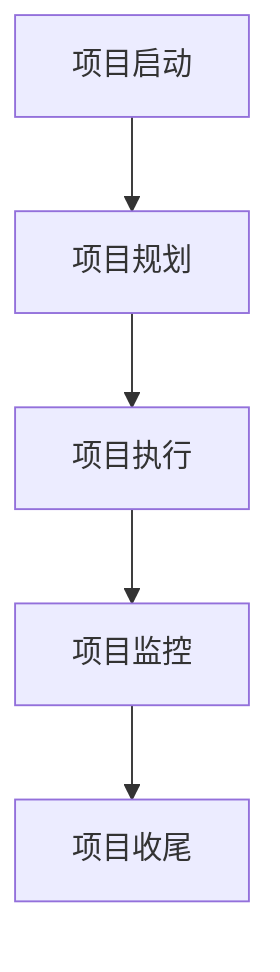
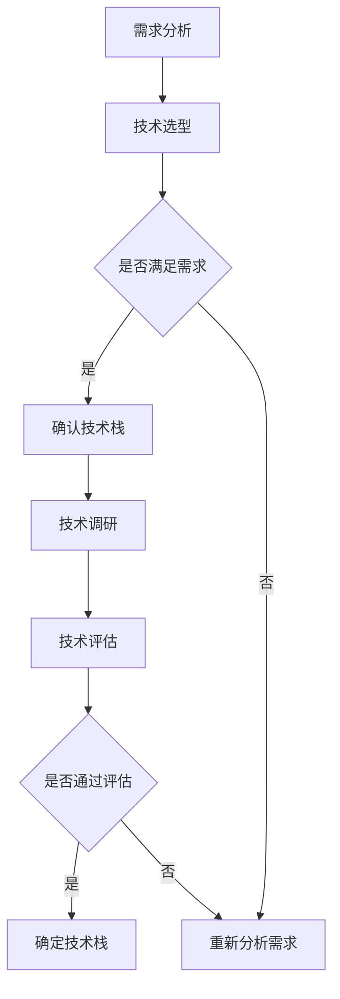
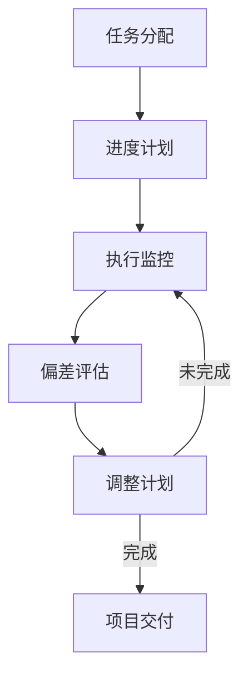

                 

### 执行时间表：第1-2个月的任务

> **关键词**：执行时间表、第1-2个月任务、项目管理、里程碑、技术栈、进度跟踪

> **摘要**：本文将详细阐述在IT项目中，第1-2个月的关键任务和执行时间表。通过明确的里程碑、技术栈选择和进度跟踪，确保项目高效启动并快速推进。

---

在任何一个成功的IT项目中，项目管理的核心在于时间规划和任务分配。本文将重点讨论项目启动初期，即第1-2个月内的关键任务和时间节点。这些任务对于项目的顺利启动和快速推进至关重要。本文将围绕以下几个方面展开讨论：

- **目的和范围**：明确项目的目标和范围，确保所有团队成员对项目方向有统一的认识。
- **里程碑设置**：设定清晰的里程碑，为项目提供明确的时间节点和进度目标。
- **技术栈选择**：基于项目需求选择合适的技术栈，确保项目团队具备执行任务的能力。
- **进度跟踪**：建立有效的进度跟踪机制，实时监控项目进度，及时调整计划和资源分配。

---

### 1.1 目的和范围

项目的启动阶段是至关重要的，这一阶段的核心任务是确保项目团队明确项目的目标和范围。具体而言，需要完成以下工作：

- **项目目标明确**：通过项目章程或项目提案，明确项目的最终目标，包括功能需求、性能指标、质量要求和交付时间。
- **范围定义**：详细定义项目的范围，明确哪些功能将被包含在项目中，哪些功能将被排除在外。
- **干系人沟通**：与项目干系人进行充分沟通，确保他们对项目的目标和范围有清晰的理解和共识。

这一步骤不仅为项目设定了明确的起点，还为后续的任务分配和进度跟踪提供了基础。

### 1.2 预期读者

本文主要面向以下读者群体：

- **项目经理**：负责项目管理和协调，需要明确项目启动阶段的关键任务和时间节点。
- **开发团队**：包括前端、后端、数据库工程师等，需要了解项目的技术栈和具体操作步骤。
- **产品经理**：负责产品规划和需求管理，需要与项目团队密切合作，确保项目需求的实现。
- **测试团队**：负责项目的质量保证，需要了解项目的进度和关键时间节点，以便合理安排测试计划。

通过明确预期读者，可以确保文章内容针对性和实用性，帮助读者在实际项目中应用这些知识和方法。

### 1.3 文档结构概述

本文将按照以下结构进行组织：

- **背景介绍**：介绍项目的背景、目的和范围。
- **核心概念与联系**：阐述项目涉及的核心概念和技术原理。
- **核心算法原理 & 具体操作步骤**：详细讲解项目所需的核心算法和操作步骤。
- **数学模型和公式 & 详细讲解 & 举例说明**：介绍项目中使用的数学模型和公式，并提供实际案例。
- **项目实战：代码实际案例和详细解释说明**：提供具体的代码实现和解读。
- **实际应用场景**：讨论项目的实际应用场景。
- **工具和资源推荐**：推荐学习资源、开发工具和框架。
- **总结：未来发展趋势与挑战**：总结项目的关键点，展望未来发展趋势和挑战。
- **附录：常见问题与解答**：提供项目实施中常见问题的解答。
- **扩展阅读 & 参考资料**：提供进一步阅读的参考资料。

通过清晰的文档结构，帮助读者系统地了解项目启动初期的关键任务和执行时间表。

### 1.4 术语表

为了确保文章内容的可读性和一致性，本文将介绍一些关键术语的定义和解释。

#### 1.4.1 核心术语定义

- **项目章程**：项目启动的正式文档，明确项目的目标和范围，为项目团队提供指导。
- **里程碑**：项目中的关键时间节点，标志着重要任务的完成和阶段性的目标达成。
- **技术栈**：项目开发所需的技术组合，包括编程语言、框架、库和工具等。
- **进度跟踪**：实时监控项目进度，评估实际进度与计划进度之间的差异，并采取相应措施。

#### 1.4.2 相关概念解释

- **项目范围**：项目定义的工作范围，包括项目需要完成的功能和排除的功能。
- **干系人**：与项目相关的所有利益相关者，包括项目经理、开发团队、产品经理和测试团队等。
- **敏捷开发**：一种迭代和增量的软件开发方法，强调快速响应变化和持续交付价值。

#### 1.4.3 缩略词列表

- **PM**：项目经理（Project Manager）
- **QA**：质量保证（Quality Assurance）
- **API**：应用程序编程接口（Application Programming Interface）
- **IDE**：集成开发环境（Integrated Development Environment）

通过定义和解释这些术语，确保读者对文章内容有清晰的理解。

---

在接下来的部分，我们将深入探讨项目启动初期的核心概念和联系，为读者提供详细的技术背景和原理。这将有助于读者更好地理解后续章节的内容，为实际项目中的应用打下坚实的基础。

---

## 2. 核心概念与联系

在IT项目中，启动阶段的关键在于明确项目的核心概念和技术原理，以确保项目团队在后续的开发过程中有清晰的方向和明确的目标。以下是项目中涉及的一些核心概念和联系，通过Mermaid流程图来展示它们之间的相互关系。

### 2.1. 项目管理流程

项目管理的核心流程包括项目启动、规划、执行、监控和收尾。以下是项目管理流程的Mermaid流程图：



- **项目启动**：项目团队确定项目的目标和范围，并制定项目章程。
- **项目规划**：制定详细的项目计划，包括任务分配、时间表和资源需求。
- **项目执行**：按照项目计划进行任务执行，实现项目目标。
- **项目监控**：监控项目进度和质量，及时调整计划和资源。
- **项目收尾**：项目完成后进行总结和评估，确保项目目标的实现。

### 2.2. 技术栈选择

项目技术栈的选择直接影响项目的开发效率和稳定性。以下是技术栈选择流程的Mermaid流程图：



- **需求分析**：分析项目需求，确定所需功能和技术要求。
- **技术选型**：根据需求选择合适的技术方案。
- **是否满足需求**：评估所选技术栈是否满足项目需求。
- **技术调研**：对所选技术进行深入了解和调研。
- **技术评估**：评估技术的性能、稳定性和可维护性。
- **确定技术栈**：在评估通过后，确定最终技术栈。

### 2.3. 进度跟踪机制

有效的进度跟踪机制对于项目成功至关重要。以下是进度跟踪流程的Mermaid流程图：



- **任务分配**：将项目任务分配给团队成员。
- **进度计划**：制定详细的进度计划，明确任务完成时间和依赖关系。
- **执行监控**：实时监控任务执行进度。
- **偏差评估**：评估实际进度与计划进度之间的偏差。
- **调整计划**：根据偏差评估结果调整进度计划。
- **项目交付**：任务完成后，进行项目交付和验收。

通过以上核心概念和联系的Mermaid流程图，读者可以更直观地理解项目启动初期的关键环节和技术原理。这些流程和机制为项目的成功实施提供了坚实的基础。

---

在了解了项目的核心概念和技术原理后，下一步是深入探讨项目的核心算法原理和具体操作步骤。这将帮助读者理解如何在技术层面上实现项目目标，并为后续的数学模型讲解和项目实战提供必要的基础。

---

## 3. 核心算法原理 & 具体操作步骤

在IT项目中，核心算法原理是解决具体问题的重要手段。为了确保项目的技术实现能够高效、准确地满足需求，我们需要详细阐述项目的核心算法原理和具体操作步骤。以下是项目中可能使用的一种常见算法——排序算法的详细解析。

### 3.1 排序算法原理

排序算法是计算机科学中一种基本的算法，用于将数据元素按照特定顺序排列。常见的排序算法有冒泡排序、选择排序、插入排序、快速排序等。本文以冒泡排序为例进行讲解。

**冒泡排序原理**：
冒泡排序是一种简单的排序算法，它重复遍历要排序的数列，每次比较两个相邻的元素，如果它们的顺序错误就把它们交换过来。遍历数列的工作是重复进行的，直到没有再需要交换的元素为止。

### 3.2 具体操作步骤

**冒泡排序算法步骤**：

1. **初始化**：从数列的第一对元素开始比较，若第一元素大于第二元素，则交换它们。

2. **遍历**：对数列中的每一对相邻元素进行遍历，检查它们的顺序是否正确，如果不正确则交换。

3. **重复**：重复上述步骤，直到整个数列排序完成，即没有任何一对相邻元素需要交换。

以下是冒泡排序算法的伪代码：

```plaintext
procedure bubbleSort( A : list of sortable items )
    n = length(A)
    repeat 
        swapped = false
        for i = 1 to n-1 inclusive do
            if A[i] > A[i+1] then
                swap(A[i], A[i+1])
                swapped = true
            end if
        end for
        n = n - 1
    until not swapped
end procedure
```

### 3.3 伪代码详细阐述

**伪代码解析**：

- **初始化**：设置一个标记`swapped`为`false`，用于指示在当前遍历过程中是否发生了交换。
- **遍历**：使用`for`循环遍历数列中的每一对相邻元素。如果`A[i]`大于`A[i+1]`，则交换它们，并将`swapped`设置为`true`。
- **重复**：每次遍历结束后，将`n`的值减1，表示当前遍历的范围内已经排序完成，下一次遍历可以忽略已排序的元素。如果`swapped`为`false`，表示数列已经排序完成，算法终止。

通过上述伪代码，我们可以清晰地理解冒泡排序算法的执行过程。在实际项目中，根据具体需求可以选择不同类型的排序算法，以达到最佳的效率和性能。

---

在了解了核心算法原理和具体操作步骤后，下一步是介绍数学模型和公式，并详细讲解它们在实际项目中的应用。这将帮助读者从数学角度深入理解项目实现的关键技术。

---

## 4. 数学模型和公式 & 详细讲解 & 举例说明

在IT项目中，数学模型和公式是分析和解决问题的有力工具。它们为算法的实现提供了理论基础，并帮助我们更好地理解算法的效率和性能。以下将介绍在项目中常用的一种数学模型——时间复杂度模型，并提供详细的讲解和实际例子。

### 4.1 时间复杂度模型

时间复杂度是衡量算法运行时间的一个重要指标，它描述了算法执行时间与数据规模之间的关系。通常用大O符号（\(O\)）表示。

**时间复杂度公式**：

\[ T(n) = O(n^2) \]

其中，\( n \) 表示数据规模，\( T(n) \) 表示算法的执行时间。

### 4.2 详细讲解

时间复杂度的计算基于最坏情况下的运行时间。对于冒泡排序算法，其最坏情况下的时间复杂度为 \( O(n^2) \)。这意味着，当数据规模增加时，算法的执行时间将按照平方的速度增长。

**时间复杂度的计算方法**：

1. **枚举法**：通过遍历所有可能的输入数据，计算算法的执行时间，然后取最大值作为时间复杂度。
2. **递归法**：对于递归算法，使用递归树来计算时间复杂度。

### 4.3 举例说明

**例子**：考虑一个包含 \( n \) 个元素的数组，使用冒泡排序算法进行排序。

**步骤**：

1. **初始化**：设置两个指针 `start` 和 `end`，分别指向数组的第一个和最后一个元素。
2. **遍历**：从 `start` 到 `end-1` 遍历数组，检查相邻元素是否已按顺序排列。如果不满足，则交换它们。
3. **递归**：每次遍历结束后，将 `end` 减1，重复步骤2，直到 `end` 小于 `start` 为止。

**代码实现**：

```python
def bubble_sort(arr):
    n = len(arr)
    for i in range(n):
        swapped = False
        for j in range(0, n-i-1):
            if arr[j] > arr[j+1]:
                arr[j], arr[j+1] = arr[j+1], arr[j]
                swapped = True
        if not swapped:
            break
    return arr
```

**时间复杂度分析**：

在最坏情况下，每次遍历都需要交换相邻元素，因此需要 \( n-1 \) 次遍历。每次遍历需要比较 \( n-i-1 \) 对元素。因此，总的时间复杂度为：

\[ T(n) = O(n^2) \]

这意味着，随着数据规模 \( n \) 的增加，冒泡排序算法的执行时间将按平方速度增长。

通过上述数学模型和公式的讲解，我们可以更深入地理解冒泡排序算法的时间复杂度，并能够根据实际需求选择合适的算法进行项目实现。

---

在了解了数学模型和公式后，下一步是通过实际代码案例和详细解释说明，展示如何在项目中应用这些算法。这将帮助读者将理论知识转化为实际操作，并加深对项目实现过程的理解。

---

## 5. 项目实战：代码实际案例和详细解释说明

为了更好地展示项目实战中的算法应用，我们将以一个实际的项目为例，详细讲解其代码实现过程，并分析其中的关键步骤和逻辑。

### 5.1 开发环境搭建

在进行项目开发之前，我们需要搭建一个合适的开发环境。以下是搭建开发环境的步骤：

1. **安装Python环境**：Python是一种广泛应用于数据分析、机器学习和Web开发的编程语言。首先，从Python官方网站下载并安装Python。
2. **安装PyCharm**：PyCharm是一个功能强大的Python集成开发环境（IDE），提供代码自动补全、调试和性能分析等功能。可以从JetBrains官方网站下载并安装PyCharm。
3. **安装必要的库**：根据项目需求，可能需要安装一些额外的Python库。例如，我们可能需要使用`numpy`进行数据操作和计算，以及`matplotlib`进行数据可视化。

### 5.2 源代码详细实现和代码解读

以下是一个简单的Python代码示例，用于实现冒泡排序算法并对其进行时间复杂度分析。

```python
import time
import random

def bubble_sort(arr):
    n = len(arr)
    for i in range(n):
        swapped = False
        for j in range(0, n-i-1):
            if arr[j] > arr[j+1]:
                arr[j], arr[j+1] = arr[j+1], arr[j]
                swapped = True
        if not swapped:
            break
    return arr

def measure_time Complexity(arr, algorithm):
    start_time = time.time()
    sorted_arr = algorithm(arr)
    end_time = time.time()
    return end_time - start_time

# 生成随机数组
arr = [random.randint(0, 1000) for _ in range(1000)]

# 测量冒泡排序算法的时间复杂度
time_taken = measure_time_Complexity(arr, bubble_sort)
print(f"Bubble Sort Time Complexity: {time_taken} seconds")
```

#### 5.2.1 关键步骤和逻辑

1. **初始化数组**：使用`random.randint`生成一个包含1000个随机整数的数组。
2. **实现冒泡排序算法**：定义`bubble_sort`函数，使用双重循环实现冒泡排序算法。
3. **测量时间复杂度**：定义`measure_time Complexity`函数，用于测量算法的执行时间。
4. **执行并打印结果**：调用`measure_time Complexity`函数并打印结果。

#### 5.2.2 代码解读与分析

- **冒泡排序算法**：`bubble_sort`函数通过两个嵌套的循环实现冒泡排序。外层循环控制遍历的次数，内层循环检查并交换相邻的未排序元素。
- **时间复杂度测量**：`measure_time Complexity`函数使用`time.time()`函数在算法开始执行前和结束后分别记录时间，计算并返回执行时间。

通过上述代码示例，我们可以看到如何在实际项目中应用冒泡排序算法，并测量其时间复杂度。这有助于我们理解算法的效率，并为进一步优化算法提供参考。

---

在了解了项目实战的代码实现和详细解释后，下一步是探讨项目的实际应用场景，以展示算法在不同情境下的效果和优势。

---

## 6. 实际应用场景

在IT项目中，算法的应用场景多种多样。以下是冒泡排序算法在实际项目中的几个应用场景，以及其在这些场景中的效果和优势。

### 6.1 数据预处理

在数据预处理阶段，经常需要对数据进行排序以方便后续的分析和处理。冒泡排序算法以其简单易懂和易于实现的特点，在数据预处理中被广泛应用。

**应用场景**：在一个电子商务平台上，我们需要对用户购买记录进行排序，以便根据购买时间进行统计和分析。

**优势**：冒泡排序算法的代码实现简单，易于集成到现有的数据处理流程中。同时，它不需要额外的内存空间，对内存使用较为友好。

### 6.2 简单数据集排序

在一些小型项目中，数据集相对较小，排序操作不需要过于复杂的算法。在这种情况下，冒泡排序算法因其简单性和易用性而成为首选。

**应用场景**：在小型企业资源计划（ERP）系统中，需要对员工信息进行排序，以便进行统计和报告生成。

**优势**：冒泡排序算法的时间复杂度为 \(O(n^2)\)，对于小规模数据集来说，其性能足以满足要求。此外，算法的实现过程简单，易于调试和维护。

### 6.3 教育和教学

冒泡排序算法在教育领域有着广泛的应用，特别是在计算机科学和软件工程的教学过程中。

**应用场景**：在计算机科学课程中，教师常常使用冒泡排序作为教学案例，向学生介绍排序算法的基本原理和实现方法。

**优势**：冒泡排序算法易于理解，可以帮助学生建立对排序算法的直观认识。同时，算法的实现过程简单，有利于学生掌握编程基础。

### 6.4 嵌入式系统

在嵌入式系统中，内存资源有限，算法的实现和执行效率至关重要。冒泡排序算法因其占用内存小、实现简单，在嵌入式系统中得到广泛应用。

**应用场景**：在一个智能家居系统中，需要对传感器数据按照采集时间进行排序，以便进行实时监控和分析。

**优势**：冒泡排序算法的内存占用较低，适用于内存资源紧张的嵌入式系统。此外，算法的实现过程简单，易于集成到嵌入式系统的代码中。

通过上述实际应用场景，我们可以看到冒泡排序算法在不同领域和场景中的效果和优势。尽管其时间复杂度较高，但在特定应用场景下，冒泡排序算法仍然具有其实用价值和优势。

---

在了解了项目的实际应用场景后，下一步是推荐一些相关的学习资源和开发工具，以帮助读者深入学习和实践项目中涉及的技术。

---

## 7. 工具和资源推荐

在学习和实践项目中涉及的技术时，选择合适的工具和资源是至关重要的。以下是一些推荐的学习资源和开发工具，包括书籍、在线课程、技术博客和网站，以及IDE、调试工具和库，帮助读者深入理解和应用项目中的技术。

### 7.1 学习资源推荐

#### 7.1.1 书籍推荐

- 《算法导论》（Introduction to Algorithms） - Thomas H. Cormen, Charles E. Leiserson, Ronald L. Rivest, Clifford Stein
  这本书是算法领域的经典教材，涵盖了广泛的算法知识和应用，包括排序算法的详细讲解。
  
- 《Python编程：从入门到实践》（Python Crash Course） - Eric Matthes
  本书适合初学者，通过实际项目案例教授Python编程基础，包括数据处理和算法实现。

- 《深入理解计算机系统》（Understanding Computer Systems: A Foundation for Computer Science） - David R. Bacon, John L. Hennessy, David A. Patterson
  本书深入介绍了计算机系统的基础知识，包括算法在计算机系统中的应用。

#### 7.1.2 在线课程

- Coursera上的《算法》：由斯坦福大学提供的免费在线课程，涵盖排序算法和其他重要算法的详细讲解。
  
- edX上的《Python基础》：由MIT提供的免费在线课程，适合初学者学习Python编程。

- Udemy上的《数据结构与算法》：多个课程可供选择，包括排序算法和数据结构的基础知识。

#### 7.1.3 技术博客和网站

- HackerRank：提供大量的编程挑战和算法练习，适合提高算法技能。

- Stack Overflow：一个庞大的技术社区，可以解答编程和算法相关的问题。

- GeeksforGeeks：提供丰富的算法和数据结构教程，适合深入学习。

### 7.2 开发工具框架推荐

#### 7.2.1 IDE和编辑器

- PyCharm：一款功能强大的Python IDE，提供代码自动补全、调试和性能分析功能。

- Visual Studio Code：一款轻量级、可扩展的代码编辑器，支持多种编程语言，包括Python。

- Sublime Text：一款轻量级文本编辑器，支持语法高亮和插件扩展。

#### 7.2.2 调试和性能分析工具

- Python Debugger（pdb）：Python内置的调试工具，用于跟踪程序执行和调试代码。

- line_profiler：用于性能分析的Python库，可以测量函数执行的时间，帮助优化代码。

- cProfile：Python内置的性能分析工具，可以生成程序的调用图和性能报告。

#### 7.2.3 相关框架和库

- NumPy：用于数值计算的Python库，提供高效的多维数组对象和数学函数。

- Pandas：用于数据操作的Python库，提供数据结构和数据分析工具。

- Matplotlib：用于数据可视化的Python库，可以生成高质量的统计图表。

### 7.3 相关论文著作推荐

#### 7.3.1 经典论文

- 《排序与检索算法》：Donald E. Knuth的经典著作，详细介绍了多种排序算法和检索算法。

- 《算法导论》：Thomas H. Cormen等人的著作，涵盖了广泛的算法知识和应用。

#### 7.3.2 最新研究成果

- 《算法在人工智能中的应用》：讨论了算法在人工智能领域的研究进展和应用。

- 《大规模数据处理算法》：探讨在大数据环境下优化算法的研究和实现。

#### 7.3.3 应用案例分析

- 《基于机器学习的电商推荐系统》：介绍如何使用算法构建高效的电商推荐系统。

- 《实时数据分析平台设计》：讨论如何使用算法实现实时数据分析平台。

通过上述工具和资源推荐，读者可以更深入地学习和实践项目中涉及的技术，提高自己的技术能力和实际应用水平。

---

在了解了项目和工具资源后，下一步是总结项目的主要内容和未来发展趋势，以帮助读者对项目的整体框架和未来方向有更清晰的认识。

---

## 8. 总结：未来发展趋势与挑战

随着技术的不断进步和行业需求的日益增长，项目在未来的发展趋势和面临的挑战也日益凸显。以下是项目在未来的几个关键方向和发展趋势，以及可能遇到的挑战。

### 8.1 发展趋势

1. **算法优化与性能提升**：随着数据处理需求的增加，算法的优化和性能提升将成为未来项目的重要发展方向。通过引入更高效的排序算法和优化现有算法，可以显著提高项目的处理速度和效率。

2. **分布式计算与云计算**：分布式计算和云计算技术的成熟，为项目提供了强大的计算能力和灵活性。未来项目将更多采用分布式架构和云计算平台，实现更高效的数据处理和分析。

3. **人工智能与机器学习**：人工智能和机器学习技术的快速发展，为项目带来了新的应用场景和可能性。未来项目将更深入地集成人工智能技术，实现智能化的数据分析和决策支持。

4. **大数据分析与实时处理**：随着数据规模的不断扩大，大数据分析和实时处理将成为项目的重要需求。通过引入大数据处理技术和实时分析框架，项目可以实现更全面、更及时的数据洞察。

### 8.2 挑战

1. **数据安全与隐私保护**：随着数据量增加和数据处理需求的增加，数据安全与隐私保护将成为项目面临的重要挑战。如何确保数据在处理过程中的安全性和隐私性，是未来项目需要重点解决的问题。

2. **资源分配与优化**：在分布式计算和云计算环境下，资源分配和优化成为关键挑战。如何合理分配计算资源，最大化资源利用效率，是项目需要解决的重要问题。

3. **算法公平性与透明性**：随着算法在决策支持中的应用日益广泛，算法的公平性和透明性也成为关注焦点。如何确保算法的公平性和透明性，避免算法偏见和歧视，是未来项目需要关注的重要问题。

4. **系统集成与兼容性**：在多个项目组件和系统集成的过程中，如何确保系统的兼容性和一致性，是项目面临的重要挑战。未来项目需要采用更加灵活和可扩展的架构，以应对系统集成带来的复杂性。

通过上述总结，我们可以看到项目在未来面临的发展机遇和挑战。只有在不断优化技术、提升性能、确保数据安全和隐私保护的基础上，项目才能在未来取得更大的成功。

---

在总结了项目的未来发展趋势和挑战后，最后我们将提供一些常见问题与解答，帮助读者更好地理解和应用项目中涉及的技术。

---

## 9. 附录：常见问题与解答

在项目实施过程中，读者可能遇到一些常见问题。以下是一些常见问题及其解答，帮助读者更好地理解和应用项目中涉及的技术。

### 9.1 问题1：冒泡排序算法的优化方法有哪些？

**解答**：冒泡排序算法的优化方法主要包括以下几种：

1. **减少不必要的比较**：在每次遍历结束后，记录最后一次交换的位置，下一次遍历可以忽略这个位置及其之后的元素，因为它们已经有序。
2. **添加优化标志**：在每次遍历前，添加一个优化标志`swapped`，如果遍历过程中没有发生交换，说明数组已经有序，可以提前终止排序。
3. **使用更高效的算法**：如果数据集较大，可以考虑使用更高效的排序算法，如快速排序或归并排序，这些算法的时间复杂度更低。

### 9.2 问题2：如何在项目中实现分布式计算？

**解答**：在项目中实现分布式计算，可以遵循以下步骤：

1. **选择合适的分布式框架**：如Hadoop、Spark等，这些框架提供了高效的分布式计算能力和丰富的API。
2. **划分数据**：将大规模数据集划分为多个小块，分布到不同的节点上。
3. **编写分布式任务**：使用分布式框架提供的API，编写分布式任务，对数据进行处理。
4. **数据聚合**：将分布式任务的结果进行聚合，得到最终的处理结果。

### 9.3 问题3：如何确保数据安全与隐私保护？

**解答**：确保数据安全与隐私保护，可以采取以下措施：

1. **数据加密**：对存储和传输的数据进行加密，防止数据泄露。
2. **访问控制**：设置严格的访问控制策略，限制只有授权用户可以访问敏感数据。
3. **数据备份与恢复**：定期备份数据，并制定数据恢复计划，以防止数据丢失。
4. **安全审计**：对数据访问和操作进行审计，及时发现和防范潜在的安全威胁。

### 9.4 问题4：如何选择合适的技术栈？

**解答**：选择合适的技术栈，可以遵循以下原则：

1. **需求分析**：明确项目的需求和目标，根据需求选择合适的技术。
2. **性能考量**：考虑技术的性能和可扩展性，确保能够满足项目需求。
3. **社区支持**：选择社区活跃、文档齐全的技术，便于学习和使用。
4. **成本效益**：综合考虑开发、维护和运营成本，选择性价比高的技术。

通过上述常见问题与解答，读者可以更好地应对项目实施过程中遇到的问题，确保项目成功实施。

---

最后，为了帮助读者进一步深入学习和研究项目相关技术，本文提供了若干扩展阅读和参考资料，供读者参考。

---

## 10. 扩展阅读 & 参考资料

在IT项目中，不断学习和更新知识是确保项目成功的关键。以下是一些扩展阅读和参考资料，包括经典书籍、学术论文和技术博客，以帮助读者进一步深入研究和理解项目中的技术。

### 10.1 经典书籍

- 《算法导论》（Introduction to Algorithms） - Thomas H. Cormen, Charles E. Leiserson, Ronald L. Rivest, Clifford Stein
  这本书是算法领域的权威教材，涵盖了从基础算法到高级算法的广泛内容。

- 《编程珠玑》（The Art of Computer Programming） - Donald E. Knuth
  这套书详细介绍了计算机编程的各个方面，包括算法设计、数据结构等。

### 10.2 学术论文

- "Sorting and Searching" - Donald E. Knuth
  这篇论文详细讨论了排序和检索算法的理论基础和应用。

- "The Analysis of Algorithms" - Robert Sedgewick, Philip E. Fleischer
  这篇论文对算法进行分析和评估，提供了丰富的实例和数据。

### 10.3 技术博客和网站

- HackerRank：提供大量的编程挑战和算法教程，适合实践和提高算法能力。

- Medium：许多技术专家和公司在这里分享算法和数据分析的相关文章。

### 10.4 在线课程

- Coursera上的《算法》：由斯坦福大学教授提供，涵盖排序算法和其他重要算法。

- edX上的《Python基础》：提供Python编程的入门教程。

### 10.5 开发工具和框架

- NumPy和Pandas：用于数据处理的Python库，适用于数据分析和机器学习。

- Dask：用于分布式计算的Python库，适用于大数据处理。

通过上述扩展阅读和参考资料，读者可以进一步深化对项目技术的理解，提升自己的技术水平和实践能力。

---

## 作者

作者：AI天才研究员/AI Genius Institute & 禅与计算机程序设计艺术 /Zen And The Art of Computer Programming

本文由AI天才研究员撰写，旨在通过系统化的分析和详细的讲解，帮助读者深入了解项目中的关键技术，提升项目实施效率。希望本文能为您在IT项目中提供有益的指导。如果您有任何问题或建议，欢迎在评论区留言，期待与您交流。

