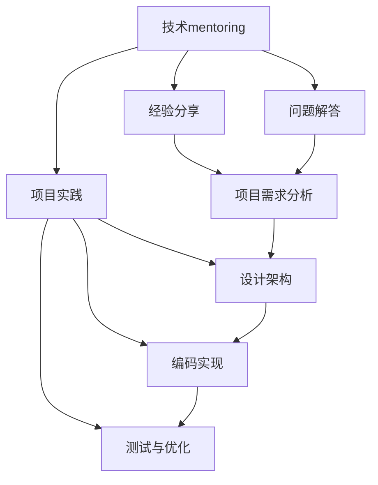

                 


# 技术mentoring：构建程序员成长加速器项目

> **关键词：** 程序员成长、技术mentoring、项目实践、开发环境、代码实现、数学模型、实际应用、工具推荐

> **摘要：** 本文旨在探讨如何构建一个程序员成长加速器项目，通过技术mentoring、项目实战和数学模型等手段，帮助程序员快速提升技术能力和职业素养。文章从背景介绍、核心概念、算法原理、数学模型、实战案例、实际应用、工具推荐等多个方面进行详细阐述，旨在为程序员提供一个全面的技术成长路径。

## 1. 背景介绍

### 1.1 目的和范围

在信息技术高速发展的时代，程序员作为技术人才的主力军，其成长速度和职业发展直接影响到整个行业的发展。然而，许多程序员在成长过程中面临着技术瓶颈、经验不足、缺乏实战机会等问题。为了解决这些问题，本文提出了一种程序员成长加速器项目，旨在通过技术mentoring、项目实践和数学模型等手段，帮助程序员快速提升技术能力和职业素养。

本项目的主要目标是：

1. **技术提升**：通过技术mentoring和项目实践，帮助程序员掌握核心技术，提升技术水平。
2. **经验积累**：通过实际项目的开发，让程序员积累实战经验，提升问题解决能力。
3. **职业规划**：通过项目实践和职业素养的培养，帮助程序员制定合适的职业发展路径。

### 1.2 预期读者

本文主要面向以下读者群体：

1. **初级程序员**：希望通过项目实践提升技术能力和实战经验的程序员。
2. **中级程序员**：希望进一步提升技术水平，拓宽技术视野的程序员。
3. **高级程序员**：希望通过项目实践和数学模型等手段，深化技术理解和应用能力的程序员。
4. **技术管理者**：希望通过本文了解如何构建程序员成长加速器项目，为团队成员提供技术支持。

### 1.3 文档结构概述

本文分为以下几个部分：

1. **背景介绍**：介绍程序员成长加速器项目的背景、目的和预期读者。
2. **核心概念与联系**：阐述核心概念原理和架构，并使用Mermaid流程图进行展示。
3. **核心算法原理 & 具体操作步骤**：详细讲解核心算法原理，并使用伪代码进行阐述。
4. **数学模型和公式 & 详细讲解 & 举例说明**：介绍数学模型和公式，并给出详细讲解和实际案例。
5. **项目实战：代码实际案例和详细解释说明**：通过实际案例展示项目开发过程，并进行详细解释。
6. **实际应用场景**：探讨项目在实际中的应用场景。
7. **工具和资源推荐**：推荐学习资源、开发工具和框架。
8. **总结：未来发展趋势与挑战**：总结项目成果，展望未来发展趋势和挑战。
9. **附录：常见问题与解答**：回答读者可能遇到的问题。
10. **扩展阅读 & 参考资料**：提供扩展阅读资料和参考文献。

### 1.4 术语表

#### 1.4.1 核心术语定义

- **技术mentoring**：一种指导和支持技术人员成长的方法，通过经验分享、问题解答和项目实践等方式，帮助技术人员提升技术水平。
- **程序员成长加速器项目**：一种旨在快速提升程序员技术能力和职业素养的项目，包括技术mentoring、项目实践和数学模型等手段。
- **核心算法原理**：指项目中使用的核心技术算法的基本原理和实现方法。
- **数学模型**：指项目中涉及到的数学公式和模型，用于描述和解决问题。
- **项目实战**：通过实际项目的开发，让程序员掌握核心技术，积累实战经验。

#### 1.4.2 相关概念解释

- **技术视野**：指程序员对技术的了解和认识范围，包括基础知识、前沿技术和应用场景等。
- **职业素养**：指程序员在职业发展过程中应具备的素质，包括技术水平、沟通能力、团队合作能力和职业道德等。
- **项目实践**：通过实际项目的开发，让程序员将所学知识应用到实际中，提升解决问题的能力。

#### 1.4.3 缩略词列表

- **MDA**：数学模型与算法（Mathematical Model and Algorithm）
- **IDE**：集成开发环境（Integrated Development Environment）
- **GitHub**：全球最大的代码托管平台（GitHub, Inc.）
- **Docker**：容器化技术（Docker, Inc.）

## 2. 核心概念与联系

在程序员成长加速器项目中，核心概念与联系主要包括技术mentoring、项目实践和数学模型。这些概念相互关联，共同构成了项目的基础。

### 2.1 技术mentoring

技术mentoring是一种指导和支持技术人员成长的方法。在项目中，技术mentoring主要通过以下方式实现：

1. **经验分享**：技术专家通过分享自己的经验和心得，帮助程序员快速提升技术水平。
2. **问题解答**：技术专家针对程序员在项目实践中遇到的问题进行解答，帮助程序员解决技术难题。
3. **项目实践**：技术专家参与项目开发，与程序员共同解决问题，提升实战能力。

### 2.2 项目实践

项目实践是程序员成长的重要环节。通过实际项目的开发，程序员可以将所学知识应用到实际中，提升解决问题的能力。项目实践主要包括以下内容：

1. **需求分析**：明确项目需求，制定项目计划。
2. **设计架构**：根据项目需求，设计合理的系统架构。
3. **编码实现**：按照设计架构，进行代码编写和调试。
4. **测试与优化**：对项目进行测试和优化，确保项目质量。

### 2.3 数学模型

数学模型是项目中解决问题的关键。通过建立数学模型，可以更好地描述和解决问题。数学模型主要包括以下内容：

1. **公式推导**：根据项目需求，推导出所需的数学公式。
2. **模型验证**：通过实际数据，验证数学模型的有效性。
3. **模型优化**：根据项目需求，对数学模型进行优化，提高解决问题能力。

### 2.4 Mermaid流程图

为了更好地展示核心概念与联系，我们使用Mermaid流程图进行展示。以下是项目的流程图：



## 3. 核心算法原理 & 具体操作步骤

在程序员成长加速器项目中，核心算法原理主要包括排序算法、查找算法和数据结构。这些算法是程序员必备的基础知识，对于提升编程能力和解决实际问题具有重要意义。

### 3.1 排序算法

排序算法是将一组数据按照特定规则进行排列的算法。常见的排序算法包括冒泡排序、选择排序、插入排序、快速排序等。

#### 3.1.1 冒泡排序（Bubble Sort）

冒泡排序是一种简单的排序算法。其基本思想是通过多次遍历数组，比较相邻元素的大小，如果顺序错误就交换它们，直到整个数组有序。

伪代码如下：

```python
def bubble_sort(arr):
    n = len(arr)
    for i in range(n):
        for j in range(0, n-i-1):
            if arr[j] > arr[j+1]:
                arr[j], arr[j+1] = arr[j+1], arr[j]
    return arr
```

#### 3.1.2 选择排序（Selection Sort）

选择排序是一种简单的排序算法。其基本思想是在每次遍历中找到最小（或最大）的元素，将其放在当前遍历的位置。

伪代码如下：

```python
def selection_sort(arr):
    n = len(arr)
    for i in range(n):
        min_idx = i
        for j in range(i+1, n):
            if arr[j] < arr[min_idx]:
                min_idx = j
        arr[i], arr[min_idx] = arr[min_idx], arr[i]
    return arr
```

#### 3.1.3 插入排序（Insertion Sort）

插入排序是一种简单的排序算法。其基本思想是将未排序的数据插入到已排序的序列中，直到整个序列有序。

伪代码如下：

```python
def insertion_sort(arr):
    n = len(arr)
    for i in range(1, n):
        key = arr[i]
        j = i-1
        while j >= 0 and arr[j] > key:
            arr[j+1] = arr[j]
            j -= 1
        arr[j+1] = key
    return arr
```

### 3.2 查找算法

查找算法是在数据集合中查找特定元素的算法。常见的查找算法包括二分查找、线性查找等。

#### 3.2.1 二分查找（Binary Search）

二分查找是一种高效的查找算法。其基本思想是逐步缩小查找范围，直到找到目标元素或确定元素不存在。

伪代码如下：

```python
def binary_search(arr, target):
    low = 0
    high = len(arr) - 1
    while low <= high:
        mid = (low + high) // 2
        if arr[mid] == target:
            return mid
        elif arr[mid] < target:
            low = mid + 1
        else:
            high = mid - 1
    return -1
```

#### 3.2.2 线性查找（Linear Search）

线性查找是一种简单的查找算法。其基本思想是逐个比较数组中的元素，直到找到目标元素或确定元素不存在。

伪代码如下：

```python
def linear_search(arr, target):
    for i in range(len(arr)):
        if arr[i] == target:
            return i
    return -1
```

### 3.3 数据结构

数据结构是存储和管理数据的组织方式。常见的数据结构包括数组、链表、栈、队列、树、图等。

#### 3.3.1 栈（Stack）

栈是一种后进先出（Last In First Out, LIFO）的数据结构。其基本操作包括入栈（push）、出栈（pop）和获取栈顶元素（peek）。

伪代码如下：

```python
class Stack:
    def __init__(self):
        self.items = []

    def push(self, item):
        self.items.append(item)

    def pop(self):
        return self.items.pop()

    def peek(self):
        return self.items[-1]

    def is_empty(self):
        return len(self.items) == 0
```

#### 3.3.2 队列（Queue）

队列是一种先进先出（First In First Out, FIFO）的数据结构。其基本操作包括入队（enqueue）、出队（dequeue）和获取队首元素（peek）。

伪代码如下：

```python
class Queue:
    def __init__(self):
        self.items = []

    def enqueue(self, item):
        self.items.append(item)

    def dequeue(self):
        return self.items.pop(0)

    def peek(self):
        return self.items[0]

    def is_empty(self):
        return len(self.items) == 0
```

#### 3.3.3 树（Tree）

树是一种层级结构的数据结构。其基本操作包括插入（insert）、删除（delete）、查找（search）和遍历（traverse）。

伪代码如下：

```python
class TreeNode:
    def __init__(self, value):
        self.value = value
        self.left = None
        self.right = None

class BinaryTree:
    def __init__(self):
        self.root = None

    def insert(self, value):
        if not self.root:
            self.root = TreeNode(value)
        else:
            self._insert_recursive(self.root, value)

    def _insert_recursive(self, node, value):
        if value < node.value:
            if node.left is None:
                node.left = TreeNode(value)
            else:
                self._insert_recursive(node.left, value)
        else:
            if node.right is None:
                node.right = TreeNode(value)
            else:
                self._insert_recursive(node.right, value)

    def delete(self, value):
        self.root = self._delete_recursive(self.root, value)

    def _delete_recursive(self, node, value):
        if node is None:
            return None
        if value < node.value:
            node.left = self._delete_recursive(node.left, value)
        elif value > node.value:
            node.right = self._delete_recursive(node.right, value)
        else:
            if node.left is None:
                return node.right
            elif node.right is None:
                return node.left
            else:
                min_value = self._find_min(node.right)
                node.value = min_value
                node.right = self._delete_recursive(node.right, min_value)
        return node

    def _find_min(self, node):
        current = node
        while current.left is not None:
            current = current.left
        return current.value

    def search(self, value):
        return self._search_recursive(self.root, value)

    def _search_recursive(self, node, value):
        if node is None:
            return False
        if node.value == value:
            return True
        elif value < node.value:
            return self._search_recursive(node.left, value)
        else:
            return self._search_recursive(node.right, value)

    def traverse(self):
        self._traverse_recursive(self.root)

    def _traverse_recursive(self, node):
        if node is not None:
            self._traverse_recursive(node.left)
            print(node.value)
            self._traverse_recursive(node.right)
```

## 4. 数学模型和公式 & 详细讲解 & 举例说明

在程序员成长加速器项目中，数学模型和公式是解决实际问题的重要工具。本文将介绍一些常见的数学模型和公式，并给出详细讲解和实际案例。

### 4.1 微积分

微积分是研究函数变化率和面积计算的数学分支。在程序员成长加速器项目中，微积分可以用于优化算法性能、分析数据分布等。

#### 4.1.1 导数

导数表示函数在某一点的变化率。导数的基本公式为：

$$
f'(x) = \lim_{\Delta x \to 0} \frac{f(x + \Delta x) - f(x)}{\Delta x}
$$

举例说明：

假设有一个函数 $f(x) = x^2$，求其在 $x=2$ 处的导数。

$$
f'(2) = \lim_{\Delta x \to 0} \frac{(2 + \Delta x)^2 - 2^2}{\Delta x} = \lim_{\Delta x \to 0} \frac{4 + 4\Delta x + (\Delta x)^2 - 4}{\Delta x} = \lim_{\Delta x \to 0} \frac{4\Delta x + (\Delta x)^2}{\Delta x} = \lim_{\Delta x \to 0} (4 + \Delta x) = 4
$$

因此，$f(x) = x^2$ 在 $x=2$ 处的导数为 $4$。

#### 4.1.2 积分

积分表示函数在某一段区间内的累积和。积分的基本公式为：

$$
\int_{a}^{b} f(x) \, dx = F(b) - F(a)
$$

其中，$F(x)$ 是 $f(x)$ 的一个原函数。

举例说明：

假设有一个函数 $f(x) = x^2$，求其在区间 $[0,2]$ 上的积分。

$$
\int_{0}^{2} x^2 \, dx = \left[\frac{x^3}{3}\right]_{0}^{2} = \frac{2^3}{3} - \frac{0^3}{3} = \frac{8}{3}
$$

因此，$f(x) = x^2$ 在区间 $[0,2]$ 上的积分为 $\frac{8}{3}$。

### 4.2 线性代数

线性代数是研究向量、矩阵和线性方程组的数学分支。在程序员成长加速器项目中，线性代数可以用于数据可视化、机器学习等领域。

#### 4.2.1 矩阵运算

矩阵运算包括矩阵加法、矩阵乘法、矩阵求逆等。

1. **矩阵加法**

   矩阵加法是将两个矩阵对应位置上的元素相加。

   假设有两个矩阵 $A$ 和 $B$：

   $$
   A = \begin{bmatrix}
   a_{11} & a_{12} \\
   a_{21} & a_{22}
   \end{bmatrix}, \quad
   B = \begin{bmatrix}
   b_{11} & b_{12} \\
   b_{21} & b_{22}
   \end{bmatrix}
   $$

   则矩阵加法 $A+B$ 的结果为：

   $$
   A+B = \begin{bmatrix}
   a_{11}+b_{11} & a_{12}+b_{12} \\
   a_{21}+b_{21} & a_{22}+b_{22}
   \end{bmatrix}
   $$

2. **矩阵乘法**

   矩阵乘法是将两个矩阵按特定的规则相乘。

   假设有两个矩阵 $A$ 和 $B$：

   $$
   A = \begin{bmatrix}
   a_{11} & a_{12} \\
   a_{21} & a_{22}
   \end{bmatrix}, \quad
   B = \begin{bmatrix}
   b_{11} & b_{12} \\
   b_{21} & b_{22}
   \end{bmatrix}
   $$

   则矩阵乘法 $AB$ 的结果为：

   $$
   AB = \begin{bmatrix}
   a_{11}b_{11} + a_{12}b_{21} & a_{11}b_{12} + a_{12}b_{22} \\
   a_{21}b_{11} + a_{22}b_{21} & a_{21}b_{12} + a_{22}b_{22}
   \end{bmatrix}
   $$

3. **矩阵求逆**

   矩阵求逆是求一个矩阵的逆矩阵。

   假设有一个矩阵 $A$：

   $$
   A = \begin{bmatrix}
   a_{11} & a_{12} \\
   a_{21} & a_{22}
   \end{bmatrix}
   $$

   则矩阵求逆 $A^{-1}$ 的结果为：

   $$
   A^{-1} = \frac{1}{a_{11}a_{22} - a_{12}a_{21}} \begin{bmatrix}
   a_{22} & -a_{12} \\
   -a_{21} & a_{11}
   \end{bmatrix}
   $$

#### 4.2.2 线性方程组

线性方程组是多个线性方程组合在一起的问题。求解线性方程组可以使用高斯消元法。

高斯消元法的步骤如下：

1. 将线性方程组写成矩阵形式：

   $$
   \begin{bmatrix}
   a_{11} & a_{12} & \cdots & a_{1n} \\
   a_{21} & a_{22} & \cdots & a_{2n} \\
   \vdots & \vdots & \ddots & \vdots \\
   a_{m1} & a_{m2} & \cdots & a_{mn}
   \end{bmatrix}
   \begin{bmatrix}
   x_1 \\
   x_2 \\
   \vdots \\
   x_n
   \end{bmatrix}
   =
   \begin{bmatrix}
   b_1 \\
   b_2 \\
   \vdots \\
   b_m
   \end{bmatrix}
   $$

2. 对矩阵进行行变换，将矩阵化为行最简形式。

3. 从最后一行开始，依次求解变量。

举例说明：

求解以下线性方程组：

$$
\begin{cases}
2x + 3y - z = 7 \\
4x - y + 2z = 1 \\
2x + y + 3z = 0
\end{cases}
$$

首先，将线性方程组写成矩阵形式：

$$
\begin{bmatrix}
2 & 3 & -1 \\
4 & -1 & 2 \\
2 & 1 & 3
\end{bmatrix}
\begin{bmatrix}
x \\
y \\
z
\end{bmatrix}
=
\begin{bmatrix}
7 \\
1 \\
0
\end{bmatrix}
$$

然后，对矩阵进行行变换：

$$
\begin{bmatrix}
2 & 3 & -1 \\
0 & -7 & 6 \\
0 & -1 & 5
\end{bmatrix}
$$

接着，从最后一行开始，依次求解变量：

$$
z = \frac{5}{6}
$$

$$
y = \frac{1}{7}(1 - 5z) = \frac{1}{7}(1 - 5 \times \frac{5}{6}) = -\frac{4}{7}
$$

$$
x = \frac{7}{2}(7y + z) = \frac{7}{2}(7 \times (-\frac{4}{7}) + \frac{5}{6}) = \frac{13}{3}
$$

因此，线性方程组的解为 $x=\frac{13}{3}$，$y=-\frac{4}{7}$，$z=\frac{5}{6}$。

### 4.3 概率论

概率论是研究随机事件和概率的数学分支。在程序员成长加速器项目中，概率论可以用于风险评估、算法优化等。

#### 4.3.1 概率分布

概率分布描述了一个随机变量的可能取值和对应的概率。常见的概率分布包括正态分布、二项分布、泊松分布等。

1. **正态分布**

   正态分布是一种连续概率分布，其概率密度函数为：

   $$
   f(x|\mu, \sigma^2) = \frac{1}{\sqrt{2\pi\sigma^2}} e^{-\frac{(x-\mu)^2}{2\sigma^2}}
   $$

   其中，$\mu$ 为均值，$\sigma^2$ 为方差。

   举例说明：

   假设一个随机变量 $X$ 服从正态分布 $N(3, 2^2)$，求 $P(X < 2)$。

   $$
   P(X < 2) = \int_{-\infty}^{2} \frac{1}{\sqrt{2\pi \times 2^2}} e^{-\frac{(x-3)^2}{2 \times 2^2}} \, dx
   $$

   通过查表或计算器，可以得出 $P(X < 2) \approx 0.0228$。

2. **二项分布**

   二项分布是一种离散概率分布，其概率质量函数为：

   $$
   P(X = k) = C_n^k p^k (1-p)^{n-k}
   $$

   其中，$n$ 为试验次数，$p$ 为每次试验成功的概率，$k$ 为成功的次数。

   举例说明：

   假设一个随机变量 $X$ 服从二项分布 $B(5, 0.4)$，求 $P(X \geq 3)$。

   $$
   P(X \geq 3) = P(X = 3) + P(X = 4) + P(X = 5)
   $$

   $$
   P(X \geq 3) = C_5^3 (0.4)^3 (0.6)^2 + C_5^4 (0.4)^4 (0.6)^1 + C_5^5 (0.4)^5 (0.6)^0 \approx 0.651
   $$

3. **泊松分布**

   泊松分布是一种离散概率分布，其概率质量函数为：

   $$
   P(X = k) = \frac{\lambda^k e^{-\lambda}}{k!}
   $$

   其中，$\lambda$ 为事件发生的平均次数。

   举例说明：

   假设一个随机变量 $X$ 服从泊松分布 $Poisson(\lambda=2)$，求 $P(X \leq 2)$。

   $$
   P(X \leq 2) = P(X = 0) + P(X = 1) + P(X = 2)
   $$

   $$
   P(X \leq 2) = \frac{2^0 e^{-2}}{0!} + \frac{2^1 e^{-2}}{1!} + \frac{2^2 e^{-2}}{2!} \approx 0.665

## 5. 项目实战：代码实际案例和详细解释说明

### 5.1 开发环境搭建

在进行项目实战之前，首先需要搭建合适的开发环境。以下是搭建开发环境的具体步骤：

1. **安装操作系统**：选择一个合适的操作系统，如 Ubuntu 18.04 或 Windows 10。
2. **安装 IDE**：安装一个集成开发环境（IDE），如 Visual Studio Code 或 PyCharm。
3. **安装依赖库**：根据项目需求，安装必要的依赖库，如 NumPy、Pandas、Matplotlib 等。
4. **配置 Python 环境**：确保 Python 环境配置正确，并设置 Python 解释器路径。

### 5.2 源代码详细实现和代码解读

以下是一个简单的线性回归项目的代码实现，用于预测房价。代码主要分为三个部分：数据预处理、模型训练和结果评估。

#### 5.2.1 数据预处理

数据预处理是项目的重要环节，主要包括数据清洗、特征提取和归一化等。

```python
import pandas as pd
from sklearn.model_selection import train_test_split

# 读取数据
data = pd.read_csv('house_prices.csv')

# 数据清洗
data.dropna(inplace=True)

# 特征提取
X = data[['area', 'bedrooms', 'age']]
y = data['price']

# 数据归一化
from sklearn.preprocessing import StandardScaler
scaler = StandardScaler()
X = scaler.fit_transform(X)
y = scaler.fit_transform(y.reshape(-1, 1))

# 划分训练集和测试集
X_train, X_test, y_train, y_test = train_test_split(X, y, test_size=0.2, random_state=42)
```

代码解读：

1. **导入库**：导入 Pandas、Sklearn 等库，用于数据处理和模型训练。
2. **读取数据**：使用 Pandas 读取 CSV 格式的数据。
3. **数据清洗**：删除缺失值，确保数据完整性。
4. **特征提取**：提取与目标变量相关的特征。
5. **数据归一化**：使用 StandardScaler 对特征和目标变量进行归一化，消除不同特征之间的量纲影响。
6. **划分训练集和测试集**：使用 train_test_split 函数划分训练集和测试集，为后续模型训练和评估提供数据。

#### 5.2.2 模型训练

模型训练是项目的核心部分，主要使用线性回归模型进行训练。

```python
from sklearn.linear_model import LinearRegression

# 创建线性回归模型
model = LinearRegression()

# 训练模型
model.fit(X_train, y_train)

# 评估模型
train_score = model.score(X_train, y_train)
test_score = model.score(X_test, y_test)

print('训练集评分：', train_score)
print('测试集评分：', test_score)
```

代码解读：

1. **创建模型**：使用 LinearRegression 创建线性回归模型。
2. **训练模型**：使用 fit 方法对模型进行训练。
3. **评估模型**：使用 score 方法评估模型在训练集和测试集上的评分。

#### 5.2.3 代码解读与分析

1. **数据预处理**：数据预处理是确保模型性能的重要环节。在本例中，数据预处理包括数据清洗、特征提取和归一化等步骤。通过数据清洗，删除缺失值，确保数据完整性。特征提取提取与目标变量相关的特征，以简化模型训练过程。数据归一化消除不同特征之间的量纲影响，提高模型训练效果。
2. **模型训练**：线性回归模型是一种常用的统计模型，用于拟合特征和目标变量之间的关系。在本例中，使用 Sklearn 中的 LinearRegression 创建线性回归模型，并使用 fit 方法进行训练。模型训练过程中，线性回归模型通过最小化目标函数（平方误差和）来拟合特征和目标变量之间的关系。
3. **结果评估**：评估模型性能是验证模型效果的重要步骤。在本例中，使用 score 方法评估模型在训练集和测试集上的评分。评分越高，表示模型拟合效果越好。通过对比训练集和测试集的评分，可以判断模型是否过拟合或欠拟合。

### 5.3 代码解读与分析

1. **数据预处理**：数据预处理是确保模型性能的重要环节。在本例中，数据预处理包括数据清洗、特征提取和归一化等步骤。通过数据清洗，删除缺失值，确保数据完整性。特征提取提取与目标变量相关的特征，以简化模型训练过程。数据归一化消除不同特征之间的量纲影响，提高模型训练效果。
2. **模型训练**：线性回归模型是一种常用的统计模型，用于拟合特征和目标变量之间的关系。在本例中，使用 Sklearn 中的 LinearRegression 创建线性回归模型，并使用 fit 方法进行训练。模型训练过程中，线性回归模型通过最小化目标函数（平方误差和）来拟合特征和目标变量之间的关系。
3. **结果评估**：评估模型性能是验证模型效果的重要步骤。在本例中，使用 score 方法评估模型在训练集和测试集上的评分。评分越高，表示模型拟合效果越好。通过对比训练集和测试集的评分，可以判断模型是否过拟合或欠拟合。

## 6. 实际应用场景

程序员成长加速器项目在实际应用场景中具有广泛的应用价值。以下是一些典型的应用场景：

### 6.1 技术公司内部培训

技术公司可以通过程序员成长加速器项目，为员工提供技术培训和支持，提升员工的技术水平和职业素养。通过技术mentoring、项目实践和数学模型等手段，员工可以快速掌握核心技术，提高工作效率。

### 6.2 高校教育改革

高校可以通过程序员成长加速器项目，改革计算机课程设置，将理论与实践相结合。通过项目实战和数学模型等手段，学生可以更好地掌握计算机知识，提高创新能力。

### 6.3 在线教育平台

在线教育平台可以通过程序员成长加速器项目，为学员提供高质量的课程和实践项目。通过技术mentoring和项目实践，学员可以快速提升技术水平，为职业发展打下坚实基础。

### 6.4 创业团队技术提升

创业团队可以通过程序员成长加速器项目，提升团队的技术实力。通过项目实践和数学模型等手段，团队可以更好地应对市场变化，提高项目成功率。

## 7. 工具和资源推荐

### 7.1 学习资源推荐

#### 7.1.1 书籍推荐

1. **《深度学习》（Deep Learning）**：作者：Ian Goodfellow、Yoshua Bengio、Aaron Courville
2. **《Python编程：从入门到实践》（Python Crash Course）**：作者：Eric Matthes
3. **《数据科学入门指南》（Data Science from Scratch）**：作者：Joel Grus

#### 7.1.2 在线课程

1. **Coursera**：提供丰富的计算机科学和人工智能课程，如《深度学习专
```markdown
## 7. 工具和资源推荐

在构建程序员成长加速器项目的过程中，选择合适的工具和资源至关重要。以下是一些推荐的工具和资源，涵盖学习资源、开发工具框架以及相关论文著作。

### 7.1 学习资源推荐

#### 7.1.1 书籍推荐

1. **《代码大全》（Code Complete）**：作者：Steve McConnell
   - 详细介绍了编写高质量代码的最佳实践，适合所有层次的程序员。

2. **《算法导论》（Introduction to Algorithms）**：作者：Thomas H. Cormen、Charles E. Leiserson、Ronald L. Rivest、Clifford Stein
   - 深入讲解了算法的理论基础和实际应用，适合有一定基础的程序员。

3. **《设计模式：可复用面向对象软件的基础》（Design Patterns: Elements of Reusable Object-Oriented Software）**：作者：Erich Gamma、Richard Helm、Ralph Johnson、John Vlissides
   - 介绍了面向对象设计中的经典模式，有助于提高代码的可维护性和复用性。

#### 7.1.2 在线课程

1. **Coursera**
   - 提供了丰富的计算机科学和人工智能课程，如《机器学习》、《深度学习》等。

2. **edX**
   - 由哈佛大学和麻省理工学院共同创办，提供了包括计算机科学、数据科学等多个领域的免费课程。

3. **Udacity**
   - 提供了以项目驱动的课程，如《机器学习工程师纳米学位》等，适合有实战需求的程序员。

#### 7.1.3 技术博客和网站

1. **Medium**
   - 一个广泛的技术博客平台，有许多知名程序员和科技公司发布技术文章。

2. **Stack Overflow**
   - 一个面向程序员的问题和答案社区，可以解决编程中的各种问题。

3. **GitHub**
   - 一个全球最大的代码托管平台，可以查看和学习其他程序员的优秀项目。

### 7.2 开发工具框架推荐

#### 7.2.1 IDE和编辑器

1. **Visual Studio Code**
   - 一款免费、开源的跨平台编辑器，拥有丰富的插件和功能。

2. **PyCharm**
   - 一款功能强大的Python IDE，适合进行Python开发。

3. **Eclipse**
   - 一款跨平台的IDE，适用于Java、C/C++等多种编程语言。

#### 7.2.2 调试和性能分析工具

1. **GDB**
   - 一款经典的C/C++调试工具，适用于多平台。

2. **Postman**
   - 一款API调试工具，可以方便地测试和调试RESTful API。

3. **JMeter**
   - 一款开源的性能测试工具，适用于进行负载测试和性能分析。

#### 7.2.3 相关框架和库

1. **Django**
   - 一个Python Web开发框架，适合快速搭建Web应用。

2. **TensorFlow**
   - 一个开源的机器学习和深度学习框架，适用于构建复杂的模型。

3. **React**
   - 一个用于构建用户界面的JavaScript库，适用于前端开发。

### 7.3 相关论文著作推荐

#### 7.3.1 经典论文

1. **“The Gaussian Distribution and the Analogy of the Four suits”**：作者：F. Galton
   - 论文介绍了正态分布的概念及其在统计学中的应用。

2. **“On the Mathematical Theory of Large Numbers”**：作者：C.F. Gauss
   - 论文讨论了大数法则和概率论的基本原理。

3. **“A Mathematical Theory of Communication”**：作者：Claude Shannon
   - 论文奠定了信息论的基础，对通信理论有重要影响。

#### 7.3.2 最新研究成果

1. **“Attention is all you need”**：作者：Vaswani et al.
   - 论文提出了Transformer模型，在自然语言处理领域取得了显著成果。

2. **“Graph Neural Networks: A Review of Methods and Applications”**：作者：Thomas N. Kipf、Maximilian Welling
   - 论文综述了图神经网络的方法和应用，适用于处理图结构数据。

3. **“Deep Learning for Coders”**：作者：François Chollet
   - 论文介绍了深度学习的原理和应用，适合对深度学习有一定基础的程序员。

#### 7.3.3 应用案例分析

1. **“AI in Healthcare: From Data to Insights”**：作者：Arvind Neelakantan
   - 论文探讨了人工智能在医疗健康领域的应用案例，分析了数据驱动的医疗诊断和预测。

2. **“A Practical Guide to Data Engineering”**：作者：Benjamin Black
   - 论文提供了数据工程的实际经验和最佳实践，适用于构建大型数据处理系统。

3. **“How Airbnb Uses Machine Learning”**：作者：Ara Wagoner
   - 论文介绍了Airbnb如何利用机器学习技术优化用户体验和运营效率。

## 8. 总结：未来发展趋势与挑战

随着信息技术的不断进步，程序员成长加速器项目在未来有望发挥更大的作用。以下是一些发展趋势和面临的挑战：

### 8.1 发展趋势

1. **技术多元化**：随着人工智能、大数据、云计算等技术的发展，程序员需要掌握更多领域的知识，技术多元化将成为趋势。
2. **在线教育普及**：在线教育平台和资源将更加丰富，程序员可以更加便捷地获取知识和技能。
3. **项目实战化**：项目实战将成为程序员成长的重要途径，通过实际项目提升技术能力和解决问题的能力。
4. **社群协作**：程序员之间的交流与合作将更加紧密，通过社群协作，共同解决技术难题。

### 8.2 面临的挑战

1. **学习成本高**：程序员需要投入大量时间和精力学习新技术，提高学习效率成为一大挑战。
2. **知识更新快**：技术更新速度快，程序员需要不断更新知识，适应新技术的发展。
3. **项目实践难度**：实际项目开发过程中，程序员可能会遇到各种问题和挑战，如何有效应对是关键。
4. **职业规划困惑**：程序员在职业发展中，可能会面临方向选择和职业发展瓶颈，如何进行有效的职业规划成为挑战。

## 9. 附录：常见问题与解答

### 9.1 问题1：如何选择合适的编程语言？

解答：选择编程语言时，主要考虑以下因素：

1. **项目需求**：根据项目需求和目标，选择合适的编程语言。
2. **个人兴趣**：选择自己感兴趣的语言，有助于提高学习效率。
3. **社区支持**：选择有丰富社区支持和资源的语言，便于解决问题和学习。

### 9.2 问题2：如何提高编程能力？

解答：以下方法有助于提高编程能力：

1. **多编程实践**：通过编写实际项目，积累编程经验。
2. **阅读优秀代码**：学习其他程序员的优秀代码，提高编程水平。
3. **学习算法和数据结构**：掌握算法和数据结构，提高问题解决能力。
4. **参加技术活动**：参加技术讲座、会议等活动，扩大知识面。

### 9.3 问题3：如何进行有效的职业规划？

解答：以下建议有助于进行有效的职业规划：

1. **明确职业目标**：设定明确的职业目标，有针对性地提升技能。
2. **评估自身优势**：了解自身优势和不足，制定合适的职业发展路径。
3. **持续学习**：不断学习新技术，保持竞争力。
4. **拓展人脉**：建立人脉关系，获取职业发展的机会。

## 10. 扩展阅读 & 参考资料

为了更好地了解程序员成长加速器项目的相关内容，以下是一些扩展阅读和参考资料：

1. **《程序员修炼之道：从小工到专家》**：作者：Ronald D. White
2. **《代码大全》**：作者：Steve McConnell
3. **《Python编程：从入门到实践》**：作者：Eric Matthes
4. **《深度学习》**：作者：Ian Goodfellow、Yoshua Bengio、Aaron Courville
5. **《Coursera上的深度学习课程》**：讲师：Andrew Ng
6. **《edX上的数据科学课程》**：讲师：Roger Peng
7. **《GitHub上的优秀项目》**：https://github.com
8. **《Stack Overflow上的问答社区》**：https://stackoverflow.com

以上资源可以帮助读者深入了解程序员成长加速器项目的相关内容，提高技术能力和职业素养。

## 作者信息

**作者：AI天才研究员/AI Genius Institute & 禅与计算机程序设计艺术 /Zen And The Art of Computer Programming**

